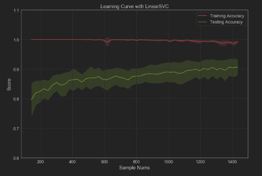
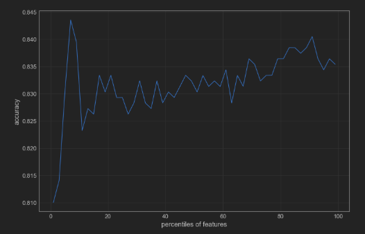

```python
import numpy as np
import pandas as pd
import seaborn as sns
import matplotlib.pyplot as plt

from jupyterthemes import jtplot
jtplot.style()

%matplotlib inline

import warnings

warnings.filterwarnings('ignore')

plt.style.use('ggplot')
plt.rcParams['font.sans-serif'] = 'SimHei'
plt.rcParams['axes.unicode_minus'] = False
```


# model_selection

> 数据集切分的通用参数：

- random_state：一个整数或者一个RandomState实例，或者None，指定随机数种子。
  - 如果为整数，则它指定了随机数生成器的种子。
  - 如果为RandomState实例，则指定了随机数生成器。
  - 如果为None，则使用默认的随机数生成器。
- X：样本集合。通常是一个numpy array，每行代表一个样本，每列代表一个特征。
- y：样本的标签集合。它与X 的每一行相对应。
- groups：样本的分组标记集合。它与 X 的每一行相对应，用于训练集、测试集的拆分。


## train_test_split

1. train_test_split用于将数据集切分成训练集和测试集，其原型为：

```python
sklearn.model_selection.train_test_split(*arrays, **options)
```

> 返回值：

- 一个列表，依次给出一个或者多个数据集的划分的结果。每个数据集都划分为两部分：训练集、测试集。


> 参数：

- \*arrays：一个或者多个数组，代表被拆分的一些数据集。
- test_size：一个浮点数，整数或者None，指定测试集大小。
  - 浮点数：必须是0.0 到 1.0 之间的数，代表测试集占原始数据集的比例。
  - 整数：代表测试集大小。
  - None：如果训练集大小也指定为None，则test_size设为 0.25。
- train_size：一个浮点数，整数或者None，指定训练集大小。
  - 浮点数：必须是0.0 到 1.0 之间的数，代表训练集占原始数据集的比例。
  - 整数：代表训练集大小。
  - None：如果测试集大小也指定为None，则test_size设为 0.75。
- random_state：指定随机数种子。
- stratify：一个数组对象或者None。如果它不是None，则原始数据会分层采样，采样的标记数组就由该参数指定。

```python
from sklearn.model_selection import train_test_split
from sklearn.datasets import load_iris

iris = load_iris()
x_train, x_test, y_train, y_test = train_test_split(iris.data,
                                                    iris.target,
                                                    test_size=0.25,
                                                    random_state=33)

x_train, x_test, y_train, y_test
```

> 输出


    (array([[5. , 2.3, 3.3, 1. ],
            [4.9, 3.1, 1.5, 0.2],
            [6.3, 2.3, 4.4, 1.3],
            [5.8, 2.6, 4. , 1.2],
            [6.2, 2.9, 4.3, 1.3],
            [4.7, 3.2, 1.3, 0.2],
            [4.6, 3.4, 1.4, 0.3],
            [5.4, 3.4, 1.7, 0.2]]), 
    array([[5.7, 2.9, 4.2, 1.3],
            [6.7, 3.1, 4.4, 1.4],
            [4.7, 3.2, 1.6, 0.2],
            [6.5, 2.8, 4.6, 1.5],
            [6.1, 2.6, 5.6, 1.4],
            [5.8, 2.7, 5.1, 1.9],
            [5.7, 3. , 4.2, 1.2]]), 
    array([1, 0, 1, 1,, 1, 0, 0, 2, 0]), 
    array([1, 1, 0, 1, 2, 2,  2, 1]))


## KFold

> KFold类实现了数据集的  折交叉切分。其原型为：

```python
sklearn.model_selection.KFold(
	n_splits=3, 
	shuffle=False, 
	random_state=None)
```
> `参数`

- n_splits：一个整数，即 （要求该整数值大于等于 2）。
- shuffle：一个布尔值。如果为True，则在切分数据集之前先混洗数据集。
- random_state：指定随机数种子。


> 方法：

1. get_n_splits([X, y, groups]) ：返回n_splits参数。
	- 参数：其参数都被忽略，用于保持接口的兼容性。
2. split(X[, y, groups])：切分数据集为训练集和测试集。返回测试集的样本索引、训练集的样本索引。
	- X为训练数据集，形状为(n_samples,n_features)
	- y为标记信息，形状为(n_samples,)
	- groups：样本的分组标记，用于拆分。


```python
from sklearn.model_selection import KFold
from  sklearn.model_selection import cross_val_score
from sklearn.svm import SVC
from sklearn.datasets import load_iris

iris = load_iris()

clf = SVC(kernel='linear', C=1)
my_cv = KFold(n_splits=5, random_state=0)

for train_index, test_index in my_cv.split(iris.data):
    print('train_index', train_index.shape, 'test_index', test_index.shape)
    
    
scores = cross_val_score(clf, iris.data, iris.target, cv=my_cv)

print('>>> 每次迭代的准确率:\n', scores)
print(">>> Accuracy:\n %0.4f (+/- %0.4f) " % (scores.mean(), scores.std() * 2))
```

## RepeatedKFold

p次k折交叉验证，在实际当中，我们只进行一次k折交叉验证还是不够的，我们需要进行多次，最典型的是：10次10折交叉验证，RepeatedKFold方法可以控制交叉验证的次数。

```python
from sklearn.model_selection import RepeatedKFold
from  sklearn.model_selection import cross_val_score
from sklearn.svm import SVC
from sklearn.datasets import load_iris

iris = load_iris()

clf = SVC(kernel='linear', C=1)
my_cv = RepeatedKFold(n_splits=5, n_repeats=2, random_state=0)

for train_index, test_index in my_cv.split(iris.data):
    print('train_index', train_index.shape, 'test_index', test_index.shape)
    
scores = cross_val_score(clf, iris.data, iris.target, cv=my_cv)

print('>>> 每次迭代的准确率:\n', scores)
print(">>> Accuracy:\n %0.4f (+/- %0.4f) " % (scores.mean(), scores.std() * 2))
```


## StratifiedKFold

>  StratifiedKFold类实现了数据集的分层采样  折交叉切分。其原型为：

```python
sklearn.model_selection.StratifiedKFold(
	n_splits=3, 
	shuffle=False, 
	random_state=None)
```
- 参数：参考KFold 
- 方法：参考KFold
- StratifiedKFold 的用法类似于KFold，但是StratifiedKFold执行的是分层采样：保证训练集、测试集中各类别样本的比例与原始数据集中相同


```python
from sklearn.model_selection import StratifiedKFold
from  sklearn.model_selection import cross_val_score
from sklearn.svm import SVC
from sklearn.datasets import load_iris

iris = load_iris()

clf = SVC(kernel='linear', C=1)
my_cv = StratifiedKFold(n_splits=3)  # 各个类别的比例大致和完整数据集中相同

for train_index, test_index in my_cv.split(iris.data, iris.target):
    print('train_index', train_index.shape, 'test_index', test_index.shape)
    
scores = cross_val_score(clf, iris.data, iris.target, cv=my_cv)

print('>>> 每次迭代的准确率:\n', scores)
print(">>> Accuracy:\n %0.4f (+/- %0.4f) " % (scores.mean(), scores.std() * 2))
```


## StratifiedShuffleSplit

```python
from sklearn.model_selection import StratifiedShuffleSplit
from  sklearn.model_selection import cross_val_score
from sklearn.svm import SVC
from sklearn.datasets import load_iris

iris = load_iris()

clf = SVC(kernel='linear', C=1)
my_cv = StratifiedShuffleSplit(n_splits=5)  # 各个类别的比例大致和完整数据集中相同

for train_index, test_index in my_cv.split(iris.data, iris.target):
    print('train_index', train_index.shape, 'test_index', test_index.shape)
    
scores = cross_val_score(clf, iris.data, iris.target, cv=my_cv)

print('>>> 每次迭代的准确率:\n', scores)
print(">>> Accuracy:\n %0.4f (+/- %0.4f) " % (scores.mean(), scores.std() * 2))
```


> 其它特殊情况的数据划分方法
>
> 1：对于分组数据来说，它的划分方法是不一样的，主要的方法有 GroupKFold，LeaveOneGroupOut，LeavePGroupOut，GroupShuffleSplit 
> 2：对于时间关联的数据，方法有TimeSeriesSplit

## GroupKFold

```python
from sklearn.model_selection import GroupKFold

X = [0.1, 0.2, 2.2, 2.4, 2.3, 4.55, 5.8, 8.8, 9, 10]
y = ["a", "b", "b", "b", "c", "c", "c", "d", "d", "d"]
groups = [1, 1, 1, 2, 2, 2, 3, 3, 3, 3]

# k折分组
gkf = GroupKFold(n_splits=3)  # 训练集和测试集属于不同的组
for train, test in gkf.split(X, y, groups=groups):
    print("组 k-fold分割：%s %s" % (train, test))
```


## LeaveOneGroupOut

```python
from sklearn.model_selection import LeaveOneGroupOut

X = [0.1, 0.2, 2.2, 2.4, 2.3, 4.55, 5.8, 8.8, 9, 10]
y = ["a", "b", "b", "b", "c", "c", "c", "d", "d", "d"]
groups = [1, 1, 1, 2, 2, 2, 3, 3, 3, 3]

# 留一分组
logo = LeaveOneGroupOut()
for train, test in logo.split(X, y, groups=groups):
    print("留一组分割：%s %s" % (train, test))
```


## LeavePGroupsOut

```python
from sklearn.model_selection import LeavePGroupsOut

X = [0.1, 0.2, 2.2, 2.4, 2.3, 4.55, 5.8, 8.8, 9, 10]
y = ["a", "b", "b", "b", "c", "c", "c", "d", "d", "d"]
groups = [1, 1, 1, 2, 2, 2, 3, 3, 3, 3]

# 留p分组
lpgo = LeavePGroupsOut(n_groups=2)
for train, test in lpgo.split(X, y, groups=groups):
    print("留 P 组分割：%s %s" % (train, test))
```


## GroupShuffleSplit

```python
from sklearn.model_selection import GroupShuffleSplit

X = [0.1, 0.2, 2.2, 2.4, 2.3, 4.55, 5.8, 8.8, 9, 10]
y = ["a", "b", "b", "b", "c", "c", "c", "d", "d", "d"]
groups = [1, 1, 1, 2, 2, 2, 3, 3, 3, 3]

# 随机分组
gss = GroupShuffleSplit(n_splits=4, test_size=0.5, random_state=0)
for train, test in gss.split(X, y, groups=groups):
    print("随机分割：%s %s" % (train, test))
```


## TimeSeriesSplit

```python
from sklearn.model_selection import TimeSeriesSplit
from sklearn.datasets import load_iris

iris = load_iris()
tscv = TimeSeriesSplit(max_train_size=None, n_splits=3)

for train, test in tscv.split(iris.data):
    print("时间序列分割：%s %s" % (train.shape, test.shape))
```


## LeaveOneOut

> LeaveOneOut 类实现了数据集的留一法拆分(简称LOO)。它是个生成器，其原型为：

```python
sklearn.model_selection.LeaveOneOut(n)
```
- 参数
	- n：一个整数，表示数据集大小。
- LeaveOneOut的用法很简单。它每次迭代时，依次取 0,1,...(n-1) 作为测试集样本的下标。
- 留一法是k折交叉验证当中，k=n（n为数据集个数）的情形

```python
from sklearn.model_selection import LeaveOneOut
from  sklearn.model_selection import cross_val_score
from sklearn.svm import SVC
from sklearn.datasets import load_iris

iris = load_iris()

clf = SVC(kernel='linear', C=1)
my_cv = LeaveOneOut()

for train_index, test_index in my_cv.split(iris.data):
    print('train_index', train_index.shape, 'test_index', test_index.shape)
    
scores = cross_val_score(clf, iris.data, iris.target, cv=my_cv)

print('>>> 每次迭代的准确率:\n', scores)
print(">>> Accuracy:\n %0.4f (+/- %0.4f) " % (scores.mean(), scores.std() * 2))
```


## LeavePOut

基本原理和留一法一样，训练集样本数n-p和测试集样本数为p，共迭代$C_n^p$次，5个样本选2个就有10次。p=1时即为LeaveOneOut

```python
from sklearn.model_selection import LeavePOut
from  sklearn.model_selection import cross_val_score
from sklearn.svm import SVC
from sklearn.datasets import load_iris

iris = load_iris()

clf = SVC(kernel='linear', C=1)
my_cv = LeavePOut(p=2)

for train_index, test_index in my_cv.split(iris.data):
    print('train_index', train_index.shape, 'test_index', test_index.shape)
    
scores = cross_val_score(clf, iris.data, iris.target, cv=my_cv)

print('>>> 每次迭代的准确率:\n', scores)
print(">>> Accuracy:\n %0.4f (+/- %0.4f) " % (scores.mean(), scores.std() * 2))
```


## ShuffleSplit

随机分配，使用ShuffleSplit方法，可以随机的把数据打乱，然后分为训练集和测试集。它还有一个好处是可以通过random_state这个种子来重现我们的分配方式，如果没有指定，那么每次都是随机的。

```python
from sklearn.model_selection import ShuffleSplit
from  sklearn.model_selection import cross_val_score
from sklearn.svm import SVC
from sklearn.datasets import load_iris

iris = load_iris()

clf = SVC(kernel='linear', C=1)
my_cv = ShuffleSplit(n_splits=3, test_size=0.3, random_state=0)

for train_index, test_index in my_cv.split(iris.data):
    print('train_index', train_index.shape, 'test_index', test_index.shape)
    
scores = cross_val_score(clf, iris.data, iris.target, cv=my_cv)

print('>>> 每次迭代的准确率:\n', scores)
print(">>> Accuracy:\n %0.4f (+/- %0.4f) " % (scores.mean(), scores.std() * 2))
```


---

---

---

## learning_curve

1. 学习曲线给出了estimator 因为数据集大小的不同而导致的学习器在训练集和测试集上预测性能曲线。其作用是评估样本集大小的变化对学习器的性能的影响。
2. learning_curve函数用于生成学习曲线，其原型为：

```python
sklearn.model_selection.learning_curve(
	estimator, 
	X, 
	y, 
	train_sizes=array([ 0.1, 0.33, 0.55, 0.78, 1. ]), 
	cv=None,
	scoring=None, 
	exploit_incremental_learning=False,
	n_jobs=1, 
	pre_dispatch='all', 
	verbose=0)
```

> 返回值：返回一个元组，其元素依次为：

- train_sizes_abs：考察数据集大小组成的序列。
- train_scores：学习器在训练集上的预测得分的序列（针对不同的考察数据集），是个二维数组。
- test_scores：学习器在测试集上的预测得分的序列（针对不同的考察数据集），是个二维数组。


> 参数：

- train_sizes：一个数组，给出了训练集的大小。
  - 如果元素为整数，则表示每个训练集的绝对大小。
  - 如果元素为浮点数，则表示每个训练集的相对大小。
- exploit_incremental_learning：一个布尔值。如果estimator 支持增量学习，那么设置它为True 。
此时该函数会使用增量学习来加速学习曲线的生成过程。
- 其它参数参考validation_curve 。


```python
import matplotlib.pyplot as plt
import numpy as np
from sklearn.datasets import load_digits
from sklearn.svm import LinearSVC
from sklearn.model_selection import learning_curve
import warnings
from jupyterthemes import jtplot
jtplot.style()

warnings.filterwarnings('ignore')

%matplotlib inline

# 加载数据
digits = load_digits()
X, y = digits.data, digits.target

#### 获取学习曲线 ######
train_sizes = np.linspace(0.1, 1.0, endpoint=True, dtype='float')
abs_trains_sizes, train_scores, test_scores = learning_curve(
    LinearSVC(), X, y, cv=5, scoring="accuracy", train_sizes=train_sizes)

###### 对每个 C ，获取 10 折交叉上的预测得分上的均值和方差 #####
train_scores_mean = np.mean(train_scores, axis=1)
train_scores_std = np.std(train_scores, axis=1)
test_scores_mean = np.mean(test_scores, axis=1)
test_scores_std = np.std(test_scores, axis=1)

####### 绘图 ######
fig = plt.figure(figsize=(12, 8))
ax = fig.add_subplot(1, 1, 1)

ax.plot(abs_trains_sizes,
        train_scores_mean,
        label="Training Accuracy",
        color="r")
ax.fill_between(abs_trains_sizes,
                train_scores_mean - train_scores_std,
                train_scores_mean + train_scores_std,
                alpha=0.2,
                color="r")
ax.plot(abs_trains_sizes,
        test_scores_mean,
        label="Testing Accuracy",
        color="g")
ax.fill_between(abs_trains_sizes,
                test_scores_mean - test_scores_std,
                test_scores_mean + test_scores_std,
                alpha=0.2,
                color="g")

ax.set_title("Learning Curve with LinearSVC")
ax.set_xlabel("Sample Nums")
ax.set_ylabel("Score")
ax.set_ylim(0.6, 1.1)
ax.legend(loc='best')
plt.show()
```




## cross_val_score

1. 便利函数cross_val_score 对estimator 执行$k$折交叉验证。其原型为：

```python
sklearn.model_selection.cross_val_score(
	estimator, 
	X, 
	y=None, 
	scoring=None, 
	cv=None,
	n_jobs=1, 
	verbose=0, 
	fit_params=None, 
	pre_dispatch='2*n_jobs')
```

返回值：返回一个浮点数的数组。每个浮点数都是针对某次  折交叉的数据集上， estimator预测性能得分。

参数：

- estimator：指定的学习器，该学习器必须有.fit方法来进行训练。
- X：样本集合。通常是一个numpy array，每行代表一个样本，每列代表一个特征。
- y：样本的标签集合。它与X 的每一行相对应。
- groups：样本的分组标记集合。它与X 的每一行相对应，用于训练集、测试集的拆分。
- scoring：一个字符串，或者可调用对象，或者None，它指定了评分函数。
	- 如果为可调用对象，则参数为estimator, X, y ，返回值为一个浮点数表示预测能力得分。
	- 如果为None，则采用estimator学习器的.score方法。
	- 如果为字符串，则可以为下列字符串：
  - 'accuracy'：采用的是metrics.accuracy_score评分函数。
  - 'average_precision'：采用的是metrics.average_precision_score评分函数。
  - f1系列：采用的是metrics.f1_score 评分函数。包括：
    - 'f1'：f1 值作为评分。用于二分类问题。
    - 'f1_micro' ：微f1 值作为评分。用于多分类问题。
    - 'f1_macro'：宏f1 值作为评分。用于多分类问题。
    - 'f1_weighted'：加权 f1 值作为评分。
    - 'f1_samples' ：多标签f1 值作为评分。
  - 'log_loss'： 采用的是metrics.log_loss评分函数。
  - precision系列：采用的是metrics.precision_score评分函数。具体形式类似f1系列。
  - recall 系列：采用的是metrics.recall_score评分函数。具体形式类似f1系列。
  - 'roc_auc'：采用的是metrics.roc_auc_score 评分函数 。
  - 'adjusted_rand_score'：采用的是metrics.adjusted_rand_score 评分函数。
  - 'mean_absolute_error'：采用的是metrics.mean_absolute_error 评分函数。
  - 'mean_squared_error’'：采用的是metrics.mean_squared_error 评分函数。
  - 'median_absolute_error'：采用的是metrics.median_absolute_error 评分函数。
  - 'r2'：采用的是metrics.r2_score 评分函数 。
- cv：一个整数、 折交叉生成器、一个迭代器、或者None，指定k 折交叉参数。
  - 如果为None，则使用默认的 3 折交叉生成器。
  - 如果为整数，则指定了  折交叉生成器的  值。
  - 如果为  折交叉生成器，则直接指定了  折交叉生成器。
  - 如果为迭代器，则迭代器的结果就是数据集划分的结果。
- fit_params：一个字典，指定了estimator执行.fit方法时的关键字参数。
- n_jobs：一个整数，指定并行性。
- verbose：一个整数，用于控制输出日志。
- pre_dispatch：一个整数或者字符串或者None，用于控制并行执行时，分发的总的任务数量。
  - 如果为None，则所有的job 立即创建并派生。
  - 如果为整数，则它指定了立即派生的job 的数量。
  - 如果为字符串，则指定了n_jobs 的表达式。如'2*n_jobs' 表示立即派生2倍 n_jobs 数量的job 。
2. 之所以称cross_val_score 为便利函数，是因为完全可以凭借现有的函数手动完成这个功能，步骤为：
- $k$折交叉划分数据集，对每次划分结果执行：
  - 在训练集上训练 estimator 。
  - 用训练好的 estimator 预测测试集，返回测试性能得分。
- 收集所有的测试性能得分，放入一个数组并返回。


> 示例：

```python
from sklearn.model_selection import cross_val_score
from sklearn.svm import SVC
from sklearn.datasets import load_iris

iris = load_iris()

clf = SVC(kernel='linear', C=1)
scores = cross_val_score(clf, iris.data, iris.target, cv=5)  # cv为迭代次数。
print('>>> 每次迭代的准确率:\n', scores)
print(">>> Accuracy:\n %0.4f (+/- %0.4f) " %
      (scores.mean(), scores.std() * 2))  # 获取置信区间。（也就是均值和方差）
```


> 示例：

```python
import matplotlib.pyplot as plt
import pandas as pd
from sklearn.model_selection import train_test_split
from sklearn.feature_extraction import DictVectorizer
from sklearn.feature_selection import SelectPercentile, chi2
from sklearn.tree import DecisionTreeClassifier
from sklearn.model_selection import cross_val_score
from sklearn.metrics import classification_report
import numpy as np

# titanic = pd.read_csv('http://biostat.mc.vanderbilt.edu/wiki/pub/Main/DataSets/titanic.txt')
titanic = pd.read_csv('titanic.csv')

# 分离数据特征与预测目标
x = titanic.drop(['row.names', 'name', 'survived'], axis=1)
y = titanic['survived']

# 对对缺失数据进行填充
x['age'].fillna(x['age'].mean(), inplace=True)
x.fillna('UNKNOWN', inplace=True)

x_train, x_test, y_train, y_test = train_test_split(
    x, y, test_size=0.25, random_state=33)

vec = DictVectorizer()
x_train = vec.fit_transform(x_train.to_dict(orient='record'))
x_test = vec.transform(x_test.to_dict(orient='record'))

dt = DecisionTreeClassifier(criterion='entropy')

# 通过交叉验证的方法，按照固定间隔的百分比筛选特征，并作图展示性能随特征筛选比例的变化
percentiles = range(1, 100, 2)
results = []

for i in percentiles:
    fs = SelectPercentile(chi2, percentile=i)
    x_train_fs = fs.fit_transform(x_train, y_train)
    scores = cross_val_score(dt, x_train_fs, y_train, cv=5)
    results = np.append(results, scores.mean())

print(results)

# 找到提现最佳性能的特征筛选的百分比
opt = np.where(results == results.max())[0]
print('Optimal number of features %d' % percentiles[opt[0]])

%matplotlib inline

plt.figure(figsize=(12,8))
plt.plot(percentiles, results)
plt.xlabel('percentiles of features')
plt.ylabel('accuracy')
plt.show()
```


    [0.81102865 0.81507937 0.82930324 0.8404865  0.8404865  0.82318079
     0.82929293 0.82524222 0.82928262 0.83032364 0.83032364 0.83438466
     0.83235415 0.82524222 0.83030303 0.83539476 0.83032364 0.83233354
     0.83238508 0.82727273 0.83131313 0.83541538 0.82929293 0.83336425
     0.83236446 0.83029272 0.83233354 0.83031334 0.83334364 0.83232323
     0.83539476 0.83335395 0.83437436 0.83844568 0.83333333 0.83334364
     0.83538446 0.83742527 0.83439497 0.83741497 0.83542569 0.83745619
     0.83539476 0.83437436 0.83340548 0.83339518 0.83641517 0.83843537
     0.83539476 0.83236446]
    Optimal number of features 7




```python
# 使用最佳筛选后的特征，利用相同配置的模型在测试集上进行性能评估
fs = SelectPercentile(chi2, percentile=7)
x_train_fs = fs.fit_transform(x_train, y_train)
x_test_fs = fs.transform(x_test)
dt.fit(x_train_fs, y_train)
y_pred = dt.predict(x_test_fs)

print(dt.score(x_test_fs, y_test))
print(classification_report(y_test, y_pred,
                            digits=4,
                            target_names=['died', 'survived']))
```

    0.790273556231003
                  precision    recall  f1-score   support
    
            died     0.8213    0.8416    0.8313       202
        survived     0.7377    0.7087    0.7229       127
    
       micro avg     0.7903    0.7903    0.7903       329
       macro avg     0.7795    0.7751    0.7771       329
    weighted avg     0.7890    0.7903    0.7894       329

> 示例：


```python
from sklearn.ensemble import RandomForestClassifier
from sklearn.model_selection import ShuffleSplit
from sklearn.model_selection import cross_val_score
from sklearn.model_selection import train_test_split
from sklearn.datasets import load_iris

iris = load_iris()
x_train, x_test, y_train, y_test = train_test_split(iris.data,
                                                    iris.target,
                                                    test_size=0.25,
                                                    random_state=33)

x_train, x_test, y_train, y_test
rfc_model = RandomForestClassifier(n_jobs=-1)  # 参数n_jobs设置为-1时，会最大化利用电脑的多线程性能
cv_split = ShuffleSplit(n_splits=5)  # 参数n_splits设置为5，表示会做5折交叉验证
score_ndarray = cross_val_score(rfc_model, x_train, y_train, cv=cv_split)

print(score_ndarray.round(4))
print(score_ndarray.mean().round(4))
```

    [0.8333 1.     1.     1.     1.    ]
    0.9667


##  cross_validate

cross_validate方法和cross_validate_score有个两个不同点：它允许传入多个评估方法，可以使用两种方法来传入，一种是列表的方法，另外一种是字典的方法。最后返回的scores为一个字典，字典的key为：dict_keys(['fit_time', 'score_time', 'test_score', 'train_score'])

表示的是模型的训练时间，测试时间，测试评分和训练评分。

```python
from sklearn.model_selection import cross_validate
from sklearn.svm import SVC
from sklearn.datasets import load_iris

iris = load_iris()

clf = svm.SVC(kernel='linear', C=1)

scores = cross_validate(
    clf,
    iris.data,
    iris.target,
    # precision_macro为精度，recall_macro为召回率
    scoring=['precision_macro', 'recall_macro'],
    cv=5,
    return_train_score=True)

# scores类型为字典。包含训练得分，拟合次数， score-times （得分次数）
for k, v in scores.items():
    print(" %25s:" % k, v)
    print("-" * 90, '\n')
```

```
                  fit_time: [0.00099826 0.         0.0009973  0.00099587 0.        ]
------------------------------------------------------------------------------------------ 

                score_time: [0.00099826 0.00099635 0.00101018 0.00099802 0.0019896 ]
------------------------------------------------------------------------------------------ 

      test_precision_macro: [0.96969697 1.         0.96969697 0.96969697 1.        ]
------------------------------------------------------------------------------------------ 

     train_precision_macro: [0.97674419 0.97674419 0.99186992 0.98412698 0.98333333]
------------------------------------------------------------------------------------------ 

         test_recall_macro: [0.96666667 1.         0.96666667 0.96666667 1.        ]
------------------------------------------------------------------------------------------ 

        train_recall_macro: [0.975      0.975      0.99166667 0.98333333 0.98333333]
------------------------------------------------------------------------------------------
```

##  cross_val_predict

cross_val_predict 和 cross_val_score的使用方法是一样的，但是它返回的是一个使用交叉验证以后的输出值，而不是评分标准。它的运行过程是这样的，使用交叉验证的方法来计算出每次划分为测试集部分数据的值，知道所有的数据都有了预测值。假如数据划分为[1,2,3,4,5]份，它先用[1,2,3,4]训练模型，计算出来第5份的目标值，然后用[1,2,3,5]计算出第4份的目标值，直到都结束为止。

```python
from sklearn.model_selection import cross_val_predict
from sklearn.svm import SVC
from sklearn.metrics import accuracy_score
from sklearn.datasets import load_iris

iris = load_iris()

clf = SVC(kernel='linear', C=1)

predicted = cross_val_predict(clf, iris.data, iris.target, cv=5)

print(predicted)
print(accuracy_score(predicted, iris.target))
```


## GridSearchCV

1. GridSearchCV用于实现超参数优化，其原型为：

```python
sklearn.model_selection.GridSearchCV(
	estimator, 
	param_grid, 
	scoring=None,
	fit_params=None, 
	n_jobs=1, 
	iid=True, 
	refit=True, 
	cv=None,
	verbose=0,
	pre_dispatch='2*n_jobs', 
	error_score='raise',
	return_train_score='warn')
```
- estimator：一个学习器对象。它必须有.fit方法用于学习，.predict方法用于预测，有.score方法用于性能评分。
- param_grid：字典或者字典的列表。每个字典都给出了学习器的一个超参数，其中：
  - 字典的键就是超参数名。
  - 字典的值是一个列表，指定了超参数对应的候选值序列。
- fit_params：一个字典，用来给学习器的.fit方法传递参数。
- iid：如果为True，则表示数据是独立同分布的。
- refit：一个布尔值。如果为True，则在参数优化之后使用整个数据集来重新训练该最优的estimator 。
- error_score：一个数值或者字符串'raise'，指定当estimator训练发生异常时，如何处理：
  - 如果为'raise'，则抛出异常。
  - 如果为数值，则将该数值作为本轮estimator的预测得分。
- return_train_score： 一个布尔值，指示是否返回训练集的预测得分。如果为'warn'，则等价于True 并抛出一个警告。
- 其它参数参考cross_val_score 。


2. 属性：

- cv_results_：一个数组的字典。可以直接用于生成pandas DataFrame 。其中键为超参数名，值为超参数的数组。
  另外额外多了一些键：
  - mean_fit_time、mean_score_time 、std_fit_time、std_score_time：给出了训练时间、评估时间的均值和方差，单位为秒。
  - xx_score：给出了各种评估得分。
- best_estimator_：一个学习器对象，代表了根据候选参数组合筛选出来的最佳的学习器。

如果refit=False，则该属性不可用。

- best_score_：最佳学习器的性能评分。
- best_params_：最佳参数组合。
- best_index_：cv_results_中，第几组参数对应着最佳参数组合。
- scorer_：评分函数。
- n_splits_：交叉验证的 k 值。


3. 方法：

- fit(X[, y,groups])：执行参数优化。
- predict(X) ：使用学到的最佳学习器来预测数据。
- predict_log_proba(X) ：使用学到的最佳学习器来预测数据为各类别的概率的对数值。
- predict_proba(X) ：使用学到的最佳学习器来预测数据为各类别的概率。
- score(X[, y]) ：通过给定的数据集来判断学到的最佳学习器的预测性能。
- transform(X)：对最佳学习器执行transform 。
- inverse_transform(X)：对最佳学习器执行逆 transform 。
- decision_function(X)：对最佳学习器调用决策函数。


4. GridSearchCV实现了estimator的.fit、.score方法。这些方法内部会调用estimator的对应的方法。

在调用GridSearchCV.fit方法时，首先会将训练集进行$k$折交叉，然后在每次划分的集合上进行多轮的训练和验证（每一轮都采用一种参数组合），然后调用最佳学习器的.fit 方法。

```python
from sklearn.model_selection import GridSearchCV
from sklearn.ensemble import RandomForestRegressor
from sklearn.model_selection import train_test_split
import matplotlib.pyplot as plt
import pandas as pd

from sklearn.datasets import load_iris

iris = load_iris()
x_train, x_test, y_train, y_test = train_test_split(iris.data,
                                                    iris.target,
                                                    test_size=0.1,
                                                    random_state=42)


# 参数选择
tree_param_grid = {'min_samples_split': list((3, 6, 9)),
                   'n_estimators': list((10, 50, 100))}
grid = GridSearchCV(RandomForestRegressor(random_state=42),
                    param_grid=tree_param_grid, cv=5)
grid.fit(x_train, y_train)

print(grid.best_params_)
print(grid.best_score_)
```

    {'min_samples_split': 9, 'n_estimators': 10}
    0.9464427728126312


```python
rfr = RandomForestRegressor(min_samples_split=9,
                            n_estimators=10,
                            random_state=42)
rfr.fit(x_train, y_train)
rfr.score(x_test, y_test)

# pd.Series(rfr.feature_importances_, index=iris.feature_names).sort_values(ascending=False)
```


    0.9854090973056829

## RandomizedSearchCV

1. GridSearchCV采用的是暴力寻找的方法来寻找最优参数。当待优化的参数是离散的取值的时候，GridSearchCV能够顺利找出最优的参数。但是当待优化的参数是连续取值的时候，暴力寻找就有心无力。
2. GridSearchCV的做法是从这些连续值中挑选几个值作为代表，从而在这些代表中挑选出最佳的参数。
3. RandomizedSearchCV采用随机搜索所有的候选参数对的方法来寻找最优的参数组合。其原型为：

```python
sklearn.model_selection.RandomizedSearchCV(
	estimator, 
	param_distributions,
	n_iter=10, 
	scoring=None, 
	fit_params=None, 
	n_jobs=1, 
	iid=True, 
	refit=True,
	cv=None, 
	verbose=0, 
	pre_dispatch='2*n_jobs', 
	random_state=None, 
	error_score='raise',
	return_train_score='warn')
```

- param_distributions：字典或者字典的列表。每个字典都给出了学习器的一个参数，其中：
  - 字典的键就是参数名。
  - 字典的值是一个分布类，分布类必须提供.rvs方法。
  通常你可以使用scipy.stats模块中提供的分布类，比如scipy.expon(指数分布)、scipy.gamma(gamma分布)、scipy.uniform(均匀分布)、randint等等。
  - 字典的值也可以是一个数值序列，此时就在该序列中均匀采样。
- n_iter：一个整数，指定每个参数采样的数量。通常该值越大，参数优化的效果越好。但是参数越大，运行时间也更长。
- 其它参数参考GridSearchCV 。
3. 属性：参考GridSearchCV 。
4. 方法：参考GridSearchCV 。

```python
from sklearn.datasets import load_digits
from sklearn.svm import SVC
from sklearn.model_selection import RandomizedSearchCV
from sklearn.metrics import classification_report, confusion_matrix
from sklearn.model_selection import train_test_split
import scipy

iris = load_iris()


x_train, x_test, y_train, y_test = train_test_split(iris.data,
                                                    iris.target,
                                                    random_state=0,
                                                    test_size=0.25)

#采用随机搜索，给参数一个范围，然后系统随机选择参数，进行检验，然后选择最好的
svm = SVC(kernel='rbf', probability=True, cache_size=3000, random_state=0)

param_distributions = {
    'C': scipy.stats.reciprocal(1.0, 100.),
    'gamma': scipy.stats.reciprocal(0.01, 10.),
}
randcv = sklearn.model_selection.RandomizedSearchCV(svm,
                                                    param_distributions,
                                                    n_iter=5,
                                                    cv=10,
                                                    n_jobs=-1,
                                                    random_state=0)

randcv.fit(x_train, y_train)
print('best parameters:', randcv.best_estimator_)
print(classification_report(y_test, randcv.predict(x_test)))
print(confusion_matrix(y_test, randcv.predict(x_test)))
```


## validation_curve

1. 验证曲线给出了estimator 因为某个超参数的不同取值在同一个测试集上预测性能曲线。它的作用是执行超参数调优。
2. validation_curve 用于生成验证曲线，其原型为：

```python
sklearn.model_selection.validation_curve(
	estimator, 
	X, 
	y, 
	param_name, 
	param_range, 
	cv=None, 
	scoring=None, 
	n_jobs=1, 
	pre_dispatch='all', 
	verbose=0)
```

返回值：返回一个元组，其元素依次为：

- train_scores：学习器在训练集上的预测得分的序列（针对不同的参数值），是个二维数组。
- test_scores：学习器在测试集上的预测得分的序列（针对不同的参数值），是个二维数组。

因为对于每个固定的参数值， 折交叉会产生多个测试集，得到多个测试得分。

参数：

- estimator：一个学习器对象。它必须有.fit方法用于学习，.predict方法用于预测。
- param_name：一个字符串，指定了学习器需要变化的参数。
- param_range：一个序列，指定了param_name指定的参数的取值范围。
- 其它参数参考cross_val_score 。

> 示例：

```python
import matplotlib.pyplot as plt
import numpy as np
import time

from sklearn.datasets import load_iris
from sklearn.svm import SVC
from sklearn.model_selection import validation_curve

iris = load_iris()

train_scores, test_scores = validation_curve(SVC(),
                                             iris.data,
                                             iris.target,
                                             param_name='gamma',
                                             param_range=np.logspace(-6, -1, 5),
                                             cv=10,
                                             scoring='accuracy',
                                             n_jobs=1)


plt.figure(figsize=(12, 8))
lw = 2

# plt.plot(param_range, train_scores.mean(axis=1), 'o-', color='r', label='Training')
# plt.plot(param_range, test_scores.mean(axis=1),'o-', color='g', label='Cross-validation')

plt.semilogx(param_range,
             train_scores_mean,
             label='Traing score',
             color='darkorange',
             lw=lw)
plt.fill_between(param_range,
                 train_scores.mean(axis=1) - train_scores.std(axis=1),
                 train_scores.mean(axis=1) + train_scores.std(axis=1),
                 alpha=0.2,
                 color='darkorange',
                 lw=lw)
plt.semilogx(param_range,
             test_scores.mean(axis=1),
             label='Cross-calidation score',
             color='navy',
             lw=lw)
plt.fill_between(param_range,
                 test_scores.mean(axis=1) - test_scores.std(axis=1),
                 test_scores.mean(axis=1) + test_scores.std(axis=1),
                 alpha=0.2,
                 color='navy',
                 lw=lw)

plt.title('Validation Curve with SVM')
plt.xlabel('$\gamma$')
plt.ylabel('Score')
plt.ylim(0.0, 1.1)
plt.legend(loc='lower right')
plot.show()
```

