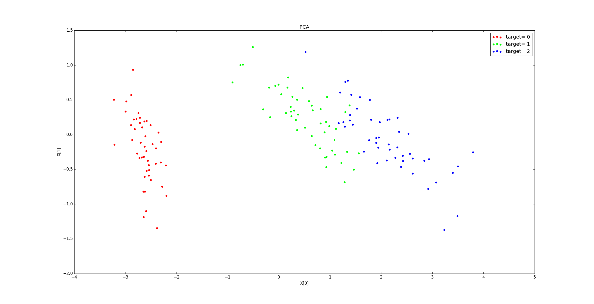
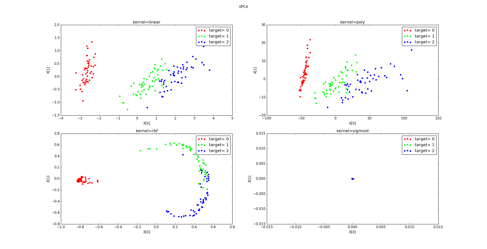
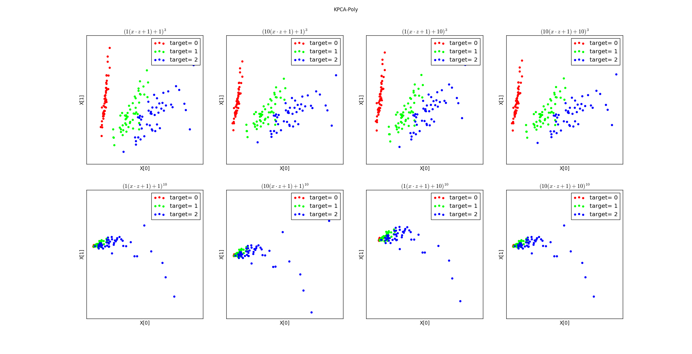
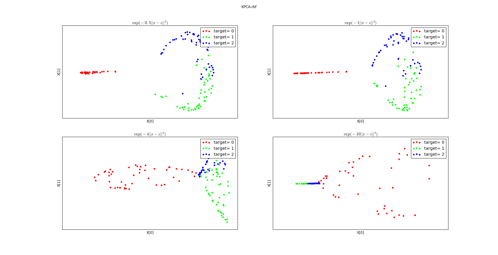
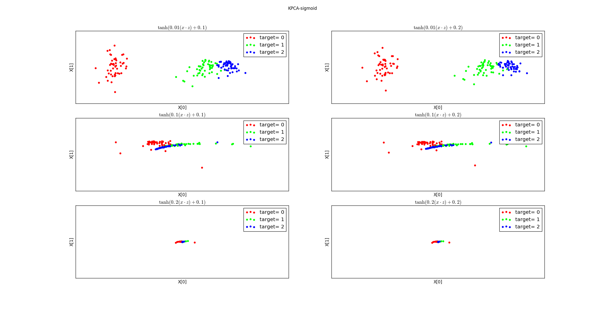

# decomposition

1.降维的一些通用方法：

- get_params([deep])：返回模型的参数。
  - deep： 如果为True，则可以返回模型参数的子对象。
- set_params(**params)：设置模型的参数。
  - params：待设置的关键字参数。
- fit(X[, y]) ：训练模型。
  - X ：样本集合。通常是一个numpy array，每行代表一个样本，每列代表一个特征。
  - y ：样本的标签集合。它与X 的每一行相对应。
- transform(X)：执行降维，返回降维后的样本集。
  - X ：样本集合。通常是一个numpy array，每行代表一个样本，每列代表一个特征。
- inverse_transform(X)：执行降维的逆运算，返回降维之前的样本集合。
  - X ：降维之后的样本集合。通常是一个numpy array，每行代表一个样本，每列代表一个特征。
- fit_transform(X[, y]) ：训练模型并执行降维，返回降维后的样本集。
  - X ：样本集合。通常是一个numpy array，每行代表一个样本，每列代表一个特征。
  - y ：样本的标签集合。它与X 的每一行相对应。

2.降维的一些通用参数：

- copy： 一个布尔值，指定是否拷贝原始数据。

如果为False则执行原地修改。此时节省空间，但修改了原始数据。

- n_jobs：一个正数，指定任务并形时指定的 CPU数量。

如果为 -1 则使用所有可用的 CPU。

- random_state：一个整数或者一个RandomState实例，或者None。
  - 如果为整数，则它指定了随机数生成器的种子。
  - 如果为RandomState实例，则指定了随机数生成器。
  - 如果为None，则使用默认的随机数生成器。

- n_components：一个整数，指定降维后的维数。

## PCA

1.scikit-learn中的PCA类实现了 PCA 模型，其原型为：

```python
sklearn.decomposition.PCA(n_components=None, copy=True, whiten=False)
```

- n_components：一个整数，指定降维后的维数。

  - 如果为None，则选择它的值为 min(n_samples,n_features) 。
  - 如果为字符串'mle'，则使用Minka's MLE算法来猜测降维后的维数。
  - 如果为大于0，小于1的浮点数，则指定的是降维后的维数占原始维数的百分比。

- copy：一个布尔值，指定是否拷贝原始数据。
- whiten：一个布尔值，指定是否执行白化操作。

如果为True，则会将特征向量除以 n_samples倍的特征值，从而保证非相关的输出的方差为1。

白化操作可能会丢弃部分信息，但是它有时候在接下来的学习器学习阶段能获得更佳的性能。

2.属性：

- components_：一个数组，给出主成分。
- explained_variance_：一个数组，元素是每个成分对应的 explained variance 。
- explained_variance_ratio_：一个数组，元素是每个主成分的explained variance的比例。
- mean_：一个数组，元素是每个特征的统计均值。
- n_components_：一个整数，指示主成分有多少个元素。

3.方法：

- fit(X[, y])：训练模型，获取降维需要的参数。
- transform(X)：执行降维，返回降维后的样本集。
- fit_transform(X[, y])：训练模型并执行降维，返回降维后的样本集。
- inverse_transform(X)：执行降维的逆运算，返回降维之前的样本集合。

4.注意：decomposition.PCA基于scipy.linalg来实现SVD分解，因此有两个限制：

- 不能应用于稀疏矩阵。
- 无法适用于超大规模数据，因为它要求所有的数据一次加载进内存。

5.示例：鸢尾花数据集中，n_components_=4 ；explained_variance_ratio_=[ 0.92461621 0.05301557 0.01718514 0.00518309] 。

降到2维的结果为：



```python
from jupyterthemes import jtplot
import numpy as np
import pandas as pd
from sklearn.decomposition import PCA

from matplotlib import pyplot as plt
%matplotlib inline

plt.style.use('ggplot')
plt.rcParams['font.sans-serif'] = 'SimHei'
plt.rcParams['axes.unicode_minus'] = False

jtplot.style()

# digits_train = pd.read_csv('https://archive.ics.uci.edu/ml/machine-learning-databases/optdigits/optdigits.tra', header=None)
# digits_test = pd.read_csv('https://archive.ics.uci.edu/ml/machine-learning-databases/optdigits/optdigits.tes', header=None)
# digits_train.to_csv('optdigits_train.csv',index=False)
# digits_test.to_csv('optdigits_test.csv',index=False)

digits_train = pd.read_csv('optdigits_train.csv')
digits_test = pd.read_csv('optdigits_test.csv')

# 降到2维，进行可视化
# 分割训练数据的特征向量和标记
x_digits = digits_train[[str(i) for i in np.arange(64)]]
y_digits = digits_train['64']

# 初始化一个可以将高维度特征向量（64维）压缩至2个维度的PCA
estimator = PCA(n_components=2)
x_pca = estimator.fit_transform(x_digits)

# 显示10类手写体数字图片经PCA压缩后的2维空间分布
colors = ['black', 'blue', 'purple', 'yellow',
          'white', 'red', 'lime', 'cyan', 'orange', 'gray']
for i in range(len(colors)):
    px = x_pca[:, 0][y_digits.values == i]
    py = x_pca[:, 1][y_digits.values == i]
    plt.scatter(px, py, c=colors[i])

plt.legend(np.arange(0, 10).astype(str))
plt.title(u'降到2维后的数据分布情况', fontproperties='SimHei', fontsize=20)
plt.xlabel('First Principal Component')
plt.ylabel('Second Principal Component')
plt.show()
```


```python
# 不降维，直接进行分类
# 对训练数据、测试数据进行特征向量（图片像素）与分类目标的分隔
from sklearn.metrics import classification_report
from sklearn.svm import LinearSVC

x_train = digits_train[[str(i) for i in np.arange(64)]]
y_train = digits_train['64']

x_test = digits_test[[str(i) for i in np.arange(64)]]
y_test = digits_test['64']

# 导入基于线性核的支持向量机分类器。
svc = LinearSVC()
svc.fit(x_train, y_train)
y_predict = svc.predict(x_test)

print(svc.score(x_test, y_test))
print(classification_report(y_test, y_predict,
                            target_names=np.arange(10).astype(str)))
```

    0.9360044518642181
                  precision    recall  f1-score   support
    
               0       0.98      0.98      0.98       178
               1       0.82      0.96      0.89       182
               2       0.99      0.97      0.98       177
               3       0.95      0.93      0.94       183
               4       0.95      0.97      0.96       181
               5       0.88      0.97      0.92       182
               6       0.99      0.98      0.99       181
               7       0.98      0.92      0.95       179
               8       0.94      0.80      0.86       174
               9       0.90      0.89      0.90       180
    
       micro avg       0.94      0.94      0.94      1797
       macro avg       0.94      0.94      0.94      1797
    weighted avg       0.94      0.94      0.94      1797


​    


```python
# 先降维，在分类
from sklearn.decomposition import PCA
from sklearn.svm import LinearSVC

estimator = PCA(n_components=20)  # 使用PCA将原64维的图像数据压缩到20个维度
# 利用训练特征决定（fit）20个正交维度的方向，并转化（transform）原训练特征
pca_x_train = estimator.fit_transform(x_train)
pca_x_test = estimator.transform(x_test)  # 测试特征也按照上述的20个正交维度方向进行转化（transform）

pca_svc = LinearSVC()
pca_svc.fit(pca_x_train, y_train)
pca_y_predict = pca_svc.predict(pca_x_test)

# 对使用PCA压缩重建的低维图像特征训练的支持向量机分类器的性能作出评估
print(pca_svc.score(pca_x_test, y_test))
print(classification_report(y_test, pca_y_predict,
                            target_names=np.arange(10).astype(str)))
```

    0.9198664440734557
                  precision    recall  f1-score   support
    
               0       0.98      0.96      0.97       178
               1       0.89      0.81      0.85       182
               2       0.97      0.97      0.97       177
               3       0.96      0.88      0.92       183
               4       0.95      0.97      0.96       181
               5       0.86      0.97      0.91       182
               6       0.97      0.98      0.97       181
               7       0.96      0.89      0.92       179
               8       0.86      0.84      0.85       174
               9       0.83      0.92      0.88       180
    
       micro avg       0.92      0.92      0.92      1797
       macro avg       0.92      0.92      0.92      1797
    weighted avg       0.92      0.92      0.92      1797

## IncrementalPCA

1. scikit-learn中的IncrementalPCA类也实现了 PCA 模型。它适用于超大规模数据，可以将数据分批加载进内存。

其原型为：
```python
sklearn.decomposition.IncrementalPCA(
	n_components=None, 
	whiten=False, 
	copy=True,
	batch_size=None)
```
- batch_size：一个整数或者None，指定每个批次训练时，使用的样本数量。
  - 只有当调用fit()/partial_fit()方法时，才会用到该参数。
  - 如果为None，则由算法自动推断。
- 其它参数参考decomposition.PCA 。

2. 属性：

- components_：一个数组，给出主成分。
- explained_variance_：一个数组，元素是每个成分对应的 explained variance 。
- explained_variance_ratio_：一个数组，元素是每个主成分的explained variance的比例。
- mean_：一个数组，元素是每个特征的统计平均值。

每调用一次partial_fit()方法就会更新一次该属性。

- var_：一个数组，元素是每个特征的经验方差。

每调用一次partial_fit()方法就会更新一次该属性。

- n_components_：一个整数，指示主成分有多少个元素。
- n_samples_seen_：一个整数，指示目前已经处理了多少个样本。

  - 每调用一次partial_fit()方法就会更新一次该属性。
  - 每调用一次fit()方法就会清零该属性。

3. 方法：参考decomposition.PCA 。

## KernelPCA

1. KernelPCA是scikit-learn实现的核化PCA模型，其原型为：

```python
sklearn.decomposition.KernelPCA(
    n_components=None, 
    kernel='linear',
    gamma=None, 
    degree=3, 
    coef0=1, 
    kernel_params=None, 
    alpha=1.0, 
    fit_inverse_transform=False,
    eigen_solver='auto', 
    tol=0, 
    max_iter=None,
    remove_zero_eig=False)
```
- n_components：一个整数，指定降维后的维数。
- kernel：一个字符串或者可调用对象，指定核函数。
  - 'linear'：线性核：  。
  - 'poly'：多项式核：，其中  由 degree参数决定， 由 gamma参数决定， 由 coef0参数决定。
  - 'rbf'（默认值）：高斯核函数： ,其中   由 gamma参数决定。
  - 'sigmoid'：sigmod 核函数：。其中   由 gamma参数决定 ，r由 coef0参数指定  。
  - 'precomputed'：表示提供了kernel matrix 。
  - 一个可调用对象，该对象用于计算kernel matrix 。

- degree：一个整数，当核函数是多项式核函数时，指定多项式的系数。

对于其他核函数，该参数无效。
- gamma：一个浮点数，当核函数是'rbf'，'poly'，'sigmoid'时，指定核函数的系数。

如果'auto'，则表示系数为1/n_features
- coef0：浮点数，用于指定核函数中的自由项。

只有当核函数是'poly'和'sigmoid'是有效。
- kernel_params：当核函数是个可调用对象时才使用它，用于为该可调用对象传递参数。

如果核函数是上述指定的字符串，则该参数不起作用。
- alpha：一个整数，岭回归的超参数，用于计算逆转换矩阵（当fit_inverse_transform=True时）。
- fit_inverse_transform：一个布尔值，指定是否需要计算逆转换矩阵。当为True时，需要计算逆转换矩阵。
- eigen_solver：一个字符串，指定求解特征值的算法：
  - 'auto'：自动选择。
  - 'dense'：dense特征值求解器。
  - 'arpack'：arpack特征值求解器，用于当特征数量远小于样本数量的情形。
- tol：一个浮点数，指定arpack特征值求解器的收敛阈值（如果为0，则自动选择阈值）。
- max_iter：一个整数，指定arpack特征值求解器的最大迭代次数（如果为None，则自动选择）。
- remove_zero_eig：一个布尔值。如果为True，则移除所有为零的特征值。如果n_components=None，则也会移除所有为零的特征值。

2. 属性：

- lambdas_：核化矩阵的特征值。
- alphas_：核化矩阵的特征向量。
- dual_coef_：逆转换矩阵。

3. 方法：参考decomposition.PCA 。

4. 示例：

不同的核函数降维后的数据分布：


不同参数的多项式核函数降维后的数据分布：


不同参数的高斯核函数降维后的数据分布：


不同参数的sigmoid核函数降维后的数据分布：


## DictionaryLearning

>DictionaryLearning用于字典学习，其原型为：

```python
class sklearn.decomposition.DictionaryLearning(n_components=None, alpha=1,
max_iter=1000, tol=1e-08, fit_algorithm='lars', transform_algorithm='omp',
transform_n_nonzero_coefs=None, transform_alpha=None, n_jobs=1,
code_init=None, dict_init=None, verbose=False, split_sign=False, random_state=None)
```
- n_components：一个整数，指定了字典大小  。
- alpha：一个浮点数，指定了 正则化项的系数  ，它控制了稀疏性。
- max_iter：一个整数，指定了最大迭代次数。
- tol：一个浮点数，指定了收敛阈值。
- fit_algorithm：一个字符串，指定了求解算法。可以为：
  - 'lars'：使用least angle regression算法来求解。
  - 'cd'：使用coordinate descent算法来求解。
- transform_algorithm：一个字符串，指定了数据转换的方法。可以为：
  - 'lasso_lars'：使用Lars算法来求解。
  - 'lasso_cd'：使用coordinate descent算法来求解。
  - 'lars'：使用least angle regression算法来求解。
  - 'omp'：使用正交匹配的方法来求解。
  - 'threshold'：通过字典转换后的坐标中，小于 transform_alpha 的特征的值都设成零。
- transform_n_nonzero_coefs：一个整数，指定解中每一列中非零元素的个数，默认为0.1*n_features。

只用于lars算法和omp算法（omp算法中，可能被transform_alpha参数覆盖）。
- transform_alpha：一个浮点数，默认为 1.0 。
  - 如果算法为lasso_lars或者lasso_cd，则该参数指定了L1正则化项的系数。
  - 如果算法为threshold，则该参数指定了特征为零的阈值。
  - 如果算法为omp，则该参数指定了重构误差的阈值，此时它覆盖了transform_n_nonzero_coefs参数。
- split_sign：一个布尔值，指定是否拆分系数特征向量为其正向值和负向值的拼接。

- n_jobs：一个整数，指定并行性。
- code_init：一个数组，指定了初始编码，它用于字典学习算法的热启动。
- dict_init：一个数组，指定了初始字典，它用于字典学习算法的热启动。
- verbose：一个整数，控制输出日志。
- random_state ：一个整数或者一个RandomState 实例，或者None，指定随机数种子。

>属性：

- components_：一个数组，存放学到的字典。
- error_：一个数组，存放每一轮迭代的误差。
- n_iter_：一个整数，存放迭代的次数。

>方法：

- fit(X,y)：学习字典。
- transform(X)：根据学到的字典进行编码。
- fit_transform(X,y)：学习字典并执行字典编码。


## MiniBatchDictionaryLearning

>MiniBatchDictionaryLearning也是字典学习，它主要用于大规模数据。它每次训练一批样本，然后连续多次训练。

>MiniBatchDictionaryLearning 的原型为：

```python
class sklearn.decomposition.MiniBatchDictionaryLearning(
    n_components=None, 
    alpha=1,
    n_iter=1000, 
    fit_algorithm='lars', 
    n_jobs=1, 
    batch_size=3, 
    shuffle=True,
    dict_init=None, 
    transform_algorithm='omp', 
    transform_n_nonzero_coefs=None,
    transform_alpha=None, 
    verbose=False, 
    split_sign=False, 
    random_state=None)
```
- n_iter：一个整数，指定了总的执行迭代的数量。
- batch_size：一个整数，指定了每次训练时的样本数量。
- shuffle：一个布尔值，指定在训练每一批样本之前，是否对该批次样本进行混洗。
- 其它参数参考DictionaryLearning 。

>属性：

- components_：一个数组，存放学到的字典。
- inner_stats_：数组的元组，存放算法的中间状态。
- n_iter_：一个整数，存放迭代的次数。

>方法：

- fit(X,y)：学习字典。
- transform(X)：根据学到的字典进行编码。
- fit_transform(X,y)：学习字典并执行字典编码。
- partial_fit(X[, y, iter_offset])：只训练一个批次的样本。

## FactorAnalysis

1. FactorAnalysis类是scikit-learn提供的FA模型，其原型为：

```python
sklearn.decomposition.FactorAnalysis(
	n_components=None, 
	tol=0.01, 
	copy=True,
	max_iter=1000, 
	noise_variance_init=None, 
	svd_method=’randomized’, 
	iterated_power=3, 
	random_state=0)
```
- n_components ：一个整数或者None，指定隐空间的维度。

如果为None，则隐空间的维度为数据的特征维度。
- tol：一个浮点数，指定EM 算法的收敛阈值。
- copy：一个布尔值，指定是否拷贝原始数据。
- max_iter：一个整数，指定最大的迭代次数。
- noise_variance_init：一个形状为(n_features,) 的数组，或者为None，指定噪音的协方差矩阵  （它时一个对角矩阵，该数组指定了对角矩阵的元素）的初始值。

如果为None，则它等于全 1 的数据。等价于  。

- svd_method：一个字符串，指定求解SVD 的算法。可以为：
  - 'lapack'：使用scipy.linalg 的标准SVD 求解算法。
  - 'randomized'：使用更快的randomized_svd 求解算法。

对于大多数场景，该算法的精度已经能够满足需求。

- iterated_power：一个整数，指定power method 的迭代次数。仅仅用于svd_method='randomized' 。
- random_state： 一个整数或者一个RandomState实例，或者None。指定随机数种子。

2. 属性：

- componets_：一个形状为[n_components, n_features] 的数组，给出了矩阵  。
- loglike_：一个形状为[n_iterations,] 的列表，给出了每次迭代的对数似然函数值。
- noise_variance_：一个形状为[n_features,] 的数组，给出了噪音的协方差矩阵  。
- n_iter_：一个整数，给出了迭代次数。

3. 方法：

- fit(X[, y])：使用EM 算法训练模型。
- transform(X)：执行因子分析，返回因子分析后的样本集。
- fit_transform(X[, y])：训练模型并执行因子分析，返回因子分析后的样本集。
- get_covariance()：在因子分析中，计算  的协方差矩阵，即  。
- score(X[, y]) ：计算数据集的平均对数似然函数值，返回一个浮点数。
- score_samples(X)： 计算每个样本的对数似然函数值，返回一个长度为  的序列，  为样本的数量。


## FastICA

1. FastICA类是scikit-learn提供的FastICA模型，其原型为：

```python
sklearn.decomposition.FastICA(
    n_components=None, 
    algorithm=’parallel’, 
    whiten=True, 
    fun=’logcosh’, 
    fun_args=None, 
    max_iter=200, 
    tol=0.0001, 
    w_init=None, 
    random_state=None)
```

- n_components ：一个整数或者None， 指定独立成分的数量。

如果为None， 则独立成分的数量为  （观测样本的特征数）。
- algorithm：一个字符串，指定求解FastICA 的算法。可以为：

  - 'parallel' 
  - 'delfation'

- whiten：一个布尔值，指定是否执行白化预处理。

如果为false，则scikit-learn 并不会对数据进行白化预处理。这要求输入数据已经被白化了。
- fun：一个字符串或者可调用对象，指定非线性函数  ，它是  的原函数。可以为:

  - 'logcosh'：表示$F(s) = \frac{1}{a} log cosh(as)$，此时$G(s) = tanh(as)$。
  - exp：表示$F(s) = -exp(-s^2 / 2)$，此时$G(s)=s exp(-s^2 / 2)$。
  - cube：表示$F(s) = \frac{1}{4} s^4$，此时$G(s) = s^3$。
  - 一个可调用对象，参数为$s$，返回值为元组：(函数值，梯度值)  。
- fun_args：一个字典，用于为fun 提供关键字参数。

如果fun='logcosh' 且 fun_args 为空，则其默认值为 {'alpha':1.0} 。

- max_iter： 一个整数，指定最大迭代次数。
- tol：一个浮点数，指定迭代时的收敛阈值。
- w_init：一个 (n_componets,n_componets) 形状的数组或者None， 指定了混合矩阵$A$的初始化值。
- random_state： 一个整数或者一个RandomState实例，或者None。指定随机数种子。

2. 属性：

- components_： 一个形状为(n_componets,n_features) 的矩阵，给出了分离矩阵$W$ 。
- mixing_： 一个形状为(n_features,n_components) 的矩阵，给出了混合矩阵$A$。
- n_iter_：一个整数，给出了迭代次数。
  - 如果算法是'deflation'，则它是每个分量上迭代次数的最大值。
  - 否则它是算法收敛时的总迭代次数。

3. 方法：

- fit(X[, y])：训练模型。
- transform(X)：执行独立成分分离，返回独立因子数据集。
- fit_transform(X[, y])：训练模型并执行独立成分分离，返回独立因子数据集。
- inverse_transform(X)：执行独立成分分离的逆运算，返回混合之后的观测数据集。