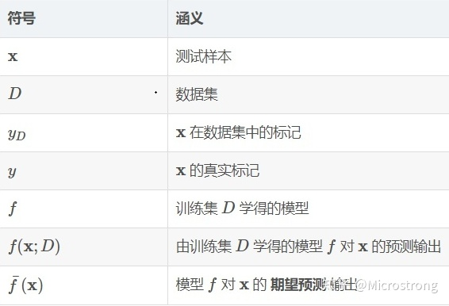
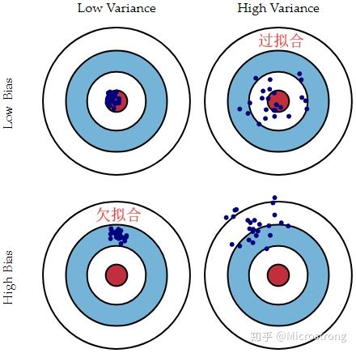
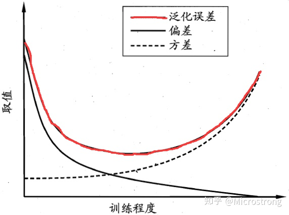

# 为什么会有偏差和方差？

对学习算法除了通过实验估计其泛化性能之外，人们往往还希望了解它为什么具有这样的性能。**偏差-方差分解（bias-variance decomposition）**就是从偏差和方差的角度来解释学习算法泛化性能的一种重要工具。

在机器学习中，我们用训练数据集去训练一个模型，通常的做法是定义一个误差函数，通过将这个误差的最小化过程，来提高模型的性能。然而我们学习一个模型的目的是为了解决训练数据集这个领域中的一般化问题，单纯地将训练数据集的损失最小化，并不能保证在解决更一般的问题时模型仍然是最优，甚至不能保证模型是可用的。这个训练数据集的损失与一般化的数据集的损失之间的差异就叫做**泛化误差（generalization error）**。

而泛化误差可以分解为**偏差（Biase）**、**方差（Variance）**和**噪声（Noise）**。

# 偏差、方差、噪声是什么？

为了更好的理解偏差、方差和噪声概念，这一部分我分两个小节来阐述。我用通俗易懂的语言表述概念, 用数学公式定义偏差、方差和噪声概念。

## 简述偏差、方差、噪声

如果我们能够获得所有可能的数据集合，并在这个数据集合上将损失最小化，那么学习得到的模型就可以称之为**“真实模型”**。当然，在现实生活中我们不可能获取并训练所有可能的数据，所以“真实模型”肯定存在，但是无法获得。我们的最终目的是学习一个模型使其更加接近这个真实模型。

Bias和Variance分别从两个方面来描述我们学习到的模型与真实模型之间的差距。

**Bias**是用**所有可能的训练数据集**训练出的**所有模型**的输出的**平均值**与**真实模型**的输出值之间的差异。

**Variance**是**不同的训练数据集**训练出的模型输出值之间的差异。

**噪声**的存在是学习算法所无法解决的问题，数据的质量决定了学习的上限。假设在数据已经给定的情况下，此时上限已定，我们要做的就是尽可能的接近这个上限。

**注意：**我们能够用来学习的训练数据集只是全部数据中的一个子集。想象一下，我们现在收集几组不同的数据，因为每一组数据的不同，我们学习到模型的最小损失值也会有所不同，它们与“真实模型”的最小损失也是不一样的。

## 数学公式定义偏差、方差、噪声

要进一步理解偏差、方差、噪声，我们需要看看它们的数学公式。

以回归任务为例，学习算法的**期望预测**为：
$$
\bar{f}(\boldsymbol{x})=\mathbb{E}_{D}[f(\boldsymbol{x} ; D)]
$$
这里的期望预测也就是针对不同数据集$D$，模型$f$对样本$x$的预测值取其期望，也叫做**平均预测（average predicted）。**

**（1）方差定义：**

使用样本数相同的不同训练集产生的**方差**为：
$$
\operatorname{var}(\boldsymbol{x})=\mathbb{E}_{D}\left[(f(\boldsymbol{x} ; D)-\bar{f}(\boldsymbol{x}))^{2}\right]
$$
**方差的含义**：方差度量了同样大小的训练集的变动所导致的学习性能的变化，即刻画了数据扰动所造成的影响。

**（2）偏差定义：**

期望输出与真实标记的差别称为**偏差（bias）**，即：
$$
\operatorname{bias}^{2}(\boldsymbol{x})=(\bar{f}(\boldsymbol{x})-y)^{2}
$$
**偏差的含义**：偏差度量了学习算法的期望预测与真实结果的偏离程度，即刻画了学习算法本身的拟合能力。

**（3）噪声：**

噪声为：
$$
\varepsilon^{2}=\mathbb{E}_{D}\left[\left(y_{D}-y\right)^{2}\right]
$$
**噪声的含义**：噪声则表达了在当前任务上任何学习算法所能达到的期望泛化误差的下界，即刻画了学习问题本身的难度。

**我的理解：**偏差度量的是单个模型的学习能力，而方差度量的是同一个模型在不同数据集上的稳定性。

# 泛化误差、偏差和方差的关系？

$$
泛化误差 =错误率 (error)=\operatorname{bias}^{2}(x)+\operatorname{var}(x)+\varepsilon^{2}
$$

也就是说，泛化误差可以通过一系列公式分解运算证明：泛化误差为偏差、方差与噪声之和。

**证明过程如下：**

为了便于讨论，我们假定噪声期望为零，即$E_{D}\left[y_{D}-y\right]=0$ 。通过简单的多项式展开合并，可对算法的期望泛化误差进行分解：
$$
\begin{aligned}
E(f ; D)=& \mathbb{E}_{D}\left[\left(f(\boldsymbol{x} ; D)-y_{D}\right)^{2}\right] \\
=& \mathbb{E}_{D}\left[\left(f(\boldsymbol{x} ; D)-\bar{f}(\boldsymbol{x})+\bar{f}(\boldsymbol{x})-y_{D}\right)^{2}\right] \\
=& \mathbb{E}_{D}\left[(f(\boldsymbol{x} ; D)-\bar{f}(\boldsymbol{x}))^{2}\right]+\mathbb{E}_{D}\left[\left(\bar{f}(\boldsymbol{x})-y_{D}\right)^{2}\right] +\mathbb{E}_{D}\left[2(f(\boldsymbol{x} ; D)-\bar{f}(\boldsymbol{x}))\left(\bar{f}(\boldsymbol{x})-y_{D}\right)\right] \\
=& \mathbb{E}_{D}\left[(f(\boldsymbol{x} ; D)-\bar{f}(\boldsymbol{x}))^{2}\right]+\mathbb{E}_{D}\left[\left(\bar{f}(\boldsymbol{x})-y_{D}\right)^{2}\right] \\
=& \mathbb{E}_{D}\left[(f(\boldsymbol{x} ; D)-\bar{f}(\boldsymbol{x}))^{2}\right]+\mathbb{E}_{D}\left[\left(\bar{f}(\boldsymbol{x})-y+y-y_{D}\right)^{2}\right] \\
=& \mathbb{E}_{D}\left[(f(\boldsymbol{x} ; D)-\bar{f}(\boldsymbol{x}))^{2}\right]+\mathbb{E}_{D}\left[(\bar{f}(\boldsymbol{x})-y)^{2}\right]+\mathbb{E}_{D}\left[\left(y-y_{D}\right)^{2}\right] +2 \mathbb{E}_{D}\left[(\bar{f}(\boldsymbol{x})-y)\left(y-y_{D}\right)\right] \\
=& \mathbb{E}_{D}\left[(f(\boldsymbol{x} ; D)-\bar{f}(\boldsymbol{x}))^{2}\right]+(\bar{f}(\boldsymbol{x})-y)^{2}+\mathbb{E}_{D}\left[\left(y-y_{D}\right)^{2}\right]
\end{aligned}
$$

于是，最终得到：
$$
E(f ; D)=\operatorname{bias}^{2}(\boldsymbol{x})+\operatorname{var}(\boldsymbol{x})+\varepsilon^{2}
$$
“**偏差-方差分解”说明**，泛化性能是由学习算法的能力、数据的充分性以及学习任务本身的难度所共同决定的。给定学习任务，为了取得好的泛化性能，则需使偏差较小，即能够充分拟合数据，并且使方差较小，即使得数据扰动产生的影响小。

# 用图形解释偏差和方差

我们从下面的靶心图来对偏差和方差有个直观的感受。（图片来自：[Understanding the Bias-Variance Tradeoff](https://link.zhihu.com/?target=http%3A//scott.fortmann-roe.com/docs/BiasVariance.html)）

假设红色的靶心区域是学习算法完美的正确预测值，蓝色点为训练数据集所训练出的模型对样本的预测值，当我们从靶心逐渐往外移动时，预测效果逐渐变差。

从上面的图片中很容易可以看到，左边一列的蓝色点比较集中，右边一列的蓝色点比较分散，它们描述的是方差的两种情况。比较集中的属于方差比较小，比较分散的属于方差比较大的情况。

我们再从蓝色点与红色靶心区域的位置关系来看，靠近红色靶心的属于偏差较小的情况，远离靶心的属于偏差较大的情况。

**思考：**从上面的图中可以看出，模型不稳定时会出现偏差小、方差大的情况，那么偏差和方差作为两种度量方式有什么区别呢？

**解答：**Bias的对象是单个模型，是期望输出与真实标记的差别。它描述了模型对本训练集的拟合程度。

Variance的对象是多个模型，是相同分布的不同数据集训练出模型的输出值之间的差异。它刻画的是数据扰动对模型的影响。

# 偏差、方差窘境

一般来说，偏差与方差是有冲突的，这称为**偏差-方差窘境（bias-variance dilemma）**。下图给出了一个示意图。给定学习任务，假定我们能控制学习算法的训练程度，则在训练不足时，学习器的拟合能力不够强，训练数据的扰动不足以使学习器产生显著变化，此时偏差主导了泛化错误率；随着训练程度的加深，学习器的拟合能力逐渐增强，训练数据发生的扰动渐渐能被学习器学到，方差逐渐主导了泛化错误率；在训练程度充足后，学习器的拟合能力已经非常强，训练数据发生的轻微扰动都会导致学习器发生显著变化，若训练数据自身的、非全局的特性被学习器学到了，则将发生过拟合。

泛化误差与偏差、方差的关系示意图

# 偏差、方差与过拟合、欠拟合的关系？

一般来说，简单的模型会有一个较大的偏差和较小的方差，复杂的模型偏差较小方差较大。

**欠拟合：模型不能适配训练样本，有一个很大的偏差。**

举个例子：我们可能有本质上是多项式的连续非线性数据，但模型只能表示线性关系。在此情况下，我们向模型提供多少数据不重要，因为模型根本无法表示数据的基本关系，模型不能适配训练样本，有一个很大的偏差，因此我们需要更复杂的模型。那么，是不是模型越复杂拟合程度越高越好呢？也不是，因为还有方差。

**过拟合：模型很好的适配训练样本，但在测试集上表现很糟，有一个很大的方差。**

方差就是指模型过于拟合训练数据，以至于没办法把模型的结果泛化。而泛化正是机器学习要解决的问题，如果一个模型只能对一组特定的数据有效，换了数据就无效，我们就说这个模型过拟合。这就是模型很好的适配训练样本，但在测试集上表现很糟，有一个很大的方差。

# 偏差、方差与模型复杂度的关系

由前面偏差和方差的介绍，我们来总结一下**偏差和方差的来源**：我们训练的机器学习模型，必不可少地对数据依赖。但是，如果你不清楚数据服从一个什么样的分布，或是没办法拿到所有可能的数据（肯定拿不到所有数据），那么我们训练出来的模型和真实模型之间存在不一致性。这种不一致性表现在两个方面：偏差和方差。

那么，既然偏差和方差是这么来的，而且还是无法避免的，那么我们有什么办法尽量减少它对模型的影响呢？

一个好的办法就是正确选择模型的复杂度。复杂度高的模型通常对训练数据有很好的拟合能力，但是对测试数据就不一定了。而复杂度太低的模型又不能很好的拟合训练数据，更不能很好的拟合测试数据。因此，模型复杂度和模型偏差和方差具有如下图所示关系。

# 偏差、方差与bagging、boosting的关系？

Bagging算法是对训练样本进行采样，产生出若干不同的子集，再从每个数据子集中训练出一个分类器，取这些分类器的平均，所以是降低模型的方差（variance）。Bagging算法和Random Forest这种并行算法都有这个效果。

Boosting则是迭代算法，每一次迭代都根据上一次迭代的预测结果对样本进行权重调整，所以随着迭代不断进行，误差会越来越小，所以模型的偏差（bias）会不断降低。

# 偏差、方差和K折交叉验证的关系？

K-fold Cross Validation的思想：将原始数据分成K组(一般是均分)，将每个子集数据分别做一次验证集，其余的K-1组子集数据作为训练集，这样会得到K个模型，用这K个模型最终的验证集的分类准确率的平均数作为此K-CV下分类器的性能指标。

对于一系列模型$F(\hat{f}, \theta)$, 我们使用Cross Validation的目的是获得预测误差的无偏估计量CV，从而可以用来选择一个最优的Theta*,使得CV最小。假设K-folds cross validation，CV统计量定义为每个子集中误差的平均值，**而K的大小和CV平均值的bias和variance是有关**的：
$$
C V=\frac{1}{K} \sum_{k=1}^{K} \frac{1}{m} \sum_{i=1}^{m}\left(\hat{f}^{k}-y_{i}\right)^{2}
$$
其中，m = N/K 代表每个子集的大小， N是总的训练样本量，K是子集的数目。

当K较大时，m较小，模型建立在较大的N-m上，经过更多次数的平均可以学习得到更符合真实数据分布的模型，Bias就小了，但是这样一来模型就更加拟合训练数据集，再去测试集上预测的时候预测误差的期望值就变大了，从而Variance就大了；k较小的时候，模型不会过度拟合训练数据，从而Bias较大，但是正因为没有过度拟合训练数据，Variance也较小。

# 如何解决偏差、方差问题？

**整体思路：**首先，要知道偏差和方差是无法完全避免的，只能尽量减少其影响。

1. 在避免偏差时，**需尽量选择正确的模型**，一个非线性问题而我们一直用线性模型去解决，那无论如何，高偏差是无法避免的。
2. 有了正确的模型，**我们还要慎重选择数据集的大小**，通常数据集越大越好，但大到数据集已经对整体所有数据有了一定的代表性后，再多的数据已经不能提升模型了，反而会带来计算量的增加。而训练数据太小一定是不好的，这会带来过拟合，模型复杂度太高，方差很大，不同数据集训练出来的模型变化非常大。
3. 最后，**要选择合适的模型复杂度**，复杂度高的模型通常对训练数据有很好的拟合能力。

**针对偏差和方差的思路：**

**偏差：**实际上也可以称为避免欠拟合。
1. 寻找更好的特征 -- 具有代表性。
2. 用更多的特征 -- 增大输入向量的维度。（增加模型复杂度）

    

**方差：**避免过拟合
1. 增大数据集合 -- 使用更多的数据，减少数据扰动所造成的影响
2. 减少数据特征 -- 减少数据维度，减少模型复杂度
3. 正则化方法
4. 交叉验证法

# Reference：

【1】《机器学习》周志华著，P44-P46。

【2】机器学习中的Bias(偏差)，Error(误差)，和Variance(方差)有什么区别和联系？ - J JR的回答 - 知乎

https://www.zhihu.com/question/27068705/answer/82132134

【3】机器学习中的Bias(偏差)，Error(误差)，和Variance(方差)有什么区别和联系？ - 小匿的回答 - 知乎

https://www.zhihu.com/question/27068705/answer/416457469

【4】[偏差（Bias）与方差（Variance） - CSDN博客](https://link.zhihu.com/?target=https%3A//blog.csdn.net/wuzqChom/article/details/75091612)

【5】[Understanding the Bias-Variance Tradeoff](https://link.zhihu.com/?target=http%3A//scott.fortmann-roe.com/docs/BiasVariance.html)

【6】[理解机器学习中的偏差与方差 - CSDN博客](https://link.zhihu.com/?target=https%3A//blog.csdn.net/simple_the_best/article/details/71167786)

【7】机器学习中的Bias(偏差)，Error(误差)，和Variance(方差)有什么区别和联系？ - 优达学城（Udacity）的回答 - 知乎

https://www.zhihu.com/question/27068705/answer/129656963

【8】机器学习中的Bias(偏差)，Error(误差)，和Variance(方差)有什么区别和联系？ - 知乎

https://www.zhihu.com/question/27068705

【9】为什么说bagging是减少variance，而boosting是减少bias? - 知乎

https://www.zhihu.com/question/26760839