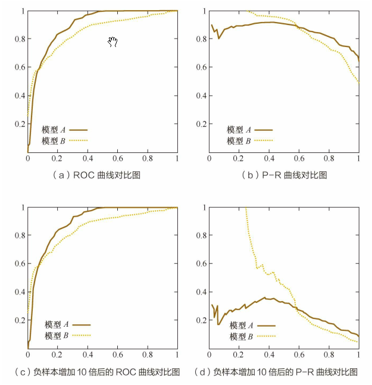
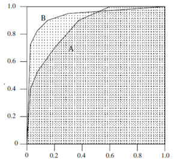
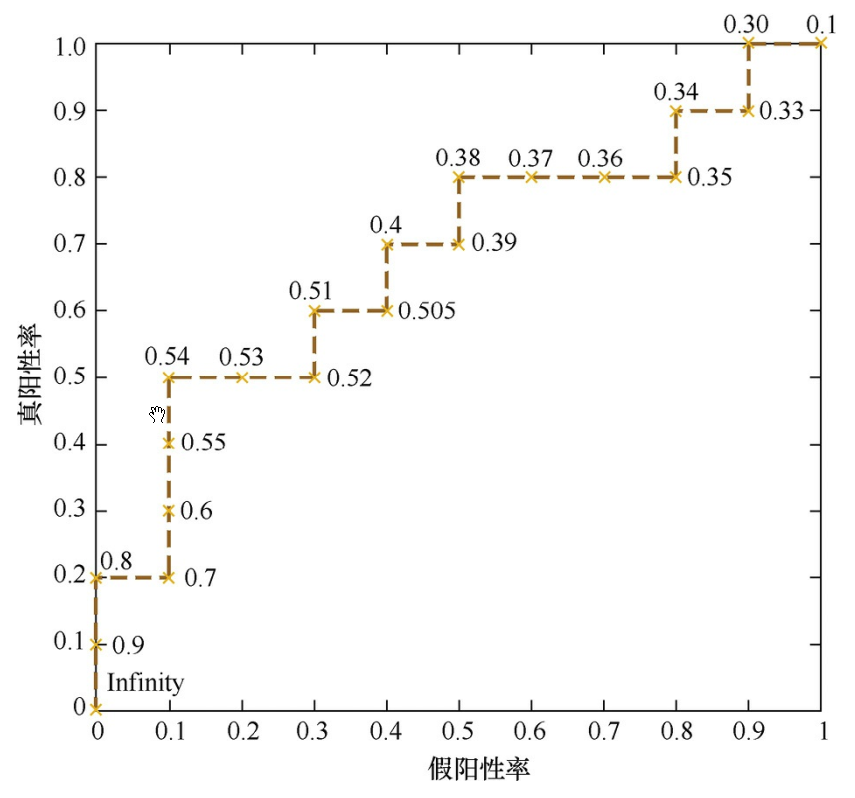
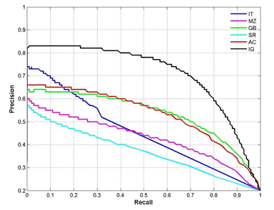
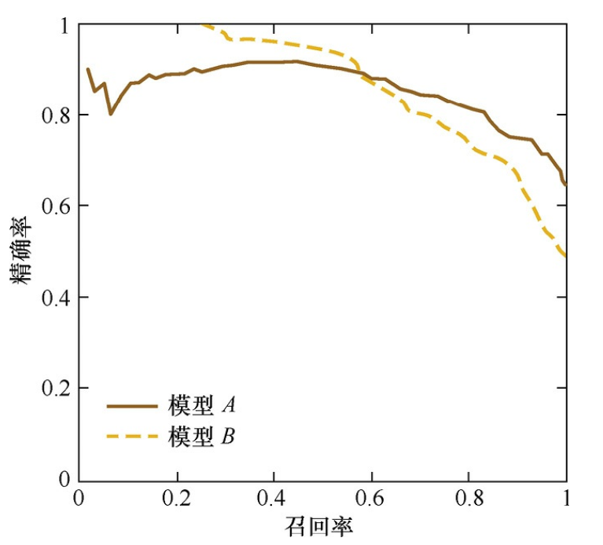

在机器学习的算法评估中，尤其是分类算法评估中，我们经常听到精确率(precision)与召回率(recall)，Roc曲线与PR曲线这些概念，那这些概念到底有什么用处呢？

首先，我们需要搞清楚几个拗口的概念。

# 混淆矩阵

- 真阳性（True positive） — $TP$ ： 原本呈阳性患病的病人，实诊为阳性。
- 假阴性（False negative） — $FN$ ： 原本呈阳性患病的病人，实诊为阴性。
- 假阳性（False positive） — $FP$ ： 原本呈阴性不患病的病人，实诊为阳性。
- 真阴性（Ture negative） — $TN$ ： 原本呈阴性不患病的病人，实诊为阴性。

`四种概率形式：`

# 常用指标

## 精确率(Precision)

又名**查准率，表示被分为正例的示例中实际为正例的比例**。严格的数学定义如下：

$$
P = \frac{TP}{TP + FP }
$$

## 召回率(Recall)

又名**敏感度、灵敏度（sensitive）、查全率，表示的是所有正例中被分对的比例，衡量了分类器对正例的识别能力**。严格的数学定义如下：
$$
R = \frac{TP}{TP + FN }
$$

## 特异度(specificity)

表示的是**所有负例中被分对的比例，衡量了分类器对负例的识别能力**。即负类的召回率，严格的数学定义如下：

$$
S = \frac{TN}{TN + FP }
$$

## F1值

有时也用一个F1值来综合评估精确率和召回率，它是**精确率和召回率的调和均值**。当精确率和召回率都高时,F1值也会高。严格的数学定义如下：

$$
\begin{align}
\frac{2}{F_1} &= \frac{1}{P} + \frac{1}{R} \\
F_1 &= \frac{2PR}{P+R}
\end{align}
$$
有时候我们对精确率和召回率并不是一视同仁，比如有时候我们更加重视精确率。我们用一个参数$\beta$来度量两者之间的关系。**如果$\beta>1$, 召回率有更大影响，如果$\beta<1$,精确率有更大影响**。当$\beta=1$的时候，精确率和召回率影响力相同，和F1形式一样。含有度量参数$\beta$的F1我们记为$F_\beta$, 严格的数学定义如下：

$$
F_\beta = \frac{(1+\beta^2)*P*R}{\beta^2*P + R}
$$

# ROC曲线

ROC曲线的横坐标为**假阳性率**（False Positive Rate， FPR)； 纵坐标为**真阳性率**（True Positive Rate， TPR） 。

- P是真实的正样本的数量 
- N是真实的负样本的数量
- TP是P个正样本中被分类器预测为正样本的个数
- FP是N个负样本中被分类器预测为正样本的个数

ROC曲线有一个特点， **当正负样本的分布发生变化时， ROC曲线的形状能够基本保持不变**， 而P-R曲线的形状一般会发生较剧烈的变化。ROC曲线的适用场景更多， 被广泛用于排序、 推荐、 广告等领域。 但需要注意的是， 选择P-R曲线还是ROC曲线是因实际问题而异的， 如果研究者希望更多地看到模型在特定数据集上的表现， P-R曲线则能够更直观地反映其性能。  

## 1-特异度: (FPR)

另一个是1-特异度(false positive rate, FPR)，它是**实际负例中，错误的识别为正例的负例比例**。严格的数学定义如下：

$$
FPR = 1 - {\frac{TN}{FP + TN }} = \frac{FP}{FP + TN }　= \frac{FP}{N}
$$

## 灵敏度(TPR)

此外还有灵敏度(true positive rate ,TPR)，它是**所有实际正例中，正确识别的正例比例，它和召回率的表达式没有区别**。严格的数学定义如下：

$$
TPR = \frac{TP}{TP + FN } = \frac{TP}{P}
$$

>我们熟悉了精确率， 召回率和特异性，以及TPR和FPR，后面的ROC曲线和PR曲线就好了解了。

ROC曲线:
- receiver operating characteristic
- **以FPR为x轴，灵敏度(TPR)为y轴**，我们就直接得到了ROC曲线。
- FPR 代表将负例错分为正例的概率， TPR 代表能将正例分对的概率。FPR越小， TPR越高，我们的模型和算法就越高效。也就是画出来的ROC曲线越靠近左上越好。
- 如下图左图所示， ROC曲线下方的面积越大越大，则模型越优。
- 所以有时候我们用ROC曲线下的面积，即AUC（Area Under Curve）值来作为算法和模型好坏的标准。

# PR曲线

- 以**召回率**为x轴，以**精确率**为y轴，我们就得到了PR曲线。
- 仍然从精确率和召回率的定义可以理解，精确率越高，召回率越高，我们的模型和算法就越高效。
- 也就是画出来的PR曲线越靠近右上越好。

> 例2：

其P-R曲线上的一个点代表着， 在某一阈值下， 模型将大于该阈值的结果判定为正样本，小于该阈值的结果判定为负样本， 此时返回结果对应的召回率和精确率。 整条P-R曲线是通过将阈值从高到低移动而生成的。  

其中实线代表模型A的P-R曲线， 虚线代表模型B的P-R曲线。 原点附近代表当阈值最大时模型的精确率和召回率 。由图可见， 当召回率接近于0时， 模型A的精确率为0.9， 模型B的精确率是1，这说明模型B得分前几位的样本全部是真正的正样本， 而模型A即使得分最高的几个样本也存在预测错误的情况。 并且， 随着召回率的增加， 精确率整体呈下降趋势。 但是， 当召回率为1时， 模型A的精确率反而超过了模型B。 这充分说明， 只用某个点对应的精确率和召回率是不能全面地衡量模型的性能， 只有通过P-R曲线的整体表现， 才能够对模型进行更为全面的评估。  

# RMSE

**均方根误差**（Root Mean Square Error）
$$
R M S E=\sqrt{\frac{\sum_{i=1}^{n}\left(y_{i}-\hat{y}_{i}\right)^{2}}{n}}
$$
其中， $y_i$是第$i$个样本点的真实值， $\hat{y}_{i}$是第$i$个样本点的预测值， $n$是样本点的个数  

一般情况下， RMSE能够很好地**反映回归模型预测值与真实值的偏离程度**。 但在实际问题中， 如果存在个别偏离程度非常大的**离群点**（ Outlier） 时， 即使离群点数量非常少， 也会让RMSE指标变得很差。  

# MAPE

**平均绝对百分比误差**（Mean Absolute Percent Error， MAPE） ， 它定义为 
$$
M A P E=\sum_{i=1}^{n}\left|\frac{y_{i}-\hat{y}_{i}}{y_{i}}\right| \times \frac{100}{n}
$$
相比RMSE， MAPE相当于把每个点的误差进行了归一化， **降低了个别离群点带来的绝对误差的影响** 。

# 模型评估

## Holdout检验

Holdout 检验是最简单也是最直接的验证方法， 它将原始的样本集合随机划分成训练集和验证集两部分。 比方说， 对于一个点击率预测模型， 我们把样本按照70%～30% 的比例分成两部分， 70% 的样本用于模型训练； 30% 的样本用于模型验证， 包括绘制ROC曲线、 计算精确率和召回率等指标来评估模型性能。

Holdout 检验的缺点很明显， 即在**验证集上计算出来的最后评估指标与原始分组有很大关系**。 为了消除随机性， 研究者们引入了“交叉检验”的思想。  

## 交叉验证

**k-fold交叉验证**： 首先将全部样本划分成k个大小相等的样本子集； 依次遍历这k个子集， 每次把当前子集作为验证集， 其余所有子集作为训练集， 进行模型的训练和评估； 最后把k次评估指标的平均值作为最终的评估指标。 在实际实验中， k经常取10。

**留一验证**： 每次留下1个样本作为验证集， 其余所有样本作为测试集。   样本总数为n， 依次对n个样本进行遍历， 进行n次验证， 再将评估指标求平均值得到最终的评估指标。 在样本总数较多的情况下， 留一验证法的时间开销极大。   因此它的时间开销更是远远高于留一验证， 故而很少在实际工程中被应用。  

通过反复的交叉验证，用损失函数来度量得到的模型的好坏，最终我们可以得到一个较好的模型。那这三种情况，到底我们应该选择哪一种方法呢？一句话总结，如果我们只是对数据做一个初步的模型建立，不是要做深入分析的话，简单交叉验证就可以了。否则就用K折交叉验证。在样本量少的时候，使用K折交叉验证的特例留一交叉验证。

## 自助法（Bootstrap）

不管是Holdout检验还是交叉检验， 都是基于划分训练集和测试集的方法进行模型评估的。 然而， 当样本规模比较小时， 将样本集进行划分会让训练集进一步减小， 这可能会影响模型训练效果。 有没有能维持训练集样本规模的验证方法呢？ 自助法可以比较好地解决这个问题。

自助法是基于**自助采样法**的检验方法。 对于总数为n的样本集合， 进行n次有放回的随机抽样， 得到大小为n的训练集。 n次采样过程中， 有的样本会被重复采样， **有的样本没有被抽出过， 将这些没有被抽出的样本作为验证集**， 进行模型验证， 这就是自助法的验证过程。
$$
\begin{aligned}
\lim _{n \rightarrow \infty}\left(1-\frac{1}{n}\right)^{n}=&\lim _{n \rightarrow \infty} \frac{1}{\left(1+\frac{1}{n-1}\right)^{n}} & \\
=& \frac{1}{\lim _{n \rightarrow \infty}\left(1+\frac{1}{n-1}\right)^{n-1}} \cdot \frac{1}{\lim _{n \rightarrow \infty}\left(1+\frac{1}{n-1}\right)} \\
=&\frac{1}{\mathrm{e}} \approx 0.368
\end{aligned}
$$
当样本数很大时， 大约有36.8%的样本从未被选择过， 可作为验证集 。

由于我们的训练集有重复数据，这会改变数据的分布，因而训练结果会有估计偏差，因此，此种方法不是很常用，除非数据量真的很少，比如小于20个。

