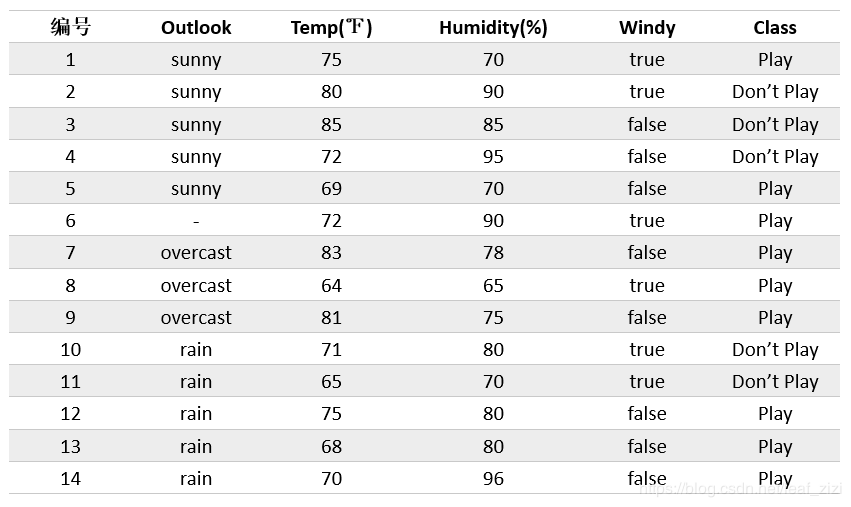
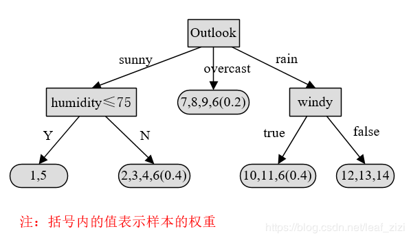
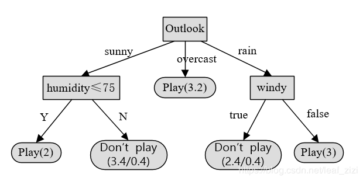
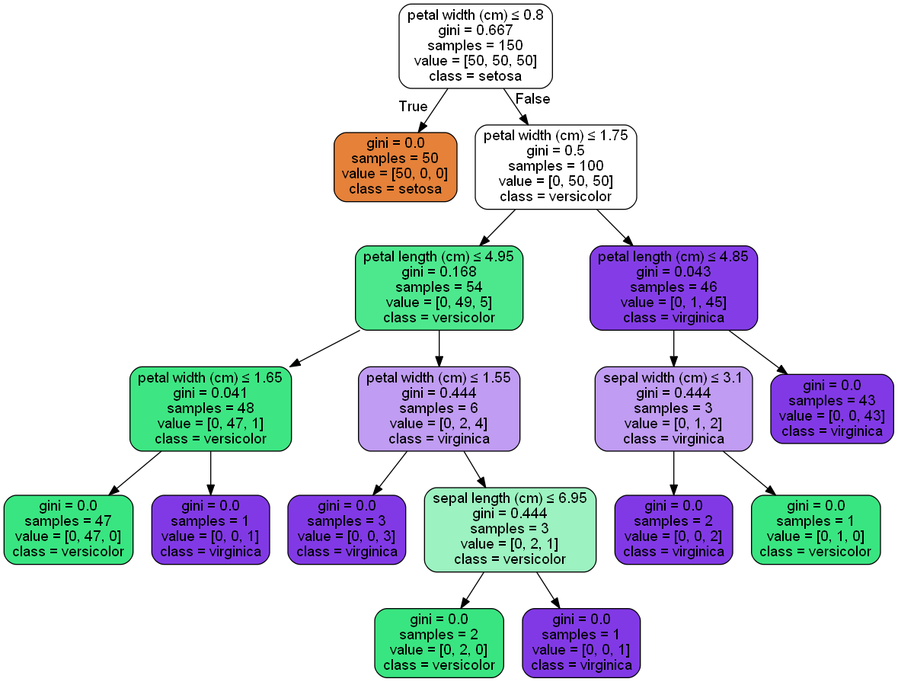
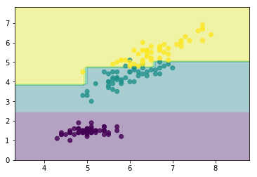
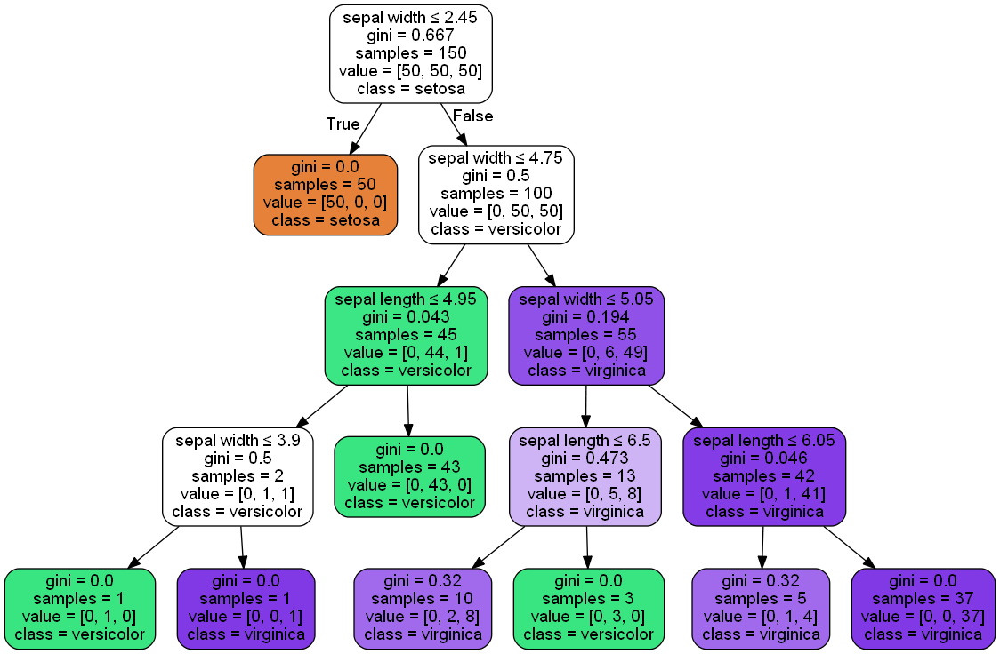
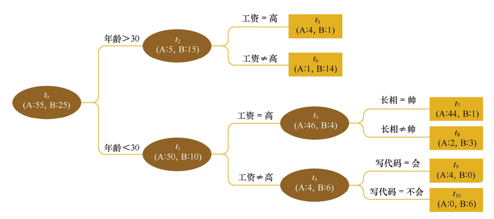
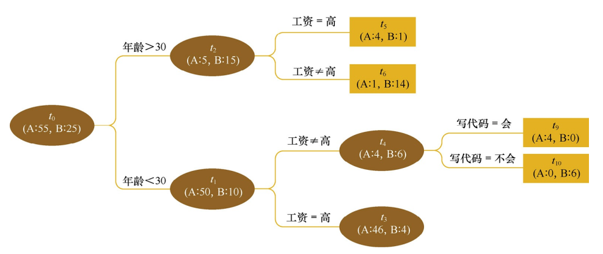
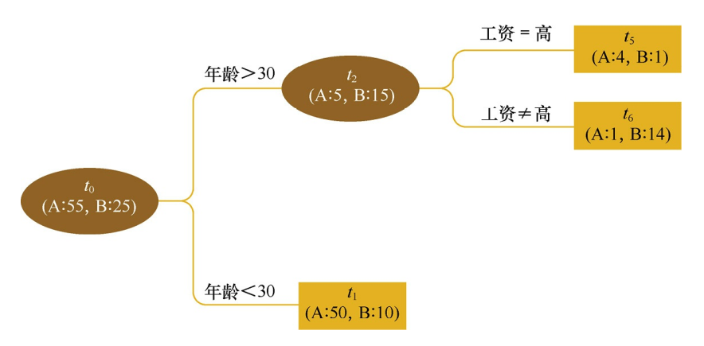

<center><font color=steel size=14>决策树</font></center>

决策树算法在机器学习中算是很经典的一个算法系列了。它既可以作为分类算法，也可以作为回归算法，同时也特别适合集成学习比如随机森林。

# 决策树ID3算法的信息论基础

1970年代，一个叫**昆兰**的大牛找到了用信息论中的熵来度量决策树的决策选择过程，方法一出，它的简洁和高效就引起了轰动，昆兰把这个算法叫做ID3。下面我们就看看ID3算法是怎么选择特征的。

## 熵

首先，我们需要熟悉信息论中熵的概念。


**熵度量了事物的不确定性，越不确定的事物，它的熵就越大**。

具体的，随机变量X的熵的表达式如下：
$$
H(X) = -\sum\limits_{i=1}^{n}p_i logp_i
$$

其中$n$代表$X$的$n$种不同的离散取值。而$p_i$代表了$X$取值为$i$的概率，$log$为以2或者$e$为底的对数。


**举个例子:**

- 比如X有2个可能的取值，而这两个取值各为1/2时X的熵最大，此时X具有最大的不确定性。值为:
  $$
  H(X) = -(\frac{1}{2}log\frac{1}{2} + \frac{1}{2}log\frac{1}{2}) = log2
  $$
  
- 如果一个值概率大于1/2，另一个值概率小于1/2，则不确定性减少，对应的熵也会减少。比如一个概率1/3，一个概率2/3，则对应熵为:
  $$
  H(X) = -(\frac{1}{3}log\frac{1}{3} + \frac{2}{3}log\frac{2}{3}) = log3 - \frac{2}{3}log2 < log2)
  $$
  

## 联合熵

熟悉了一个变量X的熵，很容易推广到多个变量的联合熵，这里给出两个变量X和Y的联合熵表达式：
$$
H(X,Y) = -\sum\limits_{i=1}^{n}p(x_i,y_i)logp(x_i,y_i)
$$

## 条件熵

有了联合熵，又可以得到条件熵的表达式$H(Y|X)$，条件熵类似于条件概率, **它度量了在知道$X$以后我们的$Y$剩下的不确定性**。表达式如下：
$$
\begin{aligned} 
H(Y|X) & = \sum_{x \in \mathcal{X}} p(x) H(Y|X=x) \\ 
&=-\sum_{x \in \mathcal{X}} p(x) \sum_{y \in \mathcal{Y}} p(y|x) \log p(y|x) \\ 
&=-\sum_{x \in \mathcal{X}} \sum_{y \in \mathcal{Y}} p(x, y) \log p(y|x) \\ 
&=-\sum_{x \in \mathcal{X}, y \in \mathcal{Y}} p(x, y) \log p(y | x) 
\end{aligned}
$$


> 联合熵、条件熵、熵的关系

边缘概率和联合概率的关系：
$$
\begin{align}
\ P(X=a)=\sum_{b}^{ } P(X=a,Y=b) \\
\ P(Y=b)=\sum_{a}^{ } P(X=a,Y=b)
\end{align}
$$

$$
\begin{aligned} 
H(X, Y) &=-\sum_{x \in \mathcal{X}, y \in \mathcal{Y}} p(x, y) \log p(x, y) \\ 
&=-\sum_{x \in \mathcal{X}, y \in \mathcal{Y}} p(x, y) \log (p(y | x) p(x)) \\ 
&=-\sum_{x \in \mathcal{X}, y \in \mathcal{Y}} p(x, y) \log p(y | x)-\sum_{x \in \mathcal{X}, y \in \mathcal{Y}} p(x, y) \log p(x) \\ 
&=H(Y | X)-\sum_{x \in \mathcal{X}} p(x) \log p(x) \\ 
&=H(Y | X)+H(X) \\ 
&=H(X)+H(Y | X) 
\end{aligned}
$$

> 证明2：

$$
\begin{align}
H(X, Y)-H(X) &=-\sum_{x \in \mathcal{X}, y \in \mathcal{Y}} p(x, y) \log p(x, y)+\sum_{x \in \mathcal{X}} p(x) \log p(x) \\
&=-\sum_{x \in \mathcal{X}, y \in \mathcal{Y}} p(x, y) \log p(x, y)+\sum_{x \in \mathcal{X}}\left(\sum_{y \in \mathcal{Y}} p(x, y)\right) \log p(x) \\
&=-\sum_{x \in \mathcal{X}, y \in \mathcal{Y}} p(x, y) \log p(x, y)+\sum_{x \in \mathcal{X}, y \in \mathcal{Y}} p(x, y) \log p(x) \\
&=-\sum_{x \in \mathcal{X}, y \in \mathcal{Y}} p(x, y) \log \frac{p(x, y)}{p(x)} \\
&=-\sum_{x \in \mathcal{X}, y \in \mathcal{Y}} p(x, y) \log p(y \mid x) \\
&=H(Y|X)
\end{align}
$$


## 信息增益

- 我们刚才提到$H(X)$度量了$X$的不确定性，条件熵$H(X|Y)$度量了我们在知道$Y$以后$X$剩下的不确定性。
- 那么$H(X)-H(X|Y)$呢？从上面的描述大家可以看出，它度量了$X$在知道$Y$以后**不确定性减少程度**，这个度量我们在信息论中称为**互信息**，记为$I(X,Y)$。
- 在决策树ID3算法中叫做**信息增益**。ID3算法就是用信息增益来判断当前节点应该用什么特征来构建决策树。**信息增益越大，则越适合用来分类**。


用下面这个图很容易明白他们的关系。
- 左边的椭圆代表$H(X)$,右边的椭圆代表$H(Y)$。
- 中间重合的部分就是我们的互信息或者信息增益$I(X,Y)$。
- 左边的椭圆去掉重合部分就是$H(X|Y)$,右边的椭圆去掉重合部分就是$H(Y|X)$。
- 两个椭圆的并就是$H(X,Y)$。


# 决策树ID3算法的思路

ID3算法就是用**信息增益**大小来判断当前节点应该用什么特征来构建决策树，用计算出的**信息增益最大的特征**来建立决策树的当前节点。


**举个例子**

1. 比如我们有15个样本D，输出为0或者1。其中有9个输出为1， 6个输出为0。 

2. 样本中有个特征A，取值为A1，A2和A3。

	- 在取值为A1的样本的输出中，有3个输出为1， 2个输出为0。
	
	- 取值为A2的样本输出中,2个输出为1,3个输出为0。
	
	- 在取值为A3的样本中，4个输出为1，1个输出为0。

序号|特征A|输出
:-:|:-:|:-:
1|A1|1
2|A1|1
3|A1|1
4|A1|0
5|A1|0
6|A2|1
7|A2|1
8|A2|0
9|A2|0
10|A2|0
11|A3|1
12|A3|1
13|A3|1
14|A3|1
15|A3|0

样本D的熵为：
$$
H(D) = -(\frac{9}{15}log_2\frac{9}{15} + \frac{6}{15}log_2\frac{6}{15}) = 0.971
$$

样本D在特征下的条件熵为：
$$
\begin{align}
H(D|A) =& \frac{5}{15}H(D1) + \frac{5}{15}H(D2) + \frac{5}{15}H(D3)\\

=& -\frac{5}{15}(\frac{3}{5}log_2\frac{3}{5} + \frac{2}{5}log_2\frac{2}{5}) - \frac{5}{15}(\frac{2}{5}log_2\frac{2}{5} + \frac{3}{5}log_2\frac{3}{5}) -\frac{5}{15}(\frac{4}{5}log_2\frac{4}{5} + \frac{1}{5}log_2\frac{1}{5}) \\
=& 0.888
\end{align}
$$


对应的信息增益为:

$$
I(D,A) = H(D) - H(D|A) = 0.083
$$


## 算法流程

**输入**：$m$个样本，样本输出集合为$D$，每个样本有$n$个离散特征，特征集合即为$A$，输出为决策树$T$。

**算法的过程为：**

1.  初始化信息增益的阈值$\epsilon$。

2.  判断**样本是否为同一类**输出$D_i$，如果是则返回单节点树$T$。标记类别为$D_i$  。

3.  **判断特征是否为空**，如果是则返回单节点树$T$，标记类别为样本中输出类别$D$实例数最多的类别。 

4. 计算$A$中的各个特征（一共n个）对输出$D$的信息增益，选择信息增益最大的特征$A_g$。

5. 如果$A_g$的信息增益小于阈值$\epsilon$，则返回单节点树$T$，标记类别为样本中输出类别$D$实例数最多的类别。

6. 否则，按特征$A_g$的不同取值$A_{gi}$将对应的样本输出$D$分成不同的类别$Di$。每个类别产生一个子节点(**多叉树**)。对应特征值为$A_{gi}$。返回增加了节点的树$T$。

7. 对于所有的子节点，令$D=D_i,  A= A-\{A_g\}$递归调用2-6步，得到子树$T_i$并返回。


## 决策树ID3算法的不足

​	ID3算法虽然提出了新思路，但是还是有很多值得改进的地方。
1.  ID3**没有考虑连续特征**，比如长度，密度都是连续值，无法在ID3运用。这大大限制了ID3的用途。

2. ID3采用信息增益大的特征优先建立决策树的节点。很快就被人发现，在相同条件下，**取值比较多的特征比取值少的特征信息增益大**。比如一个变量有2个值，各为1/2，另一个变量为3个值，各为1/3，其实他们都是完全不确定的变量，但是取3个值的比取2个值的信息增益大。如果校正这个问题呢？

3. ID3算法对于**缺失值**的情况没有做考虑。

4. 没有考虑**过拟合**的问题。

> ID3算法的作者昆兰基于上述不足，对ID3算法做了改进，这就是C4.5算法，也许你会问，为什么不叫ID4，ID5之类的名字呢?那是因为决策树太火爆，他的ID3一出来，别人二次创新，很快 就占了ID4， ID5，所以他另辟蹊径，取名C4.0算法，后来的进化版为C4.5算法。


# 决策树C4.5算法的改进

昆兰在C4.5算法中改进了上述4个问题。

## 问题一：连续特征

1. 对于第一个问题，不能处理连续特征， $C4.5$的思路是将连续的特征离散化。

2. 比如$m$个样本的连续特征$A$有$m$个，从**小到大**排列为$a_1,a_2,...,a_m$,则$C4.5$**取相邻两样本值的平均数**，一共取得$m-1$个划分点，其中第$i$个划分点$T_i$表示为：$T_i = \frac{a_i+a_{i+1}}{2}$。

3. 对于这$m-1$个点，分别计算以该点作为二元分类点时的信息增益。选择信息增益最大的点作为该连续特征的二元离散分类点。

4. 比如取到的增益最大的点为$a_t$, 则小于$a_t$的值为类别1，大于$a_t$的值为类别2，这样我们就做到了连续特征的离散化。  

5. **要注意的是，与离散属性不同的是，如果当前节点为连续属性，则该属性后面还可以参与子节点的产生选择过程。**


## 问题二：在相同条件下，取值比较多的特征比取值少的特征信息增益大

对于第二个问题，信息增益作为标准容易偏向于取值较多的特征的问题。我们引入一个**信息增益比的变量$I_R(X,Y)$，它是信息增益和特征熵的比值**。表达式如下：
$$
I_R(D,A) = \frac{I(A,D)}{H_A(D)}
$$

其中$D$为样本特征输出的集合，$A$为样本特征，对于**特征熵**$H_A(D)$, 表达式如下：
$$
H_A(D) = -\sum\limits_{i=1}^{n}\frac{|D_i|}{|D|}log_2\frac{|D_i|}{|D|}
$$

其中$n$为特征$A$的类别数， $|D_i|$为特征$A$的第$i$个取值对应的样本个数。$|D|$为样本个数。

**特征数越多的特征对应的特征熵越大，它作为分母，可以校正信息增益容易偏向于取值较多的特征的问题。**

因此， 通过引入信息增益比， 一定程度上对取值比较多的特征进行惩罚， 避免ID3出现过拟合的特性， 提升决策树的泛化能力。  


## 问题三：缺失值处理的问题

对于第三个缺失值处理的问题，主要需要解决的是两个问题：
1. 在样本某些特征缺失的情况下选择划分的属性。

2. 选定了划分属性，对于在该属性上缺失特征的样本的处理。

对于第一个子问题，对于某一个有缺失特征值的特征$A$。C4.5的思路是将数据分成两部分，对每个样本设置一个权重（初始可以都为1），然后划分数据，一部分是有特征值$A$的数据$D_1$，另一部分是没有特征$A$的数据$D_2$。 **然后对于数据$D_1$来和对应的$A$特征的各个特征值一起计算加权重后的信息增益比，最后乘上一个系数，这个系数是无特征$A$缺失的样本加权后所占加权总样本的比例。**

对于第二个子问题，可以**将缺失特征的样本同时划分入所有的子节点，不过将该样本的权重按各个子节点样本的数量比例来分配**。比如缺失特征$A$的样本$a$之前权重为1，特征$A$有3个特征值$A_1,A_2,A_3$。 3个特征值对应的（无缺失$A$特征的）样本个数为2,3,4。则$a$同时划分入$A_1，A_2，A_3$。对应权重调节为2/9, 3/9, 4/9。


## 问题四：过拟合

**对于第4个问题，C4.5引入了正则化系数进行初步的剪枝。**


## 决策树C4.5算法的不足与思考

C4.5虽然改进或者改善了ID3算法的几个主要的问题，仍然有优化的空间。

1. 由于决策树算法非常容易过拟合，因此对于生成的决策树必须要进行**剪枝**。剪枝的算法有非常多，C4.5的剪枝方法有优化的空间。思路主要是两种：

	- 一种是预剪枝，即在生成决策树的时候就决定是否剪枝。
	
	- 另一个是后剪枝，即先生成决策树，再通过交叉验证来剪枝。后面讲CART树的时候我们会专门讲决策树的减枝思路，主要采用的是**后剪枝加上交叉验证**选择最合适的决策树。

2.  C4.5生成的是**多叉树**，即一个父节点可以有多个节点。很多时候，在计算机中**二叉树**模型会比多叉树运算效率高。如果采用二叉树，可以提高效率。

3. C4.5只能用于**分类**，如果能将决策树用于**回归**的话可以扩大它的使用范围。

4. C4.5由于使用了熵模型，里面有大量的耗时的对数**运算**, 如果是连续值还有大量的排序运算。如果能够加以模型简化可以减少运算强度但又不牺牲太多准确性的话，那就更好了。

这4个问题在CART树里面部分加以了改进。所以目前如果不考虑集成学习话，在普通的决策树算法里，CART算法算是比较优的算法了。scikit-learn的决策树使用的也是CART算法。

>我们讲到了决策树里ID3算法，和ID3算法的改进版C4.5算法。对于C4.5算法，我们也提到了它的不足，比如模型是用较为复杂的熵来度量，使用了相对较为复杂的多叉树，只能处理分类不能处理回归等。
>
>对于这些问题， CART算法大部分做了改进。CART算法也就是我们下面的重点了。由于CART算法可以做回归，也可以做分类，我们分别加以介绍，先从CART分类树算法开始，重点比较和C4.5算法的不同点。接着介绍CART回归树算法，重点介绍和CART分类树的不同点。然后我们讨论CART树的建树算法和剪枝算法，最后总结决策树算法的优缺点。


## 如果测试样本的属性值不完整，该如何确定该样本的类别？

这里我们使用昆兰原著中的数据集，能够更好的体现算法的原理。



用前面的计算过程，会得到一个决策树，我们先看一下每个样本在树节点中的分布情况：



然后我们对树的结构做个改进，给每个叶子节点加个数值，例如（N/E)，N表示该叶节点中所包含的总样本数，E表示与该叶节点的类别不同的样本数，然后就可以得到这样的树结构。



现在我们使用这个决策树对测试样本分类，样本的属性值为：ountlook=sunny, temperature=70, humidity=?, windy=false.

测试样本进入左侧第一个分支，但是humidity属性值未知，因此两个分支的可能性都会考虑：

- 如果humidity<=75，类别是play的概率为2/2（100%）。
- 如果humidity>75，类别是Don't play的概率为3/3.4（88%），play的概率是0.4/3.4（12%）。

那么，总的类别分布情况是：

- `play`：$2 / 5.4 \times 100\% + 3.4 / 5.4 \times 12\%=44\%$
- `Don't play`:  $2 / 5.4 \times 0\% +3.4 / 5.4 \times 88 \%=56 \%$

因此，该样本的类别判定为Don't play。

# CART分类树

## CART分类树算法的最优特征选择方法

我们知道，在ID3算法中我们使用了**信息增益**来选择特征，信息增益大的优先选择。

在C4.5算法中，采用了**信息增益比**来选择特征，以减少信息增益容易选择特征值多的特征的问题。

但是无论是ID3还是C4.5,都是基于信息论的熵模型的，这里面会涉及大量的对数运算。能不能简化模型同时也不至于完全丢失熵模型的优点呢？

CART分类树算法使用**基尼系数**来代替信息增益比，基尼系数代表了模型的不纯度，**基尼系数越小，则不纯度越低，特征越好。这和信息增益(比)是相反的。**

具体的，在分类问题中，假设有$K$个类别，第$k$个类别的概率为$p_k$, 则**基尼系数**的表达式为：
$$
Gini(p) = \sum\limits_{k=1}^{K}p_k(1-p_k) = 1- \sum\limits_{k=1}^{K}p_k^2
$$

如果是**二类分类**问题，计算就更加简单了，如果属于第一个样本输出的概率是 $p$，则基尼系数的表达式为：
$$
Gini(p) = 2p(1-p)
$$

对于个给定的样本$D$,假设有$K$个类别, 第$k$个类别的数量为$C_k$,则样本$D$的**基尼系数表达式**为：
$$
Gini(D) = 1-\sum\limits_{k=1}^{K}(\frac{|C_k|}{|D|})^2
$$

特别的，对于样本$D$, 如果根据特征$A$的某个值$a$, 把$D$分成$D_1$和$D_2$两部分，则在特征$A$的条件下，$D$的基尼系数表达式为：
$$
Gini(D,A) = \frac{|D_1|}{|D|}Gini(D_1) + \frac{|D_2|}{|D|}Gini(D_2)
$$

大家可以比较下基尼系数表达式和熵模型的表达式，二次运算是不是比对数简单很多？尤其是二类分类的计算，更加简单。但是简单归简单，和熵模型的度量方式比，基尼系数对应的误差有多大呢？对于二类分类，基尼系数和熵之半的曲线如下：


从上图可以看出，基尼系数和熵之半的曲线非常接近，仅仅在45度角附近误差稍大。

因此，**基尼系数可以做为熵模型的一个近似替代**。而CART分类树算法就是使用的基尼系数来选择决策树的特征。

同时，为了进一步简化，CART分类树算法每次仅仅对某个特征的值进行二分，而不是多分，这样CART分类树算法建立起来的是二叉树，而不是多叉树。这样一可以进一步简化基尼系数的计算，二可以建立一个更加优雅的二叉树模型。


## CART分类树算法对于连续特征和离散特征处理的改进

### CART分类树连续值的处理

对于CART分类树连续值的处理问题，其思想和C4.5是相同的，都是将连续的特征离散化。唯一的区别在于在选择划分点时的**度量方式不同**，C4.5使用的是信息增益比，则CART分类树使用的是基尼系数。 

具体的思路如下，比如$m$个样本的连续特征$A$有$m$个，从小到大排列为$a1,a2,...,am,$ 则CART算法取相邻两样本值的平均数，一共取得$m-1$个划分点，其中第$i$个划分点$T_i$表示为：$T_i = \frac{a_i+a_{i+1}}{2}$。 

对于这$m-1$个点，分别计算以该点作为二元分类点时的基尼系数。选择基尼系数最小的点作为该连续特征的二元离散分类点。 

比如取到的基尼系数最小的点为$a_t$, 则小于$a_t$的值为类别1，大于$a_t$的值为类别2，这样我们就做到了连续特征的离散化。


要注意的是，**与ID3或者C4.5处理离散属性不同的是，如果当前节点为离散属性，则该属性后面还可以参与子节点的产生选择过程。**


### CART分类树离散值的处理

对于CART分类树离散值的处理问题，采用的思路是**不停的二分离散特征**。

回忆下ID3或者C4.5，如果某个特征A被选取建立决策树节点，如果它有A1,A2,A3三种类别，我们会在决策树上一下建立一个三叉的节点。这样导致决策树是多叉树。

但是CART分类树使用的方法不同，他采用的是不停的二分，还是这个例子，CART分类树会考虑把A分成{A1}和{A2,A3}, {A2}和{A1,A3}, {A3}和{A1,A2}三种情况，找到基尼系数最小的组合，比如{A2}和{A1,A3},然后建立二叉树节点，一个节点是A2对应的样本，另一个节点是{A1,A3}对应的节点。

同时，由于这次没有把特征A的取值完全分开，后面我们还有机会在子节点继续选择到特征A来划分A1和A3。这和ID3或者C4.5不同，**在ID3或者C4.5的一棵子树中，离散特征只会参与一次节点的建立。**


## CART分类树建立算法的具体流程

- 算法输入是训练集D，基尼系数的阈值，样本个数阈值。
- **输出**是决策树T。


我们的算法从根节点开始，用训练集递归的建立CART树。

1. 对于当前节点的数据集为D，如果样本个数小于阈值或者没有特征，则返回决策子树，当前节点停止递归。

2. 计算样本集D的基尼系数，如果基尼系数小于阈值，则返回决策树子树，当前节点停止递归。

3. 计算当前节点现有的各个特征的各个特征值对数据集D的基尼系数，对于离散值和连续值的处理方法和基尼系数的计算。缺失值的处理方法和上篇的C4.5算法里描述的相同。

4. 在计算出来的各个特征的各个特征值对数据集D的基尼系数中，选择基尼系数最小的特征A和对应的特征值a。根据这个最优特征和最优特征值，把数据集划分成两部分D1和D2，同时建立当前节点的左右节点，做节点的数据集D为D1，右节点的数据集D为D2。

5. 对左右的子节点递归的调用1-4步，生成决策树。

对于生成的决策树做预测的时候，假如测试集里的样本A落到了某个叶子节点，而节点里有多个训练样本。则对于A的类别预测采用的是这个叶子节点里**概率最大的类别**。


## CART回归树建立算法

CART回归树和CART分类树的建立算法大部分是类似的，所以这里我们只讨论CART回归树和CART分类树的建立算法不同的地方。

首先，我们要明白，什么是回归树，什么是分类树。两者的区别在于样本输出，如果样本输出是离散值，那么这是一颗分类树。如果果样本输出是连续值，那么那么这是一颗回归树。  

除了概念的不同，CART回归树和CART分类树的建立和预测的区别主要有下面两点：

1. 连续值的处理方法不同。
2. 决策树建立后做预测的方式不同。


### 对于连续值的处理

对于连续值的处理，我们知道CART分类树采用的是用基尼系数的大小来度量特征的各个划分点的优劣情况。

这比较适合分类模型，但是对于回归模型，我们使用了常见的**和方差的度量方式**，CART回归树的度量目标是，对于任意划分特征$A$，对应的任意划分点$s$两边划分成的数据集$D_1$和$D_2$，求出使$D_1$和$D_2$各自集合的均方差最小，**同时$D_1$和$D_2$的均方差之和最小所对应的特征和特征值划分点**。表达式为：
$$
\underbrace{min}_{A,s}\Bigg[\underbrace{min}_{c_1}\sum\limits_{x_i \in D_1(A,s)}(y_i - c_1)^2 + \underbrace{min}_{c_2}\sum\limits_{x_i \in D_2(A,s)}(y_i - c_2)^2\Bigg]
$$

其中，$c_1$为$D_1$数据集的样本输出均值，$c_2$为$D_2$数据集的样本输出均值。


### 预测的方式

对于决策树建立后做预测的方式，上面讲到了CART分类树采用叶子节点里概率最大的类别作为当前节点的预测类别。而回归树输出不是类别，它采用的是用最终叶子的**均值**或者**中位数**来预测输出结果。  

除了上面提到了以外，CART回归树和CART分类树的建立算法和预测没有什么区别。


# CART树算法的剪枝

CART回归树和CART分类树的剪枝策略除了在度量损失的时候一个使用均方差，一个使用基尼系数，算法基本完全一样，这里我们一起来讲。

由于决策时算法很容易对训练集过拟合，而导致泛化能力差，为了解决这个问题，我们需要对CART树进行剪枝，即类似于线性回归的正则化，来增加决策树的泛化能力。但是，有很多的剪枝方法，我们应该这么选择呢？CART采用的办法是**后剪枝法，即先生成决策树，然后产生所有可能的剪枝后的CART树，然后使用交叉验证来检验各种剪枝的效果，选择泛化能力最好的剪枝策略。**


也就是说，CART树的剪枝算法可以概括为两步  
- 第一步是从原始决策树生成各种剪枝效果的决策树。
- 第二步是用交叉验证来检验剪枝后的预测能力，选择泛化预测能力最好的剪枝后的数作为最终的CART树。


首先我们看看剪枝的损失函数度量，在剪枝的过程中，对于任意的一棵子树T,其损失函数为：
$$
C_{\alpha}(T_t) = C(T_t) + \alpha |T_t|
$$

其中，$\alpha$为正则化参数，这和线性回归的正则化一样。$C(T_t)$为训练数据的**预测误差**，**分类树是用基尼系数度量，回归树是均方差度量**。$|T_t|$是子树T的叶子节点的数量。

- 当$\alpha=0$时，即没有正则化，原始的生成的CART树即为最优子树。 
- 当$\alpha = \infty$时，即正则化强度达到最大，此时由原始的生成的CART树的根节点组成的单节点树为最优子树。 

当然，这是两种极端情况。一般来说，$\alpha$越大，则剪枝剪的越厉害，生成的最优子树相比原生决策树就越偏小。 
​对于固定的$\alpha$，一定存在使损失函数$C_{\alpha}(T)$最小的唯一子树。


***

看过剪枝的损失函数度量后，我们再来看看剪枝的思路，对于位于节点$t$的任意一颗子树$T_t$，如果没有剪枝，它的损失是:
$$
C_{\alpha}(T_t) = C(T_t) + \alpha |T_t|
$$

如果将其剪掉，仅仅保留根节点，则损失是:
$$
C_{\alpha}(T) = C(T) + \alpha
$$

- 当$\alpha = 0$或者$\alpha$很小时: $C_{\alpha}(T_t) < C_{\alpha}(T)$ 
- 当$\alpha$增大到一定的程度时: $C_{\alpha}(T_t) = C_{\alpha}(T)$ 
- 当$\alpha$继续增大时不等式反向，也就是说，如果满足下式： 

$$
\alpha = \frac{C(T)-C(T_t)}{|T_t|-1}
$$

$T_t$和$T$有相同的损失函数，但是$T$节点更少，因此可以对子树$T_t$进行剪枝，也就是将它的子节点全部剪掉，变为一个叶子节点$T$。


# CART树的交叉验证策略

最后我们看看CART树的交叉验证策略。上面我们讲到，可以计算出每个子树是否剪枝的阈值$\alpha$，如果我们把所有的节点是否剪枝的值$\alpha$都计算出来，然后分别针对不同的$\alpha$所对应的剪枝后的最优子树做交叉验证。这样就可以选择一个最好的$\alpha$，有了这个$\alpha$，我们就可以用对应的最优子树作为最终结果。

 **CART树的剪枝算法：**

- `输入`是CART树建立算法得到的原始决策树$T$。  
- `输出`是最优决策子树$T_\alpha$。

算法过程如下：

1. 初始化$\alpha_{min}= \infty$， 最优子树集合$\omega=\{T\}$。

2. 叶子节点开始自下而上计算各内部节点$t$的训练误差损失函数$C_{\alpha}(T_t)$（回归树为均方差，分类树为基尼系数）, 叶子节点数$|T_t|$，以及正则化阈值$\alpha= min\{\frac{C(T)-C(T_t)}{|T_t|-1}, \alpha_{min}\}$, 更新$\alpha_{min}= \alpha$。

3. 到所有节点的$\alpha$值的集合$M$。

4. 从$M$中选择最大的值$\alpha_k$，自上而下的访问子树$t$的内部节点，如果$\frac{C(T)-C(T_t)}{|T_t|-1} \leq \alpha_k$时，进行剪枝。并决定叶节点$t$的值。如果是分类树，则是概率最高的类别，如果是回归树，则是所有样本输出的均值。这样得到$\alpha_k$对应的最优子树$T_k$。

5. 最优子树集合$\omega=\omega \cup T_k$， $M= M -\{\alpha_k\}$。

6. 如果$M$不为空，则回到步骤4。否则就已经得到了所有的可选最优子树集合$\omega$。

7. 采用交叉验证在$\omega$选择最优子树$T_\alpha。$


***

# CART算法小结

上面我们对CART算法做了一个详细的介绍，CART算法相比C4.5算法的分类方法，采用了简化的二叉树模型，同时特征选择采用了近似的基尼系数来简化计算。当然CART树最大的好处是还可以做回归模型，这个C4.5没有。下表给出了ID3，C4.5和CART的一个比较总结。希望可以帮助大家理解。

算法|	支持模型|	树结构|	特征选择|	连续值处理|	缺失值处理|	 剪枝
:-:|:-:|:-:|:-:|:-:|:-:|:-:
ID3|分类|多叉树|信息增益|不支持	|不支持|不支持
C4.5|分类|多叉树|信息增益比|支持|支持|支持
CART|分类，回归|二叉树|基尼系数，均方差|支持|支持|支持


## CART缺点

看起来CART算法高大上，那么CART算法还有没有什么缺点呢？有！主要的缺点我认为如下：

1. 应该大家有注意到，无论是ID3, C4.5还是CART,在做特征选择的时候都是选择最优的一个特征来做分类决策，但是大多数，分类决策不应该是由某一个特征决定的，而是应该由一组特征决定的。这样决策得到的决策树更加准确。这个决策树叫做**多变量决策树**(multi-variate decision tree)。在选择最优特征的时候，多变量决策树不是选择某一个最优特征，而是选择最优的一个特征线性组合来做决策。这个算法的代表是OC1，这里不多介绍。

2. 如果样本发生一点点的改动，就会导致树结构的剧烈改变。这个可以通过集成学习里面的随机森林之类的方法解决。　


# 决策树算法小结

终于到了最后的总结阶段了，这里我们不再纠结于ID3, C4.5和 CART，我们来看看决策树算法作为一个大类别的分类回归算法的优缺点。

## 决策树算法的优点

1. 简单直观，生成的决策树很**直观**。

2. 基本**不需要预处理**，不需要提前归一化，处理缺失值。

3. 使用决策树预测的代价是O(log2m)。 m为样本数。

4. 既可以处理**离散值**也可以处理**连续值**。很多算法只是专注于离散值或者连续值。

5. 可以处理**多维度**输出的分类问题。

6. 相比于神经网络之类的黑盒分类模型，决策树在逻辑上可以得到**很好的解释**。

7. 可以交叉验证的剪枝来选择模型，从而提高泛化能力。

8. 对于异常点的**容错能力**好，健壮性高。


## 决策树算法的缺点

1. 决策树算法非常**容易过拟合，导致泛化能力不强**。可以通过设置节点最少样本数量和限制决策树深度来改进。

2. 决策树会因为**样本发生一点点的改动，就会导致树结构的剧烈改变**。这个可以通过集成学习之类的方法解决。

3. 寻找最优的决策树是一个**NP难的问题**，我们一般是通过启发式方法，容易陷入局部最优。可以通过集成学习之类的方法来改善。

4. 有些比较**复杂的关系，决策树很难学习**，比如异或。这个就没有办法了，一般这种关系可以换神经网络分类方法来解决。

5. 如果某些**特征的样本比例过大，生成决策树容易偏向于这些特征**。这个可以通过调节样本权重来改善。


# scikit-learn决策树算法类库的使用

从实践的角度来介绍决策树算法，主要是讲解使用scikit-learn来跑决策树算法，结果的可视化以及一些参数调参的关键点。

## scikit-learn决策树算法类库介绍

scikit-learn决策树算法类库内部实现是使用了调优过的CART树算法，既可以做分类，又可以做回归。  

分类决策树的类对应的是DecisionTreeClassifier，而回归决策树的类对应的是DecisionTreeRegressor。  

两者的参数定义几乎完全相同，但是意义不全相同。  

下面就对DecisionTreeClassifier和DecisionTreeRegressor的重要参数做一个总结，重点比较两者参数使用的不同点和调参的注意点。

**DecisionTreeClassifier和DecisionTreeClassifier 重要参数调参注意点**


1. 特征选择标准criterion

- **DecisionTreeClassifier:**  

可以使用"gini"或者"entropy"，前者代表基尼系数，后者代表信息增益。一般说使用默认的基尼系数"gini"就可以了，即CART算法。除非你更喜欢类似ID3, C4.5的最优特征选择方法。 

- **DecisionTreeRegressor:**

可以使用"mse"或者"mae"，前者是均方差，后者是和均值之差的绝对值之和。推荐使用默认的"mse"。一般来说"mse"比"mae"更加精确。除非你想比较二个参数的效果的不同之处。


2. 特征划分点选择标准splitter

- 可以使用"best"或者"random"。前者在特征的所有划分点中找出最优的划分点。后者是随机的在部分划分点中找局部最优的划分点。
- 默认的"best"适合样本量不大的时候，而如果样本数据量非常大，此时决策树构建推荐"random" 


3. 划分时考虑的最大特征数max_features

- 可以使用很多种类型的值，默认是"None",意味着划分时考虑所有的特征数；
	- 如果是"log2"意味着划分时最多考虑$log_2N$个特征；

	- 如果是"sqrt"或者"auto"意味着划分时最多考虑$\sqrt{N}$个特征。

	- 如果是整数，代表考虑的特征绝对数。

	- 如果是浮点数，代表考虑特征百分比，即考虑（百分比xN）取整后的特征数。其中N为样本总特征数。

- 一般来说，如果样本特征数不多，比如小于50，我们用默认的"None"就可以了，如果特征数非常多，我们可以灵活使用刚才描述的其他取值来控制划分时考虑的最大特征数，以控制决策树的生成时间。


4. 决策树最大深max_depth

- 决策树的最大深度，默认可以不输入，如果不输入的话，决策树在建立子树的时候不会限制子树的深度。
- 一般来说，数据少或者特征少的时候可以不管这个值。
- 如果模型样本量多，特征也多的情况下，推荐限制这个最大深度，具体的取值取决于数据的分布。
- 常用的可以取值10-100之间。


5. 内部节点再划分所需最小样本数min_samples_split

- 这个值限制了子树继续划分的条件，如果某节点的样本数少于min_samples_split，则不会继续再尝试选择最优特征来进行划分。 
- 默认是2，如果样本量不大，不需要管这个值。如果样本量数量级非常大，则推荐增大这个值。 
- 一个项目例子，有大概10万样本，选择了min_samples_split=10。可以作为参考。


6. 叶子节点最少样本数min_samples_leaf

- 这个值限制了叶子节点最少的样本数，如果某叶子节点数目小于样本数，则会和兄弟节点一起被剪枝。
- 默认是1, 可以输入最少的样本数的整数，或者最少样本数占样本总数的百分比。 
- 如果样本量不大，不需要管这个值。如果样本量数量级非常大，则推荐增大这个值。之前的10万样本项目使用min_samples_leaf的值为5，仅供参考。


7.  叶子节点最小的样本权重和min_weight_fraction_leaf

- 这个值限制了叶子节点所有样本权重和的最小值，如果小于这个值，则会和兄弟节点一起被剪枝。   
- 默认是0，就是不考虑权重问题。 
- 一般来说，如果我们有较多样本有缺失值，或者分类树样本的分布类别偏差很大，就会引入样本权重，这时我们就要注意这个值了。


8. 最大叶子节点数max_leaf_nodes

- 通过限制最大叶子节点数，可以防止过拟合，默认是"None”，即不限制最大的叶子节点数。  
- 如果加了限制，算法会建立在最大叶子节点数内最优的决策树。  
- 如果特征不多，可以不考虑这个值，但是如果特征分成多的话，可以加以限制，具体的值可以通过交叉验证得到。


9. 类别权重class_weight

- DecisionTreeClassifier

指定样本各类别的的权重，主要是为了防止训练集某些类别的样本过多，导致训练的决策树过于偏向这些类别。这里可以自己指定各个样本的权重，或者用“balanced”，如果使用“balanced”，则算法会自己计算权重，样本量少的类别所对应的样本权重会高。当然，如果你的样本类别分布没有明显的偏倚，则可以不管这个参数，选择默认的"None"

- DecisionTreeRegressor

不适用于回归树


10. 节点划分最小不纯度min_impurity_split

- 这个值限制了决策树的增长，如果某节点的不纯度(基尼系数，信息增益，均方差，绝对差)小于这个阈值，则该节点不再生成子节点。即为叶子节点 。
- 

11. 数据是否预排序presort

- 这个值是布尔值，默认是False不排序。 
- 一般来说，如果样本量少或者限制了一个深度很小的决策树，设置为true可以让划分点选择更加快，决策树建立的更加快。 
- 如果样本量太大的话，反而没有什么好处。 
- 问题是样本量少的时候，我速度本来就不慢。所以这个值一般懒得理它就可以了。


12. 其它注意点

除了这些参数要注意以外，其他在调参时的注意点有：
- 当样本少数量但是样本特征非常多的时候，决策树很容易过拟合，一般来说，样本数比特征数多一些会比较容易建立健壮的模型。
- 如果样本数量少但是样本特征非常多，在拟合决策树模型前，推荐先做维度规约，比如主成分分析（PCA），特征选择（Losso）或者独立成分分析（ICA）。这样特征的维度会大大减小。再来拟合决策树模型效果会好。
- 推荐多用决策树的可视化，同时先限制决策树的深度（比如最多3层），这样可以先观察下生成的决策树里数据的初步拟合情况，然后再决定是否要增加深度。
- 在训练模型前，注意观察样本的类别情况（主要指分类树），如果类别分布非常不均匀，就要考虑用class_weight来限制模型过于偏向样本多的类别。
- 决策树的数组使用的是numpy的float32类型，如果训练数据不是这样的格式，算法会先做copy再运行。
- 如果输入的样本矩阵是稀疏的，推荐在拟合前调用csc_matrix稀疏化，在预测前调用csr_matrix稀疏化。


## scikit-learn决策树结果的可视化

决策树可视化化可以方便我们直观的观察模型，以及发现模型中的问题。这里介绍下scikit-learn中决策树的可视化方法。


###  决策树可视化环境搭建

scikit-learn中决策树的可视化一般需要安装graphviz。主要包括graphviz的安装和python的graphviz插件的安装。

- 第一步是安装graphviz。[下载地址](http://www.graphviz.org/)如果你是linux，可以用apt-get或者yum的方法安装。如果是windows，就在官网下载msi文件安装。无论是linux还是windows，装完后都要设置环境变量，将graphviz的bin目录加到PATH，比如我是windows，将C:/Program Files (x86)/Graphviz2.38/bin/加入了PATH
- 第二步是安装python插件graphviz： pip install graphviz
- 第三步是安装python插件pydotplus。这个没有什么好说的: pip install pydotplus


这样环境就搭好了，有时候python会很笨，仍然找不到graphviz，这时，可以在代码里面加入这一行：
```python
os.environ["PATH"] += os.pathsep + 'C:/Program Files (x86)/Graphviz2.38/bin/'
```
注意后面的路径是你自己的graphviz的bin目录。


### 决策树可视化的三种方法


```python
from sklearn.datasets import load_iris
from sklearn import tree
import sys
import os       
os.environ["PATH"] += os.pathsep + 'C:/Program Files (x86)/Graphviz2.38/bin/'
```


```python
iris = load_iris()
clf = tree.DecisionTreeClassifier()
clf = clf.fit(iris.data, iris.target)
```


```python
with open("iris.dot", 'w') as f:
    f = tree.export_graphviz(clf, out_file=f)
```


#### 方法一

第一种是用graphviz的dot命令生成决策树的可视化文件，敲完这个命令后当前目录就可以看到决策树的可视化文件iris.pdf.打开可以看到决策树的模型图。
- 注意，这个命令在命令行执行 
dot -Tpdf iris.dot -o iris.pdf

#### 方法二

第二种方法是用pydotplus生成iris.pdf。这样就不用再命令行去专门生成pdf文件了。


```python
import pydotplus 
dot_data = tree.export_graphviz(clf, out_file=None) 
graph = pydotplus.graph_from_dot_data(dot_data) 
graph.write_pdf("iris.pdf") 
```


    True


#### 方法三

第三种办法是个人比较推荐的做法，因为这样可以直接把图产生在ipython的notebook。


```python
from IPython.display import Image  
dot_data = tree.export_graphviz(clf, out_file=None, 
                         feature_names=iris.feature_names,  
                         class_names=iris.target_names,  
                         filled=True, rounded=True,  
                         special_characters=True)  
graph = pydotplus.graph_from_dot_data(dot_data)  
Image(graph.create_png()) 
```





## DecisionTreeClassifier实例


```python
from itertools import product

import numpy as np
import matplotlib.pyplot as plt

from sklearn import datasets
from sklearn.tree import DecisionTreeClassifier

%matplotlib inline

# 仍然使用自带的iris数据
iris = datasets.load_iris()
X = iris.data[:, [0, 2]]
y = iris.target

# 训练模型，限制树的最大深度4
clf = DecisionTreeClassifier(max_depth=4)
# 拟合模型
clf.fit(X, y)


# 画图
x_min, x_max = X[:, 0].min() - 1, X[:, 0].max() + 1
y_min, y_max = X[:, 1].min() - 1, X[:, 1].max() + 1
xx, yy = np.meshgrid(np.arange(x_min, x_max, 0.1),
                     np.arange(y_min, y_max, 0.1))

Z = clf.predict(np.c_[xx.ravel(), yy.ravel()])
Z = Z.reshape(xx.shape)

plt.contourf(xx, yy, Z, alpha=0.4)
plt.scatter(X[:, 0], X[:, 1], c=y, alpha=0.8)
plt.show()
```




```python
from IPython.display import Image  
from sklearn import tree
import pydotplus 

dot_data = tree.export_graphviz(clf, 
                                out_file=None, 
                                feature_names=["sepal length","sepal width"],  
                                class_names=iris.target_names,  
                                filled=True, rounded=True,  
                                special_characters=True)  
graph = pydotplus.graph_from_dot_data(dot_data)  
Image(graph.create_png())
```




# 解答题

> 如何对决策树进行剪枝？  

决策树的剪枝通常有两种方法， 预剪枝（Pre-Pruning） 和后剪枝（PostPruning） 。 预剪枝， 即在生成决策树的过程中提前停止树的增长。 而后剪枝， 是在已生成的过拟合决策树上进行剪枝， 得到简化版的剪枝决策树。  

**预剪枝**

预剪枝的核心思想是在树中结点进行扩展之前， 先计算当前的划分是否能带来模型泛化能力的提升， 如果不能， 则不再继续生长子树。 此时可能存在不同类别的样本同时存于结点中， 按照多数投票的原则判断该结点所属类别。 预剪枝对于何时停止决策树的生长有以下几种方法。
（1） 当树到达一定深度的时候， 停止树的生长。
（2） 当到达当前结点的样本数量小于某个阈值的时候， 停止树的生长。
（3） 计算每次分裂对测试集的准确度提升， 当小于某个阈值的时候， 不再继续扩展。

预剪枝具有思想直接、 算法简单、 效率高等特点， 适合解决大规模问题。 但如何准确地估计何时停止树的生长（即上述方法中的深度或阈值） ， 针对不同问题会有很大差别， 需要一定经验判断。 且预剪枝存在一定局限性， 有欠拟合的风险， 虽然当前的划分会导致测试集准确率降低， 但在之后的划分中， 准确率可能会有显著上升。  


**后剪枝**

后剪枝的核心思想是让算法生成一棵完全生长的决策树， 然后从最底层向上计算是否剪枝。 剪枝过程将子树删除， 用一个叶子结点替代， 该结点的类别同样按照多数投票的原则进行判断。 同样地， 后剪枝也可以通过在测试集上的准确率进行判断， 如果剪枝过后准确率有所提升， 则进行剪枝。 相比于预剪枝， 后剪枝方法通常可以得到泛化能力更强的决策树， 但时间开销会更大。

常见的后剪枝方法包括错误率降低剪枝（Reduced Error Pruning， REP） 、 悲观剪枝（Pessimistic Error Pruning， PEP） 、 代价复杂度剪枝（Cost ComplexityPruning， CCP） 、 最小误差剪枝（Minimum Error Pruning， MEP） 、 CVP（CriticalValue Pruning） 、 OPP（Optimal Pruning） 等方法， 这些剪枝方法各有利弊， 关注不同的优化角度， 本文选取著名的CART剪枝方法CCP进行介绍。

代价复杂剪枝主要包含以下两个步骤。  

（1） 从完整决策树$T_0$开始， 生成一个子树序列${T_0,T_1,T_2,...,T_n}$， 其中$T_{i+1}$由$T_i$生成， $T_n$为树的根结点。
（2） 在子树序列中， 根据真实误差选择最佳的决策树。  


**步骤（1）**从$T_0$开始， 裁剪$T_i$中关于训练数据集合误差增加最小的分支以得到$T_{i+1}$。 具体地， 当一棵树$T$在结点$t$处剪枝时， 它的误差增加可以用$R(t)-R(T_t)$表示， 其中$R(t)$表示进行剪枝之后的该结点误差， $R(T_t)$表示未进行剪枝时子树$T_t$的误差。 考虑到树的复杂性因素， 我们用$|L(T_t)|$表示子树$T_t$的叶子结点个数， 则树在结点$t$处剪枝后的误差增加率为  
$$
\alpha=\frac{R(t)-R\left(T_{t}\right)}{\left|L\left(T_{t}\right)\right|-1}
$$
在得到$Ti$后， 我们每步选择$α$最小的结点进行相应剪枝。

用一个例子简单地介绍生成子树序列的方法。 假设把场景中的问题进行一定扩展， 女孩需要对80个人进行见或不见的分类。 假设根据某种规则， 已经得到了一棵CART决策树$T_0$， 如图所示。




此时共5个内部结点可供考虑， 其中  
$$
\begin{align}
\alpha\left(t_{0}\right)=&\frac{25-5}{6-1}=4 \\
\alpha\left(t_{1}\right)=&\frac{10-(1+2+0+0)}{4-1}=2.33 \\
\alpha\left(t_{2}\right)=&\frac{5-(1+1)}{2-1}=3 \\
\alpha\left(t_{3}\right)=&\frac{4-(1+2)}{2-1}=1 \\
\alpha\left(t_{4}\right)=&\frac{4-0}{2-1}=4
\end{align}
$$


可见$α(t3)$ 最小， 因此对$t_3$进行剪枝， 得到新的子树$T_1$， 如图所示。  



而后继续计算所有结点对应的误差增加率， 分别为$α(t1)=3$， $α(t2)=3$， $α(t4)=4$。因此对$t1$进行剪枝， 得到$T2$， 如图所示。 



此时$α(t_0)=6.5$， $α(t_2)=3$， 选择$t_2$进行剪枝， 得到$T_3$。 于是只剩下一个内部结点， 即根结点， 得到$T_4$。


在**步骤（ 2） **中， 我们需要从子树序列中选出真实误差最小的决策树。 CCP给出了两种常用的方法： 一种是基于独立剪枝数据集， 该方法与REP类似， 但由于其只能从子树序列${T_0,T_1,T_2,...,T_n}$中选择最佳决策树， 而非像REP能在所有可能的子树中寻找最优解， 因此性能上会有一定不足。 另一种是基于$k$折交叉验证， 将数据集分成$k$份， 前$k-1$份用于生成决策树， 最后一份用于选择最优的剪枝树。 重复进行$N$次， 再从这$N$个子树中选择最优的子树。  

**代价复杂度剪枝使用交叉验证策略时**， 不需要测试数据集， 精度与REP差不多， 但形成的树复杂度小。 而从算法复杂度角度， 由于生成子树序列的时间复杂度与原始决策树的非叶结点个数呈二次关系， 导致算法相比REP、 PEP、 MEP等线性复杂度的后剪枝方法， 运行时间开销更大。

剪枝过程在决策树模型中占据着极其重要的地位。 有很多研究表明， 剪枝比树的生成过程更为关键。 对于不同划分标准生成的过拟合决策树， 在经过剪枝之后都能保留最重要的属性划分， 因此最终的性能差距并不大。 理解剪枝方法的理论， 在实际应用中根据不同的数据类型、 规模， 决定使用何种决策树以及对应的剪枝策略， 灵活变通， 找到最优选择， 是本节想要传达给读者的思想。  


## 决策树中ID3、C4.5、CART算法一个一个讲解？


## ID3、C4.5、CART算法区别和联系？


## 决策树是如何解决过拟合问题的？


## CART树处理回归问题时特征是怎么选的，节点是怎么分裂的


