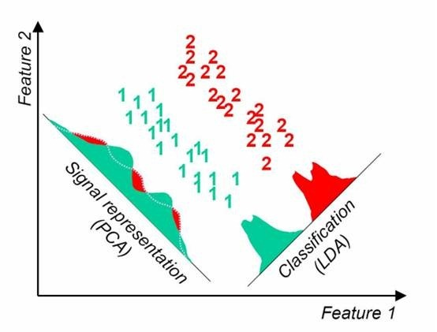
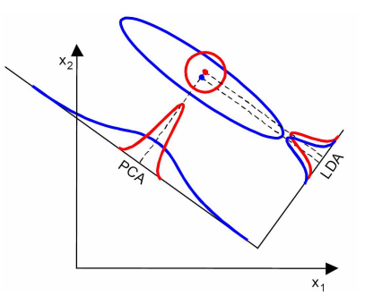
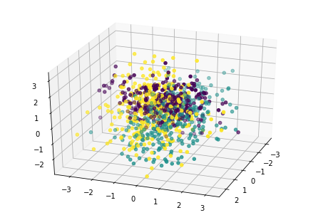
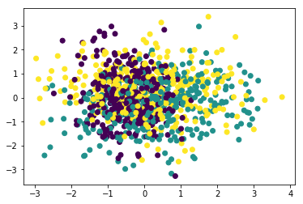
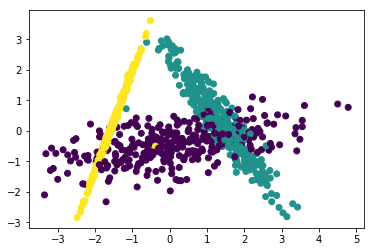

在PCA原理总结中，我们对降维算法PCA做了总结。这里我们就对另外一种经典的降维方法**线性判别分析**（Linear Discriminant Analysis, 以下简称LDA）做一个总结。LDA在模式识别领域（比如人脸识别，舰艇识别等图形图像识别领域）中有非常广泛的应用，因此我们有必要了解下它的算法原理。

在学习LDA之前，有必要将其自然语言处理领域的LDA区别开来，在自然语言处理领域， LDA是隐含狄利克雷分布（Latent Dirichlet Allocation，简称LDA），他是一种处理文档的主题模型。我们本文只讨论线性判别分析，因此后面所有的LDA均指线性判别分析。


#  LDA的思想

LDA是一种**监督学习**的降维技术，也就是说它的数据集的每个样本是有类别输出的。这点和PCA不同。PCA是不考虑样本类别输出的无监督降维技术。LDA的思想可以用一句话概括，就是**投影后类内方差最小，类间方差最大**。什么意思呢？ 我们要将数据在低维度上进行投影，投影后希望每一种类别数据的投影点尽可能的接近，而不同类别的数据的类别中心之间的距离尽可能的大。

可能还是有点抽象，我们先看看最简单的情况。假设我们有两类数据 分别为红色和蓝色，如下图所示，这些数据特征是二维的，我们希望将这些数据投影到一维的一条直线，让每一种类别数据的投影点尽可能的接近，而红色和蓝色数据中心之间的距离尽可能的大。


上图提供了两种投影方式，哪一种能更好的满足我们的标准呢？从直观上可以看出，右图要比左图的投影效果好，因为右图的黑色数据和蓝色数据各个较为集中，且类别之间的距离明显。左图则在边界处数据混杂。

以上就是LDA的主要思想了，当然在实际应用中，我们的数据是多个类别的，我们的原始数据一般也是超过二维的，投影后的也一般不是直线，而是一个低维的超平面。

在我们将上面直观的内容转化为可以度量的问题之前，我们先了解些必要的数学基础知识，这些在后面讲解具体LDA原理时会用到。


# 瑞利商（Rayleigh quotient）与广义瑞利商（genralized Rayleigh quotient）

我们首先来看看瑞利商的定义。瑞利商是指这样的函数$R(A,x)$:

$$
R(A,x) = \frac{x^HAx}{x^Hx}
$$
其中$x$为非零向量，而$A$为$n×n$的Hermitan矩阵。所谓的**Hermitan矩阵就是满足共轭转置矩阵和自己相等的矩阵**，即$A^H=A$。如果我们的矩阵A是实矩阵，则满足$A^T=A$的矩阵即为Hermitan矩阵。

瑞利商$R(A,x)$有一个非常重要的性质，即它的**最大值等于矩阵$A$最大的特征值，而最小值等于矩阵$A$的最小的特征值**，也就是满足

$$
\lambda_{min} \leq \frac{x^HAx}{x^Hx} \leq \lambda_{max}
$$
具体的证明这里就不给出了。当向量$x$是标准正交基时，即满足$x^Hx=1$时，瑞利商退化为：$R(A,x)=x^HAx$，这个形式在谱聚类和PCA中都有出现。

以上就是瑞利商的内容，现在我们再看看广义瑞利商。广义瑞利商是指这样的函数$R(A,B,x)$:

$$
R(A,x) = \frac{x^HAx}{x^HBx}
$$
其中$x$为非零向量，而$A,B$为$n×n$的Hermitan矩阵。$B$为正定矩阵。它的最大值和最小值是什么呢？其实我们只要通过将其通过标准化就可以转化为瑞利商的格式。我们令$x=B^{-1/2}x'$,则分母转化为：

$$
x^HBx = x'^H(B^{-1/2})^HBB^{-1/2}x' = x'^HB^{-1/2}BB^{-1/2}x' = x'^Hx'
$$
而分子转化为：

$$
x^HAx =  x'^HB^{-1/2}AB^{-1/2}x'
$$
此时我们的$R(A,B,x)$转化为$R(A,B,x′)$：

$$
R(A,B,x') = \frac{x'^HB^{-1/2}AB^{-1/2}x'}{x'^Hx'}
$$
利用前面的瑞利商的性质，我们可以很快的知道，$R(A,B,x′)$的最大值为矩阵$B^{-1/2}AB^{-1/2}$的最大特征值，或者说矩阵$B^{−1}A$的最大特征值，而最小值为矩阵$B^{−1}A$的最小特征值。如果你看过我写的[谱聚类（spectral clustering）原理总结](http://www.cnblogs.com/pinard/p/6221564.html)第6.2节的话，就会发现这里使用了一样的技巧，即对矩阵进行标准化。


#  二类LDA原理

现在我们回到LDA的原理上，我们在第一节说讲到了LDA希望投影后希望同一种类别数据的投影点尽可能的接近，而不同类别的数据的类别中心之间的距离尽可能的大，但是这只是一个感官的度量。现在我们首先从比较简单的二类LDA入手，严谨的分析LDA的原理。

假设我们的数据集$D=\{(x_1,y_1), (x_2,y_2), ...,(x_m,y_m)\}$,其中任意样本$x_i$为$n$维向量，$y_i \in \{0,1\}$。我们定义$N_j(j=0,1)$为第$j$类样本的个数，$X_j(j=0,1)$为第$j$类样本的集合，而$\mu_j(j=0,1)$为第$j$类样本的均值向量，定义$\Sigma_j(j=0,1)$为第$j$类样本的协方差矩阵（严格说是缺少分母部分的协方差矩阵）。

$\mu_j$的表达式为：

$$
\mu_j = \frac{1}{N_j}\sum\limits_{x \in X_j}x\;\;(j=0,1)
$$


$\Sigma_j$的表达式为：

$$
\Sigma_j = \sum\limits_{x \in X_j}(x-\mu_j)(x-\mu_j)^T\;\;(j=0,1)
$$
由于是两类数据，因此我们只需要将数据投影到一条直线上即可。假设我们的投影直线是向量$w$, 则对任意一个样本本$x_i$,它在直线$w$的投影为$w^Tx_i$, 对于我们的两个类别的中心点$μ_0,μ_1$,在在直线$w$的投影为$w^Tμ_0$和$w^Tμ_1$。

由于LDA需要让不同类别的数据的**类别中心之间的距离尽可能的大**，也就是我们要最大化$||w^T\mu_0-w^T\mu_1||_2^2$, 同时我们希望同一种类别数据的投影点尽可能的接近，也就是要**同类样本投影点的协方差$w^T\Sigma_0w$和$w^T\Sigma_1w$尽可能的小**，即最小化$w^T\Sigma_0w+w^T\Sigma_1w$。综上所述，我们的优化目标为：
$$
\underbrace{arg\;max}_w\;\;J(w) = \frac{||w^T\mu_0-w^T\mu_1||_2^2}{w^T\Sigma_0w+w^T\Sigma_1w} = \frac{w^T(\mu_0-\mu_1)(\mu_0-\mu_1)^Tw}{w^T(\Sigma_0+\Sigma_1)w}
$$


我们一般定义**类内散度**矩阵$S_w$为：

$$
S_w = \Sigma_0 + \Sigma_1 = \sum\limits_{x \in X_0}(x-\mu_0)(x-\mu_0)^T + \sum\limits_{x \in X_1}(x-\mu_1)(x-\mu_1)^T
$$
同时定义**类间散度**矩阵$S_b$为：

$$
S_b = (\mu_0-\mu_1)(\mu_0-\mu_1)^T
$$


这样我们的优化目标重写为：

$$
\underbrace{arg\;max}_w\;\;J(w) = \frac{w^TS_bw}{w^TS_ww}
$$
仔细一看上式，这不就是我们的广义瑞利商嘛！这就简单了，利用我们第二节讲到的广义瑞利商的性质，我们知道我们的$J(w')$最大值为矩阵$S^{−\frac{1}{2}}_wS_bS^{−\frac{1}{2}}_w$的最大特征值，而对应的$w'$为$S^{−\frac{1}{2}}_wS_bS^{−\frac{1}{2}}_w$的最大特征值对应的特征向量! 而$S_w^{-1}S_b$的特征值和$S^{−\frac{1}{2}}_wS_bS^{−\frac{1}{2}}_w$的特征值相同,$S_w^{-1}S_b$的特征向量$w$和$S^{−\frac{1}{2}}_wS_bS^{−\frac{1}{2}}_w$的特征向量$w'$满足$w = S^{−\frac{1}{2}}_ww'$的关系! 

注意到对于二类的时候，$S_bw$的方向恒平行于$\mu_0-\mu_1$, 不妨令$S_bw=\lambda(\mu_0-\mu_1)$，将其带入：$(S_w^{-1}S_b)w=\lambda w$，可以得到$w=S_w^{-1}(\mu_0-\mu_1)$， 也就是说我们只要求出原始二类样本的均值和方差就可以确定最佳的投影方向$w$了。


# 多类LDA原理

有了二类LDA的基础，我们再来看看多类别LDA的原理。

假设我们的数据集$D=\{(x_1,y_1), (x_2,y_2), ...,((x_m,y_m))\}$,其中任意样本$x_i$为$n$维向量，$y_i \in \{C_1,C_2,...,C_k\}$。我们定义$N_j(j=1,2...k)$为第$j$类样本的个数，$X_j(j=1,2...k)$为第$j$类样本的集合，而$\mu_j(j=1,2...k)$为第$j$类样本的均值向量，定义$\Sigma_j(j=1,2...k)$为第$j$类样本的协方差矩阵。在二类LDA里面定义的公式可以很容易的类推到多类LDA。

由于我们是多类向低维投影，则此时投影到的低维空间就不是一条直线，而是一个超平面了。假设我们投影到的低维空间的维度为d，对应的基向量为$(w_1,w_2,...w_d)$，基向量组成的矩阵为$W$, 它是一个$n×d$的矩阵。

此时我们的优化目标应该可以变成为:

$$
\frac{W^TS_bW}{W^TS_wW}
$$


其中$S_b = \sum\limits_{j=1}^{k}N_j(\mu_j-\mu)(\mu_j-\mu)^T$,$μ$为所有样本均值向量。$S_w =  \sum\limits_{j=1}^{k}S_{wj} = \sum\limits_{j=1}^{k}\sum\limits_{x \in X_j}(x-\mu_j)(x-\mu_j)^T$

但是有一个问题，就是$W^TS_bW$和$W^TS_wW$都是矩阵，不是标量，无法作为一个标量函数来优化！也就是说，我们无法直接用二类LDA的优化方法，怎么办呢？一般来说，我们可以用其他的一些替代优化目标来实现。

常见的一个LDA多类优化目标函数定义为：

$$
\underbrace{arg\;max}_W\;\;J(W) = \frac{\prod\limits_{diag}W^TS_bW}{\prod\limits_{diag}W^TS_wW}
$$
其中$\prod\limits_{diag}A$为$A$的主对角线元素的乘积，$W$为$n×d$的矩阵。

 　$J(W)$的优化过程可以转化为：

$$
J(W) = \frac{\prod\limits_{i=1}^dw_i^TS_bw_i}{\prod\limits_{i=1}^dw_i^TS_ww_i} = \prod\limits_{i=1}^d\frac{w_i^TS_bw_i}{w_i^TS_ww_i}
$$
仔细观察上式最右边，这不就是广义瑞利商嘛！最大值是矩阵$S^{−1}_wS_b$的最大特征值,最大的d个值的乘积就是矩阵$S^{−1}_wS_b$的最大的d个特征值的乘积,此时对应的矩阵$W$为这最大的d个特征值对应的特征向量张成的矩阵。

由于$W$是一个利用了样本的类别得到的投影矩阵，因此它的降维到的维度d最大值为k-1。为什么最大维度不是类别数k呢？因为$S_b$中每个$\mu_j-\mu$的秩为1，因此协方差矩阵相加后最大的秩为k(矩阵的秩小于等于各个相加矩阵的秩的和)，但是由于如果我们知道前k-1个$μ_j$后，最后一个$μ_k$可以由前k-1个$μ_j$线性表示，因此$S_b$的秩最大为k-1，即特征向量最多有k-1个。


#  LDA算法流程

在第三节和第四节我们讲述了LDA的原理，现在我们对LDA降维的流程做一个总结。

`输入`：数据集$D=\{(x_1,y_1), (x_2,y_2), ...,(x_m,y_m)\}$,其中任意样本$x_i$为n维向量，$y_i \in \{C_1,C_2,...,C_k\}$，降维到的维度$d$。

`输出`：降维后的样本集$D′$

1. 计算类内散度矩阵$S_w$
2. 计算类间散度矩阵$S_b$
3. 计算矩阵$S_w^{-1}S_b$
4. 计算$S_w^{-1}S_b$的最大的d个特征值和对应的d个特征向量$(w_1,w_2,...w_d)$,得到投影矩阵$W$
5. 对样本集中的每一个样本特征$x_i$,转化为新的样本$z_i=W^Tx_i$
6. 得到输出样本集$D'=\{(z_1,y_1), (z_2,y_2), ...,((z_m,y_m))\}$

 以上就是使用LDA进行降维的算法流程。实际上LDA除了可以用于降维以外，还可以用于分类。

一个常见的LDA分类基本思想是假设各个类别的样本数据符合高斯分布，这样利用LDA进行投影后，可以利用极大似然估计计算各个类别投影数据的均值和方差，进而得到该类别高斯分布的概率密度函数。当一个新的样本到来后，我们可以将它投影，然后将投影后的样本特征分别带入各个类别的高斯分布概率密度函数，计算它属于这个类别的概率，最大的概率对应的类别即为预测类别。

由于LDA应用于分类现在似乎也不是那么流行。


#  LDA vs PCA

LDA用于降维，和PCA有很多相同，也有很多不同的地方，因此值得好好的比较一下两者的降维异同点。

**相同点**：

1. 两者均可以对数据进行降维。
2. 两者在降维时均使用了矩阵特征分解的思想。
3. 两者都假设数据符合高斯分布。


**不同点**：

1. LDA是有监督的降维方法，而PCA是无监督的降维方法。
2. LDA降维最多降到类别数k-1的维数，而PCA没有这个限制。
3. LDA除了可以用于降维，还可以用于分类。
4. LDA选择分类性能最好的投影方向，而PCA选择样本点投影具有最大方差的方向。

这点可以从下图形象的看出，在某些数据分布下LDA比PCA降维较优。



当然，某些某些数据分布下PCA比LDA降维较优，如下图所示：



# LDA算法小结

LDA算法既可以用来降维，又可以用来分类，但是目前来说，主要还是用于降维。在我们进行图像识别相关的数据分析时，LDA是一个有力的工具。下面总结下LDA算法的优缺点。

LDA算法的主要**优点**有：

1. 在降维过程中可以使用类别的先验知识经验，而像PCA这样的无监督学习则无法使用类别先验知识。
2. LDA在样本分类信息依赖均值而不是方差的时候，比PCA之类的算法较优。


LDA算法的主要**缺点**有：

1. LDA不适合对非高斯分布样本进行降维，PCA也有这个问题。
2. LDA降维最多降到类别数k-1的维数，如果我们降维的维度大于k-1，则不能使用LDA。当然目前有一些LDA的进化版算法可以绕过这个问题。
3. LDA在样本分类信息依赖方差而不是均值的时候，降维效果不好。
4. LDA可能过度拟合数据。

 

# 用scikit-learn进行LDA降维

1. 对scikit-learn中LDA类概述

在scikit-learn中， LDA类是sklearn.discriminant_analysis.LinearDiscriminantAnalysis。那既可以用于分类又可以用于降维。当然，应用场景最多的还是降维。和PCA类似，LDA降维基本也不用调参，只需要指定降维到的维数即可。

2. LinearDiscriminantAnalysis类概述

我们这里对LinearDiscriminantAnalysis类的参数做一个基本的总结。

1）**solver** : 即求LDA超平面特征矩阵使用的方法。可以选择的方法有奇异值分解"svd"，最小二乘"lsqr"和特征分解"eigen"。一般来说特征数非常多的时候推荐使用svd，而特征数不多的时候推荐使用eigen。主要注意的是，如果使用svd，则不能指定正则化参数**shrinkage**进行正则化。默认值是svd。

2）**shrinkage**：正则化参数，可以增强LDA分类的泛化能力。如果仅仅只是为了降维，则一般可以忽略这个参数。默认是None，即不进行正则化。可以选择"auto",让算法自己决定是否正则化。当然我们也可以选择不同的[0,1]之间的值进行交叉验证调参。注意shrinkage只在solver为最小二乘"lsqr"和特征分解"eigen"时有效。

3）**priors** ：类别权重，可以在做分类模型时指定不同类别的权重，进而影响分类模型建立。降维时一般不需要关注这个参数。

4）**n_components**：即我们进行LDA降维时降到的维数。在降维时需要输入这个参数。注意只能为[1,类别数-1)范围之间的整数。如果我们不是用于降维，则这个值可以用默认的None。

从上面的描述可以看出，如果我们只是为了降维，则只需要输入n_components,注意这个值必须小于“类别数-1”。PCA没有这个限制。

3. LinearDiscriminantAnalysis降维实例

在LDA的原理篇我们讲到，PCA和LDA都可以用于降维。两者没有绝对的优劣之分，使用两者的原则实际取决于数据的分布。由于LDA可以利用类别信息，因此某些时候比完全无监督的PCA会更好。下面我们举一个LDA降维可能更优的例子。

完整代码参加我的github: https://github.com/ljpzzz/machinelearning/blob/master/classic-machine-learning/lda.ipynb

我们首先生成三类三维特征的数据，代码如下：

```python
import numpy as np
import matplotlib.pyplot as plt
from mpl_toolkits.mplot3d import Axes3D
%matplotlib inline
from sklearn.datasets.samples_generator import make_classification

X, y = make_classification(n_samples=1000,
                           n_features=3,
                           n_redundant=0,
                           n_classes=3,
                           n_informative=2,
                           n_clusters_per_class=1,
                           class_sep=0.5,
                           random_state=10)
fig = plt.figure()
ax = Axes3D(fig, rect=[0, 0, 1, 1], elev=30, azim=20)
ax.scatter(X[:, 0], X[:, 1], X[:, 2], marker='o', c=y)
```


我们看看最初的三维数据的分布情况：



首先我们看看使用PCA降维到二维的情况，注意PCA无法使用类别信息来降维，代码如下：

```python
from sklearn.decomposition import PCA

pca = PCA(n_components=2)
pca.fit(X)
print(pca.explained_variance_ratio_)
print(pca.explained_variance_)
X_new = pca.transform(X)
plt.scatter(X_new[:, 0], X_new[:, 1],marker='o',c=y)
plt.show()
```

在输出中，PCA找到的两个主成分方差比和方差如下：

```
[ 0.43377069  0.3716351 ]
[ 1.20962365  1.03635081]
```

输出的降维效果图如下:



由于PCA没有利用类别信息，我们可以看到降维后，样本特征和类别的信息关联几乎完全丢失。

现在我们再看看使用LDA的效果，代码如下：

```python
from sklearn.discriminant_analysis import LinearDiscriminantAnalysis

lda = LinearDiscriminantAnalysis(n_components=2)
lda.fit(X,y)
X_new = lda.transform(X)
plt.scatter(X_new[:, 0], X_new[:, 1],marker='o',c=y)
plt.show()
```


输出的效果图如下：



可以看出降维后样本特征和类别信息之间的关系得以保留。

一般来说，如果我们的数据是有类别标签的，那么优先选择LDA去尝试降维；当然也可以使用PCA做很小幅度的降维去消去噪声，然后再使用LDA降维。如果没有类别标签，那么肯定PCA是最先考虑的一个选择了。


