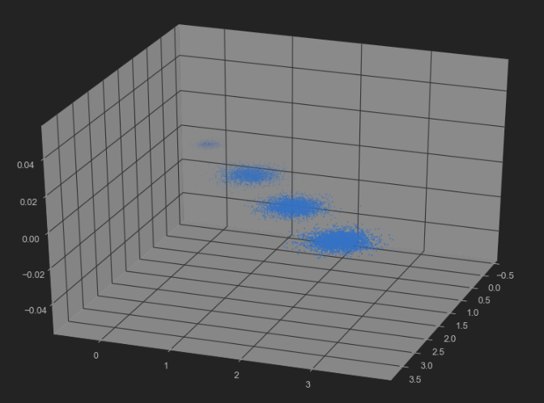
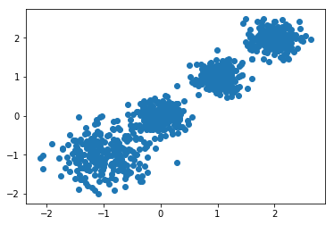

<center><font color=steel size=14 face=雅黑>PCA</font></center>

主成分分析（Principal components analysis，以下简称PCA）是最重要的降维方法之一。在数据压缩消除冗余和数据噪音消除等领域都有广泛的应用。一般我们提到降维最容易想到的算法就是PCA，下面我们就对PCA的原理做一个总结。

# PCA的思想

PCA顾名思义，就是找出数据里最主要的方面，用数据里最主要的方面来代替原始数据。具体的，假如我们的数据集是n维的，共有m个数据$(x^{(1)},x^{(2)},...,x^{(m)})$。我们希望将这m个数据的维度从n维降到$n'$维，希望这m个$n'$维的数据集尽可能的代表原始数据集。我们知道数据从$n$维降到$n'$维肯定会有损失，但是我们希望损失尽可能的小。那么如何让这n'维的数据尽可能表示原来的数据呢？

我们先看看最简单的情况，也就是n=2，$n'=1$,也就是将数据从二维降维到一维。数据如下图。我们希望找到某一个维度方向，它可以代表这两个维度的数据。图中列了两个向量方向，$u_1$和$u_2$，那么哪个向量可以更好的代表原始数据集呢？从直观上也可以看出，$u_1$比$u_2$好。


为什么$u_1$比$u_2$好呢？可以有两种解释：第一种解释是**样本点到这个直线的距离足够近**。第二种解释是**样本点在这个直线上的投影能尽可能的分开**。

假如我们把$n'$从1维推广到任意维，则我们的希望降维的标准为：

- 样本点到这个超平面的**距离足够近**。
- 样本点在这个超平面上的**投影能尽可能的分开**。

基于上面的两种标准，我们可以得到PCA的两种等价推导。


# PCA的推导: 基于最小投影距离

我们首先看第一种解释的推导，即样本点到这个超平面的距离足够近。

假设m个n维数据$(x^{(1)}, x^{(2)},...,x^{(m)})$都已经进行了中心化，即$\sum\limits_{i=1}^{m}x^{(i)}=0$。经过投影变换后得到的新坐标系为$\{w_1,w_2,...,w_n\}$, 其中$w$是标准正交基，即$||w||_2=1, w_i^Tw_j=0$。

如果我们将数据从n维降到n'维，即丢弃新坐标系中的部分坐标，则新的坐标系为$\{w_1,w_2,...,w_{n'}\}$, 样本点$x^{(i)}$在$n'$维坐标系中的投影为：$z^{(i)} = (z_1^{(i)}, z_2^{(i)},...,z_{n'}^{(i)})^T$，其中，$z_j^{(i)} = w_j^Tx^{(i)}$是$x^{(i)}$在低维坐标系里第$j$维的坐标。

如果我们用$z^{(i)}$来恢复**原始数据**$x^{(i)}$, 则得到的**恢复数据** $\overline{x}^{(i)} = \sum\limits_{j=1}^{n'}z_j^{(i)}w_j = Wz^{(i)}$, 其中，$W$为标准正交基组成的矩阵。

现在我们考虑整个样本集，我们希望所有的样本到这个超平面的距离足够近，即最小化下式：
$$
\sum\limits_{i=1}^{m}||\overline{x}^{(i)} - x^{(i)}||_2^2
$$

将这个式子进行整理，可以得到：
$$
\begin{align} 
\sum\limits_{i=1}^{m}||\overline{x}^{(i)} - x^{(i)}||_2^2 & = \sum\limits_{i=1}^{m}|| Wz^{(i)} - x^{(i)}||_2^2 \\
& = \sum\limits_{i=1}^{m}(Wz^{(i)})^T(Wz^{(i)}) - 2\sum\limits_{i=1}^{m}(Wz^{(i)})^Tx^{(i)} + \sum\limits_{i=1}^{m} x^{(i)T}x^{(i)} \\& = \sum\limits_{i=1}^{m}z^{(i)T}z^{(i)} - 2\sum\limits_{i=1}^{m}z^{(i)T}W^Tx^{(i)} +\sum\limits_{i=1}^{m} x^{(i)T}x^{(i)} \\
& = \sum\limits_{i=1}^{m}z^{(i)T}z^{(i)} - 2\sum\limits_{i=1}^{m}z^{(i)T}z^{(i)}+\sum\limits_{i=1}^{m} x^{(i)T}x^{(i)}  \\
& = - \sum\limits_{i=1}^{m}z^{(i)T}z^{(i)} + \sum\limits_{i=1}^{m} x^{(i)T}x^{(i)}  \\
& = -tr( W^T(\sum\limits_{i=1}^{m}x^{(i)}x^{(i)T})W)  + \sum\limits_{i=1}^{m} x^{(i)T}x^{(i)} \\
& =  -tr( W^TXX^TW)  + \sum\limits_{i=1}^{m} x^{(i)T}x^{(i)}  
\end{align}
$$
其中:

- 第（1）步用到了$\overline{x}^{(i)}=Wz^{(i)}$, 
- 第（2）步用到了平方和展开，
- 第（3）步用到了矩阵转置公式$(AB)^T =B^TA^T$和$W^TW=I$,
- 第（4）步用到了$z^{(i)}=W^Tx^{(i)}$，
- 第（5）步合并同类项，
- 第（6）步用到了$z^{(i)}=W^Tx^{(i)}$和矩阵的迹,
- 第（7）步将代数和表达为矩阵形式。

注意到$\sum\limits_{i=1}^{m}x^{(i)}x^{(i)T}$是数据集的协方差矩阵，$W$的每一个向量$w_j$是标准正交基。而$\sum\limits_{i=1}^{m} x^{(i)T}x^{(i)}$是一个常量。最小化上式等价于：
$$
\underbrace{arg\;min}_{W}\;-tr( W^TXX^TW) \;\;s.t. W^TW=I
$$

这个最小化不难，直接观察也可以发现最小值对应的W由协方差矩阵$XX^T$最大的$n'$个特征值对应的特征向量组成。当然用数学推导也很容易。利用拉格朗日函数可以得到
$$
J(W) = -tr( W^TXX^TW + \lambda(W^TW-I))
$$

对$W$求导有$-XX^TW+\lambda W=0$, 整理下即为：
$$
XX^TW=\lambda W
$$

这样可以更清楚的看出，$W$为$XX^T$的$n'$个特征向量组成的矩阵，而$\lambda$为$XX^T$的若干特征值组成的矩阵，特征值在主对角线上，其余位置为0。当我们将数据集从$n$维降到$n'$维时，需要找到最大的$n'$个特征值对应的特征向量。这$n'$个特征向量组成的矩阵$W$即为我们需要的矩阵。对于原始数据集，我们只需要用$z^{(i)}=W^Tx^{(i)}$,就可以把原始数据集降维到最小投影距离的$n'$维数据集。

如果你熟悉谱聚类的优化过程，就会发现和PCA的非常类似，只不过**谱聚类是求前k个最小的特征值对应的特征向量，而PCA是求前k个最大的特征值对应的特征向量**。


# PCA的推导: 基于最大投影方差

现在我们再来看看基于最大投影方差的推导。

假设m个n维数据$(x^{(1)}, x^{(2)},...,x^{(m)})$都已经进行了中心化，即$\sum\limits_{i=1}^{m}x^{(i)}=0$。经过投影变换后得到的新坐标系为$\{w_1,w_2,...,w_n\}$,其中$w$是标准正交基，即$||w||_2=1, w_i^Tw_j=0$。

如果我们将数据从n维降到$n'$维，即丢弃新坐标系中的部分坐标，则新的坐标系为$\{w_1,w_2,...,w_{n'}\}$,样本点$x^{(i)}$在$n'$维坐标系中的投影为：$z^{(i)} = (z_1^{(i)}, z_2^{(i)},...,z_{n'}^{(i)})^T$.其中，$z_j^{(i)} = w_j^Tx^{(i)}$是$x^{(i)}$在低维坐标系里第$j$维的坐标。

对于任意一个样本$x^{(i)}$，在新的坐标系中的投影为$W^Tx^{(i)}$, 在新坐标系中的投影方差为$W^Tx^{(i)}x^{(i)T}W$，**要使所有的样本的投影方差和最大，也就是最大化$\sum\limits_{i=1}^{m}W^Tx^{(i)}x^{(i)T}W$的迹**,即：
$$
\underbrace{arg\;max}_{W}\;tr( W^TXX^TW) \;\;s.t. W^TW=I
$$

观察第二节的基于最小投影距离的优化目标，可以发现完全一样，只是一个是加负号的最小化，一个是最大化。

利用拉格朗日函数可以得到
$$
J(W) = tr( W^TXX^TW + \lambda(W^TW-I))
$$

对W求导有$XX^TW+\lambda W=0$, 整理下即为：
$$
XX^TW=（-\lambda）W
$$

和上面一样可以看出，$W$为$XX^T$的$n'$个特征向量组成的矩阵，而$-\lambda$为$XX^T$的若干特征值组成的矩阵，特征值在主对角线上，其余位置为0。当我们将数据集从n维降到$n'$维时，需要找到最大的$n'$个特征值对应的特征向量。这$n'$个特征向量组成的矩阵$W$即为我们需要的矩阵。对于原始数据集，我们只需要用$z^{(i)}=W^Tx^{(i)}$,就可以把原始数据集降维到最小投影距离的$n'$维数据集。


> 《百面ML》
>
> 原来， x投影后的方差就是协方差矩阵的特征值。 我们要找到最大的方差也就是协方差矩阵最大的特征值， 最佳投影方向
> 就是最大特征值所对应的特征向量。 次佳投影方向位于最佳投影方向的正交空间中， 是第二大特征值对应的特征向量， 以此类推 。
>
> （1） 对样本数据进行中心化处理。
>
> （2） 求样本协方差矩阵。
>
> （3） 对协方差矩阵进行特征值分解， 将特征值从大到小排列。
>
> （4） 取特征值前d大对应的特征向量$ω_1,ω_2,...,ω_d$， 通过映射将n维样本映射到d维 。


# PCA算法流程

从上面两节我们可以看出，求样本$x^{(i)}$的$n'$维的主成分其实就是求样本集的协方差矩阵$XX^T$的前$n'$个特征值对应特征向量矩阵W，然后对于每个样本$x^{(i)}$,做如下变换$z^{(i)}=W^Tx^{(i)}$，即达到降维的PCA目的。

下面我们看看具体的算法流程。

**输入：**n维样本集$D=(x^{(1)}, x^{(2)},...,x^{(m)})$，要降维到的维数$n'$.

**输出：**降维后的样本集$D'$ 

1. 对所有的样本进行中心化：$x^{(i)} = x^{(i)} - \frac{1}{m}\sum\limits_{j=1}^{m} x^{(j)}$ 
2. 计算样本的协方差矩阵$XX^T$ 
3. 对矩阵$XX^T$进行特征值分解
4. 取出最大的$n'$个特征值对应的特征向量$(w_1,w_2,...,w_{n'})$, 将所有的特征向量标准化后，组成特征向量矩阵W。
5. 对样本集中的每一个样本$x^{(i)}$,转化为新的样本$z^{(i)}=W^Tx^{(i)}$ 
6. 得到输出样本集$D' =(z^{(1)}, z^{(2)},...,z^{(m)})$ 

有时候，我们不指定降维后的$n'$的值，而是换种方式，指定一个降维到的主成分比重阈值t。这个阈值t在（0,1]之间。假如我们的n个特征值为$\lambda_1 \geq \lambda_2 \geq ... \geq \lambda_n$,则$n'$可以通过下式得到:
$$
\frac{\sum\limits_{i=1}^{n'}\lambda_i}{\sum\limits_{i=1}^{n}\lambda_i} \geq t
$$


# PCA实例

下面举一个简单的例子，说明PCA的过程。

假设我们的数据集有10个二维数据(2.5,2.4), (0.5,0.7), (2.2,2.9), (1.9,2.2), (3.1,3.0), (2.3, 2.7), (2, 1.6), (1, 1.1), (1.5, 1.6), (1.1, 0.9)，需要用PCA降到1维特征。

首先我们对样本中心化，这里样本的均值为(1.81, 1.91),所有的样本减去这个均值后，即中心化后的数据集为(0.69, 0.49), (-1.31, -1.21), (0.39, 0.99), (0.09, 0.29), (1.29, 1.09), (0.49, 0.79), (0.19, -0.31), (-0.81, -0.81), (-0.31, -0.31), (-0.71, -1.01)。

现在我们开始求样本的协方差矩阵，由于我们是二维的，则协方差矩阵为：
$$
\mathbf{XX^T} = \left( \begin{array}{ccc} cov(x_1,x_1) & cov(x_1,x_2)\\   cov(x_2,x_1) & cov(x_2,x_2) \end{array} \right)
$$


对于我们的数据，求出协方差矩阵为：
$$
\mathbf{XX^T} = \left( \begin{array}{ccc} 0.616555556 & 0.615444444\\    0.615444444 & 0.716555556 \end{array} \right)
$$


求出特征值为（0.490833989， 1.28402771），对应的特征向量分别为：$(0.735178656, 0.677873399)^T\;\; (-0.677873399, -0.735178656)^T$,由于最大的k=1个特征值为1.28402771，对于的k=1个特征向量为$(-0.677873399, -0.735178656)^T$. 则我们的$W=(-0.677873399, -0.735178656)^T$  

我们对所有的数据集进行投影$z^{(i)}=W^Tx^{(i)}$，得到PCA降维后的10个一维数据集为：(-0.827970186， 1.77758033， -0.992197494， -0.274210416， -1.67580142， -0.912949103， 0.0991094375， 1.14457216, 0.438046137， 1.22382056)

# 核主成分分析KPCA介绍

在上面的PCA算法中，我们假设存在一个线性的超平面，可以让我们对数据进行投影。但是有些时候，数据不是线性的，不能直接进行PCA降维。这里就需要用到和支持向量机一样的核函数的思想，先把数据集从n维映射到线性可分的高维N>n,然后再从N维降维到一个低维度n', 这里的维度之间满足n'<n<N。

使用了核函数的主成分分析一般称之为核主成分分析(Kernelized PCA, 以下简称KPCA。假设高维空间的数据是由n维空间的数据通过映射$\phi$产生。

则对于n维空间的特征分解：
$$
\sum\limits_{i=1}^{m}x^{(i)}x^{(i)T}W=\lambda W
$$


映射为：
$$
\sum\limits_{i=1}^{m}\phi(x^{(i)})\phi(x^{(i)})^TW=\lambda W
$$


通过在高维空间进行协方差矩阵的特征值分解，然后用和PCA一样的方法进行降维。一般来说，映射$\phi$不用显式的计算，而是在需要计算的时候通过核函数完成。由于KPCA需要核函数的运算，因此它的计算量要比PCA大很多。

# PCA算法总结

这里对PCA算法做一个总结。作为一个非监督学习的降维方法，它只需要特征值分解，就可以对数据进行压缩，去噪。因此在实际场景应用很广泛。为了克服PCA的一些缺点，出现了很多PCA的变种，比如第六节的为解决非线性降维的KPCA，还有解决内存限制的增量PCA方法Incremental PCA，以及解决稀疏数据降维的PCA方法Sparse PCA等。

## 优点

PCA算法的主要优点有：

1. 仅仅需要以方差衡量信息量，不受数据集以外的因素影响。
2. **各主成分之间正交，可消除原始数据成分间的相互影响的因素**。
3. 计算方法简单，主要运算是**特征值分解**，易于实现。

## 缺点

PCA算法的主要缺点有：

1. 主成分**各个特征维度的含义具有一定的模糊性**，不如原始样本特征的解释性强。
2. **方差小的非主成分也可能含有对样本差异的重要信息**，因降维丢弃可能对后续数据处理有影响。


# 用scikit-learn学习主成分分析(PCA)

在主成分分析（PCA）原理总结中，我们对主成分分析(以下简称PCA)的原理做了总结，下面我们就总结下如何使用scikit-learn工具来进行PCA降维。

## scikit-learn PCA类介绍

在scikit-learn中，与PCA相关的类都在sklearn.decomposition包中。最常用的PCA类就是sklearn.decomposition.PCA，我们下面主要也会讲解基于这个类的使用的方法。

除了PCA类以外，最常用的PCA相关类还有KernelPCA类，在原理篇我们也讲到了，它主要用于非线性数据的降维，需要用到核技巧。因此在使用的时候需要选择合适的核函数并对核函数的参数进行调参。

另外一个常用的PCA相关类是IncrementalPCA类，它主要是为了解决单机内存限制的。有时候我们的样本量可能是上百万+，维度可能也是上千，直接去拟合数据可能会让内存爆掉， 此时我们可以用IncrementalPCA类来解决这个问题。IncrementalPCA先将数据分成多个batch，然后对每个batch依次递增调用partial_fit函数，这样一步步的得到最终的样本最优降维。

此外还有SparsePCA和MiniBatchSparsePCA。他们和上面讲到的PCA类的区别主要是使用了L1的正则化，这样可以将很多非主要成分的影响度降为0，这样在PCA降维的时候我们仅仅需要对那些相对比较主要的成分进行PCA降维，避免了一些噪声之类的因素对我们PCA降维的影响。SparsePCA和MiniBatchSparsePCA之间的区别则是MiniBatchSparsePCA通过使用一部分样本特征和给定的迭代次数来进行PCA降维，以解决在大样本时特征分解过慢的问题，当然，代价就是PCA降维的精确度可能会降低。使用SparsePCA和MiniBatchSparsePCA需要对L1正则化参数进行调参。

## sklearn.decomposition.PCA参数介绍

下面我们主要基于sklearn.decomposition.PCA来讲解如何使用scikit-learn进行PCA降维。PCA类基本不需要调参，一般来说，我们只需要指定我们需要降维到的维度，或者我们希望降维后的主成分的方差和占原始维度所有特征方差和的比例阈值就可以了。

现在我们对sklearn.decomposition.PCA的主要参数做一个介绍：

1. `n_components`：这个参数可以帮我们指定希望PCA**降维后的特征维度数目**。最常用的做法是直接指定降维到的维度数目，此时n_components是一个大于等于1的整数。当然，我们也可以指定主成分的方差和所占的最小比例阈值，让PCA类自己去根据样本特征方差来决定降维到的维度数，此时n_components是一个（0，1]之间的数。当然，我们还可以将参数设置为"mle", 此时PCA类会用MLE算法根据特征的方差分布情况自己去选择一定数量的主成分特征来降维。我们也可以用默认值，即不输入n_components，此时n_components=min(样本数，特征数)。
2. `whiten` ：判断是否进行白化。所谓白化，就是对降维后的数据的每个特征进行归一化，让方差都为1.对于PCA降维本身来说，一般不需要白化。如果你PCA降维后有后续的数据处理动作，可以考虑白化。默认值是False，即不进行白化。
3. `svd_solver`：即指定奇异值分解SVD的方法，由于特征分解是奇异值分解SVD的一个特例，一般的PCA库都是基于SVD实现的。有4个可以选择的值：{‘auto’, ‘full’, ‘arpack’, ‘randomized’}。randomized一般适用于数据量大，数据维度多同时主成分数目比例又较低的PCA降维，它使用了一些加快SVD的随机算法。 full则是传统意义上的SVD，使用了scipy库对应的实现。arpack和randomized的适用场景类似，区别是randomized使用的是scikit-learn自己的SVD实现，而arpack直接使用了scipy库的sparse SVD实现。默认是auto，即PCA类会自己去在前面讲到的三种算法里面去权衡，选择一个合适的SVD算法来降维。一般来说，使用默认值就够了。

除了这些输入参数外，有两个PCA类的成员值得关注。第一个是explained_variance\_，它代表降维后的各主成分的方差值。方差值越大，则说明越是重要的主成分。第二个是explained_variance_ratio_，它代表降维后的各主成分的方差值占总方差值的比例，这个比例越大，则越是重要的主成分。


## PCA实例


```python
from sklearn.datasets.samples_generator import make_blobs
import numpy as np
import matplotlib.pyplot as plt
from mpl_toolkits.mplot3d import Axes3D
%matplotlib inline
# X为样本特征，Y为样本簇类别， 共1000个样本，每个样本3个特征，共4个簇
X, y = make_blobs(
    n_samples=10000,
    n_features=3,
    centers=[[3, 3, 3], [0, 0, 0], [1, 1, 1], [2, 2, 2]],
    cluster_std=[0.2, 0.1, 0.2, 0.2],
    random_state=9)

fig = plt.figure(figsize=(12,8))
ax = Axes3D(fig, rect=[0, 0, 1, 1], elev=30, azim=20)
plt.scatter(X[:, 0], X[:, 1], X[:, 2], marker='o')
```





```python
# 我们先不降维，只对数据进行投影，看看投影后的三个维度的方差分布，代码如下：

from sklearn.decomposition import PCA
pca = PCA(n_components=3)
pca.fit(X)
print(pca.explained_variance_ratio_)
print(pca.explained_variance_)
```

    [0.98318212 0.00850037 0.00831751]
    [3.78521638 0.03272613 0.03202212]


可以看出投影后三个特征维度的方差比例大约为98.3%：0.8%：0.8%。投影后第一个特征占了绝大多数的主成分比例。

现在我们来进行降维，从三维降到2维，代码如下：


```python
pca = PCA(n_components=2)
pca.fit(X)
print(pca.explained_variance_ratio_)
print(pca.explained_variance_)
```

    [0.98318212 0.00850037]
    [3.78521638 0.03272613]


这个结果其实可以预料，因为上面三个投影后的特征维度的方差分别为：[ 3.78483785  0.03272285  0.03201892]，投影到二维后选择的肯定是前两个特征，而抛弃第三个特征。

为了有个直观的认识，我们看看此时转化后的数据分布，代码如下：


```python
X_new = pca.transform(X)
plt.scatter(X_new[:, 0], X_new[:, 1],marker='o')
plt.show()
```





可见降维后的数据依然可以很清楚的看到我们之前三维图中的4个簇。

现在我们看看不直接指定降维的维度，而指定降维后的主成分方差和比例。


```python
# 我们指定了主成分至少占95%，输出如下：
pca = PCA(n_components=0.95)
pca.fit(X)
print(pca.explained_variance_ratio_)
print(pca.explained_variance_)
print(pca.n_components_)
```

    [0.98318212]
    [3.78521638]
    1


可见只有第一个投影特征被保留。这也很好理解，我们的第一个主成分占投影特征的方差比例高达98%。只选择这一个特征维度便可以满足95%的阈值。我们现在选择阈值99%看看，代码如下：


```python
pca = PCA(n_components=0.99)
pca.fit(X)
print(pca.explained_variance_ratio_)
print(pca.explained_variance_)
print(pca.n_components_)
```

    [0.98318212 0.00850037]
    [3.78521638 0.03272613]
    2


这个结果也很好理解，因为我们第一个主成分占了98.3%的方差比例，第二个主成分占了0.8%的方差比例，两者一起可以满足我们的阈值。

最后我们看看让MLE算法自己选择降维维度的效果，代码如下：


```python
pca = PCA(n_components='mle')
pca.fit(X)
print(pca.explained_variance_ratio_)
print(pca.explained_variance_)
print(pca.n_components_)
```

    [0.98318212]
    [3.78521638]
    1


可见由于我们的数据的第一个投影特征的方差占比高达98.3%，MLE算法只保留了我们的第一个特征。


# 试题

1. SVD和PCA

PCA的理念是使得数据投影后的方差最大，找到这样一个投影向量，满足方差最大的条件即可。而经过了去除均值的操作之后，就可以用SVD分解来求解这样一个投影向量，选择特征值最大的方向。


