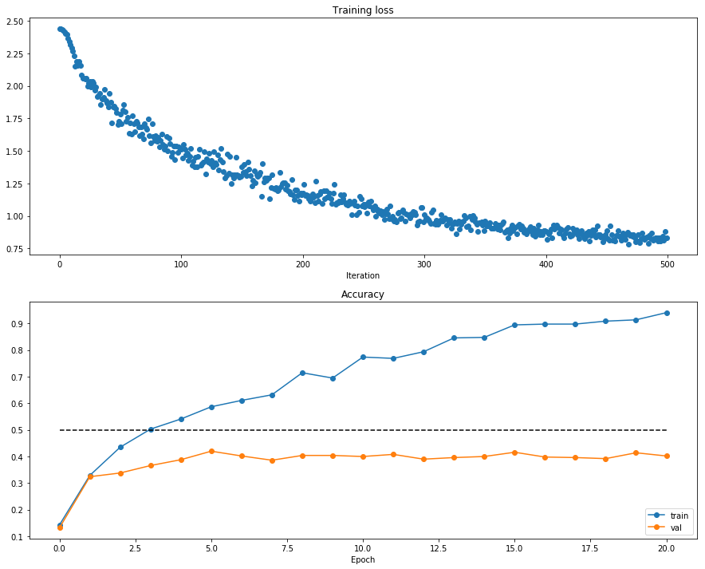
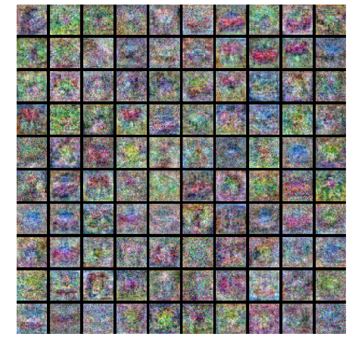

# SVM损失函数

$$
L_{i}=\sum_{j \neq y_{j}} \max \left(0, s_{j}-s_{y_{i}}+1\right)
$$

$$
L=\frac{1}{N} \sum_{i} \sum_{j \neq y_{i}}\left[\max \left(0, f\left(x_{i} ; W\right)_{j}-f\left(x_{i} ; W\right)_{y_{i}}+\Delta\right)\right]+\lambda \sum_{k} \sum_{l} W_{k, l}^{2}
$$


```python
import numpy as np
import matplotlib.pyplot as plt

%matplotlib inline
```

# data_utils


```python
import pickle
import numpy as np
import os
```

## load_CIFAR_batch


```python
def load_CIFAR_batch(filename):
    """ load single batch of cifar """
    with open(filename, 'rb') as f:
        datadict = pickle.load(f, encoding='iso-8859-1')
        X = datadict['data']
        Y = datadict['labels']
        X = X.reshape(10000, 3, 32, 32).transpose(0, 2, 3, 1).astype("float")
        Y = np.array(Y)
        return X, Y
```

## load_CIFAR10


```python
def load_CIFAR10(ROOT):
    """ load all of cifar """
    xs = []
    ys = []
    for b in range(1, 2):
        f = os.path.join(ROOT, 'data_batch_%d' % (b, ))
        X, Y = load_CIFAR_batch(f)
        xs.append(X)
        ys.append(Y)
    Xtr = np.concatenate(xs)
    Ytr = np.concatenate(ys)
    del X, Y
    
    Xte, Yte = load_CIFAR_batch(os.path.join(ROOT, 'test_batch'))
    return Xtr, Ytr, Xte, Yte
```

## get_CIFAR10_data


```python
def get_CIFAR10_data(num_training=5000, num_validation=500, num_test=500):
    """
    Load the CIFAR-10 dataset from disk and perform preprocessing to prepare
    it for classifiers. These are the same steps as we used for the SVM, but
    condensed to a single function.
    """
    # Load the raw CIFAR-10 data

    cifar10_dir = 'C:\\Users\\Administrator\\.keras\\datasets\\cifar-10-batches-py'
    X_train, y_train, X_test, y_test = load_CIFAR10(cifar10_dir)
    print(X_train.shape)
    # Subsample the data
    mask = range(num_training, num_training + num_validation)
    X_val = X_train[mask]
    y_val = y_train[mask]
    mask = range(num_training)
    X_train = X_train[mask]
    y_train = y_train[mask]
    mask = range(num_test)
    X_test = X_test[mask]
    y_test = y_test[mask]

    # Normalize the data: subtract the mean image
    mean_image = np.mean(X_train, axis=0)
    X_train -= mean_image
    X_val -= mean_image
    X_test -= mean_image

    # Transpose so that channels come first
    X_train = X_train.transpose(0, 3, 1, 2).copy()
    X_val = X_val.transpose(0, 3, 1, 2).copy()
    X_test = X_test.transpose(0, 3, 1, 2).copy()

    # Package data into a dictionary
    return {
        'X_train': X_train,
        'y_train': y_train,
        'X_val': X_val,
        'y_val': y_val,
        'X_test': X_test,
        'y_test': y_test,
    }
```


```python
def load_models(models_dir):
    """
    Load saved models from disk. This will attempt to unpickle all files in a
    directory; any files that give errors on unpickling (such as README.txt) will
    be skipped.

    Inputs:
    - models_dir: String giving the path to a directory containing model files.
      Each model file is a pickled dictionary with a 'model' field.

    Returns:
    A dictionary mapping model file names to models.
    """
    models = {}
    for model_file in os.listdir(models_dir):
        with open(os.path.join(models_dir, model_file), 'rb') as f:
            try:
                models[model_file] = pickle.load(f)['model']
            except pickle.UnpicklingError:
                continue
    return models
```

# layer_utils

## affine_relu_forward
前向传播及relu函数


```python
# 前向传播，中间层及relu函数
def affine_relu_forward(x, w, b):
    """
    Convenience layer that perorms an affine transform followed by a ReLU

    Inputs:
    - x: Input to the affine layer
    - w, b: Weights for the affine layer

    Returns a tuple of:
    - out: Output from the ReLU
    - cache: Object to give to the backward pass
    """
    a, fc_cache = affine_forward(x, w, b)
    out, relu_cache = relu_forward(a)
    cache = (fc_cache, relu_cache)
    return out, cache
```

## affine_relu_backward
反向传播及relu


```python
def affine_relu_backward(dout, cache):
    """
    Backward pass for the affine-relu convenience layer
    """
    fc_cache, relu_cache = cache
    da = relu_backward(dout, relu_cache)
    dx, dw, db = affine_backward(da, fc_cache)
    return dx, dw, db
```


```python
# 以下未用到-----------------------------------------------------------


def conv_relu_forward(x, w, b, conv_param):
    """
    A convenience layer that performs a convolution followed by a ReLU.

    Inputs:
    - x: Input to the convolutional layer
    - w, b, conv_param: Weights and parameters for the convolutional layer

    Returns a tuple of:
    - out: Output from the ReLU
    - cache: Object to give to the backward pass
    """
    a, conv_cache = conv_forward_fast(x, w, b, conv_param)
    out, relu_cache = relu_forward(a)
    cache = (conv_cache, relu_cache)
    return out, cache


def conv_relu_backward(dout, cache):
    """
    Backward pass for the conv-relu convenience layer.
    """
    conv_cache, relu_cache = cache
    da = relu_backward(dout, relu_cache)
    dx, dw, db = conv_backward_fast(da, conv_cache)
    return dx, dw, db


def conv_relu_pool_forward(x, w, b, conv_param, pool_param):
    """
    Convenience layer that performs a convolution, a ReLU, and a pool.

    Inputs:
    - x: Input to the convolutional layer
    - w, b, conv_param: Weights and parameters for the convolutional layer
    - pool_param: Parameters for the pooling layer

    Returns a tuple of:
    - out: Output from the pooling layer
    - cache: Object to give to the backward pass
    """
    a, conv_cache = conv_forward_fast(x, w, b, conv_param)
    s, relu_cache = relu_forward(a)
    out, pool_cache = max_pool_forward_fast(s, pool_param)
    cache = (conv_cache, relu_cache, pool_cache)
    return out, cache


def conv_relu_pool_backward(dout, cache):
    """
    Backward pass for the conv-relu-pool convenience layer
    """
    conv_cache, relu_cache, pool_cache = cache
    ds = max_pool_backward_fast(dout, pool_cache)
    da = relu_backward(ds, relu_cache)
    dx, dw, db = conv_backward_fast(da, conv_cache)
    return dx, dw, db
```

# layers

## affine_forward


```python
def affine_forward(x, w, b):
    """    
    Computes the forward pass for an affine (fully-connected) layer. 
    The input x has shape (N, d_1, ..., d_k) and contains a minibatch of N   
    examples, where each example x[i] has shape (d_1, ..., d_k). We will    
    reshape each input into a vector of dimension D = d_1 * ... * d_k, and    
    then transform it to an output vector of dimension M.    
    Inputs:    
    - x: A numpy array containing input data, of shape (N, d_1, ..., d_k)    
    - w: A numpy array of weights, of shape (D, M)    
    - b: A numpy array of biases, of shape (M,)   
    Returns a tuple of:    
    - out: output, of shape (N, M)    
    - cache: (x, w, b)   
    """
    out = None
    # Reshape x into rows
    N = x.shape[0]
    x_row = x.reshape(N, -1)  # (N,D)
    out = np.dot(x_row, w) + b  # (N,M)
    cache = (x, w, b)
    return out, cache
```

## relu_forward


```python
def relu_forward(x):
    """    
    Computes the forward pass for a layer of rectified linear units (ReLUs).    
    Input:    
    - x: Inputs, of any shape    
    Returns a tuple of:    
    - out: Output, of the same shape as x    
    - cache: x    
    """
    out = None
    out = ReLU(x)
    cache = x

    return out, cache
```

## affine_backward

反向传播


```python
def affine_backward(dout, cache):
    """    
    Computes the backward pass for an affine layer.    
    Inputs:    
    - dout: Upstream derivative, of shape (N, M)    
    - cache: Tuple of: 
    - x: Input data, of shape (N, d_1, ... d_k)    
    - w: Weights, of shape (D, M)    
    Returns a tuple of:   
    - dx: Gradient with respect to x, of shape (N, d1, ..., d_k)    
    - dw: Gradient with respect to w, of shape (D, M) 
    - db: Gradient with respect to b, of shape (M,)    
    """
    x, w, b = cache
    dx, dw, db = None, None, None
    dx = np.dot(dout, w.T)  # (N,D)   dx = w
    dx = np.reshape(dx, x.shape)  # (N,d1,...,d_k)
    x_row = x.reshape(x.shape[0], -1)  # (N,D)
    dw = np.dot(x_row.T, dout)  # (D,M)  dw = x
    db = np.sum(dout, axis=0, keepdims=True)  # (1,M)  db = 1

    return dx, dw, db
```

## relu_backward

relu层反向传播


```python
def relu_backward(dout, cache):
    """  
    Computes the backward pass for a layer of rectified linear units (ReLUs).   
    Input:    
    - dout: Upstream derivatives, of any shape    
    - cache: Input x, of same shape as dout    
    Returns:    
    - dx: Gradient with respect to x    
    """
    dx, x = None, cache
    dx = dout  # relu求导为1，即 1*dout
    dx[x <= 0] = 0

    return dx
```

## softmax_loss

softmax_loss 层的loss及求导


```python
def softmax_loss(x, y):
    """    
    Computes the loss and gradient for softmax classification.    Inputs:    
    - x: Input data, of shape (N, C) where x[i, j] is the score for the jth class         
    for the ith input.    
    - y: Vector of labels, of shape (N,) where y[i] is the label for x[i] and         
         0 <= y[i] < C   
    Returns a tuple of:    
    - loss: Scalar giving the loss    
    - dx: Gradient of the loss with respect to x   
    """
    # 归一化
    probs = np.exp(x - np.max(x, axis=1, keepdims=True))
    probs /= np.sum(probs, axis=1, keepdims=True)
    N = x.shape[0]
    loss = -np.sum(np.log(probs[np.arange(N), y])) / N
    dx = probs.copy()
    dx[np.arange(N), y] -= 1
    dx /= N

    return loss, dx
```

## svm_loss


```python
def svm_loss(x, y):
    """    
    Computes the loss and gradient using for multiclass SVM classification.    
    Inputs:    
    - x: Input data, of shape (N, C) where x[i, j] is the score for the jth class         
         for the ith input.    
    - y: Vector of labels, of shape (N,) where y[i] is the label for x[i] and         
         0 <= y[i] < C   
    Returns a tuple of:    
    - loss: Scalar giving the loss   
    - dx: Gradient of the loss with respect to x    
    """
    N = x.shape[0]
    correct_class_scores = x[np.arange(N), y]
    margins = np.maximum(0, x - correct_class_scores[:, np.newaxis] + 1.0)
    margins[np.arange(N), y] = 0
    loss = np.sum(margins) / N
    num_pos = np.sum(margins > 0, axis=1)
    dx = np.zeros_like(x)
    dx[margins > 0] = 1
    dx[np.arange(N), y] -= num_pos
    dx /= N

    return loss, dx


def ReLU(x):
    """ReLU non-linearity."""
    return np.maximum(0, x)
```

# fc_net


```python
# 说明：共三层，输入层L0，隐含层L1，输出层L2
#      L0 -- w1,b1 -->>> L1,relu -- w2,b2 -->>> scores -- soft_max -- loss
```


```python
class TwoLayerNet(object):
    def __init__(self,
                 input_dim=3 * 32 * 32,
                 hidden_dim=100,
                 num_classes=10,
                 weight_scale=1e-3,
                 reg=0.0):
        """    
        Initialize a new network.   
        Inputs:    
        - input_dim: An integer giving the size of the input    
        - hidden_dim: An integer giving the size of the hidden layer    
        - num_classes: An integer giving the number of classes to classify    
        - dropout: Scalar between 0 and 1 giving dropout strength.    
        - weight_scale: Scalar giving the standard deviation for random 
                        initialization of the weights.    
        - reg: Scalar giving L2 regularization strength.    
        """
        self.params = {}
        self.reg = reg
        self.params['W1'] = weight_scale * np.random.randn(
            input_dim, hidden_dim)
        self.params['b1'] = np.zeros((1, hidden_dim))
        self.params['W2'] = weight_scale * np.random.randn(
            hidden_dim, num_classes)
        self.params['b2'] = np.zeros((1, num_classes))

    def loss(self, X, y=None):
        """   
        Compute loss and gradient for a minibatch of data.    
        Inputs:    
        - X: Array of input data of shape (N, d_1, ..., d_k)    
        - y: Array of labels, of shape (N,). y[i] gives the label for X[i].  
        Returns:   
        If y is None, then run a test-time forward pass of the model and return:    
        - scores: Array of shape (N, C) giving classification scores, where              
                  scores[i, c] is the classification score for X[i] and class c. 
        If y is not None, then run a training-time forward and backward pass and    
        return a tuple of:    
        - loss: Scalar value giving the loss   
        - grads: Dictionary with the same keys as self.params, mapping parameter             
                 names to gradients of the loss with respect to those parameters.    
        """
        scores = None
        N = X.shape[0]
        # Unpack variables from the params dictionary
        W1, b1 = self.params['W1'], self.params['b1']
        W2, b2 = self.params['W2'], self.params['b2']

        # 前向传播，中间层及relu函数
        h1, cache1 = affine_relu_forward(X, W1, b1)
        # 继续前向传播，到输出层，无relu函数
        out, cache2 = affine_forward(h1, W2, b2)

        scores = out  # (N,C)
        # If y is None then we are in test mode so just return scores
        if y is None:
            return scores

        loss, grads = 0, {}

        data_loss, dscores = softmax_loss(scores, y)
        reg_loss = 0.5 * self.reg * np.sum(W1 * W1) + 0.5 * self.reg * np.sum(
            W2 * W2)
        loss = data_loss + reg_loss

        # Backward pass: compute gradients
        dh1, dW2, db2 = affine_backward(dscores, cache2)
        dX, dW1, db1 = affine_relu_backward(dh1, cache1)
        # Add the regularization gradient contribution
        dW2 += self.reg * W2
        dW1 += self.reg * W1

        grads['W1'] = dW1
        grads['b1'] = db1
        grads['W2'] = dW2
        grads['b2'] = db2

        return loss, grads
```

# optim


```python
class OPTIM(object):
    def __init__(self):
        pass

    def sgd(self, w, dw, config=None):
        """    
        Performs vanilla stochastic gradient descent.    
        config format:    
        - learning_rate: Scalar learning rate.    
        """
        if config is None: 
            config = {}
            
        config.setdefault('learning_rate', 1e-2)
        w -= config['learning_rate'] * dw
        return w, config

    def sgd_momentum(self, w, dw, config=None):
        """    
        Performs stochastic gradient descent with momentum.    
        config format:    
        - learning_rate: Scalar learning rate.    
        - momentum: Scalar between 0 and 1 giving the momentum value.                
        Setting momentum = 0 reduces to sgd.    
        - velocity: A numpy array of the same shape as w and dw used to store a moving    
        average of the gradients.   
        """
        if config is None: 
            config = {}
        config.setdefault('learning_rate', 1e-2)
        config.setdefault('momentum', 0.9)
        v = config.get('velocity', np.zeros_like(w))
        next_w = None
        v = config['momentum'] * v - config['learning_rate'] * dw
        next_w = w + v
        config['velocity'] = v

        return next_w, config

    def rmsprop(self, x, dx, config=None):
        """    
        Uses the RMSProp update rule, which uses a moving average of squared gradient    
        values to set adaptive per-parameter learning rates.    
        config format:    
        - learning_rate: Scalar learning rate.    
        - decay_rate: Scalar between 0 and 1 giving the decay rate for the squared                  
        gradient cache.    
        - epsilon: Small scalar used for smoothing to avoid dividing by zero.    
        - cache: Moving average of second moments of gradients.   
        """
        if config is None: 
            config = {}
        config.setdefault('learning_rate', 1e-2)
        config.setdefault('decay_rate', 0.99)
        config.setdefault('epsilon', 1e-8)
        config.setdefault('cache', np.zeros_like(x))
        next_x = None
        cache = config['cache']
        decay_rate = config['decay_rate']
        learning_rate = config['learning_rate']
        epsilon = config['epsilon']
        cache = decay_rate * cache + (1 - decay_rate) * (dx**2)
        x += -learning_rate * dx / (np.sqrt(cache) + epsilon)
        config['cache'] = cache
        next_x = x

        return next_x, config

    def adam(self, x, dx, config=None):
        """    
        Uses the Adam update rule, which incorporates moving averages of both the  
        gradient and its square and a bias correction term.    
        config format:    
        - learning_rate: Scalar learning rate.    
        - beta1: Decay rate for moving average of first moment of gradient.    
        - beta2: Decay rate for moving average of second moment of gradient.   
        - epsilon: Small scalar used for smoothing to avoid dividing by zero.    
        - m: Moving average of gradient.    
        - v: Moving average of squared gradient.    
        - t: Iteration number.   
        """
        if config is None: 
            config = {}
        config.setdefault('learning_rate', 1e-3)
        config.setdefault('beta1', 0.9)
        config.setdefault('beta2', 0.999)
        config.setdefault('epsilon', 1e-8)
        config.setdefault('m', np.zeros_like(x))
        config.setdefault('v', np.zeros_like(x))
        config.setdefault('t', 0)
        next_x = None
        m = config['m']
        v = config['v']
        beta1 = config['beta1']
        beta2 = config['beta2']
        learning_rate = config['learning_rate']
        epsilon = config['epsilon']
        t = config['t']
        t += 1
        m = beta1 * m + (1 - beta1) * dx
        v = beta2 * v + (1 - beta2) * (dx**2)
        m_bias = m / (1 - beta1**t)
        v_bias = v / (1 - beta2**t)
        x += -learning_rate * m_bias / (np.sqrt(v_bias) + epsilon)
        next_x = x
        config['m'] = m
        config['v'] = v
        config['t'] = t

        return next_x, config
```

# solver


```python
optim = OPTIM()


class Solver(object):
    """
    A Solver encapsulates all the logic necessary for training classification
    models. The Solver performs stochastic gradient descent using different
    update rules defined in optim.py.

    The solver accepts both training and validataion data and labels so it can
    periodically check classification accuracy on both training and validation
    data to watch out for overfitting.

    To train a model, you will first construct a Solver instance, passing the
    model, dataset, and various optoins (learning rate, batch size, etc) to the
    constructor. You will then call the train() method to run the optimization
    procedure and train the model.

    After the train() method returns, model.params will contain the parameters
    that performed best on the validation set over the course of training.
    In addition, the instance variable solver.loss_history will contain a list
    of all losses encountered during training and the instance variables
    solver.train_acc_history and solver.val_acc_history will be lists containing
    the accuracies of the model on the training and validation set at each epoch.

    Example usage might look something like this:

    data = {
      'X_train': # training data
      'y_train': # training labels
      'X_val': # validation data
      'X_train': # validation labels
    }
    
    model = MyAwesomeModel(hidden_size=100, reg=10)
    solver = Solver(model, data,
                    update_rule='sgd',
                    optim_config={
                      'learning_rate': 1e-3,
                    },
                    lr_decay=0.95,
                    num_epochs=10, batch_size=100,
                    print_every=100)
    solver.train()


    A Solver works on a model object that must conform to the following API:

    - model.params must be a dictionary mapping string parameter names to numpy
      arrays containing parameter values.

    - model.loss(X, y) must be a function that computes training-time loss and
      gradients, and test-time classification scores, with the following inputs
      and outputs:

      Inputs:
      - X: Array giving a minibatch of input data of shape (N, d_1, ..., d_k)
      - y: Array of labels, of shape (N,) giving labels for X where y[i] is the
        label for X[i].

      Returns:
      If y is None, run a test-time forward pass and return:
      - scores: Array of shape (N, C) giving classification scores for X where
        scores[i, c] gives the score of class c for X[i].

      If y is not None, run a training time forward and backward pass and return
      a tuple of:
      - loss: Scalar giving the loss
      - grads: Dictionary with the same keys as self.params mapping parameter
        names to gradients of the loss with respect to those parameters.
    """

    def __init__(self, model, data, **kwargs):
        """
        Construct a new Solver instance.

        Required arguments:
        - model: A model object conforming to the API described above
        - data: A dictionary of training and validation data with the following:
          'X_train': Array of shape (N_train, d_1, ..., d_k) giving training images
          'X_val': Array of shape (N_val, d_1, ..., d_k) giving validation images
          'y_train': Array of shape (N_train,) giving labels for training images
          'y_val': Array of shape (N_val,) giving labels for validation images

        Optional arguments:
        - update_rule: A string giving the name of an update rule in optim.py.
          Default is 'sgd'.
        - optim_config: A dictionary containing hyperparameters that will be
          passed to the chosen update rule. Each update rule requires different
          hyperparameters (see optim.py) but all update rules require a
          'learning_rate' parameter so that should always be present.
        - lr_decay: A scalar for learning rate decay; after each epoch the learning
          rate is multiplied by this value.
        - batch_size: Size of minibatches used to compute loss and gradient during
          training.
        - num_epochs: The number of epochs to run for during training.
        - print_every: Integer; training losses will be printed every print_every
          iterations.
        - verbose: Boolean; if set to false then no output will be printed during
          training.
        """
        self.model = model
        self.X_train = data['X_train']
        self.y_train = data['y_train']
        self.X_val = data['X_val']
        self.y_val = data['y_val']

        # Unpack keyword arguments
        self.update_rule = kwargs.pop('update_rule', 'sgd')
        self.optim_config = kwargs.pop('optim_config', {})
        self.lr_decay = kwargs.pop('lr_decay', 1.0)
        self.batch_size = kwargs.pop('batch_size', 100)
        self.num_epochs = kwargs.pop('num_epochs', 10)

        self.print_every = kwargs.pop('print_every', 10)
        self.verbose = kwargs.pop('verbose', True)

        # Throw an error if there are extra keyword arguments
        if len(kwargs) > 0:
            extra = ', '.join('"%s"' % k for k in list(kwargs.keys()))
            raise ValueError('Unrecognized arguments %s' % extra)

        # Make sure the update rule exists, then replace the string
        # name with the actual function
        if not hasattr(optim, self.update_rule):
            raise ValueError('Invalid update_rule "%s"' % self.update_rule)
        self.update_rule = getattr(optim, self.update_rule)

        self._reset()

    def _reset(self):
        """
        Set up some book-keeping variables for optimization. Don't call this
        manually.
        """
        # Set up some variables for book-keeping
        self.epoch = 0
        self.best_val_acc = 0
        self.best_params = {}
        self.loss_history = []
        self.train_acc_history = []
        self.val_acc_history = []

        # Make a deep copy of the optim_config for each parameter
        self.optim_configs = {}
        for p in self.model.params:
            d = {k: v for k, v in list(self.optim_config.items())}
            self.optim_configs[p] = d

    def _step(self):
        """
        Make a single gradient update. This is called by train() and should not
        be called manually.
        """
        # Make a minibatch of training data
        num_train = self.X_train.shape[0]
        batch_mask = np.random.choice(num_train, self.batch_size)
        X_batch = self.X_train[batch_mask]
        y_batch = self.y_train[batch_mask]

        # Compute loss and gradient
        loss, grads = self.model.loss(X_batch, y_batch)
        self.loss_history.append(loss)

        # Perform a parameter update
        for p, w in list(self.model.params.items()):
            dw = grads[p]
            config = self.optim_configs[p]
            next_w, next_config = self.update_rule(w, dw, config)
            self.model.params[p] = next_w
            self.optim_configs[p] = next_config

    def check_accuracy(self, X, y, num_samples=None, batch_size=100):
        """
        Check accuracy of the model on the provided data.

        Inputs:
        - X: Array of data, of shape (N, d_1, ..., d_k)
        - y: Array of labels, of shape (N,)
        - num_samples: If not None, subsample the data and only test the model
          on num_samples datapoints.
        - batch_size: Split X and y into batches of this size to avoid using too
          much memory.

        Returns:
        - acc: Scalar giving the fraction of instances that were correctly
          classified by the model.
        """

        # Maybe subsample the data
        N = X.shape[0]
        if num_samples is not None and N > num_samples:
            mask = np.random.choice(N, num_samples)
            N = num_samples
            X = X[mask]
            y = y[mask]

        # Compute predictions in batches
        num_batches = N / batch_size
        if N % batch_size != 0:
            num_batches += 1
        y_pred = []
        for i in range(int(num_batches)):
            start = i * batch_size
            end = (i + 1) * batch_size
            scores = self.model.loss(X[start:end])
            y_pred.append(np.argmax(scores, axis=1))
        y_pred = np.hstack(y_pred)
        acc = np.mean(y_pred == y)

        return acc

    def train(self):
        """
        Run optimization to train the model.
        """
        num_train = self.X_train.shape[0]
        iterations_per_epoch = max(num_train / self.batch_size, 1)
        num_iterations = self.num_epochs * iterations_per_epoch

        for t in range(int(num_iterations)):
            self._step()

            # Maybe print training loss
            if self.verbose and t % self.print_every == 0:
                print('(Iteration %d / %d) loss: %f' %
                      (t + 1, num_iterations, self.loss_history[-1]))

            # At the end of every epoch, increment the epoch counter and decay the
            # learning rate.
            epoch_end = (t + 1) % iterations_per_epoch == 0
            if epoch_end:
                self.epoch += 1
                for k in self.optim_configs:
                    self.optim_configs[k]['learning_rate'] *= self.lr_decay

            # Check train and val accuracy on the first iteration, the last
            # iteration, and at the end of each epoch.
            first_it = (t == 0)
            last_it = (t == num_iterations + 1)
            if first_it or last_it or epoch_end:
                train_acc = self.check_accuracy(self.X_train,
                                                self.y_train,
                                                num_samples=1000)
                val_acc = self.check_accuracy(self.X_val, self.y_val)
                self.train_acc_history.append(train_acc)
                self.val_acc_history.append(val_acc)

                if self.verbose:
                    print('(Epoch %d / %d) train acc: %f; val_acc: %f' %
                          (self.epoch, self.num_epochs, train_acc, val_acc))

                # Keep track of the best model
                if val_acc > self.best_val_acc:
                    self.best_val_acc = val_acc
                    self.best_params = {}
                    for k, v in list(self.model.params.items()):
                        self.best_params[k] = v.copy()

        # At the end of training swap the best params into the model
        self.model.params = self.best_params
```


```python

```

# main


```python
# 获取数据
data = get_CIFAR10_data()

# 模型
model = TwoLayerNet(reg=0.9)

solver = Solver(model,
                data,
                lr_decay=0.95,
                print_every=100,
                num_epochs=40,
                batch_size=400,
                update_rule='sgd_momentum',
                optim_config={
                    'learning_rate': 5e-4,
                    'momentum': 0.9
                })

solver.train()
```

    (10000, 32, 32, 3)
    (Iteration 1 / 500) loss: 2.439330
    (Epoch 0 / 40) train acc: 0.143000; val_acc: 0.132000
    (Epoch 1 / 40) train acc: 0.329000; val_acc: 0.324000
    (Epoch 2 / 40) train acc: 0.435000; val_acc: 0.338000
    (Epoch 3 / 40) train acc: 0.503000; val_acc: 0.366000
    (Epoch 4 / 40) train acc: 0.541000; val_acc: 0.388000
    (Iteration 101 / 500) loss: 1.514837
    (Epoch 5 / 40) train acc: 0.587000; val_acc: 0.420000
    (Epoch 6 / 40) train acc: 0.611000; val_acc: 0.402000
    (Epoch 7 / 40) train acc: 0.632000; val_acc: 0.386000
    (Epoch 8 / 40) train acc: 0.715000; val_acc: 0.404000
    (Iteration 201 / 500) loss: 1.173310
    (Epoch 9 / 40) train acc: 0.695000; val_acc: 0.404000
    (Epoch 10 / 40) train acc: 0.774000; val_acc: 0.400000
    (Epoch 11 / 40) train acc: 0.769000; val_acc: 0.408000
    (Epoch 12 / 40) train acc: 0.794000; val_acc: 0.390000
    (Iteration 301 / 500) loss: 1.012875
    (Epoch 13 / 40) train acc: 0.846000; val_acc: 0.396000
    (Epoch 14 / 40) train acc: 0.848000; val_acc: 0.400000
    (Epoch 15 / 40) train acc: 0.895000; val_acc: 0.416000
    (Epoch 16 / 40) train acc: 0.898000; val_acc: 0.398000
    (Iteration 401 / 500) loss: 0.884337
    (Epoch 17 / 40) train acc: 0.898000; val_acc: 0.396000
    (Epoch 18 / 40) train acc: 0.909000; val_acc: 0.392000
    (Epoch 19 / 40) train acc: 0.914000; val_acc: 0.414000
    (Epoch 20 / 40) train acc: 0.941000; val_acc: 0.402000


```python
plt.subplot(2, 1, 1)
plt.title('Training loss')
plt.plot(solver.loss_history, 'o')
plt.xlabel('Iteration')

plt.subplot(2, 1, 2)
plt.title('Accuracy')
plt.plot(solver.train_acc_history, '-o', label='train')
plt.plot(solver.val_acc_history, '-o', label='val')
plt.plot([0.5] * len(solver.val_acc_history), 'k--')
plt.xlabel('Epoch')
plt.legend(loc='lower right')
plt.gcf().set_size_inches(15, 12)
plt.show()
```





```python
best_model = model
y_test_pred = np.argmax(best_model.loss(data['X_test']), axis=1)
y_val_pred = np.argmax(best_model.loss(data['X_val']), axis=1)
print('Validation set accuracy: ', (y_val_pred == data['y_val']).mean())
print('Test set accuracy: ', (y_test_pred == data['y_test']).mean())
```

    Validation set accuracy:  0.42
    Test set accuracy:  0.38


# vis_utils


```python
from math import sqrt, ceil
import numpy as np


def visualize_grid(Xs, ubound=255.0, padding=1):
    """
    Reshape a 4D tensor of image data to a grid for easy visualization.

    Inputs:
    - Xs: Data of shape (N, H, W, C)
    - ubound: Output grid will have values scaled to the range [0, ubound]
    - padding: The number of blank pixels between elements of the grid
    """
    (N, H, W, C) = Xs.shape
    grid_size = int(ceil(sqrt(N)))
    grid_height = H * grid_size + padding * (grid_size - 1)
    grid_width = W * grid_size + padding * (grid_size - 1)
    grid = np.zeros((grid_height, grid_width, C))
    next_idx = 0
    y0, y1 = 0, H
    
    for y in range(grid_size):
        x0, x1 = 0, W
        for x in range(grid_size):
            if next_idx < N:
                img = Xs[next_idx]
                low, high = np.min(img), np.max(img)
                grid[y0:y1, x0:x1] = ubound * (img - low) / (high - low)
                # grid[y0:y1, x0:x1] = Xs[next_idx]
                next_idx += 1
                
            x0 += W + padding
            x1 += W + padding
        y0 += H + padding
        y1 += H + padding
    # grid_max = np.max(grid)
    # grid_min = np.min(grid)
    # grid = ubound * (grid - grid_min) / (grid_max - grid_min)
    return grid


def vis_grid(Xs):
    """ visualize a grid of images """
    (N, H, W, C) = Xs.shape
    A = int(ceil(sqrt(N)))
    G = np.ones((A * H + A, A * W + A, C), Xs.dtype)
    G *= np.min(Xs)
    n = 0
    for y in range(A):
        for x in range(A):
            if n < N:
                G[y * H + y:(y + 1) * H + y, x * W + x:(x + 1) * W +
                  x, :] = Xs[n, :, :, :]
                n += 1
    # normalize to [0,1]
    maxg = G.max()
    ming = G.min()
    G = (G - ming) / (maxg - ming)
    return G


def vis_nn(rows):
    """ visualize array of arrays of images """
    N = len(rows)
    D = len(rows[0])
    H, W, C = rows[0][0].shape
    Xs = rows[0][0]
    G = np.ones((N * H + N, D * W + D, C), Xs.dtype)
    
    for y in range(N):
        for x in range(D):
            G[y * H + y:(y + 1) * H + y, x * W + x:(x + 1) * W +  x, :] = rows[y][x]
            
    # normalize to [0,1]
    maxg = G.max()
    ming = G.min()
    G = (G - ming) / (maxg - ming)
    return G
```


```python
def show_net_weights(net):    
    W1 = net.params['W1']    
    W1 = W1.reshape(3, 32, 32, -1).transpose(3, 1, 2, 0)    
    plt.figure(figsize=(12,12))
    plt.imshow(visualize_grid(W1, padding=3).astype('uint8'))   
    plt.gca().axis('off')

show_net_weights(best_model)
plt.show()
```




