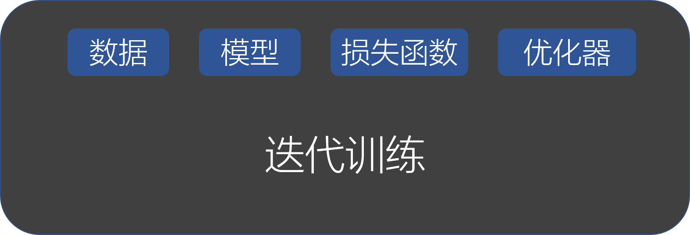
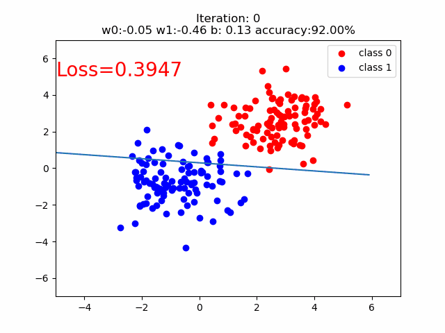

本章代码：

- https://github.com/zhangxiann/PyTorch_Practice/blob/master/lesson1/autograd.py
- https://github.com/zhangxiann/PyTorch_Practice/blob/master/lesson1/logistic-regression.py

# 自动求导 (autograd)

在深度学习中，权值的更新是依赖于梯度的计算，因此梯度的计算是至关重要的。在 PyTorch 中，只需要搭建好前向计算图，然后利用`torch.autograd`自动求导得到所有张量的梯度。

## torch.autograd.backward()

```python
torch.autograd.backward(tensors, 
                        grad_tensors=None, 
                        retain_graph=None, 
                        create_graph=False, 
                        grad_variables=None)
```

功能：自动求取梯度

- tensors: 用于求导的张量，如 loss。
- retain_graph: 保存计算图。PyTorch 采用动态图机制，默认每次反向传播之后都会释放计算图。这里**设置为 True 可以不释放计算图**。
- create_graph: 创建导数计算图，用于高阶求导。
- grad_tensors: 多梯度权重。当有多个 loss 混合需要计算梯度时，**设置每个 loss 的权重**。


1.  **retain_graph 参数**

代码示例

```python
w = torch.tensor([1.], requires_grad=True)
x = torch.tensor([2.], requires_grad=True)
# y=(x+w)*(w+1)
a = torch.add(w, x)
b = torch.add(w, 1)
y = torch.mul(a, b)

# 第一次执行梯度求导
y.backward()
print(w.grad)
# 第二次执行梯度求导，出错
y.backward()
```

其中`y.backward()`方法调用的是`torch.autograd.backward(self, gradient, retain_graph, create_graph)`。但是在第二次执行`y.backward()`时会出错。因为 PyTorch 默认是每次求取梯度之后不保存计算图的，因此第二次求导梯度时，计算图已经不存在了。在第一次求梯度时使用`y.backward(retain_graph=True)`即可。如下代码所示：

```python
w = torch.tensor([1.], requires_grad=True)
x = torch.tensor([2.], requires_grad=True)
# y=(x+w)*(w+1)
a = torch.add(w, x)
b = torch.add(w, 1)
y = torch.mul(a, b)

# 第一次求导，设置 retain_graph=True，保留计算图
y.backward(retain_graph=True)
print(w.grad)
# 第二次求导成功
y.backward()
```

2.  **grad_tensors 参数**

代码示例：

```python
w = torch.tensor([1.], requires_grad=True)
x = torch.tensor([2.], requires_grad=True)

a = torch.add(w, x)
b = torch.add(w, 1)

y0 = torch.mul(a, b)    # y0 = (x+w) * (w+1)
y1 = torch.add(a, b)    # y1 = (x+w) + (w+1)    dy1/dw = 2

# 把两个 loss 拼接都到一起
loss = torch.cat([y0, y1], dim=0)       # [y0, y1]
# 设置两个 loss 的权重: y0 的权重是 1，y1 的权重是 2
grad_tensors = torch.tensor([1., 2.])

loss.backward(gradient=grad_tensors)    # gradient 传入 torch.autograd.backward()中的grad_tensors
# 最终的 w 的导数由两部分组成。∂y0/∂w * 1 + ∂y1/∂w * 2
print(w.grad)
```

结果为：

```
tensor([9.])
```

该 loss 由两部分组成：$y_0$ 和 $y_1$。其中 $\frac{\partial y_{0}}{\partial w}=5$，$\frac{\partial y_{1}}{\partial w}=2$。而 grad_tensors 设置两个 loss 对 w 的权重分别为 1 和 2。因此最终 w 的梯度为：$\frac{\partial y_{0}}{\partial w} \times 1+ \frac{\partial y_{1}}{\partial w} \times 2=9$。


## torch.autograd.grad()

```python
torch.autograd.grad(outputs, 
                    inputs, 
                    grad_outputs=None, 
                    retain_graph=None, 
                    create_graph=False, 
                    only_inputs=True, 
                    allow_unused=False)
```

功能：求取梯度。

- outputs: 用于求导的张量，如 loss。
- inputs: 需要梯度的张量。
- create_graph: 创建导数计算图，用于高阶求导。
- retain_graph:保存计算图。
- grad_outputs: 多梯度权重计算。

`torch.autograd.grad()`的返回结果是一个 tunple，需要取出第 0 个元素才是真正的梯度。

下面使用`torch.autograd.grad()`求二阶导，在求一阶导时，需要设置 create_graph=True，让一阶导数 grad_1 也拥有计算图，然后再使用一阶导求取二阶导：

```python
x = torch.tensor([3.], requires_grad=True)
y = torch.pow(x, 2)     # y = x**2
# 如果需要求 2 阶导，需要设置 create_graph=True，让一阶导数 grad_1 也拥有计算图
grad_1 = torch.autograd.grad(y, x, create_graph=True)   # grad_1 = dy/dx = 2x = 2 * 3 = 6
print(grad_1)
# 这里求 2 阶导
grad_2 = torch.autograd.grad(grad_1[0], x)              # grad_2 = d(dy/dx)/dx = d(2x)/dx = 2
print(grad_2)
```

输出为：

```
(tensor([6.], grad_fn=<MulBackward0>),)
(tensor([2.]),)
```

需要注意的 3 个点：

1. 在每次反向传播求导时，计算的梯度不会自动清零。如果进行多次迭代计算梯度而没有清零，那么梯度会在前一次的基础上叠加。

代码示例：

```python
w = torch.tensor([1.], requires_grad=True)
x = torch.tensor([2.], requires_grad=True)
# 进行 4 次反向传播求导，每次最后都没有清零
for i in range(4):
    a = torch.add(w, x)
    b = torch.add(w, 1)
    y = torch.mul(a, b)
    y.backward()
    print(w.grad)
```

结构如下：

```
tensor([5.])
tensor([10.])
tensor([15.])
tensor([20.])
```

每一次的梯度都比上一次的梯度多 5，这是由于梯度不会自动清零。使用`w.grad.zero_()`将梯度清零。

```python
for i in range(4):
    a = torch.add(w, x)
    b = torch.add(w, 1)
    y = torch.mul(a, b)
    y.backward()
    print(w.grad)
    # 每次都把梯度清零
    w.grad.zero_()
```

2. 依赖于叶子节点的节点，requires_grad 属性默认为 True。
3. **叶子节点不可执行 inplace 操作**。

以加法来说，inplace 操作有`a += x`，`a.add_(x)`，改变后的值和原来的值内存地址是同一个。非inplace 操作有`a = a + x`，`a.add(x)`，改变后的值和原来的值内存地址不是同一个。

代码示例：

```python
print("非 inplace 操作")
a = torch.ones((1, ))
print(id(a), a)

# 非 inplace 操作，内存地址不一样
a = a + torch.ones((1, ))
print(id(a), a)

print("inplace 操作")
a = torch.ones((1, ))
print(id(a), a)
# inplace 操作，内存地址一样
a += torch.ones((1, ))
print(id(a), a)
```

结果为：

```
非 inplace 操作
2404827089512 tensor([1.])
2404893170712 tensor([2.])

inplace 操作
2404827089512 tensor([1.])
2404827089512 tensor([2.])
```

如果在反向传播之前 inplace 改变了叶子 的值，再执行 backward() 会报错

```python
w = torch.tensor([1.], requires_grad=True)
x = torch.tensor([2.], requires_grad=True)
# y = (x + w) * (w + 1)
a = torch.add(w, x)
b = torch.add(w, 1)
y = torch.mul(a, b)
# 在反向传播之前 inplace 改变了 w 的值，再执行 backward() 会报错
w.add_(1)
y.backward()
```

这是因为在进行前向传播时，计算图中依赖于叶子节点的那些节点，会记录叶子节点的地址，在反向传播时就会利用叶子节点的地址所记录的值来计算梯度。比如在$y=a \times b$ ，其中 $a=x+w$，$b=w+1$，$x$ 和 $w$ 是叶子节点。当求导 $\frac{\partial y}{\partial a} = b = w+1$，需要用到叶子节点 $w$。


# 逻辑回归 (Logistic Regression)

逻辑回归是线性的二分类模型。模型表达式 $y=f(z)=\frac{1}{1+e^{-z}}$，其中 $z=WX+b$。$f(z)$ 称为 sigmoid 函数，也被称为 Logistic 函数。函数曲线如下：(横坐标是 $z$，而 $z=WX+b$，纵坐标是 $y$)


分类原则如下：$=\left\{\begin{array}{ll}0, & 0.5>y \\ 1 & 0.5 \leq y\end{array}\right.$。当 $y<0.5$ 时，类别为 0；当 $0.5≤y$时，类别为 1。

其中 $z=WX+b$ 就是原来的线性回归的模型。从横坐标来看，当 $z<0$ 时，类别为 0；当 $0≤z$ 时，类别为 1，直接使用线性回归也可以进行分类。逻辑回归是在线性回归的基础上加入了一个 sigmoid 函数，这是为了更好地描述置信度，把输入映射到 (0,1) 区间中，符合概率取值。

逻辑回归也被称为**对数几率回归** $\ln \frac{y}{1-y}=W X+b$，几率的表达式为：$\frac{y}{1-y}$，$y$ 表示正类别的概率，$1−y$ 表示另一个类别的概率。根据对数几率回归可以推导出逻辑回归表达式：
$$
\ln \frac{y}{1-y}=W X+b
$$

$$
\frac{y}{1-y}=e^{W X+b}
$$

$$
y=e^{W X+b}-y * e^{W X+b}
$$

$$
y\left(1+e^{W X+b}\right)=e^{W X+b}
$$

$$
y=\frac{e^{W X+b}}{1+e^{W X+b}}=\frac{1}{1+e^{-(W X+b)}}
$$


## PyTorch 实现逻辑回归




PyTorch 构建模型需要 5 大步骤：

1. **数据**：包括数据读取，数据清洗，进行数据划分和数据预处理，比如读取图片如何预处理及数据增强。
2. **模型**：包括构建模型模块，组织复杂网络，初始化网络参数，定义网络层。
3. **损失函数**：包括创建损失函数，设置损失函数超参数，根据不同任务选择合适的损失函数。
4. **优化器**：包括根据梯度使用某种优化器更新参数，管理模型参数，管理多个参数组实现不同学习率，调整学习率。
5. **迭代训练**：组织上面 4 个模块进行反复训练。包括观察训练效果，绘制 Loss / Accuracy 曲线，用 TensorBoard 进行可视化分析。

代码示例：

```python
import torch
import torch.nn as nn
import matplotlib.pyplot as plt
import numpy as np

torch.manual_seed(10)

# ============================ step 1/5 生成数据 ============================
sample_nums = 100
mean_value = 1.7
bias = 1
n_data = torch.ones(sample_nums, 2)

# 使用正态分布随机生成样本，均值为张量，方差为标量
x0 = torch.normal(mean_value * n_data, 1) + bias      # 类别0 数据 shape=(100, 2)
# 生成对应标签
y0 = torch.zeros(sample_nums)                         # 类别0 标签 shape=(100, 1)

# 使用正态分布随机生成样本，均值为张量，方差为标量
x1 = torch.normal(-mean_value * n_data, 1) + bias     # 类别1 数据 shape=(100, 2)
# 生成对应标签
y1 = torch.ones(sample_nums)                          # 类别1 标签 shape=(100, 1)

train_x = torch.cat((x0, x1), 0)
train_y = torch.cat((y0, y1), 0)

# ============================ step 2/5 选择模型 ============================
class LR(nn.Module):
    def __init__(self):
        super(LR, self).__init__()
        self.features = nn.Linear(2, 1)
        self.sigmoid = nn.Sigmoid()

    def forward(self, x):
        x = self.features(x)
        x = self.sigmoid(x)
        return x

lr_net = LR()   # 实例化逻辑回归模型

# ============================ step 3/5 选择损失函数 ============================
loss_fn = nn.BCELoss()

# ============================ step 4/5 选择优化器   ============================
lr = 0.01  # 学习率
optimizer = torch.optim.SGD(lr_net.parameters(), lr=lr, momentum=0.9)

# ============================ step 5/5 模型训练 ============================
for iteration in range(1000):
    # 前向传播
    y_pred = lr_net(train_x)
    # 计算 loss
    loss = loss_fn(y_pred.squeeze(), train_y)
    # 反向传播
    loss.backward()
    # 更新参数
    optimizer.step()
    # 清空梯度
    optimizer.zero_grad()
    # 绘图
    if iteration % 20 == 0:
        mask = y_pred.ge(0.5).float().squeeze()  # 以0.5为阈值进行分类
        correct = (mask == train_y).sum()  # 计算正确预测的样本个数
        acc = correct.item() / train_y.size(0)  # 计算分类准确率

        plt.scatter(x0.data.numpy()[:, 0], x0.data.numpy()[:, 1], c='r', label='class 0')
        plt.scatter(x1.data.numpy()[:, 0], x1.data.numpy()[:, 1], c='b', label='class 1')

        w0, w1 = lr_net.features.weight[0]
        w0, w1 = float(w0.item()), float(w1.item())
        plot_b = float(lr_net.features.bias[0].item())
        plot_x = np.arange(-6, 6, 0.1)
        plot_y = (-w0 * plot_x - plot_b) / w1

        plt.xlim(-5, 7)
        plt.ylim(-7, 7)
        plt.plot(plot_x, plot_y)

        plt.text(-5, 5, 'Loss=%.4f' % loss.data.numpy(), fontdict={'size': 20, 'color': 'red'})
        plt.title("Iteration: {}\nw0:{:.2f} w1:{:.2f} b: {:.2f} accuracy:{:.2%}".format(iteration, w0, w1, plot_b, acc))
        plt.legend()
        # plt.savefig(str(iteration / 20)+".png")
        plt.show()
        plt.pause(0.5)
        # 如果准确率大于 99%，则停止训练
        if acc > 0.99:
            break
```

训练的分类直线的可视化如下：




**参考资料**

- [深度之眼PyTorch框架班](https://ai.deepshare.net/detail/p_5df0ad9a09d37_qYqVmt85/6)
- [原文](https://blog.zhangxiann.com/202002152033/)