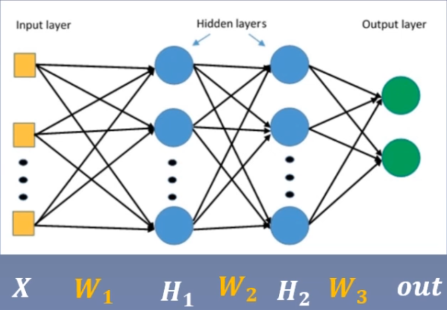

**本章代码**

1. https://github.com/zhangxiann/PyTorch_Practice/blob/master/lesson4/grad_vanish_explod.py

在搭建好网络模型之后，一个重要的步骤就是对网络模型中的权值进行初始化。适当的权值初始化可以加快模型的收敛，而不恰当的权值初始化可能引发梯度消失或者梯度爆炸，最终导致模型无法收敛。

下面分 3 部分介绍。第一部分介绍不恰当的权值初始化是如何引发梯度消失与梯度爆炸的，第二部分介绍常用的 Xavier 方法与 Kaiming 方法，第三部分介绍 PyTorch 中的 10 种初始化方法。

# 梯度消失与梯度爆炸

考虑一个 3 层的全连接网络。

$H_{1}=X \times W_{1}$，$H_{2}=H_{1} \times W_{2}$，$Out=H_{2} \times W_{3}$




其中第 2 层的权重梯度如下：
$$
\begin{aligned} \Delta \mathrm{W}_{2} &=\frac{\partial \mathrm{Loss}}{\partial \mathrm{W}_{2}}=\frac{\partial \mathrm{Loss}}{\partial \mathrm{out}} * \frac{\partial \mathrm{out}}{\partial \mathrm{H}_{2}} * \frac{\partial \mathrm{H}_{2}}{\partial \mathrm{w}_{2}} \\ &=\frac{\partial \mathrm{Loss}}{\partial \mathrm{out}} * \frac{\partial \mathrm{out}}{\partial \mathrm{H}_{2}} * \mathrm{H}_{1} \end{aligned}
$$
所以$\Delta \mathrm{W}_{2}$依赖于前一层的输出$H1$。如果$H1$ 趋近于零，那么$\Delta \mathrm{W}_{2}$也接近于0，造成梯度消失。如果$H1$趋近于无穷大，那么$\Delta \mathrm{W}_{2}$也接近于无穷大，造成梯度爆炸。要避免梯度爆炸或者梯度消失，就要严格控制网络层输出的数值范围。

下面构建 100 层全连接网络，先不适用非线性激活函数，每层的权重初始化为服从$N(0,1)$的正态分布，输出数据使用随机初始化的数据。

```python
import torch
import torch.nn as nn
from common_tools import set_seed

set_seed(1)  # 设置随机种子


class MLP(nn.Module):
    def __init__(self, neural_num, layers):
        super(MLP, self).__init__()
        self.linears = nn.ModuleList([nn.Linear(neural_num, neural_num, bias=False) for i in range(layers)])
        self.neural_num = neural_num

    def forward(self, x):
        for (i, linear) in enumerate(self.linears):
            x = linear(x)


        return x

    def initialize(self):
        for m in self.modules():
            # 判断这一层是否为线性层，如果为线性层则初始化权值
            if isinstance(m, nn.Linear):
                nn.init.normal_(m.weight.data)    # normal: mean=0, std=1

layer_nums = 100
neural_nums = 256
batch_size = 16

net = MLP(neural_nums, layer_nums)
net.initialize()

inputs = torch.randn((batch_size, neural_nums))  # normal: mean=0, std=1

output = net(inputs)
print(output)
```

输出为：

```
tensor([[nan, nan, nan,  ..., nan, nan, nan],
        [nan, nan, nan,  ..., nan, nan, nan],
        [nan, nan, nan,  ..., nan, nan, nan],
        ...,
        [nan, nan, nan,  ..., nan, nan, nan],
        [nan, nan, nan,  ..., nan, nan, nan],
        [nan, nan, nan,  ..., nan, nan, nan]], grad_fn=<MmBackward>)
```

也就是数据太大(梯度爆炸)或者太小(梯度消失)了。接下来我们在`forward()`函数中判断每一次前向传播的输出的标准差是否为 nan，如果是 nan 则停止前向传播。

```python
def forward(self, x):
    for (i, linear) in enumerate(self.linears):
        x = linear(x)
        
        print("layer:{}, std:{}".format(i, x.std()))
        if torch.isnan(x.std()):
            print("output is nan in {} layers".format(i))
            break

    return x
```

输出如下：

```
layer:0, std:15.959932327270508
layer:1, std:256.6237487792969
layer:2, std:4107.24560546875
.
.
.
layer:29, std:1.322983152787379e+36
layer:30, std:2.0786820453988485e+37
layer:31, std:nan
output is nan in 31 layers
```

可以看到每一层的标准差是越来越大的，并在在 31 层时超出了数据可以表示的范围。

下面推导为什么网络层输出的标准差越来越大。

首先给出 3 个公式：

- $E(X \times Y)=E(X) \times E(Y)$：两个相互独立的随机变量的乘积的期望等于它们的期望的乘积。
- $D(X)=E(X^{2}) - [E(X)]^{2}$：一个随机变量的方差等于它的平方的期望减去期望的平方
- $D(X+Y)=D(X)+D(Y)$：两个相互独立的随机变量之和的方差等于它们的方差的和。

可以推导出两个随机变量的乘积的方差如下：
$$
\begin{align}
D(X \times Y)&=E[(XY)^{2}] - [E(XY)]^{2}\\
&=D(X) \times D(Y) + D(X) \times [E(Y)]^{2} + D(Y) \times [E(X)]^{2}
\end {align}
$$
如果$E(X)=0$，$E(Y)=0$，那么$D(X \times Y)=D(X) \times D(Y)$

我们以输入层第一个神经元为例：
$$
\mathrm{H}_{11}=\sum_{i=0}^{n} X_{i} \times W_{1 i}
$$
其中输入 $X$ 和权值 $W$ 都是服从$N(0,1)$的正态分布，所以这个神经元的方差为：
$$
\begin{aligned} \mathbf{D}\left(\mathrm{H}_{11}\right) &=\sum_{i=0}^{n} \boldsymbol{D}\left(X_{i}\right) * \boldsymbol{D}\left(W_{1 i}\right) \\ &=n *(1 * 1) \\ &=n \end{aligned}
$$
标准差为：$\operatorname{std}\left(\mathrm{H}_{11}\right)=\sqrt{\mathbf{D}\left(\mathrm{H}_{11}\right)}=\sqrt{n}$，所以每经过一个网络层，方差就会扩大 n 倍，标准差就会扩大$\sqrt{n}$倍，n 为每层神经元个数，直到超出数值表示范围。对比上面的代码可以看到，每层神经元个数为 256，输出数据的标准差为 1，所以第一个网络层输出的标准差为 16 左右，第二个网络层输出的标准差为 256 左右，以此类推，直到 31 层超出数据表示范围。可以把每层神经元个数改为 400，那么每层标准差扩大 20 倍左右。从$D(\mathrm{H}_{11})=\sum_{i=0}^{n} D(X_{i}) \times D(W_{1 i})$，可以看出，每一层网络输出的方差与神经元个数、输入数据的方差、权值方差有关，其中比较好改变的是权值的方差$D(W)$，所以$D(W)= \frac{1}{n}$，标准差为$std(W)=\sqrt\frac{1}{n}$。因此修改权值初始化代码为`nn.init.normal_(m.weight.data, std=np.sqrt(1/self.neural_num))`,结果如下：

```
layer:0, std:0.9974957704544067
layer:1, std:1.0024365186691284
layer:2, std:1.002745509147644
.
.
.
layer:94, std:1.031973123550415
layer:95, std:1.0413124561309814
layer:96, std:1.0817031860351562
```

修改之后，没有出现梯度消失或者梯度爆炸的情况，每层神经元输出的方差均在 1 左右。通过恰当的权值初始化，可以保持权值在更新过程中维持在一定范围之内，不过过大，也不会过小。

上述是没有使用非线性变换的实验结果，如果在`forward()`中添加非线性变换`tanh`，每一层的输出方差还是会越来越小，会导致梯度消失。因此出现了 Xavier 初始化方法与 Kaiming 初始化方法。

# Xavier 方法与 Kaiming 方法

## Xavier 方法

Xavier 是 2010 年提出的，针对有非线性激活函数时的权值初始化方法，目标是保持数据的方差维持在 1 左右，主要针对饱和激活函数如 sigmoid 和 tanh 等。同时考虑前向传播和反向传播，需要满足两个等式：$\boldsymbol{n}_{\boldsymbol{i}} * \boldsymbol{D}(\boldsymbol{W})=\mathbf{1}$和$\boldsymbol{n}_{\boldsymbol{i+1}} * \boldsymbol{D}(\boldsymbol{W})=\mathbf{1}$，可得：$D(W)=\frac{2}{n_{i}+n_{i+1}}$。为了使 Xavier 方法初始化的权值服从均匀分布，假设$W$服从均匀分布$U[−a,a]$，那么方差$D(W)=\frac{(-a-a)^{2}}{12}=\frac{(2 a)^{2}}{12}=\frac{a^{2}}{3}$，令$\frac{2}{n_{i}+n_{i+1}}=\frac{a^{2}}{3}$，解得：$\boldsymbol{a}=\frac{\sqrt{6}}{\sqrt{n_{i}+n_{i+1}}}$，所以$W$服从分布$U\left[-\frac{\sqrt{6}}{\sqrt{n_{i}+n_{i+1}}}, \frac{\sqrt{6}}{\sqrt{n_{i}+n_{i+1}}}\right]$

所以初始化方法改为：

```python
a = np.sqrt(6 / (self.neural_num + self.neural_num))
# 把 a 变换到 tanh，计算增益
tanh_gain = nn.init.calculate_gain('tanh')
a *= tanh_gain

nn.init.uniform_(m.weight.data, -a, a)
```

并且每一层的激活函数都使用 tanh，输出如下：

```
layer:0, std:0.7571136355400085
layer:1, std:0.6924336552619934
layer:2, std:0.6677976846694946
.
.
.
layer:97, std:0.6426210403442383
layer:98, std:0.6407480835914612
layer:99, std:0.6442216038703918
```

可以看到每层输出的方差都维持在 0.6 左右。

PyTorch 也提供了 Xavier 初始化方法，可以直接调用：

```python
tanh_gain = nn.init.calculate_gain('tanh')
nn.init.xavier_uniform_(m.weight.data, gain=tanh_gain)
```

## nn.init.calculate_gain()

上面的初始化方法都使用了`tanh_gain = nn.init.calculate_gain('tanh')`。

- nonlinearity：激活函数名称
- param：激活函数的参数，如 Leaky ReLU 的 negative_slop。

下面是计算标准差经过激活函数的变化尺度的代码。

```python
x = torch.randn(10000) out = torch.tanh(x)

gain = x.std() / out.std() print('gain:{}'.format(gain))

tanh_gain = nn.init.calculate_gain('tanh') print('tanh_gain in PyTorch:', tanh_gain)
```

输出如下：

```
gain:1.5982500314712524 tanh_gain in PyTorch: 1.6666666666666667 `
```

结果表示，原有数据分布的方差经过 tanh 之后，标准差会变小 1.6倍左右。

## Kaiming 方法

虽然 Xavier 方法提出了针对饱和激活函数的权值初始化方法，但是 AlexNet 出现后，大量网络开始使用非饱和的激活函数如 ReLU 等，这时 Xavier 方法不再适用。2015 年针对 ReLU 及其变种等激活函数提出了 Kaiming 初始化方法。

针对 ReLU，方差应该满足：$\mathrm{D}(W)=\frac{2}{n_{i}}$；针对 ReLu 的变种，方差应该满足：$\mathrm{D}(W)=\frac{2}{n_{i}}$，a 表示负半轴的斜率，如 PReLU 方法，标准差满足$\operatorname{std}(W)=\sqrt{\frac{2}{\left(1+a^{2}\right) * n_{i}}}$。代码如下：`nn.init.normal_(m.weight.data, std=np.sqrt(2 / self.neural_num))`，或者使用 PyTorch 提供的初始化方法：`nn.init.kaiming_normal_(m.weight.data)`，同时把激活函数改为 ReLU。

# 常用初始化方法

PyTorch 中提供了 10 中初始化方法

1. Xavier 均匀分布
2. Xavier 正态分布
3. Kaiming 均匀分布
4. Kaiming 正态分布
5. 均匀分布
6. 正态分布
7. 常数分布
8. 正交矩阵初始化
9. 单位矩阵初始化
10. 稀疏矩阵初始化

每种初始化方法都有它自己使用的场景，原则是保持每一层输出的方差不能太大，也不能太小。

**参考资料**

- [深度之眼PyTorch框架班](https://ai.deepshare.net/detail/p_5df0ad9a09d37_qYqVmt85/6)
- [原文](https://blog.zhangxiann.com/202003092013/)