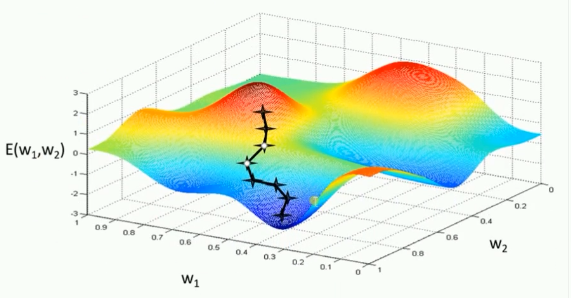
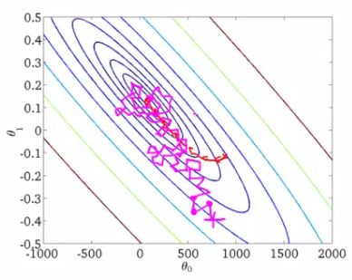

# 优化器总结

机器学习中，有很多优化方法来试图寻找模型的最优解。比如神经网络中可以采取最基本的梯度下降法。


# 梯度下降法(Gradient Descent)

梯度下降法是最基本的一类优化器，目前主要分为三种梯度下降法：

1. **标准梯度下降法**(**GD**, Gradient Descent)
2. **随机梯度下降法**(**SGD**, Stochastic Gradient Descent)
3. **批量梯度下降法**(**BGD**, Batch Gradient Descent)

## 标准梯度下降法(GD)

假设要学习训练的模型参数为$W$，代价函数为$J(W)$，则代价函数关于模型参数的偏导数即相关梯度为$\Delta   J(W)$，学习率为$\eta_t$，则使用梯度下降法更新参数为：
$$
W_{t+1} = W_t - \eta_t \Delta  
J(W_t)
$$
其中，$Wt$表示$t$时刻的模型参数。

从表达式来看，模型参数的更新调整，与代价函数关于模型参数的梯度有关，即沿着梯度的方向不断减小模型参数，从而最小化代价函数。

基本策略可以理解为**在有限视距内寻找最快路径下山**，因此每走一步，参考当前位置最陡的方向(即**梯度**)进而迈出下一步。可以形象的表示为：





**评价**：标准梯度下降法主要有**两个缺点**:

1. **训练速度慢**：每走一步都要要计算调整下一步的方向，下山的速度变慢。在应用于大型数据集中，每输入一个样本都要更新一次参数，且每次迭代都要遍历所有的样本。会使得训练过程及其缓慢，需要花费很长时间才能得到收敛解。
2. **容易陷入局部最优解**：由于是在有限视距内寻找下山的反向。当陷入平坦的洼地，会误以为到达了山地的最低点，从而不会继续往下走。所谓的局部最优解就是鞍点。落入鞍点，梯度为0，使得模型参数不在继续更新。


## 批量梯度下降法(BGD)

假设**批量训练样本**总数为$n$，每次输入和输出的样本分别为$X^{(i)}, Y^{(i)}$，模型参数为$W$，代价函数为$J(W)$，每输入一个样本$i$代价函数关于$W$的梯度为$\Delta   J_i(W_t, X^{(i)}, Y^{(i)})$，学习率为$\eta_t$，则使用批量梯度下降法更新参数表达式为：
$$
W_{t+1} = W_t - \eta_t \sum_{i=1}^n \Delta J_i(W_t, X^{(i)}, Y^{(i)})
$$
其中，$W_t$表示$t$时刻的模型参数。

从表达式来看，模型参数的调整更新与全部输入样本的**代价函数的和**（即批量/全局误差）有关。即每次权值调整发生在批量样本输入之后，而不是每输入一个样本就更新一次模型参数。这样就会大大加快训练速度。

基本策略可以理解为，在下山之前掌握了附近的地势情况，选择总体平均梯度最小的方向下山。

**评价：**

批量梯度下降法比标准梯度下降法训练时间短，且每次下降的方向都很正确。


##  随机梯度下降法(SGD)

对比批量梯度下降法，假设从一批训练样本$n$中随机选取一个样本$i_s$。模型参数为$W$，代价函数为$J(W)$，梯度为$\Delta   J(W)$，学习率为$\eta_t$，则使用随机梯度下降法更新参数表达式为：
$$
W_{t+1} = W_t - \eta_t g_t
$$
其中，$g_t=\Delta J_{i_s}(W_t; X^{(i_s)};X^{(i_s)}), \ \ i_s \in \{1,2,...,n\}$表示随机选择的一个梯度方向，$W_t$表示$t$时刻的模型参数。

$E(g_t) = \Delta J(W_t)$，这里虽然引入了随机性和噪声，但期望仍然等于正确的梯度下降。

基本策略可以理解为随机梯度下降像是一个盲人下山，不用每走一步计算一次梯度，但是他总能下到山底，只不过过程会显得扭扭曲曲。



**优点：**

1. 虽然SGD需要走很多步的样子，但是对梯度的要求很低（计算梯度快）。而对于引入噪声，大量的理论和实践工作证明，只要噪声不是特别大，SGD都能很好地收敛。
2. 应用大型数据集时，训练速度很快。比如每次从百万数据样本中，取几百个数据点，算一个SGD梯度，更新一下模型参数。相比于标准梯度下降法的遍历全部样本，每输入一个样本更新一次参数，要快得多。

**缺点：**

1. SGD在随机选择梯度的同时会引入噪声，使得权值更新的方向不一定正确。
2. 此外，SGD也没能单独克服局部最优解的问题。


# 动量优化法

动量优化方法是在梯度下降法的基础上进行的改变，具有加速梯度下降的作用。一般有标准动量优化方法Momentum、NAG（Nesterov accelerated gradient）动量优化方法。

```
NAG在Tensorflow中与Momentum合并在同一函数tf.train.MomentumOptimizer中，可以通过参数配置启用。1
```


## Momentum

使用动量(Momentum)的随机梯度下降法(SGD)，主要思想是引入一个积攒历史梯度信息动量来加速SGD。

从训练集中取一个大小为$n$的小批量$\{X^{(1)}, X^{(2)},...,X^{(n)}\}$样本，对应的真实值分别为$Y^{(i)}$，则**Momentum优化**表达式为：
$$
\left\{ \begin{aligned} & v_t = \alpha v_{t-1} + \eta_t \Delta J(W_t, X^{(i_s)}, Y^{(i_s)}  ) \\ & W_{t+1} = W_t - v_t \end{aligned} \right.
$$
其中，$v_t$表示$t$时刻积攒的加速度。$\alpha$表示动力的大小，一般取值为0.9（表示最大速度10倍于SGD）。$\Delta J(W_t, X^{(i_s)}, Y^{(i_s)})$含义见SGD算法。$W_t$表示$t$时刻模型参数。

动量主要解决SGD的两个问题：一是随机梯度的方法（引入的噪声）；二是Hessian矩阵病态问题（可以理解为SGD在收敛过程中和正确梯度相比来回摆动比较大的问题）。

理解策略为：由于当前权值的改变会受到上一次权值改变的影响，类似于小球向下滚动的时候带上了惯性。这样可以加快小球向下滚动的速度。


## NAG

牛顿加速梯度（NAG, Nesterov accelerated gradient）算法，是Momentum动量算法的变种。更新模型参数表达式如下：
$$
\left\{ \begin{aligned} & v_t = \alpha v_{t-1} + \eta_t \Delta J(W_t - \alpha v_{t-1}  ) \\ &W_{t+1} = W_t - v_t \end{aligned} \right.
$$
其中，$v_t$表示$t$时刻积攒的加速度；$\alpha$表示动力的大小；$\eta_t$表示学习率；$W_t$表示$t$时刻的模型参数，$\Delta J(W_t - \alpha v_{t-1}  )$表示代价函数关于$W_t$的梯度。

Nesterov动量梯度的计算在模型参数施加当前速度之后，因此可以理解为往标准动量中添加了一个校正因子。

理解策略：在Momentun中小球会盲目地跟从下坡的梯度，容易发生错误。所以需要一个更聪明的小球，能提前知道它要去哪里，还要知道走到坡底的时候速度慢下来而不是又冲上另一个坡。计算$W_t - \alpha v_{t-1}$可以表示小球下一个位置大概在哪里。从而可以提前知道下一个位置的梯度，然后使用到当前位置来更新参数。

在凸批量梯度的情况下，Nesterov动量将额外误差收敛率从$O(1/k)(k步后)$改进到$O(1/k^2)$。然而，在随机梯度情况下，Nesterov动量对收敛率的作用却不是很大。


# 自适应学习率优化算法

自适应学习率优化算法针对于机器学习模型的学习率，传统的优化算法要么将学习率设置为常数要么根据训练次数调节学习率。极大忽视了学习率其他变化的可能性。然而，学习率对模型的性能有着显著的影响，因此需要采取一些策略来想办法更新学习率，从而提高训练速度。

目前的自适应学习率优化算法主要有：**AdaGrad算法**，**RMSProp算法**，**Adam算法**以及**AdaDelta算法**。


## AdaGrad算法

**思想：**

AdaGrad算法，独立地适应所有模型参数的学习率，缩放每个参数反比于其所有梯度历史平均值总和的平方根。具有代价函数最大梯度的参数相应地有个快速下降的学习率，而具有小梯度的参数在学习率上有相对较小的下降。

**算法描述：**

AdaGrad算法优化策略一般可以表示为：
$$
W_{t+1}=W_t -\frac{\eta_0}{\sqrt{\sum_{t'=1}^t (g_{t',i})+\epsilon}} \odot g_{t,i}
$$
假定一个多分类问题，$i$表示第$i$个分类，$t$表示第$t$迭代同时也表示分类$i$累计出现的次数。$\eta_0$表示初始的学习率取值一般为0.01，$\epsilon$是一个取值很小的数（一般为1e-8）为了避免分母为0。$W_t$表示$t$时刻即第$t$迭代模型的参数，$g_{t,i}=\Delta J(W_{t, i})$表示$t$时刻，指定分类$i$，代价函数$J(\cdot)$关于$W$的梯度。

从表达式可以看出，对出现比较多的类别数据，Adagrad给予越来越小的学习率，而对于比较少的类别数据，会给予较大的学习率。因此Adagrad适用于数据稀疏或者分布不平衡的数据集。

Adagrad 的主要优势在于不需要人为的调节学习率，它可以自动调节；缺点在于，随着迭代次数增多，学习率会越来越小，最终会趋近于0。


## RMSProp算法

**思想：**

RMSProp算法修改了AdaGrad的梯度积累为指数加权的移动平均，使得其在非凸设定下效果更好。

**算法描述：**

RMSProp算法的一般策略可以表示为：
$$
\left\{ \begin{aligned} & E[g^2]_t = \alpha  E[g^2]_{t-1} + (1-\alpha)g_t^2  \\ &W_{t+1} = W_t - \frac{\eta_0}{\sqrt{E[g^2]_t+\epsilon}} \odot g_t\end{aligned} \right.
$$
其中，$Wt$表示$t$时刻即第$t$迭代模型的参数，$g_t=\Delta J(W_t)$表示$t$次迭代代价函数关于$W$的梯度大小，$E[g^2]_t$表示前$t$次的梯度平方的均值。$\alpha$表示动力（通常设置为0.9），$\eta_0$表示全局初始学习率。$\epsilon$是一个取值很小的数（一般为1e-8）为了避免分母为0。

RMSProp借鉴了Adagrad的思想，观察表达式，分母为$\sqrt{E[g^2]_t+\epsilon}$。由于取了个加权平均，避免了学习率越来越低的的问题，而且能自适应地调节学习率。

RMSProp算法在经验上已经被证明是一种有效且实用的深度神经网络优化算法。目前它是深度学习从业者经常采用的优化方法之一。


## AdaDelta算法

**思想：**AdaGrad算法和RMSProp算法都需要指定全局学习率，AdaDelta算法结合两种算法每次参数的更新步长即：
$$
\Delta W_{AdaGrad, \ t} = - \frac{\eta_0}{\sqrt{\sum_{t'=1}^t (g_{t',i})+\epsilon}} \odot g_t\\ \Delta W_{RMSProp, \ t} =- \frac{\eta_0}{\sqrt{E[g^2]_t+\epsilon}} \odot g_t
$$


**算法描述：**

AdaDelta算法策略可以表示为：
$$
\left\{ \begin{aligned} & E[g^2]_t = \alpha  E[g^2]_{t-1} + (1-\alpha)g_t^2  \\ & \Delta W_t = - \frac{\sqrt{\sum_{i=1}^{t-1}\Delta W_i }}{\sqrt{E[g^2]_t+\epsilon}}  \\ &W_{t+1} = W_t + \Delta W_t \end{aligned} \right.
$$
其中$W_t$为第$t$次迭代的模型参数，$g_t = \Delta J(W_t)$为代价函数关于$W$的梯度。$E[g^2]_t$表示前$t$次的梯度平方的均值。$\sum_{i=1}^{t-1}\Delta W_i$表示前$t−1$次模型参数每次的更新步长累加求根。

从表达式可以看出，AdaDelta不需要设置一个默认的全局学习率。

**评价：**

在模型训练的初期和中期，AdaDelta表现很好，加速效果不错，训练速度快。

在模型训练的后期，模型会反复地在局部最小值附近抖动。


## Adam算法

**思想：**

首先，Adam中动量直接并入了梯度一阶矩（指数加权）的估计。其次，相比于缺少修正因子导致二阶矩估计可能在训练初期具有很高偏置的RMSProp，Adam包括偏置修正，修正从原点初始化的一阶矩（动量项）和（非中心的）二阶矩估计。

**算法描述：**

AdaDelta算法策略可以表示为：
$$
\left\{ \begin{aligned} & m_t = \beta_1m_{t-1}+(1-\beta_1)g_t \\& v_t = \beta_2v_{t-1}+(1-\beta_2)g_t^2  \\ & \hat{m}_t = \frac{m_t}{1-\beta_1^t}, \ \  \hat{v}_t = \frac{v_t}{1-\beta_2^t} \\ & W_{t+1} = W_t -\frac{\eta}{\sqrt{\hat{v}_t}+\epsilon}\hat{m}_t\end{aligned} \right.
$$
其中，$m_t$和$v_t$分别为一阶动量项和二阶动量项。$\beta_1, \beta_2$为动力值大小通常分别取0.9和0.999；$\hat{m}_t , \hat{v}_t$分别为各自的修正值。$W_t$

表示$t$时刻即第$t$迭代模型的参数，$g_t=\Delta J(W_t)$表示$t$次迭代代价函数关于$W$的梯度大小；$\epsilon$是一个取值很小的数（一般为1e-8）为了避免分母为0。

**评价：**Adam通常被认为对超参数的选择相当鲁棒，尽管学习率有时需要从建议的默认修改。


# 各种优化器的比较

终于结束的漫长的理论分析，下面对各种优化器做一些有趣的比较。

## 可视化比较

**(1) 示例一**


上图描述了在一个曲面上，6种优化器的表现，从中可以大致看出：

**① 下降速度**：

三个自适应学习优化器Adagrad、RMSProp与AdaDelta的下降速度明显比SGD要快，其中，Adagrad和RMSProp齐头并进，要比AdaDelta要快。

两个动量优化器Momentum和NAG由于刚开始走了岔路，初期下降的慢；随着慢慢调整，下降速度越来越快，其中NAG到后期甚至超过了领先的Adagrad和RMSProp。

**② 下降轨迹：**

SGD和三个自适应优化器轨迹大致相同。两个动量优化器初期走了“岔路”，后期也调整了过来。


**(2) 示例二**


上图在一个存在鞍点的曲面，比较6中优化器的性能表现，从图中大致可以看出：

- 三个自适应学习率优化器没有进入鞍点，其中，AdaDelta下降速度最快，Adagrad和RMSprop则齐头并进。
- 两个动量优化器Momentum和NAG以及SGD都顺势进入了鞍点。但两个动量优化器在鞍点抖动了一会，就逃离了鞍点并迅速地下降，后来居上超过了Adagrad和RMSProp。
- 很遗憾，SGD进入了鞍点，却始终停留在了鞍点，没有再继续下降。


**(3) 示例三**


上图比较了6种优化器收敛到目标点（五角星）的运行过程，从图中可以大致看出：

**① 在运行速度方面**

- 两个动量优化器Momentum和NAG的速度最快，其次是三个自适应学习率优化器AdaGrad、AdaDelta以及RMSProp，最慢的则是SGD。

**② 在收敛轨迹方面**

- 两个动量优化器虽然运行速度很快，但是初中期走了很长的”岔路”。
- 三个自适应优化器中，Adagrad初期走了岔路，但后来迅速地调整了过来，但相比其他两个走的路最长；AdaDelta和RMSprop的运行轨迹差不多，但在快接近目标的时候，RMSProp会发生很明显的抖动。
- SGD相比于其他优化器，走的路径是最短的，路子也比较正。


## 应用于简单分类问题的比较

Tensorflow中封装了一系列的优化器：

1. tf.train.GradientDescentOptimizer
2. tf.train.AdadeltaOptimizer
3. tf.train.AdagradOptimizer
4. tf.train.AdagradDAOptimizer
5. tf.train.MomentumOptimizer
6. tf.train.AdamOptimizer
7. tf.train.FtrlOptimizer
8. tf.train.ProximalGradientDescentOptimizer
9. tf.train.ProximalAdagradOptimizer
10. tf.train.RMSPropOptimizer

下面采用选取几种优化器应用于UCI数据集iris.data简单的分类问题。为了简单起见，初始代码可以参考[机器学习：过拟合、神经网络Dropout](https://blog.csdn.net/weixin_40170902/article/details/80092553)中没使用Dropout之前的代码。修改一行调用优化器的代码：


###  使用SGD优化器

- 优化器的代码为：

```
train_step = tf.train.GradientDescentOptimizer(0.2).minimize(loss)1
```

- 运行结果

```
第1个训练周期训练集的准确率为：33.3%,  测试集的准确率为：32.2%
第2个训练周期训练集的准确率为：33.3%,  测试集的准确率为：32.2%
第3个训练周期训练集的准确率为：38.9%,  测试集的准确率为：35.6%
第4个训练周期训练集的准确率为：62.2%,  测试集的准确率为：62.7%
第5个训练周期训练集的准确率为：66.7%,  测试集的准确率为：66.1%
第6个训练周期训练集的准确率为：66.7%,  测试集的准确率为：67.8%
第7个训练周期训练集的准确率为：66.7%,  测试集的准确率为：67.8%
第8个训练周期训练集的准确率为：67.8%,  测试集的准确率为：67.8%
第9个训练周期训练集的准确率为：67.8%,  测试集的准确率为：67.8%
第10个训练周期训练集的准确率为：67.8%,  测试集的准确率为：67.8%
1234567891011
```


###  使用AdaGrad优化器

- 优化器的代码为：

```
train_step = tf.train.AdagradOptimizer(0.01).minimize(loss)1
```

- 运行结果

```
第1个训练周期训练集的准确率为：33.3%,  测试集的准确率为：32.2%
第2个训练周期训练集的准确率为：35.6%,  测试集的准确率为：32.2%
第3个训练周期训练集的准确率为：66.7%,  测试集的准确率为：66.1%
第4个训练周期训练集的准确率为：66.7%,  测试集的准确率为：66.1%
第5个训练周期训练集的准确率为：66.7%,  测试集的准确率为：66.1%
第6个训练周期训练集的准确率为：66.7%,  测试集的准确率为：66.1%
第7个训练周期训练集的准确率为：66.7%,  测试集的准确率为：67.8%
第8个训练周期训练集的准确率为：66.7%,  测试集的准确率为：67.8%
第9个训练周期训练集的准确率为：67.8%,  测试集的准确率为：69.5%
第10个训练周期训练集的准确率为：68.9%,  测试集的准确率为：69.5%12345678910
```

- 点评：从运行结果上可以看出使用AdaGrad优化器相比于SGD似乎没有较大的提升。


### 使用Momentum优化器

- 优化器的代码为：

```
train_step = tf.train.MomentumOptimizer(learning_rate=0.01, momentum=0.9).minimize(loss)1
```

- 运行结果

```
第1个训练周期训练集的准确率为：58.9%,  测试集的准确率为：61.0%
第2个训练周期训练集的准确率为：40.0%,  测试集的准确率为：42.4%
第3个训练周期训练集的准确率为：66.7%,  测试集的准确率为：66.1%
第4个训练周期训练集的准确率为：66.7%,  测试集的准确率为：66.1%
第5个训练周期训练集的准确率为：66.7%,  测试集的准确率为：66.1%
第6个训练周期训练集的准确率为：66.7%,  测试集的准确率为：66.1%
第7个训练周期训练集的准确率为：67.8%,  测试集的准确率为：67.8%
第8个训练周期训练集的准确率为：67.8%,  测试集的准确率为：67.8%
第9个训练周期训练集的准确率为：67.8%,  测试集的准确率为：69.5%
第10个训练周期训练集的准确率为：70.0%,  测试集的准确率为：67.8%
1234567891011
```

- 点评：Momentum优化器略优于AdaGrad优化器和SGD，但收敛速度要比后两者快（第1-2个训练周期就可以达到60%的准确率）。


### 使用NAG优化器

- 优化器的代码为：

```
train_step = tf.train.MomentumOptimizer(learning_rate=0.01, momentum=0.9, use_nesterov=True).minimize(loss)1
```

- 运行结果

```
第1个训练周期训练集的准确率为：37.8%,  测试集的准确率为：39.0%
第2个训练周期训练集的准确率为：66.7%,  测试集的准确率为：66.1%
第3个训练周期训练集的准确率为：66.7%,  测试集的准确率为：66.1%
第4个训练周期训练集的准确率为：66.7%,  测试集的准确率为：66.1%
第5个训练周期训练集的准确率为：66.7%,  测试集的准确率为：66.1%
第6个训练周期训练集的准确率为：66.7%,  测试集的准确率为：66.1%
第7个训练周期训练集的准确率为：66.7%,  测试集的准确率为：67.8%
第8个训练周期训练集的准确率为：67.8%,  测试集的准确率为：69.5%
第9个训练周期训练集的准确率为：70.0%,  测试集的准确率为：69.5%
第10个训练周期训练集的准确率为：71.1%,  测试集的准确率为：69.5%12345678910
```

- 点评：NAG和Momentum结果差不多，NAG似乎好那么一点点。

### 使用RMSProp优化器

- 优化器的代码为：

```
train_step = tf.train.RMSPropOptimizer(0.01).minimize(loss)1
```

- 运行结果（RMSProp运行结果不稳定，下面是出现比较多的相近结果）

```
第1个训练周期训练集的准确率为：33.3%,  测试集的准确率为：32.2%
第2个训练周期训练集的准确率为：33.3%,  测试集的准确率为：32.2%
第3个训练周期训练集的准确率为：35.6%,  测试集的准确率为：35.6%
第4个训练周期训练集的准确率为：48.9%,  测试集的准确率为：49.2%
第5个训练周期训练集的准确率为：35.6%,  测试集的准确率为：35.6%
第6个训练周期训练集的准确率为：38.9%,  测试集的准确率为：42.4%
第7个训练周期训练集的准确率为：51.1%,  测试集的准确率为：50.8%
第8个训练周期训练集的准确率为：66.7%,  测试集的准确率为：66.1%
第9个训练周期训练集的准确率为：60.0%,  测试集的准确率为：62.7%
第10个训练周期训练集的准确率为：66.7%,  测试集的准确率为：66.1% 12345678910
```

- 点评：RMSProp优化器的效果有点不理想，而且不稳定。

### 使用Adam优化器

- 优化器的代码为：

```
train_step = tf.train.AdamOptimizer(0.001).minimize(loss)1
```

- 运行结果

```
第1个训练周期训练集的准确率为：33.3%,  测试集的准确率为：33.9%
第2个训练周期训练集的准确率为：36.7%,  测试集的准确率为：37.3%
第3个训练周期训练集的准确率为：66.7%,  测试集的准确率为：66.1%
第4个训练周期训练集的准确率为：66.7%,  测试集的准确率为：66.1%
第5个训练周期训练集的准确率为：66.7%,  测试集的准确率为：67.8%
第6个训练周期训练集的准确率为：67.8%,  测试集的准确率为：67.8%
第7个训练周期训练集的准确率为：67.8%,  测试集的准确率为：67.8%
第8个训练周期训练集的准确率为：71.1%,  测试集的准确率为：67.8%
第9个训练周期训练集的准确率为：71.1%,  测试集的准确率为：69.5%
第10个训练周期训练集的准确率为：71.1%,  测试集的准确率为：69.5%12345678910
```

- 点评：Adam优化器的表现可圈可点，比RMSProp优化器要稳定。

	

### 使用AdaDelta优化器

- 优化器的代码为：

```
train_step = tf.train.AdadeltaOptimizer(1).minimize(loss)1
```

- 运行结果

```
第1个训练周期训练集的准确率为：60.0%,  测试集的准确率为：64.4%
第2个训练周期训练集的准确率为：66.7%,  测试集的准确率为：66.1%
第3个训练周期训练集的准确率为：66.7%,  测试集的准确率为：66.1%
第4个训练周期训练集的准确率为：66.7%,  测试集的准确率为：67.8%
第5个训练周期训练集的准确率为：67.8%,  测试集的准确率为：69.5%
第6个训练周期训练集的准确率为：70.0%,  测试集的准确率为：69.5%
第7个训练周期训练集的准确率为：72.2%,  测试集的准确率为：71.2%
第8个训练周期训练集的准确率为：73.3%,  测试集的准确率为：76.3%
第9个训练周期训练集的准确率为：75.6%,  测试集的准确率为：84.7%
第10个训练周期训练集的准确率为：76.7%,  测试集的准确率为：88.1%12345678910
```

- 点评：AdaDelta优化器似乎能在本例中夺魁。

**总评**：

通过对比10个训练周期的准确率结果可以看出，其他的优化器（除了RMSProp，有点意外，可能本例不适合）或多或少都优于SGD。从收敛速度上看，两个动量优化器Momentum和NAG的速度相比于除了AdaDelta之外的优化器要快，1-2个周期就能达到60%的准确率。而本例中表现最好的优化器是AdaDelta，无论是收敛速度还是十周期的准确率都比其他优化器要好的多。


# 优化器的选择

那种优化器最好？该选择哪种优化算法？目前还没能够达达成共识。Schaul et al (2014)展示了许多优化算法在大量学习任务上极具价值的比较。虽然结果表明，具有自适应学习率的优化器表现的很鲁棒，不分伯仲，但是没有哪种算法能够脱颖而出。

目前，最流行并且使用很高的优化器（算法）包括SGD、具有动量的SGD、RMSprop、具有动量的RMSProp、AdaDelta和Adam。在实际应用中，选择哪种优化器应结合具体问题；同时，也优化器的选择也取决于使用者对优化器的熟悉程度（比如参数的调节等等）。


## 参考资料

1. [为什么说随机最速下降法(SGD)是一个很好的方法？](https://zhuanlan.zhihu.com/p/27609238)
2. [深度学习最全优化方法总结比较（SGD，Adagrad，Adadelta，Adam，Adamax，Nadam）](https://zhuanlan.zhihu.com/p/22252270)
3. Lan Goodfellow: Deep learning. 深度学习【中文版】
4. [常见优化算法 (caffe和tensorflow对应参数)](https://blog.csdn.net/csyanbin/article/details/53460627)