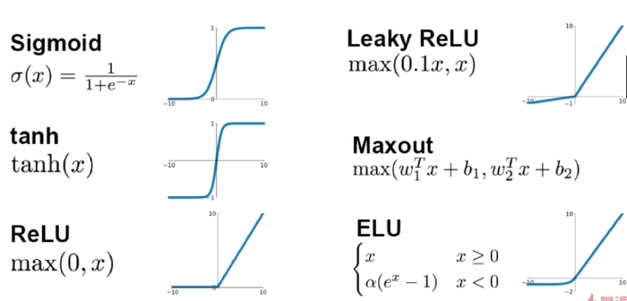

**目录：**

1. 更多的优化算法
2. 激活函数
3. 网络初始化
4. 批归一化
5. 数据增强
6. 更多的调参技巧

# 更多的优化算法

回顾：

1. 随机梯度下降
    a) 局部极值
    b) Saddle point问题
2. 动量梯度下降
    - 问题1：受初始学习率影响较大
    - 问题2：每一个维度的学习率一样
3. AdaGrad算法
4. 调整学习率
5. 前期，regularizer较大，放大梯度
6. 后期，regularizer较小，缩小梯度
7. 梯度随训练次数降低
8. 每个分量有不同的学习率

**缺点：**

1. 学习率设置太大，导致rtegularizer影响过于敏感
2. 后期，rtegularizer累计值太大，提前结束训练

> RMSProp：

​    Adagrad的变种，由累积平方梯度变为平均平方梯度，解决了后期提前结束的问题

> Adam：

​    所有的上诉算法都会用learning_rate来做参数

​    Adam比较有效：

- Beta1=0.9
- Beta2=0.999
- Learning_rate=1e-3 or 5e-4

> 学习率自适应：

   1. 对于稀疏数据，使用学习率可自适应方法
   2. SGD通常训练时间更长，最终效果比较好，但需要更好的初始化和learning_rate
   3. 需要训练较深较复杂的网络且需要快速收敛时，推荐使用Adam。
   4. Adagrad，RMSprop，Adam是比较相似的算法，在相似的情况下表现差不多.

# 激活函数

- Sigmoid：

   1. 输入非常大或非常小时没有梯度。
   2. 输出均值非0。
   3. Exp计算复杂。
   4. 梯度消失。df(x)/dx = f(x)(1-f(x))

- Tanh:

   1. 依旧没有梯度。
   2. 输出均值是0。
   3. 计算复杂。

- ReLU：
	1. 不饱和（梯度不会过小）
	2. 计算量小
	3. 收敛速度快
	4. 输出均值非零
	5. Dead ReLU

一个非常大的梯度流过神经元，不会再对数据有激活现象了

- Leak-ReLU：
	    1. 解决了dead relu的问题

- ELU：
	
	    1. 均值更接近0 
	
   2. 小于0时计算量大
	
         
	
- Maxout：

       1. ReLU的泛化版本
       2. 没有dead relu
       3. 参数double

- 技巧：
         1. Relu-小心设置learning rate
            2. 不要使用sigmod
            3. 使用Leaky Relu, maxout, ELU
            4. 可以试试tanh，但不要抱太大期望

# 网络初始化

全部为0：

    1. 单层网络可以
       2. 多层网络会使梯度消失
            a) 链式法则

如何分析初始化结果好不好？

    1. 查看初始化后各层的激活值分布

​                

tanh：

   1. 均值为0，方差为0.02的正太分布初始化

	​        高层均值为0，没有梯度

2. 均值为0，方差为1的正太分布初始化

	​         高层均值为-1,1，已经饱和

3. Xavier-tanh

Xavier-ReLU：并不理想

He-ReLU：相对好点

# 批归一化

1. 每个batch在每一层上都做归一化
2. 为了确保归一化能够起到作用，另设两个参数来逆归一化

# 数据增强

1. 归一化
2. 图像变换：翻转、拉伸、裁剪、变形
3. 色彩变换：比度、亮度
4. 多尺度

# 更多的调参技巧

1. 拿到更多的数据
2. 给神经网络逐次添加层次
3. 紧跟最新进展，使用新方法
4. 增大训练的迭代次数
5. 尝试正则化||w||^2
6. 使用更多的GPU来加速训练
7. 可视化工具来检查中间状态：损失、梯度、准确率、学习率 
8. 在标准数据集上训练
9. 在小数据集上过拟合
10. 数据集分布平衡
11. 使用预调整好的稳定模型结构
12. Fine-tuning：预训练好的网络结构上进行微调