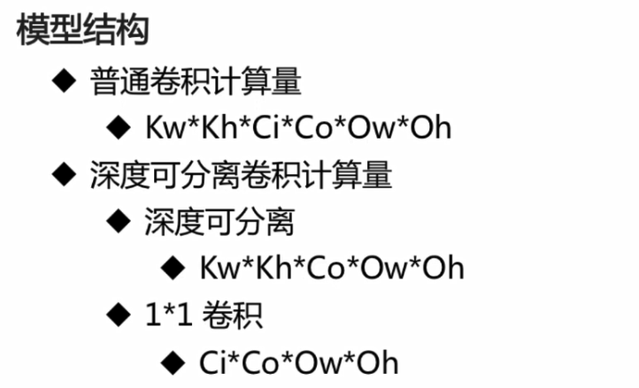

# 网络结构

精度损失在可控的范围内，大幅度减少计算量


用右边深度可分离结构代替左边普通卷积


分组卷积





```python

```


x: 计算量
y: 准确率
大小：参数量

# 基于TensorFlow的代码实现


```python
import tensorflow as tf
import os
import pickle
import numpy as np

CIFAR_DIR = "D:\Pr_Anchor\Part03-Dataset\CIFAR10\cifar-10-batches-py"
print(os.listdir(CIFAR_DIR))
```

    ['batches.meta', 'data_batch_1', 'data_batch_2', 'data_batch_3', 'data_batch_4', 'data_batch_5', 'readme.html', 'test_batch']


```python
def load_data(filename):
    """read data from data file."""
    with open(filename, 'rb') as f:
        data = pickle.load(f, encoding='bytes')
        return data[b'data'], data[b'labels']

# tensorflow.Dataset.
class CifarData:
    def __init__(self, filenames, need_shuffle):
        all_data = []
        all_labels = []
        for filename in filenames:
            data, labels = load_data(filename)
            all_data.append(data)
            all_labels.append(labels)
        self._data = np.vstack(all_data)
        self._data = self._data / 127.5 - 1
        self._labels = np.hstack(all_labels)
        print(self._data.shape)
        print(self._labels.shape)
        
        self._num_examples = self._data.shape[0]
        self._need_shuffle = need_shuffle
        self._indicator = 0
        if self._need_shuffle:
            self._shuffle_data()
            
    def _shuffle_data(self):
        # [0,1,2,3,4,5] -> [5,3,2,4,0,1]
        p = np.random.permutation(self._num_examples)
        self._data = self._data[p]
        self._labels = self._labels[p]
    
    def next_batch(self, batch_size):
        """return batch_size examples as a batch."""
        end_indicator = self._indicator + batch_size
        if end_indicator > self._num_examples:
            if self._need_shuffle:
                self._shuffle_data()
                self._indicator = 0
                end_indicator = batch_size
            else:
                raise Exception("have no more examples")
        if end_indicator > self._num_examples:
            raise Exception("batch size is larger than all examples")
        batch_data = self._data[self._indicator: end_indicator]
        batch_labels = self._labels[self._indicator: end_indicator]
        self._indicator = end_indicator
        return batch_data, batch_labels

train_filenames = [os.path.join(CIFAR_DIR, 'data_batch_%d' % i) for i in range(1, 6)]
test_filenames = [os.path.join(CIFAR_DIR, 'test_batch')]

train_data = CifarData(train_filenames, True)
test_data = CifarData(test_filenames, False)
```

    (50000, 3072)
    (50000,)
    (10000, 3072)
    (10000,)


```python
def separable_conv_block(x, output_channel_number, name):
    """separable_conv block implementation"""
    """
    Args:
    - x:
    - output_channel_number: output channel of 1*1 conv layer.
    - name:
    """
    with tf.variable_scope(name):
        input_channel = x.get_shape().as_list()[-1]
        # channel_wise_x: [channel1, channel2, ...]
        channel_wise_x = tf.split(x, input_channel, axis=3)
        output_channels = []
        for i in range(len(channel_wise_x)):
            output_channel = tf.layers.conv2d(
                channel_wise_x[i],
                1, (3, 3),
                strides=(1, 1),
                padding='same',
                activation=tf.nn.relu,
                name='conv_%d' % i)
            output_channels.append(output_channel)
        concat_layer = tf.concat(output_channels, axis=3)
        conv1_1 = tf.layers.conv2d(
            concat_layer,
            output_channel_number, (1, 1),
            strides=(1, 1),
            padding='same',
            activation=tf.nn.relu,
            name='conv1_1')
    return conv1_1
```


```python
x = tf.placeholder(tf.float32, [None, 3072])
y = tf.placeholder(tf.int64, [None])
# [None], eg: [0,5,6,3]
x_image = tf.reshape(x, [-1, 3, 32, 32])
# 32*32
x_image = tf.transpose(x_image, perm=[0, 2, 3, 1])

# conv1: 神经元图， feature_map, 输出图像
conv1 = tf.layers.conv2d(
    x_image,
    32,  # output channel number
    (3, 3),  # kernel size
    padding='same',
    activation=tf.nn.relu,
    name='conv1')

pooling1 = tf.layers.max_pooling2d(
    conv1,
    (2, 2),  # kernel size
    (2, 2),  # stride
    name='pool1')

separable_2a = separable_conv_block(pooling1, 32, name='separable_2a')
separable_2b = separable_conv_block(separable_2a, 32, name='separable_2b')

pooling2 = tf.layers.max_pooling2d(
    separable_2b,
    (2, 2),  # kernel size
    (2, 2),  # stride
    name='pool2')

separable_3a = separable_conv_block(pooling2, 32, name='separable_3a')
separable_3b = separable_conv_block(separable_3a, 32, name='separable_3b')

pooling3 = tf.layers.max_pooling2d(
    separable_3b,
    (2, 2),  # kernel size
    (2, 2),  # stride
    name='pool3')

flatten = tf.layers.flatten(pooling3)
y_ = tf.layers.dense(flatten, 10)

loss = tf.losses.sparse_softmax_cross_entropy(labels=y, logits=y_)
# y_ -> sofmax
# y -> one_hot
# loss = ylogy_

# indices
predict = tf.argmax(y_, 1)
# [1,0,1,1,1,0,0,0]
correct_prediction = tf.equal(predict, y)
accuracy = tf.reduce_mean(tf.cast(correct_prediction, tf.float64))

with tf.name_scope('train_op'):
    train_op = tf.train.AdamOptimizer(1e-3).minimize(loss)
```


```python
init = tf.global_variables_initializer()
batch_size = 20
train_steps = 100
test_steps = 100

# train 10k: 63.3%
with tf.Session() as sess:
    sess.run(init)
    for i in range(train_steps):
        batch_data, batch_labels = train_data.next_batch(batch_size)
        loss_val, acc_val, _ = sess.run(
            [loss, accuracy, train_op],
            feed_dict={
                x: batch_data,
                y: batch_labels})
        if (i+1) % 10 == 0:
            print('[Train] Step: %d, loss: %4.5f, acc: %4.5f'
                  % (i+1, loss_val, acc_val))
        if (i+1) % 10 == 0:
            test_data = CifarData(test_filenames, False)
            all_test_acc_val = []
            for j in range(test_steps):
                test_batch_data, test_batch_labels \
                    = test_data.next_batch(batch_size)
                test_acc_val = sess.run(
                    [accuracy],
                    feed_dict = {
                        x: test_batch_data, 
                        y: test_batch_labels
                    })
                all_test_acc_val.append(test_acc_val)
            test_acc = np.mean(all_test_acc_val)
            print('[Test ] Step: %d, acc: %4.5f'
                  % (i+1, test_acc))
```

    [Train] Step: 10, loss: 2.30575, acc: 0.10000
    (10000, 3072)
    (10000,)
    [Test ] Step: 10, acc: 0.09700
    [Train] Step: 20, loss: 2.29824, acc: 0.20000
    (10000, 3072)
    (10000,)
    [Test ] Step: 20, acc: 0.10700
    [Train] Step: 30, loss: 2.29592, acc: 0.15000
    (10000, 3072)
    (10000,)
    [Test ] Step: 30, acc: 0.12150
    [Train] Step: 40, loss: 2.28407, acc: 0.30000
    (10000, 3072)
    (10000,)
    [Test ] Step: 40, acc: 0.11250
    [Train] Step: 50, loss: 2.28804, acc: 0.10000
    (10000, 3072)
    (10000,)
    [Test ] Step: 50, acc: 0.13400
    [Train] Step: 60, loss: 2.25732, acc: 0.10000
    (10000, 3072)
    (10000,)
    [Test ] Step: 60, acc: 0.13100
    [Train] Step: 70, loss: 2.16693, acc: 0.20000
    (10000, 3072)
    (10000,)
    [Test ] Step: 70, acc: 0.17750
    [Train] Step: 80, loss: 2.18869, acc: 0.45000
    (10000, 3072)
    (10000,)
    [Test ] Step: 80, acc: 0.19500
    [Train] Step: 90, loss: 2.17096, acc: 0.25000
    (10000, 3072)
    (10000,)
    [Test ] Step: 90, acc: 0.20100
    [Train] Step: 100, loss: 1.98656, acc: 0.20000
    (10000, 3072)
    (10000,)
    [Test ] Step: 100, acc: 0.21950
