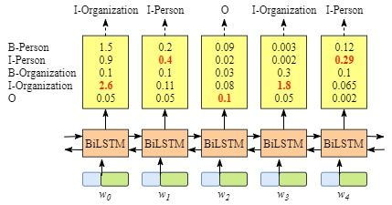
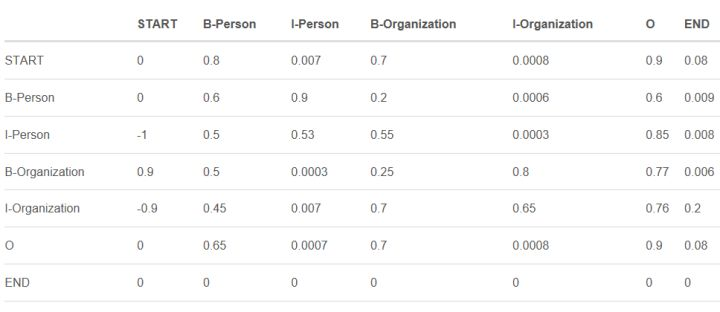
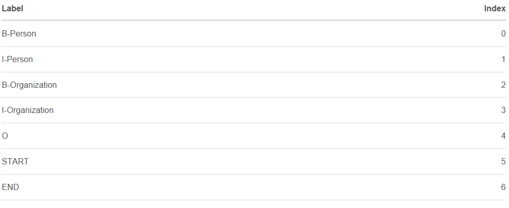
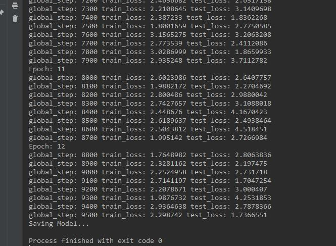
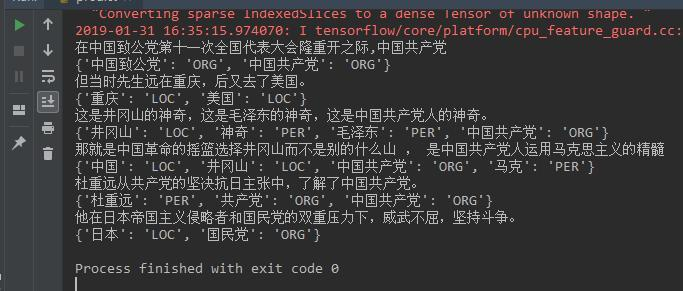

#  BiLSTM-CRF模型理解

- https://www.cnblogs.com/shona/p/11563112.html

## 适用任务

中文分词、词性标注、命名实体识别是自然语言理解中，基础性的工作，同时也是非常重要的工作。

在很多NLP的项目中，工作开始之前都要经过这三者中的一到多项工作的处理。在深度学习中，有一种模型可以同时胜任这三种工作，而且效果还很不错--那就是biLSTM_CRF。

biLSTM，指的是双向LSTM；CRF指的是条件随机场。

 

## 一些说明

以命名实体识别为例，我们规定在数据集中有两类实体，人名和组织机构名称。

在数据集中总共有5类标签：

- B-Person （人名的开始部分）
- I- Person （人名的中间部分）
- B-Organization （组织机构的开始部分）
- I-Organization （组织机构的中间部分）
- O （非实体信息）

此外，假设 x 是包含了5个单词的一句话（w0,w1,w2,w3,w4）。

在句子x中[w0,w1]是人名，[w3]是组织机构名称，其他都是“O”。

 

## BiLSTM-CRF 模型

先来简要的介绍一下该模型。如下图所示：

首先，句中的每个单词是一条包含词嵌入和字嵌入的词向量，词嵌入通常是事先训练好的，字嵌入则是随机初始化的。所有的嵌入都会随着训练的迭代过程被调整。

其次，BiLSTM-CRF的输入是词嵌入向量，输出是每个单词对应的预测标签。


如下图所示，BiLSTM层的输入表示该单词对应各个类别的分数。如W0，BiLSTM节点的输出是:1.5 (B-Person), 0.9 (I-Person), 0.1 (B-Organization), 0.08 (I-Organization) and 0.05 (O)。这些分数将会是CRF层的输入。 所有的经BiLSTM层输出的分数将作为CRF层的输入，类别序列中分数最高的类别就是我们预测的最终结果。


##  如果没有CRF层会是什么样

 即使没有CRF层，我们照样可以训练一个基于BiLSTM的命名实体识别模型，如下图所示。


因为BiLSTM模型的结果是单词对应各类别的分数，我们可以选择分数最高的类别作为预测结果。如W0，“B-Person”的分数最高（1.5），那么我们可以选定“B-Person”作为预测结果。同样的，w1是“I-Person”, w2是“O”,w3是 “B-Organization” ，w4是 “O”。

尽管我们在该例子中得到了正确的结果，但实际情况并不总是这样：



显然，这次的分类结果并不准确。

 

## CRF层可以学习到句子的约束条件

CRF层可以**加入一些约束来保证最终预测结果是有效的**。这些约束可以在训练数据时被CRF层自动学习得到。

可能的约束条件有：

- 句子的开头应该是“B-”或“O”，而不是“I-”。
- B-label1 I-label2 I-label3…”，在该模式中，类别1,2,3应该是同一种实体类别。比如，“B-Person I-Person” 是正确的，而“B-Person I-Organization”则是错误的。
- “O I-label”是错误的，命名实体的开头应该是“B-”而不是“I-”。

有了这些有用的约束，错误的预测序列将会大大减少。

 

## CRF 层

CRF层中的损失函数包括两种类型的分数，而理解这两类分数的计算是理解CRF的关键。

### Emission score

第一个类型的分数是**发射分数**（状态分数）。这些状态分数**来自BiLSTM层的输出**，在这里就是word预测为某个标签的概率。如下图所示，w0被预测为B-Person的分数是1.5。


 

为方便起见，我们给每个类别一个索引，如下表所示：


 

$X_{iy_j}$代表状态分数，$i$是单词的位置索引，$y_j$是类别的索引。根据上表，
$$
x_{i=1, y_{j}=2}=x_{w_{1}, B-\text {Organization}}=0.1
$$
表示单词w1被预测为B−Organization的分数是0.1。


---


### 转移分数

用$t{y_iy_j}$来表示转移分数。例如，t B−Person,I−Person=0.9表示从类别B−Person→I−Person的分数是0.9。因此，有一个所有类别间的**转移分数矩阵**。

为了使转移分数矩阵更具鲁棒性，我们加上START 和 END两类标签。START代表一个句子的开始（不是句子的第一个单词），END代表一个句子的结束。

下表是加上START和END标签的转移分数矩阵。



如上表格所示，转移矩阵已经学习到一些有用的约束条件：

- 句子的第一个单词应该是**B-** 或 **O**，而不是**I**。（从START->I-Person 或 I-Organization的转移分数很低）
- B-label1 I-label2 I-label3…，在该模式中，类别1,2,3应该是同一种实体类别。比如，B-Person I-Person是正确的，而B-Person I-Organization则是错误的。（B-Organization -> I-Person的分数很低）
- **O I-label**是错误的，命名实体的开头应该是**B-**而不是**I-**。

 

**要怎样得到这个转移矩阵呢？**

实际上，转移矩阵是BiLSTM-CRF模型的一个参数。在训练模型之前，你可以随机初始化转移矩阵的分数。这些分数将随着训练的迭代过程被更新，换句话说，CRF层可以自己学到这些约束条件。


### CRF损失函数

CRF损失函数由两部分组成，**真实路径的分数** 和 **所有路径的总分数**。真实路径的分数应该是所有路径中分数最高的。

例如，数据集中有如下几种类别：



 

一个包含5个单词的句子，可能的类别序列如下：

1. START B-Person B-Person B-Person B-Person B-Person END
2. START B-Person I-Person B-Person B-Person B-Person END
3. …..
4. START B-Person I-Person O B-Organization O END
5. ......
6. N. O O O O O O O

每种可能的路径的分数为$P_i$，共有N条路径，则路径的总分是:
$$
P_{\text {total}}=P_{1}+P_{2}+\ldots+P_{N}=e^{S_{1}}+e^{S_{2}}+\ldots+e^{S_{N}}
$$
$e$是常数$e$。

如果第十条路径是真实路径，也就是说第十条是正确预测结果，那么第十条路径的分数应该是所有可能路径里得分最高的。

根据如下损失函数，在训练过程中，BiLSTM-CRF模型的参数值将随着训练过程的迭代不断更新，使得真实路径所占的比值越来越大。
$$
LossFunction=\frac{P_{\text {RealPath}}}{P_{1}+P_{2}+\ldots+P_{N}}
$$


现在的**问题**是:

1. 怎么定义路径的分数？
2. 怎么计算所有路径的总分？
3. 当计算所有路径总分时，是否需要列举出所有可能的路径？（答案是不需要）


**真实路径分数**

计算真实路径分数，$e^{S_i}$，是非常容易的。

我们先集中注意力来计算$S_i$：

以**START B-Person I-Person O B-Organization O END**这条真实路径来说：

句子中有5个单词，w1,w2,w3,w4,w5，加上START和END 在句子的开始位置和结束位置，记为，w0，w6
$$
S_i = EmissionScore + TransitionScore
$$
**EmissionScore:**
$$
EmissionScore =x_{0, S T A R T}+x_{1, B-P e r s o n}+x_{2, I-P e r s o n}+x_{3, O}+x_{4, B-O r g a n i z a t i o n}+x_{5, O}+x_{6, E N D}
$$
这些分数来自BiLSTM层的输出，至于$x_0,START$ 和$x_6,END$ ，则设为0。

**TransitionScore:**
$$
\begin{array}{l}
TransitionScore &= t_{S T A R T->B-P e r s o n}+t_{B-P e r s o n->I-P e r s o n}+ t_{I-P e r s o n->O}+ \\
&t_{O->B-O r g a n i z a t i o n}+t_{B-O r g a n i z a t i o n->O} +t_{O->E N D}
\end{array}
$$
这些分数来自于CRF层，将这两类分数加和即可得到$S_i $和路径分数$e^{S_i}$

 

**所有路径的总分**

如何计算所有路径的总分呢？以一个玩具的例子详细讲解。

**Step 1**

我们定义的损失函数如下：
$$
LossFunction=\frac{P_{\text {RealPath}}}{P_{1}+P_{2}+\ldots+P_{N}}
$$
现在我们把它变成对数损失函数：
$$
Log LossFunction=log\frac{P_{\text {RealPath}}}{P_{1}+P_{2}+\ldots+P_{N}}
$$
训练目标通常是最小化损失函数，加负号：
$$
\begin{aligned}
LogLoss Function &=-\log \frac{P_{\text {RealPath}}}{P_{1}+P_{2}+\ldots+P_{N}}\\
&=-\log \frac{e^{S_{\text {RealPath}}}}{e^{S_{1}}+e^{S_2}+\ldots+e^{S_{N}}}\\
&=-\left(\log \left(e^{S_{\text {RealPath }}}\right)-\log \left(e^{S_{1}}+e^{S_{2}}+\ldots+e^{S_{N}}\right)\right)\\
&=-\left(S_{\text {RealPath}}-\log \left(e^{S_{1}}+e^{S_{2}}+\ldots+e^{S_{N}}\right)\right)\\
&=-\left(\sum_{i=1}^{N} x_{i y_{i}}+\sum_{i=1}^{N-1} t_{y_{i} y_{i+1}}-\log \left(e^{S_{1}}+e^{S_{2}}+\ldots+e^{S_{N}}\right)\right)
\end{aligned}
$$
前面我们已经很清楚如何计算真实路径得分，现在我们需要找到一个方法去计算
$$
\log \left(e^{S_{1}}+e^{S_{2}}+\ldots+e^{S_{N}}\right)
$$
**Step 2：**回忆一下状态分数 和 转移分数

为了简化问题，假定我句子只有3个单词组成：$X = [w_0, w_1 ,w_2]$

只有两个类别：$LabelSet = {l_1, l_2}$

状态分数如下：


 

转移矩阵如下：


 

**Step 3：**

目标是：
$$
\log \left(e^{S_{1}}+e^{S_{2}}+\ldots+e^{S_{N}}\right)
$$
整个过程是一个分数的积聚过程。它的实现思想有点像动态规划。首先，w0所有路径的总分先被计算出来，然后，计算w0 -> w1的所有路径的得分，最后计算w0 -> w1 -> w2的所有路径的得分，也就是我们需要的结果。

接下来，会看到两个变量：obs和 previous。Previous存储了之前步骤的结果，obs代表当前单词所带的信息。
$$
\begin{array}{l}
w_{0}: \\
o b s=\left[x_{01}, x_{02}\right] \\
\text { previous }=\text { None }
\end{array}
$$
如果句子只有一个单词，就没有之前步骤的结果，所以Previous 是空。只能观测到状态分数 obs =【x01，x02】

W0 的所有路径总分就是：
$$
Total S c o r e\left(w_{0}\right)=\log \left(e^{x_{01}}+e^{x_{02}}\right)​
$$

$$
\begin{array}{l}
w_{0} \rightarrow w_{1} \\
o b s=\left[x_{11}, x_{12}\right] \\
previous =\left[x_{01}, x_{02}\right]
\end{array}
$$
1) Expand the previous to:
$$
previous=\left(\begin{array}{ll}
x_{01} & x_{01} \\
x_{02} & x_{02}
\end{array}\right)
$$


2) Expand the obs to:
$$
o b s=\left(\begin{array}{ll}
x_{11} & x_{12} \\
x_{11} & x_{12}
\end{array}\right)
$$


 为啥要扩展previous 和 obs 矩阵呢？因为这样操作可以是接下来的计算相当高效。

3) Sum previous, obs and transition scores:
$$
\text {scores}=\left(\begin{array}{ll}
x_{01} & x_{01} \\
x_{02} & x_{02}
\end{array}\right)+\left(\begin{array}{ll}
x_{11} & x_{12} \\
x_{11} & x_{12}
\end{array}\right)+\left(\begin{array}{ll}
t_{11} & t_{12} \\
t_{21} & t_{22}
\end{array}\right)
$$
Then:
$$
\text {scores}=\left(\begin{array}{ll}
x_{01}+x_{11}+t_{11} & x_{01}+x_{12}+t_{12} \\
x_{02}+x_{11}+t_{21} & x_{02}+x_{12}+t_{22}
\end{array}\right)
$$
Change the value of previous for the next iteration:
$$
previous =\left[\log \left(e^{x_{01}+x_{11}+t_{11}}+e^{x_{02}+x_{11}+t_{21}}\right), \log \left(e^{x_{01}+x_{12}+t_{12}}+e^{x_{02}+x_{12}+t_{22}}\right)\right]
$$


  实际上，第二次迭代过程也就完成了。
$$
\begin{array}{l}
\text {TotalScore}\left(w_{0} \rightarrow w_{1}\right) \\
=\log \left(e^{\text {previous}[0]}+e^{\text {previous}[1]}\right) \\
=\log \left(e^{\log \left(e^{x_{01}+x_{11}+t_{11}}+e^{x_{02}+x_{11}+t_{21}}\right)}+
e^{\log \left(e^{x_{01}+x_{12}+t_{12}}+e^{x_{02}+x_{12}+t_{22}}\right)} \right) \\
=\log \left(e^{x_{01}+x_{11}+t_{11}}+e^{x_{02}+x_{11}+t_{21}}+e^{x_{01}+x_{12}+t_{12}}+e^{x_{02}+x_{12}+t_{22}}\right)
\end{array}
$$
 发现了吗，这其实就是我们的目标，$\log \left(e^{S_{1}}+e^{S_{2}}+\ldots+e^{S_{N}}\right)$
$$
\begin{aligned}
S_{1} &=x_{01}+x_{11}+t_{11} \text { (label}_{1} \rightarrow \text { label }_{1} \text { ) } \\
S_{2} &=x_{02}+x_{11}+t_{21} \text { (label }_{2} \rightarrow \text { label }_{1} \text { ) } \\
S_{3} &=x_{01}+x_{12}+t_{12} \text { (label }_{1} \rightarrow \text { label }_{2} \text { ) } \\
S_{4} &=x_{02}+x_{12}+t_{22} \text { (label }_{2} \rightarrow \text { label }_{2} \text { ) }
\end{aligned}
$$

$$
w_{0} \rightarrow w_{1} \rightarrow w_{2}
$$

 读到这边，差不多就大功告成了。这一步，我们再重复一次之前的步骤。
$$
\begin{aligned}
&\text { obs }=\left[x_{21}, x_{22}\right] \\
&\text { previous }=\left[\log \left(e^{x_{01}+x_{11}+t_{11}}+e^{x_{02}+x_{11}+t_{21}}\right), \log \left(e^{x_{01}+x_{12}+t_{12}}+e^{x_{02}+x_{12}+t_{22}}\right)\right]
\end{aligned}
$$

1) Expand the previous to:
$$
\text { previous }=\left(\begin{array}{ll}
\log \left(e^{x_{01}+x_{11}+l_{11}}+e^{x_{02}+x_{11}+l_{21}}\right) & \log \left(e^{x_{01}+x_{11}+t_{11}}+e^{x_{02}+x_{11}+l_{11}}\right) \\
\log \left(e^{x_{01}+x_{12}+t_{12}}+e^{x_{02}+x_{12}+l_{n}}\right) & \log \left(e^{x_{01}+x_{12}+t_{12}}+e^{x_{02}+x_{12}+t_{n}}\right)
\end{array}\right)
$$
2) Expand the obs to:

$$
\text { obs }=\left(\begin{array}{ll}
x_{21} & x_{22} \\
x_{21} & x_{22}
\end{array}\right)
$$

3) Sum previous, obs and transition scores:
$$
\text { scores }=\left(\begin{array}{ll}
\log \left(e^{x_{11}+x_{11}+t_{11}}+e^{x_{12}+x_{11}+t_{21}}\right) & \log \left(e^{x_{01}+x_{11}+t_{11}}+e^{x_{02}+x_{11}+t_{21}}\right) \\
\log \left(e^{x_{01}+x_{12}+t_{12}}+e^{x_{12}+x_{12}+t_{22}}\right) & \log \left(e^{x_{01}+x_{12}+t_{12}}+e^{x_{0 a}+x_{12}+t_{21}}\right)
\end{array}\right)+\left(\begin{array}{ll}
x_{21} & x_{22} \\
x_{21} & x_{22}
\end{array}\right)+\left(\begin{array}{ll}
t_{11} & t_{12} \\
t_{21} & t_{22}
\end{array}\right)
$$
Then:
$$
\text { scores }=\left(\begin{array}{ll}
\log \left(e^{x_{01}+x_{11}+t_{11}}+e^{x_{0 n}+x_{11}+t_{11}}\right)+x_{21}+t_{11} & \log \left(e^{x_{01}+x_{11}+t_{11}}+e^{x_{12}+x_{11}+t_{11}}\right)+x_{22}+t_{12} \\
\log \left(e^{x_{01}+x_{12}+t_{12}}+e^{x_{02}+x_{12}+l_{22}}\right)+x_{21}+t_{21} & \log \left(e^{x_{01}+x_{12}+t_{12}}+e^{x_{02}+x_{12}+t_{22}}\right)+x_{22}+t_{22}
\end{array}\right)
$$
Change the value of previous for the next iteration：
$$
\begin{aligned}
previous &= [ \\
&\log \left( e^{\log \left(e^{x_{01}+r_{11}+t_{11}}+e^{x_{01}+x_{11}+t_{11}}\right)+x_{21}+l_{11}}+e^{\log \left(e^{x_{01}+x_{12}+t_{12}}+e^{x_{11}+z_{12}+t_{n}}\right)+x_{11}+l_{21}}\right) \text {, }\\
&\log \left(e^{\log \left(e^{x_{01}+r_{11}+t_{11}}+e^{e^{2}+x_{11}+t_{11}}\right)+x_{21}+l_{12}}+e^{\log \left(e^{e_{01}+r_{11}+t_{12}}+e^{x_{02}+x_{12}+t_{12}}\right)+x_{22}+l_{22}}\right) \\
]
\\
&=\left[\log \left(\left(e^{x_{01}+x_{11}+l_{11}}+e^{x_{01}+x_{11}+l_{11}}\right) e^{x_{11}+l_{11}}+\left(e^{x_{01}+x_{12}+l_{12}}+e^{x_{01}+x_{12}+l_{n 2}}\right) e^{x_{11}+l_{11}}\right),\right. \\
&\left.\log \left(\left(e^{x_{01}+x_{11}+t_{11}}+e^{x_{01}+x_{11}+t_{11}}\right) e^{x_{n n}+t_{12}}+\left(e^{x_{01}+x_{12}+t_{12}}+e^{x_{01}+x_{12}+t_{22}}\right) e^{x_{n}+t_{n}}\right)\right]
\end{aligned}
$$
跟上一步骤一样，用新的previous计算总分：
$$
\begin{aligned}
&\text { TotalScore }\left(w_{0} \rightarrow w_{1} \rightarrow w_{2}\right)\\
&=\log \left(e^{\text {previous }[0]}+e^{\text {previous [1] }}\right)\\
&=\log \left(e^{\log \left(\left(e^{x_{01}+x_{11}^{+t}} 11+e^{x_{02}+x_{11}+t_{21}}\right) e^{x_{21}+t_{11}}+\left(e^{x_{01}+x_{12}+t_{12}}+e^{x_{02}+x_{12}+t_{22}}\right) e^{x_{21}+t_{21}}\right)}\right.\\
&\left.+e^{\log \left(\left(e^{x_{01}+x_{11}+t_{11}}+e^{x_{02}+x_{11}+t_{21}}\right) e^{x_{22}+t_{12}}+\left(e^{x_{01}+x_{12}+t_{12}}+e^{x_{02}+x_{12}+t_{22}}\right) e^{x_{22}+t_{22}}\right)}\right)\\
&=\log \left(e^{x_{01}+x_{11}+t_{11}+x_{21}+t_{11}}+e^{x_{02}+x_{11}+t_{21}+x_{21}+t_{11}}\right.\\
&+e^{x_{01}+x_{12}+t_{12}+x_{21}+t_{21}}+e^{x_{02}+x_{12}+t_{22}+x_{21}+t_{21}}\\
&+e^{x_{01}+x_{11}+t_{11}+x_{22}+t_{12}}+e^{x_{02}+x_{11}+t_{21}+x_{22}+t_{12}}\\
&\left.+e^{x_{01}+x_{12}+t_{12}+x_{22}+t_{22}}+e^{x_{02}+x_{12}+t_{22}+x_{22}+t_{22}}\right)
\end{aligned}
$$
 最终得到了我们的目标，$\log \left(e^{S_{1}}+e^{S_{2}}+\ldots+e^{S_{N}}\right)$，我们的句子中共有3个单词和两个类别，所以共有8条路径。

# biLSTM_CRF模型实现

## 运行环境

python 3.6

tensorflow 1.2

[本文GITHUB](https://github.com/NLPxiaoxu/Easy_NER_biLSTM_CRF) 欢迎Star和Fork。

使用同样方法，构造的中文分词。[中文分词GITHUB](https://github.com/NLPxiaoxu/Easy_CWS_biLSTM_CRF)

## 数据预处理

首先是将预测数据进行处理，转成模型能够识别的数字。


**数据原格式**

数据是以列形式存储，截图翻转了一下。

我从训练文本中，抽取频数在前5000的字，实际只抽取到了4830左右个字。加入'<PAD>','<UNK>','<NUM>'，分别表示填充字符，未知字符，数字字符。一起存入字典。


**字典**

标签同样也有对应的字典。

```bash
# 将tag转换成数字
tag2label = {"O": 0, "B-PER": 1, "I-PER": 2, "B-LOC": 3, "I-LOC": 4, "B-ORG": 5, "I-ORG": 6}
```

 依据字典与标签字典，将文字与标签分别转成数字。第一行是文本，第二行是标签。


**文本与标签**

下一步是生成batch的操作。

生成batch后，需要对batch内句子padding到统一的长度，并计算每句的真实长度。

## 模型构建

采用双向LSTM对序列进行处理，将输出结果进行拼接。输入shape[batch,seq_Length,hidden_dim]，输出shape[batch,seq_length,2*hidden_dim]。

```php
with tf.name_scope('biLSTM'):
cell_fw = tf.nn.rnn_cell.LSTMCell(pm.hidden_dim)
    cell_bw = tf.nn.rnn_cell.LSTMCell(pm.hidden_dim)
    outputs, outstates = tf.nn.bidirectional_dynamic_rnn(cell_fw=cell_fw, cell_bw=cell_bw,inputs=self.embedding,
                                                         sequence_length=self.seq_length, dtype=tf.float32)
    outputs = tf.concat(outputs, 2)#将双向RNN的结果进行拼接
    #outputs三维张量，[batchsize,seq_length,2*hidden_dim]
```

我们从本文的第一幅图中，可以看出，整个biLSTM完整的输出格式是[batch,seq_length,num_tag]。num_tag是标签的数量，本实验中是标签数量是7。所以我们需要一个全连接层，将输出格式处理一下。

```jsx
with tf.name_scope('output'):
s = tf.shape(outputs)
output = tf.reshape(outputs, [-1, 2*pm.hidden_dim])
output = tf.layers.dense(output, pm.num_tags)
output = tf.contrib.layers.dropout(output, pm.keep_pro)
self.logits = tf.reshape(output, [-1, s[1], pm.num_tags])
```

self.logits就是需要输入CRF层中的数据。代码的第三行，对output的变形，表示将[batch,seq_length,2*hidden_dim]变成[batch*seq_length,2*hidden_dim]，最后处理时再变形为[batch,seq_length,num_tag]。

下面就是CRF层的处理：

```php
with tf.name_scope('crf'):
log_likelihood, self.transition_params = crf_log_likelihood(inputs=self.logits, tag_indices=self.input_y, sequence_lengths=self.seq_length)
    # log_likelihood是对数似然函数，transition_params是转移概率矩阵
    #crf_log_likelihood{inputs:[batch_size,max_seq_length,num_tags],
    #tag_indices:[batchsize,max_seq_length],
    #sequence_lengths:[real_seq_length]
    #transition_params: A [num_tags, num_tags] transition matrix
    #log_likelihood: A scalar containing the log-likelihood of the given sequence of tag indices.
```

这一步，是调用from tensorflow.contrib.crf import crf_log_likelihood函数，求最大似然函数，以及求转移矩阵。最大似然函数前加上"-"，可以用梯度下降法求最小值；

```php
        with tf.name_scope('loss'):
            self.loss = tf.reduce_mean(-log_likelihood) #最大似然取负，使用梯度下降
```

转移矩阵可以帮助维特比算法来求解最优标注序列。

```ruby
    def predict(self, sess, seqs):
        seq_pad, seq_length = process_seq(seqs)
        logits, transition_params = sess.run([self.logits, self.transition_params], feed_dict={self.input_x: seq_pad,
                                                                                               self.seq_length: seq_length,
                                                                                               self.keep_pro: 1.0})
        label_ = []
        for logit, length in zip(logits, seq_length):
            #logit 每个子句的输出值，length子句的真实长度，logit[:length]的真实输出值
            # 调用维特比算法求最优标注序列
            viterbi_seq, _ = viterbi_decode(logit[:length], transition_params)
            label_.append(viterbi_seq)
        return label_
```

## 模型训练与测试

训练时，共进行12次迭代，每迭代4次，将训练得到的结果，保存到checkpoints；loss的情况，保留到tensorboard中；每100个batch,输出此时的训练结果与测试结果。



模型训练

模型的loss由最初在训练集54.93降到2.29，在测试集上由47.45降到1.73。我们看下，保存的模型在验证集上的效果。

## 模型验证

我从1998年的人民网的新闻素材中，随机抽取了几条语句。



ORG表示组织名词，LOC表示地理名词,PER表示人名。从验证结果上看，模型在命名实体识别上，效果还可以。

## 对句子的单词词性做预测

**Step 1：**BiLSTM-CRF模型得到的**发射分数和转移分数**

假定我们的句子共3个单词组成：
$$
x=[w_0,w_1,w_2]
$$
并且，我们已经从我们的模型中得到了发射分数和转移分数，如下：


 转移矩阵：

 

**Step 2：**开始预测

如果你熟悉Viterbi算法，理解这一步的知识点将会非常容易。当然，如果你不熟悉也无所谓，整个预测过程和之前求所有路径总分的过程非常类似。我将逐步解释清楚，我们先从左到右的顺序来运行预测算法。

- $w_0$
- $w_0 \rightarrow w_1$
- $w_0 \rightarrow w_1 \rightarrow w_2$

 你将会看到两类变量：obs 和 previous。Previous存储了上一个步骤的最终结果，obs代表当前单词包含的信息（发射分数）。

Alpha0 是历史最佳的分数 ，alpha1 是最佳分数所对应的类别索引。这两类变量的详细信息待会会做说明。先来看下面的图片：你可以把这两类变量当做狗狗去森林里玩耍时在路上做的标记，这些标记可以帮助狗狗找到回家的路。

 


 

$$
\begin{align}
& w_0: \\
& obs = [x_{01},x_{02}] \\
& previous = None
\end{align}
$$
 现在，我们来观测第一个单词$W_0$，很显然，$W_0$所对应的最佳预测类别是非常容易知道的。比如，如果
$$
obs = [x_{01}=0.2, x_{02}=0.8]
$$
显然，最佳预测结果是l2。

$$
\begin{align}
& w_0 \rightarrow w_{1}: \\
& obs = [x_{11},x_{12}] \\
& previous = [x_{01},x_{02}]
\end{align}
$$

1) Expand the previous to:
$$
\text { previous }=\left(\begin{array}{ll}
\text { previous }[0] & \text { previous }[0] \\
\text { previous }[1] & \text { previous }[1]
\end{array}\right)=\left(\begin{array}{ll}
x_{01} & x_{01} \\
x_{02} & x_{02}
\end{array}\right)
$$
2) Expand the obs to:
$$
o b s=\left(\begin{array}{ll}
o b s[0] & o b s[1] \\
o b s[0] & o b s[1]
\end{array}\right)=\left(\begin{array}{ll}
x_{11} & x_{12} \\
x_{11} & x_{12}
\end{array}\right)
$$
3) Sum previous, obs and transition scores:
$$
\text { scores }=\left(\begin{array}{ll}
x_{01} & x_{01} \\
x_{02} & x_{02}
\end{array}\right)+\left(\begin{array}{ll}
x_{11} & x_{12} \\
x_{11} & x_{12}
\end{array}\right)+\left(\begin{array}{ll}
t_{11} & t_{12} \\
t_{21} & t_{22}
\end{array}\right)
$$
Then:
$$
\text { scores }=\left(\begin{array}{ll}
x_{01}+x_{11}+t_{11} & x_{01}+x_{12}+t_{12} \\
x_{02}+x_{11}+t_{21} & x_{02}+x_{12}+t_{22}
\end{array}\right)
$$
看到这里，你可能好奇这跟之前求所有路径分数的算法没什么区别，别急，你马上就会看到不同之处啦！

 在下一次迭代前更改previous的值：**max！**
$$
\text { previous }=[\max (\text { scores }[00], \text { scores }[10]), \max (\text { scores }[01], \text { scores }[11])]
$$
举个例子，如果我们的得分如下：

$$
\text { scores }=\left(\begin{array}{ll}
x_{01}+x_{11}+t_{11} & x_{01}+x_{12}+t_{12} \\
x_{02}+x_{11}+t_{21} & x_{02}+x_{12}+t_{22}
\end{array}\right)=\left(\begin{array}{cc}
0.2 & 0.3 \\
0.5 & 0.4
\end{array}\right)
$$
那么我们的previous应该是：
$$
\text { previous }=[\max (\text { scores }[00], \text { scores }[10]), \max (\text { scores }[01], \text { scores }[11])]=[0.5,0.4]
$$
这是什么意思呢？其实也就是说**previous存储的是当前单词对应各类别的最佳路径得分**。W1被预测为L1类别的最高分是0.5，路径是L2->L1，W1被预测为L2类别的最高分是0.4，路径是L2->L2。

 

这边，我们有两个变量来储存历史信息，alpha0 和 alpha1.

在本次迭代中，我们将最佳分数存储到alpha0 ：

$$
\begin{gathered}
\text { scores }=\left(\begin{array}{ll}
x_{01}+x_{11}+t_{11} & x_{01}+x_{12}+t_{12} \\
x_{02}+x_{11}+t_{21} & x_{02}+x_{12}+t_{22}
\end{array}\right)=\left(\begin{array}{ll}
0.2 & 0.3 \\
0.5 & 0.4
\end{array}\right) \\
\text { alpha } a_{0}=[(\text { scores }[10], \text { scores }[11])]=[(0.5,0.4)]
\end{gathered}
$$
 同时，最佳分数所对应的类别索引存储到alpha1：

$$
\operatorname{alpha}_{1}=[(\text { ColumnIndex }(\text { scores }[10]), \text { ColumnIndex }(\text { scores }[11]))]=[(1,1)]
$$
类别L1的索引是0，L2的索引是1，所以（1,1）=（L2，L2）。表示当前最佳分数0.5对应的路径是L2->L1,最佳分数0.4对应的路径是L2->L2。（1,1）可以理解为前一单词分别对应的类别索引。

$$w_{0} \rightarrow w_{1} \rightarrow w_{2}:$$

$$\text { obs }=\left[x_{21}, x_{22}\right]$$

previous $=[0.5,0.4]$
1) Expand the previous to:
$$
\text { previous }=\left(\begin{array}{ll}
\text { previous }[0] & \text { previous }[0] \\
\text { previous }[1] & \text { previous }[1]
\end{array}\right)=\left(\begin{array}{ll}
0.5 & 0.5 \\
0.4 & 0.4
\end{array}\right)
$$
2) Expand the obs to:
$$
o b s=\left(\begin{array}{ll}
o b s[0] & o b s[1] \\
o b s[0] & o b s[1]
\end{array}\right)=\left(\begin{array}{ll}
x_{21} & x_{22} \\
x_{21} & x_{22}
\end{array}\right)
$$
3) Sum previous, obs and transition scores:
$$
\text { scores }=\left(\begin{array}{ll}
0.5 & 0.5 \\
0.4 & 0.4
\end{array}\right)+\left(\begin{array}{ll}
x_{21} & x_{22} \\
x_{21} & x_{22}
\end{array}\right)+\left(\begin{array}{ll}
t_{11} & t_{12} \\
t_{21} & t_{22}
\end{array}\right)
$$
Then:
$$
\text { scores }=\left(\begin{array}{ll}
0.5+x_{11}+t_{11} & 0.5+x_{12}+t_{12} \\
0.4+x_{11}+t_{21} & 0.4+x_{12}+t_{22}
\end{array}\right)
$$
上面scores有错误，应该是0.5+x21+t11 等

更改previous的值：

$$
\text { previous }=[\max (\text { scores }[00], \text { scores }[10]), \max (\text { scores }[01], \text { scores }[11])]
$$
 假如我们的得分是：

$$
scores=\left(
\begin{array}{ll}
0.6 & \underline{0.9} \\
\underline{0.8} & 0.7
\end{array}
\right)
$$
**现在我们的previous是：**
$$
\text { previous }=[0.8,0.9]
$$
现在，我们选取previous[0] 和previous[1]中最大的分数作为最佳路径。也就是0.9对应的路径是我们的预测结果。

同时，每个类别对应的最大得分添加到alpha0 和 alpha1中：
$$
\begin{gathered}
\text {alpha}_{0}=[(0.5,0.4), \underline{(\text { scores }[10], \text { scores }[01])]} \\
=[(0.5,0.4),\underline{(0.8,0.9)}] \\
\operatorname{alpha}_{1}=[(1,1),\underline{(1,0)}]
\end{gathered}
$$
 Step 3：根据最大得分找到最佳路径

这是最后一步，alpha0 和 alpha1将被用来找到最佳路径。

先看alpha0，alpha0中最后一个单词对应的类别得分分别是0.8 和 0.9，那么0.9对应的类别L2就是最佳预测结果。再看alpha1，L2对应的索引是0, “0”表示之前一个单词对应的类别是L1，所以W1-W2的最佳路径是： L1->L2

接着往前推，alpha1=（1,1），我们已经知道W1的预测结果是L1，对应的索引是0，（1,1）[0] = 1，所以W0对应的类别是L2。

所以我们预测的**最佳路径**是 L2-> L1 -> L2 。


# 参考资料

1. [Bi LSTM-CRF 模型理解](https://www.cnblogs.com/shona/p/11563112.html)