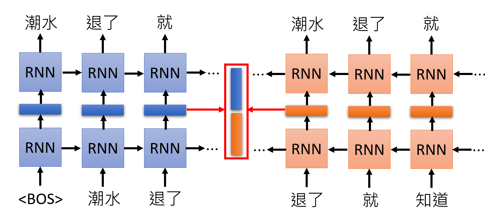
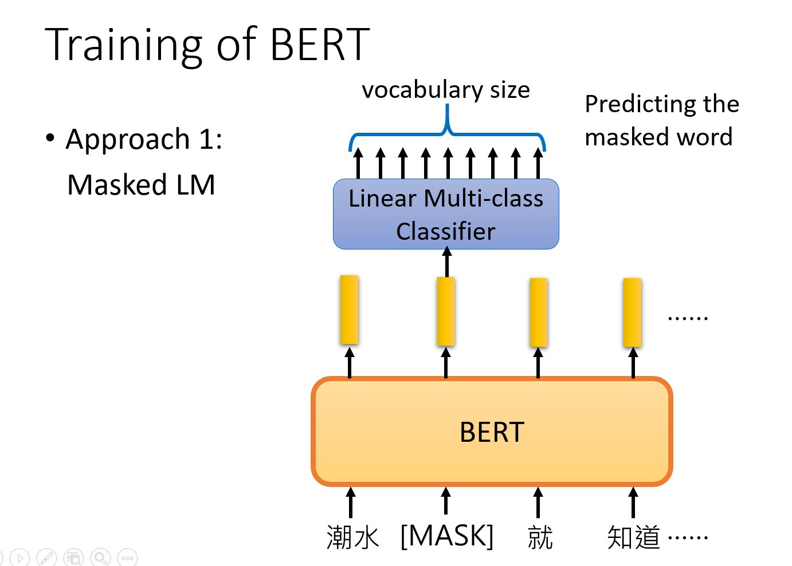

[这篇文章](https://blog.zhangxiann.com/202007051402/)用于记录台大李宏毅老师的 **ELMO，BERT，GPT 课程** 的学习笔记。[课程地址](https://www.bilibili.com/video/av64570585/)

这篇文章用一句话概括，就是：**如何让机器看懂人类的文字**。

为了让机器更好地理解人类的文字，学术界做了许多的研究，截至目前为止，在这个方向上最新的进展：ELMO、BERT、GPT。上一篇文章讲了 Transformer，而 BERT 是 Transformer 里的 Encoder，GPT 是 Transformer 里的 Decoder。

# EMLO

上一篇文章讲了 Word Embedding，也就是每个词都使用一个向量来表示，向量中包含了词的语义信息。

通常一个词只有一个 Embedding 向量已经足够了，但是实际中，同一个词出现在不同的句子，可能有不同的含义。

例如：下面 4 个句子中，前 2 个句子的`bank`表示**银行**，后 2 个句子的`bank`表示河边。

```
Have you paid that money to the bank yet ?
It is safest to deposit your money in the bank.
The victim was found lying dead on the river bank.
They stood on the river bank to fish.
```

在之前的 Word Embedding 中，所有的`bank`的 Embedding 都是一样的。但是在上面 4 个句子中，前 2 个句子的`bank`和后 2 个句子的`bank`的 Embedding 应该是不一样的。我们希望，模型对于同一个词，能够根据不同的上下文，学习出不同的 Embedding。这种方法叫做 Contextualized Word Embedding 。

为了达到这个目的，一种叫 ELMO （Embedding from Language Model）的方法被提出来了。这是一种基于 RNN 的。

具体是使用两个 RNN：

- 左边的 RNN 根据前一个词，输出后一个词，学习到了前文的信息
- 右边的 RNN 根据后一个词，输出前一个词，学习到了后文的信息。

两个 RNN 训练完成后，取中间的 Hidden state，并拼接起来，得到最终的 Embedding，这个 Embedding 包含了上下文的信息。



上面的图中只有一层 RNN，在实际中，可以设置多层的 RNN ，这样就会得到多个层对应的 Embedding。那这时应该选择哪些层的 Embedding 呢？ELMO 的做法是这些 Embedding 全都要，将每一层的 Embedding 加权求和，得到最终的 Embedding。这里的权值，是和具体的 NLP 任务一起训练得到的，比如 Coreference(找出指代词对应的词)、SQuAD(问答系统)、SST-5(文本情感分类)。


# BERT

Bert 就是 Transformer 的 Encoder 部分，全称是 Bidirectional Encoder Representations from Transformers。

在 transformer 中，Encoder 的输入是一句话的序列，输出是每个词的 Embedding 向量。

所以，BERT 的作用也是训练得到每个词的 Embedding。


训练 BERT 的方法包括两个：Masked LM 和 Next Sentence Prediction。

在实际中，这两个训练方法是同时应用到 BERT 中的。

## Masked LM

- 输入给 BERT 的句子中，会随机选择 15% 的字或者单词置换为一个特殊的 token，称为 MASK。
- 然后把整句话输入到 BERT，得到每个词的 Embedding。
- 把 MASK 位置的 Embedding，输入一个线性的分类器，根据 Embedding 预测这个位置的词是哪一个。




因为最后的分类器是一个简单的线性分类器，拟合能力弱，而它的输入是从 BERT 中学习到的 Embedding，这就要求从 BERT 中学习到的 Embedding 是一种非常好的 representation。

## Next Sentence Prediction

第二种训练方法是：把两个句子拼接起来，中间添加一个 SEP 的分隔符，并在最前面添加一个 CLS 的 token，经过 BERT 得到每个位置的 Embedding，把 CLS 位置输出的 Embedding 输入一个线性 2 分类器，判断这两个句子是不是属于前后关系。

你可能有 一个疑问，为什么 CLS 的位置要放在句子的最开始，而不是最后面。这是因为 BERT 内部的 Self-Attention 可以连接整个上下文的信息。因此，CLS 放在句子的前面还是后面，是没有影响的。


在实际中，Bert 是可以和具体的任务，一起训练的。

下面是 4 个应用例子。

## BERT 的应用例子

### 文章分类

BERT 可以用来做情感分类，文档分类等任务。

具体是在文档最前面添加一个 CLS 的 token，然后整个文档经过 BERT 得到 Embedding，把 CLS 位置的 Embedding 输入到一个线性分类器做分类。其中 BERT 的网络可以使用别人已经训练好的参数做 fine-tune。


### Slot filling(每个词做分类)

在 Slot filling 中，每个词都有一个类别。只需要把句子经过 BERT 得到的每一个 Embedding 都输入到线性分类器中，对每一个词做分类。


### Natural Language Inference

在 Natural Language Inference 任务中，输入是两个句子，前面一句是前提，后面一句是推论，判断根据前一个句子是否能够推导出后一个句子。这是一个 3 分类问题，输出有： True/False/ unknown。

和第一个问题类似，也是在句子前面添加一个 CLS 的 token，然后把 CLS 位置的 Embedding 输入一个线性分类器。


### Extraction-based Question Answering

这是问答系统的任务，输入是一篇文章 D={d1,d2,...,dN}D={d1,d2,...,dN}，和一个问题 Q={q1,q2,...,qM}Q={q1,q2,...,qM}，输出是答案在文章 DD 中的位置 (s,e)(s,e)，ss 表示答案的开始位置，ee 表示答案的结束位置。那么答案 A=={ds,...,de}A=={ds,...,de}。

如下图所示，问题和答案的序列拼接起来，输入到 BERT，得到每个词的 Embedding。然后训练两个向量，与文档 DD 里面的每一个词计算相似度，再经过 Softmax 层输出概率。

在下图左边，一个向量用于匹配答案的开始位置 ss。

在下图右边，另一个向量用于匹配答案的结束位置 ee。

那么最终的答案就是 A=={ds,...,de}A=={ds,...,de}。


如果 s>e，表示开始的位置比结束的位置还要大，意味着对应的问题没有答案。

在原始论文中，BERT 有 24 层网络，也就是会有 24 个向量输出，最终的向量是 24 个向量的加权求和，权重是和具体的任务一起训练得到的。有论文研究了不同任务对 BERT 中每一层 Embedding 的权重的分布图。

论文地址：https://arxiv.org/abs/1905.05950

# ERNIE

你可以把 ERNIE 和 BERT 类似，但是 ERNIE 是为中文设计的，全称是 Enhanced Representation through Knowledge Integration。

它和 BERT 的区别是：

- 在 BERT 的训练中，Masked LM 会随机选择 15% 的**字**替换成特殊的 MASK。
- 而在 ERNIE 的训练中，Masked LM 会随机选择 15% 的**词**替换成特殊的 MASK。

论文地址：https://arxiv.org/abs/1904.09223


# GPT

GPT 是 Generative Pre-Training，是 Transformer 的 Decoder 部分。也就是根据前一个词生成下一个词。


目前， GPT 已经发展到第 3代，称为 GPT 3，是目前最大的模型，使用的数据集在处理前容量达到了 45TB，具有 1750 亿参数，被赋予“最强 NLP 模型”的称号。GPT-3 可以做到非常多的事，它可以写诗、写剧本、写小说、甚至输出一些代码。GPT-3 的能力前所未有地强大。目前 GPT-3 已经开放了 API，你可以尝试申请体验一下。