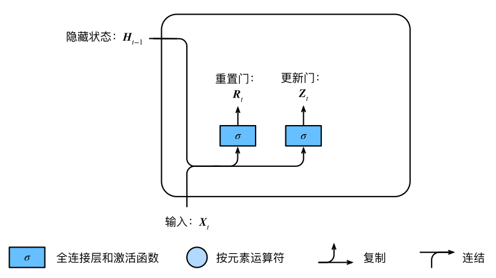
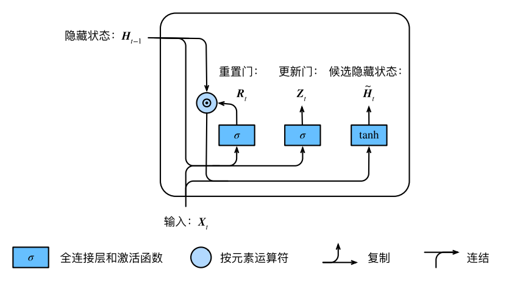
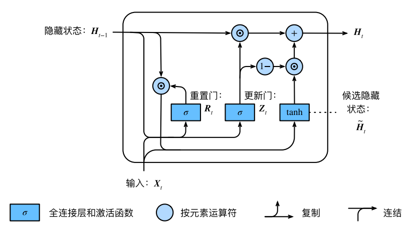

#  什么是GRU

在循环神经⽹络中的梯度计算⽅法中，我们发现，当时间步数较⼤或者时间步较小时，**循环神经网络的梯度较容易出现衰减或爆炸。虽然裁剪梯度可以应对梯度爆炸，但⽆法解决梯度衰减的问题。**通常由于这个原因，循环神经⽹络在实际中较难捕捉时间序列中时间步距离较⼤的依赖关系。 

**门控循环神经网络（gated recurrent neural network）的提出，正是为了更好地捕捉时间序列中时间步距离较大的依赖关系。**它通过可以学习的门来控制信息的流动。其中，门控循环单元（gatedrecurrent unit，GRU）是⼀种常用的门控循环神经网络。

# 门控循环单元

## 重置门和更新门

GRU它引入了**重置门（reset gate）和更新门（update gate）**的概念，从而修改了循环神经⽹络中隐藏状态的计算方式。 

门控循环单元中的重置门和更新门的输入均为当前时间步输入$X_t$与上⼀时间步隐藏状态$H_{t-1}$输出由激活函数为sigmoid函数的全连接层计算得到。 如下图所示：

具体来说，假设隐藏单元个数为h，给定时间步 t 的小批量输入$X_{t} \in \mathbb{R}^{n * d}$（样本数为n，输入个数为d）和上⼀时间步隐藏状态$H_{t-1} \in \mathbb{R}^{n * h}$。重置门$R_t \in \mathbb{R}^{n * h}$和更新门$Z_t \in \mathbb{R}^{n * h}$的计算如下：

$$
\begin{array}{l}
R_{t}=\sigma\left(X_{t} W_{x r}+H_{t-1} W_{h r}+b_{r}\right) \\
Z_{t}=\sigma\left(X_{t} W_{x z}+H_{t-1} W_{h z}+b_{z}\right)
\end{array}
$$
sigmoid函数可以将元素的值变换到0和1之间。因此，重置门$R_t$和更新门$Z_t$中每个元素的值域都是[0*,* 1]。

## 候选隐藏状态

接下来，门控循环单元将计算候选隐藏状态来辅助稍后的隐藏状态计算。我们将当前时间步重置门的输出与上⼀时间步隐藏状态做按元素乘法（符号为*⊙*）。如果重置门中元素值接近0，那么意味着重置对应隐藏状态元素为0，即丢弃上⼀时间步的隐藏状态。如果元素值接近1，那么表示保留上⼀时间步的隐藏状态。然后，将按元素乘法的结果与当前时间步的输入连结，再通过含激活函数tanh的全连接层计算出候选隐藏状态，其所有元素的值域为[-1,1]。

 

具体来说，时间步 t 的候选隐藏状态$\tilde{H} \in \mathbb{R}^{n * h}$的计算为：

$$
\tilde{H}_t=tanh(X_tW_{xh}+(R_t⊙H_{t-1})W_{hh}+b_h))
$$
从上面这个公式可以看出，重置门控制了上⼀时间步的隐藏状态如何流入当前时间步的候选隐藏状态。而上⼀时间步的隐藏状态可能包含了时间序列截至上⼀时间步的全部历史信息。因此，**重置门可以用来丢弃与预测无关的历史信息**。

## 隐藏状态

最后，时间步$t$的隐藏状态的$H_t \in \mathbb{R}^{n * h}$计算使用当前时间步的更新门$Z_t$来对上⼀时间步的隐藏状态$H_{t-1}$和当前时间步的候选隐藏状态$\tilde{H}_t$做组合：

 

$$
H_{t}=Z_{t} \odot H_{t-1}+\left(1-Z_{t}\right) \odot \tilde{H}_{t}
$$
值得注意的是，**更新门可以控制隐藏状态应该如何被包含当前时间步信息的候选隐藏状态所更新，**如上图所⽰。假设更新门在时间步$t'$到$t(t'<t)$之间⼀直近似1。那么，在时间步$t'$到$t$间的输入信息⼏乎没有流入时间步 t 的隐藏状态$H_t$实际上，这可以看作是较早时刻的隐藏状态$H_{t-1}$直通过时间保存并传递⾄当前时间步 t。这个设计可以应对循环神经⽹络中的梯度衰减问题，并更好地捕捉时间序列中时间步距离较⼤的依赖关系。 

我们对门控循环单元的设计稍作总结：

- 重置门有助于捕捉时间序列⾥短期的依赖关系。
- 更新门有助于捕捉时间序列⾥⻓期的依赖关系。

# 代码实现

参见《动手学深度学习》

