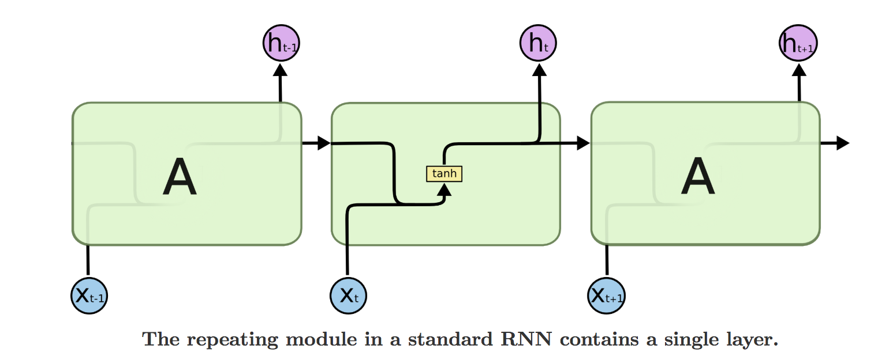
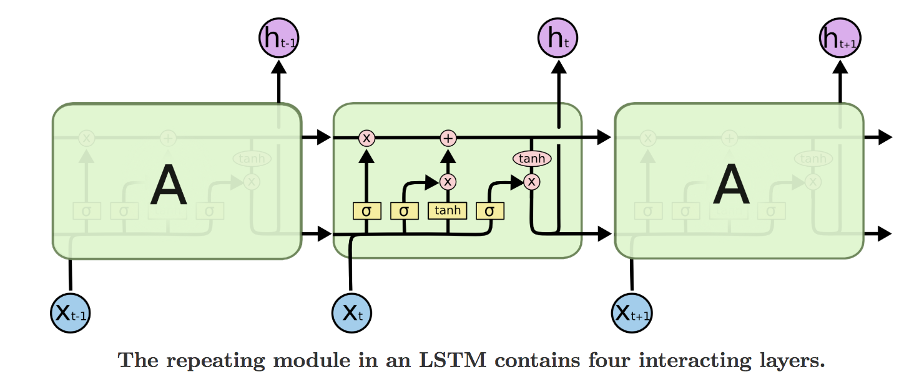
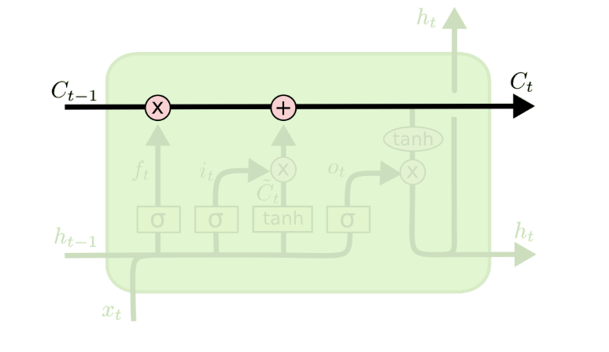
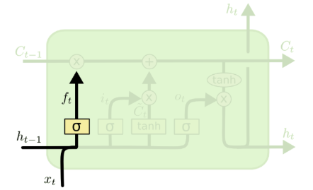
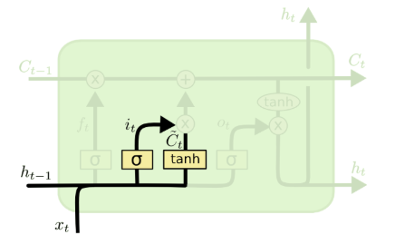
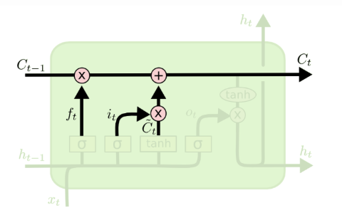
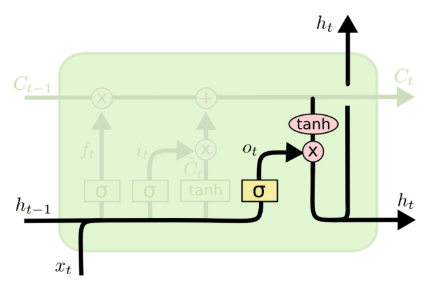
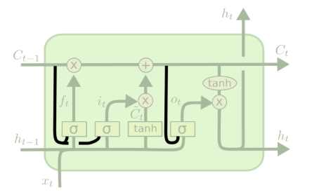
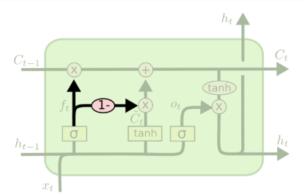
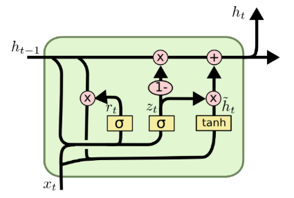

Long Short-term Memory，长短期记忆网络  [github](http://colah.github.io/posts/2015-08-Understanding-LSTMs/)

# LSTM的提出

在LSTM提出之前，RNN的训练基于BPTT(Back-Propagation Through Time)或者RTRL(Real Time Recurrent Learning)。通过这两种方式对RNN进行训练时，当误差在序列内进行传播时，会出现梯度消失或者爆炸的情况。

当出现梯度消失时，在训练时，权重会出现摇摆和震荡；梯度消失使得训练会耗费大量的时间，甚至干脆就停滞。

基于这样的情况，两位大神Sepp Hochreiter和Jürgen Schmidhuber提出了LSTM。

我们先回顾一下RNN的误差传递公式：
$$
\frac{\partial L_{\mathrm{t}}}{\partial U}=\sum_{k=1}^{t} \frac{\partial L_{\mathrm{t}}}{\partial o_{t}} \frac{\partial o_{\mathrm{t}}}{\partial s_{t}} \coprod_{m=k+1}^{t}\left(\frac{\partial s_{\mathrm{m}}}{\partial s_{m-1}}\right) x_{k}
$$
一个很简单的想法，如果误差在不同时刻相互连接的RNN单元之间，传递的是一个常量，即令下式是一个常量。其中$f$为激活函数。

$$
\frac{\partial s_{m+1}}{\partial s_{m}}=f^{\prime} W
$$

这样，梯度消失或者爆炸的问题是不是就可以解决了？

因此，Sepp Hochreiter和Jürgen Schmidhuber提出了CEC(Constant Error Carrousel)，这也是LSTM的核心特点。

所谓CEC，就是令

$$
\frac{\partial \mathbf{s}_ {\mathrm{m}+1}}{\partial s_ {m}}=\mathrm{f}^{\prime}\left(U x_{t-1}+W s_ {m}\right) W=1
$$

Sepp Hochreiter和Jürgen Schmidhuber指出可以选择恒等函数作为激活函数，并且令$w_j$,$j=1$便可满足上式，保证梯度在误差随时间传递之后不至于出现梯度消失或者梯度爆炸。这个想法很简单和朴素，因此Sepp Hochreiter和Jürgen Schmidhuber称之为Naive Approach。

但是对RNN仅仅是做这样的修改也还会有一些问题，不管是输入权重还是输出权重，在更新都既要考虑“记住”前面时刻的内容；又要考虑不要让前面时刻的内容干扰到当前时刻的输入，这种矛盾会使训练变得困难。因此两位大神针对这个问题，设计新的模型结构，下面介绍LSTM的模型结构。

# LSTM的内部结构

传统的RNN的结构，内部有一个tanh层

LSTM和传统RNN结构类似，然而内部结构却有所不同

水平线就是LSTM中的**状态信息**，可以把这个理解为记忆(memory)。 

细胞状态$C_t$横向穿过，看起来像一条传送带，只是经过了少量的线性变化，因此状态容易保持下来。

$$
\begin{align}
f_{t} &=\sigma\left(W_{f} \cdot\left[h_{t-1}, x_{t}\right]+b_{f}\right) \\
 i_{t} &=\sigma\left(W_{i} \cdot\left[h_{t-1}, x_{t}\right]+b_{i}\right) \\ \tilde{C}_{t} &=\tanh \left(W_{C} \cdot\left[h_{t-1}, x_{t}\right]+b_{C}\right) \\
 C_{t} &=f_{t} * C_{t-1}+i_{t} * \tilde{C}_{t} \\
o_{t} &=\sigma\left(W_{o}\left[h_{t-1}, x_{t}\right]+b_{o}\right) \\ h_{t} &=o_{t} * \tanh \left(C_{t}\right) 
\end{align}
$$

# LSTM中有三种门

## 遗忘门

$$
f_{t}=\sigma\left(W_{f} \cdot\left[h_{t-1}, x_{t}\right]+b_{f}\right)
$$

可以看到这里的$f_t$由输入的$x_t$和$h_{t−1}$得到，用来控制$C_{t−1}$中的信息的**遗忘程度**。$f_t$中的每个值都是0-1中的一个数，下界0代表完全遗忘，上界1代表完全不变。

## 输入门

信息更新门，决定了细胞状态$C_t$，它分为两个部分。

1. 第一步，根据输入信息，用tanh产生该时刻需要更新到细胞状态中的**内容**，用sigmoid函数产生更新的**比例**。

$$
\begin{aligned} i_{t} &=\sigma\left(W_{i} \cdot\left[h_{t-1}, x_{t}\right]+b_{i}\right) \\ \tilde{C} _{t} &=\tanh \left(W _{C} \cdot\left[h _{t-1}, x _{t}\right]+b _{C}\right) \end{aligned}
$$

遗忘门决定了历史状态信息的遗忘程度，那么输入门的作用就是往状态信息中**添加新东西**。同样，由输入的$x_t$和$h_{t−1}$得到当前的$i_t$用以控制新状态信息的**更新程度**。这里**新状态信息**$\tilde{C_t}$也是通过输入的$x_t$和$h_{t−1}$计算得出。

2. 第二步，将需要更新的内容更新到细胞状态中去，生成$C_t$。

$$
C_{t}=f_{t} * C_{t-1}+i_{t} * \tilde{C}_{t}
$$

那么当前新的状态信息$C_t$就很显然可以通过上式计算得出，通俗的说就是遗忘一些旧信息，更新一些新信息进去。

## 输出门

根据新的细胞状态和输入信息，产生新的输出$h_t$。

$$
\begin{aligned} o_{t} &=\sigma\left(W_{o}\left[h_{t-1}, x_{t}\right]+b_{o}\right) \\ h_{t} &=o_{t} * \tanh \left(C_{t}\right) \end{aligned}
$$

类似地，根据$x_t$和$h_{t−1}$得出$o_t$用以控制哪些信息需要作为输出。

`概括一下：`

LSTM在原本RNN的基础上增加了CEC的内容，CEC保证了误差以常数的形式在网络中流动，这部分通过引入细胞状态C来体现。并且，为了解决输入和输出在参数更新时的矛盾，在CEC的基础上添加3个门使得模型变成非线性的，就可以调整不同时序的输出对模型后续动作的影响。

1. 状态信息$C_t$的依赖于遗忘门$f_t$和输入门$i_t$ 
2. 遗忘门$f_t$和输入门$i_t$依赖于输入参数中的$h_{t−1}$  
3. 而当前隐层输出$h_t$依赖于$C_t$  

# LSTM局限性

LSTM提出之后，在语音处理、机器翻译、实体识别等NLP领域迅速取得很好的效果，在工业界获得很好的应用。但其也有一定的局限性，下面我们做一下介绍。

1. 相较于RNN，LSTM的网络结构复杂很多，因为引入了更多的权重参数，这增加了计算的复杂度。
2. 不管是RNN，还是它的衍生LSTM等，都需要随着时间推移进行顺序处理。因此对于输入序列的处理效率很低。
3. 特征提取能力不强，$t$时刻的输入不能提取到$t$时刻之后序列信息的内容。这点在transformer出来之后，体现的尤为明显。

# LSTM的一些变种

## 增加peephole connections

$$
\begin{aligned} f_{t} &=\sigma\left(W_{f} \cdot\left[C_{t-1}, h_{t-1}, x_{t}\right]+b_{f}\right) \\ i_{t} &=\sigma\left(W_{i} \cdot\left[C_{t-1}, h_{t-1}, x_{t}\right]+b_{i}\right) \\ o_{t} &=\sigma\left(W_{o} \cdot\left[\boldsymbol{C}_{t}, h_{t-1}, x_{t}\right]+b_{o}\right) \end{aligned}
$$
图中所示，在所有的门之前都与状态线相连，使得状态信息对门的输出值产生影响。但一些论文里只是在部门门前加上这样的连接，而不是所有的门。

## 耦合遗忘门和输入门

$$
C_{t}=f_{t} * C_{t-1}+\left(1-f_{t}\right) * \tilde{C}_{t}
$$
这一种变体是将遗忘门和输入门耦合在一起，简单来说就是遗忘多少就更新多少新状态，没有遗忘就不更新状态，全部遗忘那就新状态全部更新进去。

## GRU

循环门单元（Gated Recurrent Unit，GRU）,它组合了遗忘门和输入门到一个单独的**更新门**中。它也合并了cell state和hidden state，并且做了一些其他的改变。结果模型比标准LSTM模型更简单，并且正越来越受欢迎。

$$
\begin{array}{l}{z_{t}=\sigma\left(W_{z} \cdot\left[h_{t-1}, x_{t}\right]\right)} \\ {r_{t}=\sigma\left(W_{r} \cdot\left[h_{t-1}, x_{t}\right]\right)} \\ {\tilde{h}_{t}=\tanh \left(W \cdot\left[r_{t} * h_{t-1}, x_{t}\right]\right)} \\ {h_{t}=\left(1-z_{t}\right) * h_{t-1}+z_{t} * \tilde{h}_{t}}\end{array}
$$
首先介绍GRU的两个门，分别是**重置门**（reset gate） $r_t$ 和**更新门**（update gate） $z_t$ ，计算方法和LSTM中门的计算方法一致：
$$
\begin{array}{l}

{r_{t}=\sigma\left(W_{r} \cdot\left[h_{t-1}, x_{t}\right]\right)} \\ 
{z_{t}=\sigma\left(W_{z} \cdot\left[h_{t-1}, x_{t}\right]\right)} \\
\end{array}
$$

然后是计算**候选隐藏层**（candidate hidden layer）$\tilde{h}_{t}$ ，这个候选隐藏层和LSTM中的$\tilde{c}_{t}$是类似，可以看成是当前时刻的新信息，其中重置门$r_t$用来控制需要**保留**多少之前的记忆，比如如果$r_t$为0，那么 $\tilde{h}_{t}$ 只包含当前词的信息，重置门可以用来丢弃与预测无关的历史信息：
$$
\begin{array}{l}
{\tilde{h}_{t}=\tanh \left(W \cdot\left[r_{t} * h_{t-1}, x_{t}\right]\right)} 
\end{array}
$$
最后$z_t$控制需要从前一时刻的隐藏层$h_{t-1}$中**遗忘**多少信息，需要**加入**多少当前时刻的隐藏层信息$\tilde{h}_{t}$，最后得到$h_{t}$，直接得到最后输出的隐藏层信息， 需要注意这里与LSTM的区别是GRU中没有output gate：
$$
\begin{array}{l}
{h_{t}=\left(1-z_{t}\right) * h_{t-1}+z_{t} * \tilde{h}_{t}}
\end{array}
$$
这是目前比较流行的LSTM变种，不仅将遗忘门和输入门统一为更新门，而且将cell state和hidden state也给合并了。

# BI-LSTM

# 多层LSTM

多层LSTM是将LSTM进行叠加，其优点是能够在高层更抽象的表达特征，并且减少神经元的个数，增加识别准确率并且降低训练时间。

# 答题

1. LSTM结构推导，为什么比RNN好？

推导forget gate，input gate，cell state， hidden information等的变化；因为LSTM有进有出且当前的cell informaton是通过input gate控制之后叠加的，RNN是叠乘，因此LSTM可以防止梯度消失或者爆炸。
