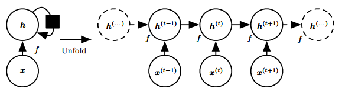
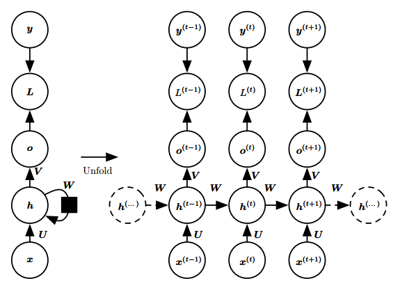
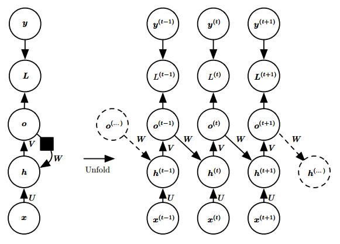
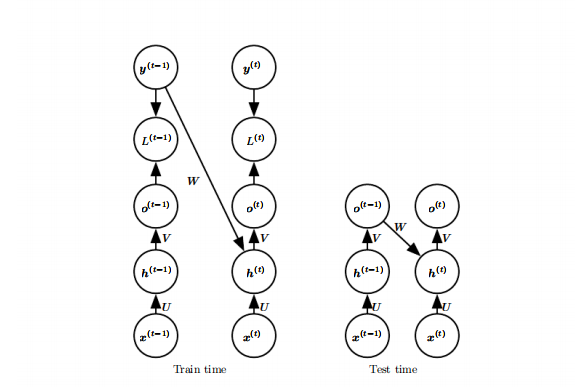
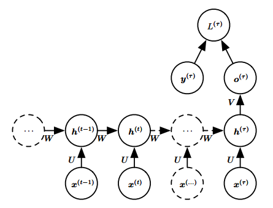
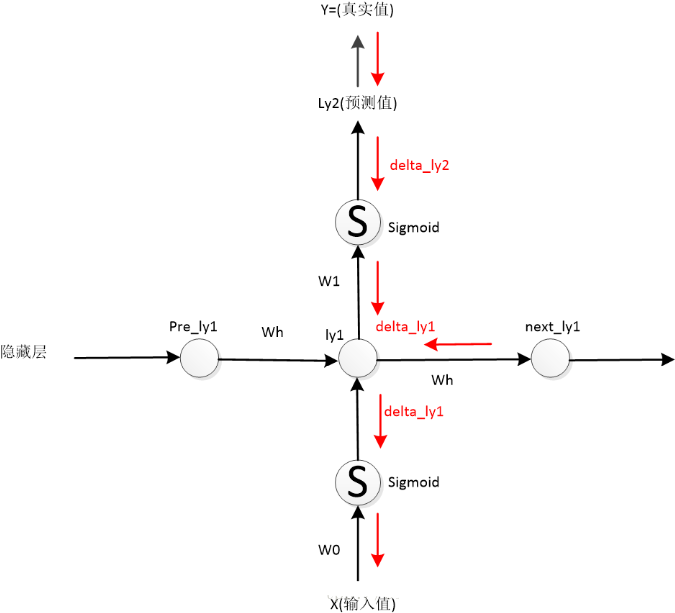
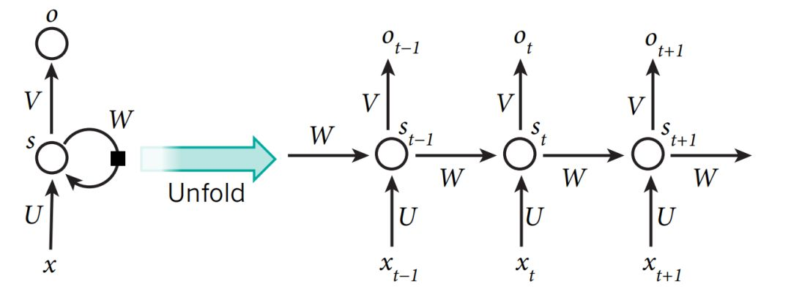
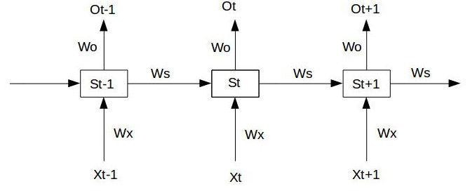

# RNN 的基本结构

RNN 本质上是一个**递推函数**：
$$
h^{(t)}=f\left(h^{(t-1)} ; \theta\right)
$$
考虑当前输入$x(t)$：
$$
h^{(t)}=f\left(h^{(t-1)}, x^{(t)} ; \theta\right)
$$

以上计算公式可展开为如下**计算图**（无输出单元）：

RNN的**前向传播**公式：
$$
\begin{align}
h^{(t)}=f\left(W \cdot\left[h^{(t-1)} ; x^{(t)}\right]+b\right) 
\end{align}
$$
一般$h(0)$会初始化为 0 向量；并使用 $tanh$作为激活函数$f$。

# RNN常见的几种设计模式

**1. 每个时间步都有输出，且隐藏单元之间有循环连接**

即通常所说的RNN，这种结构会在每个时间步产生一个输出，所以通常用于“**Seq2Seq**”任务中，比如序列标注、机器翻译等。这些任务通常都比较复杂。

$$
h^{(t)}=\tanh(U_{h} x^{(t)}+W_{h}h^{(t-1)}+b_{h})
$$

$$
o^{(t)}=\operatorname{softmax}\left(V_{y} h^{(t)}+b_{y}\right)
$$

1. **隐藏**到**隐藏**的循环连接由权重矩阵 $W$ 参数化。这里是当前时间步和上一时间步之间的信息传递。
2. **输入**到**隐藏**的循环连接由权重矩阵 $U$ 参数化。这里是当前时间步的外部信号(外部输入)到隐藏单元(隐藏层的信号)的转换。
3. **隐藏**到**输出**的循环连接由权重矩阵 $V$ 参数化。这里是当前时间步的隐藏单元到输出的转换。
4. **损失**$L$衡量**输出** $o$ 和训练目标 $y$ 的距离，不同问题在一步采用的方式可能并不相同。

**2. 每个时间步都有输出，但是隐藏单元之间没有循环连接，只有当前时刻的输出到下个时刻的隐藏单元之间有循环连接**

这种模型的表示能力弱于第一种，但是它**更容易训练**，因为每个时间步可以与其他时间步单独训练，从而实现**并行化**，具体来说，就是使用 $y(t)$代替$ o(t)$输入下一个时间步。

$$
h^{(t)}=\tanh(U_{h} x^{(t)}+W_{h}o^{(t-1)}+b_{h})
$$

$$
o^{(t)}=\operatorname{softmax}\left(V_{y} h^{(t)}+b_{y}\right)
$$

对比上图的结构，上图是将过去的隐藏表示 $h$ 传播到未来，该图中是将输出值 $o$ 传播到未来。$o$ 可能会缺乏过去的重要信息，除非它是高维的且内容丰富。这种结构的RNN没有上个结构那么强大，但他更容易训练，因为每个时间步可以和其他时间步分离训练。消除隐藏到隐藏的循环的优点在于，任何基于比较时刻 $t$ 的预测和时刻 $t$ 的训练目标的损失函数中的时间步都解耦了。

**时间步解耦**：

1. 第一种隐藏到隐藏的循环连接，我们在计算时刻 $t$ 的损失函数时，需要用到 $h(t-1)$, 即计算当前时刻t的损失必须先计算前一时刻的 $h$，这使得隐藏单元之间存在循环的网络不能并行化，只能一前一后的计算，虽然这种结构更强大，但它的计算代价很大。
2. 第二种由输出到隐藏的循环连接的模型可以通过导师驱动过程进行训练。导师驱动过程适用于输出与下一时间步的隐藏之间存在循环连接的RNN，在训练的时候我们不再是将输出 $o$ 反馈到 $h$，而是将已知的正确值 $y$ (label)反馈给$h$，如图所示：

左图是训练过程，在时刻 $t$ 接收时刻 $t-1$ 的真实值 $y(t)$ 作为输入。参考其他文章，解释的是我们的 $o$ 其实就是拟合真实值 $y$ 的，直接用 $y$ 代替 $o$ 作为输入，$y$ 是直接知道的，这样的话我们计算 $t$ 时刻就不再依赖于 $t-1$ 时刻的计算。

右图是测试过程，当模型部署好之后真实值 $y$ 往往是未知的，在这种情况下还是用模型的输出 $o$ 来近似真实值 $y$，并反馈给 $h$。

模型中存在输出到隐藏的循环连接就可以使用**导师驱动过程**。模型中存在隐藏到隐藏的循环连接就需要使用**BPTT**。模型中同时存在上面两种结构就可以**同时使用**导师驱动过程和BPTT。

如果测试的时候采用的是右图的结构，即网络的输出反馈作为输入，只使用导师驱动过程就会产生问题，应当采用一些策略同时使用导师驱动过程和普通的(网络的输出反馈作为输入)的过程进行训练。

**3. 隐藏单元之间有循环连接，但只有最后一个时间步有输出**

忽略模式1中的中间输出，即可得到这种网络，这种网络一般用于**概括序列**。具体来说，就是产生**固定大小的表示**，用于下一步处理，在一些“**Seq2One**”中简单任务中，这种网络用的比较多；因为这些任务只需要关注序列的全局特征。

# RNN反向传播

$$
\begin{align}
\mathbf{s}_{t} &=f\left(U{*} x_{t}+W{*} s_{t-1}\right) \\
\mathbf{o}_{t} & =\mathbf{g}\left(V^{*} s_{t}\right)
\end{align}
$$
RNN的正向传播过程，就是通过输入数据$x_t$，求该时刻的RNN单元状态$s_t$以及输出$o_t$的过程。可以看到，不同时刻的数据$x_t$与上一时刻的状态$s_{t−1}$，从输入层输入，经过一系列运算(激活函数)之后，得到该时刻的状态$s_t$，$s_t$再经过矩阵运算得到该时刻的输出$o_t$，同时$t$时刻的状态$s_t$会传给下一时刻的输入层。通过这种方式，任意时刻的序列输入都会包含前面所有时刻的状态信息，就实现了**记忆**的目的，实际就是一种残差的结构。需要注意的是，这里所有的RNN结构单元是权重共享的，用大白话说，就是只有一个RNN单元。

$\mathbf{s}_{t}=f\left(U{*} x_{t}+W{*} s_{t-1}\right)$，$U$和和$W$是权重参数，是权重参数，$f$是激活函数，激活函数有$sigmoid$、$relu$以及$tanh$等。

$\mathbf{o}_{t}=\mathbf{g}\left(V^{*} s_{t}\right)$，$V$是权重参数，$g$是输出函数，因为通常是预测类别，所以一般是$softmax$。

反向传播的过程其实就是更新参数$U$，$W$，$V$的过程，用$L_t$表示$t$时刻的模型损失，则输入完一个序列后的总损失值为：
$$
L=\sum_{t=1}^{T} {L}_{t}
$$

## **参数$V$的更新**

根据偏导公式
$$
\frac{\partial L}{\partial V}=\sum_{t=1}^{T} \frac{\partial L_{t}}{\partial V}=\sum_{t=1}^{T} \frac{\partial L_{t}}{\partial o_{t}} \frac{\partial o_{t}}{\partial V}
$$
损失函数通常为交叉熵，因此：
$$
\frac{\partial L}{\partial V}=\sum_{t=1}^{T} \frac{\partial L_{t}}{\partial o_{t}} \frac{\partial o_{t}}{\partial V}=\sum_{t=1}^{T}\left(\hat{o}_{t}-o_{t}\right)\left(s_{t}\right)^{T}
$$

## **W和U的更新：**

引入一个中间变量$\delta_{\mathrm{t}}=\frac{\partial L}{\partial s_{t}}$，目标是要得到一个递推公式，用$\delta_{t+1}$来表示$\delta_{t}$，这里激活函数用的是tanh函数，
$$
\begin{align}
\delta_{\mathrm{t}}&=\frac{\partial L}{\partial o_{t}} \frac{\partial o_{t}}{\partial s_{t}}+\frac{\partial L}{\partial \mathrm{s}_{t+1}} \frac{\partial s_{t+1}}{\partial \mathrm{s}_{t}} \\
&=V^{T}\left(\hat{o}_{t}-o_{t}\right)+W^{T} \delta_{\mathrm{t}+1} \operatorname{diag}\left(1-s_{t+1}^{2}\right)
\end{align}
$$
diag为除了对角元素均为0的对角阵，最后时刻的误差可以表示为：
$$
\delta_{\mathrm{T}}=\frac{\partial L}{\partial o_{T}} \frac{\partial o_{T}}{\partial s_{T}}=V^{T}\left(\hat{o}_{T}-o_{T}\right)
$$

这样就可以通过$\delta_T$一步一步得到所有时刻的误差。

通过误差得到$W$和$U$的梯度：
$$
\frac{\partial L}{\partial W}=\sum_{t=1}^{T} \frac{\partial L}{\partial \mathbf{s}_{t}} \frac{\partial s_{t}}{\partial W} \sum_{t=1}^{T} \operatorname{diag}\left(1-s_{t}^{2}\right) \delta^{t}\left(s_{t-1}\right)^{T_{r}}
$$

$$
\frac{\partial L}{\partial U}=\sum_{t=1}^{T} \frac{\partial L}{\partial \mathbf{s}_{t}} \frac{\partial s_{t}}{\partial U} \sum_{t=1}^{T} \operatorname{diag}\left(1-s_{t}^{2}\right) \delta^{t}\left(x_{t}\right)^{T r}
$$

**传播过程：**

1. 正向传播，求得所有时刻的$x_t$，$o_t$，$s_t$
2. 根据梯度公式，求V的梯度
3. 求得T时刻的误差$\delta_T$
4. 根据误差的递推公式，求得所有时刻的误差$\delta_1,\delta_2,...,\delta_T$
5. 根据梯度公式，和上述误差值求得W的梯度
6. 根据梯度公式，和上述误差值求得U的梯度
7. 更新权重参数

# RNN 相比前馈网络/CNN 的特点

**前馈网络/CNN 处理序列数据时存在的问题：**

1. 一般的**前馈网络**，通常接受一个**定长**向量作为输入，然后输出一个定长的表示；它需要一次性接收所有的输入，因而忽略了序列中的顺序信息；
2. **CNN** 在处理**变长序列**时，通过**滑动窗口+池化**的方式将输入转化为一个**定长的向量表示**，这样做可以捕捉到序列中的一些**局部特征**，但是很难学习到序列间的**长距离依赖**。

**RNN 处理时序数据时的优势：**

1. RNN 很适合处理序列数据，特别是带有**时序关系**的序列，比如文本数据。
2. RNN 把**每一个时间步**中的信息编码到**状态变量**中，使网络具有一定的记忆能力，从而更好的理解序列信息。
3. 由于RNN具有对序列中时序信息的刻画能力，因此在处理序列数据时往往能得到更准确的结果。

一个长度为T的RNN展开后，可以看做是一个T层的前馈网络，**同时每一层都可以有**新的输入**。通过对当前输入 $x_t$ 和上一层的隐状态 $h_{t-1}$ 进行编码，**第 t 层的隐状态 $h_t$ 记录了序列中前 t个输入的信息。

普通的前馈网络就像火车的**一节车厢**，只有一个入口，一个出口；而 RNN 相当于**一列火车**，有多节车厢接收**当前时间步**的输入信息并输出**编码后的状态信息**（包括**当前的状态和之前的所有状态**）。**最后一层隐状态 $x_T$** 编码了整个序列的信息，因此可以看作**整个序列的压缩表示**。

常见的文本分类任务中，将 $h_T$ 通过一个 Softmax 层，即可获得作为每个类别的概率：
$$
h_{t}=f\left(U x_{t}+W h_{t-1}\right)
$$

$$
y=g\left( h_{t}\right)
$$

**其中**：

1. **U**为输入层到隐藏层的权重矩阵。
2. **W**为隐藏层从上一时刻到下一时刻的状态转移权重矩阵。
3. **f**为隐藏层激活函数，通常可选 tanh或 ReLU。
4. **g**为输出层激活函数，可以采用 `Softmax`、`Sigmoid` 或线性函数（回归任务）。
5. 通常 $h_{-1}$初始化为 0 向量。

# RNN中的参数共享

在RNN中$W_o,W_x,W_s,b$ 都是共享的，使用参数共享的原因如下：

1. RNN对输入序列长度不可预知，为了实现可变长度，因此权重共享。如果每步一个权重，不同长度的输入权重的个数也不一样。
2. 减少参数数量，从而节省内存，时间。
3. 保证每个时间下面的$X_t$和$S_t$都是来自同一种变换方式，假设每一步的信息都是平等的。

参考：[知乎问题为什么RNN每个时间步要用相同的W](https://www.zhihu.com/question/319809704)

# RNN的梯度消失/梯度爆炸

假设时间序列只有三段，$S_0$是给定值，神经元没有激活函数，则RNN的前向传播过程如下：
$$
S_1=W_xX_1 + W_sS_0+b_1  \quad O_1=W_oS_1+b_2
$$

$$
S_2=W_xX_2 + W_sS_1 + b_1 \quad O_2=W_oS_2+b_2
$$

$$
S_3=W_xX_3 + W_sS_2 + b_1 \quad O_3=W_oS_3+b_2
$$

假设在t=3时刻，损失函数为$L_3=\frac{1}{2}(Y_3-O_3)$，则对于一次训练任务的损失函数为$L=\sum_{t=0}^T L_t$。

只对t=3时刻的损失函数对$W_x,W_o,W_s$　求偏导：
$$
\frac{\partial L_3}{\partial W_o}=\frac{\partial L_3}{\partial O_3} \frac{\partial O_3}{\partial W_O}
$$

$$
\frac{\partial L_3}{\partial W_x}=\frac{\partial L_3}{\partial O_3}\frac{\partial O_3}{\partial S_3}\frac{\partial S_3}{\partial W_x}+\frac{\partial L_3}{\partial O_3}\frac{\partial O_3}{\partial S_3}\frac{\partial S_3}{\partial S_2}\frac{\partial S_2}{\partial W_x} + \frac{\partial L_3}{\partial O_3}\frac{\partial O_3}{\partial S_3}\frac{\partial S_3}{\partial S_2}\frac{\partial S_2}{\partial S_1}\frac{\partial S_1}{\partial W_x}
$$

$$
\frac{\partial L_3}{\partial W_s}=\frac{\partial L_3}{\partial O_3}\frac{\partial O_3}{\partial S_3}\frac{\partial S_3}{\partial W_s}+\frac{\partial L_3}{\partial O_3}\frac{\partial O_3}{\partial S_3}\frac{\partial S_3}{\partial S_2}\frac{\partial S_2}{\partial W_s} + \frac{\partial L_3}{\partial O_3}\frac{\partial O_3}{\partial S_3}\frac{\partial S_3}{\partial S_2}\frac{\partial S_2}{\partial S_1}\frac{\partial S_1}{\partial W_s}
$$

对于$W_o$求偏导并没有长期依赖，但是对于$Wx$，$W_s$求偏导，会根据时间序列产生长期依赖。因为$S_t$随着时间序列向前传播，而$S_t$又是$W_x,W_s$的函数。

根据上述求偏导的过程，我们可以得出任意时刻对$W_x,W_s$求偏导的公式：
$$
\frac{\partial L_{t}}{\partial W_{x}}=\sum_{k=0}^{t} \frac{\partial L_{t}}{\partial O_{t}} \frac{\partial O_{t}}{\partial S_{t}}\left(\prod_{j=k+1}^{t} \frac{\partial S_{j}}{\partial S_{j-1}}\right) \frac{\partial S_{k}}{\partial W_{x}}
$$

$$
\frac{\partial L_{t}}{\partial W_{s}}=\sum_{k=0}^{t} \frac{\partial L_{t}}{\partial O_{t}} \frac{\partial O_{t}}{\partial S_{t}}\left(\prod_{j=k+1}^{t} \frac{\partial S_{j}}{\partial S_{j-1}}\right) \frac{\partial S_{k}}{\partial W_{s}}
$$

如果加上激活函数
$$
S_j=tanh(W_xX_j+ W_sS_{j-1}+b_1)
$$
则
$$
\prod_{j=k+1}^{t} \frac{\partial S_{j}}{\partial S_{j-1}}=\prod_{j=k+1}^{t} \tanh ^{\prime} W_{s}
$$

训练过程大部分情况下$tanh$的导数是小于1的，因为很少情况下会出现$W_xX_t + W_sS_{t-1}+b_1=0$

- 如果$W_s$也是一个大于0小于1的值，则当$t$很大时$\prod _{j=k+1}^ttanh’W_s$就会趋近于0；
- 同理，当Ws很大时，$\prod _{j=k+1}^ttanh’W_s$就会趋近于无穷，这就是RNN中梯度消失和爆炸的原因。

梯度消失和爆炸的根本原因就是$\prod_{j=k+1}^{t} \frac{\partial S_{j}}{\partial S_{j-1}}$部分，要消除这种情况就需要把这一坨在求偏导的过程中去掉，在LSTM中一定程度解决了这个问题。

参考：[RNN梯度消失/爆炸原因](https://zhuanlan.zhihu.com/p/28687529)

# NLP常用评价指标

## **困惑度 (Perplexity, PPX)**

在信息论中，perplexity用于度量一个**概率分布**或**概率模型**预测样本的好坏程度。

**概率分布**（离散）的困惑度：
$$
2^{H(p)}=2^{-\sum_{x} p(x) \log _{2} p(x)}
$$
其中 `H(p)` 即**信息熵**。

**概率模型**的困惑度：
$$
b^{-\frac{1}{N} \sum_{i=1}^{N} \log _{b} q\left(x_{i}\right)}
$$
通常b取2。

**指数部分**也可以是**交叉熵**的形式，此时困惑度相当于交叉熵的指数形式：
$$
2^{H(\tilde{p}, q)}=2^{-\sum_{x} \tilde{p}(x) \log _{2} q(x)}
$$
其中  $\tilde{p}$为**测试集**中的经验分布——$\tilde{p}(x) = n/N$，其中 `n` 为 x 的出现次数，N 为测试集的大小。

在 **NLP** 中，困惑度常作为**语言模型**的评价指标：
$$
\begin{align}
\operatorname{PPX}\left(W_{\text {test}}\right) 
&=2^{-\sum_{i=1}^{|V|} \tilde{p}\left(w_{i}\right) \log _{2} q\left(w_{i}\right)} \\
&=2^{-\sum_{i=1}^{|V|} \frac{\operatorname{cnt}\left(w_{i}\right)}{N} \log _{2} q\left(w_{i}\right)}
 \end{align}
$$
直观来说，就是下一个**候选词数目**的期望值。

## **BLEU**

一种机器翻译评价准则，计算公式：
$$
\mathrm{BLEU}=\mathrm{BP} \cdot \exp \left(\sum_{n=1}^{N} w_{n} \log p_{n}\right)
$$
其中
$$
\mathrm{BP}=\left\{\begin{array}{ll}{1} & {\text { if } c>r} \\ {e^{(1-r / c)}} & {\text { if } c \leq r}\end{array}\right.
$$

$$
p_{n}=\frac{\sum_{\mathcal{C} \in Candidates}\sum_{n-g r a m \in \mathcal{C}} \text { Count }_{c l i p}(n-g r a m)}{\sum_{\mathcal{C}’ \in Candidates}\sum_{n-g r a m‘ \in \mathcal{C}’} \text { Count }_{c l i p}(n-g r a m‘)}
$$
为了计算方便，会加一层 `log`：
$$
\log \mathrm{BLEU}=\min \left(1-\frac{r}{c}, 0\right)+\sum_{n=1}^{N} w_{n} \log p_{n}
$$
通常 `N=4, w_n=1/4`。

