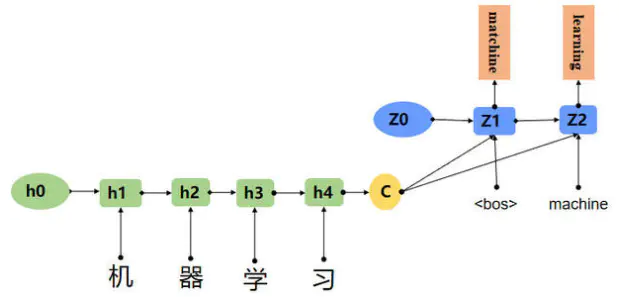
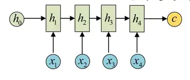
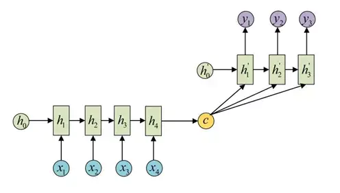
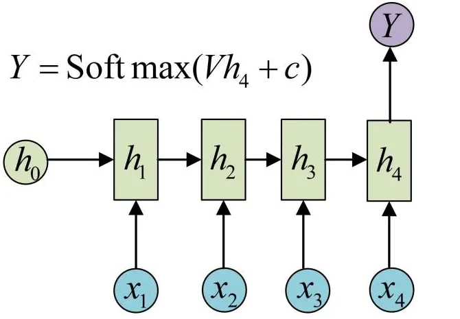
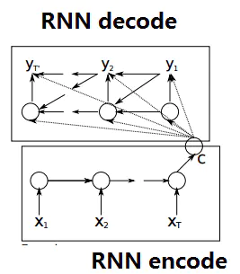

# seq2seq序列到序列模型

本文从RNN角度出发，主要是讲述seq2seq模型的原理。

## Seq2Seq模型简介

Seq2Seq模型是输出的长度不确定时采用的模型，这种情况一般是在机器翻译的任务中出现，将一句中文翻译成英文，那么这句英文的长度有可能会比中文短，也有可能会比中文长，所以输出的长度就不确定了。如下图所，输入的中文长度为4，输出的英文长度为2。

seq2seq模型

在网络结构中，输入一个中文序列，然后输出它对应的中文翻译，输出的部分的结果预测后面，根据上面的例子，也就是先输出“machine”，将"machine"作为下一次的输入，接着输出"learning",这样就能输出任意长的序列。

机器翻译、人机对话、聊天机器人等等，这些都是应用在当今社会都或多或少的运用到了我们这里所说的Seq2Seq。

举个简单的例子，当我们使用机器翻译时：输入(Hello) --->输出(你好)。再比如在人机对话中，我们问机器：“你是谁？”，机器会返回答案“我是某某某”。如下图所示为一个简单的邮件对话的场景，发送方问：“你明天是否有空”；接收方回答：“有空，怎么了？”。

邮箱对话

## Seq2Seq结构

seq2seq属于encoder-decoder结构的一种，这里看看常见的encoder-decoder结构，基本思想就是利用两个RNN，一个RNN作为encoder，另一个RNN作为decoder。**encoder负责将输入序列压缩成指定长度的向量**，这个向量就可以看成是这个序列的语义，这个过程称为`编码`，如下图，**获取语义向量最简单的方式就是直接将最后一个输入的隐状态作为语义向量C**。也可以对最后一个隐含状态做一个变换得到语义向量，还可以将输入序列的所有隐含状态做一个变换得到语义变量。

RNN网络

而**decoder则负责根据语义向量生成指定的序列**，这个过程也称为`解码`，如下图，最简单的方式是将encoder得到的语义变量作为初始状态输入到decoder的RNN中，得到输出序列。可以看到上一时刻的输出会作为当前时刻的输入，而且其中语义向量C只作为初始状态参与运算，后面的运算都与语义向量C无关。

语义向量只作初始化参数参与运算

decoder处理方式还有另外一种，就是语义向量**C参与了序列所有时刻的运算**，如下图，上一时刻的输出仍然作为当前时刻的输入，但语义向量C会参与所有时刻的运算。

语义向量参与解码的每一个过程

## 如何训练Seq2Seq模型

**RNN是可以学习概率分布，然后进行预测，比如我们输入t时刻的数据后，预测t+1时刻的数据**，比较常见的是字符预测例子或者时间序列预测。为了得到概率分布，一般会在RNN的输出层使用softmax激活函数，就可以得到每个分类的概率。

Softmax 在机器学习和深度学习中有着非常广泛的应用。尤其在处理多分类（C > 2）问题，分类器最后的输出单元需要Softmax 函数进行数值处理。关于Softmax 函数的定义如下所示：
$$
S_{i}=\frac{e^{v_i}}{\sum_{i}^{C} e^{v_i}}
$$
其中，$v_i$是分类器前级输出单元的输出。$i$ 表示类别索引，总的类别个数为$C$,  $S_i$表示的是当前元素的指数与所有元素指数和的比值。Softmax 将多分类的输出数值转化为相对概率，更容易理解和比较。我们来看下面这个例子。

一个多分类问题，C = 4。线性分类器模型最后输出层包含了四个输出值，分别是：
$$
V=\left[\begin{array}{c}
-3 \\
2 \\
-1 \\
0
\end{array}\right]
$$
经过Softmax处理后，数值转化为相对概率：

$$
V=\left[\begin{array}{l}
0.0057 \\
0.8390 \\
0.0418 \\
0.1135
\end{array}\right]
$$
很明显，Softmax 的输出表征了不同类别之间的相对概率。我们可以清晰地看出，S1 = 0.8390，对应的概率最大，则更清晰地可以判断预测为第1类的可能性更大。Softmax 将连续数值转化成相对概率，更有利于我们理解。

RNN模型

对于RNN，对于某个序列，对于时刻t，它的词向量输出概率为$P\left(x_{t} | x_{1}, x_{2}, \ldots, x_{t-1}\right)$，则softmax层每个神经元的计算如下：
$$
P\left(x_{t}, j | x_{1}, \ldots, x_{t-1}\right)=\frac{\exp \left(w_{j} h_{t}\right)}{\sum_{i=1}^{K} \exp \left(w_{i} h_{t}\right)}
$$
其中$h_t$是隐含状态，它与上一时刻的状态及当前输入有关，即$h_{t}=f\left(h_{t-1}, x_{t}\right)$

那么整个序列的概率就为$p(x)=\Pi_{t-1}^{T} p\left(x_{t} | x 1, \ldots, x_{t-1}\right)$

Seq2Seq模型

而对于encoder-decoder模型，设有输入序列$x_1,x_2,...,x_T$，输出序列$y_1,y_2,...,y_T$，输入序列和输出序列的长度可能不同。那么其实就需要根据输入序列去得到输出序列可能输出的词概率，于是有下面的条件概率，$x_1,x_2,...,x_T$发生的情况下，$y_1,y_2,...,y_T$发生的概率等于$p\left(y_{t} | v, y_{1}, y_{2}, \dots, y_{t-1}\right)$连乘，如下公式所示。其中$v$表示$x_1,x_2,...,x_T$对应的隐含状态向量，它其实可以等同表示输入序列。
$$
\begin{align}
 & p\left(y_{1}, y_{2}, \ldots, y_{T} | x_{1}, x_{2}, \ldots, x_{T}\right) \\
 = &\prod\limits_{t=1}^{T} p\left(y_{t} | x_{1}, \ldots, x_{t-1}, y_{1}, \ldots, y_{t-1}\right) \\
 =&\prod\limits_{t=1}^{T} p\left(y_{t} | v, y_{1}, \ldots, y_{t}-1\right)
\end{align}
$$
此时，$h_t = f(h_{t-1},y_{t-1},v)$，decode编码器中隐含状态与上一时刻状态、上一时刻输出和状态$v$都有关（这里不同于RNN，RNN是与当前时刻的输入相关，而decode编码器是将上一时刻的输出输入到RNN中。于是decoder的某一时刻的概率分布可用下式表示，
$$
p(y_t|v,y_1,y_2,...,y_{t-1}) = g(h_t,y_{t-1},v)
$$
所以对于训练样本，我们要做的就是在整个训练样本下，所有样本的$p\left(y_{1}, y_{2}, \ldots, y_{T} | x_{1}, \ldots, x_{T}\right)$概率之和最大。对应的对数似然条件概率函数为$\frac{1}{N} \Sigma_{n=1}^{N} \log \left(y_{n} | x_{n}, \theta\right)$，使之最大化，θ则是待确定的模型参数。

# 参考：

1. https://www.jianshu.com/p/b2b95f945a98
2. NLP之Seq2Seq:
	 原文：[https://blog.csdn.net/qq_32241189/article/details/81591456](https://links.jianshu.com/go?to=https%3A%2F%2Fblog.csdn.net%2Fqq_32241189%2Farticle%2Fdetails%2F81591456)
3. 深度学习的seq2seq模型:
	 原文：[https://blog.csdn.net/wangyangzhizhou/article/details/77883152](https://links.jianshu.com/go?to=https%3A%2F%2Fblog.csdn.net%2Fwangyangzhizhou%2Farticle%2Fdetails%2F77883152)
4. Seq2Seq模型简介
	 原文：https://www.jianshu.com/p/1c6b1b0cd202
5. 三分钟带你对 Softmax 划重点
	 原文：[https://blog.csdn.net/red_stone1/article/details/80687921](https://links.jianshu.com/go?to=https%3A%2F%2Fblog.csdn.net%2Fred_stone1%2Farticle%2Fdetails%2F80687921)