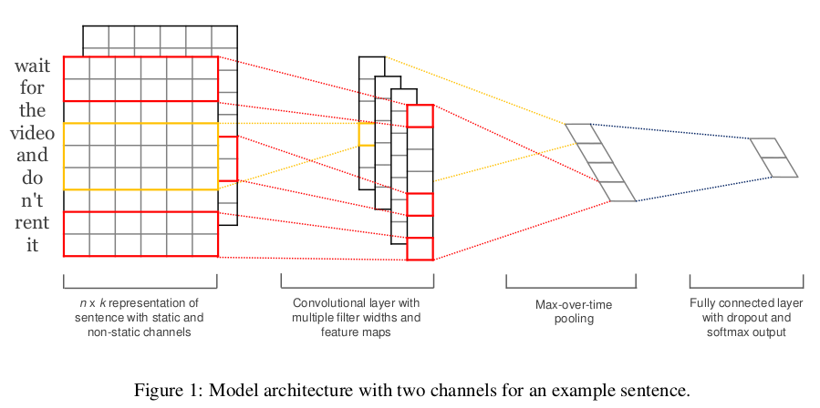
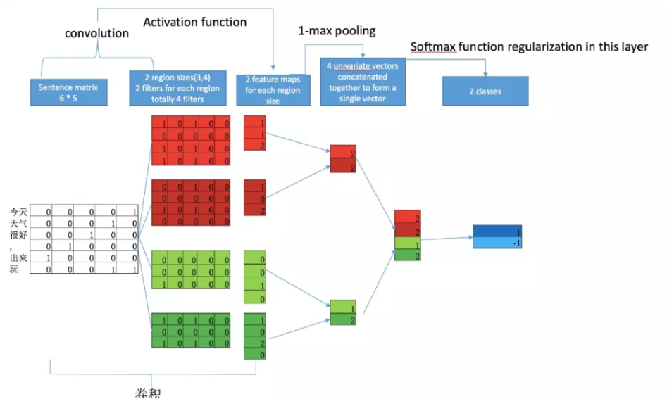
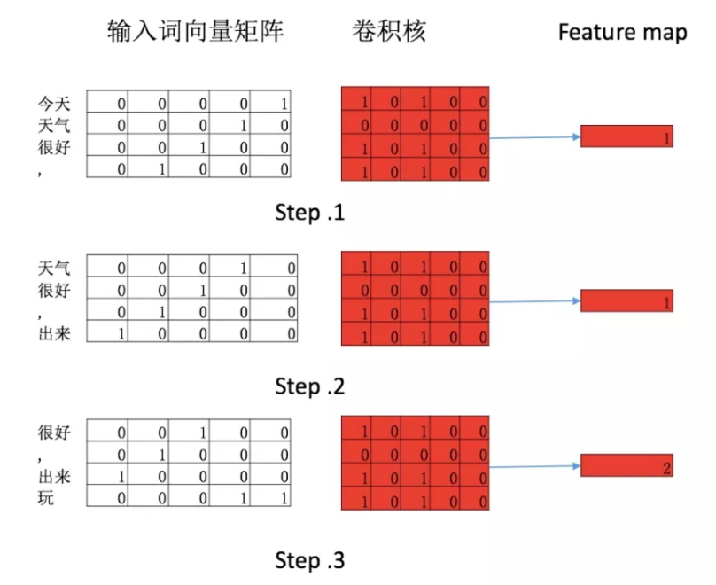
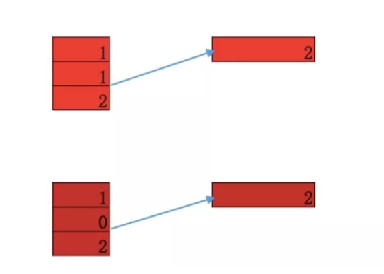
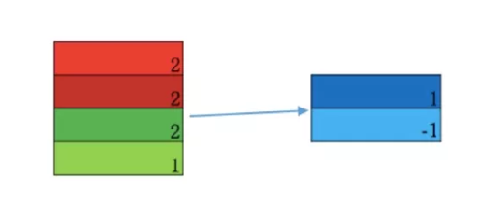

# TextCNN 是什么

 我们之前提前CNN时，通常会认为是属于CV领域，用于计算机视觉方向的工作，但是在2014年，Yoon Kim针对CNN的输入层做了一些变形，提出了文本分类模型TextCNN。与传统图像的CNN网络相比, TextCNN 在网络结构上没有任何变化(甚至更加简单了), 从图一可以看出TextCNN 其实只有一层卷积,一层max-pooling, 最后将输出外接softmax 来n分类。

图一TextCNN 网络结构

 与图像领域的CNN的网络相比，TextCNN 最大的不同便是在输入数据的不同：

1. 图像是二维数据, 图像的卷积核是从左到右, 从上到下进行滑动来进行特征抽取。
2. 自然语言是一维数据, 虽然经过word-embedding 生成了二维向量，但是对词向量做从左到右滑动来进行卷积没有意义. 比如 "今天" 对应的向量[0, 0, 0, 0, 1], 按窗口大小为 1* 2 从左到右滑动得到[0,0], [0,0], [0,0], [0, 1]这四个向量, 对应的都是"今天"这个词汇, 这种滑动没有帮助.

TextCNN的成功, 不是网络结构的成功, 而是通过引入已经训练好的词向量来在多个数据集上达到了超越benchmark 的表现，进一步证明了构造更好的embedding, 是提升nlp 各项任务的关键能力。

# textCNN 的优势

1. textCNN最大优势**网络结构简单** ,在模型网络结构如此简单的情况下，通过引入已经训练好的词向量依旧有很不错的效果，在多项数据数据集上超越benchmark。
2. 网络结构简单导致**参数数目少, 计算量少, 训练速度快**，在单机单卡的v100机器上，训练165万数据, 迭代26万步，半个小时左右可以收敛。

# textCNN 的流程

## Word Embedding 分词构建词向量

如图二所示, textCNN 首先将 "今天天气很好,出来玩" 分词成"今天/天气/很好/，/出来/玩, 通过word2vec或者GLOV 等embedding 方式将每个词成映射成一个5维(维数可以自己指定)词向量, 如 "今天" -> [0,0,0,0,1], "天气" ->[0,0,0,1,0], "很好" ->[0,0,1,0,0]等等。

图二 Word Embedding

这样做的好处主要是将**自然语言数值化**，方便后续的处理。从这里也可以看出不同的映射方式对最后的结果是会产生巨大的影响, nlp 当中目前最火热的研究方向便是如何将自然语言映射成更好的词向量。

我们构建完词向量后，将所有的词向量拼接起来构成一个6*5的二维矩阵，作为最初的输入。

## Convolution 卷积

图三 卷积示意图

卷积是一种数学算子。我们用一个简单的例子来说明一下

**step.1** 将 "今天"/"天气"/"很好"/"," 对应的4*5 矩阵 与卷积核做一个point wise 的乘法然后求和, 便是卷积操作：

feature_map[0] =0\*1 + 0\*0 + 0\*1 + 0\*0 + 1\*0+//(第一行)

 0\*0 + 0\*0 + 0\*0 + 1\*0 + 0\*0 +//(第二行)

 0\*1 + 0\*0 + 1\*1+ 0\*0 + 0\*0 +//(第三行)

 0\*1 + 1\*0+ 0\*1 + 0\*0 + 0\*0//(第四行)

= 1

**step.2** 将窗口向下滑动一格(滑动的距离可以自己设置),"天气"/"很好"/","/"出来" 对应的4*5 矩阵 与卷积核(**权值不变**) 继续做point wise 乘法后求和

feature_map[1]= 0\*1 + 0\*0 + 0\*1 + 1\*0+0\*0+//(第一行)

 0\*0 + 0\*0 + 1\*0 + 0\*0 +0\*0 +//(第二行)

 0\*1 + 1\*0 +0\*1 + 0\*0 +0\*0 +//(第三行)

 1\*1 + 0\*0+ 0\*1 + 0\*0 +0\*0//(第四行)

 = 1

**step.3** 将窗口向下滑动一格(滑动的距离可以自己设置) "很好"/","/"出来"/"玩" 对应的4*5 矩阵 与卷积核(**权值不变**) 继续做point wise 乘法后求和

feature_map[2] = 0\*1 + 0\*0 + 1\*1+ 1\*0 + 0\*0+//(第一行)

 0\*0 + 1\*0 + 0\*0 + 0\*0 + 0\*0 +//(第二行)

 1\*1 + 0\*0 +0\*1 + 0\*0 + 0\*0 +//(第三行)

 0\*1 + 0\*0+ 0\*1 + 1\*0 + 1\*0//(第四行)

 = 2

feature_map 便是卷积之后的输出, 通过卷积操作 将输入的6\*5 矩阵映射成一个 3\*1 的矩阵，这个映射过程和特征抽取的结果很像，于是便将最后的输出称作feature map。

一般来说在卷积之后会跟一个激活函数，在这里为了简化说明需要，我们将激活函数设置为f(x) = x

## 关于channel 的说明

图四 channel 说明

CNN 中常常会提到一个词channel, 图三 中 深红矩阵与 浅红矩阵 便构成了两个channel 统称一个卷积核, 从这个图中也可以看出每个channel 不必严格一样, 每个4*5 矩阵与输入矩阵做一次卷积操作得到一个feature map. 在计算机视觉中，由于彩色图像存在 R, G, B 三种颜色, 每个颜色便代表一种channel。

根据原论文作者的描述, 一开始引入channel 是希望防止过拟合(通过保证学习到的vectors 不要偏离输入太多)来在小数据集合获得比单channel更好的表现，后来发现其实直接使用正则化效果更好。

不过使用多channel 相比与单channel, 每个channel 可以使用不同的word embedding, 比如可以在no-static(梯度可以反向传播) 的channel 来fine tune 词向量，让词向量更加适用于当前的训练。

对于channel在textCNN 是否有用, 从论文的实验结果来看多channels**并没有明显提升模型的分类能力**, 七个数据集上的五个数据集 单channel 的textCNN 表现都要优于 多channels的textCNN。

图五 textCNN 实验

我们在这里也介绍一下论文中四个model 的不同

- CNN-rand (单channel), 设计好 embedding_size 这个 Hyperparameter 后, 对不同单词的向量作随机初始化, 后续BP的时候作调整。
- CNN-static(单channel), 拿 pre-trained vectors from word2vec, FastText or GloVe 直接用, 训练过程中不再调整词向量。
- CNN-non-static(单channel), pre-trained vectors + fine tuning , 即拿word2vec训练好的词向量初始化, 训练过程中再对它们微调。
- CNN-multiple channel(多channels), 类比于图像中的RGB通道, 这里也可以用 static 与 non-static 搭两个通道来做。

## max-pooling

图六: max-pooling 说明

得到feamap = [1,1,2] 后, 从中选取一个最大值[2] 作为输出, 便是max-pooling。max-pooling 在保持主要特征的情况下, 大大降低了参数的数目, 从图五中可以看出 feature map 从 三维变成了一维, 好处有如下两点: 

1. 降低了过拟合的风险, feature map = [1, 1, 2] 或者[1, 0, 2] 最后的输出都是[2], 表明开始的输入即使有轻微变形, 也不影响最后的识别。
2. 参数减少, 进一步加速计算。

pooling 本身无法带来平移不变性(图片有个字母A, 这个字母A 无论出现在图片的哪个位置, 在CNN的网络中都可以识别出来)，卷积核的权值共享才能。

max-pooling的原理主要是从多个值中取一个最大值，做不到这一点。cnn 能够做到平移不变性，是因为在滑动卷积核的时候，使用的卷积核权值是保持固定的(权值共享), 假设这个卷积核被训练的就能识别字母A, 当这个卷积核在整张图片上滑动的时候，当然可以把整张图片的A都识别出来。

## 使用softmax k分类

图六：softmax 示意图

如图六所示, 我们将 max-pooling的结果拼接起来, 送入到softmax当中, 得到各个类别比如 label 为1 的概率以及label 为-1的概率。如果是预测的话，到这里整个textCNN的流程遍结束了。

如果是训练的话，此时便会根据预测label以及实际label来计算损失函数, 计算出softmax 函数,max-pooling 函数, 激活函数以及卷积核函数 四个函数当中参数需要更新的梯度, 来依次更新这四个函数中的参数，完成一轮训练 。

# textCNN的总结

本次我们介绍的textCNN是一个应用了CNN网络的文本分类模型。

- textCNN的流程是先将文本分词做embeeding得到词向量，将词向量经过一层卷积，一层max-pooling, 最后将输出外接softmax来做n分类。
- textCNN 的优势在于模型简单, 训练速度快，效果不错。
- textCNN的缺点在于模型可解释型不强，在调优模型的时候，很难根据训练的结果去针对性的调整具体的特征，因为在textCNN中没有类似gbdt模型中特征重要度(feature importance)的概念, 所以很难去评估每个特征的重要度。

# 参考

1. [TextCNN原理详解](https://mp.weixin.qq.com/s?src=11&timestamp=1602337692&ver=2636&signature=N0Y1krkPkeJFllpevP52vT*gh7CKnB43S1Vlbik6wBvMO4mDYXqEKvWWKQdLHPFtXj3-rbCaylDLDVPOfOFptjelm2MWavd*mSpuh7Bml96QndXac1F9u5VjtgQ6WfGu&new=1)
2. [TextCNN的代码实现](https://www.cnblogs.com/ModifyRong/p/11442595.html)
3. [TextCNN的优化经验](https://www.cnblogs.com/ModifyRong/p/11442661.html)

