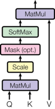

# 准备工作

```python
import numpy as np
import torch
import torch.nn as nn
import torch.nn.functional as F
import math, copy, time
from torch.autograd import Variable
import matplotlib.pyplot as plt
import warnings

warnings.filterwarnings("ignore")
```

# 背景

减少**序列处理任务的计算量**是一个很重要的问题，也是Extended Neural GPU、ByteNet和ConvS2S等网络的动机。上面提到的这些网络都以CNN为基础，并行计算所有输入和输出位置的隐藏表示。

在这些模型中，关联来自两个任意输入或输出位置的信号所需的操作数随位置间的距离增长而增长，比如ConvS2S呈线性增长，ByteNet呈现以对数形式增长，这会使学习较远距离的两个位置之间的依赖关系变得更加困难。而在Transformer中，**操作次数则被减少到了常数级别。**

Self-attention有时候也被称为Intra-attention，是在单个句子不同位置上做的Attention，并得到序列的一个表示。它能够很好地应用到很多任务中，包括阅读理解、摘要、文本蕴涵，以及独立于任务的句子表示。端到端的网络一般都是基于循环注意力机制而不是序列对齐循环，并且已经有证据表明在简单语言问答和语言建模任务上表现很好。

据我们所知，Transformer是第一个完全依靠Self-attention而不使用序列对齐的RNN或卷积的方式来计算输入输出表示的转换模型。

# 模型结构

目前大部分比较热门的神经序列转换模型都有Encoder-Decoder结构。Encoder将输入序列$(x_1, …, x_n)$映射到一个连续表示序列$\mathbf{z} = (z_1, …, z_n)$

对于编码得到的$z$，Decoder每次解码生成一个符号，直到生成完整的输出序列：$(y_1,…,y_m)$。对于每一步解码，模型都是自回归的，即在生成下一个符号时将先前生成的符号作为附加输入。

```python
class EncoderDecoder(nn.Module):
    """
    A standard Encoder-Decoder architecture. Base for this and many
    other models.
    """

    def __init__(self, encoder, decoder, src_embed, tgt_embed, generator):
        super(EncoderDecoder, self).__init__()
        self.encoder = encoder
        self.decoder = decoder
        self.src_embed = src_embed
        self.tgt_embed = tgt_embed
        self.generator = generator

    def forward(self, src, tgt, src_mask, tgt_mask):
        "Take in and process masked src and target sequences."
        return self.decode(self.encode(src, src_mask), src_mask, tgt, tgt_mask)

    def encode(self, src, src_mask):
        return self.encoder(self.src_embed(src), src_mask)

    def decode(self, memory, src_mask, tgt, tgt_mask):
        return self.decoder(self.tgt_embed(tgt), memory, src_mask, tgt_mask)
```


```python
class Generator(nn.Module):
    "Define standard linear + softmax generation step."

    def __init__(self, d_model, vocab):
        super(Generator, self).__init__()
        self.proj = nn.Linear(d_model, vocab)

    def forward(self, x):
        return F.log_softmax(self.proj(x), dim=-1)
```

Transformer的整体结构如下图所示，在Encoder和Decoder中都使用了Self-attention, Point-wise和全连接层。Encoder和decoder的大致结构分别如下图的左半部分和右半部分所示。


## Encoder

Encoder由N=6个相同的层组成。

```python
def clones(module, N):
    "Produce N identical layers."
    return nn.ModuleList([copy.deepcopy(module) for _ in range(N)])

class Encoder(nn.Module):
    "Core encoder is a stack of N layers"

    def __init__(self, layer, N):
        super(Encoder, self).__init__()
        self.layers = clones(layer, N)
        self.norm = LayerNorm(layer.size)

    def forward(self, x, mask):
        "Pass the input (and mask) through each layer in turn."
        for layer in self.layers:
            x = layer(x, mask)
        return self.norm(x)
```

我们在每两个子层之间都使用了残差连接(Residual Connection) [11]和归一化 [12]

```python
class LayerNorm(nn.Module):
    "Construct a layernorm module (See citation for details)."

    def __init__(self, features, eps=1e-6):
        super(LayerNorm, self).__init__()
        self.a_2 = nn.Parameter(torch.ones(features))
        self.b_2 = nn.Parameter(torch.zeros(features))
        self.eps = eps

    def forward(self, x):
        mean = x.mean(-1, keepdim=True)
        std = x.std(-1, keepdim=True)
        return self.a_2 * (x - mean) / (std + self.eps) + self.b_2
```

也就是说，每个子层的输出为$\mathrm{LayerNorm}(x + \mathrm{Sublayer}(x))$，其中$\mathrm{Sublayer}(x)$是由子层自动实现的函数。我们在每个子层的输出上使用Dropout，然后将其添加到下一子层的输入并进行归一化。

为了能方便地使用这些残差连接，模型中所有的子层和Embedding层的输出都设定成了相同的维度，即$d_{\text{model}}=512$。

```python
class SublayerConnection(nn.Module):
    """
    A residual connection followed by a layer norm.
    Note for code simplicity the norm is first as opposed to last.
    """

    def __init__(self, size, dropout):
        super(SublayerConnection, self).__init__()
        self.norm = LayerNorm(size)
        self.dropout = nn.Dropout(dropout)

    def forward(self, x, sublayer):
        "Apply residual connection to any sublayer with the same size."
        return x + self.dropout(sublayer(self.norm(x)))
```

每层都有两个子层组成。第一个子层实现了“多头”的 Self-attention，第二个子层则是一个简单的Position-wise的全连接前馈网络。

```python
class EncoderLayer(nn.Module):
    "Encoder is made up of self-attn and feed forward (defined below)"

    def __init__(self, size, self_attn, feed_forward, dropout):
        super(EncoderLayer, self).__init__()
        self.self_attn = self_attn
        self.feed_forward = feed_forward
        self.sublayer = clones(SublayerConnection(size, dropout), 2)
        self.size = size

    def forward(self, x, mask):
        "Follow Figure 1 (left) for connections."
        x = self.sublayer[0](x, lambda x: self.self_attn(x, x, x, mask))
        return self.sublayer[1](x, self.feed_forward)
```


## Decoder

Decoder也是由$N=6$个相同层组成。

```python
class Decoder(nn.Module):
    "Generic N layer decoder with masking."

    def __init__(self, layer, N):
        super(Decoder, self).__init__()
        self.layers = clones(layer, N)
        self.norm = LayerNorm(layer.size)

    def forward(self, x, memory, src_mask, tgt_mask):
        for layer in self.layers:
            x = layer(x, memory, src_mask, tgt_mask)
        return self.norm(x)
```

除了每个编码器层中的两个子层之外，**解码器还插入了第三种子层对编码器栈的输出实行“多头”的Attention。**与编码器类似，我们在每个子层两端使用残差连接进行短路，然后进行层的规范化处理。

```python
class DecoderLayer(nn.Module):
    "Decoder is made of self-attn, src-attn, and feed forward (defined below)"

    def __init__(self, size, self_attn, src_attn, feed_forward, dropout):
        super(DecoderLayer, self).__init__()
        self.size = size
        self.self_attn = self_attn
        self.src_attn = src_attn
        self.feed_forward = feed_forward
        self.sublayer = clones(SublayerConnection(size, dropout), 3)

    def forward(self, x, memory, src_mask, tgt_mask):
        "Follow Figure 1 (right) for connections."
        m = memory
        x = self.sublayer[0](x, lambda x: self.self_attn(x, x, x, tgt_mask))
        x = self.sublayer[1](x, lambda x: self.src_attn(x, m, m, src_mask))
        return self.sublayer[2](x, self.feed_forward)
```

我们还修改解码器中的Self-attention子层以防止当前位置Attend到后续位置。这种Masked的Attention是考虑到输出Embedding会偏移一个位置，确保了生成位置$i$的预测时，仅依赖小于$i$的位置处的已知输出，相当于把后面不该看到的信息屏蔽掉。

```python
def subsequent_mask(size):
    "Mask out subsequent positions."
    attn_shape = (1, size, size)
    subsequent_mask = np.triu(np.ones(attn_shape), k=1).astype('uint8')
    return torch.from_numpy(subsequent_mask) == 0
```

下面的Attention mask图显示了允许每个目标词（行）查看的位置（列）。在训练期间，当前解码位置的词不能Attend到后续位置的词。

```python
plt.figure(figsize=(12, 12))
plt.imshow(subsequent_mask(20)[0])
plt.show()
```


## Attention

Attention函数可以将Query和一组Key-Value对映射到输出，其中Query、Key、Value和输出都是向量。 输出是值的加权和，其中分配给每个Value的权重由Query与相应Key的兼容函数计算。

我们称这种特殊的Attention机制为"Scaled Dot-Product Attention"。输入包含维度为$d_k$的Query和Key，以及维度为$d_v$的Value。 我们首先分别计算Query与各个Key的点积，然后将每个点积除以$\sqrt {d_k}$，最后使用Softmax函数来获得Key的权重。



在具体实现时，我们可以以矩阵的形式进行并行运算，这样能加速运算过程。具体来说，将所有的Query、Key和Value向量分别组合成矩阵$Q$、$K$和$V$，这样输出矩阵可以表示为：
$$
\mathrm{Attention}(Q, K, V) = \mathrm{softmax}(\frac{QK^T}{\sqrt{d_k}})V
$$

```python
def attention(query, key, value, mask=None, dropout=None):
    "Compute 'Scaled Dot Product Attention'"
    d_k = query.size(-1)
    scores = torch.matmul(query, key.transpose(-2, -1))  / math.sqrt(d_k)
    if mask is not None:
        scores = scores.masked_fill(mask == 0, -1e9)

    p_attn = F.softmax(scores, dim=-1)
    if dropout is not None:
        p_attn = dropout(p_attn)
    return torch.matmul(p_attn, value), p_attn
```

两种最常用的Attention函数是加和Attention[13]和点积（乘积）Attention，我们的算法与点积Attention很类似，但是$\frac{1}{\sqrt{d_k}}$的比例因子不同。加和Attention使用具有单个隐藏层的前馈网络来计算兼容函数。虽然两种方法理论上的复杂度是相似的，但在实践中，点积Attention的运算会更快一些，也更节省空间，因为它可以使用高效的矩阵乘法算法来实现。

虽然对于较小的 $d_k$， 这两种机制的表现相似，但在不放缩较大的 $d_k$时，加和Attention要优于点 积Attention[14]。我们怀疑，对于较大的 $d_k$，点积大幅增大, 将Softmax函数推向具有极小梯度 的区域（为了阐明点积变大的原因，假设$q$和 $k$是独立的随机变量, 平均值为 0，方差为 1，这样他们的点积为 $q \cdot k = \sum_{i=1}^{d_k} q_ik_i$，同样是均值 0为方差为 $d_k$）。为了抵消这种影响，我们用$\frac{1}{\sqrt{d_k}}$来缩放点积。


“多头”机制能让模型考虑到不同位置的Attention，另外“多头”Attention可以在不同的子空间表示不一样的关联关系，使用单个Head的Attention一般达不到这种效果。
$$
\mathrm{MultiHead}(Q, K, V) = \mathrm{Concat}(\mathrm{head_1}, ...,
\mathrm{head_h})W^O    \\
    \text{where}~\mathrm{head_i} = \mathrm{Attention}(QW^Q_i, KW^K_i, VW^V_i)
$$
其中参数矩阵为 $W^Q_i \in \mathbb{R}^{d_{\text{model}} \times d_k}$，$W^K_i \in \mathbb{R}^{d_{\text{model}} \times d_k}$，$W^V_i \in \mathbb{R}^{d_{\text{model}} \times d_v}$和$W^O \in \mathbb{R}^{hd_v \times d_{\text{model}}}$。

我们的工作中使用 $h=8$个Head并行的Attention，对每一个Head来说有 $d_k=d_v=d_{\text{model}}/h=64$，总计算量与完整维度的单个Head的Attention很相近。

```python
class MultiHeadedAttention(nn.Module):
    def __init__(self, h, d_model, dropout=0.1):
        "Take in model size and number of heads."
        super(MultiHeadedAttention, self).__init__()
        assert d_model % h == 0
        # We assume d_v always equals d_k
        self.d_k = d_model // h
        self.h = h
        self.linears = clones(nn.Linear(d_model, d_model), 4)
        self.attn = None
        self.dropout = nn.Dropout(p=dropout)

    def forward(self, query, key, value, mask=None):
        "Implements Figure 2"
        if mask is not None:
            # Same mask applied to all h heads.
            mask = mask.unsqueeze(1)
        nbatches = query.size(0)

        # 1) Do all the linear projections in batch from d_model => h x d_k
        query, key, value = [l(x).view(nbatches, -1, self.h, self.d_k).transpose(1, 2) for l, x in zip(self.linears, (query, key, value))]

        # 2) Apply attention on all the projected vectors in batch.
        x, self.attn = attention(query, key, value, mask=mask, dropout=self.dropout)

        # 3) "Concat" using a view and apply a final linear.
        x = x.transpose(1, 2).contiguous().view(nbatches, -1, self.h * self.d_k)
        return self.linears[-1](x)
```


## Attention在模型中的应用

Transformer中以三种不同的方式使用了“多头”Attention：

1) 在"Encoder-Decoder Attention"层，Query来自先前的解码器层，并且Key和Value来自Encoder的输出。Decoder中的每个位置Attend输入序列中的所有位置，这与Seq2Seq模型中的经典的Encoder-Decoder Attention机制[15]一致。

2) Encoder中的Self-attention层。在Self-attention层中，所有的Key、Value和Query都来同一个地方，这里都是来自Encoder中前一层的输出。Encoder中当前层的每个位置都能Attend到前一层的所有位置。

3) 类似的，解码器中的Self-attention层允许解码器中的每个位置Attend当前解码位置和它前面的所有位置。这里需要屏蔽解码器中向左的信息流以保持自回归属性。具体的实现方式是在缩放后的点积Attention中，屏蔽（设为负无穷）Softmax的输入中所有对应着非法连接的Value。

## Position-wise前馈网络

除了Attention子层之外，Encoder和Decoder中的每个层都包含一个全连接前馈网络，分别地应用于每个位置。其中包括两个线性变换，然后使用ReLU作为激活函数。

$$
\mathrm{FFN}(x)=\max(0, xW_1 + b_1) W_2 + b_2
$$
虽然线性变换在不同位置上是相同的，但它们在层与层之间使用不同的参数。这其实是相当于使用了两个内核大小为1的卷积。这里设置输入和输出的维数为$d_{\text{model}}=512$，内层的维度为$d_{ff}=2048$。

```python
class PositionwiseFeedForward(nn.Module):
    "Implements FFN equation."

    def __init__(self, d_model, d_ff, dropout=0.1):
        super(PositionwiseFeedForward, self).__init__()
        self.w_1 = nn.Linear(d_model, d_ff)
        self.w_2 = nn.Linear(d_ff, d_model)
        self.dropout = nn.Dropout(dropout)

    def forward(self, x):
        return self.w_2(self.dropout(F.relu(self.w_1(x))))
```


## Embedding和Softmax

与其他序列转换模型类似，我们使用预学习的Embedding将输入Token序列和输出Token序列转化为$d_{\text{model}}$维向量。我们还使用常用的预训练的线性变换和Softmax函数将解码器输出转换为预测下一个Token的概率。在我们的模型中，我们在两个Embedding层和Pre-softmax线性变换之间共享相同的权重矩阵，类似于[16]。在Embedding层中，我们将这些权重乘以$\sqrt{d_{\text{model}}}$。

```python
class Embeddings(nn.Module):
    def __init__(self, d_model, vocab):
        super(Embeddings, self).__init__()
        self.lut = nn.Embedding(vocab, d_model)
        self.d_model = d_model

    def forward(self, x):
        return self.lut(x) * math.sqrt(self.d_model)
```


## 位置编码

由于我们的模型不包含递归和卷积结构，为了使模型能够有效利用序列的顺序特征，我们需要加入序列中各个Token间相对位置或Token在序列中绝对位置的信息。在这里，我们将位置编码添加到编码器和解码器栈底部的输入Embedding。由于位置编码与Embedding具有相同的维度$d_{\text{model}}$，因此两者可以直接相加。其实这里还有许多位置编码可供选择，其中包括可更新的和固定不变的[17]。

在此项工作中，我们使用不同频率的正弦和余弦函数：

$$
PE_{(pos,2i)} &= sin(pos / 10000^{2i/d_{\text{model}}}) \\
PE_{(pos,2i+1)} &= cos(pos / 10000^{2i/d_{\text{model}}})
$$
其中 $pos$位置, $i$是维度。也就是说，位置编码的每个维度都对应于一个正弦曲线, 其波长形成从 $2\pi$到 $10000 \cdot 2\pi$的等比级数。我们之所以选择了这个函数，是因为我们假设它能让模型很容易学会Attend相对位置, 因为对于任何固定的偏移量$k$，$PE_{pos+k}$可以表示为 $PE_{pos}$的线性函数。

此外，在编码器和解码器堆栈中，我们在Embedding与位置编码的加和上都使用了Dropout机制。 在基本模型上, 我们使用 $P_{drop}=0.1$的比率。

```python
class PositionalEncoding(nn.Module):
    "Implement the PE function."

    def __init__(self, d_model, dropout, max_len=5000):
        super(PositionalEncoding, self).__init__()
        self.dropout = nn.Dropout(p=dropout)

        # Compute the positional encodings once in log space.
        pe = torch.zeros(max_len, d_model)
        position = torch.arange(0, max_len).unsqueeze(1)
        div_term = torch.exp(torch.arange(0, d_model, 2) * -(math.log(10000.0) / d_model))
        pe[:, 0::2] = torch.sin(position * div_term)
        pe[:, 1::2] = torch.cos(position * div_term)
        pe = pe.unsqueeze(0)
        self.register_buffer('pe', pe)

    def forward(self, x):
        x = x + Variable(self.pe[:, :x.size(1)], requires_grad=False)
        return self.dropout(x)
```

如下所示，位置编码将根据位置添加正弦曲线。曲线的频率和偏移对于每个维度是不同的。

```python
plt.figure(figsize=(15, 5))
pe = PositionalEncoding(20, 0)
y = pe.forward(Variable(torch.zeros(1, 100, 20)))
plt.plot(np.arange(100), y[0, :, 4:8].data.numpy())
plt.legend(["dim %d" % p for p in [4, 5, 6, 7]])
plt.show()
```


我们也尝试了使用预学习的位置Embedding，但是发现这两个版本的结果基本是一样的。我们选择正弦曲线版本的实现，因为使用此版本能让模型能够处理大于训练语料中最大序了使用列长度的序列。

## 完整模型

下面定义了连接完整模型并设置超参的函数。

```python
def make_model(src_vocab, tgt_vocab, N=6, d_model=512, d_ff=2048, h=8, dropout=0.1):
    "Helper: Construct a model from hyperparameters."
    c = copy.deepcopy
    attn = MultiHeadedAttention(h, d_model)
    ff = PositionwiseFeedForward(d_model, d_ff, dropout)
    position = PositionalEncoding(d_model, dropout)
    model = EncoderDecoder(
        Encoder(EncoderLayer(d_model, c(attn), c(ff), dropout), N),
        Decoder(DecoderLayer(d_model, c(attn), c(attn), c(ff), dropout), N),
        nn.Sequential(Embeddings(d_model, src_vocab), c(position)),
        nn.Sequential(Embeddings(d_model, tgt_vocab), c(position)),
        Generator(d_model, tgt_vocab)
    )

    # This was important from their code.
    # Initialize parameters with Glorot / fan_avg.
    for p in model.parameters():
        if p.dim() > 1:
            # nn.init.xavier_uniform(p)
            nn.init.xavier_uniform_(p)
    return model


# Small example model.
tmp_model = make_model(10, 10, 2)
```


# 训练

快速穿插介绍训练标准编码器解码器模型需要的一些工具。首先我们定义一个包含源和目标句子的批训练对象用于训练，同时构造掩码。

## 批和掩码

```python
class Batch:
    "Object for holding a batch of data with mask during training."

    def __init__(self, src, trg=None, pad=0):
        self.src = src
        self.src_mask = (src != pad).unsqueeze(-2)
        if trg is not None:
            self.trg = trg[:, :-1]
            self.trg_y = trg[:, 1:]
            self.trg_mask = self.make_std_mask(self.trg, pad)
            self.ntokens = (self.trg_y != pad).data.sum()

    @staticmethod
    def make_std_mask(tgt, pad):
        "Create a mask to hide padding and future words."
        tgt_mask = (tgt != pad).unsqueeze(-2)
        tgt_mask = tgt_mask & Variable(subsequent_mask(tgt.size(-1)).type_as(tgt_mask.data))
        return tgt_mask
```

接下来，我们创建一个通用的训练和得分函数来跟踪损失。我们传入一个通用的损失计算函数，它也处理参数更新。

## 训练循环

```python
def run_epoch(data_iter, model, loss_compute):
    "Standard Training and Logging Function"
    start = time.time()
    total_tokens = 0
    total_loss = 0
    tokens = 0

    for i, batch in enumerate(data_iter):
        out = model.forward(batch.src, batch.trg, batch.src_mask, batch.trg_mask)
        loss = loss_compute(out, batch.trg_y, batch.ntokens)
        total_loss += loss
        total_tokens += batch.ntokens
        tokens += batch.ntokens
        if i % 50 == 1:
            elapsed = time.time() - start
            print("Epoch Step: %d Loss: %f Tokens per Sec: %f" % (i, loss / batch.ntokens, tokens / elapsed))
            start = time.time()
            tokens = 0
    return total_loss / total_tokens
```


## 训练数据和批处理

我们使用标准WMT 2014英语-德语数据集进行了训练，该数据集包含大约450万个句子对。 使用字节对的编码方法对句子进行编码，该编码具有大约37000个词的共享源-目标词汇表。 对于英语-法语，我们使用了WMT 2014 英语-法语数据集，该数据集由36M个句子组成，并将词分成32000个词片(Word-piece)的词汇表。

句子对按照近似的序列长度进行批处理。每个训练批包含一组句子对，包含大约25000个源词和25000个目标词。

我们将使用torch text来创建批次。下面更详细地讨论实现过程。 我们在torchtext的一个函数中创建批次，确保填充到最大批训练长度的大小不超过阈值（如果我们有8个GPU，则阈值为25000）。

```python
global max_src_in_batch, max_tgt_in_batch


def batch_size_fn(new, count, sofar):
    "Keep augmenting batch and calculate total number of tokens + padding."
    global max_src_in_batch, max_tgt_in_batch
    if count == 1:
        max_src_in_batch = 0
        max_tgt_in_batch = 0
    max_src_in_batch = max(max_src_in_batch, len(new))
    max_tgt_in_batch = max(max_tgt_in_batch, len(new) + 2)
    src_elements = count * max_src_in_batch
    tgt_elements = count * max_tgt_in_batch
    return max(src_elements, tgt_elements)
```


## 硬件和训练进度

我们在一台配备8个NVIDIA P100 GPU的机器上训练我们的模型。 对于使用本文所述的超参数的基本模型，每个训练单步大约需要0.4秒。 我们对基础模型进行了总共100,000步或12小时的训练。 对于我们的大型模型，每个训练单步时间为1.0秒。 大型模型通常需要训练300,000步（3.5天）。

## 优化器

我们选择Adam[1]作为优化器，其参数为$\beta_1=0.9$，$\beta_2=0.98$和 $\epsilon=10^{-9}$. 根据以下公式，我们在训练过程中改变了学习率：

$$
lrate = d_{\text{model}}^{-0.5} \cdot
  \min({step\_num}^{-0.5},
    {step\_num} \cdot {warmup\_steps}^{-1.5})
$$
在预热中随步数线性地增加学习速率，并且此后与步数的反平方根成比例地减小它。我们设置预热步数为4000。

注意：这部分非常重要，需要这种设置训练模型。

```python
class NoamOpt:
    "Optim wrapper that implements rate."

    def __init__(self, model_size, factor, warmup, optimizer):
        self.optimizer = optimizer
        self._step = 0
        self.warmup = warmup
        self.factor = factor
        self.model_size = model_size
        self._rate = 0

    def step(self):
        "Update parameters and rate"
        self._step += 1
        rate = self.rate()
        for p in self.optimizer.param_groups:
            p['lr'] = rate
        self._rate = rate
        self.optimizer.step()

    def rate(self, step=None):
        "Implement `lrate` above"
        if step is None:
            step = self._step
        return self.factor * \
               (self.model_size ** (-0.5) *
                min(step ** (-0.5), step * self.warmup ** (-1.5)))


def get_std_opt(model):
    return NoamOpt(
        model.src_embed[0].d_model, 2, 4000,
        torch.optim.Adam(model.parameters(), lr=0, betas=(0.9, 0.98), eps=1e-9))
```

当前模型在不同模型大小和超参数的情况下的曲线示例。

```python
# Three settings of the lrate hyperparameters.
opts = [
    NoamOpt(512, 1, 4000, None),
    NoamOpt(512, 1, 8000, None),
    NoamOpt(256, 1, 4000, None)
]
plt.plot(np.arange(1, 20000),
         [[opt.rate(i) for opt in opts] for i in range(1, 20000)])
plt.legend(["512:4000", "512:8000", "256:4000"])
plt.show()
```


## 标签平滑

在训练期间，我们采用了值$\epsilon_{ls}=0.1$的标签平滑。 这种做法提高了困惑度，因为模型变得更加不确定，但提高了准确性和BLEU分数。

我们使用KL div loss实现标签平滑。 相比使用独热目标分布，我们创建一个分布，其包含正确单词的置信度和整个词汇表中分布的其余平滑项。

```python
class LabelSmoothing(nn.Module):
    "Implement label smoothing."

    def __init__(self, size, padding_idx, smoothing=0.0):
        super(LabelSmoothing, self).__init__()
        self.criterion = nn.KLDivLoss(size_average=False)
        self.padding_idx = padding_idx
        self.confidence = 1.0 - smoothing
        self.smoothing = smoothing
        self.size = size
        self.true_dist = None

    def forward(self, x, target):
        assert x.size(1) == self.size
        true_dist = x.data.clone()
        true_dist.fill_(self.smoothing / (self.size - 2))
        true_dist.scatter_(1, target.data.unsqueeze(1), self.confidence)
        true_dist[:, self.padding_idx] = 0
        mask = torch.nonzero(target.data == self.padding_idx)
        if mask.dim() > 0:
            true_dist.index_fill_(0, mask.squeeze(), 0.0)
        self.true_dist = true_dist
        return self.criterion(x, Variable(true_dist, requires_grad=False))
```

在这里，我们可以看到标签平滑的示例。

```python
# Example of label smoothing.
crit = LabelSmoothing(5, 0, 0.4)
predict = torch.FloatTensor([[0, 0.2, 0.7, 0.1, 0], [0, 0.2, 0.7, 0.1, 0],
                             [0, 0.2, 0.7, 0.1, 0]])
v = crit(Variable(predict.log()), Variable(torch.LongTensor([2, 1, 0])))

# Show the target distributions expected by the system.
plt.imshow(crit.true_dist)
plt.show()
```


如果对给定的选择非常有信心，标签平滑实际上会开始惩罚模型。

```python
crit = LabelSmoothing(5, 0, 0.1)


def loss(x):
    d = x + 3 * 1
    predict = torch.FloatTensor([
        [0, x / d, 1 / d, 1 / d, 1 / d],
    ])
    # print(predict)
    return crit(Variable(predict.log()),
                Variable(torch.LongTensor([1]))).item()


plt.plot(np.arange(1, 100), [loss(x) for x in range(1, 100)])
plt.show()
```


# 一个例子

我们可以先尝试一个简单的复制任务。 给定来自小词汇表的随机输入符号集，目标是生成那些相同的符号。

## 数据生成

```python
def data_gen(V, batch, nbatches):
    "Generate random data for a src-tgt copy task."
    for i in range(nbatches):
        data = torch.from_numpy(np.random.randint(1, V, size=(batch, 10)))
        data[:, 0] = 1
        src = Variable(data, requires_grad=False)
        tgt = Variable(data, requires_grad=False)
        yield Batch(src, tgt, 0)
```


## 损失计算

```python
class SimpleLossCompute:
    "A simple loss compute and train function."

    def __init__(self, generator, criterion, opt=None):
        self.generator = generator
        self.criterion = criterion
        self.opt = opt

    def __call__(self, x, y, norm):
        x = self.generator(x)
        loss = self.criterion(x.contiguous().view(-1, x.size(-1)), y.contiguous().view(-1).type(torch.LongTensor)) / norm
        loss.backward()
        if self.opt is not None:
            self.opt.step()
            self.opt.optimizer.zero_grad()
        return loss.data.item() * norm
```


## 贪心解码

```python
# Train the simple copy task.
V = 11
criterion = LabelSmoothing(size=V, padding_idx=0, smoothing=0.0)
model = make_model(V, V, N=2)
model_opt = NoamOpt(
    model.src_embed[0].d_model, 1, 400,
    torch.optim.Adam(model.parameters(), lr=0, betas=(0.9, 0.98), eps=1e-9))

for epoch in range(1):
    print(epoch)
    model.train()
    run_epoch(data_gen(V, 30, 20), model, SimpleLossCompute(model.generator, criterion, model_opt))
    model.eval()
    print(run_epoch(data_gen(V, 30, 5), model, SimpleLossCompute(model.generator, criterion, None)))

```

为简单起见，此代码使用贪心解码来预测翻译。

```python
def greedy_decode(model, src, src_mask, max_len, start_symbol):
    memory = model.encode(src, src_mask)
    ys = torch.ones(1, 1).fill_(start_symbol).type_as(src.data)

    for i in range(max_len - 1):
        out = model.decode(memory, src_mask, Variable(ys), Variable(subsequent_mask(ys.size(1)).type_as(src.data)))
        prob = model.generator(out[:, -1])
        _, next_word = torch.max(prob, dim=1)
        next_word = next_word.data[0]
        ys = torch.cat([ys, torch.ones(1, 1).type_as(src.data).fill_(next_word)], dim=1)
    return ys


model.eval()
src = Variable(torch.LongTensor([[1, 2, 3, 4, 5, 6, 7, 8, 9, 10]]))
src_mask = Variable(torch.ones(1, 1, 10))
print(greedy_decode(model, src, src_mask, max_len=10, start_symbol=1))
```


# 参考资料

1. [搞懂Transformer结构，看这篇PyTorch实现就够了 - 知乎 (zhihu.com)](https://zhuanlan.zhihu.com/p/339207092)
2. [The Annotated Transformer (harvard.edu)](http://nlp.seas.harvard.edu/2018/04/03/attention.html)