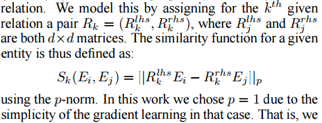
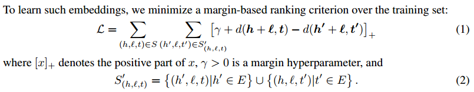
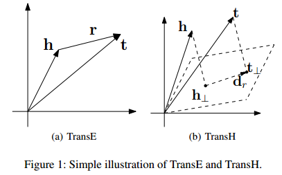
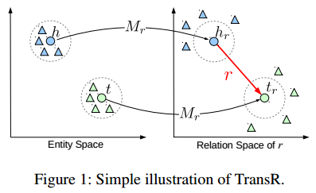
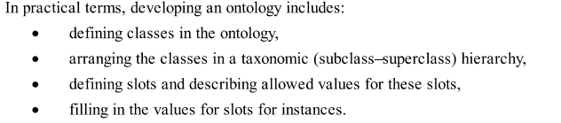
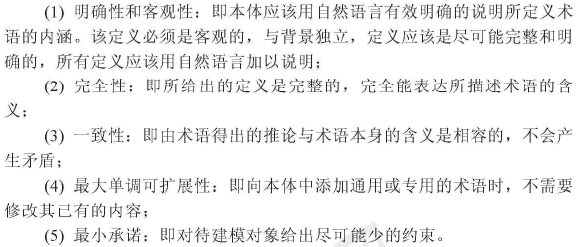
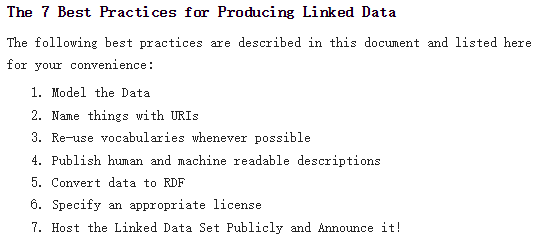
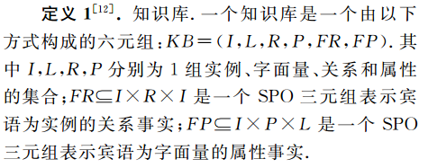

# 核心技术

## 知识抽取
### 定义
抽取一系列事实表达，（即实体、关系、属性三个知识要素）。

### 实现技术
#### 实体抽取

1. 基于规则和词典
2. 基于统计机器学习：主要是基于监督学习方法
3. 面向规则域：主要基于无监督学习

#### 关系抽取

1. 开放式实体关系抽取
    - 针对二元关系：OIE，Open Information Extraction，面向开放域的信息抽取框架
    - 针对n元关系：KPAKEN
2. 基于联合推理的实体关系抽取
    - 马尔科夫逻辑网
    - StatSnowball

#### 属性抽取

## 知识表示
### 三元组
### 稠密低维实值向量
#### 1-to-1关系

1. 距离模型：结构化表示(structured embedding, SE)

  

  SE 首先将实体用向量进行表示，然后通过关系矩阵将实体投影到与实体向量同一维度的向量空间中，最后通过计算投影向量之间的距离来判断实体间已存在的关系的置信度。 

2. 单层神经网络模型(Single Layer Model, SLM)

3. 隐变量模型(Latent Factor Model, LFM)

4. 神经张量模型

5. 矩阵分解模型

6. 翻译模型(Translating Embeddings, TransE)

  

 

#### 复杂关系
> (1-to-N、N-to-1、N-to-N)

1. TransH(Translating on Hyperplanes)
    
    TransH 该模型尝试使用超平面中投影的形式，表示不同关系中的实体结构。 首先通过关系向量与其正交的法向量选取一个超平面，然后将头实体向量和尾实体向量投影到超平面，再计算损失函数。 
2. TransR(Translating on Relation)

3. TransD
4. TransG
5. KG2E

## 知识融合
### 实体对齐
也称为实体匹配，判断相同或不同数据集的两个实体是否指向同一对象的过程。

就像知识的Reduce。在数据库领域类似的工作称为记录匹配、记录链接、重复检测，NLP中也称为共指消解(coreference resolution)，对象合并(object consolidation)等。

### 知识加工
#### 本体构建

1. 主要工作

2. 构建原则

3. 构建方法
    - 人工
    - 半自动
    - 自动
4. 基本流程
    - Bottom-up
        - Step 1. 纵向概念的并列关系计算。计算实体间并列关系的相似度，判断是否属于同一概念(层次)。
        - Step 2. 实体上下位关系抽取。
        - Step 3. 本体生成。对各层次的概念进行聚类，为每一类实体指定公共上位词。
    - Top-down
        - Step 1. Determine the domain and scope of the ontology.
        - Step 2. Consider reusing existing ontologies.
        - Step 3. Enumerate important terms in the ontology.
        - Step 4. Define the classes and the class hierarchy.
        - Step 5. Define the properties of classes.(slots)
        - Step 6. Define the facets of the properties.(slots)
        - Step 7. Create instances.

#### 质量评估

### 知识更新/迭代

1. 模式层：主要是概念的CRUD(增加、查询、修改、删除)。
2. 数据层：主要是实体的CRUD(增加、查询、修改、删除)。

## 知识推理

### 基于逻辑

1. 基于一阶谓词逻辑
2. 基于描述逻辑

基于描述逻辑 基于描述逻辑的知识库主要包括Tbox(terminology box)与ABox(assertion box)。通过TBox与ABox，可将关于知识库中复杂的实体关系推理转化为一致性的检验问题，从而简化并实现推理。 

3. 通过本体语义

通过本体语义 通过本体的概念层次进行推理时，其中概念主 要是通过OWL(Web ontology language)本体语义进行描述的。

### 基于图

1. 随机游走推测语义关系

随机游走 文献[1]利用了关系路径中的蕴涵信息，通过图中两个实体间的多步路径来预测它们之间的语义关系。即从源节点开始，在图上根据路径建模算法进行游走，如果能够到达目标节点，则推测源节点和目标节点间存在联系。 

# 实施方案

## 系统描述

**系统描述**

 该部分描述了知识库系统的开发目标、用户视图和主要功能。 

**开发目标** 

实现目标是构建一个能够存储和管理Ontology库、提供知识查询服务的知识库系统。用户可基于开放链接数据(Open Linked Data)，使用自动或半自动的方式，构建本体(Ontology)并将其发布和存储到系统中。 

**用户视图** 

系统的使用者分为普通用户(Users)、开发者(Developers)和系统管理员(Administrators)。

**主要功能** 

1. 系统提供给Users接口，从结构化的Linked Data中自动或半自动构建Ontology。
2. 系统提供RESTful接口，使Users可以发布/更新/查询/删除Ontology。 
3. 系统提供支持语义的检索功能，Users通过查询语句获取相关实体信息。
4. Adminstrators可以在后台管理Users权限。

### 开发目标

- 构建成熟的知识库系统

成熟的知识库系统 一个能够存储和管理Ontology库、提供知识查询服务的知识库系统。用户可基于开放链接数据(Open Linked Data)，使用自动或半自动的方式，构建本体(Ontology)并将其发布和存储到系统中。

### 用户视图

1. Users
2. Developers
3. Administrators

### 主要功能

1. 本体构建：提供接口，用户使用自动/半自动的方式，从LOD中构建本体。
2. 管理本体库：发布/更新/查询/删除本体。
3. 知识检索：处理查询请求，进行语义分析和知识检索。
4. 用户管理：分配用户权限。

## 关键技术点

 **创建、存储和处理LOD** 

系统需要指导用户获取Linked Data，分为两种方式：

1. 遵循W3C发布的Linked Data CookBook，发布结构化的LOD；
2. 从互联网获取已经发布的LOD。 系统需要将用户提供的LOD存储到图形数据库中，并使用现有语义网开发框架提取和分析RDF格式的数据。

 **自动化/半自动化构建本体** 

该部分是系统实现的重点和难点。当前不存在规范的本体构建标准和成熟的自动化算法，多采用本体工程环境(Protégé等)，人工参与构建本体。本文将提出一系列构建算法尝试自动化构建本体。 Ontology需要遵循OMV标准，提高本体的可重用性。 

 **本体库存储和管理**

Ontology存储在图形数据库中，系统需要提供RESTful服务，使Users可以管理本体库。 

 **知识推理和挖掘** 

系统需要对不同本体进行匹配和融合，并通过算法完成概念和实体间的关系补全。 

 **支持语义的知识检索** 

系统需要支持对查询请求的语义分析，并返回相关实体和知识。

### 创建、存储和处理LOD

1. 获取LOD

> 获取Linked Data 

- 从原始数据提取结构化的LOD
    - 发布Linked Data的一般步骤
    
    
    
- 从Linked Data Cloud获取LOD

2. 存储LOD

    - 使用图形数据库，例如Allergo Graph/Neo4J/Cayley

3. 提取和分析数据

    - 使用Apache Jena/Sesame框架提供的API处理RDF格式的数据。

### 自动化/半自动化构建本体

1. 构建Ontology
    - 半自动化方法
        - Protégé
        - NeOn Toolkit
    - 自动化方法
        - 基于实体匹配抽取概念
        - 基于语义抽取上下位关系
        - 基于主题聚类确定结构
2. 规范Ontology数据格式(Ontology Metedata Standard)
    - 使用Ontology Metedata Vocabulary

### 本体库存储和管理(CRUD)

- 在数据库中存储和管理Graph Data
    - 使用图形数据库，例如Allergo Graph/Neo4J/Cayley
- 为用户提供RESTful服务管理本体库
    - 使用RESTful框架Jersey和服务器容器Tocmat实现

### 知识推理和挖掘

1. 本体匹配/融合
2. 知识挖掘/关系补全

### 支持语义的知识检索

1. 对查询请求进行语义分析
2. 实体查询

## 相关工具介绍

系统实现中可能用到的工具包括图形数据库、语义网开发框架、语义网相关语言、本体工程环境和一些通用工具。

### 图形数据库

图形数据库是NoSQL的一种。当前比较成熟的有Allergo Graph、Neo4J、Cayley等，大部分都是开源免费的。

**图形数据库**

- Allergo Graph
- Neo4J
- Cayley

### 语义网框架

Apache Jena和Sesame都提供Java API，用于语义网开发、RDF格式分析等。

**语义网框架**

- Apache Jena
- Sesame

### 相关语言 

RDF Scheme是RDF的标准，OWL是本体构建语言，SPARQL用于RDF数据查询。

**相关语言**

- RDFS
- OWL 2
- SPARQL

### 本体工程环境 

Protégé和NeOn Toolkit都是常用的本体编辑工具。Protégé也提供部分API用于构建本体。 ### 通用工具 Tocmat是常用的服务器容器，Jersey是一种Java框架，可以用于构建RESTful服务。

**本体工程环境**

- Protégé
- NeOn Toolkit

### 通用工具

**通用工具**

- Tocmat
- Jersey

## 开发模型

1. 构建方式
    - Top-down
    自顶向下的方式是先定义好本体和数据模式，再抽取实体加入知识库，因此要求存在现有结构化知识库作为基础。案例有FreeBase。
    - Bottom-up
    底向下是从一些LOD中提取实体，再构建顶层的本体模式。例如Google的Knowledge Vault。
2. 方法流程

# 概念与定义

## RDF

RDF是表示网络中资源/信息的一种语言/框架，三元组(subject, predicate, object)形式，RDF Schema是RDF的语法。三元组中成员可以用URI表达，RDF也可以基于XML书写。 

## 语义网

**Semantic Web** 

RDF的三元组可以用图表达，这些图组成的就是语义网。 

## 本体(Ontology)

**定义**: 本体是对论域的显式形式化表示，是一种语义网。主要呈树状结构，相邻层次节点或概念之间具有严格'isA'关系。

**OWL**(Ontology Web Language) 

OWL = RDF Schema + new constructs for better expressiveness 

## Open Linked Data

## 知识图谱/知识库

**Knowledge Graph/Base** 

本质是一种揭示实体之间关系的语义网络，Ontology和Open Linked Data也可以看做知识图谱的一部分。 

1. 表述形式：三元组G(E,R,S)
    - E:实体集合，类似Node
    - R:关系集合，类似Link
    - S:三元组集合，E-R-E
        - 层次1：实体-关系-实体
        - 层次2：概念、属性、属性值。
> 实体是概念的外延，就像类和实例，属性-属性值对刻画实体的特性。
2. 逻辑结构：数据层和模式层
   可以把Ontology形容为KB的模式层，Open Linked Data为KB的数据层。
    - 数据层：一系列事实，即三元组
    - 模式层：通过本体规范数据层的事实表达，本体是结构化知识库的概念模板，就像类的关系图

# 应用场景

## 成功案例

1. 基于LOD的大型知识库
    - FreeBase
    - Wikidata
    - DBpedia
    - YAGO
2. Probase
3. Knowledge Vault

## 应用领域

1. 智能搜索
    - Google Search
    - 搜狗立知
    - Bing Search
2. 深度问答
    - Siri
    - Evi
3. 社交网络
4. 垂直行业应用

# Future Work