<center><font color=steel size=14 face=雅黑>BERT</font></center>

**Bidirectional Encoder Representations from Transformers**

# 前言

2018年可谓是自然语言处理（NLP）的元年，在我们如何以最能捕捉潜在语义关系的方式来辅助计算机对的句子概念性的理解这方面取得了极大的发展进步。此外， NLP领域的一些开源社区已经发布了很多强大的组件，我们可以在自己的模型训练过程中免费的下载使用。（可以说今年是NLP的ImageNet时刻，因为这和几年前计算机视觉的发展很相似）

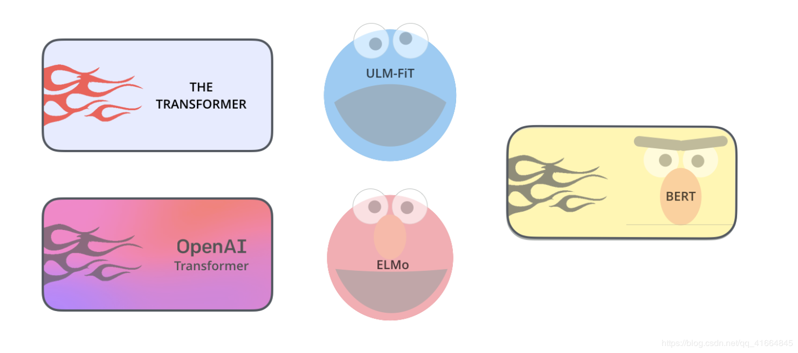

上图中，最新发布的BERT是一个NLP任务的里程碑式模型，它的发布势必会带来一个NLP的新时代。BERT是一个算法模型，它的出现打破了大量的自然语言处理任务的记录。在BERT的论文发布不久后，Google的研发团队还开放了该模型的代码，并提供了一些在大量数据集上预训练好的算法模型下载方式。Google开源这个模型，并提供预训练好的模型，这使得所有人都可以通过它来构建一个涉及NLP的算法模型，节约了大量训练语言模型所需的时间，精力，知识和资源。  


BERT集成了最近一段时间内NLP领域中的一些顶尖的思想，包括但不限于 [Semi-supervised Sequence Learning](https://arxiv.org/abs/1511.01432) (by [Andrew Dai](https://twitter.com/iamandrewdai) and [Quoc Le](https://twitter.com/quocleix)), [ELMo](https://arxiv.org/abs/1802.05365) (by [Matthew Peters](https://twitter.com/mattthemathman) and researchers from [AI2](https://allenai.org/) and [UW CSE](https://www.engr.washington.edu/about/bldgs/cse)), [ULMFiT](https://arxiv.org/abs/1801.06146) (by fast.ai founder [Jeremy Howard](https://twitter.com/jeremyphoward) and [Sebastian Ruder](https://twitter.com/seb_ruder)), and the [OpenAI transformer](https://s3-us-west-2.amazonaws.com/openai-assets/research-covers/language-unsupervised/language_understanding_paper.pdf) (by OpenAI researchers [Radford](https://twitter.com/alecrad), [Narasimhan](https://twitter.com/karthik_r_n), [Salimans](https://twitter.com/timsalimans), and [Sutskever](https://twitter.com/ilyasut)), and the Transformer ([Vaswani et al](https://arxiv.org/pdf/1706.03762.pdf))。

你需要注意一些事情才能恰当的理解BERT的内容，不过，在介绍模型涉及的概念之前可以使用BERT的方法。 

 

## 示例：句子分类

使用BERT最简单的方法就是做一个文本分类模型，这样的模型结构如下图所示：

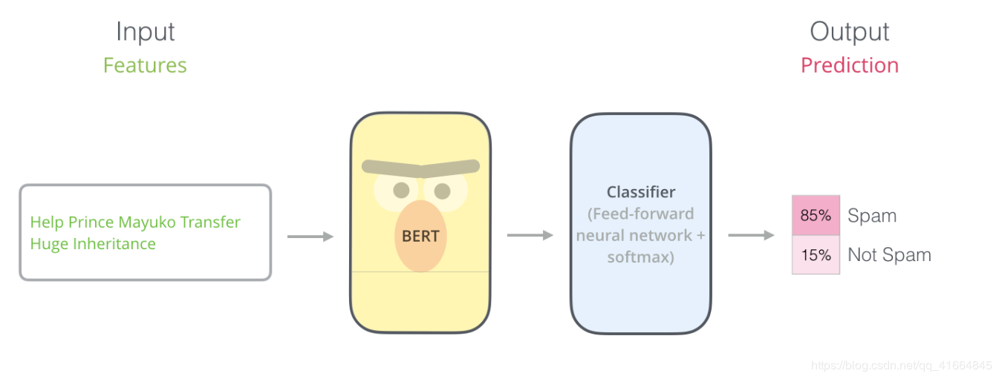

为了训练一个这样的模型，（主要是训练一个分类器），在训练阶段BERT模型发生的变化很小。该训练过程称为**微调**，并且源于 [Semi-supervised Sequence Learning](https://arxiv.org/abs/1511.01432) 和 ULMFiT。

**通用语言模型微调**（Universal Language Model Fine-tuning for Text Classification,ULMFiT）

为了更方便理解，我们下面举一个分类器的例子。分类器是属于监督学习领域的，这意味着你需要一些标记的数据来训练这些模型。对于垃圾邮件分类器的示例，标记的数据集由邮件的内容和邮件的类别2部分组成（类别分为“垃圾邮件”或“非垃圾邮件”）。

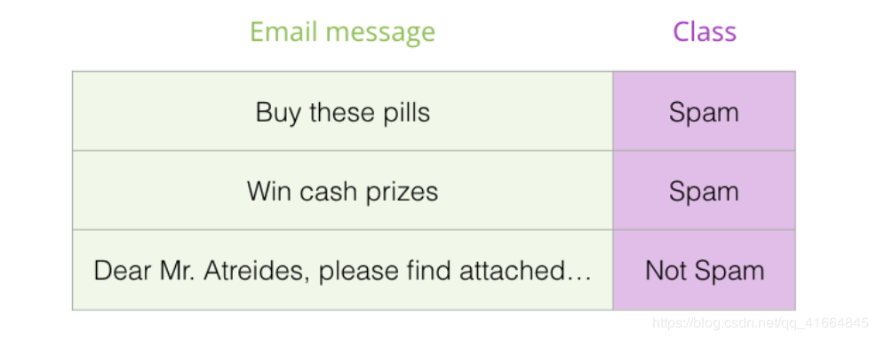

# 模型架构

现在您已经了解了如何使用BERT的示例，让我们仔细了解一下他的工作原理。


BERT的论文中介绍了2种版本：

- **BERT BASE** - 与OpenAI Transformer的尺寸相当，以便比较性能。
- **BERT LARGE** - 一个非常庞大的模型，它完成了本文介绍的最先进的结果。

**BERT的基础集成单元是Transformer的Encoder**。关于Transformer的介绍可以阅读作者之前的文章：[The Illustrated Transformer](https://jalammar.github.io/illustrated-transformer/)，该文章解释了Transformer模型 - BERT的基本概念以及我们接下来要讨论的概念。

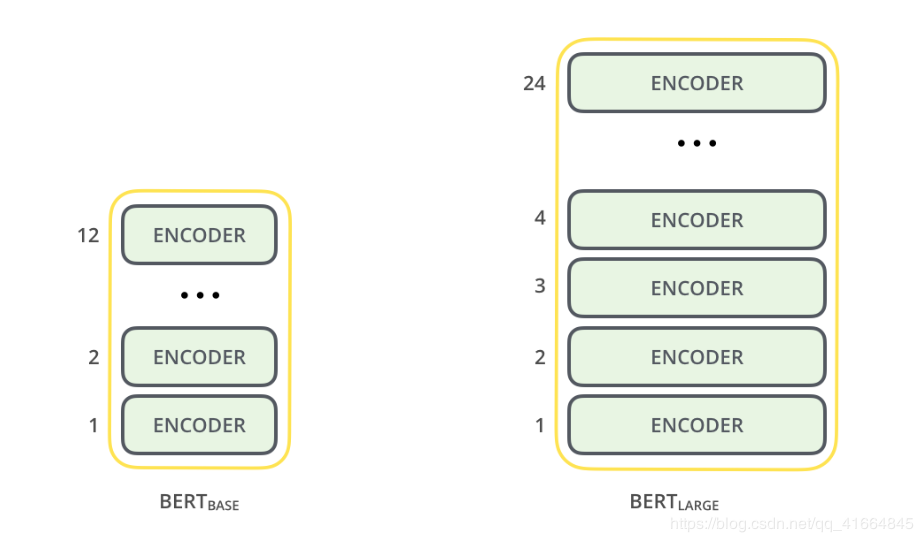

2个BERT的模型都有一个很大的编码器层数，（论文里面将此称为Transformer Blocks） - **基础版本就有12层，进阶版本有24层**。同时它也有很大的前馈神经网络（768和1024个隐藏层神经元），还有很多attention heads（12-16个）。这超过了Transformer论文中的参考配置参数（6个编码器层，512个隐藏层单元，和8个注意头）


# 模型输入

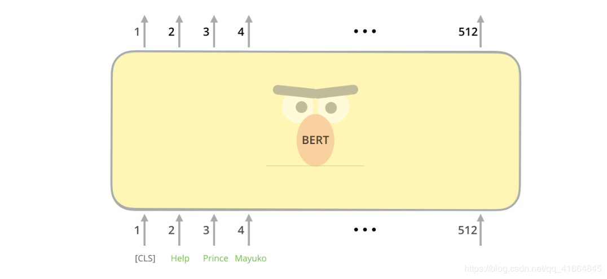

输入的**第一个字符为[CLS]**，在这里字符[CLS]表达的意思很简单 - Classification（分类）。

BERT与Transformer 的编码方式一样。**将固定长度的字符串作为输入，数据由下而上传递计算，每一层都用到了self-attention，并通过前馈神经网络传递其结果，将其交给下一个编码器**。

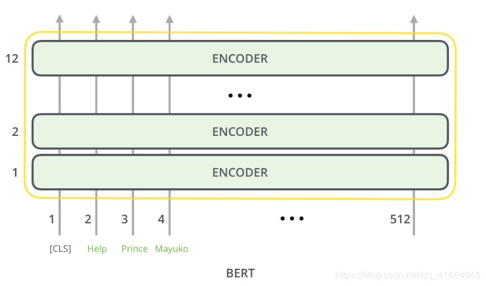

这样的架构，似乎是沿用了Transformer 的架构（除了层数，不过这是我们可以设置的参数）。那么BERT与Transformer 不同之处在哪里呢？可能在模型的输出上，我们可以发现一些端倪。

# 模型输出

每个位置返回的输出都是一个**隐藏层大小**的向量（基本版本BERT为768）。以文本分类为例，我们**重点关注第一个位置上的输出**（第一个位置是分类标识[CLS]） 。如下图：


该向量现在可以用作我们选择的分类器的输入，在论文中指出使用单层神经网络作为分类器就可以取得很好的效果。原理如下：

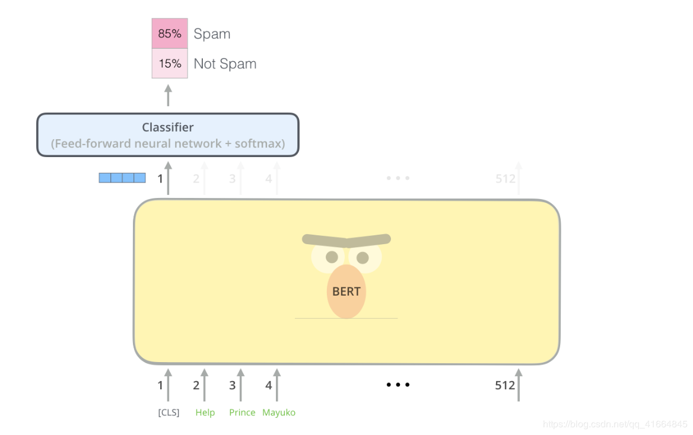

例子中只有垃圾邮件和非垃圾邮件，如果你有更多的label，你只需要增加输出神经元的个数即可，另外把最后的激活函数换成softmax即可。


# Parallels with Convolutional Nets（BERT VS 卷积神经网络）

对于那些具有计算机视觉背景的人来说，这个矢量切换应该让人联想到VGGNet等网络的卷积部分与网络末端的完全连接的分类部分之间发生的事情。你可以这样理解，实质上这样理解也很方便。

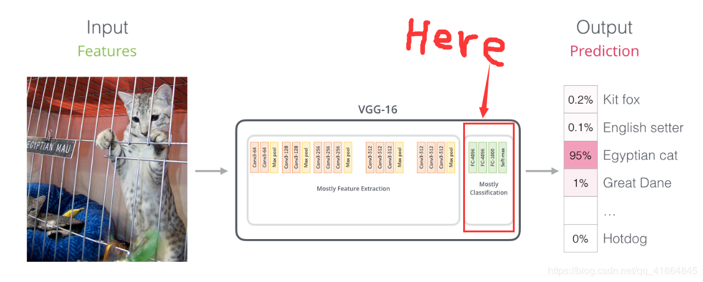

##  词嵌入的新时代

BERT的开源随之而来的是一种词嵌入的更新。到目前为止，词嵌入已经成为NLP模型处理自然语言的主要组成部分。诸如Word2vec和Glove 等方法已经广泛的用于处理这些问题，在我们使用新的词嵌入之前，我们有必要回顾一下其发展。

## Word Embedding Recap

为了让机器可以学习到文本的特征属性，我们需要一些将文本数值化的表示的方式。Word2vec算法通过使用一组固定维度的向量来表示单词，计算其方式可以捕获到单词的语义及单词与单词之间的关系。使用Word2vec的向量化表示方式可以用于判断单词是否相似，对立，或者说判断“男人‘与’女人”的关系就如同“国王”与“王后”。（这些话是不是听腻了〜 emmm水文必备）。另外还能捕获到一些语法的关系，这个在英语中很实用。例如“had”与“has”的关系如同“was”与“is”的关系。

这样的做法，我们可以使用大量的文本数据来预训练一个词嵌入模型，而这个词嵌入模型可以广泛用于其他NLP的任务，这是个好主意，这使得一些初创公司或者计算资源不足的公司，也能通过下载已经开源的词嵌入模型来完成NLP的任务。

更多关于词嵌入的信息，可以阅读我的之前文章：[什么是文本的词嵌入？](https://blog.csdn.net/qq_41664845/article/details/84313419)


## ELMo：语境问题

上面介绍的词嵌入方式有一个很明显的问题，因为使用预训练好的词向量模型，那么**无论上下文的语境关系如何，每个单词都只有一个唯一的且已经固定保存的向量化形式**“。Wait a minute “ - 出自([Peters et. al., 2017](https://arxiv.org/abs/1705.00108), [McCann et. al., 2017](https://arxiv.org/abs/1708.00107), and yet again [Peters et. al., 2018 in the ELMo paper](https://arxiv.org/pdf/1802.05365.pdf) )

> "Wait a minute"这是一个欧美日常梗，示例：
>
>   我：兄弟，你认真学习深度，没准能拿80W年薪啊。
>
>   你：Wait a minute，这么好，你为啥不做。 

这和中文的同音字其实也类似，用这个举一个例子吧， '长' 这个字，在 '长度' 这个词中表示度量，在 '长高' 这个词中表示增加。那么为什么我们不通过”长'周围是度或者是高来判断它的读音或者它的语义呢？嗖嘎，这个问题就派生出语境化的词嵌入模型。

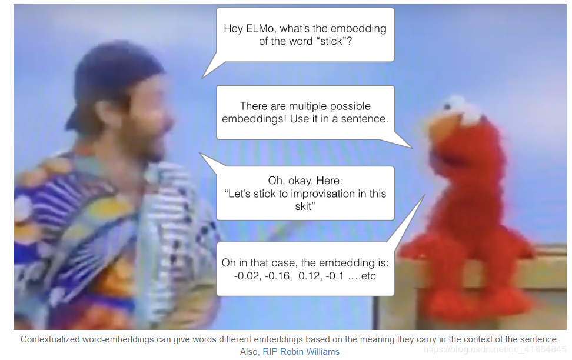

**EMLo改变Word2vec类的将单词固定为指定长度的向量的处理方式，它是在为每个单词分配词向量之前先查看整个句子，然后使用bi-LSTM来训练它对应的词向量**。

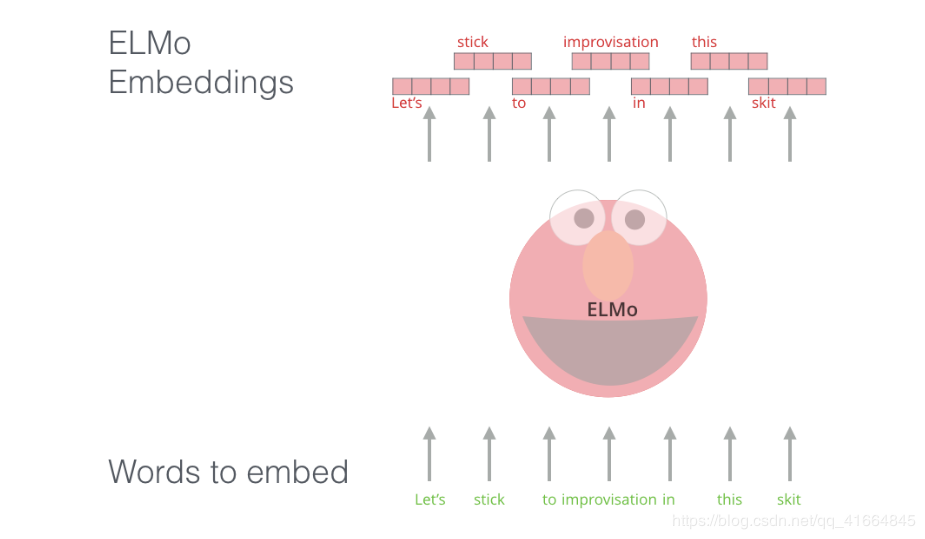

ELMo为解决NLP的语境问题作出了重要的贡献，它的LSTM可以使用与我们任务相关的大量文本数据来进行训练，然后**将训练好的模型用作其他NLP任务的词向量的基准**。

ELMo的秘密是什么？

ELMo会训练一个模型，这个模型接受一个句子或者单词的输入,输出最有可能出现在后面的一个单词。输入法就是这样的道理。这个在NLP中我们也称作Language Modeling。这样的模型很容易实现，因为我们拥有大量的文本数据且我们可以在不需要标签的情况下去学习。


上图介绍了ELMo预训练的过程的步骤的一部分：

我们需要完成一个这样的**任务**：输入“Lets stick to”，预测下一个最可能出现的单词，如果在训练阶段使用大量的数据集进行训练，那么在预测阶段我们可能准确的预测出我们期待的下一个单词。比如输入“机器”，在‘’学习‘和‘买菜’中它最有可能的输出会是‘学习’而不是‘买菜’。

从上图可以发现，每个展开的LSTM都在最后一步完成预测。对了真正的ELMo会更进一步，它不仅能判断下一个词，还能预测前一个词。（Bi-Lstm）

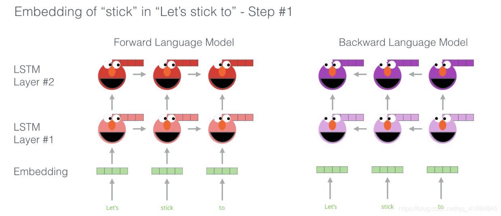

ELMo通过下图的方式将hidden states（的初始的嵌入）组合在一起来提炼出具有语境意义的词嵌入方式（**全连接后加权求和**）


## ULM-FiT：NLP领域应用迁移学习

ULM-FiT机制让模型的预训练参数得到更好的利用。所利用的参数不仅限于embeddings，也不仅限于语境embedding，ULM-FiT引入了Language Model和一个**有效微调该Language Model来执行各种NLP任务的流程**。这使得NLP任务也能像计算机视觉一样方便的使用迁移学习。


## The Transformer：超越LSTM的结构

Transformer论文和代码的发布，以及其在机器翻译等任务上取得的优异成果，让一些研究人员认为它是LSTM的替代品，事实上却是Transformer比LSTM更好的处理long-term dependancies（长依赖）问题。Transformer Encoding和Decoding的结构非常适合机器翻译，但是怎么利用他来做文本分类的任务呢？实际上你只用使用它来预训练可以针对其他任务微调的语言模型即可。


## OpenAI Transformer：用于语言模型的Transformer解码器预训练

事实证明，我们并不需要一个完整的transformer结构来使用迁移学习和一个很好的语言模型来处理NLP任务。我们**只需要Transformer的解码器**就行了。The decoder is a good choice because it’s a natural choice for language modeling (predicting the next word) since it’s built to mask future tokens – a valuable feature when it’s generating a translation word by word.


该模型堆叠了十二个Decoder层。 由于在该设置中没有Encoder，因此这些Decoder将**不具有Transformer Decoder层具有的Encoder - Decoder attention层。 然而，取而代之的是一个self-attention层**（masked so it doesn’t peak at future tokens）。

通过这种结构调整，我们可以继续在相似的语言模型任务上训练模型：使用大量的未标记数据集训练，来预测下一个单词。举个列子：你那7000本书喂给你的模型，（书籍是极好的训练样本~比博客和推文好很多。）训练框架如下：

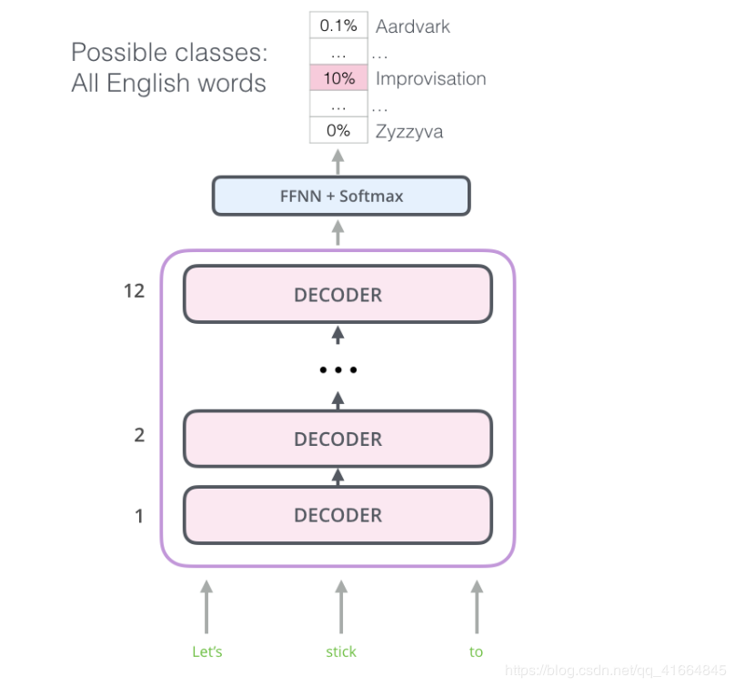

# Transfer Learning to Downstream Tasks

通过OpenAI的transformer的预训练和一些微调后，我们就可以将训练好的模型，用于其他下游NLP任务啦。（比如训练一个语言模型，然后拿他的hidden state来做分类。），下面就介绍一下这个骚操作。（还是如上面例子：分为垃圾邮件和非垃圾邮件）

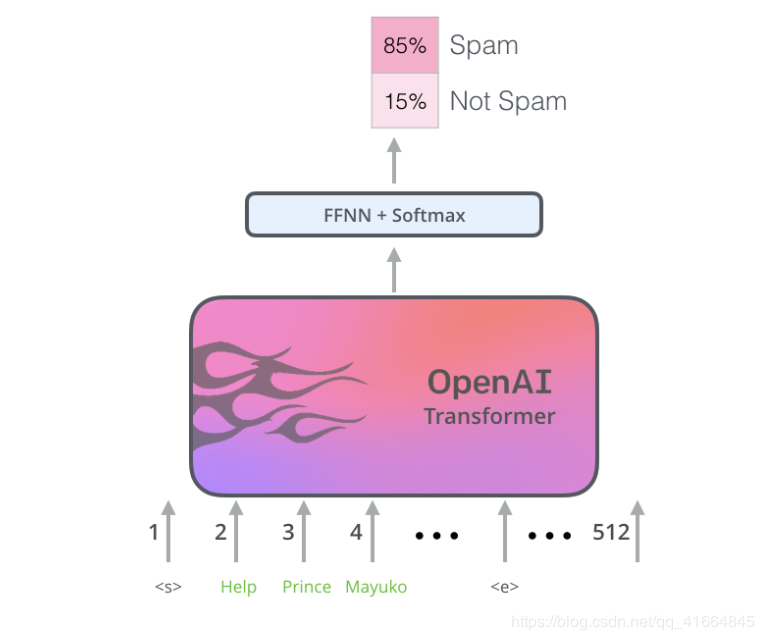

OpenAI论文概述了许多Transformer使用迁移学习来处理不同类型NLP任务的例子。如下图例子所示：

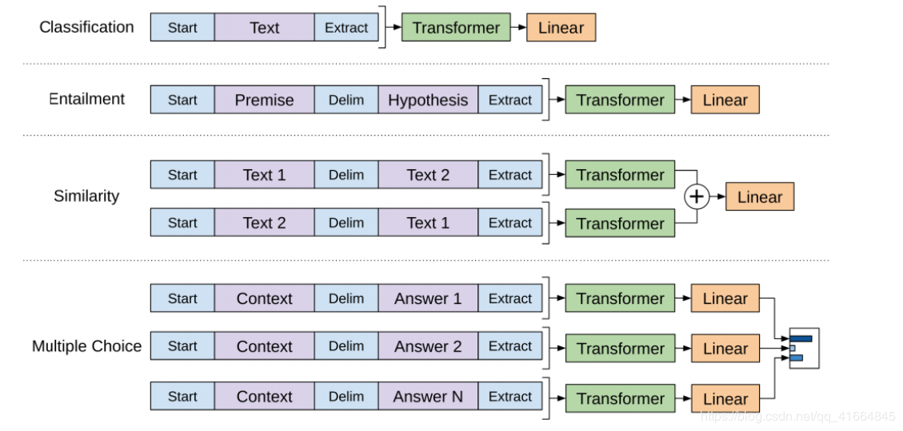

 

# BERT: From Decoders to Encoders

OpenAI transformer为我们提供了基于Transformer的精密的预训练模型。但是从LSTM到Transformer的过渡中，我们发现少了些东西。ELMo的语言模型是双向的，但是**OpenAI的transformer是前向训练的语言模型**。我们能否让我们的Transformer模型也具有Bi-Lstm的特性呢？

R-BERT：“Hold my beer”


## Masked Language Model

BERT说：“我要用 transformer 的 encoders”

Ernie不屑道：“呵呵，你不能像Bi-Lstm一样考虑文章”

BERT自信回答道：“我们会用masks”

> 解释一下Mask：
>
> 语言模型会根据前面单词来预测下一个单词，但是self-attention的注意力只会放在自己身上，那么这样100%预测到自己，毫无意义，所以用Mask，把需要预测的词给挡住。


如下图：

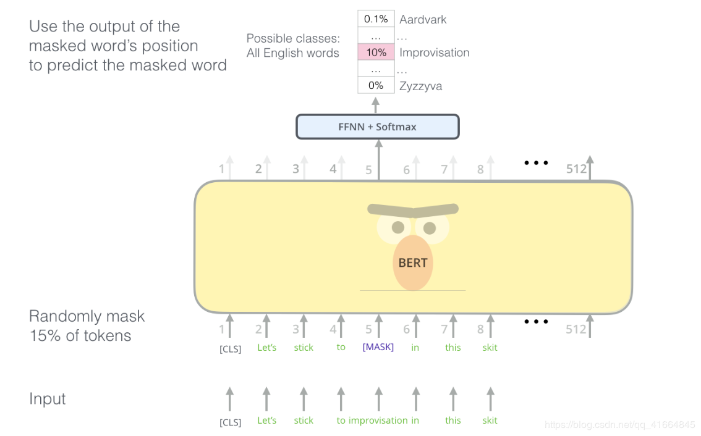


## Two-sentence Tasks

我们回顾一下OpenAI transformer处理不同任务的输入转换，你会发现在某些任务上我们需要2个句子作为输入，并做一些更为智能的判断，比如是否相似，比如 给出一个维基百科的内容作为输入，同时在放入一条针对该条目的问题，那么我们的算法模型能够处理这个问题吗？

为了使BERT更好的处理2个句子之间的关系，预训练的过程还有一个额外的任务：给定2个句子（A和B）,A与B是否相似？（0或者1）


## 特殊NLP任务

BERT的论文为我们介绍了几种BERT可以处理的NLP任务：

1. 短文本相似
2. 文本分类
3. QA机器人
4. 语义标注

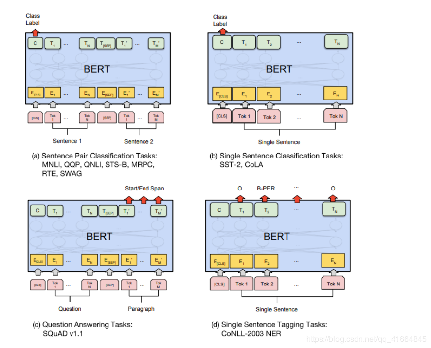

 

## BERT用做特征提取

微调方法并不是使用BERT的唯一方法，就像ELMo一样，你可以使用预选训练好的BERT来创建语境化词嵌入。然后你可以将这些嵌入提供给现有的模型。

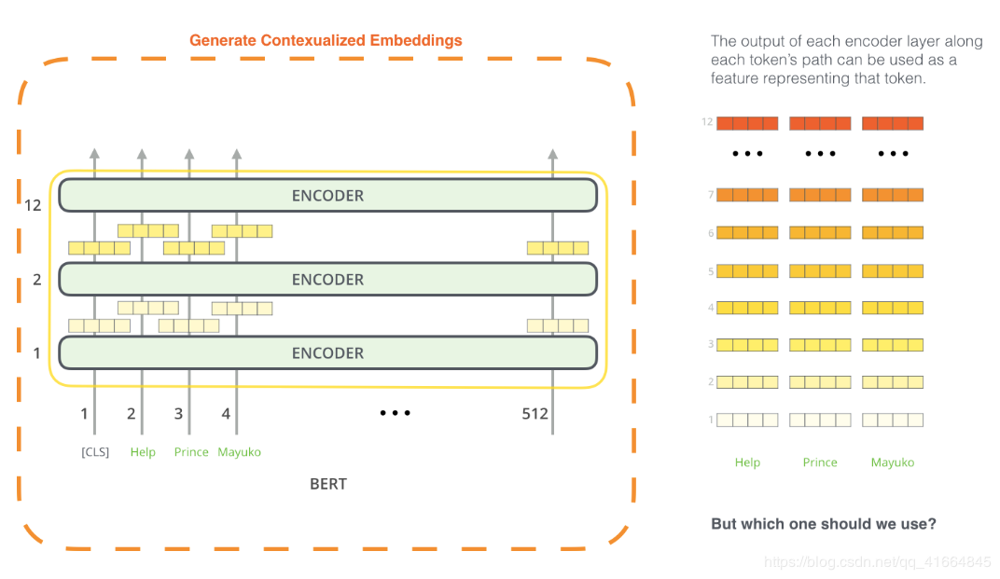

哪个向量最适合作为上下文嵌入？ 我认为这取决于任务。 本文考察了六种选择（与微调模型相比，得分为96.4）：

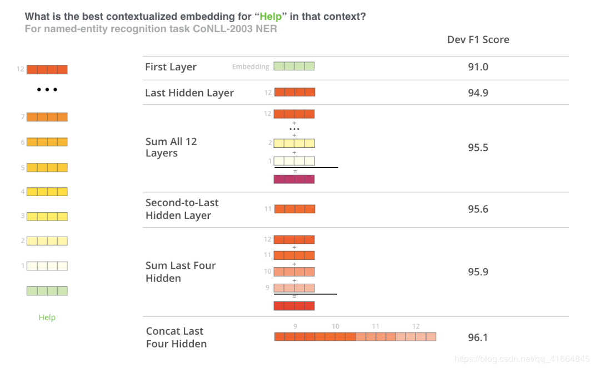

# 如何使用BERT


使用BERT的最佳方式是通过 [BERT FineTuning with Cloud TPUs](https://colab.research.google.com/github/tensorflow/tpu/blob/master/tools/colab/bert_finetuning_with_cloud_tpus.ipynb) 谷歌云上托管的笔记。如果你未使用过谷歌云TPU可以试试看，这是个不错的尝试。另外BERT也适用于TPU，CPU和GPU

下一步是查看BERT仓库中的代码：

1. 该模型在modeling.py（BertModel类）中构建，与vanilla Transformer编码器完全相同。
2. run_classifier.py是微调过程的一个示例。它还构建了监督模型的分类层。如果要构建自己的分类器，请查看该文件中的create_model()方法。
3. 可以下载几种预先训练的模型。涵盖102种语言的多语言模型，这些语言都是在维基百科的数据基础上训练而成的。
4. BERT不会将单词视为tokens。相反，它注重WordPieces。 tokenization.py是将你的单词转换为适合BERT的wordPieces的tokensizer。

您还可以查看[BERT的PyTorch实现](https://github.com/huggingface/pytorch-pretrained-BERT)。[ AllenNLP](https://github.com/allenai/allennlp)库使用此实现允许将BERT嵌入与任何模型一起使用。

 

# 试题

## 为什么BERT选择mask掉15%这个比例的词，可以是其他的比例吗

BERT采用的Masked LM，会选取语料中所有词的15%进行随机mask，论文中表示是受到完形填空任务的启发，但其实**与CBOW也有异曲同工之妙**。

从CBOW的角度，这里p=15%有一个比较好的解释是：在一个大小为1/p = 100 / 15 ≈ 7 的窗口中随机选一个词，类似CBOW中滑动窗口的中心词，区别是这里的滑动窗口是非重叠的。

那从CBOW的滑动窗口角度，10%~20%都是还ok的比例。

上述非官方解释，是来自我的一位朋友提供的一个理解切入的角度，供参考。


## 使用BERT预训练模型为什么最多只能输入512个词，最多只能两个句子合成一句？

这是Google BERT预训练模型初始设置的原因，前者对应Position Embeddings，后者对应Segment Embeddings


在BERT中，Token，Position，Segment Embeddings **都是通过学习来得到的**，pytorch代码中它们是这样的

```python
self.word_embeddings = Embedding(config.vocab_size, config.hidden_size)
self.position_embeddings = Embedding(config.max_position_embeddings, config.hidden_size)
self.token_type_embeddings = Embedding(config.type_vocab_size, config.hidden_size)
```

上述BERT pytorch代码来自:[https://github.com/xieyufei1993/Bert-Pytorch-Chinese-TextClassification](https://link.zhihu.com/?target=https%3A//github.com/xieyufei1993/Bert-Pytorch-Chinese-TextClassification)，结构层次非常清晰。

而在BERT config中

```python
"max_position_embeddings": 512
"type_vocab_size": 2
```

因此，在直接使用Google 的BERT预训练模型时，输入最多512个词（还要除掉[CLS]和[SEP]），最多两个句子合成一句。这之外的词和句子会没有对应的embedding。

当然，如果有足够的硬件资源自己重新训练BERT，可以更改 BERT config，设置更大max_position_embeddings 和 type_vocab_size值去满足自己的需求。


## 为什么BERT在第一句前会加一个[CLS]标志?

BERT在第一句前会加一个[CLS]标志，最后一层该位对应向量可以作为整句话的语义表示，从而用于下游的分类任务等。

为什么选它呢，因为与文本中已有的其它词相比，这个无明显语义信息的符号会**更“公平”地融合文本中各个词的语义信息**，从而更好的表示整句话的语义。

这里补充一下bert的输出，有两种：

1. 一种是get_pooled_out()，就是上述[CLS]的表示，输出shape是[batch size,hidden size]。
2. 一种是get_sequence_out()，获取的是整个句子每一个token的向量表示，输出shape是[batch_size, seq_length, hidden_size]，这里也包括[CLS]，因此在做token级别的任务时要注意它。


## BERT非线性的来源在哪里？

前馈层的gelu激活函数和self-attention，self-attention是非线性的


## BERT的三个Embedding直接相加会对语义有影响吗？

参考：https://www.zhihu.com/question/374835153


## 在BERT应用中，如何解决长文本问题？

参考：https://www.zhihu.com/question/327450789


# 参考资料

1. https://blog.csdn.net/qq_41664845/article/details/84787969
2. https://jalammar.github.io/illustrated-bert/