# 前言

[原文](https://blog.zhangxiann.com/202009171846/)

本文翻译自：http://jalammar.github.io/illustrated-bert/。

通俗易懂，非常适合刚刚开始了解 Bert 的同学。

BERT 来源于 Transformer，如果你不知道 Transformer 是什么，你可以查看 [图解 Transformer](https://zhuanlan.zhihu.com/p/196642078)。

2018 年是机器学习模型处理文本（或者更准确地说，自然语言处理或 NLP）的转折点。如何用最恰当的形式来表示单词和句子，从而最准确地捕捉它们基本语义和关系？我们对这些问题的研究正在迅速发展。此外，NLP 社区已经发布了一些非常强大的组件，你可以免费下载，并在自己的模型和 pipeline 中使用（今年，可以说是 NLP 的 ImageNet 时刻，这句话指的是：多年前类似的发展，也加速了机器学习在计算机视觉任务中的应用）。

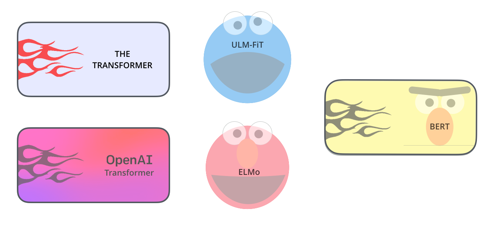

ULM-FiT 与 Cookie Monster（饼干怪兽）无关。但我想不出别的了...

[BERT](https://github.com/google-research/bert) 的 [发布](https://ai.googleblog.com/2018/11/open-sourcing-bert-state-of-art-pre.html) 是这个领域发展的最新的里程碑之一，这个事件 [标志着](https://twitter.com/lmthang/status/1050543868041555969) NLP 新时代的开始。BERT 模型打破了语言处理任务中的几个记录。在 BERT 的论文发布后不久，这个团队还公开了模型的代码，并提供了模型的下载版本，这些模型已经在大规模数据集上进行了预训练。这是一个重大的发展里程碑，因为它使得任何一个构建机器学习模型来处理语言任务的人，都可以将这个强大的功能作为一个现成的组件来使用，从而节省了从零开始训练语言处理模型所需要的时间、精力、知识和资源。

BERT 开发的两个步骤。第 1 步，你可以下载预训练好的模型（这个模型是在无标注的数据上训练的）。然后在第 2 步只需要关心模型微调即可。

BERT 建立在 NLP 社区最近出现的一些聪明的方法之上，包括但不限于： [Semi-supervised Sequence Learning](https://arxiv.org/abs/1511.01432) ([Andrew Dai](https://twitter.com/iamandrewdai) 和 [Quoc Le](https://twitter.com/quocleix)), [ELMo](https://arxiv.org/abs/1802.05365) ([Matthew Peters](https://twitter.com/mattthemathman) 和来自于 [AI2](https://allenai.org/)、[UW CSE](https://www.engr.washington.edu/about/bldgs/cse) 的研究), [ULMFiT](https://arxiv.org/abs/1801.06146) (fast.ai 的创始人 [Jeremy Howard](https://twitter.com/jeremyphoward) 和 [Sebastian Ruder](https://twitter.com/seb_ruder)), the [OpenAI Transformer](https://s3-us-west-2.amazonaws.com/openai-assets/research-covers/language-unsupervised/language_understanding_paper.pdf) (OpenAI 研究员 [Radford](https://twitter.com/alecrad), [Narasimhan](https://twitter.com/karthik_r_n), [Salimans](https://twitter.com/timsalimans) 和 [Sutskever](https://twitter.com/ilyasut)) 和 the Transformer ([Vaswani et al](https://arxiv.org/pdf/1706.03762.pdf)).。

你需要了解一些概念，才能理解 BERT 是什么。因此，在介绍模型本身涉及的概念之前，让我们先看看如何使用 BERT。

# 示例：句子分类

使用 BERT 最直接的方法就是对一个句子进行分类。这个模型如下所示：

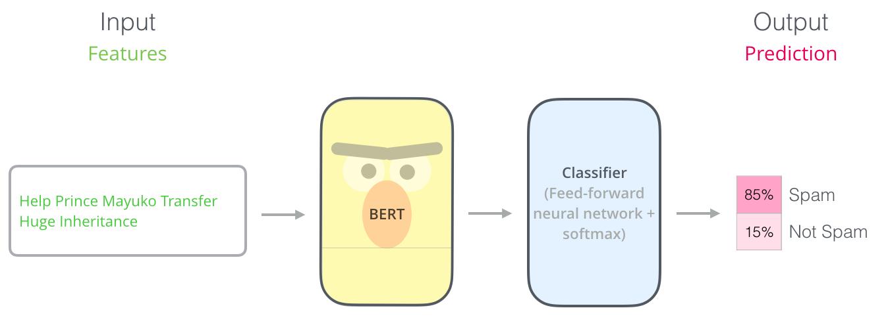

为了训练这样一个模型，你主要需要训练分类器（上图中的 Classifier），在训练过程中几乎不用改动 BERT 模型。这个训练过程称为微调，它起源于 [Semi-supervised Sequence Learning](https://arxiv.org/abs/1511.01432) 和 ULMFiT。

由于我们在讨论分类器，这属于机器学习的监督学习领域。这意味着我们需要一个带有标签的数据集来训练这样一个模型。例如，在下面这个垃圾邮件分类器的例子中，带有标签的数据集包括一个邮件内容列表和对应的标签（每个邮件是“垃圾邮件”或者“非垃圾邮件”）。

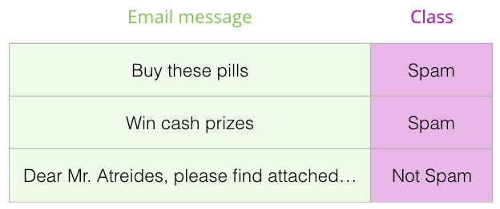

其他一些例子包括：

- 语义分析
	- 输入：电影或者产品的评价内容。输出：判断这个评价内容是正面的还是负面的。
	- 数据集例子：[SST](https://nlp.stanford.edu/sentiment/)
- Fact-checking
	- 输入：一个句子。输出：这个句子是不是一个断言。
	- 参考视频：[Sentence embeddings for automated factchecking - Lev Konstantinovskiy](https://www.youtube.com/watch?v=ddf0lgPCoSo)。

# 模型架构

现在你已经通过上面的例子，了解了如何使用 BERT，接下来让我们更深入地了解一下它的工作原理。

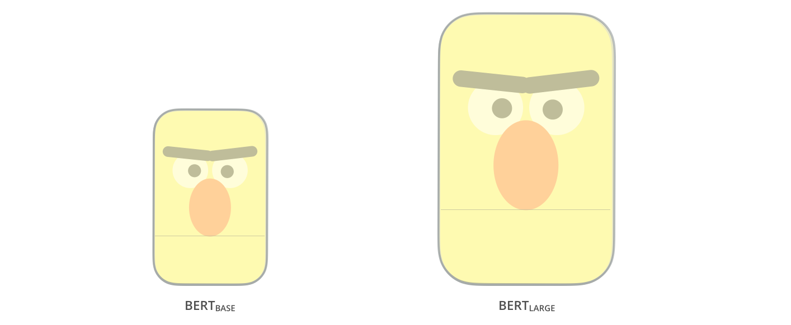

论文里介绍了两种不同模型大小的 BERT：

- BERT BASE - 与 OpenAI 的 Transformer 大小相当，方便比较性能
- BERT LARGE - 一个非常巨大的模型，它取得了最先进的结果

BERT 基本上是一个训练好的 Transformer 的 Decoder 的栈。关于 Transformer 的介绍，可以阅读之前的文章 [图解 Transformer](https://zhuanlan.zhihu.com/p/196642078)，这里主要介绍 Transformer 模型，这是 BERT 中的一个基本概念。此外，我们还会介绍其他一些概念。

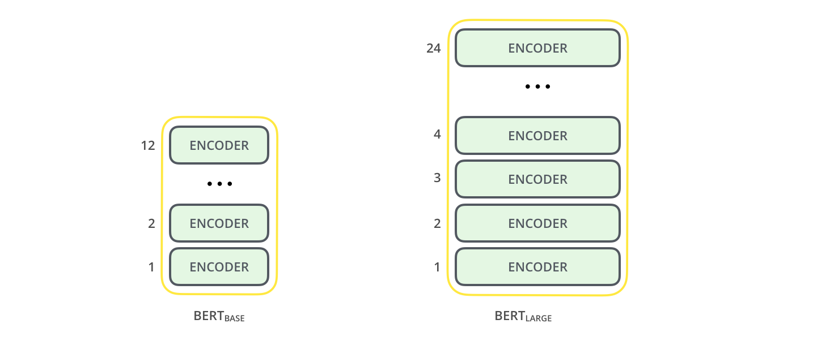

2 种不同大小规模的 BERT 模型都有大量的 Encoder 层（论文里把这些层称为 Transformer Blocks）- BASE 版本由 12 层 Encoder，Large 版本有 20 层 Encoder。同时，这些 BERT 模型也有更大的前馈神经网络（分别有 768 个和 1024 个隐藏层单元）和更多的 attention heads（分别有 12 个和 16 个），超过了原始 Transformer 论文中的默认配置参数（原论文中有 6 个 Encoder 层， 512 个隐藏层单元和 8 个 attention heads）。

## 模型输入

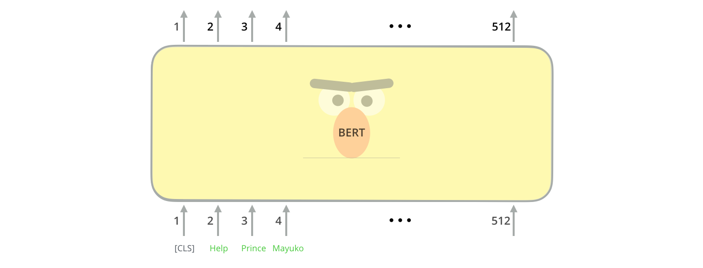

第一个输入的 token 是特殊的 [CLS]，它的含义是分类（class 的缩写）。

就像 Transformer 中普通的 Encoder 一样，BERT 将一串单词作为输入，这些单词在 Encoder 的栈中不断向上流动。每一层都会经过 Self Attention 层，并通过一个前馈神经网络，然后将结果传给下一个 Encoder。

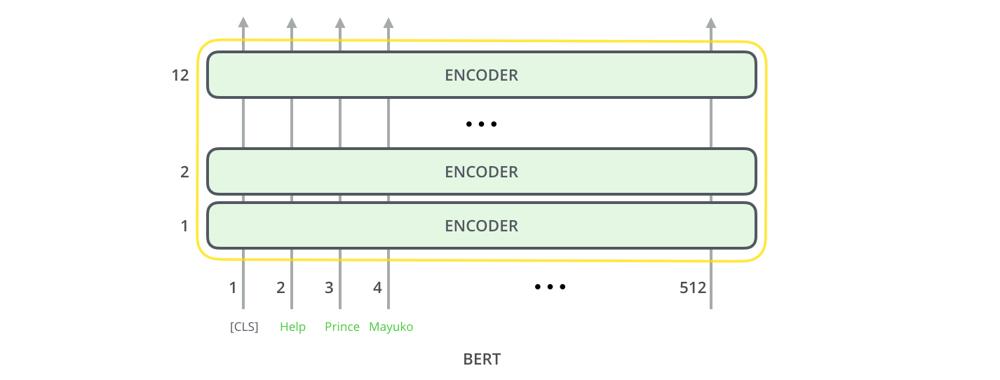

在模型架构方面，到目前为止，和 Transformer 是相同的（除了模型大小，因为这是我们可以改变的参数）。我们会在下面看到，BERT 和 Transformer 在模型的输出上有一些不同。

## 模型输出

每个位置输出一个大小为 hidden_size（在 BERT Base 中是 768）的向量。对于上面提到的句子分类的例子，我们只关注第一个位置的输出（输入是 [CLS] 的那个位置）。

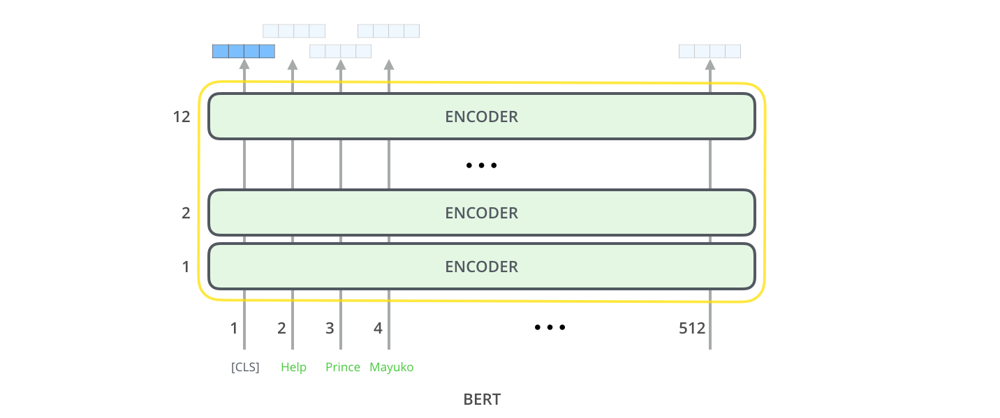

这个输出的向量现在可以作为后面分类器的输入。论文里用单层神经网络作为分类器，取得了很好的效果。

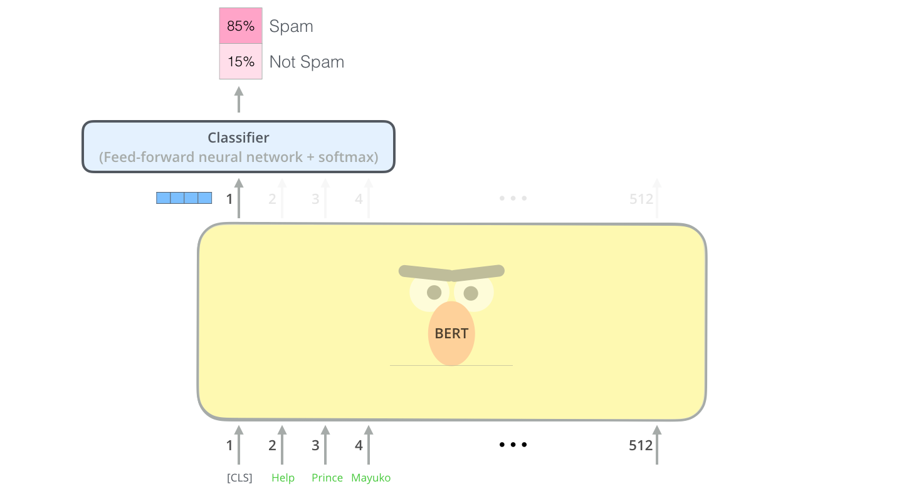

如果你有更多标签（例如你是一个电子邮件服务，需要将邮件标记为 “垃圾邮件”、“非垃圾邮件”、“社交”、“推广”），你只需要调整分类器的神经网络，增加输出的神经元个数，然后经过 softmax 即可。

# 与卷积神经网络进行对比

对于那些有计算机视觉背景的人来说，这个向量传递过程，会让人联想到 VGGNet 等网络的卷积部分，和网络最后的全连接分类部分之间的过程。

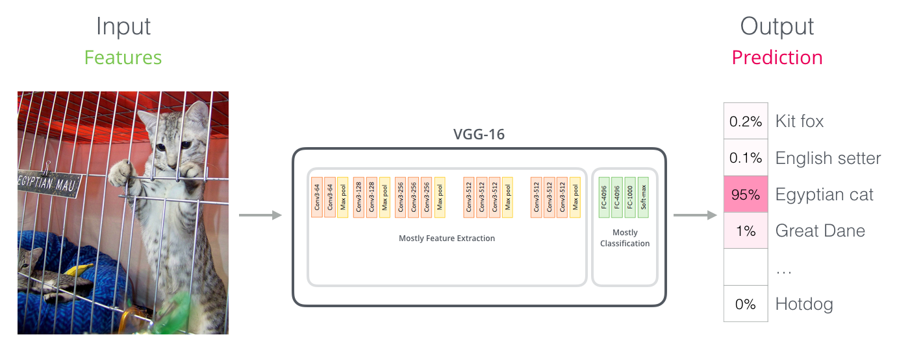

# 词嵌入（Embedding）的新时代

上面提到的这些新发展带来了文本编码方式的新转变。到目前为止，词嵌入一直是 NLP 模型处理语言的主要表示方法。像 Word2Vec 和 Glove 这样的方法已经被广泛应用于此类任务。在我们讨论新的方法之前，让我们回顾一下它们是如何应用的。

## 回顾词嵌入

单词不能直接输入机器学习模型，而需要某种数值表示形式，以便模型能够在计算中使用。通过 Word2Vec，我们可以使用一个向量（一组数字）来恰当地表示单词，并捕捉单词的语义以及单词和单词之间的关系（例如，判断单词是否相似或者相反，或者像 "Stockholm" 和 "Sweden" 这样的一对词，与 "Cairo" 和 "Egypt"这一对词，是否有同样的关系）以及句法、语法关系（例如，"had" 和 "has" 之间的关系与 "was" 和 "is" 之间的关系相同）。

人们很快意识到，相比于在小规模数据集上和模型一起训练词嵌入，更好的一种做法是，在大规模文本数据上预训练好词嵌入，然后拿来使用。因此，我们可以下载由 Word2Vec 和 GloVe 预训练好的单词列表，及其词嵌入。下面是单词 "stick" 的 Glove 词嵌入向量的例子（词嵌入向量长度是 200）。

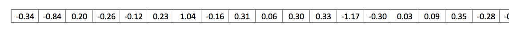

单词 "stick" 的 Glove 词嵌入 - 这是由200个浮点数组成的向量（四舍五入到小数点后两位）。

由于这些向量都很长，且全部是数字，所以在文章中我使用以下基本形状来表示词嵌入向量：

# ELMo：解决上下文语境问题

如果我们使用 Glove 的词嵌入表示方法，那么不管上下文是什么，单词 "stick" 都只表示为同一个向量。一些研究人员([Peters et. al., 2017](https://arxiv.org/abs/1705.00108), [McCann et. al., 2017](https://arxiv.org/abs/1708.00107), [Peters et. al., 2018 in the ELMo paper](https://arxiv.org/pdf/1802.05365.pdf) ) 指出，像 "stick" 这样的词有多种含义。为什么不能根据它使用的上下文来学习对应的词嵌入呢？这样既能捕捉单词的语义信息，又能捕捉上下文的语义信息。于是，语境化的词嵌入模型应运而生。

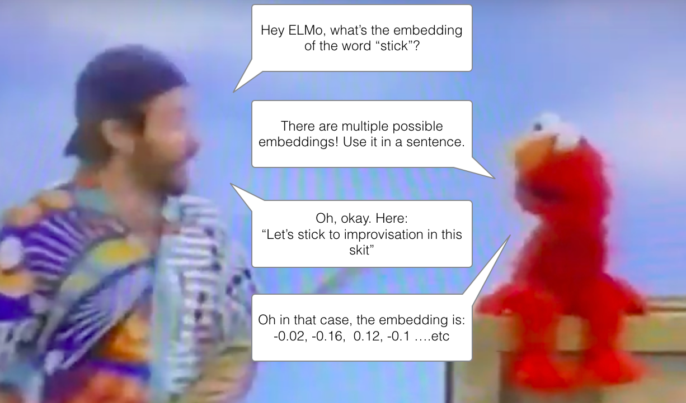

语境化的词嵌入，可以根据单词在句子语境中的含义，赋予不同的词嵌入。你可以查看这个视频的讲解 [RIP Robin Williams](https://blog.zhangxiann.com/202009171846/RIP Robin Williams)

ELMo 没有对每个单词使用固定的词嵌入，而是在为每个词分配词嵌入之前，查看整个句子，融合上下文信息。它使用在特定任务上经过训练的双向 LSTM 来创建这些词嵌入。

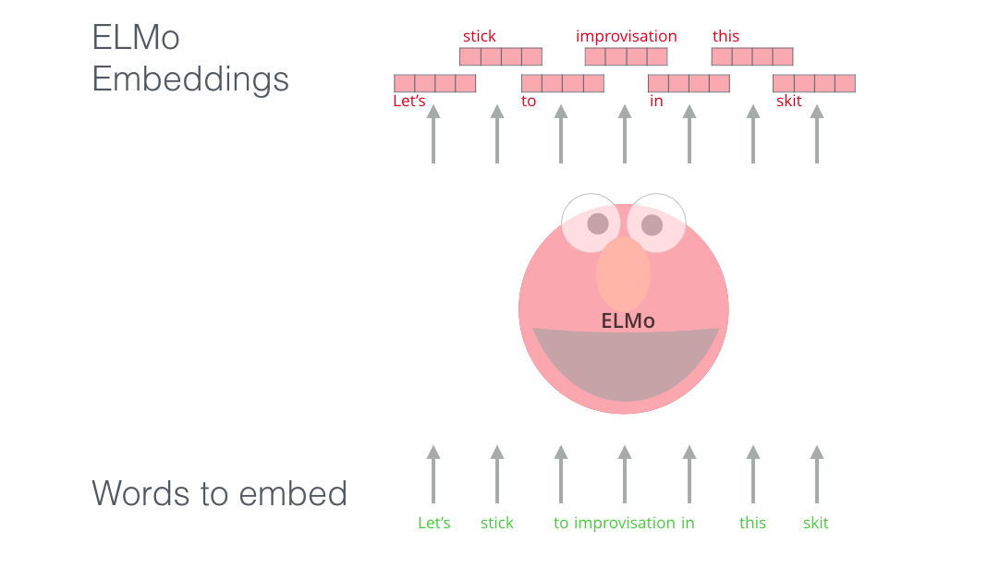

ELMo 在语境化的预训练这条道路上迈出了重要的一步。ELMo LSTM 会在一个大规模的数据集上进行训练，然后我们可以将它作为其他语言处理模型的一个部分，来处理自然语言任务。

那么 ELMo 的秘密是什么呢？

ELMo 通过训练，预测单词序列中的下一个词，从而获得了语言理解能力，这项任务被称为语言建模。要实现 ELMo 很方便，因为我们有大量文本数据，模型可以从这些数据中学习，而不需要额外的标签。

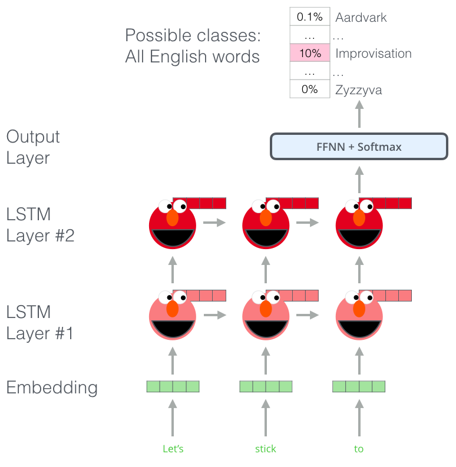

ELMo 预训练过程的其中一个步骤：以 "Let’s stick to" 作为输入，预测下一个最有可能的单词。这是一个语言建模任务。当我们在大规模数据集上训练时，模型开始学习语言的模式。例如，在 "hang" 这样的词之后，模型将会赋予 "out" 更高的概率（因为 "hang out" 是一个词组），而不是 "camera"。

在上图中，我们可以看到 ELMo 头部上方展示了 LSTM 的每一步的隐藏层状态向量。在这个预训练过程完成后，这些隐藏层状态在词嵌入过程中派上用场。

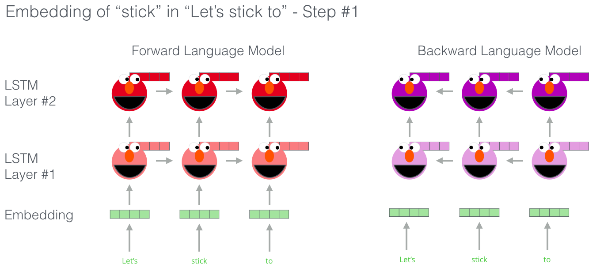

这是一个讲解 ELMo 的 [的 PPT](https://www.slideshare.net/shuntaroy/a-review-of-deep-contextualized-word-representations-peters-2018)

ELMo 通过将隐藏层状态（以及初始化的词嵌入）以某种方式（向量拼接之后加权求和）结合在一起，实现了带有语境化的词嵌入。

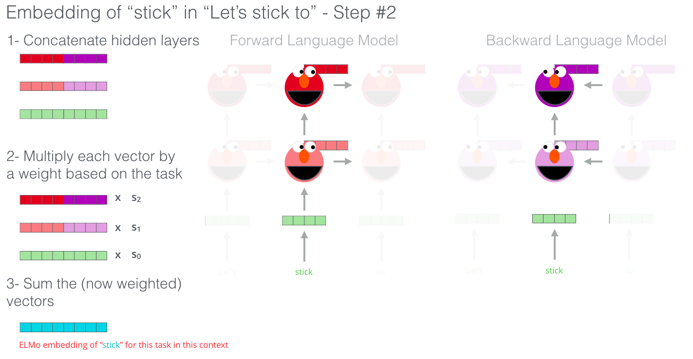

# ULM-FiT：搞懂 NLP 领域的迁移学习

ULM-FiT 提出了一些方法来有效地利用模型在预训练期间学习到的东西 - 这些东西不仅仅是词嵌入，还有语境化的词嵌入。ULM-FiT 提出了一个语言模型和一套流程，可以有效地为各种任务微调这个语言模型。

现在，NLP 可能终于找到了好的方法，可以像计算机视觉那样进行迁移学习了。

# Transformer：超越 LSTM

Transformer 论文和代码的发布，以及它在机器翻译等任务上取得的成果，开始让人们认为它是 LSTM 的替代品。这是因为 Transformer 可以比 LSTM 更好地处理长期依赖。

Transformer 的 Encoder-Decoder 结构使得它非常适合机器翻译。但你怎么才能用它来做文本分类呢？你怎么才能使用它来预训练一个语言模型，并能够在其他任务上进行微调（下游任务是指那些能够利用预训练模型的监督学习任务）？

# OpenAI Transformer：预训练一个 Transformer Decoder 来进行语言建模

事实证明，我们不需要一个完整的 Transformer 来进行迁移学习和微调。我们只需要 Transformer 的 Decoder 就可以了。Decoder 是一个很好的选择，用它来做语言建模（预测下一个词）是很自然的，因为它可以屏蔽后来的词 。当你使用它进行逐词翻译时，这是个很有用的特性。

OpenAI Transformer 是由 Transformer 的 Decoder 堆叠而成的

这个模型包括 12 个 Decoder 层。因为在这种设计中没有 Encoder，这些 Decoder 层不会像普通的 Transformer 中的 Decoder 层那样有 Encoder-Decoder Attention 子层。不过，它仍然会有 Self Attention 层（这些层使用了 mask，因此不会看到句子后来的 token）。

有了这个结构，我们可以继续在同样的语言建模任务上训练这个模型：使用大规模未标记的数据来预测下一个词。只需要把 7000 本书的文字扔给模型 ，然后让它学习。书籍非常适合这种任务，因为书籍的数据可以使得模型学习到相关联的信息。如果你使用 tweets 或者文章来训练，模型是得不到这些信息的。

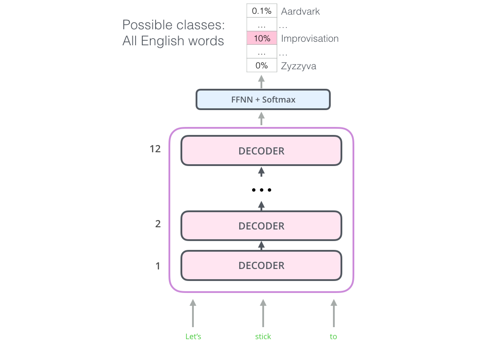

上图表示：OpenAI Transformer 在 7000 本书的组成的数据集中预测下一个单词

# 在下游任务使用迁移学习

现在，OpenAI Transformer 已经经过了预训练，它的网络层经过调整，可以很好地处理文本语言，我们可以开始使用它来处理下游任务。让我们先看下句子分类任务（把电子邮件分类为 ”垃圾邮件“ 或者 ”非垃圾邮件“）：

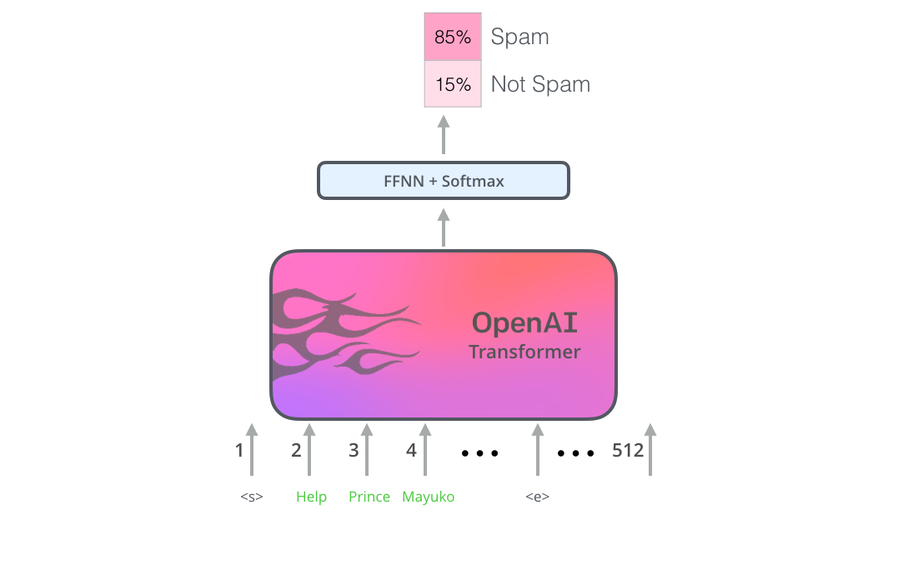

使用 OpenAI Transformer 来做句子分类

OpenAI 的论文列出了一些列输入变换方法，来处理不同任务类型的输入。下面这张图片来源于论文，展示了执行不同任务的模型结构和对应输入变换。这些都是非常很巧妙的做法。

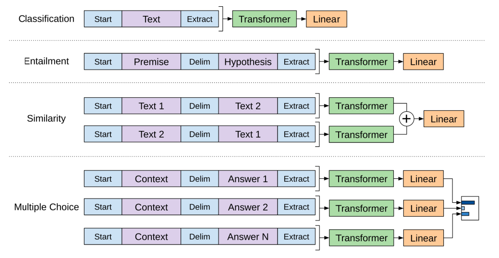

# BERT：从 Decoder 到 Encoder

OpenAI Transformer 为我们提供了一个基于 Transformer 的可以微调的预训练网络。但是在把 LSTM 换成 Transformer 的过程中，有些东西丢失了。ELMo 的语言模型是双向的，但 OpenAI Transformer 只训练了一个前向的语言模型。我们是否可以构建一个基于 Transformer 的语言模型，它既向前看，又向后看（用技术术语来说 - 融合上文和下文的信息）。

# Masked Language Model（MLM 语言模型）

那么如何才能像 LSTM 那样，融合上文和下文的双向信息呢？

一种直观的想法是使用 Transformer 的 Encoder。但是 Encoder 的 Self Attention 层，每个 token 会把大部分注意力集中到自己身上，那么这样将容易预测到每个 token，模型学不到有用的信息。BERT 提出使用 mask，把需要预测的词屏蔽掉。

下面这段风趣的对话是博客原文的。

> BERT 说，“我们要用 Transformer 的 Encoder”。

> Ernie 说，”这没什么用，因为每个 token 都会在多层的双向上下文中看到自己“。

> BERT 自信地说，”我们会使用 mask“。

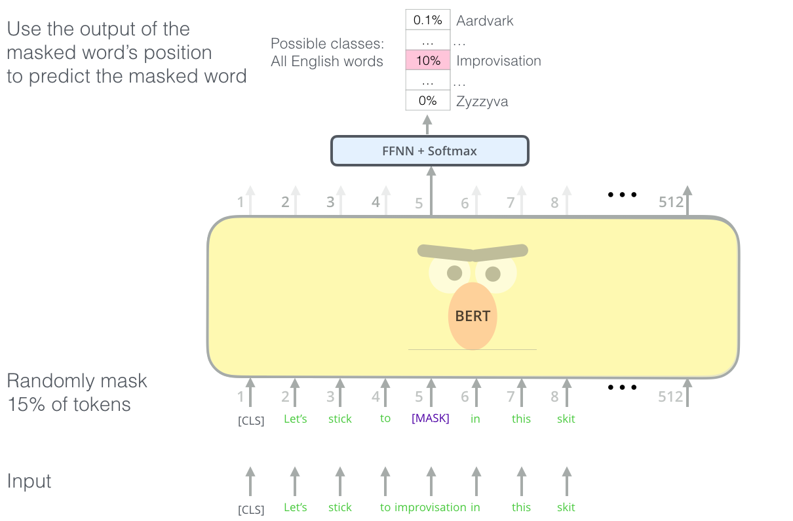

BERT 在语言建模任务中，巧妙地屏蔽了输入中 15% 的单词，并让模型预测这些屏蔽位置的单词

找到合适的任务来训练一个 Transformer 的 Encoder 是一个复杂的问题，BERT 通过使用早期文献中的 "masked language model" 概念（在这里被称为完形填空）来解决这个问题。

除了屏蔽输入中 15% 的单词外， BERT 还混合使用了其他的一些技巧，来改进模型的微调方式。例如，有时它会随机地用一个词替换另一个词，然后让模型预测这个位置原来的实际单词。

# 两个句子的任务

如果你回顾 OpenAI Transformer 在处理不同任务时所做的输入变换，你会注意到有些任务需要模型对两个句子的信息做一些处理（例如，判断它们是不是同一句话的不同解释。将一个维基百科条目作为输入，再将一个相关的问题作为另一个输入，模型判断是否可以回答这个问题）。

为了让 BERT 更好地处理多个句子之间的关系，预训练过程还包括一个额外的任务：给出两个句子（A 和 B），判断 B 是否是 A 后面的相邻句子。

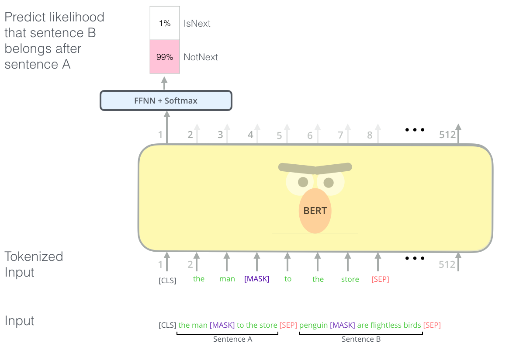

BERT 预训练的第 2 个任务是两个句子的分类任务。在上图中，tokenization 这一步被简化了，因为 BERT 实际上使用了 WordPieces 作为 token，而不是使用单词本身。在 WordPiece 中，有些词会被拆分成更小的部分。

# BERT 在不同任务上的应用

BERT 的论文展示了 BERT 在多种任务上的应用。

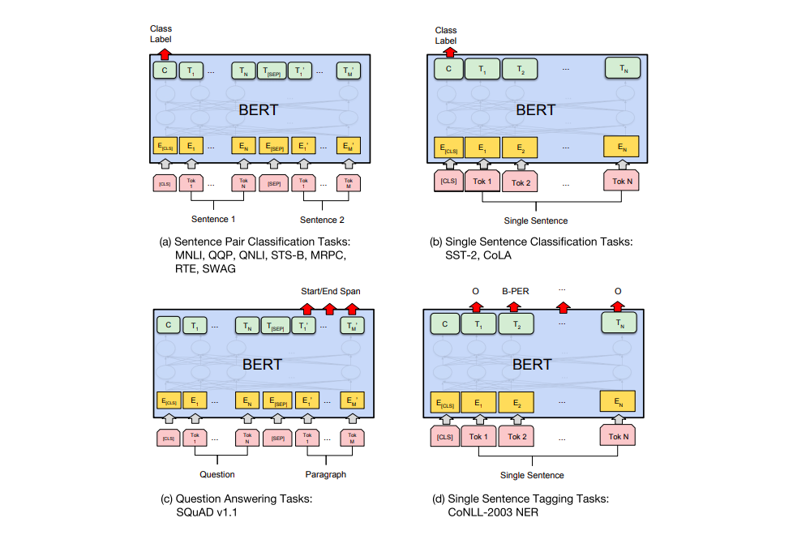

# 将 BERT 用于特征提取

使用 BERT 并不是只有微调这一种方法。就像 ELMo 一样，你可以使用预训练的 BERT 来创建语境化的词嵌入。然后你可以把这些词嵌入用到你现有的模型中。论文里也提到，这种方法在命名实体识别任务中的效果，接近于微调 BERT 模型的效果。

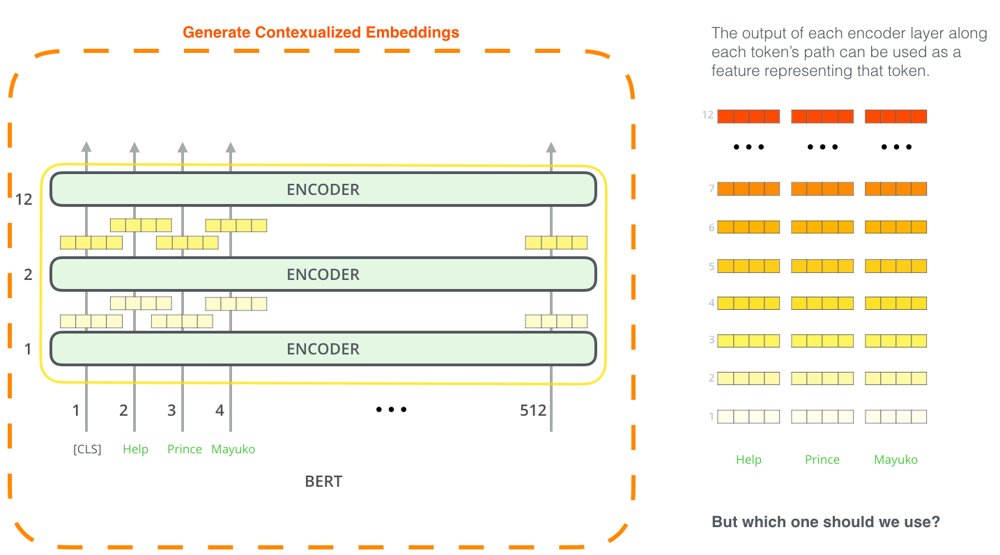

那么哪种向量最适合作为上下文词嵌入？我认为这取决于任务。论文里验证了 6 种选择（与微调后的 96.4 分的模型相比）：

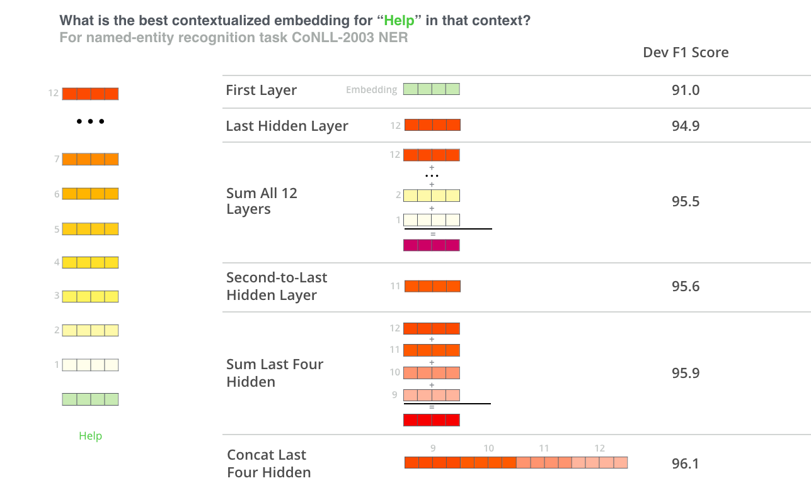

# 如何使用 BERT

学习 BERT 的最佳方式是通过托管在 Google Colab 上的 [BERT FineTuning with Cloud TPUs](https://colab.research.google.com/github/tensorflow/tpu/blob/master/tools/colab/bert_finetuning_with_cloud_tpus.ipynb)。如果你之前从来没有使用过 Cloud TPU，那这也是尝试它们的一个很好的开端，而且 BERT 代码可以运行在 TPU、CPU 和 GPU 上。

下一步可以看看 [BERT 仓库](https://github.com/google-research/bert) 中的代码实现：

- 模型是在 [modeling.py](https://github.com/google-research/bert/blob/master/modeling.py)（`class BertModel`）中定义的，和原生的 Transformer Encoder 完全相同。
- [run_classifier.py](https://github.com/google-research/bert/blob/master/run_classifier.py) 是微调网络的一个例子。其中构建了一个分类层。如果你想构建自己的分类器，可以看看这个文件中的 `create_model()` 方法。
- 你可以下载一些预训练好的模型。这些模型包括 BERT Base、BERT Large，以及英语、中文和包括 102 种语言的多语言模型，这些模型都是在维基百科的数据上经过训练的。
- BERT 不会将单词作为 token，而是把 WordPiece 作为 token。[tokenization.py](https://github.com/google-research/bert/blob/master/tokenization.py) 能够将你的单词转换为适合 BERT 的 wordPiece。

# 致谢

感谢 [Jacob Devlin](https://github.com/jacobdevlin-google)、[Matt Gardner](https://twitter.com/nlpmattg)、[Kenton Lee](https://github.com/kentonl)、[Mark Neumann](https://twitter.com/markneumannnn) 和 Matthew Peters](https://twitter.com/mattthemathman) 为这篇文章的早期版本提供了反馈。