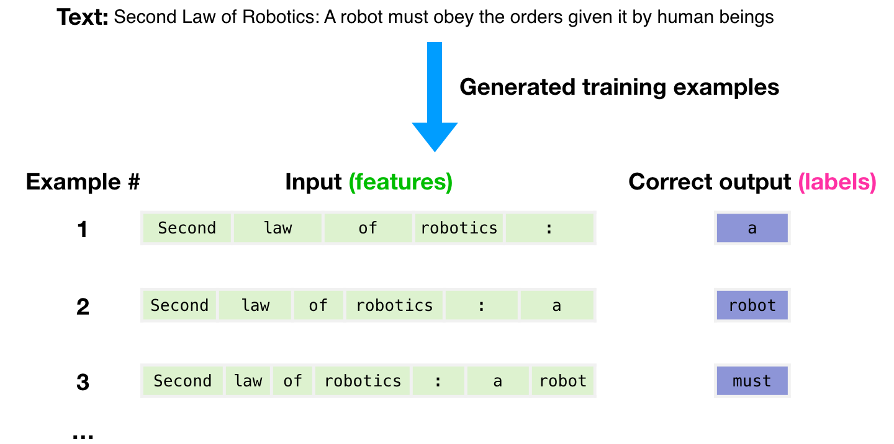
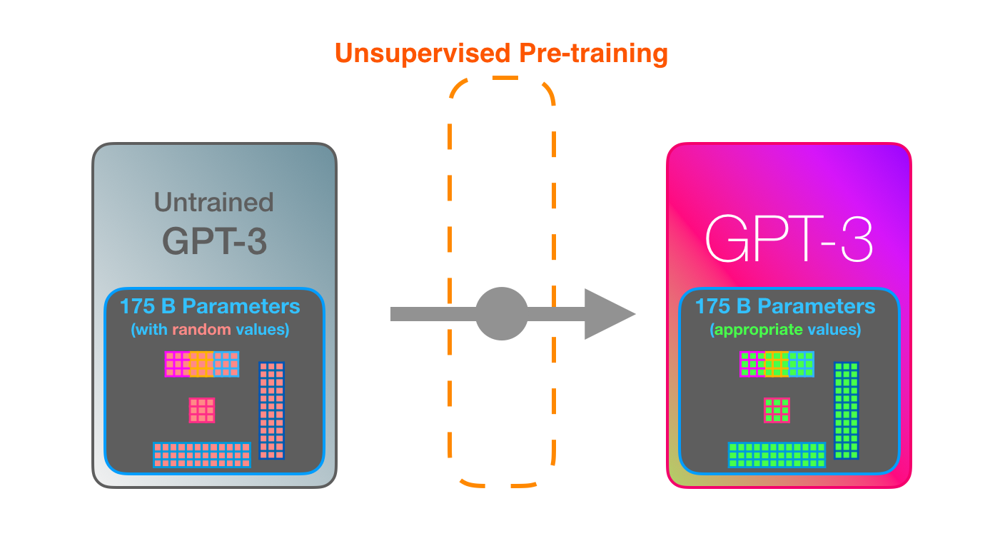
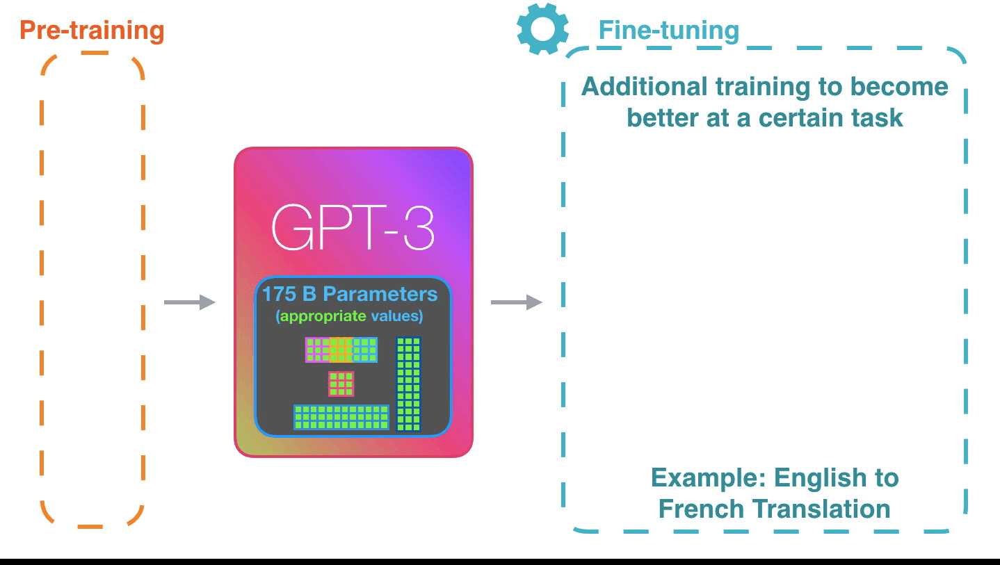

[本文翻译自](http://jalammar.github.io/how-gpt3-works-visualizations-animations/)

[原文](https://blog.zhangxiann.com/202009101112/)

如今，科技圈充斥着关于 GPT3 的炒作。大量的语言模型（如 GPT3）开始展现出它们惊人的能力。对于大多数企业来说，这些模型虽然还不能直接给用户可靠地使用，但它们展现出的智慧火花，肯定会加速自动化进程和智能计算机系统的可能性。现在，让我们揭开 GPT3的神秘面纱，了解它是如何训练的，以及它是如何运作的。

一个训练好的语言模型会生成文本。

我们可以把一些文本输入到模型中，这些输入的文本会影响输出的文本。

输出的文本是根据模型在训练期间扫描大量文本学到的内容生成的。

模型的训练过程，就是让模型观看大量的文本数据。这个训练过程已经完成了，现在你能看到的所有实验，都是来自于这个训练好的模型。据估计，这个模型需要 355 个 GPU 年（355 个 GPU 训练一年），耗资 460 万美元。

总共使用了 3000 亿个字符数据来产生模型的训练集。举个例子，下图是从上面的一个句子产生的 3 个训练样本。

上图中，我们每次只给模型一个样本。我们只输入 `features`，也就是输入的句子，模型需要预测下一个词。

而模型会预测错误。然后我们计算模型预测的损失，并更新模型，因此模型下次会预测得更加好。

把这个过程重复数百万次。

现在，我们来更详细地看看这些步骤的细节。

实际上，GPT3 每次只输出一个 `token`， 我们可以认为，一个 `token` 就是一个词。

请注意，这篇文章只是讨论 GPT3 的工作原理，而不是讨论它的新颖之处（因为这个话题涉及到非常多的东西）。GPT3 的架构是一个基于 `Transformer` 的 `Decoder`，而 `Transformer` 来源于这篇论文： [Attention Is All You Need](https://arxiv.org/abs/1706.03762)。

GPT3 非常巨大，包括 1750 亿个数字（称为参数）。这些参数用于计算每次输出的 `token`。

没有训练的模型的参数是随机初始化的。训练会有助于更新参数，输出更好的预测值。

上图中的这些数字，只是模型里面上百个矩阵中的一部分。预测值主要是通过这些矩阵相乘得到的。

在我的一个视频 [Intro to AI on YouTube](https://youtube.com/watch?v=mSTCzNgDJy4)，我展示了只有一个参数的简单机器学习模型，为解读这个1750亿个参数的怪兽开了个好头。

为了解这些分布是如何分布和使用的，我们需要拆解模型，看看它的内部结构。

GPT3 的宽度是 2048 个 token。这就是模型的”上下文窗口“（context window）。这意味着，它有 2048 个轨道来处理这些输入的 token。

现在，让我们跟着上图中紫色的轨道，看看系统是如何处理 `robotics` 这个词，并输出 `A`的。

大致步骤：

1. 把词转换为一个向量（这个向量能够表示这个词）
2. 计算预测值（也是一个向量）
3. 把结果向量转换为词

GPT3 中，比较重要的计算是它的 96 个 解码（Decoder）层。

下图是这个计算过程的大致步骤。

如下图所示，看到这些层了吗？这就是深度学习中的深度（指层数很深）。

这些层中的每一层都有 1.8 亿个参数来进行计算。这就是神奇的地方。

你可以在我的博客文章 [图解 GPT2](https://blog.zhangxiann.com/202009101112/) 中看到编码器内部的详细讲解。

GPT2 和 GPT3 的不同，就是密集注意力层和稀疏注意力层的交替连接。

下图是 GPT3 内部输出和输出（“Okay human”）的过程。注意看下每个 token 是如何通过所有层的。我们不关心第一个词的输出。当输入数据全部处理完了，我们才开始产生输出。然后我们把输出的每个词又输入到模型中。

在 [React 代码生成](https://twitter.com/sharifshameem/status/1284421499915403264) 的例子中，首先输入 2 句描述文字和对应的代码，然后第三句只输入描述。模型会输出一个个的 token（用粉色表示），表示对应的 React 代码。

我的假设是，将例子和描述作为输入，用特定的 token 将例子和结果分开，然后输入到模型。

这种运作方式令人印象深刻。因为你只要等到 GPT3 的微调推出，它的可能性将更加惊人。

微调实际上是更新模型的权重，让模型在特定的任务中表现得更好。

