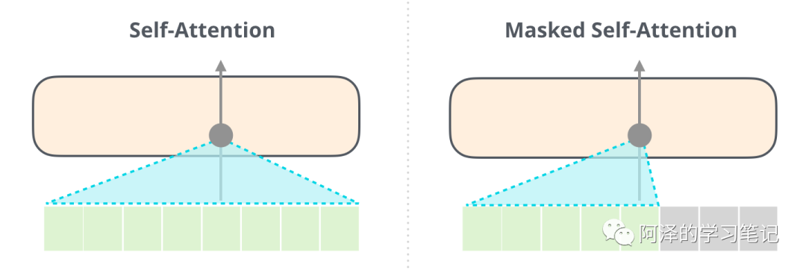
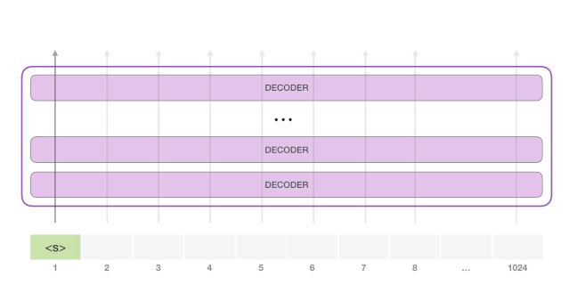
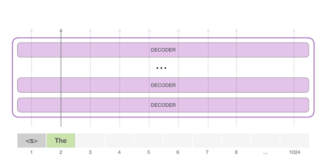
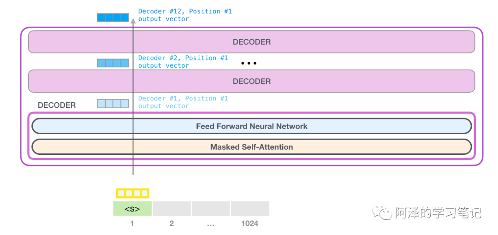
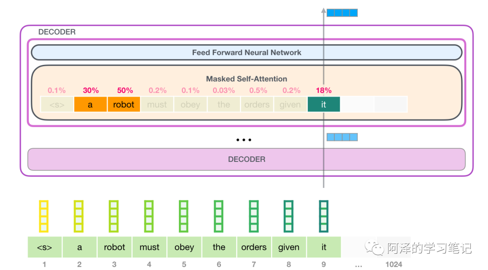
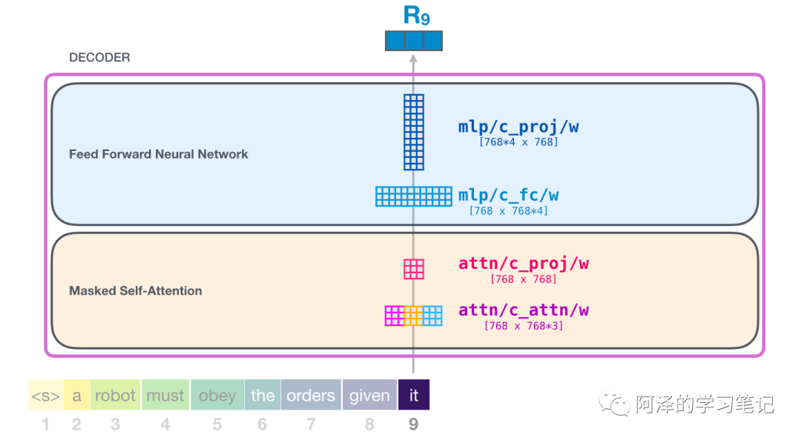
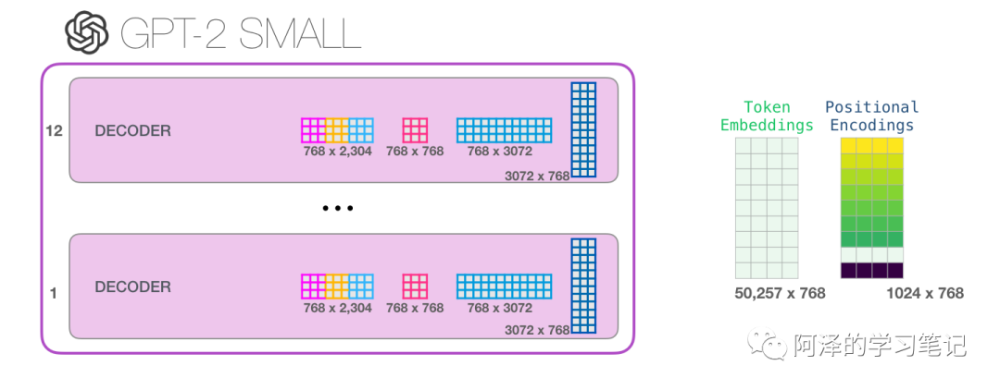
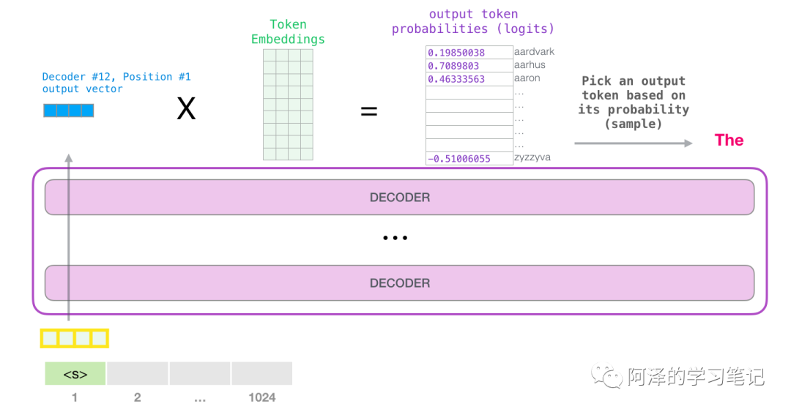
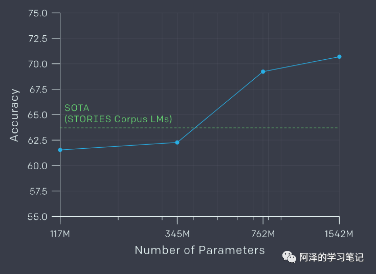
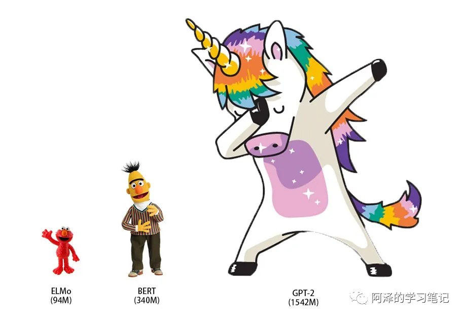

GPT-2

今天阅读的是 OpenAI 的同学于 2019 年发表的论文《Language Models are Unsupervised Multitask Learners》，目前具有 300 多引用量。

在有了之前论文的基础后读这篇论文就比较简单了，论文介绍的是 OpenAI 对 GPT 的一个改进模型 GPT-2，其模型结构与 GPT 相比几乎没有什么变化，只是**让模型变得更大更宽，并且取消了 Fine-tuning 的步骤**。也就是说 GPT-2 采用了**一阶段的模型（预训练）代替了二阶段的模型（预训练+微调）**，并且在语言模型（文本摘要等）相关领域取得了不错的效果。

# Introduction

目前最好的 NLP 模型是结合无监督的 Pre-training 和监督学习的 Fune-tuning，但这种方法的缺点是针对某特定任务需要不同类型标注好的训练数据。作者认为这是狭隘的专家而不是通才，因此作者希望能够通过无监督学习训练出一个可以应对多种任务的通用系统。

作者认为目前的数据集往往都是针对某一特定任务，如 QA 领域的 SQuAD 2.0，机器翻译领域的 NIST04 和 WMT 2014 En-2-Fr等。而正是因为数据集的单一导致系统缺乏泛化性。**作者想通过尽可能地构建和利用足够大的且多样化的数据集，以保证最终的模型能够应用于多个不同的 NLP 任务中**。为此，作者专门爬了 Reddit 上 > 3 karma 的外链作为数据源，同时去除 wiki 数据，最终数据大小共 40G。由于 Reddit 上的数据会包括各个领域，所以既保证了数据质量、数量又保证了数据的多样性。

此外，据研究表明语言模型有望完成某些特定的任务，如常识推理和情感分析等，所以作者提出了去掉有监督的 Fine-tuning 阶段，仅采用无监督 Pre-training 的语言模型来直接应用到下游任务中。

在本文中，作者论证了这种方法的可行性，并证明了语言模型来相关领域具有很大的潜力。

# GPT-2

## **2.1 Approach**

GPT-2 的核心是语言模型，语言具有天然的顺序性，通常可以表示为：

$$
p(x)=\prod_{i=1}^{n} p\left(s_{n} | s_{1}, \dots, s_{n-1}\right)
$$
可以泛化成：

$$
p\left(s_{n-k}, \dots, s_{n} | s_{1}, \dots, s_{n-k-1}\right)
$$
针对单个任务可以表示为估计一个条件分布：

$$
p(output|input)
$$
对于一个通用的系统来说，可以适用于多种任务：

$$
p(output|input, task)
$$
所以语言模型也能够学习某些监督学习的任务，并且不需要明确具体的监督符号。而监督学习由于数据量的关系通常只是无监督学习的一个子集，所以无监督学习的全局最小也必定是监督学习的最局最小，所以目前的问题变为了无监督学习是否能收敛。

作者通过初步论证指出，足够大的语言模型是能够进行多任务学习的，只是学习速度要比监督学习慢得多。

## **Input**

在模型输入方面，GPT-2 采用的是 Byte Pair Encoding(以下简称 BPE)的 Subword 算法。BPE 是一种简单的数据压缩形式，可以有效地平衡词汇表大小和编码所需的 token 数量。它可以提高词表的空间使用效率，避免得到类似 'dog.'、'dog!'、'dog?' 的词。

BPE 和我们之前的提到的 WordPiece 的区别在于，WordPiece 是基于概率生成 Subword 的，而 BPE 是基于贪心策略，每次都取最高频的字节对。

## **Model**

在模型方面相对于 GPT 来说几乎没有什么修改，只是加入了两个 Layer normalization，一个加在每个 sub-block 输入的地方，另一个加在最后一个 self-attention block 的后面。

同时考虑到模型深度对残差路径的累积问题，GPT-2 采用了修正的初始化方法。在初始化时将残差层的权重缩放到$\frac {1} {\sqrt{n}}$倍，n 为残差层的数量。

此外，vocabulary 的大小扩展到了 50257，输入的上下文大小从 512 扩展到了 1024，并且使用更大的 batch size（512）。

GPT-2 提供了四种不同规模的模型：

## **One Difference from BERT**

简单对比下 GPT-2 和 BERT 的区别。

GPT-2 采用的 Transformer 的 Decoder 模块堆叠而成，而 BERT 采用的是 Transformer 的 Encoder 模块构建的。两者一个很关键的区别在于，GPT-2 采用的是传统的语言模型，一次只输出一个单词（多个 token）。

下图是一个训练好的模型来 “背诵” 机器人第一法则：

这种效果之所以好是因为采用了自回归机制（Auto-Regression）：每生成一个新单词，该单词就被添加在生成的单词序列后面，这个序列会成为下一步的新输入。这个也是 RNN 的重要思想。

而 BERT 采用的是双向语言模型，虽然没有自回归，但也因为获得了结合上下文单词信息的能力，从而也取得了不错的效果。下图展示了 BERT 的 Self-Attention（左）和 GPT-2 的 Masked Self-Attention（右）的区别：

## **Look Inside**

虽然 GPT-2 相对 GPT 而言没有大改，但是在介绍 GPT 时我们没有介绍 GPT 的工作原理，所以在这我们补充看下 GPT-2 的工作原理。

### Overview

为了简单起见，我们以单词为 token。（GPT-2 实际是以字符为 token）

首先GPT-2 可以处理 1024 个单词序列，在任务开始时输入一个起始字符 <s\>，然后让他生成文字：（不同任务起始字符可能不一样）

然后将输出的单词添加到输入输入序列的尾部，重新构建一个新的输入序列，并让模型进行下一步的预测：

注意：第二个单词的路径是当前唯一活跃的路径了。GPT-2 的每一层都保留了它们对第一个单词的解释，并且将运用这些信息处理第二个单词，GPT-2 不会根据第二个单词重新解释第一个单词。（**重新解释速度太慢了**）

### Input

对于模型的输入而言，分为 Token Embedding 和 Position Embedding。

Token Embedding 的 Vocabulary Size 为 50257，Embedding Size 随着不同模型而改变：

Position Embedding 的 Context Size 是 1024，Embedding Size 也随着不同模型而改变：

实际的输入由 Position Embedding 和 Token Embedding 相加得到：

### Decoder

将输入送到模型后，首先通过 Masked Self-Attention，然后通过 Feed Forward Neural Network，第一个子模块处理完成后会传送到下一个模块进行的计算，每一个模型处理方式相同，但是各自独立。

每一层的 Self-Attention 都会融入了模型对于用来解释某个单词上文的相关单词的理解。具体做法是，给序列中每一个单词都赋予一个相关度得分，然后对他们的向量表征进行加权求和：

来自 Self-Attention 的输出作为 Feed Forward 的输入，并经过两层神经网络产生输出。

简单看下 GPT-2 SMALL 每一次的参数量：

### Output

将模型最后的输出与 Token Embedding 矩阵相乘，并通过 Logits 回归得到最终的概率值，取最大值即为输出。

为了防止推荐单词陷入循环（一直点击以第一个单词有可能陷入循环），GPT-2 会从概率最大的 top-k 单词中选取下一个单词。

自此，GPT-2 就介绍完了。

# Experience

接下来我们看一下实验部分.

首先是常识推理，效果还是不错的：

预测文章最后一个单词，效果也可以：

其他效果一般的就不放了。

最后来解释下独角兽🦄️的梗：

OpenAI 利用 GPT-2 生成了几个故事以向公众说明这个 AI 技术很危险，为了防止有人利用它做坏事只能开源最小版本。

独角兽的故事如下：

翻译过来就是

人类手写：科学家们有个令人震惊的发现，在安第斯山脉一个偏远且没被开发过的山谷里，生活着一群独角兽。更加让人讶异的是，这些独角兽说着完美的英文。

机器续写：这些生物有着独特的角，科学家们就以此为它们命名，叫Ovid’s Unicorn。长着四只角的银白色生物，在这之前并不为科学界所知。

可以看到 GPT-2 生成的内容无论是语法、可读性，还是语义一致性都非常强。但是还是有一些 Bug，比如说长了四只角的独角兽。

尚且，我们看到的故事都是已经被筛选过的开头和结果。

所以后面也有同学隔空喊话：

- OpenAI: Please Open Source Your Language Model；
- OpenAI should now change their name to ClosedAI。

当然，OpenAI 后续还是通过分阶段发布的方式开源了具有 15 亿参数巨型模型。

# Conclusion

总结：GPT-2 在 GPT 的基础上采用单向语言模型，并舍去 Fine-tuning 阶段，利用高质量多样化的大文本数据训练得到一个巨型模型，最终在语言模型相关的任务中取得了不错的成绩。

但我总觉得 BERT 要是也用同样的数据和模型规模会比 GPT-2 要更好，毕竟 BERT 打败 GPT 是因为其采用了双向语言模型的结构。

虽然没钱做实验，但 GPT-2 还是给我们带来了一个不错启发：多任务是有机会用一个模型解决的，无监督学习的语言模型在 NLP 领域的潜力还很大。

最后放上一个 OpenAI 和 ELMo、Bert 的参数对比图：

# Reference

1.  https://mp.weixin.qq.com/s/sdLnRDvjGfEbLc2HUq7NpQ
2. 《Language Models are Unsupervised Multitask Learners》
3. 《Better Language Models and Their Implications》
4. 《The Illustrated GPT-2 (Visualizing Transformer Language Models)》