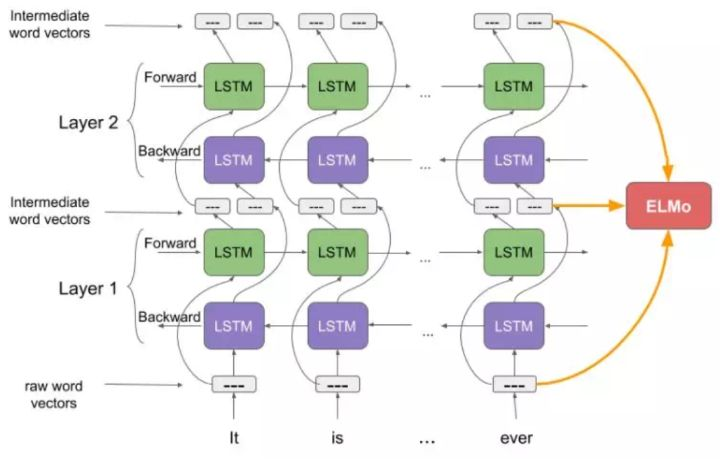
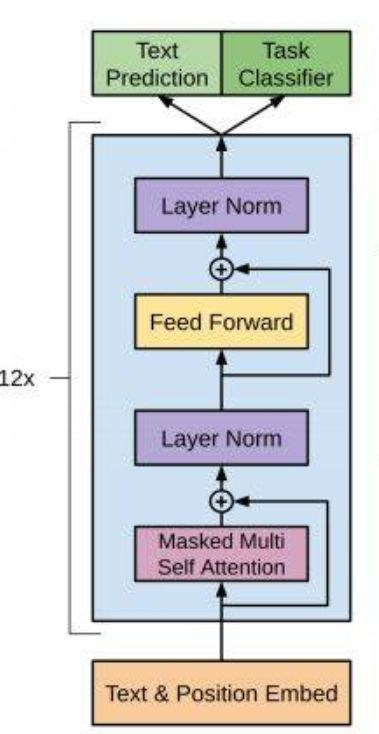

# 文本表示方法

- 基于one-hot、tf-idf、textrank等的bag-of-words
- 主题模型：LSA（SVD）、pLSA、LDA
- 基于词向量的固定表征：word2vec、fastText、glove
- 基于词向量的动态表征：elmo、GPT、bert

# 什么是tf-idf

- tf（Term Frequency）词频：指的是某一个给定的词语在该文件中出现的次数。这个数字通常会被归一化(一般是词频除以文章总词数), 以防止它偏向长的文件。
- idf（Inverse Document Frequency）逆文档频率：log（语料库的文档总数/包含该词的文档数）
- 特点：
	1. 可用某篇文章中出现次数多但在其他文章中出现次数少的词来作为该篇文章的特征词。
	2. 使罕见的单词更加突出并且有效地忽略了常用单词。
	3. 易于理解。
- 缺点：
	1. 因为是词袋模型，所以没有考虑词的位置信息，但词的位置是有一定含义的。
	2. 并不能反映单词的重要程度和特征词的分布情况。

# 什么是LSA/pLSA/LDA?

- 都是主题模型。
- LDA（Latent Dirichlet Allocation）隐含狄利克雷分布：与词向量无关，文档集中每篇文档的主题以概率分布的形式给出。
- LSA（Latent Semantic Analysis）潜在语义分析：与词向量有关，是文档与所有词在该文档中出现频次的矩阵（词文档矩阵），利用SVD分解之后，左边的矩阵就是词向量。
- pLSA（Probability Latent Semantic Analysis）概率潜在语义分析：太复杂了，暂无研究。

# 各种词向量的特点

- One-hot：维度灾难 and 语义鸿沟
- 矩阵分解（LSA）：利用全局语料特征，但SVD求解计算复杂度大
- 基于NNLM/RNNLM的词向量：词向量为副产物，存在效率不高等问题
- word2vec、fastText：优化效率高，但是基于局部语料
- glove：基于全局预料，结合了LSA和word2vec的优点
- elmo、GPT、bert：动态特征

# NNLM

（参考链接：[http://www.pengjingtian.com/2016/09/17/nnlm/](https://link.zhihu.com/?target=http%3A//www.pengjingtian.com/2016/09/17/nnlm/)）

- 神经网络语言模型：利用语言模型产生词向量，详细点说就是利用上下文词预测中心词或利用前n个词预测下一个词，词向量只是副产物
- 初始化一个V*D的词向量矩阵，其中V是语料库词汇表的大小，D是词向量的维度，随机初始值
- 输入层：利用n个上下文词的one-hot编码与词向量矩阵相乘，找到每个单词的词向量，拼接起来，成为一个更长的向量，即D*n维向量
- 隐藏层：将D*n维向量经过线性层转换为M维向量，再经过tanh等激活函数
- 输出层：再把M维向量经过线性层转换为大小为V维的向量，经过softmax函数即可得到每一个词的概率
- 其训练目标是最大化似然函数

# Word2vec和nnlm的对比

- 两者本质都是语言模型
- 词向量只是nnlm的一个产物，虽说word2vec本质也是语言模型，但其更专注于词向量本身，所以有一些优化算法来提高计算效率
- 具体计算方面，在利用上下文词预测中心词时，nnlm是把上下文词的向量进行拼接，word2vec是进行sum，并舍弃隐藏层（为了减少计算量）
- word2vec的两个加速算法：hierarchical softmax 和negative sampling

# 深入剖析word2vec

（参考链接：[https://blog.csdn.net/itplus/article/details/37969519](https://link.zhihu.com/?target=https%3A//blog.csdn.net/itplus/article/details/37969519)）：

1. 两种模型 and 两种优化算法：

- CBOW（连续词袋模型）：利用上下文词预测中心词
- Skip-gram（跳字模型）：利用中心词预测上下文词
- hierarchical softmax（层次softmax）
- negative sampling（负采样）

2. 深入剖析hierarchical softmax（利用CBOW）：

- **输入层**：利用n个上下文词的one-hot编码与词向量矩阵相乘，找到每个单词的词向量。

- **投影层：**将n个上下文词的词向量相加**求和**得到X。

- **输出层：**对应一个哈夫曼树，以每个词在语料库中的频次构造出来的哈夫曼树，叶节点有V个，即词汇表的大小。非叶子节点有V-1个，图中黄色部分。

- **哈夫曼树详解：**每一个叶节点有对应的唯一从根节点出发路径，可用0，1进行编码，左1右0。路径上的非叶子节点都对应一个向量，该向量是参数向量，最终更新的也是该向量。

- **如何确定条件概率：**现有一个上下文向量X，经过未知节点之后找到正确的中心词，在找的过程中，每经过一个子节点，都要进行一次判断，看是往左走还是往右走，刚好哈夫曼树左为1右为0，即每走一步都可看作是一个二分类，总结一句话就是：**上下文词找到中心词的过程就是上下文词经过多个二分类之后最终到达目标词，每一步都要进行判断**。

- **时间复杂度：**从O（N）降到O（log（N））

- **概率表示：**

	
	
	
	
	

如上图所示，每一步都是一个由逻辑回归得到的概率值，那么根据独立随机变量的联合概率计算，将每一步的概率乘起来即可得到总的概率。

- **目标函数（对数似然函数）：**

很好理解，外面一层求和是要保证每一次训练或者说每一个中心词都被预测正确的概率最大，那么就要求每个中心词预测正确的概率的乘积。里面一层求和是在求每个词时哈夫曼树路径上二分类的概率的乘积。

- **更新：**要求上述似然函数的最大值，采用随机梯度上升法。需要更新的参数一个是哈夫曼树上路径上的参数向量Theta及每次的上下文求和之后的单词向量X。

注意：在更新X的时候，实际并不能直接更新这个求和后的向量，需要把梯度分别更新在每一个求和前的词向量上，即x，如图：

其中：

3. 深入剖析hierarchical softmax（利用Skip-gram）：

- **输入层**：只含当前词的词向量x
- **投影层：**没什么用，只是为了和CBOW对比
- **输出层：**对应一个哈夫曼树，以每个词在语料库中的频次构造出来的哈夫曼树，叶节点有V个，即词汇表的大小。非叶子节点有V-1个，图中黄色部分。
- **与CBOW的区别：**目标函数有三个连加，最内层为每一个被预测词从根节点走下来的概率，外面一层是一个中心词预测的多个上下文词的概率，最外面是确保整个训练集的预测正确的概率。如图：

- **更新时：**每一个Theta j都对应一个w的偏导，所以要求和，另外每一个上下文词u也对应一个w的偏导，再次求和。

4. 深入剖析nagative sampling（利用CBOW）：

- **层次softmax的缺点：**遇到生僻词的时候，在哈夫曼树中也要走很久，计算量也很大。
- **负采样算法：**为带权采样，在语料库中计算每个词的词频，即某个词的count/语料库中所有单词总count（源码中分子分母都用的是count四分之三次方，并非直接用count），即为被采样到的概率。在word2vec里的具体做法是，经过概率的计算，可将所有词映射到一条线上，这条线是非等距划分的N份（因为N个词的概率不同），再对同样的线进行等距划分成M份，其中M<<N，在采样时，每次随机生成一个[1,M-1]之间的数，在对应到该小块所对应的单词区域，选区该单词（当选到正例单词自己时，跳过），具体如图：

- **原理：**在CBOW里，正确的词只有一个，剩下全是错误的，所以从所有错误的词里选出一部分作为负类，正确的作为正类，就可以构建一个二分类问题。其中如何采样这些负类已经在上述过程中描述了，接下来就是如何用一个正类和其他负类进行二分类。
- **二分类问题：**要同时满足尽可能的让正类和负类分类正确，u为正类和负类样本，每个概率相乘得到联合概率，每一个概率的计算是一个逻辑回归二分类。即：

其中X_w还是表示上下文向量的和向量，Theta^u表示该单词u对应的辅助向量（每个二分类的训练参数，相当于每一个中心词都会有一个而分类器，这个Theta^u即这个二分类器的参数，当这个词为正类时，这个Theta^u就出现了，经过一个正类和几个负类去改变这个Theta^u）。

- **目标函数：**首先保证每一个训练样本g(w)最大，然后在所有样本中，保证每一个样本正确的概率最大，似然函数取log后将会有两个连加，如图：

- **梯度更新：**利用梯度上升法进行求导更新。其中，对每一个目标词都有一个向量Theta^u，需要对每一个求偏导然后更新，更新X_w时还是要把每一个Theta^u更新的加起来，如图：

5. 深入剖析nagative sampling（利用Skip-gram）：

- 和层次softmax相同，在skip-gram计算时，会有三个连乘，其中多出来的一个是要满足预测的上下文每一个词的概率都最大。即：

- **源码中：**并没有对上下文的每一个词都进行负采样，而是对中心词进行了上下文词个数个负采样，意思就是本身是用中心词预测多个上下文词，现在变成用相同数目的中心词预测相同数目的上下文词，但中心词里只有一个是真的，要保证这个概率最大，其他都是假的，要保证假的概率也最大。

# 深入剖析Glove

（参考链接：[https://blog.csdn.net/coderTC/article/details/73864097](https://link.zhihu.com/?target=https%3A//blog.csdn.net/coderTC/article/details/73864097)）：

1. **什么是Glove：**GloVe的全称叫Global Vectors for Word Representation，它是一个基于全局词频统计（count-based & overall statistics）的词表征（word representation）工具。
2. **概述：**

- 模型目标：进行词的向量化表示，使得向量之间尽可能多地蕴含语义和语法的信息
- 输入：语料库
- 输出：词向量
- 方法：首先根据语料库构建共现矩阵，然后基于共现矩阵和Glove模型学习词向量

**3. 共现矩阵（个人理解）：**

**共现count矩阵：**里面的数值都是出现的次数，即count，具体步骤如下：

1. 首先构建一个空矩阵，大小为V\*V，即词汇表*词汇表，值全为空
2. 确定一个滑动窗口的大小，比如：5
3. 从语料库的第一个单词开始，滑动该窗口
4. 因为是按照语料库的顺序开始的，所以中心词为到达的那个单词：i
5. 上下文词为以中心词i为滑动窗口的中心，两边的单词，为上下文词：$j_1, j_2,…,j_m$（假如有m个j）
6. 若窗口左右无单词，一般出现在语料库的首尾，则空着，不需要统计
7. 在窗口内，统计上下文词j出现的次数，添在矩阵中
8. 滑动过程中，不断将统计的信息添加在矩阵中，即可得到共现矩阵

- **共现概率矩阵：**可以这么理解，这个矩阵是一个3*V（词汇表大小）的矩阵，每两个单词都可以得到一个这样的矩阵（如图）：

1. 其中第一行以某个单词i为中心词，其他V个词，记为k，出现的概率，用k的count / i的count 表示概率。
2. 第二行与第一行类似，只是此时统计的是中心词j。
3. 第三行为第一行 / 第二行。

- 补充：贡献概率矩阵其实并非3*V，应该是可以直接利用共现count矩阵计算得来，即为V*V，当需要计算两个词的Ratio时，再取出这个V*V矩阵中的这两行进行计算

**4. Ratio有什么用：**实际上反映的是三个词的关系，如图：

**5. 作者的灵感来源：**大胆猜测，如果三个词的向量经过某种计算可以达到等同于ratio的效果，那么就可以用该向量表示词与词之间的关系了。

**6. 损失函数：**经过作者的一系列猜测和推导（第8条），得到了如下的损失函数，其实是均方误差函数（其中f(x)为权重函数，即频率越高的词权重应该越大，这篇论文中的所有实验，α的取值都是0.75，而xmax取值都是100）：

**7. 那么Glove是如何训练的呢**（参考链接：[http://www.fanyeong.com/2018/02/19/glove-in-detail/#comment-1462](https://link.zhihu.com/?target=http%3A//www.fanyeong.com/2018/02/19/glove-in-detail/%23comment-1462)）：虽然很多人声称GloVe是一种无监督（unsupervised learing）的学习方式（因为它确实不需要人工标注label），但其实它还是有label的，这个label就是 log ( X i j ) ，而向量 v_i 和 v_j 就是要不断更新/学习的参数，所以本质上它的训练方式跟监督学习的训练方法没什么不一样，都是基于梯度下降的。具体地，论文里的实验是这么做的：采用了AdaGrad的梯度下降算法，对矩阵 X 中的所有非零元素进行随机采样，学习曲率（learning rate）设为0.05，在vector size小于300的情况下迭代了50次，其他大小的vectors上迭代了100次，直至收敛。最终学习得到的是两个vector是 v_i 和 v_j ，因为 X 是对称的（symmetric），所以从原理上讲 v_i 和 v_j 是也是对称的，他们唯一的区别是初始化的值不一样，而导致最终的值不一样。所以这两者其实是等价的，都可以当成最终的结果来使用。但是为了提高鲁棒性，我们最终会选择两者之和 v_i + v_j 作为最终的vector（两者的初始化不同相当于加了不同的随机噪声，所以能提高鲁棒性）。

**8.具体推导过程在参考链接里：**

#  Glove与LSA比较

- 两者都是基于共现矩阵在操作。
- LSA（Latent Semantic Analysis）可以基于co-occurance matrix构建词向量，实质上是基于全局语料采用SVD进行矩阵分解，然而SVD计算复杂度高。
- Glove没有直接利用共现矩阵，而是通过ratio的特性，将词向量和ratio联系起来，建立损失函数，采用Adagrad对最小平方损失进行优化（可看作是对LSA一种优化的高效矩阵分解算法）。

# Glove与Word2vec比较

- Word2vec是局部语料库训练的，其特征提取是基于滑窗的；而glove的滑窗是为了构建co-occurance matrix（上面详细描述了窗口滑动的过程），统计了全部语料库里在固定窗口内的词共线的频次，是基于全局语料的，可见glove需要事先统计共现概率；因此，word2vec可以进行在线学习，glove则需要统计固定语料信息。
- Word2vec是无监督学习，同样由于不需要人工标注，glove通常被认为是无监督学习，但实际上glove还是有label的，即共现次数$log(X_i,j)$
- Word2vec损失函数实质上是**带权重的交叉熵**，权重固定；glove的损失函数是**最小平方损失函数**，权重可以做映射变换。
- Glove利用了全局信息，使其在训练时收敛更快，训练周期较word2vec较短且效果更好。

# 深入剖析Fasttext

（参考链接：https://zhuanlan.zhihu.com/p/32965521）

1. **模型架构：**
	- 与word2vec的CBOW类似
	- 输入层：词和子词（subword）的n-gram的特征向量
	- 隐藏层：所有词的向量叠加求平均之后经过线性变换到隐藏层
	- 输出层：Hierarchical Softmax输出文本类别

1. **两个特色：**

- **字符级的n-gram：**除了每个单词的词向量外，还为每个单词的n-gram字符添加一个向量，作为额外的特征，两点好处：

1. 对于低频词生成的词向量效果会更好。因为它们的n-gram可以和其它词共享。
2. 对于训练词库之外的单词，仍然可以构建它们的词向量。我们可以叠加它们的字符级n-gram向量。

- **分层softmax：**利用哈夫曼树构建，根据目标类别的多少自上而下构建，数目越多的类越在顶部。（与word2vec里类似）

**2. 核心思想：**将整篇文档的词及n-gram向量叠加平均得到文档向量，然后使用文档向量做softmax多分类。这中间涉及到两个技巧：字符级n-gram特征的引入以及分层Softmax分类。

**3. 为什么fasttext会快：**

1. hierarchical softmax 和negative sampling是对普通softmax的极大提速
2. hs里使用huffman树，做分类一般类别没那么多，叶子节点相对word2vec(每个目标词一个叶子节点）少很多。并且语料每一行只训练一次，word2vec要每个中心词训练一次，训练次数又少了很多。当然fasttext可以设置epoch训练多轮
3. 各种提速的trick，比如提前算好exp的取值之类的，这点和word2vec是一样的了

#  Fasttext与Word2vec比较

- 都可以无监督学习词向量， fastText训练词向量时会考虑subword
- fastText还可以进行有监督学习进行文本分类
- 都利用了hierarchical softmax进行加速
- Fasttext引入字符级n-gram可以处理长词，未出现过的词，以及低频词

# Elmo（Embeddings from Language Models）详解

（参考链接：[https://www.jiqizhixin.com/articles/2019-04-22-3](https://link.zhihu.com/?target=https%3A//www.jiqizhixin.com/articles/2019-04-22-3)）

1. **模型结构（如图）：**

- 首先使用字符级卷积神经网络（convolutional neural network, CNN）来将文本中的词转换成原始词向量（raw word vector）
- 将这些原始词向量输入双向语言模型中第一层
- 前向迭代中包含了该词以及该词之前的一些词汇或语境的信息
- 后向迭代包含了该词之后的信息
- 这两种迭代的信息组成了中间词向量（intermediate word vector）
- 这些中间词向量被输入到模型的下一层
- 最终表示（ELMo）就是原始词向量和两个中间词向量的加权和

**2. 训练过程：**

- 首先明确LSTM 每一个时间点都会有一个输出，不要把这个输出和向下一时间点传送的记忆内容搞混，两个是有区别的，LSTM向下一个时间点传送的东西有两个，一个是该时间点的输出也就是隐状态H，同时传给了下一个时间点，另一个是记忆单元C，每个时间点的输出只有H（如图）。

- 理解了LSTM的输出后，再来看一层双向LSTM就会有两个输出，一个来自正向，一个来自负向，这两个一个代表前面信息对该词的影响的输出，一个代表后面信息对该词影响的输出，都能拿来当作词向量用，所以一层就会有两个词向量，两层就有4个，再加上最开始的输入，raw word vectors，就有4+1，也就有了2L+1个词向量！！！
- 再来理解一下RNN的提出，RNN的提出本身就是为了解决序列信息的问题（在NLP中），普通神经网络在操作时，后面的输入和前面的输入都是无关的，所以RNN本身就可以拿来做语言模型，我们也做过用LSTM/GRU或普通RNN来直接做语言模型的。
- 理解了RNN语言模型，那Elmo就很简单了，就是个多层的LSTM来用作训练语言模型。
- 具体公式如图，目标就是最小化损失函数，反向传播更新就完事了：

**3. 使用过程：**这么多隐藏状态任君选择，爱怎么玩怎么玩，加权求和。

**4. 关于训练Elmo时的输入：**输入是一个句子，先分成token，每一个token再通过里面的字符进行编码，比如说‘english’这个单词，e有一个编码，n有一个，。。。，h有一个，将他们拼接，再加上起始和结尾符，再加上为了统一单词长度的padding，最后CNN一操作，再一pooling，就每一个词得到一个词向量，具体参考（[https://www.infoq.cn/article/B8-BMA1BUfuh5MxQ687T](https://link.zhihu.com/?target=https%3A//www.infoq.cn/article/B8-BMA1BUfuh5MxQ687T)）

**5. 其他个人理解：**

- 首先Elmo是一个被预训练好的多层双向LSTM语言模型，意思就是里面的参数已经经过大量的语料库调好了，不是预训练好的词向量
- 它的词向量是在真实下游任务中产生的，所以根据输入不同，任务不同，同一个词获取的词向量是不同的
- 可以看作是特征提取的过程，在实际任务中，对于输入的句子，使用Elmo这个语言模型处理他，得到输出的向量，拿来做词向量。

# OpenAI GPT（Generative Pre-training Transformer）详解

（参考链接：[http://fancyerii.github.io/2019/03/09/bert-theory/#elmo](https://link.zhihu.com/?target=http%3A//fancyerii.github.io/2019/03/09/bert-theory/%23elmo)）

1. **模型框架（如图）：**

- 输入一个序列，从embedding matrix中获取词向量，加上位置向量作为输入，论文中说了这里的位置向量不再是之前transformer里的正弦位置向量，而是训练好的位置向量，具体没交代。另外关于这里的词向量矩阵也不知道它用的是什么，也没有交代。
- 12层transformer的decoder，其实说它是decoder不是很准确，但说它是encoder也不是很准确，因为它虽然用了decoder的mask self attention 但是它没有decoder的与encoder attention的那部分，论文里写的是decoder，那就decoder吧。
- Transformer里的内容就是self-attention with mask ，残差网络（归一化），前馈全连接层，残差网络（归一化）
- 拿最后一层的transformer的输出经过softmax函数来预测下一个单词

**2. 预训练阶段：**

- 是一个训练语言模型的过程

**3. 微调阶段：**与Elmo不同，它的微调还是基于自身的框架，Elmo是在后面接其他任务的模型，GPT是所有任务都用自身框架做，不同任务的处理方法不同而已。另外在微调时，损失函数要考虑两个损失函数，一个是**语言模型的损失函数**，另一个时**具体任务的损失函数**，例如下图里的文本分类。

**4. 微调阶段二（其他任务）：**上面已经说了，GPT在处理下游任务时不用添加其他模型而是用自身，那么在用自身的时候，对于不同任务的处理就会不同，下图为具体处理方案：

- 如图上图所示，对于输入是一个序列的任务，我们在序列前后增加两个特殊token——”start”和”extract”，分别表示开始和结束；而如果输入是两个序列，那么在它们中间增加一个特殊的token “delim”。比如Entailment，输入是Premise和Hypothesis，输出是3个分类标签中的一个。 如果是相似度计算，因为对称性，我们把它们交换顺序，然后输入两个Transformer。如果是多选题，比如给定一个问题和N个答案，那么我们可以把问题和N个答案分别输入N个Transformer。

# BERT（Bidirectional Encoder Representations from Transformers）详解

（参考链接：[https://plmsmile.github.io/2018/12/15/52-bert/](https://link.zhihu.com/?target=https%3A//plmsmile.github.io/2018/12/15/52-bert/)

[http://fancyerii.github.io/2019/03/09/bert-theory/#elmo](https://link.zhihu.com/?target=http%3A//fancyerii.github.io/2019/03/09/bert-theory/%23elmo)）

1. **Elmo和GPT最大的问题：**两者都是单一方向的，无法考虑另一方向的信息。虽说Elmo用了双向LSTM，但是这是个伪双向，因为它只是把两个方向的信息拼接起来，并非同时获取前后信息，从目标函数里也可以体现这一点，他的目标函数是两个方向的语言模型拼接起来的，BERT的目标函数是只有一个，利用上下文的单词预测其中一个单词。GPT虽说用的是transformer，里面的self attention按道理是不需要距离的，任意两个词距离都是1，就不存在前后方向的问题，但是毕竟用的是decoder，有mask，前面看不到后面，所以等于也是单向的，另外这也是为什么transformer在进行并行运算的时候，只有encoder可以并行成矩阵运算，decoder需要一个词一个词计算，因为encoder没有mask可以实现一个词看完所有词的信息。
2. **总体框架：**利用半监督学习一个双向语言模型，然后在下游任务中，经过该语言模型后，接其他任务。

**3. BERT输入表示（如图）：**

- 句子开头有一个特殊的Token [CLS]
- 句子结束有一个特殊的Token [SEP]
- 如果是两个句子同时输入，则只有开头有[CLS]，后面那个句子没有[CLS]，只有[SEP]
- 每个token有三个embedding，词的Embedding；位置的Embedding和Segment的Embedding。
- 词embedding不用多说，位置embedding是将位置用**低维稠密向量表示**，segment的embedding是为了将多个句子区分，第一个句子可能用0表示，第二个用1，只有一个句子的时候可能只用0。
- 第一个token很有用，可不能小瞧，因为它本身没有任何意义，在进行self-attention时，会获取下文所有信息（编码整个句子的语义），不像其他单词，在self-attention时获取最多的信息是来自于自己。
- 注意这里的分词会把”playing”分成”play”和”##ing”两个Token，这种把词分成更细粒度的Word Piece的方法是一种解决未登录词的常见办法。

**4. BERT预训练（至关重要的两点）：**

1. 1. Mask language model：遮掩语言模型
	2. Next Sentence Prediction：预测下一个句子（关系）

**5. Mask language model（遮掩语言模型）：**在预训练的时候，随机mask掉15%的单词，让语言模型去预测这个单词，如图（图中512是padding，规定了句子的长度）：

**这样的话有两个缺点：**

- 大量mask标记，造成预训练和finetune时候的差距，因为finetune没有mask，finetune的时候用的是自己的数据集
- 收敛很慢，但是效果好（比单向语言模型慢）

**关于第一条的解决方案：**

- 80%的概率替换成[MASK]，比如my dog is hairy → my dog is [MASK]
- 10%的概率替换成随机的一个词，比如my dog is hairy → my dog is apple
- 10%的概率替换成它本身，比如my dog is hairy → my dog is hairy
- **这样的好处在于：**BERT并不知道[MASK]替换的是哪一个词，而且任何一个词都有可能是被替换掉的，比如它看到的apple可能是被替换的词。这样**强迫模型在编码当前时刻的时候不能太依赖于当前的词，而要考虑它的上下文，甚至更加上下文进行”纠错”**。比如上面的例子模型在编码apple是根据上下文my dog is应该把apple(部分)编码成hairy的语义而不是apple的语义。

**6. Next Sentence Prediction（预测下一个句子）：**对于像QA、NLI等需要理解多个句子之间关系的下游任务，只靠语言模型是不够的。还需要提前学习到句子之间的关系。是一个二分类任务。输入是A和B两个句子，标记是IsNext或NotNext，用来判断B是否是A后面的句子。这样，就能从大规模预料中学习到一些句间关系。

- 对于这个任务，BERT会以50%的概率抽取有关联的句子(注意这里的句子实际只是联系的Token序列，不是语言学意义上的句子)，另外以50%的概率随机抽取两个无关的句子，然后让BERT模型来判断这两个句子是否相关。

**7. 下游特定任务：**

- 单句子分类（CLS+句子）：

输入是一个序列，所有的Token都是属于同一个Segment(Id=0)，我们用第一个特殊Token [CLS]的最后一层输出接上softmax进行分类，用分类的数据来进行Fine-Tuning。利用CLS进行分类。

- 多句子分类（CLS+句子A+SEP+句子B）：

对于相似度计算等输入为两个序列的任务，过程如图左上所示。两个序列的Token对应不同的Segment(Id=0/1)。我们也是用第一个特殊Token [CLS]的最后一层输出接上softmax进行分类，然后用分类数据进行Fine-Tuning。利用CLS分类。

- NER（CLS+句子）：序列标注，比如命名实体识别，输入是一个句子(Token序列)，除了[CLS]和[SEP]的每个时刻都会有输出的Tag，然后用输出的Tag来进行Fine-Tuning利用句子单词做标记。
- QA：CLS+问题+SEP+文章。比较麻烦，比如比如SQuAD v1.1数据集，输入是一个问题和一段很长的包含答案的文字(Paragraph)，输出在这段文字里找到问题的答案。

**比如输入的问题是：**

*Where do water droplets collide with ice crystals to form precipitation?*

**包含答案的文字是：**

*... Precipitation forms as smaller droplets coalesce via collision with other raindrops or ice crystals within a cloud. ...*

**答案是：**

*”within a cloud”*

我们首先把问题和Paragraph表示成一个长的序列，中间用[SEP]分开，问题对应一个Segment(id=0)，包含答案的文字对于另一个Segment(id=1)。这里有一个假设，那就是答案是Paragraph里的一段连续的文字(Span)。BERT把寻找答案的问题转化成寻找这个Span的开始下标和结束下标的问题。

对于Paragraph的第i个Token，BERT的最后一层把它编码成Ti，然后我们用一个向量S(这是模型的参数，需要根据训练数据调整)和它相乘(内积)计算它是开始位置的得分，因为Paragraph的每一个Token(当然WordPiece的中间，比如##ing是不可能是开始的)都有可能是开始可能，我们用softmax把它变成概率，然后选择概率最大的作为答案的开始：

类似的有一个向量T，用于计算答案结束的位置。

****

# ELMo，OpenAI GPT，BERT比较

单双向语言模型处理上的不同：上面已经说了，ELMo虽然是双向LSTM但是只是拼接两个方向信息，另外目标函数也只是加和两个语言模型；GPT用的是transformer的decoder，有mask的self-attention，等于只能捕获一个方向的信息；而BERT利用encoder只随机mask15%的词，利用全部上下文的信息。

