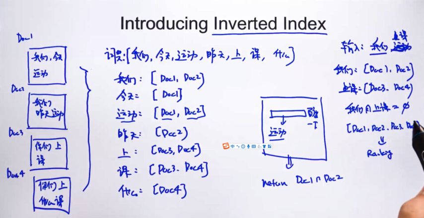

# 案例

## 文档

```python
from pprint import pprint
```


```python
# 如下，一个数据表docu_set中有三篇文章的,d1,d2,d3,如下
docu_set = {
    'd1': 'i love shanghai',
    'd2': 'i am from shanghai now i study in tongji university',
    'd3': 'i am from lanzhou now i study in lanzhou university of science  and  technolgy',
}
```


## 词集


```python
# 首先对所有文档做分词，得到文章的词向量集合
set_all_words = set([i for value in docu_set.values() for i in value.split()])

pprint(set_all_words)
```

    {'am',
     'and',
     'from',
     'i',
     'in',
     'lanzhou',
     'love',
     'now',
     'of',
     'science',
     'shanghai',
     'study',
     'technolgy',
     'tongji',
     'university'}


## 构建倒排索引

```python
invert_index = dict()
for word in set_all_words: 
    invert_index[word] =  [k for k, v in docu_set.items() if word in v.split()]
    
# invert_index = {word:[k for k, v in docu_set.items() if word in v.split()] for word in set_all_words}
pprint(invert_index)
```

    {'am': ['d2', 'd3'],
     'and': ['d3'],
     'from': ['d2', 'd3'],
     'i': ['d1', 'd2', 'd3'],
     'in': ['d2', 'd3'],
     'lanzhou': ['d3'],
     'love': ['d1'],
     'now': ['d2', 'd3'],
     'of': ['d3'],
     'science': ['d3'],
     'shanghai': ['d1', 'd2'],
     'study': ['d2', 'd3'],
     'technolgy': ['d3'],
     'tongji': ['d2'],
     'university': ['d2', 'd3']}


## 全文搜索

```python
invert_index['university']
```


    ['d2', 'd3']