[这篇文章](https://blog.zhangxiann.com/categories/NLP/page/2/)用于记录台大李宏毅老师的**Transformer 课程**的学习笔记。课程地址：https://www.bilibili.com/video/BV1J441137V6

这篇文章用一句话概括，就是：**如何让机器看懂人类的文字**。

为了让机器更好地理解人类的文字，学术界做了许多的研究，截至目前为止，在这个方向上最新的进展就是 BERT、GPT dent，而 BERT 是 Transformer 里的 Encoder，GPT 是 Transformer 里的 Decoder。所以，这篇文章先谈谈 Transformer，下一篇文章讲 Bert 以及 GPT。

下面从历史发展来看词的向量表示的发展历程。

# One-Hot Encoding

在最开始的时候，首先被提出来表示人类文字的方法叫做`One-Hot Encoding`，也称为`1-of-N Encoding`。

假设总共有 5 个词：`apple`、`bag`、`cat`、`dog`、`elephant`，那么就使用长度为 5 的向量来表示一个词，向量中每个位置表示一个词，每个位置的元素的取值有 2种：1 和 0，表示该位置上的词是否出现了。

如果第一个位置表示`apple`，那么`apple`的向量就是`[1,0,0,0,0]`。

同理，所有词的向量表示如下表，每行表示一个词。

|          | apple | bag  | cat  | dog  | elephant |
| :------- | :---- | :--- | :--- | :--- | :------- |
| apple    | 1     | 0    | 0    | 0    | 0        |
| bag      | 0     | 1    | 0    | 0    | 0        |
| cat      | 0     | 0    | 1    | 0    | 0        |
| dog      | 0     | 0    | 0    | 1    | 0        |
| elephant | 0     | 0    | 0    | 0    | 1        |

即：

```
apple   = [1,0,0,0,0]
bag     = [0,1,0,0,0]
cat     = [0,0,1,0,0]
dog     = [0,0,0,1,0]
elephant= [0,0,0,0,1]
```

这种方法的缺点是：词和词之间没有语义上的关联。

比如：`dog`和`cat`都是动物，而`apple`是植物，那么`dog`和`cat`的词向量的相似度，应该**大于**`dog`和`apple`的词向量的相似度，对于向量来说，衡量相似度的方法一般是余弦距离。

但是在`One-Hot Encoding`的编码方式种，所有向量的余弦距离都是一样的，没有办法衡量两个词之间的相似性。因此，这种方式不能捕捉词的语义信息。

# Word Class

为了表示词中语义信息，出现了人为给词分类的方法。

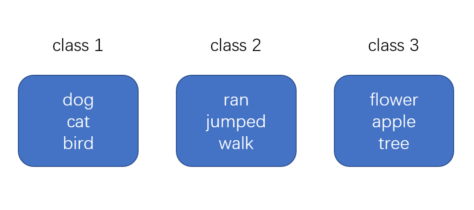


但是这种方法是比较粗糙的，比如在`class 1`中，虽然 3 个词都是动物，但是`dog`和`cat`都是哺乳类动物

，而`bird`是非哺乳类的动物。不能区分更加细微的区别，如果想要一直穷尽这种无尽的分类，是不现实的，也过度依赖于人的经验和知识。

# Word Embedding

因此出现了`Word Embedding`，这种方法是利用神经网络来学习出每个词的向量。那么语义相近的词向量就会靠得更近。而这种了向量是根据每个词的上下文训练出来的，主要有`GloVe`与`word2vec`。

- `word2vec`是`predictive`的模型。又可分为：`skip-gram`和`cbow`两种方法。`cbow`是根据上下文的词预测中心词，`skip-gram`是根据中心词预测周围的词。
- `Glove`是`count-based`的模型。本质上是对共现矩阵进行降维。首先，构建一个词汇的共现矩阵，每一行是一个 word，每一列是 context。共现矩阵就是计算每个 word 在每个 context 出现的频率。由于context 是多种词汇的组合，其维度非常大，我们希望像`network embedding`一样，在 context 的维度上降维，学习 word 的低维表示。这一过程可以视为共现矩阵的重构问题，即`reconstruction loss`。


两个模型在并行化上有一些不同，即GloVe更容易并行化，所以对于较大的训练数据，GloVe更快。

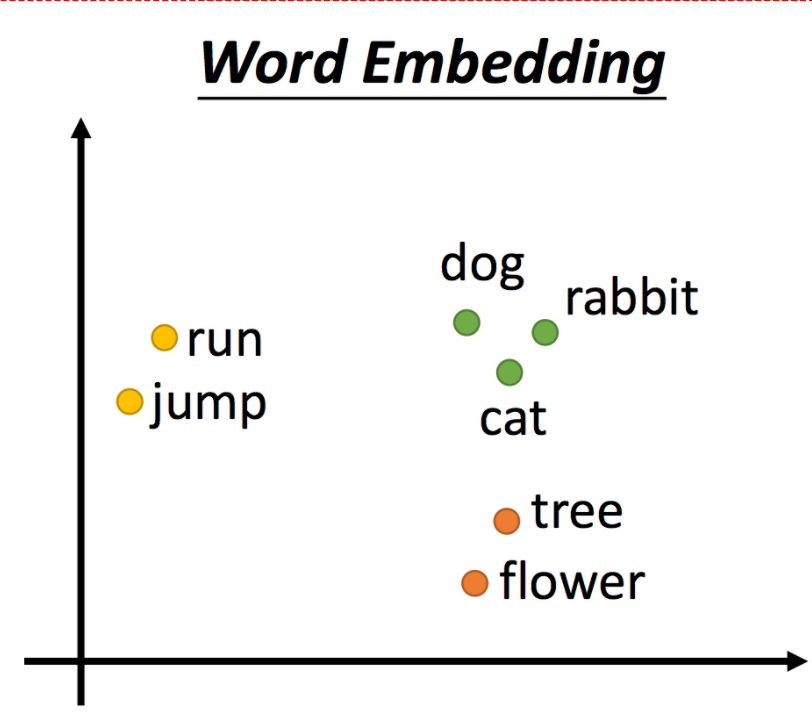


# Seq2Seq

首先来讲下`Seq2Seq`的模型，一般是由 RNN 组成的。下图是一个双向的 RNN，其中$(a^1,a^2,a^3,a^4)$是输入的序列，$(b^1,b^2,b^3,b^4)$是输出的序列。但是 RNN 难以并行计算，因为每一个输出的词，都需要等待**前面时间步**和**后面时间步**的词的`hidden_state`计算完成。

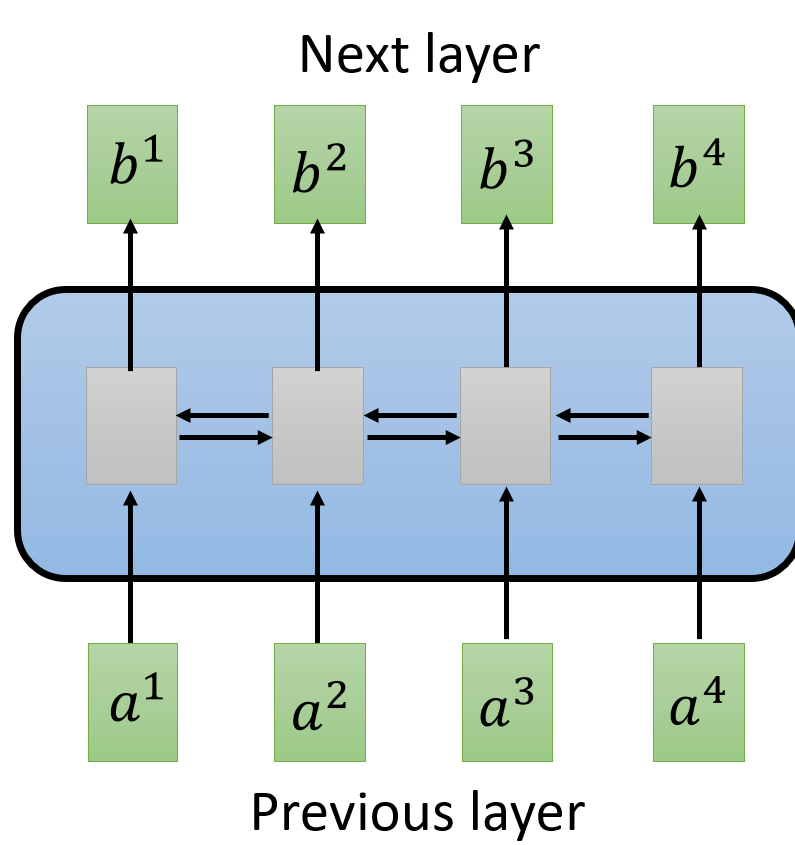


为了能够并行化计算，一种使用 CNN 来替代 RNN 的方法被提出来了，如下图所示。

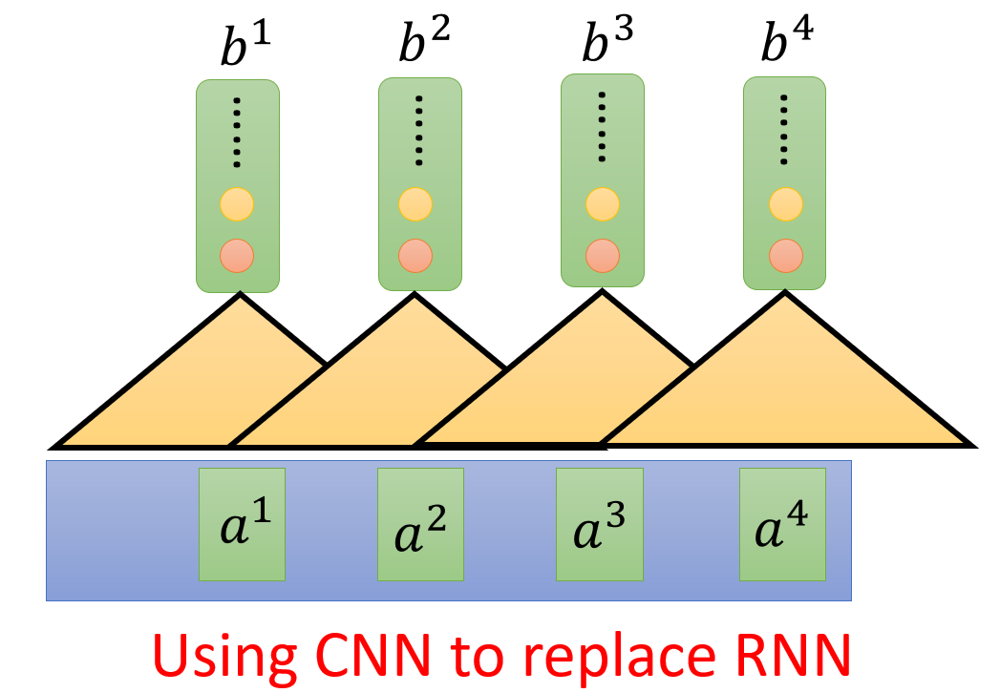


图中，每个三角形表示一个卷积核，而卷积运算是可以并行化的，每个卷积核的计算都不需要等待其他卷积核计算完成。但缺点是：每个卷积核的感受野就是比较小，每个卷积核不能看到所有的上下文的词。一种方法是堆叠多层的 CNN，这样高层的卷积核的感受野更大，可以看到更多的上下文单词。

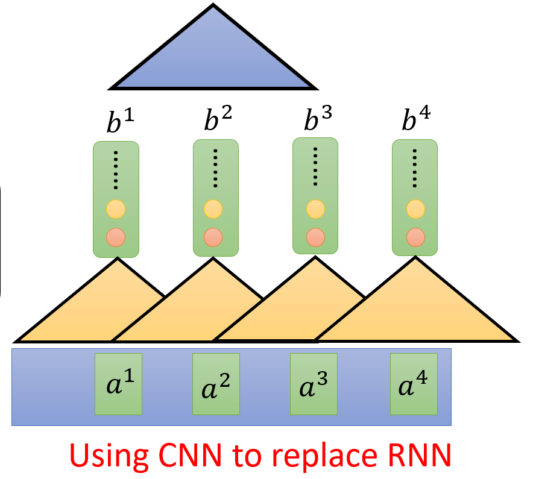


这种方法虽然解决了上下文的范围问题，但是会增加计算量，因为必须堆叠足够多的卷积层，才能看到所有的上下文单词。

# Self-Attention

简单总结一下：`Self-Attention`可以实现类似 RNN 的功能，在计算一个词的输出时，已经看过了前后上下文的单词。但相比于 RNN，`Self-Attention`可以并行计算。

## 1. 计算 query、key、value

下图是 Attention 的第一步。

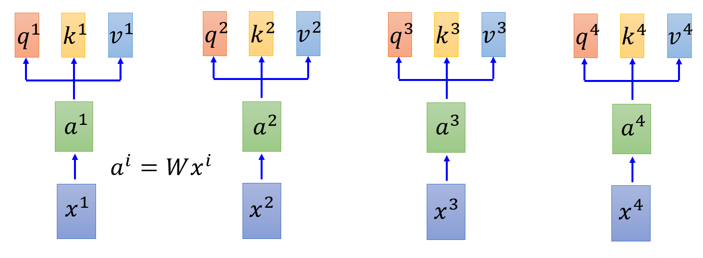


其中$[x^1,x^2,x^3,x^4]$是输入的序列，经过$a^i=W_{x^i}$，得到$[a^1,a^2,a^3,a^4]$，对于每一个$a^i$，分别计算 3 个值：

- query：$q^{i}=W^{q} a^{i}$，接下来和 key 计算 Attention
- key：$k^{i}=W^{k} a^{i}$，接下来和 query 计算 Attention
- value：接下来用于 Attention 相乘，抽取其中的 information

## 2. 计算 Attention

然后计算每个 query 和每个 key 两两之间的 Attention $\alpha_{i,j}$，$i$ 表示第 $i$ 个 query，$j$ 表示第 $i$ 个 key。每个 Attention 是一个实数，而不是矩阵。

下图以计算第一个 query 的 Attention 为例，将第一个 query 和所有的 key 计算 Attention，得到$\alpha_{1, j} = [\alpha_{1,1}, \alpha_{1,2}, \alpha_{1,3}, \alpha_{1,4}]$。

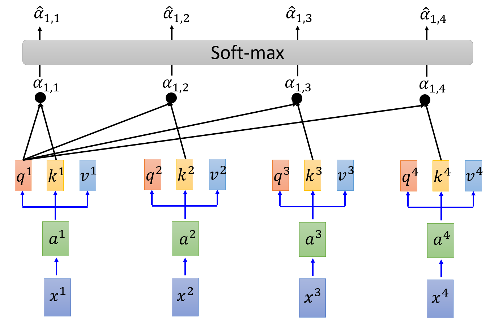

Attention 有很多计算方法，论文里使用向量内积来计算：$\alpha_{1, j}=q^{1} \cdot k^{j} / \sqrt{d}$，其中 $d$ 表示向量的维度。因为向量越长，内积可能越大；因此，内积的结果除以$\sqrt{d}$，是为了平衡向量的维度对 Attention 的影响。

然后，把 Attention $\alpha_{1, j}$经过一个 Softmax 层，得到$\hat{\alpha}_{1, j} = [\hat{\alpha}_{1,1}, \hat{\alpha}_{1,2}, \hat{\alpha}_{1,3}, \hat{\alpha}_{1,4}]$。

Softmax 层：$\hat{\alpha}_{1, i}=\exp \left(\alpha_{1, i}\right) / \sum_{j} \exp \left(\alpha_{1, j}\right)$

## 计算第一个输出

接下来，使用 Attention 和 value，计算第一个输出 $b^{1}=\sum_{i} \hat{\alpha}_{1, i} \cdot v^{i} = \hat{\alpha}_{1,1} \cdot v_{1} + \hat{\alpha}_{1,2} \cdot v_{2} + \hat{\alpha}_{1,3} \cdot v_{3} + \hat{\alpha}_{1,4} \cdot v_{4}$ 。

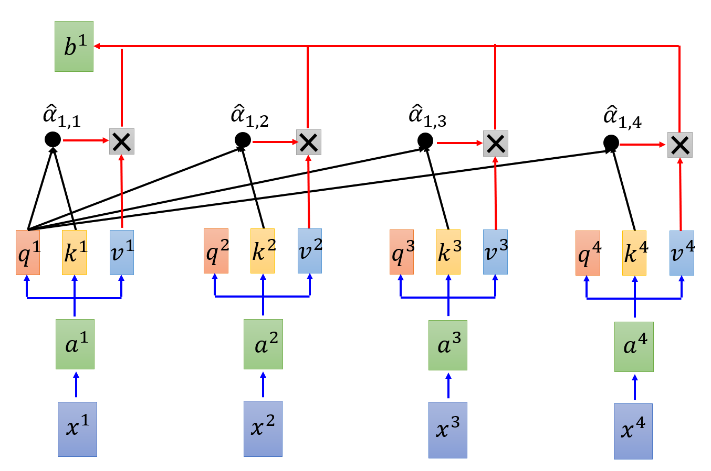


可以看出，$b^1$是考虑了整个 sequence 的 value 而计算得到的，因此起到了类似 RNN 的作用，如果不想考虑整个 sequence 的上下文，只需要让某些 Attention 等于 0 即可。

同理，其他的输出 $b^{2}, b^{3}, b^{4}$ 也可以计算出，并且 $b^{1}, b^{2}, b^{3}, b^{4}$ 是可以并行计算的。

下面，给出并行计算的过程。

## 并行计算

### 1. 计算 Q、K、V

首先，回到计算 query、key、value 的过程。其中 query、key、value 的计算，都可以使用矩阵来并行化计算。矩阵中每一列表示一个位置的值。

- $I = [a^{1}, a^{2}, a^{3}, a^{4}]$
- $Q = W^{q} \cdot I$
- $K = W^{k} \cdot I$
- $V = W^{v} \cdot I$

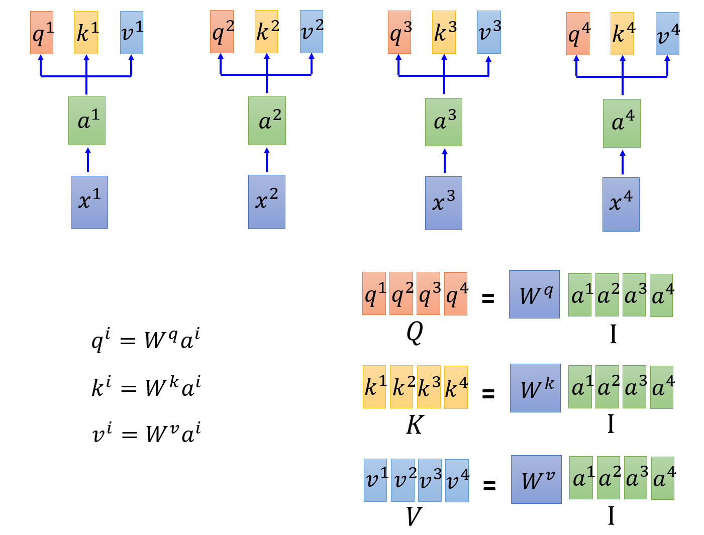

gif 动图如下：

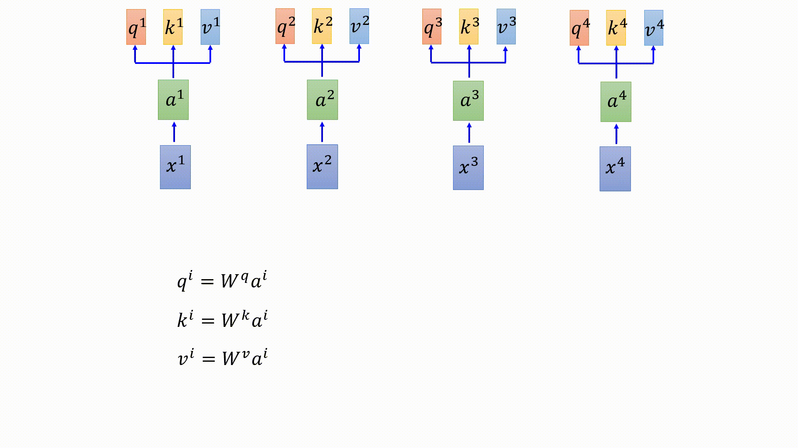

### 2. 计算 Attention $\hat{A}$

下一步是计算 Attention ，这一步的并行化如下图所示。

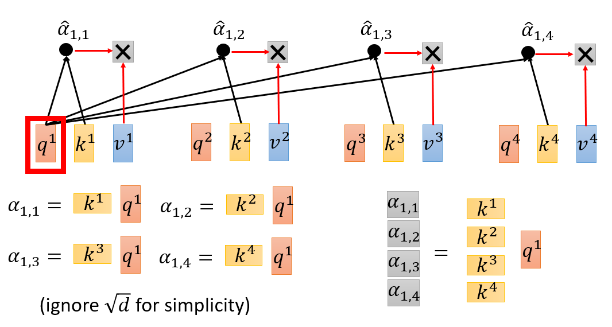


向量中的每个元素，表示一个 key 和一个 value 之间的 Attention 分数。可以使用矩阵来进一步并行化，然后对矩阵 A 的每一列做 Softmax。

- $A=K^{T} \cdot Q$
- $\hat{A} = Softmax(A)$


### 3. 计算输出 O

- 下一步是并行计算输出向量$b^i$，如下图所示。
- $O = V \cdot \hat{A}$

	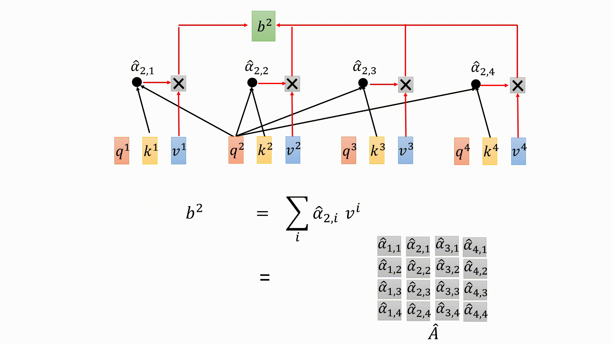

	**总结一下并行化计算的过程，如下：**

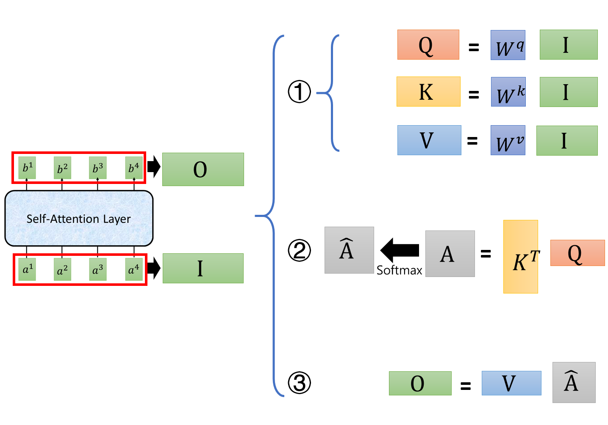

`Self-Attention`就是一系列的矩阵乘法，而矩阵乘法可以用使用 GPU 加速。

## Multi- -HeadSelf-Attention

`Multi- -HeadSelf-Attention`的思想是每个输入都会分别有两个`q、k、v`，分别得到两组 Attention，然后得到两个输出的向量 $b^{i,1}$、$b^{i,2}$。一种解释是：不同的 Attention 可能会聚焦到不同范围的上下文。

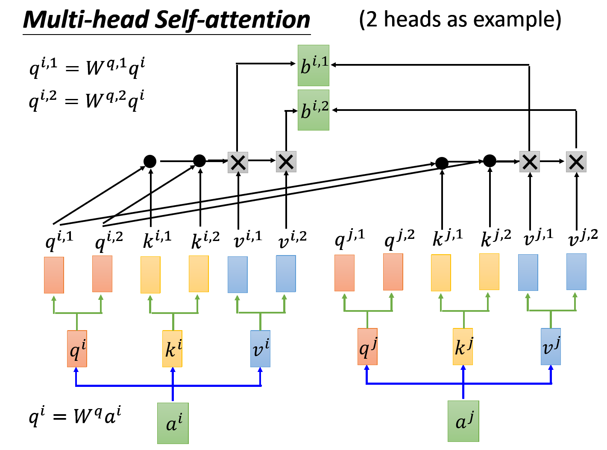

拼接起来得到最终输出，如果维度太长，可以乘以一个矩阵降维，得到bibi。

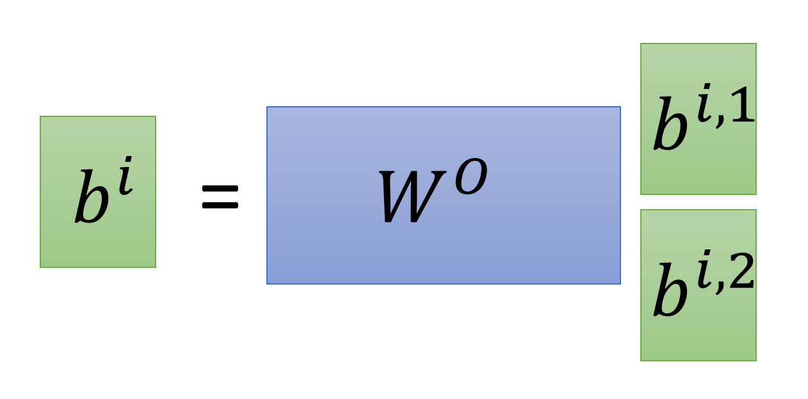


## Positional Encoding

在`Self-Attention`中，没有编码位置的信息，在矩阵乘法中，并不考虑输入的 sequence 的顺序。

因此一种想法是：在计算$a_{i}=w_{i} \cdot x_{i}$，加入表示位置的向量：$a_{i}=a_{i}+ e_{i}$，其中 $e_{i}$ 是表示位置的向量。

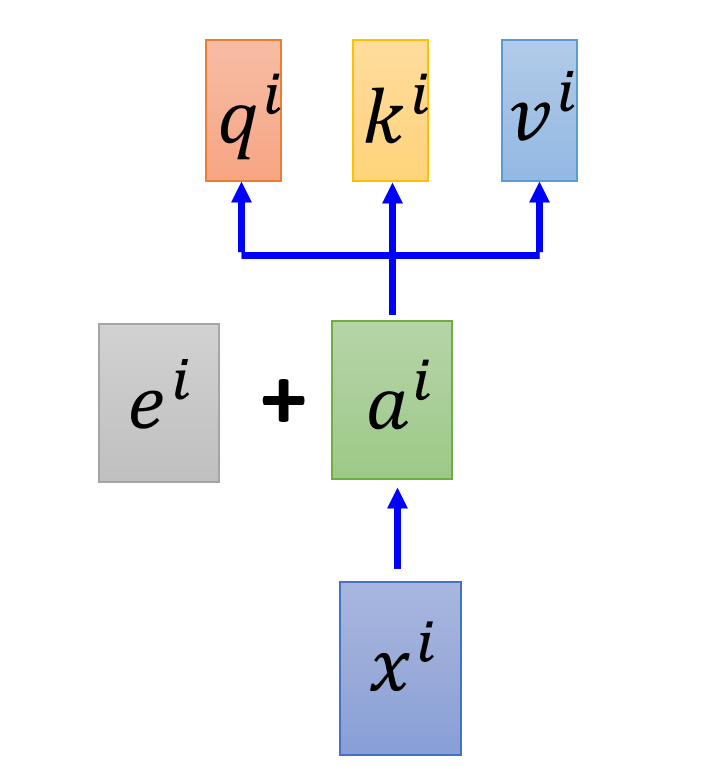


另一种做法是把$a_i$ 和 $e_i$ 拼接起来，得到$[a_i,e_i]$。从矩阵角度来看，这两种做法是一样的。

设 $p^i$ 是表示位置的向量，那么 $W \cdot \left[ \begin{array}{c|c} x^{i} \\ \hline p^{i} \end{array} \right]= \left[ \begin{array}{c|c} W^{I} & W^{P} \\ \end{array} \right] \cdot \left[ \begin{array}{c|c} x^{i} \\ \hline p^{i} \end{array} \right] = W^{I} \cdot x_{i} + W^{P} \cdot p_{i} = a^{i} + e^{i}$。

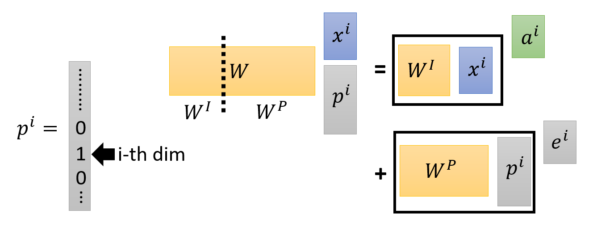

因此，Seq2Seq 的 Encoder 和 Decoder 部分，都可以使用 Self-Attention Layer 来实现。

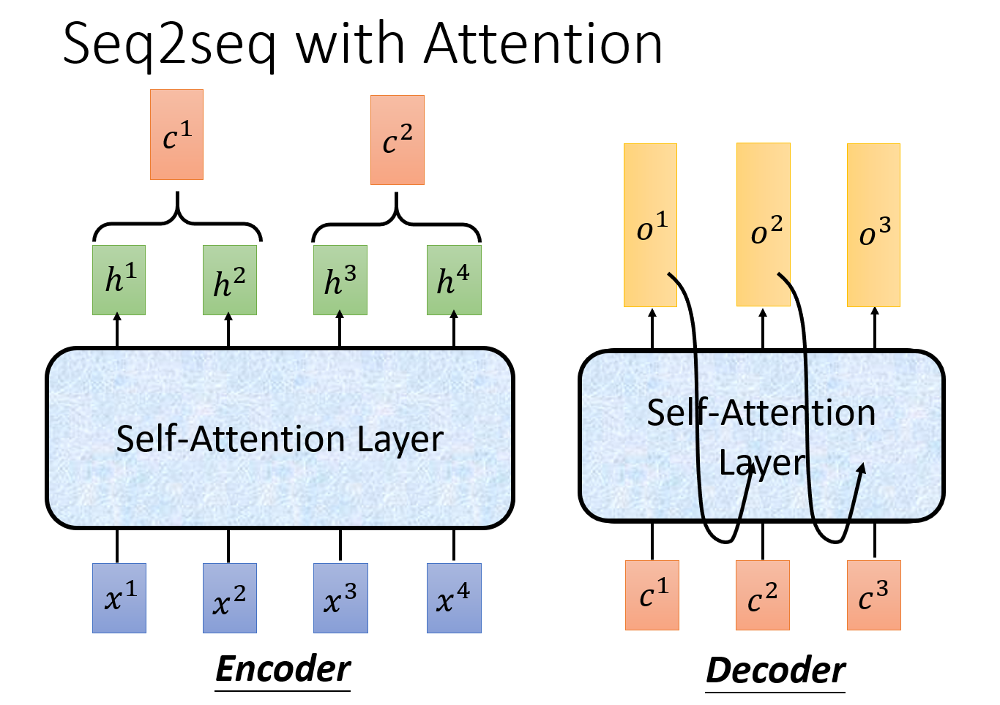


## 动画演示

在 Encoder 部分，有 3 层 Attention，可以并行计算。在 Decoder 部分，也有 3 层 Attention，这里不能并行计算，因为在计算输出时，每一个输出的词，除了依赖 Encoder 的输出，还依赖于前面输出的词。


# Transformer


`Transformer`实际上就是添加了`Self-attention`的`Seq2Seq` model。

结构图如下所示：

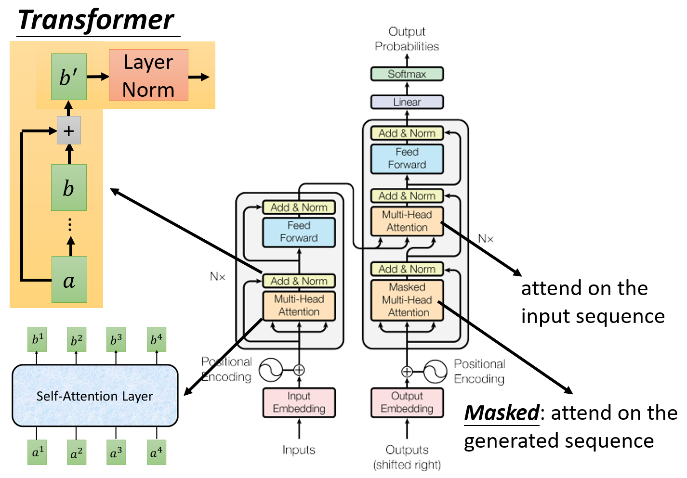

左边是 Encoder 部分，右边是 Decoder 部分。

- Encoder：输入的句子首先经过 Embedding layer 得到句子的词向量，加上 Positional Encoding 得到 aa，经过一个 Multi-Head-Attention Layer，得到 bb；然后 aa 和 bb 相加，得到 b′b′，经过 Layer Norm。接下来经过 Feed Forward 层，Add & Norm 层，得到输出序列。
- Decoder：输入是前面已经生成输出的词，首先经过 Masked Multi- Head-Attention，Masked 的意思是只关注已经产生的单词序列。然后和 Encoder 的输出一起，输入到 Multi-Head-Attention 中，接下来经过 Feed Forward 层，Add & Norm 层，Linear 层，Softmax 层，得到一个单词的输出。

## Attention 可视化

1. 下图是 Attention 的可视化，两两单词之间的 Attention 值越大，颜色越深；Attention 值越小，颜色越浅。

	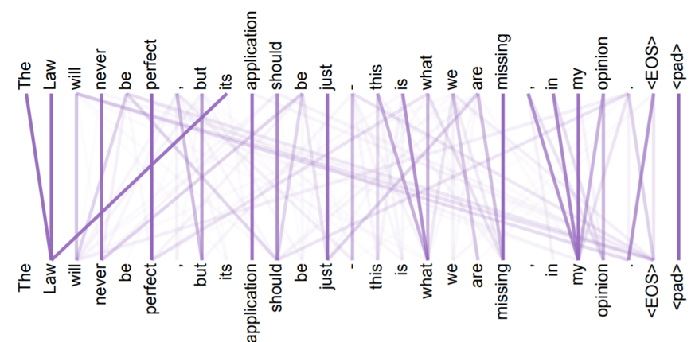

	

2. 下图是两句不同的话，把 Attention Layer 中间的 Hidden state 取出来做可视化的结果，单词之间的 Attention 值越大，颜色越深；Attention 值越小，颜色越浅。

	- 左边是第一句话：

		```
		animal didntcrossthestreet∵∗it∗was→otired.tcrossthestreet∵∗it∗was→otired.
		
		
		  其中的`it`指代的是`animal`，而 Attention 也正确学习到了`it`和`animal`之间的关系。
		
		- 左边是第一句话：
		
		  ```The animal didn`t cross the street because **it** was too tired.
		```

		与第一句话只有一个单词的差别。

		其中的`it`指代的是`street`，而 Attention 也正确学习到了`it`和`street`之间的关系。

	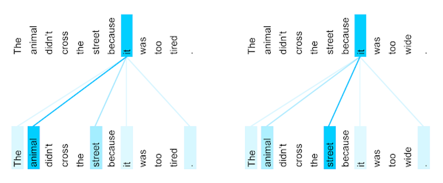

	

3. Multi-Head Attention

	下面两张图都是 Multi-Head Attention 的可视化。

	第一张图的 Multi-Head Attention 更加关注全局的上下文信息。

	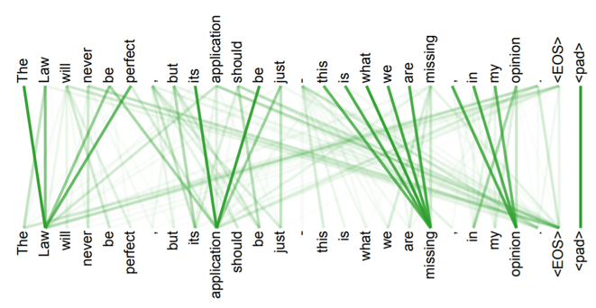


	第二张图的 Multi-Head Attention 更加关注局部的上下文信息。

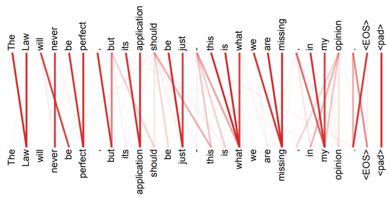


## 应用

Transformer 的应用非常广泛，只要能使用`Seq2Seq`的地方，都可以使用 Transformer。

下面的例子来源于https://arxiv.org/abs/1801.10198，输入多篇文章，输出是一篇综述。这种任务的输入一般是多篇文章，包括 102−106102−106 个词，输出是一篇文章，长度在 101−103101−103 个词，使用 RNN 训练一般难以收敛，但是使用 Transformer 来训练，可以得到不错的效果。

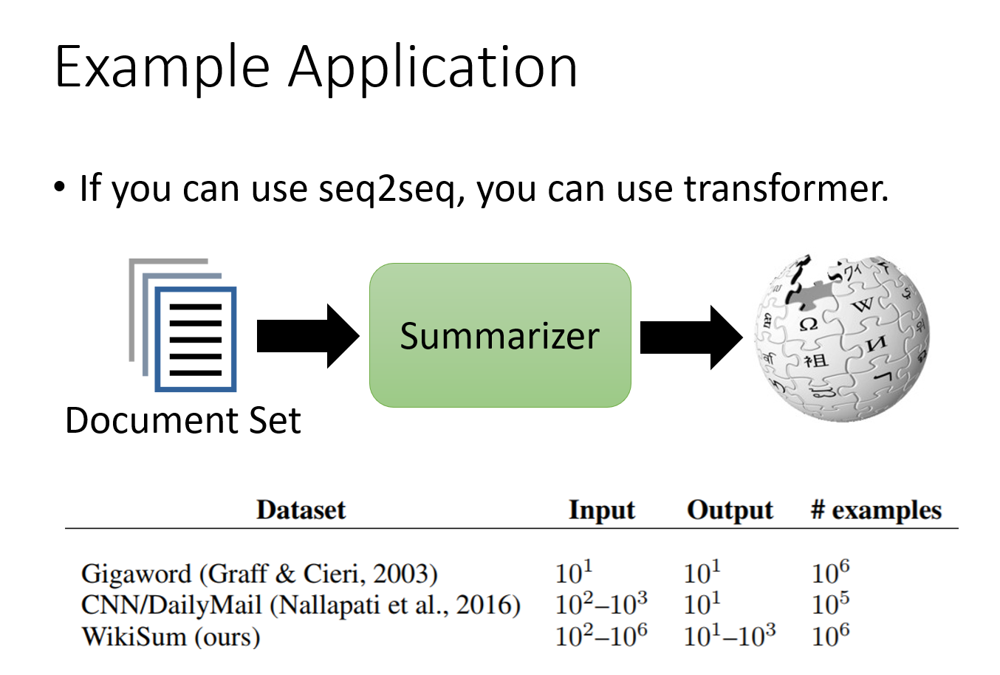


一种变种是：Universal Transformer。

本来在深度上，可以有多层不同的 Transformer。但是 Universal Transformer 在深度上，使用类似 RNN 的方式，把输出再循环连接到输入，相当于有多层相同的 Transformer。关于 Universal Transformer 更多细节参考：https://ai.googleblog.com/2018/08/moving-beyond-translation-with.html

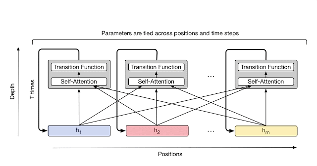


Attention 还可以用在图像上，如下图所示。计算每两个像素之间的 Attention，可以看出像素之间的关联性强弱。论文地址：https://arxiv.org/abs/1805.08318

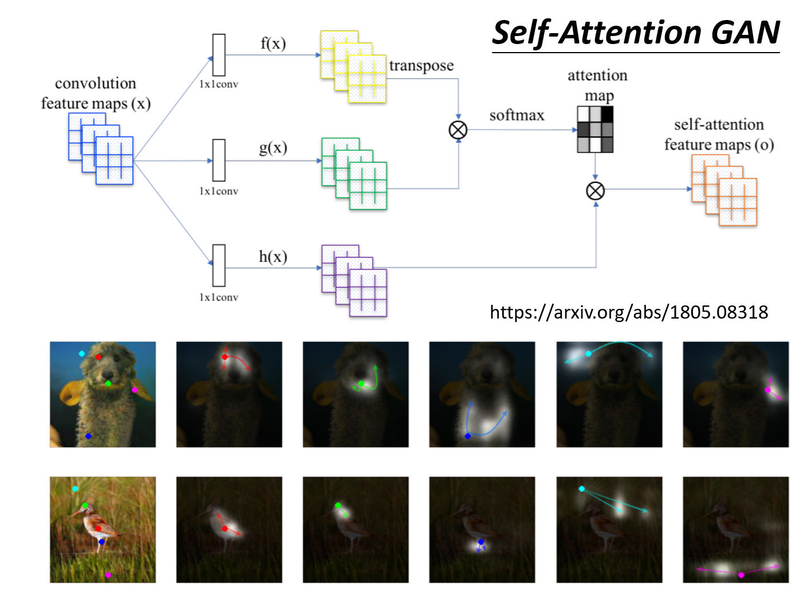