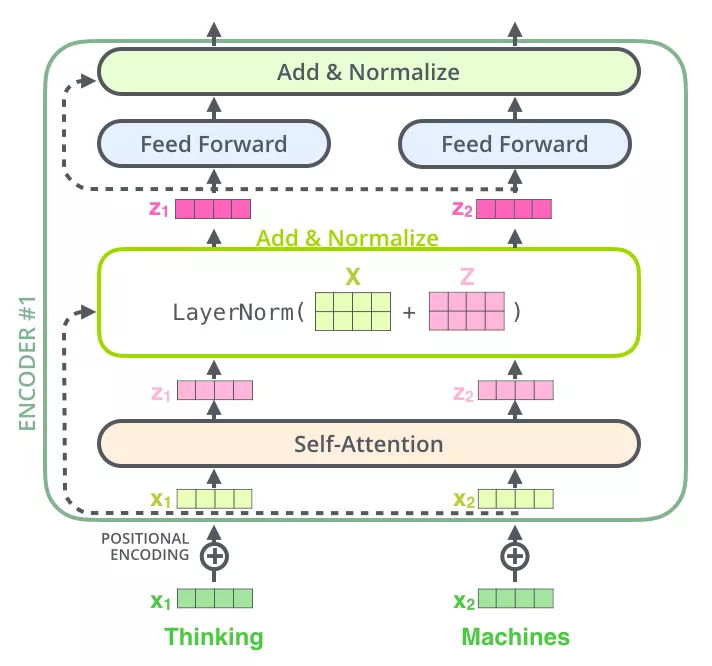
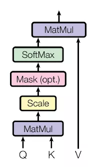
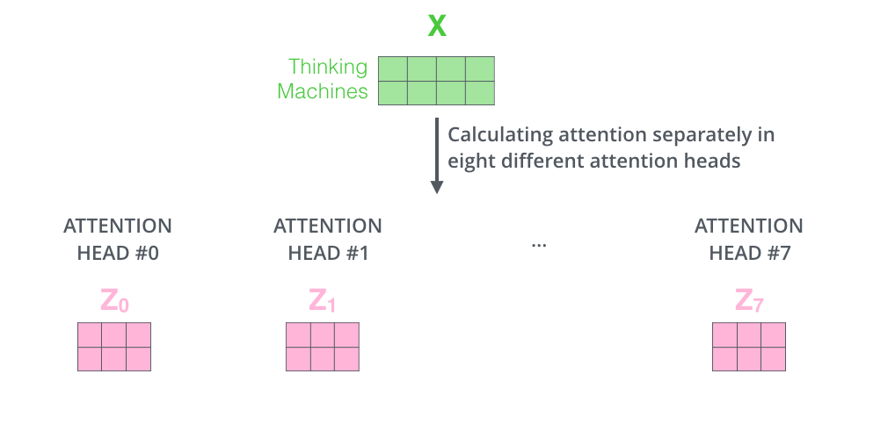
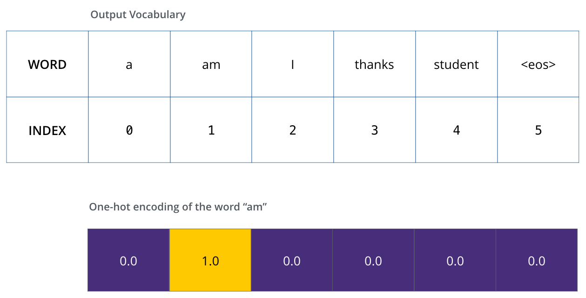
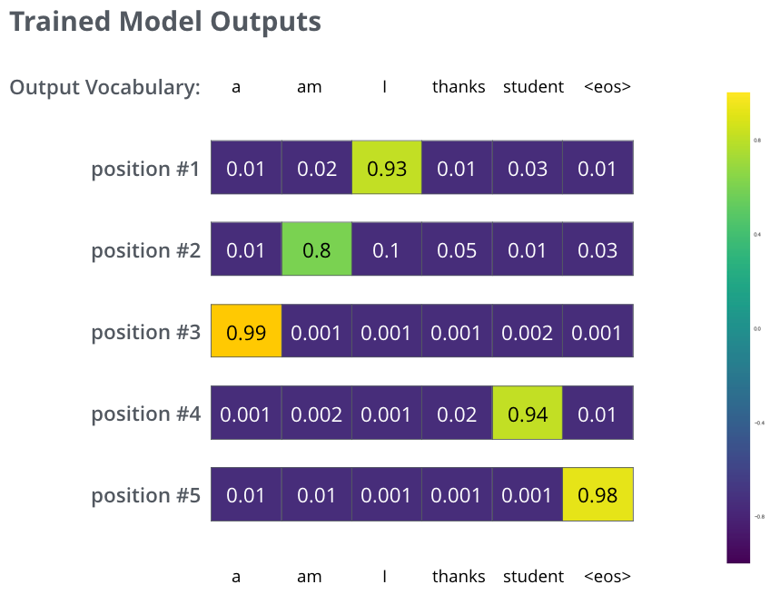

# Transformer是什么

在《Attention is all you need》中，**Transformer是一个用于机器翻译的编解码结构**，这也是它为什么叫Transformer的原因。后来，因为在序列编码中强大的特征抽取能力和高效的运算特性，Transformer被从编解码结构里抽离出来，成为了在NLP领域，目前最流行的特征抽取器。

# Transformer里有什么




上图是Transformer中，第一个sub-layer的结构示意图。其特别之处只有输入接收的为**字向量**和**位置编码**的和，其他sub-layer的输入为上一层sub-layer的输出。每一个sub-layer，除上述差异之外，别无二致，所以我们只需要了解一个就可以。


通常，会有多层这样的sub-layer，在Bert-base中，有12层，GPT-2.0则更深，所以参数量都很大。GPT-2.0的参数量达到了“丧心病狂”的3亿之多，是名副其实的大模型了。


先看看sub-layer都有些什么内容。

## self-attention



上图是Transformer中self-attention的计算过程。其实在Transformer中，$Q$,$K$,$V$指的都是输入序列乘上不同的权重$W_Q$,$W_K$,$W_V$。上述过程，可以用如下的公式概括：
$$
\text { Attention }(Q, K, V)=\operatorname{softmax}\left(\frac{Q K^{T}}{\sqrt{d_{k}}}\right) V
$$


在Transformer中，主要通过这样一层self-Attention对输入序列进行编码。


该编码过程的一个特点是，**在编码序列中的某一个词时，让该词充分的与序列中的其他词进行运算，从而能够得到该词与序列中所有词的句法和语义关系编码**。


该编码过程的另外一个重要的特点是，**序列是并行输入的，因此运算效率很高**。

##  Multi-head Attention

Multi-head Attention，即**多头注意力机制**。大概的处理流程如下图所示：


多头机制就是8组权重，计算出了8个不同的输出，再通过拼接和运算得到新的序列编码。那么，增加了8倍的参数和运算量。引入这样的机制有什么好处呢？

1) **极大的增强了模型的序列编码能力，特别是序列内词之间关系的语义表征能力**。这个可以这样去想，假如只有一个头的话，因为是self-attention，在计算过程中，很有可能该词与该词的的计算结果可能会比较大，从而词与自身的运算占据了很大的影响。如果引入多头机制，不同的权重，则可以避免这种弊端，增强模型的编码能力。

2) **实现了Attention的多个表征子空间**。这样的好处是，每个子空间可以表征序列不同方面语义信息。这方面没有看到相关论文的解释和支撑，就不多说了，了解的小伙伴可以留言指教。


##  Feed-forward

每一个sub-layer还会接一个Feed-forward Neural Network(FNN)，FNN的计算公式如下：
$$
\mathrm{FFN}(x)=\max \left(0, x W_{1}+b_{1}\right) W_{2}+b_{2}
$$


即在每个sub-layer，针对self-Attention层的输出，**先使用一个`线性变换`，再针对该线性变换的输出使用`RELU`函数，最后再针对RELU函数的输出使用一个`线性变换`**。那么，做这么繁琐的变换有什么意义呢？


我们将FNN与CNN做对比，其实可以发现，其效果与加上一层卷积核大小为1×1的CNN是一样的。那么这就好理解了，这层所谓的FNN其实也是做特征提取的。至于它为什么不直接取名为1×1 CNN layer，这就要去问Tranformer的发明者了。


在Transformer中，还有其他的层，例如Poition-Encoding层，The Residuals残差连接等，这些都好理解，读者可以参考前面推荐的Jay Alammar的博客。

# 再说Transformer

前面大概讲述了Transformer的结构及其每个sub-layer的组成。那么我们再来讨论一下，Transformer到底是什么？


我们可不可以这样说，**Transformer其实是一个用于对序列输入进行`特征编码`的工具。它以self-Attention机制为基础，从而能够编码序列输入的语义信息，对序列输入内不同词之间的关系也具有较强的编码能力，特别是Multi-Attention的引入，极大的增强了其编码能力。同时，Transformer内其实还有CNN的影子，尽管原作者避免提及。并且，因为其结构上的优势，像CNN一样，Transformer天然就能够并行计算，这一点是RNN等模型无法具备的**。

# 参考资料

1. [The Illustrated Transformer](http://jalammar.github.io/illustrated-transformer/)
2. [The Illustrated Transformer 【译】](https://blog.csdn.net/yujianmin1990/article/details/85221271)


# The Illustrated Transformer

## **前言**

翻译一篇非常赞的解释Transformer的文章，[原文链接](https://jalammar.github.io/illustrated-transformer/)。

在之前的[文章](https://jalammar.github.io/visualizing-neural-machine-translation-mechanics-of-seq2seq-models-with-attention/)中，Attention成了深度学习模型中无处不在的方法，它是种帮助提升NMT（Neural Machine Translation）的翻译效果的思想。在本篇博客中，我们解析下Transformer，该模型扩展Attention来加速训练，并且在特定任务上 Transformer 表现比 Google NMT 模型还要好。然而，其**最大的好处是可并行**。实际上[谷歌云](https://cloud.google.com/tpu/)推荐将Transformer作为云TPU的推导模型。现在我们将Transformer拆解开来看看它是如何工作的。

Transformer是在"[Attention is All You Need](https://arxiv.org/abs/1706.03762)"中提出的，其中的TF应用是[Tensor2Tensor](https://github.com/tensorflow/tensor2tensor)的子模块。哈佛的NLP团队专门制作了对应的PyTorch的[指南说明](http://nlp.seas.harvard.edu/2018/04/03/attention.html)。本文旨在简化难度，一步一步地解释其中的概念，希望有助于初学者更容易地理解。


**两层示例：**


## **A High-Level Look**

我们先将整个模型视为黑盒，比如在机器翻译中，接收一种语言的句子作为输入，然后将其翻译成其他语言输出。


细看下，其中由编码组件、解码组件和它们之间的连接层组成。


编码组件是六层编码器首位相连堆砌而成，解码组件也是六层解码器堆成的。


**编码器是完全结构相同的，但是并不共享参数**，每一个编码器都可以拆解成以下两个字部分。


编码器的输入首先流过一个self-attention层，当它编码某个词时, 该层**帮助编码器能够看到输入序列中的其他单词**。后面，我们会细看self-attention的内部结构。

self-attention的输出流向一个前向网络，**每个输入位置对应的前向网络是独立互不干扰的**。

解码器同样也有这些子层，但是在**两个子层间增加了attention层**，该层有助于解码器能够关注到输入句子的相关部分，与 [seq2seq model](https://jalammar.github.io/visualizing-neural-machine-translation-mechanics-of-seq2seq-models-with-attention/) 的Attention作用相似。


### **Bringing The Tensors Into the Picture**

现在，我们解析下模型最主要的组件，从向量/Tensor开始，然后是它们如何流经各个组件们并输出的。

正如NLP应用的常见例子，先将输入单词使用[embedding algorithm](https://medium.com/deeper-learning/glossary-of-deep-learning-word-embedding-f90c3cec34ca)转成向量。


每个词映射到512维向量上，此处用box表示向量。词的向量化仅仅发生在最底层的编码器的输入时，这样每个编码器的都会接收到一个list（每个元素都是512维的词向量），只不过其他编码器的输入是前个编码器的输出。

list的尺寸是可以设置的超参，**通常是训练集的最长句子的长度**。在对输入序列做词的向量化之后，它们流经编码器的如下两个子层。


这里能看到Transformer的一个关键特性，每个位置的词仅仅流过它自己的编码器路径。**在self-attention层中，这些路径两两之间是相互依赖的**。**前向网络层则没有这些依赖性**，但这些路径在流经前向网络时可以并行执行。

### **Now We're Encoding !**

正如之前所提，编码器接收向量的list作输入。然后将其送入self-attention处理，再之后送入前向网络，最后将输入传入下一个编码器。


每个位置的词向量被送入self-attention模块，然后是前向网络(对每个向量都是完全相同的网络结构)

## **Self-Attention at a High Level**

不要被self-attention这个词迷惑了，看起来好像每个人对它都很熟悉，但是在我读到Attention is All You Need这篇文章之前，我个人都没弄懂这个概念。下面我们逐步分解下它是如何工作的。

以下面这句话为例，作为我们想要翻译的输入语句“The animal didn’t cross the street because it was too tired”。句子中"it"指的是什么呢？“it"指的是"street” 还是“animal”？对人来说很简单的问题，但是对算法而言并不简单。

当模型处理单词“it”时，self-attention允许将“it”和“animal”联系起来。当模型处理每个位置的词时，**self-attention允许模型看到句子的其他位置信息作辅助线索来更好地编码当前词**。

如果你对RNN熟悉，就能想到RNN的隐状态是如何允许之前的词向量来解释合成当前词的解释向量。Transformer使用self-attention来将相关词的理解编码到当前词中。


当编码"it"时（编码器的最后层输出），部分attention集中于"the animal"，并将其表示合并进入到“it”的编码中。

上图是[Tensor2Tensor notebook](https://colab.research.google.com/github/tensorflow/tensor2tensor/blob/master/tensor2tensor/notebooks/hello_t2t.ipynb)的可视化例子。


### **Self-Attention in Detail**

我们先看下如何计算self-attention的向量，再看下如何以矩阵方式计算。

**第一步**，**根据编码器的输入向量，生成三个向量**。比如，对每个词向量，生成**query-vec, key-vec, value-vec**，生成方法为分别乘以三个矩阵，这些矩阵在训练过程中需要学习。【注意：不是每个词向量独享3个matrix，而是所有输入共享3个转换矩阵；**权重矩阵是基于输入位置的转换矩阵**；有个可以尝试的点，如果每个词独享一个转换矩阵，会不会效果更厉害呢？】

注意到这些新向量的维度比输入词向量的维度要小（512–>64），并不是必须要小的，是为了**让多头attention的计算更稳定**。


输入乘以$W^Q$得到query，所谓的query、key、value-vec是什么？这种提取对计算和思考attention是有益的，当读完下面attention是如何计算的之后，你将对这些向量的角色有更清晰的了解。

**第二步**，**计算attention就是计算一个分值**。对“Thinking Machines”这句话，对“Thinking”（pos#1）计算attention 分值。我们需要计算每个词与“Thinking”的评估分，这个分决定着编码“Thinking”时（某个固定位置时），每个输入词需要集中多少关注度。

这个分，通过“Thinking”对应query-vector与所有词的key-vec依次做点积得到。所以当我们处理位置#1时，第一个分值是q1和k1的点积，第二个分值是q1和k2的点积。


​	**第三步和第四步**，除以8（=$\sqrt{dim_{key}}$），这样梯度会更稳定。然后加上softmax操作，归一化分值使得全为正数且加和为1。


softmax分值决定着在这个位置，每个词的表达程度（关注度）。很明显，这个位置的词应该有最高的归一化分数，但大部分时候总是有助于关注该词的相关的词。

**第五步**，将softmax分值与value-vec按位相乘。保留关注词的value值，削弱非相关词的value值。

**第六步**，将所有加权向量加和，产生该位置的self-attention的输出结果。


上述就是self-attention的计算过程，生成的向量流入前向网络。在实际应用中，上述计算是以速度更快的矩阵形式进行的。下面我们看下在单词级别的矩阵计算。

### **Matrix Calculation of Self-Attention**

**第一步**，计算query / key / value matrix，将所有输入词向量合并成输入矩阵$X$，并且将其分别乘以权重矩阵$W^q$,$W^k$,$W^v$。


输入矩阵X的每一行表示输入句子的一个词向量。

**最后**，鉴于我们使用矩阵处理，将步骤2~6合并成一个计算self-attention层输出的公式。


<center>矩阵形式的self-attention计算</center>

### **The Beast With Many Heads**

论文进一步增加了multi-headed的机制到self-attention上，在如下两个方面提高了attention层的效果：

1. 多头机制**扩展了模型集中于不同位置的能力**。在上面的例子中，z1只包含了其他词的很少信息，仅由实际自己词决定。在其他情况下，比如翻译“The animal didn’t cross the street because it was too tired”时，我们想知道单词"it"指的是什么。
2. 多头机制**赋予attention多种子表达方式**。像下面的例子所示，在多头下有多组query/key/value-matrix，而非仅仅一组（论文中使用8-heads）。每一组都是随机初始化，经过训练之后，输入向量可以被映射到不同的子表达空间中。


每个head都有一组Q/K/V matrix，如果我们计算multi-headed self-attention的，分别有八组不同的Q/K/V matrix，我们得到八个不同的矩阵。



这会带来点麻烦，前向网络并不能接收八个矩阵，而是希望输入是一个矩阵，所以要有种方式处理下**八个矩阵合并成一个矩阵**。


上述就是多头自注意机制的内容，我认为还仅是一部分矩阵，下面尝试着将它们放到一个图上可视化如下。


现在加入attention heads之后，重新看下当编码“it”时，哪些attention head会被集中。


编码"it"时，一个attention head集中于"the animal"，另一个head集中于"tired"，某种意义上讲，模型对"it"的表达合成了的"animal"和"tired"两者。

如果我们将所有的attention heads都放入到图中，就很难直观地解释了。

### **Representing The Order of The Sequence Using Positional Encoding**

截止到目前为止，我们还没有讨论如何理解输入语句中词的顺序。为解决词序的利用问题，Transformer新增了一个向量对每个词，这些向量遵循模型学习的指定模式，来决定词的位置，或者序列中不同词的举例。对其理解，增加这些值来提供词向量间的距离，当其映射到Q / K / V向量以及点乘的attention时。


为了能够给模型提供词序的信息，新增位置**embedding向量**，每个向量值都遵循指定模式。

如果假设位置向量有4维，实际的位置向量将如下所示：


一个只有4维的位置向量表示例子，所谓的指定模式是什么样的呢？

在下图中，每一行表示一个位置的pos-embedding，所以第一行是我们将要加到句子第一个词向量上的vector。每个行有512值，每个值范围在[-1,1]，我们将要涂色以便于能够将模式可视化。


一个真实的例子有20个词，每个词512维。可以观察中间显著的分隔，那是因为左侧是用sine函数生成，右侧是用cosine生成。

位置向量编码方法在论文的3.5节有提到，也可以看代码[get_timing_signal_ld()](https://github.com/tensorflow/tensor2tensor/blob/23bd23b9830059fbc349381b70d9429b5c40a139/tensor2tensor/layers/common_attention.py)，对位置编码而言并不只有一种方法。需要注意的是，编码方法**必须能够处理未知长度的序列**。

### **The Residuals**

编码器结构中值得提出注意的一个细节是，在每个子层中（slef-attention, ffnn），都有残差连接，并且紧跟着[layer-normalization](https://arxiv.org/abs/1607.06450)。


如果我们可视化向量和layer-norm操作，将如下所示：


在解码器中也是如此，假设两层编码器+两层解码器组成Transformer，其结构如下：


### **The Decoder Side**

现在我们已经了解了编码器侧的大部分概念，也基本了解了解码器的工作方式，下面看下他们是如何共同工作的。

编码器从输入序列的处理开始，最后的**编码器的输出被转换为K和V**，它俩被每个解码器的"encoder-decoder atttention"层来使用，帮助解码器集中于输入序列的合适位置。


在编码之后，是解码过程；解码的每一步输出一个元素作输出序列。

下面的步骤一直重复直到一个特殊符号出现表示解码器完成了翻译输出。每一步的输出被喂到下一个解码器中。正如编码器的输入所做的处理，对解码器的输入增加位置向量。


在解码器中的self attention 层与编码器中的稍有不同，在解码器中，self-attention 层仅仅允许关注**早于当前输出**的位置。在softmax之前，**通过遮挡未来位置**（将它们设置为-inf）来实现。

Encoder-Decoder Attention层工作方式跟multi-headed self-attention是一样的，除了一点，**它从前层获取输出转成query矩阵，接收最后层编码器的key和value矩阵做key和value矩阵**。


## **The Final Linear and Softmax Layer**

解码器最后输出浮点向量，如何将它转成词？这是最后的线性层和softmax层的主要工作。

线性层是个简单的**全连接层**，将解码器的最后输出映射到一个非常大的logits向量上。假设模型已知有1万个单词（输出的词表）从训练集中学习得到。那么，logits向量就有1万维，每个值表示是某个词的可能倾向值。

**softmax层将这些分数转换成概率值**（都是正值，且加和为1），最高值对应的维上的词就是这一步的输出单词。


## **Recap of Training**

现在我们已经了解了一个训练完毕的Transformer的前向过程，顺道看下训练的概念也是非常有用的。

在训练时，模型将经历上述的前向过程，当我们在标记训练集上训练时，可以对比预测输出与实际输出。

为了可视化，假设输出一共只有6个单词（“a”, “am”, “i”, “thanks”, “student”, “”）


<center>模型的词表是在训练之前的预处理中生成的</center>

一旦定义了词表，我们就能够构造一个同维度的向量来表示每个单词，比如one-hot编码，下面举例编码"am"。



<center>举例采用one-hot编码输出词表</center>

下面让我们讨论下模型的loss损失，在训练过程中用来优化的指标，指导学习得到一个非常准确的模型。


### **The Loss Function**

我们用一个简单的例子来示范训练，比如翻译“merci”为“thanks”。那意味着输出的概率分布指向单词“thanks”，但是由于模型未训练是随机初始化的，不太可能就是期望的输出。


由于模型参数是随机初始化的，未训练的模型输出随机值。我们可以对比真实输出，然后利用误差后传调整模型权重，使得输出更接近与真实输出。

如何对比两个概率分布呢？简单采用 [cross-entropy](https://colah.github.io/posts/2015-09-Visual-Information/)或者[Kullback-Leibler divergence](https://www.countbayesie.com/blog/2017/5/9/kullback-leibler-divergence-explained)中的一种。

鉴于这是个极其简单的例子，更真实的情况是，使用一个句子作为输入。比如，输入是“je suis étudiant”，期望输出是“i am a student”。在这个例子下，我们期望模型输出连续的概率分布满足如下条件：

1. 每个概率分布都与词表同维度。
2. 第一个概率分布对“i”具有最高的预测概率值。
3. 第二个概率分布对“am”具有最高的预测概率值。
4. 一直到第五个输出指向""标记。


<center>对一个句子而言，训练模型的目标概率分布</center>

在足够大的训练集上训练足够时间之后，我们期望产生的概率分布如下所示：



训练好之后，模型的输出是我们期望的翻译。当然，这并不意味着这一过程是来自训练集。注意，每个位置都能有值，即便与输出近乎无关，这也是softmax对训练有帮助的地方。

现在，因为模型每步只产生一组输出，假设模型选择最高概率，扔掉其他的部分，这是种产生预测结果的方法，叫做**greedy 解码**。另外一种方法是**beam search**，每一步仅保留最头部高概率的两个输出，根据这俩输出再预测下一步，再保留头部高概率的两个输出，重复直到预测结束。top_beams是超参可试验调整。


### **Go Forth And Transform**

希望本文能够帮助读者对Transformer的主要概念理解有个破冰效果，如果想更深入了解，建议如下步骤：

1. 阅读 [Attention Is All You Need](https://arxiv.org/abs/1706.03762)paper，Transformer的博客文章[Transformer: A Novel Neural Network Architecture for Language Understanding](https://ai.googleblog.com/2017/08/transformer-novel-neural-network.html)，[Tensor2Tensor](https://ai.googleblog.com/2017/06/accelerating-deep-learning-research.html)使用说明。
2. 观看"[Łukasz Kaiser’s talk](https://www.youtube.com/watch?v=rBCqOTEfxvg)"，梳理整个模型及其细节。
3. 耍一下项目
4. 尝试下项目[Tensor2Tensor](https://github.com/tensorflow/tensor2tensor)


`相关工作`:

1. [Depthwise Separable Convolutions for Neural Machine Translation](https://arxiv.org/abs/1706.03059)
2. [One Model To Learn Them All](https://arxiv.org/abs/1706.03059)
3. [Discrete Autoencoders for Sequence Models](https://arxiv.org/abs/1801.09797)
4. [Generating Wikipedia by Summarizing Long Sequences](https://arxiv.org/abs/1801.10198)
5. [Image Transformer](https://arxiv.org/abs/1802.05751)
6. [Training Tips for the Transformer Model](https://arxiv.org/abs/1804.00247)
7. [Self-Attention with Relative Position Representations](https://arxiv.org/abs/1803.02155)
8. [Fast Decoding in Sequence Models using Discrete Latent Variables](https://arxiv.org/abs/1803.03382)
9. [Adafactor: Adaptive Learning Rates with Sublinear Memory Cost](https://arxiv.org/abs/1804.04235)


`致谢：`

Thanks to Illia Polosukhin, Jakob Uszkoreit, Llion Jones , Lukasz Kaiser, Niki Parmar, and Noam Shazeer for providing feedback on earlier versions of this post.

Please hit me up on [Twitter](https://twitter.com/jalammar) for any corrections or feedback.


# 试题

## 不考虑多头的原因，self-attention中词向量不乘QKV参数矩阵，会有什么问题？

Self-Attention的核心是**用文本中的其它词来增强目标词的语义表示**，从而更好的利用上下文的信息。

self-attention中，sequence中的每个词都会和sequence中的每个词做点积去计算相似度，也包括这个词本身。

如果不乘QKV参数矩阵，那这个词对应的q,k,v就是完全一样的。

在相同量级的情况下，qi与ki点积的值会是最大的（可以从“两数和相同的情况下，两数相等对应的积最大”类比过来）。

那在softmax后的加权平均中，该词本身所占的比重将会是最大的，使得其他词的比重很少，无法有效利用上下文信息来增强当前词的语义表示。

而乘以QKV参数矩阵，会使得每个词的q,k,v都不一样，能很大程度上减轻上述的影响。

当然，QKV参数矩阵也使得多头，类似于CNN中的多核，去捕捉更丰富的特征/信息成为可能。


## Transformer在哪里做了权重共享，为什么可以做权重共享？

Transformer在两个地方进行了权重共享：

**（1）**Encoder和Decoder间的Embedding层权重共享；

**（2）**Decoder中Embedding层和FC层权重共享。

**对于（1）**，《Attention is all you need》中Transformer被应用在机器翻译任务中，源语言和目标语言是不一样的，但它们可以共用一张大词表，对于两种语言中共同出现的词（比如：数字，标点等等）可以得到更好的表示，而且对于Encoder和Decoder，**嵌入时都只有对应语言的embedding会被激活**，因此是可以共用一张词表做权重共享的。

论文中，Transformer词表用了bpe来处理，所以最小的单元是subword。英语和德语同属日耳曼语族，有很多相同的subword，可以共享类似的语义。而像中英这样相差较大的语系，语义共享作用可能不会很大。

但是，共用词表会使得词表数量增大，增加softmax的计算时间，因此实际使用中是否共享可能要根据情况权衡。

该点参考：https://www.zhihu.com/question/333419099/answer/743341017

**对于（2）**，Embedding层可以说是通过onehot去取到对应的embedding向量，FC层可以说是相反的，通过向量（定义为 x）去得到它可能是某个词的softmax概率，取概率最大（贪婪情况下）的作为预测值。

那哪一个会是概率最大的呢？在FC层的每一行量级相同的前提下，理论上和 x 相同的那一行对应的点积和softmax概率会是最大的（可类比本文问题1）。

因此，Embedding层和FC层权重共享，Embedding层中和向量 x 最接近的那一行对应的词，会获得更大的预测概率。实际上，Decoder中的**Embedding层和FC层有点像互为逆过程**。

通过这样的权重共享可以减少参数的数量，加快收敛。

但开始我有一个困惑是：Embedding层参数维度是：(v,d)，FC层参数维度是：(d,v)，可以直接共享嘛，还是要转置？其中v是词表大小，d是embedding维度。

查看 pytorch 源码发现真的可以直接共享：

```python
fc = nn.Linear(d, v, bias=False)    # Decoder FC层定义
weight = Parameter(torch.Tensor(out_features, in_features))   # Linear层权重定义
```

Linear 层的权重定义中，是按照 (out_features, in_features) 顺序来的，实际计算会先将 weight 转置在乘以输入矩阵。所以 FC层 对应的 Linear 权重维度也是 (v,d)，可以直接共享。


## transformer中的attention为什么scaled?

- https://www.zhihu.com/question/339723385

