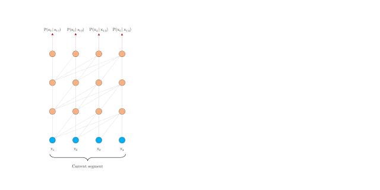
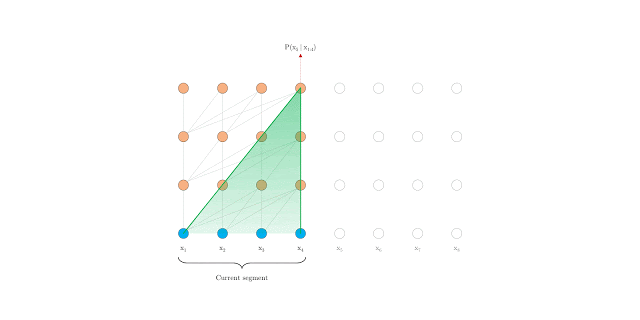
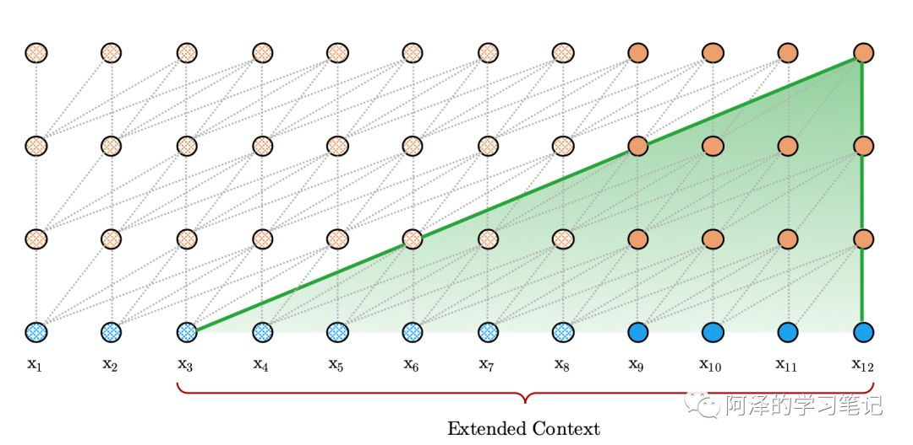
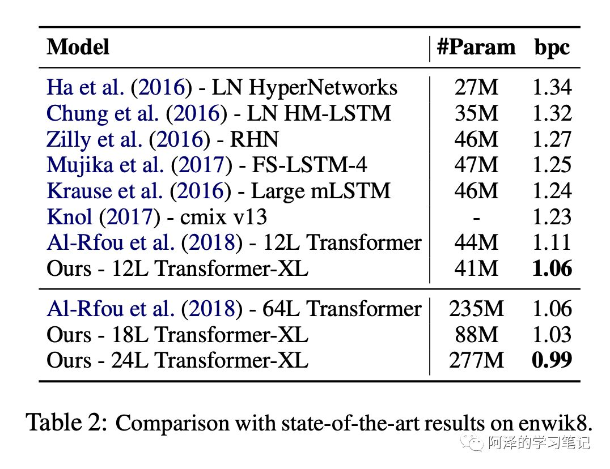
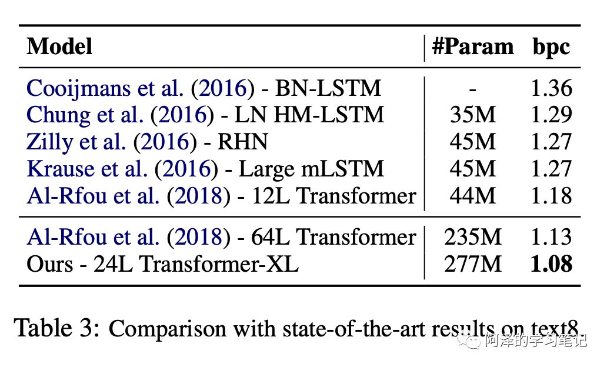
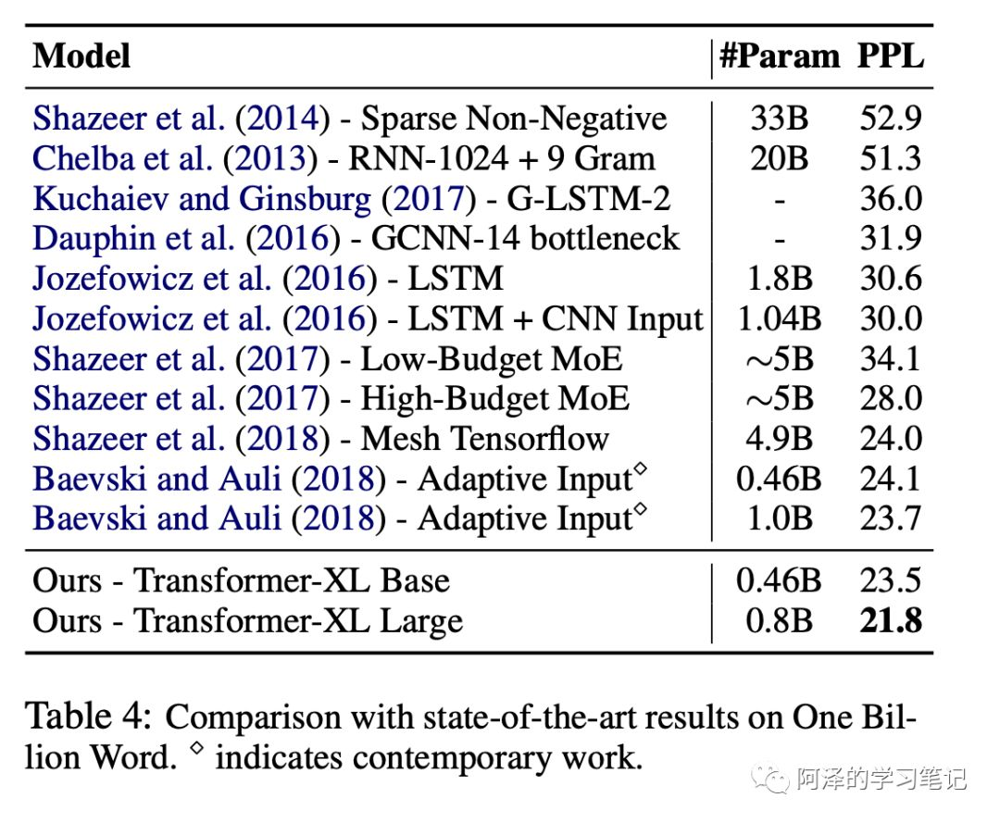
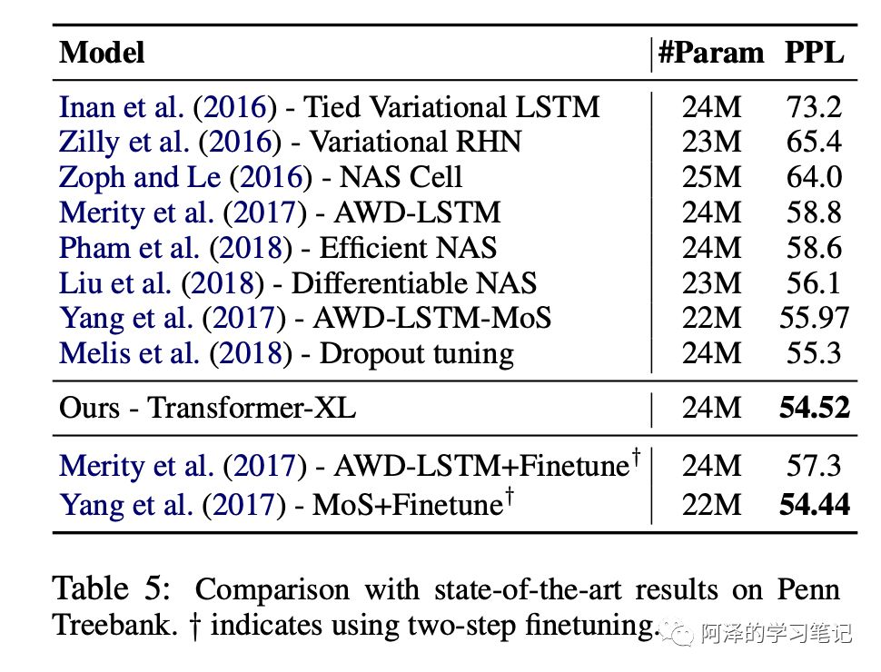
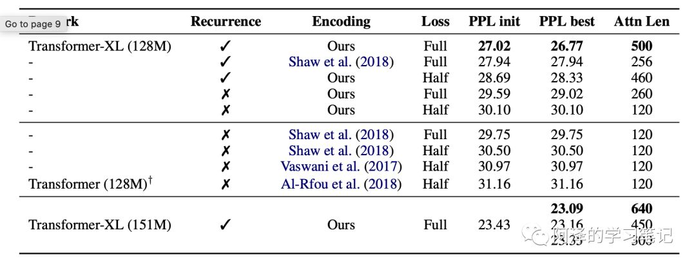
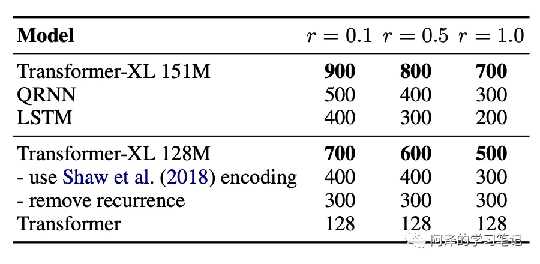

《Transformer-XL: Attentive Language Models Beyond a Fixed-Length Context》这篇论文是谷歌大脑的同学和 CMU 的同学于 2019 年联合出品。

这篇论文提出的 Transformer-XL 主要是**针对 Transformer 在解决长依赖问题中受到固定长度上下文的限制**，如 Bert 采用的 Transformer 最大上下文为 512。

Transformer-XL 采用了一种 **segment-level 的递归方法**，不仅解决长依赖的问题，还解决了上下文碎片问题。最终，Transformer-XL 能学习到的长依赖超过 LSTM 80%，并比原来的 Transforner 多出 4.5 倍。而且 Transformer-XL 在长短序列中都获得了不错的性能，预测速度更是比原来快了 1800 多倍。

# Introduction

长依赖一直是序列数据中比较常见的问题，尤其是 NLP 领域。Transformer 虽然在编码能力上超越了 LSTM，但是其对长距离依赖的建模能力没有 LSTM 那么强。Transformer 的 Attention 机制理论上可以在任意两个词之间建立联系，但由于效率原因，在实际使用过程中每次都会限制**固定长度**的上下文输入，这种固定长度的上下文有两个缺点：

1. 没法捕捉**超出最大长度**的依赖问题；
2. 固定长度的输入**忽略了句子的边界和语义的边界**，特别是对于基于 token 的英文单词来说。

模型因缺乏必要的上下文信息而很好的预测 token，这种问题有一个专业的名词：**上下文碎片（context fragmentation）**。为了解决这种问题，作者提出了 Transformer-XL（XL 表示 extra long）模型，并在两个改进方法：

1. **片段级递归机制**：由于隐藏层状态包含了片段的其相关信息，通过建立**循环链接**，重用先前片段的隐藏层状态使得建模长依赖关系成为可能（类似 RNN），同时也解决了上下文碎片的问题。
2. **相对位置编码**：相对编码可以在不引起 time step 混乱的情况下实现**状态重用**。

接下来我们看 Transformer-XL 的详细内容。

# Transformer-XL

## **Vanilla Transformer**

要想将 Transformer 应用到模型中，要解决的**核心问题是如何训练 Transformer 使其可以将任意大小的上下文编码为固定大小的 Representation**。

如果不考虑计算资源和内存的话，最简单粗暴的方法就是直接使用 Transformer 来对**整个序列**进行编码。但我们知道这种方法是不可能的。

还有一种可行但是比较粗糙的方法是将整个语料库**分为多个大小相同的片段**（segment），然后只在每个片段上训练而忽视所有的上下文信息，这种方法我们称为 Vanilla Transformer：

在预测过程中，Vanilla Transformer 也采用与训练相同大小的片段来预测最后一个位置，然后每次基于滑动窗口向右移动一个位置：

这种方法一定程度上确保了在预测过程中尽可能大的利用上下文，缓解了上下文碎片问题，但由于每次移动，新的片段都需要重新计算一次，所以其**计算代价昂贵**。

## **Segment-Level Recurrence**

为了解决固定长度上下文的带来的问题，作者建议在 Transformer 架构中引入**递归机制**（Recurrence Mechanism）。**在训练过程中，前一段计算出来的隐藏层状态会被固定并缓存下来，当模型处理下一个新段时作为扩展上下文而被重用**：

这种附加的连接可以随着网络深度的增加而增大依赖项的最大长度（想不通的可以想一下 GCN 的一阶领域）。除此之外，这种递归机制还可以解决上下文碎片问题，为新段前端的令牌提供必要的上下文信息。

又到了痛苦的时刻，我们来给出具体计算过程的数学公式：

假设现在有两个连续的分割片段$s_{\tau}=\left[x_{\tau, 1}, \cdots, x_{\tau, L}\right]$ 和 $s_{\tau+1}=\left[x_{\tau+1,1}, \cdots, x_{\tau+1, L}\right]$ ，其中 $x$ 表示 token，$L$ 为序列长度， $s_{\tau}$表示第$\tau$个分割片段。

假设 Transformer 有 N 层，那么每个片段$s_{\tau}$就有 N 个隐藏层状态，我们将第$\tau$个片段的第 $n$ 个隐藏层状态表示为 $h_{\tau}^n$， 那么第 $\tau +1$个片段的第 $n$ 层隐藏层状态就可以通过下式得出：
$$
\begin {aligned}
\tilde{h}_{\tau+1}^{n-1}&=\left[S G\left(h_{\tau}^{n-1}\right) \circ h_{\tau+1}^{n-1}\right] 
\end {aligned}
$$

$$
\begin {aligned}
\boldsymbol{q}_{\tau+1}^{n}, k_{\tau+1}^{n}, \boldsymbol{v}_{\tau+1}^{n} =h_{\tau+1}^{n-1} W_{q}^{\top}, \tilde{h}_{\tau+1}^{n-1} W_{k}^{\top}, \tilde{h}_{\tau+1}^{n-1} W_{v}^{\top}
\end {aligned}
$$

$$
\begin {aligned}
h_{\tau+1}^{n} =\text { Transformer-Layer }\left(q_{\tau+1}^{n}, k_{\tau+1}^{n}, v_{\tau+1}^{n}\right)
\end{aligned}
$$
其中，SG 是指 Stop-Gradient，表示**状态固定**，虽然提供信息但不再进行反向传播； $\tilde{h}_{\tau+1}^{n-1}$是一个临时符号，表示对两个连续片段第$n-1$层隐藏层状态的拼接。

$\boldsymbol{q}_{\tau}^{n}, \boldsymbol{k}_{\tau}^{n}, \boldsymbol{v}_{\tau}^{n}$ 分别表示 query、key 和 value 向量，**query 的计算方式不变**，而 key 和 value 是利用**拼接后的$\tilde{h}$**来计算。

由于这是递归机制，所以层数越高，所能依赖到的范围越大，最大可能依赖长度为$O(N \times L)$ ，如下图阴影部分所示：

除了**实现超长的上下文依赖**和**解决碎片问题外**，递归机制的另一个好处就是显著加快了计算速度。具体来说，Vanilla Transformer 每次都需要重新计算，而现在可以重用以前的片段，只要 GPU 内存允许，我们可以尽可能多的缓存之前的片段，并重用之前的片段以作为额外的上下文。

## **Relative Positional Encoding**

在 Vanilla Transformer 中，由于每个片段相互独立每次都会重新计算，且使用了绝对位置编码的方式，所以不会出现位置混乱的情况。但是在 Transformer-XL 中，**每个片段都是用相同的位置编码会导致在重用过程中无法保证位置信息的一致性**。

为了去避免这种情况，Transformer-XL 使用了**相对位置信息编码**的方式，从概念上来说，**位置编码会为模型提供 token 相对顺序的线索**。为了达到同样的目的，Transformer 在计算当前位置隐向量时，考虑和它存在依赖的 token 的相对位置。

具体来说，在计算 Attention 评分时不需要知道 Query 和 key 的绝对位置，只要知道相对位置即可，并**将这种相对位置关系动态的注入到每一层的 Attention 评分计算中，而不是静态地将偏差加入到初始 Embedding 中**。

我们来对比一下绝对位置和相对位置：

$$
\begin{aligned}
A_{i, j}^{a b s}=q_{i}^{\top} k_{j} &=\left(E_{x_{i}}+U_{i}\right)^{\top} W_{q}^{\top} W_{k}\left(E_{x_{j}}+U_{j}\right) \\
&=E_{x_{i}}^{\top} W_{q}^{\top} W_{k} E_{x_{j}}+E_{x_{i}}^{\top} W_{q}^{\top} W_{k} U_{j}+U_{i}^{\top} W_{q}^{\top} W_{k} E_{x_{j}}+U_{i}^{\top} W_{q}^{\top} W_{k} U_{j}
\end{aligned}
$$
其中， $E_{x_{i}}$为 token $x_i$的输入编码； $U_{i}$为绝对位置编码； $W_q, W_k$分别为 query 和 key 矩阵。

$$
A_{i, j}^{r e l}=\underbrace{E_{x_{i}}^{\top} W_{q}^{\top} W_{k, E} E_{x_{j}}}_{(a)}+\underbrace{E_{x_{i}}^{\top} W_{q}^{\top} W_{k, R} R_{i-j}}_{(b)}+\underbrace{u^{\top} W_{k, E} E_{x_{j}}}_{(c)}+\underbrace{v^{\top} W_{k, R} R_{i-j}}_{(d)}
$$
其中， $R_{i-j}$是相对位置编码矩阵；由于query 向量对于所有查询位置都是相同的，所以用$u^T$ 代替 $U_{i}^{T} W_{q}^{T}$，同样的原因，我们用 $v^T$代替$U_{i}^{T} W_{q}^{T}$ ；将 $W_k$用 $W_{k, E}, W_{k, R}$分别代替，以细分表示基于内容的 key 向量和基于位置信息的 key 向量。

在相对位置中，每个位置都有直观的含义：

1. 编码相邻内容的影响；
2. 编码与相邻内容相关的位置偏差；
3. 编码全局内容偏差；
4. 编码全局位置偏差。

Vanilla Transformer 只有前两种含义，而没有后两种含义。

最后我们来看下整体的公式：
$$
\begin {aligned}
\tilde{h}_{\tau+1}^{n-1} &=\left[S G\left(h_{\tau}^{n-1}\right) \circ h_{\tau+1}^{n-1}\right]
\end {aligned}
$$

$$
\begin {aligned}
q_{\tau+1}^{n}, k_{\tau+1}^{n}, v_{\tau+1}^{n} &=h_{\tau+1}^{n-1} W_{q}^{\top}, \tilde{h}_{\tau+1}^{n-1} W_{k}^{\top}, \tilde{h}_{\tau+1}^{n-1} W_{v}^{\top}
\end {aligned}
$$

$$
\begin {aligned}
A_{\tau, i, j}^{n} &=q_{\tau, i}^{n T} k_{\tau, j}^{n}+q_{\tau, i}^{n T} W_{k, R}^{n} R_{i-j}+u^{T} k_{\tau, j}+v^{T} W_{k, R}^{n} R_{i-j}
\end {aligned}
$$

$$
\begin {aligned}
a_{\tau}^{n} &=\text { Masked-Softmax }\left(A_{\tau}^{n}\right) v_{\tau}^{n}
\end {aligned}
$$

$$
\begin {aligned}
o_{\tau}^{n} &\left.=\text { LayerNorm(Linear }\left(a_{\tau}^{n}\right)+h_{\tau}^{n-1}\right) 
\end {aligned}
$$

$$
\begin {aligned}
h_{\tau}^{n} &=\text { Positionwise-Feed-Forward }\left(o_{\tau}^{n}\right)
\end {aligned}
$$

# Experience

模型在不同数据集下的表现：

各模型的相对有效长度（最长依赖长度）

# Conclusion

**总结**：Transformer-XL 从解决长距离依赖问题出来，提出了**循环机制**和**相对位置编码**这两个创新点，在解决了长依赖问题的同时也解决了上下文碎片的问题。此外，由于循环机制重用了先前隐藏层状态，其预测速度也得到了显著提升。诸多试验证明，Transformer-XL 相对 Vanilla Transformer 而言具有很好的性能。

## 优点

1. 在几种不同的数据集（大/小，字符级别/单词级别等）均实现了最先进的语言建模结果。
2. 结合了深度学习的两个重要概念——循环机制和注意力机制，允许模型学习长期依赖性，且可能可以扩展到需要该能力的其他深度学习领域，例如音频分析（如每秒16k样本的语音数据）等。
3. 在inference阶段非常快，比之前最先进的利用Transformer模型进行语言建模的方法快300～1800倍。
4. 有详尽的源码！含TensorFlow和PyTorch版本的，并且有TensorFlow预训练好的模型及各个数据集上详尽的超参数设置。

## 不足

1. 尚未在具体的NLP任务如情感分析、QA等上应用。
2. 没有给出与其他的基于Transformer的模型，如BERT等，对比有何优势。
3. 在Github源码中提到，目前的sota结果是在TPU大集群上训练得出，对于我等渣机器党就只能玩玩base模式了。
   

# Reference

1. https://mp.weixin.qq.com/s/Cz5foDhfFk4fJGWsA01V0A
2. 《Transformer-XL: Attentive Language Models Beyond a Fixed-Length Context》
3. 《Transformer-XL: Unleashing the Potential of Attention Models》