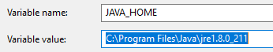
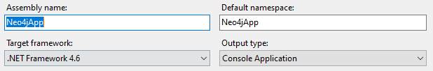

# Neo4j：在Windows环境中安装Neo4j

图形数据库（Graph Database）是NoSQL数据库家族中特殊的存在，用于存储丰富的关系数据，Neo4j 是目前最流行的图形数据库，支持完整的事务，在属性图中，图是由顶点（Vertex），边（Edge）和属性（Property）组成的，顶点和边都可以设置属性，顶点也称作节点，边也称作关系，每个节点和关系都可以由一个或多个属性。Neo4j创建的图是用顶点和边构建一个有向图，其查询语言cypher已经成为事实上的标准。

关系型数据库只对单个Join操作进行优化查询，而多重Join操作查询的性能显著下降。图形数据库适合查询关系数据，由于图形遍历的局部性，不管图形中由多少节点和关系，根据遍历规则，Neo4j只访问与遍历相关的节点，不受到总数据集大小的影响，从而保持期待的性能；相应地，遍历的节点越多，遍历速度越慢，但是变慢是线性的，这使得图形数据库不适合做海量数据统计分析。对与存在大量丰富关系的数据，遍历的性能不受图形数据量大小的影响，这使得Neo4j成为解决图形问题的理想数据库。

 

## 安装Neo4j

在安装neo4j之前，需要安装Java JRE，并配置Java开发环境，然后安装neo4j服务。

**1，安装Java JRE**

Neo4j是基于Java运行环境的图形数据库，因此，必须向系统中安装JAVA SE（Standard Editon）的JRE。从Oracle官方网站下载 [Java SE JRE](https://www.oracle.com/technetwork/java/javase/downloads/index.html)，当前的版本是JRE 8。


> JDK和JRE是有区别的，JDK（Java Development Kit）是包括Java运行环境（JRE）和Java开发工具；而JRE（Java Runtime Environment）是运行Java程序时必须安装的环境。如果只是运行Java程序，那么只需要安装JRE即可；如果希望开发Java程序，那么必须安装JDK。

配置Java的环境变量，Windows系统有系统环境变量和用户环境变量，都配置，配置环境变量分两步进行：

- 第一步，新建JAVA_HOME变量，变量值填写jdk的安装目录，默认的安装目录是：C:\Program Files\Java\jre1.8.0_211



- 第二步，编辑Path变量，在Path变量值的最后输入：%JAVA_HOME%\bin;%JAVA_HOME%\jre\bin;


检查配置是否成功，运行cmd，输入java -version，如果显示java的版本信息，说明Java的安装和配置成功。


**2，下载Neo4j安装文件**

从Neo4j官网下载最新版本[Neo4j 3.2](https://neo4j.com/download/other-releases/) 社区（Community）版本 “neo4j-community-3.2.0-windows.zip”，解压到主目录，“D:\Program Files\neo4j-community-3.2.”。

Neo4j应用程序有如下主要的目录结构：

- bin目录：用于存储Neo4j的可执行程序；
- conf目录：用于控制Neo4j启动的配置文件；
- data目录：用于存储核心数据库文件；
- plugins目录：用于存储Neo4j的插件。

**3，创建Neo4j的环境变量**

创建主目录环境变量NEO4J_HOME，并把主目录设置为变量值。


## Neo4j的配置

配置文档存储在conf目录下，Neo4j通过配置文件neo4j.conf控制服务器的工作。默认情况下，不需要进行任何配置，就可以启动和运行服务器。

**1、核心数据文件的位置**

例如，核心数据文件存储的位置，默认是在data/graph.db目录中，要改变默认的存储目录，可以更新配置选项：

```shell
# The name of the database to mount
# dbms.active_database=graph.db

# Paths of directories in the installation.
# dbms.directories.data=data
```

**2、安全验证，默认是启用的**

```shell
# Whether requests to Neo4j are authenticated.
# To disable authentication, uncomment this line
# dbms.security.auth_enabled=false
```

**3、配置JAVA 堆内存的大小**

```shell
# Java Heap Size: by default the Java heap size is dynamically calculated based on available system resources.
# Uncomment these lines to set specific initial and maximum heap size.
# dbms.memory.heap.initial_size=512m
# dbms.memory.heap.max_size=512m
```

## 网络连接配置

neo4j支持三种网络协议，默认情况下，不需要配置就可以在本地直接运行。

**1、Neo4j支持三种网络协议（Protocol）**

Neo4j支持三种网络协议（Protocol），分别是Bolt，HTTP和HTTPS，默认的连接器配置有三种，为了使用这三个端口，需要在Windows防火墙中创建Inbound Rules，允许通过端口7687，7474和7473访问本机。


**2、连接器的可选属性**


**listen_address**：设置Neo4j监听的链接，由两部分组成：IP地址和端口号（Port）组成，格式是：<ip-address>:<port-number>

**3、设置默认的监听地址**

设置默认的网络监听的IP地址，该默认地址用于设置三个网络协议（Bolt，HTTP和HTTPs）的监听地址，即设置网络协议的属性：**listen_address地址**。在默认情况下，Neo4j只允许本地主机（localhost）访问，要想通过网络远程访问Neo4j数据库，需要修改监听地址为 0.0.0.0，这样设置之后，就能允许远程主机的访问。

```shell
# With default configuration Neo4j only accepts local connections.
# To accept non-local connections, uncomment this line:
dbms.connectors.default_listen_address=0.0.0.0
```

**4、分别设置各个网络协议的监听地址和端口**

HTTP链接器默认的端口号是7474，Bolt链接器默认的端口号是7687，必须在Windows 防火墙中允许远程主机访问这些端口号。

```shell
# Bolt connector
dbms.connector.bolt.enabled=true
# dbms.connector.bolt.tls_level=OPTIONAL
# dbms.connector.bolt.listen_address=0.0.0.0:7687

# HTTP Connector. There must be exactly one HTTP connector.
dbms.connector.http.enabled=true
# dbms.connector.http.listen_address=0.0.0.0:7474

# HTTPS Connector. There can be zero or one HTTPS connectors.
# dbms.connector.https.enabled=true
# dbms.connector.https.listen_address=0.0.0.0:7473
```


## 启动Neo4j程序

点击组合键：Windows+R，输入cmd，启动DOS命令行窗口，切换到主目录，以管理员身份运行命令

**1、通过控制台启动Neo4j程序**

以管理员权限启用DOS命令行窗口，输入以下命令，通过控制台启用neo4j程序

```shell
neo4j.bat console
```

如果看到以下消息，说明neo4j已经开始运行：


**2、把Neo4j安装为服务（Windows Services）**

安装和卸载服务：

```shell
bin\neo4j install-service
bin\neo4j uninstall-service
```

启动服务，停止服务，重启服务和查询服务的状态：

```shell
bin\neo4j start
bin\neo4j stop
bin\neo4j restart
bin\neo4j status
```

## Neo4j集成的浏览器

Neo4j服务器具有一个集成的浏览器，在启动neo4j服务之后，可以使用neo4j集成的浏览器管理图数据库。

在一个运行neo4j服务器主机上访问 “http://localhost:7474/”，显示以下的界面：


默认的host是bolt://localhost:7687，默认的用户是neo4j，默认的密码是：neo4j，第一次成功connect到Neo4j服务器之后，需要重置密码。


访问Graph Database需要输入身份验证，Host是Bolt协议标识的主机。

## 在Neo4j浏览器中创建节点和关系

下面我通过一个示例，演示如何通过Cypher命令，创建两个节点和两个关系。

```cypher
CREATE (n:Person { name: 'Andres', title: 'Developer' }) return n;
CREATE (n:Person { name: 'Vic', title: 'Developer' }) return n;
                    
match(n:Person{name:"Vic"}),(m:Person{name:"Andres"}) create (n)-[r:Friend]->(m) return r;
match(n:Person{name:"Vic"}),(m:Person{name:"Andres"}) create (n)<-[r:Friend]-(m) return r;
```

**1、创建第一个节点**

在$ 命令行中，编写Cypher脚本代码，点击Play按钮，在图数据库中创建第一个节点：


在节点创建之后，在Graph模式下，能够看到创建的图形，继续执行Cypher脚本，创建其他节点：


**2、创建节点之间的关系**

创建节点之间的边和创建节点的操作相同，例如，创建Person节点之间（Vic-> Andres之间的Friend关系），由于Friend关系是双向的，可以继续创建Andres和Vic之间的Friend关系：


**3、查看节点之间的关系**

在创建完两个节点和关系之后，查看数据库中的图形：


***

# Neo4j：图形数据库

在深入学习图形数据库之前，首先理解属性图的基本概念。一个属性图是有向图，由顶点（Vertex），边（Edge），标签（Lable），关系类型（Relationship Type）和属性（Property）组成。

在属性图形中，节点和关系是最重要的实体，顶点也称作节点（Node），边也称作关系（Relationship）。

所有的节点是独立存在的，但是可以为节点设置标签，那么拥有相同标签的节点属于一个分组，也就是一个集合。

关系通过关系类型来分组，类型相同的关系属于同一个集合。节点可以有0个、1个或多个标签，但是关系必须设置关系类型，并且只能设置一个关系类型。

关系是有向的，关系的两端是起始节点和结束节点，通过有向的箭头来标识方向，节点之间的双向关系通过两个方向相反的关系来标识。

Neo4j图形数据库的查询语言是Cypher，用于操作和查询属性图，它是图形数据库语言中事实上的标准。

 

## 图形数据库的基本概念

使用Neo4j创建的图（Graph）基于属性图模型，在该模型中，每个实体都有ID（Identity）唯一标识，每个节点由标签（Lable）分组，每个关系都有一个唯一的关系类型。

属性图模型的基本概念：

- **实体（Entity）**：是指节点（Node）和关系（Relationship）；
  - 每个实体都有一个唯一的ID；
  - 通常情况下，节点除了ID属性之外，都会设置Name属性，用于以文本的方式来标识节点，Name属性的值通常是唯一的。
  - 每个实体都有零个，一个或多个属性，一个实体的属性键是唯一的；
  - 每个节点都有零个，一个或多个标签，属于一个或多个分组；
  - 每个关系仅有一个关系类型，关系用于连接两个节点；

- **路径（Path）**是指由起始节点和终止节点之间的实体（节点和关系）构成的有序组合；

- **标记（Token）**是非空的字符串，用于表示标签（Lable）、关系类型（Relationship Type）、或属性键（Property Key）；

- **标签（Label）**：用于对节点进行分组，多个节点可以有相同的标签，一个节点可以有多个标签，拥有相同标签的节点属于同一个分组；
- **关系类型（Relationship Type）**：用于表示关系的类型，多个关系可以有相同的关系类型，但是一个关系仅有一个关系类型；
- **属性键**：用于唯一标识一个属性，在一个关系或节点中，属性键是唯一的；
- **属性（Property）**是一个键值对（Key/Value Pair），每个节点或关系可以有一个或多个属性；属性值可以是标量类型（Boolean、Integer、Float、String）、或组合类型（List，Map）。

## 图形结构的示例

在下面的图中，存在三个节点和两个关系共5个实体，其中 Person和Movie是Lable，ACTED_ID和DIRECTED是关系类型，name，title，roles等是节点和关系的属性键。


实体包括节点和关系，节点有标签和属性，关系是有向的，链接两个节点，具有属性和关系类型。

**1、实体**

在示例图形中，包含3个节点和2个关系，这3个节点分别有2个属性：


这2个关系分别是：

- 两个关系类型：ACTED_IN和DIRECTED，
- 两个关系：ACTED_IN关系（连接name='Tom Hank'的节点和Movie节点），DIRECTED关系（连接name='Forrest Gump'的节点和Movie节点），
- 其中关系ACTED_IN包含一个属性 roles，属性值是一个List


**2、标签（Lable）**

在图形结构中，标签用于对节点进行分组，相当于节点的类型，拥有相同标签的节点属于同一个分组。一个节点可以拥有零个，一个或多个标签，因此，一个节点可以属于多个分组。对分组进行查询，能够缩小查询的节点范围，提高查询的性能。

在示例图形中，有两个标签Person和Movie，两个节点是Person，一个节点是Movie，标签有点像节点的类型，每个节点可以有多个标签。


**3、属性（Property）**

属性是一个键值对（Key/Value），用于为节点或关系提供扩展的信息。一般情况下，每个节点都有name属性，用于命名节点，通常情况下，name属性的值是唯一的。

在示例图形中，Person节点有两个属性name和born，Movie节点有两个属性：title和released，


关系ACTED_IN有一个属性：roles，该属性值是一个List，而关系DIRECTED没有属性：


## 遍历（Traversal）

遍历一个图形，是指沿着关系及其方向，访问图形的节点。关系是有向的，以连接的两个节点为单位，从起始节点沿着关系，一步一步导航（navigate）到结束节点的过程叫做遍历，遍历经过的节点和关系的有序组合称作路径（Path）。

在示例图形中，查找Tom Hanks参演的电影，遍历的过程是：从Tom Hanks节点开始，沿着ACTED_IN关系，寻找标签为Movie的目标节点。遍历的路径如图：


## 图形数据库的模式

Neo4j的模式（Schema）通常是指索引、约束和统计，通过创建模式，Neo4j能够获得查询性能的提升和建模的便利；Neo4j数据库的模式可选的，也可以是无模式的。

**1、索引**

图形数据库也能创建索引，用于提高图形数据库的查询性能。和关系型数据库一样，索引是图形数据的一个冗余副本，通过额外的存储空间和牺牲数据写操作的性能，来提高数据搜索的性能，避免创建不必要的索引，这样能够减少数据更新的性能损失。

Neo4j在图形节点的一个或多个属性上创建索引，在索引创建完成之后，当图形数据更新时，Neo4j负责索引的自动更新，索引的数据是实时同步的；在查询被索引的属性时，Neo4j自动应用索引，以获得查询性能的提升。

例如，使用Cypher创建索引：

```cypher
CREATE INDEX ON :Person(firstname)
CREATE INDEX ON :Person(firstname, surname)
```

**2、约束**

在图形数据库中，能够创建四种类型的约束：

- 节点属性值**唯一约束**（Unique node property）：如果节点具有指定的标签和指定的属性，那么这些节点的属性值是唯一的。
- 节点属性**存在约束**（Node property existence）：创建的节点必须存在标签和指定的属性。
- 关系属性**存在约束**（Relationship property existence）：创建的关系存在类型和指定的属性。
- **节点键**约束（Node Key）：在指定的标签中的节点中，指定的属性必须存在，并且属性值的组合是唯一的。

例如，使用Cypher创建约束：

```cypher
CREATE CONSTRAINT ON (book:Book) ASSERT book.isbn IS UNIQUE;
CREATE CONSTRAINT ON (book:Book) ASSERT exists(book.isbn);
CREATE CONSTRAINT ON ()-[like:LIKED]-() ASSERT exists(like.day);
CREATE CONSTRAINT ON (n:Person) ASSERT (n.firstname, n.surname) IS NODE KEY;
```

**3、统计信息**

当使用Cypher查询图形数据库时，Cypher脚本被编译成一个执行计划，执行该执行计划获得查询结果。为了生成一个性能优化的执行计划，Neo4j需要收集统计信息以对查询进行优化。当统计信息变化到一定的赋值时，Neo4j需要重新生成执行计划，以保证Cypher查询是性能优化的，Neo4j存储的统计信息包括：

- The number of nodes with a certain label.
- Selectivity per index. 
- The number of relationships by type.
- The number of relationships by type, ending or starting from a node with a specific label.

默认情况下，Neo4j自动更新统计信息，但是，统计信息的更新不是实时的，更新统计信息可能是一个非常耗时的操作，因此，Neo4j在后台运行，并且只有当变化的数据达到一定的阈值时，才会更新统计信息。

> Neo4j keeps the statistics up to date in two different ways. For label counts for example, the number is updated whenever you set or remove a label from a node. For indexes, Neo4j needs to scan the full index to produce the selectivity number. Since this is potentially a very time-consuming operation, these numbers are collected in the background when enough data on the index has been changed.

Neo4j把执行计划被缓存起来，在统计信息变化之前，执行计划不会被重新生成。通过配置选项，Neo4j能够控制执行计划的重新生成：

- **dbms.index_sampling.background_enabled**：是否在后台统计索引信息，由于Cypher查询的执行计划是根据统计信息生成的，及时更新索引的统计数据对生成性能优化的执行计划非常重要；
- **dbms.index_sampling.update_percentage**：在更新索引的统计信息之前，索引中有多大比例的数据被更新；
- **cypher.statistics_divergence_threshold**：当统计信息变化时，Neo4j不会立即更新Cypher查询的执行计划；只有当统计信息变化到一定的程度时，Neo4j才会重新生成执行计划。

 

# Neo4j：Cypher查询入门

Neo4j使用Cypher查询图形数据，Cypher是描述性的图形查询语言，语法简单，功能强大，由于Neo4j在图形数据库家族中处于绝对领先的地位，拥有众多的用户基数，使得Cypher成为图形查询语言的事实上的标准。本文作为入门级的教程，我不会试图分析Cypher语言的全部内容，本文的目标是循序渐进地使用Cypher语言执行简单的CRUD操作，为了便于演示，本文在Neo4j Browser中执行Cypher示例代码。以下图形包含三个节点和两个关系，本文会一步一步讲解如何利用Cypher语言创建以下图形。


## easy，热热身

和SQL很相似，Cypher语言的关键字不区分大小写，但是属性值，标签，关系类型和变量是区分大小写的。

**1、变量（Variable）**

变量用于对搜索模式的部分进行命名，并在同一个查询中引用，在小括号()中命名变量，**变量名是区分大小写的**，示例代码创建了两个变量：n和b，通过return子句返回变量b；

```cypher
MATCH (n)-->(b)
RETURN b
```

在Cypher查询中，变量用于引用搜索模式（Pattern），但是变量不是必需的，如果不需要引用，那么可以忽略变量。

**2、访问属性**

在Cypher查询中，通过逗号来访问属性，格式是：Variable.PropertyKey，通过id函数来访问实体的ID，格式是id(Variable)。

```
match (n)-->(b)
where id(n)=5 and b.age=18
return b;
```

## 创建节点

节点模式的构成：(Variable:Lable1:Lable2{Key1:Value1,Key2,Value2})，实际上，每个节点都有一个整数ID，在创建新的节点时，Neo4j自动为节点设置ID值，在整个数据库中，节点的ID值是递增的和唯一的。

下面的Cypher查询创建一个节点，标签是Person，具有两个属性name和born，通过RETURN子句，返回新建的节点：

```cypher
create (n:Person { name: 'Tom Hanks', born: 1956 }) return n;
```


继续创建其他节点：

```cypher
create (n:Person { name: 'Robert Zemeckis', born: 1951 }) return n;
create (n:Movie { title: 'Forrest Gump', released: 1951 }) return n;
```

## 查询节点

通过match子句查询数据库，match子句用于指定搜索的模式（Pattern），where子句为match模式增加谓词（Predicate），用于对Pattern进行约束；

**1、查询整个图形数据库**

```cypher
match(n) return n;
```

在图形数据库中，有三个节点，Person标签有连个节点，Movie有1个节点


点击节点，查看节点的属性，如图，Neo4j自动为节点设置ID值，本例中，Forrest Gump节点的ID值是5，


**2、查询born属性小于1955的节点**

```cypher
match(n) 
where n.born<1955 
return n;
```


**3、查询具有指定Lable的节点**

```cypher
match(n:Movie) 
return n;
```


**4、查询具有指定属性的节点**

```cypher
match(n{name:'Tom Hanks'}) 
return n;
```


## 创建关系

关系的构成：StartNode **-** [Variable:RelationshipType{Key1:Value1,Key2:Value2}] **->** EndNode，在创建关系时，必须指定关系类型。

**1、创建没有任何属性的关系**

```cypher
MATCH (a:Person),(b:Movie)
WHERE a.name = 'Robert Zemeckis' AND b.title = 'Forrest Gump'
CREATE (a)-[r:DIRECTED]->(b)
RETURN r;
```


**2、创建关系，并设置关系的属性**

```cypher
MATCH (a:Person),(b:Movie)
WHERE a.name = 'Tom Hanks' AND b.title = 'Forrest Gump'
CREATE (a)-[r:ACTED_IN { roles:['Forrest'] }]->(b)
RETURN r;
```


## 查询关系

在Cypher中，关系分为三种：符号“--”，表示有关系，忽略关系的类型和方向；符号“-->”和“<--”，表示有方向的关系；

**1、查询整个数据图形**


**2、查询跟指定节点有关系的节点**

示例脚本返回跟Movie标签有关系的所有节点

```cypher
match(n)--(m:Movie) 
return n;
```


**3、查询有向关系的节点**

```cypher
MATCH (:Person { name: 'Tom Hanks' })-->(movie)
RETURN movie;
```


**4、为关系命名，通过[r]为关系定义一个变量名，通过函数type获取关系的类型**

```cypher
MATCH (:Person { name: 'Tom Hanks' })-[r]->(movie)
RETURN r,type(r);
```


**4，查询特定的关系类型，通过[Variable:RelationshipType{Key:Value}]指定关系的类型和属性**

```cypher
MATCH (:Person { name: 'Tom Hanks' })-[r:ACTED_IN{roles:'Forrest'}]->(movie)
RETURN r,type(r);
```


## 更新图形

set子句，用于对更新节点的标签和实体的属性；remove子句用于移除实体的属性和节点的标签；

**1、创建一个完整的Path**

由于Path是由节点和关系构成的，当路径中的关系或节点不存在时，Neo4j会自动创建；

```cypher
CREATE p =(vic:Worker:Person{ name:'vic',title:"Developer" })-[:WORKS_AT]->(neo)<-[:WORKS_AT]-(michael:Worker:Person { name: 'Michael',title:"Manager" })
RETURN p
```

变量neo代表的节点没有任何属性，但是，其有一个ID值，通过ID值为该节点设置属性和标签。


**2、为节点增加属性**

通过节点的ID获取节点，Neo4j推荐通过where子句和ID函数来实现。

```cypher
match (n)
where id(n)=7
set n.name = 'neo'
return n;
```

**3、为节点增加标签**

```cypher
match (n)
where id(n)=7
set n:Company
return n;
```


**4、为关系增加属性**

```cypher
match (n)<-[r]-(m)
where id(n)=7 and id(m)=8
set r.team='Azure'
return n;
```


## 跟实体相关的函数

跟实体相关的函数，主要是获取节点或关系的ID，关系类型，标签和属性等函数。

**1、通过id函数，返回节点或关系的ID**

```cypher
MATCH (:Person { name: 'Oliver Stone' })-[r]->(movie)
RETURN id(r);
```

**2、通过type函数，查询关系的类型**

```cypher
MATCH (:Person { name: 'Oliver Stone' })-[r]->(movie)
RETURN type(r);
```

**3、通过lables函数，查询节点的标签**

```cypher
MATCH (:Person { name: 'Oliver Stone' })-[r]->(movie)
RETURN lables(movie);
```

**4、通过keys函数，查看节点或关系的属性键**

```cypher
MATCH (a)
WHERE a.name = 'Alice'
RETURN keys(a)
```

**5、通过properties()函数，查看节点或关系的属性**

```cypher
CREATE (p:Person { name: 'Stefan', city: 'Berlin' })
RETURN properties(p)
```

## 模式

模式，用于描述如何搜索数据，模式的格式是：使用()标识节点，使用[]标识关系，为了更有效地使用Cypher查询，必须深入理解模式。 

**1、节点模式**

节点具有标签和属性，Cypher为了引用节点，需要给节点命名：

- (n) ：该模式用于描述节点，节点的变量名是n；匿名节点是()；
- (n:lable)：该模式用于描述节点，节点具有特定的标签lable；也可以指定多个标签；
- (n{name:"Vic"})：该模式用于描述节点，节点具有name属性，并且name属性值是“Vic”；也可以指定多个属性；
- (n:lablle{name:"Vic"})：该模式用于描述节点，节点具有特定的标签和name属性，并且name属性值是“Vic”；

**2、关系模式**

在属性图中，节点之间存在关系，关系通过[]表示，节点之间的关系通过箭头()-[]->()表示，例如：

- [r]：该模式用于描述关系，关系的变量名是r；匿名关系是[]
- [r:type]：该模式用于描述关系，关系类型是type；每一个关系必须有且仅有一个类型；
- [r:type{name:"Friend"}]：该模式用于描述关系，关系的类型是type，关系具有属性name，并且name属性值是“Friend”；

**3、关联节点模式**

节点之间通过关系联系在一下，由于关系具有方向性，因此，-->表示存在有向的关系，--表示存在关联，不指定关系的方向，例如：

- (a)-[r]->(b) ：该模式用于描述节点a和b之间存在有向的关系r，
- (a)-->(b)：该模式用于描述a和b之间存在有向关系；

**4、变长路径的模式**

从一个节点，通过直接关系，连接到另外一个节点，这个过程叫遍历，经过的节点和关系的组合叫做路径（Path），路径是由节点和关系的有序组合。

- (a)-->(b)：是步长为1的路径，节点a和b之间有关系直接关联；
- (a)-->()-->(b)：是步长为2的路径，从节点a，经过两个关系和一个节点，到达节点b；

Cypher语言支持变长路径的模式，变长路径的表示方式是：[*N..M]，N和M表示路径长度的最小值和最大值。

- (a)-[*2]->(b)：表示路径长度为2，起始节点是a，终止节点是b；
- (a)-[*3..5]->(b)：表示路径长度的最小值是3，最大值是5，起始节点是a，终止节点是b；
- (a)-[*..5]->(b)：表示路径长度的最大值是5，起始节点是a，终止节点是b；
- (a)-[*3..]->(b)：表示路径长度的最小值是3，起始节点是a，终止节点是b；
- (a)-[*]->(b)：表示不限制路径长度，起始节点是a，终止节点是b；

**5、路径变量**

路径可以指定（assign）给一个变量，该变量是路径变量，用于引用查询路径。

```cypher
p = (a)-[*3..5]->(b)
```

**6、示例**

以下示例图有6个节点，每个节点都有一个属性name，节点之间存在关系，关系类型是KNOWS，如图：


查询模式是：查找跟Filipa有关系的人，路径长度为1或2，查询的结果是："Dilshad"和"Anders"

```cypher
MATCH (me)-[:KNOWS*1..2]-(remote_friend)
WHERE me.name = 'Filipa'
RETURN remote_friend.name
```


# Neo4j：使用.NET驱动访问Neo4j

本文使用的IDE是Visual Studio 2015 ，驱动程序是Neo4j官方的最新版本：[Neo4j.Driver ](https://www.nuget.org/packages/Neo4j.Driver/)，创建的类库工程（Project）要求安装 .NET Framework 4.5.2及以上版本，Neo4j官方提供的驱动程序使用起来非常简单，非常依赖于Cypher语言，这使得该驱动程序能够处理很多任务，但是，官方驱动程序仅支持标量类型的参数（Parameters），由于Neo4j的批量更新，例如，Cypher语言的foreach，unwind命令等用于批量操作，非常依赖于参数，这也成了官方驱动最大的缺点。

## 安装Neo4j Driver

官方的.NET 驱动程序使用的是Blot协议，目前更新到1.72版本，依赖.NET Framework 4.5.2及以上版本


**1、依赖.NET Framework 4.6版本**

创建Neo4jApp工程，配置工程的熟悉，设置目标架构（Target Framework）为.NET Framework 4.6



**2、安装驱动程序**

点击工具（Tools）菜单，通过NuGet Package Manager的控制台命令安装Neo4j的.NET驱动程序，选用1.3.0版本的原因是项目较赶，暂时没有时间去学习最新的版本。


在C#中引用驱动程序的命名空间：

```cypher
using Neo4j.Driver.V1;
```

## 驱动程序主要方法和对象

Neo4j驱动程序最核心的对象是：Driver对象，Session对象和Transaction对象。Driver对象用于连接数据库，Session对象用于创建事务，事务对象用于执行Cypher查询。事务只能在Read或Write模式下执行，由于Driver对象不会解析Cypher查询，它也不会检测到事务执行的是写，还是读操作，因此，当一个写模式事务执行的是读操作，Neo4j数据库会抛出错误，执行失败。

> Note that the driver does not parse Cypher and cannot determine whether a transaction is intended to carry out read or write operations. As a result of this, a `write` transaction tagged for `read` will be sent to a read server, but will fail on execution.

**1、连接数据库**

Neo4j通过Driver对象来连接图形数据库，在创建Driver对象时，需要服务器的连接地址（即bolt监听地址，地址格式是"**bolt://host:7687**"）和身份验证信息：user和password。

```java
private readonly IDriver Driver;

public Neo4jProviders(string uri, string user, string password)
{
    Driver = GraphDatabase.Driver(uri, AuthTokens.Basic(user, password));
}
```


验证信息通过auth token来提供，基础验证是AuthTokens.Basic(user,password)。

**2、创建会话（Session）**

在连接图形数据库之后，创建会话，会话是一系列事务（Transaction）的容器，用于创建事务执行的上下文，也就是说，事务必须在session的上下文中执行。Neo4j驱动程序提供三种格式的事务，最简单的是自动提交事务模式，自动提交事务模式使用 Session对象的run()方法来实现。

示例代码如下，在创建Session之后，以自动提交模式执行事务，在数据库中创建一个节点，该节点具有标签和属性。

```java
public void AddPerson(string name)
{
    using (var session = Driver.Session())
    {
        session.Run("CREATE (a:Person {name: $name})", new {name});
    }
}
```

在Neo4j的驱动程序中，发送到Neo4j数据库引擎的Cypher查询语句包含两部分：Query和Parameters，其中，Query是在数据库中执行的Cypher语句，Parameters是传递引擎的参数，在Query中以paraname格式来引用参数，在Parameters中，参数的名词和paraname格式来引用参数，在Parameters中，参数的名词和para_name中的para_name保持一致。

自动提交事务只包含一个Cypher语句，这意味着多个事务不能共享网络数据包，从而表现出比其他形式的事务更低的网络效率。自动提交事务旨在用于简单的用例，例如学习Cypher或编写一次性脚本时。 建议不要在生产环境中使用自动提交事务，或者在性能或弹性是主要问题时使用。

**3、创建事务函数**

事务函数是推荐的创建事务的方式，这种形式能够以最小的查询代码实现多个多个查询的输入，能够分离数据库查询和应用程序逻辑。

在Neo4j的事务中，读写操作都必须处于事务的上下文中。在Session对象中，当事务以自动提交模式执行（通过session.Run()函数调用）时，事务只包含一个Cypher语句，但是，这种模式有一个缺点，当Cypher语句执行失败时，事务不能重新执行（Replay）。Neo4j推荐使用事务函数模式，通过Session对象调用WriteTransaction()或 ReadTransaction()函数，并在事务函数包含事务单元，在事务执行失败时，能够在异常处理代码中重新执行Cypher语句。

```java
public void AddPerson(string name)
{
    using (var session = Driver.Session())
    {
        session.WriteTransaction(tx => tx.Run("CREATE (a:Person {name: $name})", new {name}));
    }
}
```


## 参数化查询

Cypher支持参数化查询，在Cypher语句中，使用参数替代表达式，实体的ID，参数不能用于关系类型和标签。在Neo4j数据库中，参数能够优化查询，使得Cypher的执行计划更容易被缓存，查询更快速。在Cypher中，通过$param引用参数。

**1、使用参数创建节点**

在执行事务之后，Session返回数据库执行的结果，通过result.Summary查看Cypher语句执行的结果。

```java
public bool CreateSingleNode(string lable,string name)
{
    string query = string.Format("CREATE (n:{0} ", lable)+ @"{name: $name})";
    using (var session = Driver.Session(AccessMode.Write))
    {
        var result = session.WriteTransaction(tx=>tx.Run(query, new { name }));
        IResultSummary rs = result.Summary;
        return rs.Counters.NodesCreated == 1;
    }
}
```


**2、使用参数创建关系**

通过new创建匿名类型，参数名是匿名类型的字段，字段名必须和Cypher语句中的参数($para)保持一致。

```java
public bool CreateRelationship(string RelationshipType,string SourceNodeName,string TargetNodeName)
{
    string query = string.Format(@"match (n),(m) where n.name=$source and m.name=$target create (n)-[:{0}]->(m);",RelationshipType);

    using (var session = Driver.Session())
    {
        var result = session.WriteTransaction(tx => tx.Run(query,new {source=SourceNodeName,target= TargetNodeName } ));
        IResultSummary rs = result.Summary;
        return rs.Counters.RelationshipsCreated == 1;
    }
}
```


## 查询数据库

向Neo4j数据库发送请求，返回的是数据结构是一个表格，Title是return子句的投影的字段。


如示例图所示，查询返回的结构是表格（行-列）式的，列值主要分为两种，要么是节点的属性列表，以JSON结构显示，要么是标量值。

驱动程序的Session返回查询的结果，Keys字段是Cypher语句中return子句投影的字段列表；Values字段返回是查询结果。

```java
public void MatchNodes(string lable, string name)
{
    string query = string.Format(@"MATCH (n:{0} ", lable)+ @"{name: $name})-[r]->(m) RETURN n,id(n);";
    using (var session = Driver.Session(AccessMode.Read))
    {
        var result = session.ReadTransaction(rx => rx.Run(query, new { name }));
        //return 子句投影的字段列表
        IReadOnlyList<string> keys = result.Keys;
        //查询返回的数据行
        var rows = result.ToList();
        foreach(var row in rows)
        {
            //每个数据行都包含多个数据列
            var columns = row.Values;
            foreach (var column in columns)
            {
                //每个数据列，可能是一个节点，也可能是一个标量值
                if(column.Key=="n")
                {
                    var node = column.Value as INode;

                    long NodeID = node.Id;
                    string NodeLables = string.Join(",", node.Labels.ToArray());
                    foreach (var property in node.Properties)
                    {
                        string Property=string.Format("Property[Key:{0},Value:{1}", property.Key, property.Value);
                    }
                }
                        
                if(column.Key=="id(n)")
                {
                    long NodeID=long.Parse(column.Value.ToString());
                }
            }
        }       
    }
}
```


## Cypher和.NET的类型映射

 驱动程序把编程语言翻译成Cypher的类型系统，为了处理数据，需要了解编程语言的类型和Cypher的类型系统的映射。图的特有类型是：Node、Relationship和Path，基础类型：Boolean、Integer、Float、String、List、Map，对.NET的类型映射是：


语句执行的结果是由记录流（record stream）构成，结果通常由接收应用程序在到达时处理。一个记录是一个由Key/Value对构成的有序字典（Map），记录可以通过位置索引（0-based整数）和键（key，字符串）来访问。


例如，通过位置索引来选择记录：

```java
public List<string> GetPeople()
{
    using (var session = Driver.Session())
    {
        //return session.ReadTransaction(tx => tx.Run("MATCH (a:Person) RETURN a.name AS name").ToList());
        return session.ReadTransaction(tx =>
        {
            var result = tx.Run("MATCH (a:Person) RETURN a.name ORDER BY a.name");
            return result.Select(record => record[0].As<string>()).ToList();
        });
    }
}
```


# Neo4j：批量更新数据

相比图形数据的查询，Neo4j更新图形数据的速度较慢，通常情况下，Neo4j更新数据的工作流程是：每次数据更新都会执行一次数据库连接，打开一个事务，在事务中更新数据。当数据量非常大时，这种做法非常耗时，大多数时间耗费在连接数据库和打开事务上，高效的做法是利用Neo4j提供的参数（Parameter）机制和UNWIND子句：在一次数据更新中，进行一次连接，打开一次事务，批量更新数据；参数用于提供列表格式的数据，UNWIND子句是把列表数据展开成一行一行的数据，每行数据都会执行结构相同的Cypher语句。再批量更新图形数据之前，用户必须构造结构固定的、参数化的Cypher语句。当Cypher语句的结构相同时，Neo4j数据库直接从缓存中复用已生成的执行计划，而不需要重新生成，这也能够提高查询性能。

除了官方的Neo4j Driver之外，本文分享使用Neo4jClient对图形数据批量更新，Neo4jClient提供的功能更强大，并支持参数和批量更新操作。

 

## 参数和UNWIND子句

**1、通过RESTful API\**传递\**参数**

Neo4j提供HTTP API处理Cypher语句和参数，在示例代码中，Neo4j的参数通过HTTP请求传递，statement定义的是查询语句，parameters定义的是参数。

在批量更新数据时，没有必要发送多个HTTP请求，通过参数，可以在一个HTTP请求（Request）中，开始一个事务，在事务中执行Cypher语句批量更新数据，最后提交该事务。

在发送HTTP请求传递参数批量更新数据时，设置HTTP Request的参数如下：

```
POST http://localhost:7474/db/data/transaction/commit
Accept: application/json; charset=UTF-8
Content-Type: application/json
```

注意：在HTTP API中，引用参数的格式是：{param}。

```json
{
  "statements" : [ {
    "statement" : "CREATE (n {props}) RETURN n",
    "parameters" : {
      "props" : {
        "name" : "My Node"
      }
    }
  } ]
}
```


**2、展开（UNWIND）子句**

**UNWIND子句**把列表式的数据展开成一行一行的数据，每一个行都包含更新所需要的全部信息，列表式的数据，可以通过参数来传递。

例如，定义参数events，该参数是一个JSON字符串，键events是参数名，其值是一个数组，包含两个数组元素。

```json
{
  "events" : [ {  "year" : 2014, "id" : 1}, {"year" : 2014, "id" : 2 } ]
}   
```

通过$events引用参数，UNWIND子句把events数组中的两个元素展开，每个元素执行一次Cypher语句，由于Cypher的语句结构固定，因此，执行计划被缓存起来，在执行数据更新任务时，参数被UNWIND子句展开，复用执行计划，提高数据更新的速度。

```
UNWIND $events AS event
MERGE (y:Year { year: event.year })
MERGE (y)<-[:IN]-(e:Event { id: event.id })
RETURN e.id AS x
ORDER BY x
```

## 在Neo4j Browser中使用参数

Neo4j Browser是Neo4j内置的浏览器，用于管理数据库，更新数据库和查询数据，再命令窗体中，通过“:”能够引用内置的命令，例如，通过 ":param"能够定义参数，并能够在下一个Cypher语句中引用参数。

**1、通过:param命令定义参数**

在Neo4j Browser中，输入第一个命令，通过:param 命令定义参数，


**2、通过$param引用参数**

紧接着，输入Cypher语句，通过$param引用参数


**3、查看创建的图形**

参数是一个列表格式的数据，在参数events中，两个event的year属性都是2014，因此，MERGE子句只会创建一个Year节点；由于两个event的id属性不同，因此MERGE子句会创建两个Event节点，并创建Year节点和Event节点之间的关系，图形如下图：


## 使用Neo4jClient批量更新数据

在工程（Projects）中输入命令安装Neo4jClient，

```
Package-Install Neo4jClient
```

**1、连接Neo4j数据库**

创建客户端，连接到数据库，创建的Uri的格式是：http://host_name:7474/db/data，并输入用户名和密码，然后创建图形客户端，并连接到Neo4j数据库。

```java
private GraphClient _client;
public Neo4jClientProvider()
{
    _client = new GraphClient(new Uri("http://localhost:7474/db/data"), "user_name", "password");
    _client.Connect();
}
```


**2、批量创建节点**

传递List<T>参数，通过Unwind函数引用List，并为参数命名为"ns"，在Cypher语句中引用参数"ns"

```java
public void CreateNodes(List<DataModel> nodes)
{
    _client.Cypher
        .Unwind(nodes, "ns")
        .Create("(n:NodeLable)")
        .Set("n.NodeID=ns.NodeID")
        .Set("n.Name=ns.Name")
        .ExecuteWithoutResults();
}
```


**3、批量创建关系**

在List<T>参数中，传递两个节点的映射，在Neo4j数据库中，关系必须具有类型，因此，在把参数传递到Neo4j数据中时，需要确定两个节点和关系类型，以创建关系

```java
public bool CreateRelationships(List<RelationshipModel> nodes)
{
    _client.Cypher
        .Unwind(nodes, "ns")
        .Match("(n:Lable1),(s:Lable2)")
        .Where("n.NodeID=ns.NodeID and s.NodeID=ns.RelatedID")
        .Merge("(n)-[r:RelationshipType]->(s)")
        .ExecuteWithoutResults();
}
```


# Neo4j：Cypher语法

Cypher是图形数据库查询语言事实上的标准。

## Cypher类型系统

Cypher支持的类型系统分为三类：属性类型，复合类型和结构类型。

**1、属性类型**

属性类型：Integer、Float、String和Boolean

Boolean类型：`true`, `false`, `TRUE`, `FALSE`

String类型：`'Hello'`, `"World"`

**2、复合类型**

复合类型：List和Map，List是有序的值的集合，Map是无序的Key/Value对的集合，通常用于存储节点和关系的属性。

List类型：`['a', 'b']`, `[1, 2, 3]`, `['a', 2, n.property, $param]`, `[ ]`

Map类型：n是节点，prop是节点的属性键，引用属性的值的格式：n.prop，

**3、结构类型**

结构类型：Node类型、关系类型、Path类型：

- 其中Node类型表示一个节点，由Id、Label和Map构成；
- 关系类型表示一个关系，由Id、Type、Map和 关系两端的两个节点的Id构成；
- Path类型表示路径，是节点和关系的序列。Path模式：(a)-->()<--(b)

**4、List类型**

由标量类型构成的List，例如，`['a', 'b']`, `[1, 2, 3]`

由函数range函数生成的List对象，例如，range(0,10)，从start到end的有序数字，Range函数包含两端。

列表（List comprehension）：[x IN range(0,10) WHERE x % 2 = 0 | x^3]

**5、Map类型**

列表的常量表示：{ key: 'Value', listKey: [{ inner: 'Map1' }, { inner: 'Map2' }]}

Map投影，用于从节点、关系和其他Map对象中投影特定元素或变量的值，Map投影的格式是：

```
map_variable {map_element, [, …n]}
```

参数注释：

- map_variable：用于引用Map对象

- map_element 有四种格式是：
    - **属性选择器：格式是 .Key，**用于引用Map对象中的属性
    - 嵌入属性（Literal entry），是一个Key/Value对，例如，key: <expression>，表示嵌入到Map变量中的元素
    - 变量选择器：把一个变量的名称作为Key，变量的值作为Key的值，构建一个Key/Value对，作为Map变量中的元素
    - 属性全选符号： **.\***


Map投影的示例，actor是Map变量，nrOfMovies是变量，从Map变量中获取name属性，并添加额外的属性nrOfMovies：

```cypher
MATCH (actor:Person)-[:ACTED_IN]->(movie:Movie)
WITH actor, count(movie) AS nrOfMovies
RETURN actor { .name, nrOfMovies }
```

## 命名规则和作用域

对变量进行命名，变量的命名要遵守一定的规则，并且变量具有特定的作用域。

**1、命名规则**

名称以英语字符开头，能够包含数字，但是数字不能作为首字符，除了下划线和$，不能包含其他符号，

注意，下划线应用于名称的中间或结尾，例如，my_variable，符号只能用于名称的开头，标示一个参数，例如符号只能用于名称的开头，标示一个参数，例如myParam。

名称是大小写敏感的，`:PERSON 和 ``:Person 是不同的。`

**2、作用域**

节点的Lable、关系类型和属性键是不同的作用域（Scope），在相同的Scope下，名称是不允许重复的；但是，在不同的Scope中，名称是允许重复的，并且表示不同的含义。

```cypher
CREATE (a:a {a: 'a'})-[r:a]→(b:a {a: 'a'})
```

##  CASE表达式

case表达式根据条件对查询的结果进行处理：

```cypher
CASE
WHEN predicate THEN result
  [WHEN ...]
  [ELSE default]
END
```

## 查询的参数

参与的语法是$Param，参数的名称是Param，在传递参数时，必须保证传递的参数和Query中的参数名称相同。

有Cypher的Query是，参数是$ids，

```cypher
MATCH (n)
WHERE id(n) IN $ids
RETURN n.name
```

传递给Query的参数是：

```json
{
  "ids" : [ 0, 1, 2 ]
}
```

## 操作符

操作符是对Cypher查询进行算术运算，逻辑运算等。

**1、通用操作符**

distinct 用于移除重复值， n.property 用于访问属性，[]是变量的列表

```cypher
CREATE (a:Person { name: 'Anne', eyeColor: 'blue' }),(b:Person { name: 'Bill', eyeColor: 'brown' }),(c:Person { name: 'Carol', eyeColor: 'blue' })
WITH [a, b, c] AS ps
UNWIND ps AS p
RETURN DISTINCT p.eyeColor
```

**2、数学操作符**

- 加减乘除：+,-,*,/
- 取模：%
- 取幂：^

**3、比较运算符**

- 等于：=
- 不等于：<>
- 小于、大于、小于等于、大于等于：<、>、<=、>=
- IS NULL和 IS NOT NULL

**4、逻辑运算符**

与（AND）,或（OR）,异或（XOR）,非（NOT）

```cypher
WITH [2, 4, 7, 9, 12] AS numberlist
UNWIND numberlist AS number
WITH number
WHERE number = 4 OR (number > 6 AND number < 10)
RETURN number
```

**5、字符串**

字符串拼接：+

匹配正则：=~

```cypher
WITH ['mouse', 'chair', 'door', 'house'] AS wordlist
UNWIND wordlist AS word
WITH word
WHERE word =~ '.*ous.*'
RETURN word
```

对于字符串，使用 STARTS WITH、ENDS WITH和CONTAINS 过滤字符串：

```cypher
WITH ['John', 'Mark', 'Jonathan', 'Bill'] AS somenames
UNWIND somenames AS names
WITH names AS candidate
WHERE candidate STARTS WITH 'Jo'
RETURN candidate
```

**6、列表操作**

- +，列表追加
- IN：检查成员
- []：索引，特殊地，[start .. end]，从start开始，递增1，但是不包括end

```cypher
RETURN [1,2,3,4,5]+[6,7] AS myList

WITH [2, 3, 4, 5] AS numberlist
UNWIND numberlist AS number
WITH number
WHERE number IN [2, 3, 8]
RETURN number

WITH ['Anne', 'John', 'Bill', 'Diane', 'Eve'] AS names
RETURN names[1..3] AS result
```


**7、访问属性**

使用 **.** 号访问属性

```cypher
MATCH (n) WHERE 21 < n.age AND n.age <= 30 RETURN n
```

 

# Neo4j：模式（Pattern）

模式和模式匹配是Cypher的核心，使用模式来描述所需数据的形状，该模式使用属性图的结构来描述，通常使用小括号()表示节点，-->表示关系，-[]->表示关系和关系的类型，箭头表示关系的方向。

## 节点模式

用小括号表示节点模式：`(a)，`a是节点变量的名称，用于引用图中的某一个节点a。

对于匿名的节点，可以使用()来表示，匿名的节点无法引用，通常用来表示路径中的占位节点。

**1、标签模式**

在节点变量的后面，使用 **:Lable** 来表示标签，标签是节点的分组，一个节点可以有一个标签，也可以有多个标签，

比如，`(a:User)，(a:User:Admin)`

**2、指定属性**

节点和关系都有属性，属性模式可以使用Map结构来表示，属性模式的格式是{ key:value,..}，使用大括号表示一个字典，包含一个或多个键/值对：

```cypher
(a {name: 'Andres', sport: 'Brazilian Ju-Jitsu'})
(a)-[{blocked: false}]->(b)
```

## 关系模式

关系模式是由节点和路径来描述的，最简单的关系模式两个节点和一个路径：

```cypher
(a)--(b)
```

该模式表示节点a和节点b之间存在关系，不指定关系的方向。

**1、关系的名称和方向**

关系也可以被命名，Cypher使用[r]来表示关系变量：

```cypher
(a)-[r]-(b)
```

关系是有方向的，使用箭头指定关系的方向：

```cypher
(a)-[r]->(b)
```

注意：图中关系的方向是在创建关系时指定的，在执行Cypher查询时，如果指定关系的方向，那么沿着关系的方向进行模式匹配。

**2、关系类型**

就像节点具有标签，可以对节点进行分组，关系也可以分组，Neo4j按照关系的类型对关系进行分组

```cypher
(a)-[r:REL_TYPE]->(b)
```

但是不像节点可以有多个标签，关系只能由一个关系类型，但是，关系的类型可以属于一个集合，这使用 | 来分割，表示关系输入集合中的任意一个类型：

```cypher
(a)-[r:TYPE1|TYPE2]->(b)
```

## 路径模式

路径是由节点和关系构成的序列，在路径中节点和关系是交替相连的，不可中断。路径的长度是指关系的数量，固定长度的路径是指：路径中关系的数量是固定不变的，可变长度的路径是：指路径中关系的数量是可变的。关系的数量有两种表示方式：固定长度和变长。

- 固定长度的关系，使用[* n]来表示
- 变长的关系，使用[*start..end]来表示，其中 .. 表示关系的长度是可变的，start表示关系数量的最小值，end表示关系数量的最大值。

**注：**start和end都可以省略，如果省略start，那么关系的长度 <= end；如果省略end，那么关系的长度>=start；如果同时省略start和end，那么关系的长度是任意的。

在变长关系模式中，也可以指定关系的类型：[Type * start .. end ]，变长关系只能用于MATCH查询语句中，不能用于CREATE和MERGE语句中。

**1，固定长度的关系**

在关系[]中，使用*2表示关系的长度为2，使用该模式来表示路径，路径两端的节点是a和b，路径中间的节点是匿名的，无法通过变量来引用。

```cypher
(a)-[*2]->(b)
```

该模式描述了3个节点和2个关系，路径两端的节点是a和b，中间节点是匿名节点，等价于以下的模式：

```cypher
(a)-->()-->(b)
```

**2，变长关系**

在关系[]中，使用[*start .. end]来表示变长关系

```cypher
(a)-[*3..5]->(b)
(a)-[*3..]->(b)
(a)-[*..5]->(b)
(a)-[*]->(b)
```

**3，路径变量**

Cypher允许对Path命名，把Path赋值给变量p，路径模式可以使用p来表示：

```
p = (a)-[*3..5]->(b)
```

**4，举个例子**

有如下的有向图数据，按照有向图来计算路径，最长的路径长度是2；按照无向图来计算路径，最长的路径长度是6。


分析以下Cypher查询，在路径模式中，路径是无向的，路径的长度是1或2，关系的类型是KNOWS，节点Filipa和节点remote_friend在同一条路径中。

```cypher
MATCH (me)-[:KNOWS*1..2]-(remote_friend)
WHERE me.name = 'Filipa'
RETURN remote_friend.name
```

 

 

# [Neo4j：投射和过滤](https://www.cnblogs.com/ljhdo/p/10917618.html)

投射子句用于定义如何返回数据集，并可以对返回的表达式设置别名，而过滤子句用于对查询的结果集按照条件进行过滤。

## Return子句

使用return子句返回节点，关系和关系。

**1、返回节点**

```cypher
MATCH (n { name: 'B' })
RETURN n
```

**2、返回关系**

```cypher
MATCH (n { name: 'A' })-[r:KNOWS]->(c)
RETURN r
```

**3、返回属性**

```cypher
MATCH (n { name: 'A' })
RETURN n.name
```

**4、返回所有元素**

```cypher
MATCH p =(a { name: 'A' })-[r]->(b)
RETURN *
```

**5、为属性设置别名**

```cypher
MATCH (a { name: 'A' })
RETURN a.age AS SomethingTotallyDifferent
```

**6、返回谓词（predicate），文本（literal）或模式（pattern）**

```cypher
MATCH (a { name: 'A' })
RETURN a.age > 30, "I'm a literal",(a)-->()
```

**7、使用distinct关键字返回不重复值**

```cypher
MATCH (a { name: 'A' })-->(b)
RETURN DISTINCT b
```

## with 子句

一个查询（Query）语句有很多查询子句，每一个查询子句按照特定的顺序执行，每一个子句是查询的一部分（Part）。with子句的作用是把上一个查询的结果进行处理，作为下一个查询的数据源，也就是说，在上一个查询的结果输出到客户端之前，把结果传递到后续的子句中去。

**1、对聚合的结果进行过滤**

聚合的结果必须通过with子句才能被过滤，例如，with子句保留otherPerson，并新增聚合查询count(*)，通过where子句过滤，返回查询结果：Anders。

```cypher
MATCH (david { name: 'David' })--(otherPerson)-->()
WITH otherPerson, count(*) AS foaf
WHERE foaf > 1
RETURN otherPerson.name
```


**2、限制返回的结果**

```cypher
MATCH (n { name: 'Anders' })--(m)
WITH m
ORDER BY m.name DESC LIMIT 1
MATCH (m)--(o)
RETURN o.name
```

## unwind子句

unwind子句用于把list格式的字符串拆开为行的序列

**1、拆开列表**

```cypher
UNWIND [1, 2, 3, NULL ] AS x
RETURN x, 'val' AS y
```

**2、拆开嵌套列表**

```cypher
WITH [[1, 2],[3, 4], 5] AS nested
UNWIND nested AS x
UNWIND x AS y
RETURN y
```

**3、Collect函数**

collect函数用于把值组装成列表

```cypher
WITH [1, 1, 2, 2] AS coll
UNWIND coll AS x
WITH DISTINCT x
RETURN collect(x) AS setOfVals
```

## Where子句

 使用Where子句对查询的结果进行过滤

**1、按照逻辑表达式来过滤**

```cypher
MATCH (n)
WHERE n.name = 'Peter' XOR (n.age < 30 AND n.name = 'Tobias') OR NOT (n.name = 'Tobias' OR n.name = 'Peter')
RETURN n.name, n.age
```

**2、按照节点的标签来过滤**

```cypher
MATCH (n)
WHERE n:Swedish
RETURN n.name, n.age
```

**3、按照节点的属性来过滤**

```cypher
MATCH (n)
WHERE n.age < 30
RETURN n.name, n.age
```

**4、按照关系的属性来过滤**

```cypher
MATCH (n)-[k:KNOWS]->(f)
WHERE k.since < 2000
RETURN f.name, f.age, f.email
```

**5、按照动态计算的属性来计算**

```cypher
WITH 'AGE' AS propname
MATCH (n)
WHERE n[toLower(propname)]< 30
RETURN n.name, n.age
```

**6、是否存在属性**

```cypher
MATCH (n)
WHERE exists(n.belt)
RETURN n.name, n.belt
```

**7、字符串匹配**

对字符串进行匹配：starts with、ends with，contains

```cypher
MATCH (n)
WHERE n.name STARTS WITH 'Pet'
RETURN n.name, n.age

MATCH (n)
WHERE n.name ENDS WITH 'ter'
RETURN n.name, n.age

MATCH (n)
WHERE n.name CONTAINS 'ete'
RETURN n.name, n.age
```


**8、正则匹配**

使用 =~ 'regexp' 匹配正则 ，如果正则表达式以(?i)开头，表示整个正则是大小写敏感的。

```cypher
MATCH (n)
WHERE n.name =~ 'Tob.*'
RETURN n.name, n.age

MATCH (n)
WHERE n.name =~ '(?i)ANDR.*'
RETURN n.name, n.age
```


**9、匹配路径模式**

```cypher
MATCH (tobias { name: 'Tobias' }),(others)
WHERE others.name IN ['Andres', 'Peter'] AND (tobias)<--(others)
RETURN others.name, others.age
```

使用not来排除路径模式：

```cypher
MATCH (persons),(peter { name: 'Peter' })
WHERE NOT (persons)-->(peter)
RETURN persons.name, persons.age
```

使用属性来匹配路径：

```cypher
MATCH (n)
WHERE (n)-[:KNOWS]-({ name: 'Tobias' })
RETURN n.name, n.age
```

使用关系类型来匹配路径：

```cypher
MATCH (n)-[r]->()
WHERE n.name='Andres' AND type(r)=~ 'K.*'
RETURN type(r), r.since
```

**10、列表**

使用IN操作符表示匹配列表中的元素

```cypher
MATCH (a)
WHERE a.name IN ['Peter', 'Tobias']
RETURN a.name, a.age
```

**11、缺失值**

如果属性值缺失，那么属性值默认值是null，null和任何值比较都是false；可以使用is not null 或 is null来判断是否为null

```cypher
MATCH (person)
WHERE person.name = 'Peter' AND person.belt IS NULL 
RETURN person.name, person.age, person.belt
```

## 排序

使用order by对查询的结果进行排序，默认是升序，使用关键字desc使Cypher按照降序进行排序。

**1、按照节点的属性进行升序排序**

```cypher
MATCH (n)
RETURN n.name, n.age
ORDER BY n.name
```

**2、按照节点的属性值进行降序排序**

```cypher
MATCH (n)
RETURN n.name, n.age
ORDER BY n.name DESC
```

## SKIP和LIMIT

 SKIP是跳过前N行，LIMIT是限制返回的数量

**1、跳过前3行**

```cypher
MATCH (n)
RETURN n.name
ORDER BY n.name
SKIP 3
```

**2、跳过前3行，返回第4和5行**

```cypher
MATCH (n)
RETURN n.name
ORDER BY n.name
SKIP 3
LIMIT 2
```

  

# Neo4j：查询数据（Match）

Cypher使用match子句查询数据，是Cypher最基本的查询子句。在查询数据时，使用Match子句指定搜索的模式，这是从Neo4j数据库查询数据的最主要的方法。match子句之后通常会跟着where子句，向模式中添加过滤性的谓词，用于对数据进行过滤。在查询数据时，查询语句分为多个部分，with子句用于对上一个查询部分的结果进行处理，以输出到下一个查询部分。

## 节点查询

对节点进行查询，是查询graph的基本操作，节点具有标签和属性，Match查询不仅能够按照标签对节点进行查询，还能按照属性对节点进行查询。 当没有指定节点的标签或属性时，默认是选择节点全部的标签和属性。

**1、查询所有节点**

仅仅指定一个节点的模式，没有标签（Lable）和属性，表示查询所有的节点：

```cypher
MATCH (n)
RETURN n
```

**2、查询带有特定标签的节点**

当模式中指定标签时，表示只查询带有特定标签的节点，有多个标签的节点，只要含有指定的标签，就成功匹配，绑定该节点。

```cypher
MATCH (movie:Movie)
RETURN movie.title
```

**3、查询相关的任意节点**

指定一个节点，节点的name属性是'Oliver Stone'，查询跟该节点相关的其他节点：

```cypher
MATCH (director { name: 'Oliver Stone' })--(movie)
RETURN movie.title
```

**4、查询相关的特定节点**

指定一个节点，查询跟节点相关的节点，并指定相关节点的标签

```cypher
MATCH (:Person { name: 'Oliver Stone' })--(movie:Movie)
RETURN movie.title
```

## 基本关系的查询

对关系进行查询，关系的模式是由两个节点来决定的。

**1、指定关系的方向来查询节点**

对于标签是Person，并且name属性是'Oliver Stone'的节点，该节点指向另外一个节点movie：

```cypher
MATCH (:Person { name: 'Oliver Stone' })-->(movie)
RETURN movie.title
```

**2、查询关系的类型**

在查询关系时，可以在match子句中指定关系变量，后续子句可以引用该变量，例如，使用type()函数查看关系的类型：

```cypher
MATCH (:Person { name: 'Oliver Stone' })-[r]->(movie)
RETURN type(r)
```

**3、匹配关系类型**

在匹配关系时，可以指定关系的类型

```cypher
MATCH (wallstreet:Movie { title: 'Wall Street' })<-[:ACTED_IN]-(actor)
RETURN actor.name
```

**4、匹配多种关系类型**

在匹配关系时，可以指定多种关系的类型，只需要匹配其中任意一个关系类型就匹配成功

```cypher
MATCH (wallstreet { title: 'Wall Street' })<-[:ACTED_IN|:DIRECTED]-(person)
RETURN person.name
```

**5、匹配关系类型，并指定关系变量**

```cypher
MATCH (wallstreet { title: 'Wall Street' })<-[r:ACTED_IN]-(actor)
RETURN r.role
```

**6、匹配多个关系**

```cypher
MATCH (charlie { name: 'Charlie Sheen' })-[:ACTED_IN]->(movie)<-[:DIRECTED]-(director)
RETURN movie.title, director.name
```

## 匹配路径

 路径是节点和关系交替组合构成的序列，图中必须满足路径指定的模式，才能返回路径中的元素。

**1、对变长路径的查询**

```cypher
MATCH (martin { name: 'Charlie Sheen' })-[:ACTED_IN*1..3]-(movie:Movie)
RETURN movie.title
```

**2、路径变量**

```cypher
MATCH p =(actor { name: 'Charlie Sheen' })-[:ACTED_IN*2]-(co_actor)
RETURN relationships(p),p
```

**3、根据路径的属性进行匹配**

```cypher
MATCH p =(charlie:Person)-[* { blocked:false }]-(martin:Person)
WHERE charlie.name = 'Charlie Sheen' AND martin.name = 'Martin Sheen'
RETURN p
```

 

# Neo4j：更新数据

更新图包括图的节点和关系的创建、更新和删除，也能更新图的节点和关系的属性、节点标签和关系类型。

## 创建节点

**1、创建空的节点**

```cypher
CREATE (n)
CREATE (a),(b)
```

**2、创建带标签的节点**

```cypher
CREATE (n:Person)
CREATE (n:Person:Swedish)
```

**3、创建带标签和属性的节点**

```cypher
CREATE (n:Person { name: 'Andres', title: 'Developer' })
```

## 创建关系

创建节点之前的关系

**1、在两个节点之间创建关系**

在两个节点之间创建关系，并设置关系类型

```cypher
MATCH (a:Person),(b:Person)
WHERE a.name = 'A' AND b.name = 'B'
CREATE (a)-[r:RELTYPE]->(b)
RETURN type(r)
```

**2、创建关系，并设置关系的属性**

```cypher
MATCH (a:Person),(b:Person)
WHERE a.name = 'A' AND b.name = 'B'
CREATE (a)-[r:RELTYPE { name: a.name + '<->' + b.name }]->(b)
RETURN type(r), r.name
```

**3、CREATE子句和模式**

在CREATE子句和模式中，对于模式中的任意部分，如果它不存在于图中，那么CREATE子句创建它；如果存在于图中，那么就会引用它。

```cypher
CREATE p =(andres { name:'Andres' })-[:WORKS_AT]->(neo)<-[:WORKS_AT]-(michael { name: 'Michael' })
RETURN p
```

## 删除节点和关系

使用delete子句删除节点、关系和路径，当删除节点时，该节点必须是孤立的节点，也就是说，必须首先删除跟节点相关的所有关系。

detach delete： 表示删除一个节点或多个节点，跟节点相关的所有关系也都被删除。

**1、删除节点**

```cypher
MATCH (n:Person { name: 'UNKNOWN' })
DELETE n
```

**2、删除所有节点和关系**

```cypher
MATCH (n)
DETACH DELETE n
```

**3、删除一个节点和它的所有关系**

```cypher
MATCH (n { name: 'Andres' })
DETACH DELETE n
```

**4、删除关系**

```cypher
MATCH (n { name: 'Andres' })-[r:KNOWS]->()
DELETE r
```

## 更新属性或标签

set子句用于更新节点的标签，向节点和关系中添加属性

**1、向节点或关系中添加属性**

```cypher
MATCH (n { name: 'Andres' })
SET n.surname = 'Taylor'
RETURN n.name, n.surname
```

**2、移除属性**

如果设置属性的值是NULL，相当于把该属性从节点或关系中移除

```cypher
MATCH (n { name: 'Andres' })
SET n.name = NULL RETURN n.name, n.age
```

**3、复制属性**

把一个节点的属性复制给另一个节点

```cypher
MATCH (at { name: 'Andres' }),(pn { name: 'Peter' })
SET at = pn
RETURN at.name, at.age, at.hungry, pn.name, pn.age
```

**4、从Map中添加属性**

```cypher
MATCH (p { name: 'Peter' })
SET p += { hungry: TRUE , position: 'Entrepreneur' }
```

**5、在一条set子句中添加多个属性**

```cypher
MATCH (n { name: 'Andres' })
SET n.position = 'Developer', n.surname = 'Taylor'
```

**6、向节点中添加标签**

```cypher
MATCH (n { name: 'Stefan' })
SET n:German
RETURN n.name, labels(n) AS labels
```

**7、向节点中添加多个标签**

```cypher
MATCH (n { name: 'Emil' })
SET n:Swedish:Bossman
RETURN n.name, labels(n) AS labels
```

## 移除属性

使用remove子句从节点中移除标签和属性，从关系中移除属性。

**1、移除属性**

默认情况下，Neo4j不允许存在值为null的属性；如果属性不存在，那么返回该属性的值是null。

```cypher
MATCH (a { name: 'Andres' })
REMOVE a.age
RETURN a.name, a.age
```

**2、移除节点的标签**

```cypher
MATCH (n { name: 'Peter' })
REMOVE n:German
RETURN n.name, labels(n)
```

**3、移除节点的多个标签**

当节点的标签为空时，labels(n)函数返回空的list

```cypher
MATCH (n { name: 'Peter' })
REMOVE n:German:Swedish
RETURN n.name, labels(n)
```

## foreach子句

列表和路径是Cypher中的关键概念，foreach子句用于更新数据，例如，对路径中的元素或通过聚合创建的列表执行更新命令。

**1、对路径中的元素执行更新命令**

对路径中匹配的所有节点，添加marked属性，并设置属性值为TRUE

```cypher
MATCH p =(begin)-[*]->(END )
WHERE begin.name = 'A' AND END .name = 'D'
FOREACH (n IN nodes(p)| SET n.marked = TRUE )
```

 

# Neo4j：Cypher函数

Cypher函数是对图进行查询和操作的重要工具。 

## 谓词函数

谓词函数返回true或者false，主要用于检查是否存在或满足特定的条件。

**1、Exists**

如果指定的模式存在于图中，或者特定的属性存在于节点、关系或Map中，那么函数返回True

例如，节点具有name属性，并check图中是否存在特定的模式：

```cypher
MATCH (n)
WHERE exists(n.name)
RETURN n.name AS name, exists((n)-[:MARRIED]->()) AS is_married
```

**2、检查集合元素**

all()表示所有的元素都满足条件，any()表示至少一个元素满足条件，none()函数表示没有一个元素满足条件，single()表示只有一个元素满足条件。

例如，ALL谓词表示，在路径中，所有节点都必须具有age属性，并且age属性值都必须大于30：

```cypher
MATCH p =(a)-[*1..3]->(b)
WHERE a.name = 'Alice' AND b.name = 'Daniel' AND ALL (x IN nodes(p) WHERE x.age > 30)
RETURN p
```

ANY谓词表示，节点的array属性中至少有一个元素值是one：

```cypher
MATCH (a)
WHERE a.name = 'Eskil' AND ANY (x IN a.array WHERE x = 'one')
RETURN a.name, a.array
```

NONE谓词表示，在路径中，没有节点的age属性等于25

```cypher
MATCH p =(n)-[*1..3]->(b)
WHERE n.name = 'Alice' AND NONE (x IN nodes(p) WHERE x.age = 25)
RETURN p
```

SINGLE谓词表示，在路径中，只有一个节点的eyes属性是blue：

```cypher
MATCH p =(n)-->(b)
WHERE n.name = 'Alice' AND SINGLE (var IN nodes(p) WHERE var.eyes = 'blue')
RETURN p
```

## 标量函数

变量函数返回标量值

**1、获得节点和关系的ID和属性**

- id()：返回节点或关系的ID
- properties()：返回节点或关系的属性（Map）

```cypher
CREATE (p:Person { name: 'Stefan', city: 'Berlin' })
RETURN id(p), properties(p)
```

**2、关系**

关系是由开始节点，结束节点和边构成的：

- endNode(relationship)：返回关系的结束节点
- startNode(relationship)：返回关系的开始节点
- type(relationship)：返回关系的类型

```cypher
MATCH (n)-[r]->()
WHERE n.name = 'Alice'
RETURN type(r), startNode(r), endNode(r)
```

**3、列表相关**

列表是元素的有序序列，Cypher使用List来表示列表类型，应用于列表的函数有：

- coalesce()：返回列表中第一个非NULL的元素
- head()：返回列表中的第一个元素
- last()：返回列表中的最有一个元素
- size()：返回列表中元素的数量

例如，节点的array属性，

```cypher
MATCH (a)
WHERE a.name = 'Eskil'
RETURN a.array, head(a.array), last(a.array), size(a.array)
```

**4、size()和length()函数**

求长度的函数：

- size(string)：表示字符串中字符的数量，可以把字符串当作是字符的列表。
- size(list)：返回列表中元素的数量。
- size(pattern_expression)：也是统计列表中元素的数量，但是不是直接传入列表，而是提供模式表达式（pattern_expression），用于在匹配查询（Match query）中提供一组新的结果，这些结果是路径列表，size()函数用于统计路径列表中元素（即路径）的数量。
- length(path)：返回路径的长度，即路径中关系的数量

例如，统计路径列表中的元素数量：

```cypher
MATCH (a)
WHERE a.name = 'Alice'
RETURN size((a)-->()-->()) AS fof
```

## 聚合函数

聚合函数用于对查询的结果进行统计：

- avg()：计算均值
- count(exp)：用于计算非null值（value）的数量，使用 count(distinct exp)进行无重复非null值的计数，使用count(*)：计算值或记录的总数量，包括null值
- max()、min()：求最大值和最小值，在计算极值时，null被排除在外，min(null)或max(null)返回null
- sum()：求和，在求和时，null被排除在外，sum(null)的结果是0
- collect()：把返回的多个值或记录组装成一个列表，collect(null)返回一个空的列表

在聚合计算中，可以引用分组键来对查询的结果进行分组聚合，例如，在return子句中，如果表达式不是聚合函数，那么该表达式是分组key，下面的表达式是按照type(r)分组，计算每个分组中记录的数量。

```cypher
RETURN type(r), count(*)
```

## 列表函数

列表是Cypher中的一个重要的复合类型，对列表进行操作的函数主要是生成列表、获取列表对象、抽取特定的列表元素、过滤列表元素和对列表元素进行迭代计算。

**1、抽取元素构成列表**

extract函数的作用是从列表中抽取值，

```cypher
extract(variable IN list | expression)
```

根据抽取的值组装成一个列表，返回一个列表：

```cypher
MATCH p =(a)-->(b)-->(c)
WHERE a.name = 'Alice' AND b.name = 'Bob' AND c.name = 'Daniel'
RETURN extract(n IN nodes(p)| n.age) AS extracted
```

**2、过滤列表元素**

filter函数用于对列表中的元素进行过滤，

```cypher
filter(variable IN list WHERE predicate)
```

把过滤后的元素组成一个了表，返回该列表：

```cypher
MATCH (a)
WHERE a.name = 'Eskil'
RETURN a.array, filter(x IN a.array WHERE size(x)= 3)
```

**3、获得列表**

- keys(node)：从节点的属性中抽取属性键
- labels(node)：节点标签的列表
- nodes(path)：从路径中获取所有节点的列表
- relationships(path)：从路径中获得所有的关系

```cypher
MATCH (a)
WHERE a.name = 'Alice'
RETURN labels(a),keys(a)

MATCH p =(a)-->(b)-->(c)
WHERE a.name = 'Alice' AND c.name = 'Eskil'
RETURN nodes(p), relationships(p)
```


**4、序列的生成和倒置**

range()函数，用于生成一个有序的序列，reverse()函数把原始列表的元素进行倒置

```cypher
range(start, end [, step])
reverse(list)
```

**5、迭代计算列表**

reduce()函数应用在列表上，对列表中的每个元素e进行迭代计算，在元素e上运行表达式（expression），把当前的结果存储在累加器中，进行迭代计算，并返回最终计算的标量结果：

```cypher
reduce(accumulator = initial, e IN list | expression)
```

例如，初始的age值是0，对路径p中的所有节点，计算各个节点的age值的和：

```cypher
MATCH p =(a)-->(b)-->(c)
WHERE a.name = 'Alice' AND b.name = 'Bob' AND c.name = 'Daniel'
RETURN reduce(totalAge = 0, n IN nodes(p)| totalAge + n.age) AS reduction
```

 

# Neo4j：使用Python驱动访问Neo4j

neo4j官方驱动支持Python语言，驱动程序主要包含Driver类型和Session类型。Driver对象包含Neo4j数据库的详细信息，包括主机url、安全验证等配置，还管理着连接池（Connection Pool）；Session对象是执行事务单元的逻辑上下文，事务是在Session的上下文中执行的。由于Session不是线程安全的，并能够从Driver对象管理的连接池中回收利用（Recycle）连接，因此，Session对象是轻量级的（lightweight），用完之后应立即销毁（disposable）。

Driver对象和Session对象的关系是：Driver对象负责管理连接池，从连接池中分配连接创建Session对象；Session对象在单个线程中接收Cypher和启动事务，在事务执行完成之后，立即销毁Session对象；Driver对象负责回收连接，等待为下一个Session对象分配连接。

## 安装Python版本的Neo4j驱动

如果不关注驱动的版本，可以安装最新版本的Python驱动

```shell
pip install neo4j-driver
```

也可以在pip命令中指定python驱动的版本：

```shell
pip install neo4j-driver==$PYTHON_DRIVER_VERSION
pip install neo4j-driver==1.4.0
```

## Driver对象

在安装neo4j驱动之后，在python代码中导入GraphDatabase模块，用于查询和更新图数据库：

```python
from neo4j.v1 import GraphDatabase
```

**1、创建Driver对象实例**

输入neo4j数据库的uri，用户的安全验证，实例化Driver对象，并创建连接池：

```python
from neo4j.v1 import GraphDatabase
uri = "bolt://localhost:7687"
_driver = GraphDatabase.driver(uri, auth=("neo4j", "password"))
```

使用close()函数关闭Driver对象分配的任何连接：

```python
_driver.close()
```

**2、使用Driver对象来创建Session对象**

Driver对象从连接池中分配连接，创建Session对象：

```python
_session = _driver.session()
```

## Session对象

Session的创建是一个轻量级的操作，由于Session不是线程安全的，因此，Session通常应该在单个线程中短暂存续，用完之后立即销毁。在Python中，推荐在with上下文中创建和销毁Session对象：

```python
def add_person(name):
    with _driver.session() as session:
        session.run("CREATE (a:Person {name: $name})", name=name)
```

Session对象是执行事务的逻辑上下文，Cypher支持两种方式来提交事务。

**1、以自动提交方式提交事务**

以自动提交事务的方式执行Cypher查询，在Session对象执行Cypher语句之后，事务立即提交，因此，一次事务只能执行一个Cyper查询，返回的结果是StatementResult对象：

```python
_session.run(statement, parameters=None)
```

**2、以事务函数方式来提交事务**

事务函数包含事务的工作单元，以事务函数方式提交事务是neo4j推荐的提交事务的方式，在事务函数方式中，一个事务可以执行多个Cypher查询。

首先，定义事务函数，传递相应的参数（Cypher语句和参数）：

```python
def create_person_node(tx, name):
    tx.run("CREATE (a:Person {name: $name}) RETURN id(a)", name=name)
```

然后，在Session对象中启动写事务（write_transaction)来调用事务函数，返回的结果是StatementResult对象：

```python
def add_person(driver, name):
    with _driver.session() as session:
        # Caller for transactional unit of work
        return session.write_transaction(create_person_node, name)
```

## StatementResult和Record

Session对象执行Cypher查询的结果是StatementResult类型，该类型实际上是由Record对象构成的集合，该类型的常用函数如下：

- keys()：是由Record集合的Key构成的元组
- records()：是由Record对象构成的集合
- single()：从result变量中获取下一个记录，返回值是下一个Record或None
- peek()：从结果中获取下一个Record对象，而该对象仍然保留在结果缓存中，以便后续进行处理。

Record类型是一个有序的Key/Value对的序列，这意味着，Record对象类似于由Key：Value构成的列表，Key字段的值可以通过字段名称或索引来访问：

- items() ：是由元组(key,value)构成的列表
- keys()：是由一个Record对象的key构成的元组
- values()：是由一个Record对象的value构成的元组
- index(key)：返回指定Key在Record对象内的索引

 

## 附，示例代码

```python
class BookmarksExample(object):

    def __init__(self, uri, user, password):
        self._driver = GraphDatabase.driver(uri, auth=(user, password))

    def close(self):
        self._driver.close()

    # Create a person node.
    @classmethod
    def create_person(cls, tx, name):
        tx.run("CREATE (:Person {name: $name})", name=name)

    # Create an employment relationship to a pre-existing company node.
    # This relies on the person first having been created.
    @classmethod
    def employ(cls, tx, person_name, company_name):
        tx.run("MATCH (person:Person {name: $person_name}) "
               "MATCH (company:Company {name: $company_name}) "
               "CREATE (person)-[:WORKS_FOR]->(company)",
               person_name=person_name, company_name=company_name)

    # Create a friendship between two people.
    @classmethod
    def create_friendship(cls, tx, name_a, name_b):
        tx.run("MATCH (a:Person {name: $name_a}) "
               "MATCH (b:Person {name: $name_b}) "
               "MERGE (a)-[:KNOWS]->(b)",
               name_a=name_a, name_b=name_b)

    # Match and display all friendships.
    @classmethod
    def print_friendships(cls, tx):
        result = tx.run("MATCH (a)-[:KNOWS]->(b) RETURN a.name, b.name")
        for record in result:
            print("{} knows {}".format(record["a.name"] ,record["b.name"]))

    def main(self):
        saved_bookmarks = []  # To collect the session bookmarks

        # Create the first person and employment relationship.
        with self._driver.session() as session_a:
            session_a.write_transaction(self.create_person, "Alice")
            session_a.write_transaction(self.employ, "Alice", "Wayne Enterprises")
            saved_bookmarks.append(session_a.last_bookmark())

        # Create the second person and employment relationship.
        with self._driver.session() as session_b:
            session_b.write_transaction(self.create_person, "Bob")
            session_b.write_transaction(self.employ, "Bob", "LexCorp")
            saved_bookmarks.append(session_b.last_bookmark())

        # Create a friendship between the two people created above.
        with self._driver.session(bookmarks=saved_bookmarks) as session_c:
            session_c.write_transaction(self.create_friendship, "Alice", "Bob")
            session_c.read_transaction(self.print_friendships)


class Neo4jProvider:

    def __init__(self, uri, user, password):
        self._driver = GraphDatabase.driver(uri, auth=(user, password))

    def close(self):
        self._driver.close()

    def add_greeting_node(self, message):
        with self._driver.session() as session:
            session.write_transaction(self._create_greeting, message)

    @staticmethod
    def _create_greeting(tx, message):
        tx.run("CREATE (a:Greeting) SET a.message = $message ", message=message)
```


参考文档：

[Neo4j Bolt Driver for Python](https://neo4j.com/docs/api/python-driver/1.4/)

[Sessions and transactions](https://neo4j.com/docs/driver-manual/current/sessions-transactions/)

