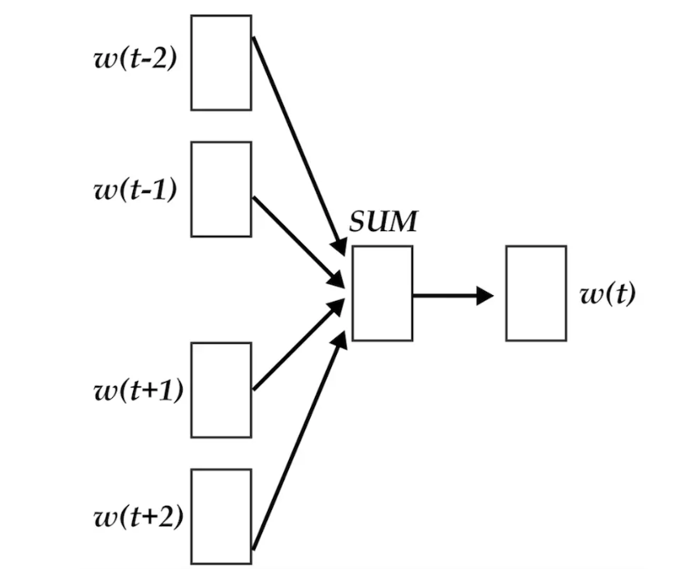
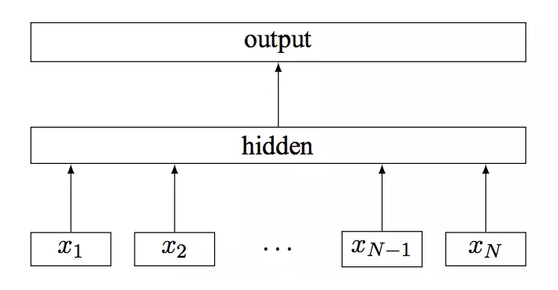
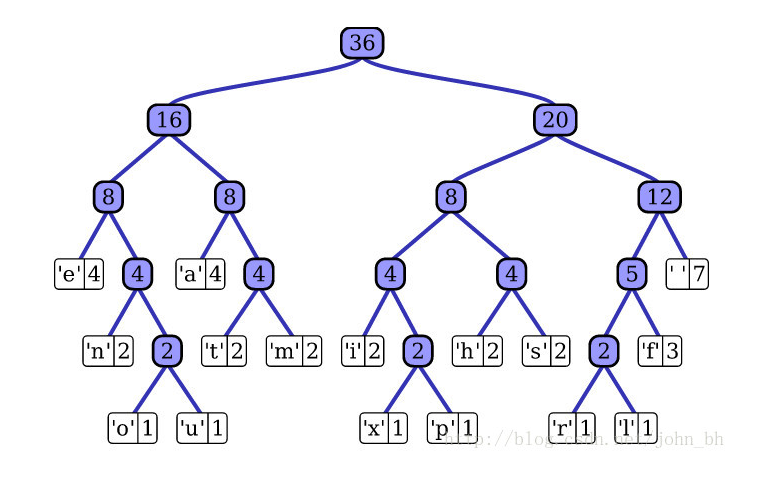

# 前言

自然语言处理(NLP)是机器学习，人工智能中的一个重要领域。文本表达是 NLP中的基础技术，文本分类则是 NLP 的重要应用。**fasttext是facebook开源的一个词向量与文本分类工具，在2016年开源，典型应用场景是“带监督的文本分类问题”**。提供简单而高效的文本分类和表征学习的方法，性能比肩深度学习而且速度更快。

fastText结合了自然语言处理和机器学习中最成功的理念。这些包括了使用**词袋以及n-gram袋**表征语句，还有使用子词(subword)信息，并通过隐藏表征在类别间共享信息。我们另外**采用了一个softmax层级**(利用了类别不均衡分布的优势)来加速运算过程。

# FastText原理

fastText方法包含三部分，**模型架构，层次SoftMax和N-gram子词特征**。

## 模型架构

fastText的架构和word2vec中的CBOW的架构类似，因为它们的作者都是Facebook的科学家Tomas Mikolov，而且确实fastText也算是word2vec所衍生出来的。

- **CBOW的架构**:输入的是$w(t)$的上下文2d2d个词，经过隐藏层后，输出的是$w(t)$。

**word2vec将上下文关系转化为多分类任务，进而训练逻辑回归模型，这里的类别数量是 |V||V| 词库大小**。通常的文本数据中，词库少则数万，多则百万，在训练中直接训练多分类逻辑回归并不现实。

word2vec中提供了两种针对大规模多分类问题的优化手段， **negative sampling 和 hierarchical softmax**。在优化中，negative sampling 只更新少量负面类，从而减轻了计算量。hierarchical softmax 将词库表示成前缀树，从树根到叶子的路径可以表示为一系列二分类器，一次多分类计算的复杂度从|V||V|降低到了树的高度。

- **fastText模型架构**:
    其中$x_1,x_2,...,x_{N−1},x_{N}$表示一个文本中的n-gram向量，每个特征是词向量的平均值。这和前文中提到的cbow相似，cbow用上下文去预测中心词，而此处用全部的n-gram去预测指定类别。

## 层次SoftMax

对于有大量类别的数据集，fastText使用了一个分层分类器（而非扁平式架构）。不同的类别被整合进树形结构中（想象下二叉树而非 list）。在某些文本分类任务中类别很多，计算线性分类器的复杂度高。为了改善运行时间，fastText 模型使用了层次 Softmax 技巧。层次 Softmax 技巧建立在哈弗曼编码的基础上，对标签进行编码，能够极大地缩小模型预测目标的数量。

fastText 也利用了类别（class）不均衡这个事实（一些类别出现次数比其他的更多），通过使用 Huffman 算法建立用于表征类别的树形结构。因此，频繁出现类别的树形结构的深度要比不频繁出现类别的树形结构的深度要小，这也使得进一步的计算效率更高。

## N-gram子词特征

fastText 可以用于文本分类和句子分类。不管是文本分类还是句子分类，我们常用的特征是词袋模型。但词袋模型不能考虑词之间的顺序，因此 fastText 还加入了 N-gram 特征。在 fasttext 中，每个词被看做是 n-gram字母串包。为了区分前后缀情况，"<"， ">"符号被加到了词的前后端。除了词的子串外，词本身也被包含进了 n-gram字母串包。以 where 为例，n=3n=3 的情况下，其子串分别为<wh, whe, her, ere, re>，以及其本身 。

#  fastText和word2vec的区别

**相似处**：

1. 图模型结构很像，都是采用embedding向量的形式，得到word的隐向量表达。
2. 都采用很多相似的优化方法，比如使用Hierarchical softmax优化训练和预测中的打分速度。

**不同处**：

1. 模型的输出层：word2vec的输出层，对应的是每一个term，计算某term的概率最大；而fasttext的输出层对应的是分类的label。不过不管输出层对应的是什么内容，起对应的vector都不会被保留和使用。
2. 模型的输入层：word2vec的输出层，是 context window 内的term；而fasttext 对应的整个sentence的内容，包括term，也包括 n-gram的内容。

**两者本质的不同，体现在 h-softmax的使用**：

1. Word2vec的目的是得到词向量，该词向量 最终是在输入层得到，输出层对应的 h-softmax
    也会生成一系列的向量，但最终都被抛弃，不会使用。
2. fastText则充分利用了h-softmax的分类功能，遍历分类树的所有叶节点，找到概率最大的label（一个或者N个）

# 总结

fastText是一个能用浅层网络取得和深度网络相媲美的精度，并且分类速度极快的算法。按照作者的说法“在标准的多核CPU上，能够训练10亿词级别语料库的词向量在10分钟之内，能够分类有着30万多类别的50多万句子在1分钟之内”。但是它也有自己的使用条件，它适合类别特别多的分类问题，如果类别比较少，容易过拟合。