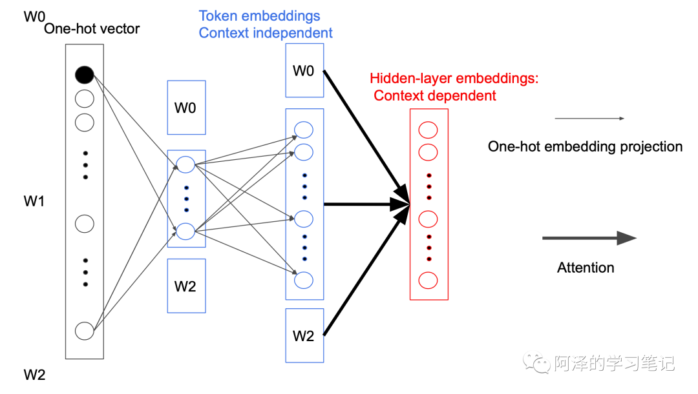

今天阅读的是 Google 同学 2019 年的论文《ALBERT: A LITE BERT FOR SELF-SUPERVISED LEARNING OF LANGUAGE REPRESENTATIONS》。

我们知道模型效果会随着模型深度的增加得到提升，然而模型深度的增加也会使得训练变得更困难，为了解决这个问题，Google 的同学提出了一个轻量级的 BERT：ALBERT，参数比 BERT-large 更少，且效果更好。

# Introduction

通常来说，模型深度与模型效果成正比，但是模型越深也会带来动则数亿甚至数十亿的参数量，这就对计算内存有了一定的要求。而在分布式训练中，通信开销与参数也成正比，所以其对训练速度也产生了显著的影响。

目前已有的解决方案要么是并行化，要么是内存管理，但是都没有解决通信开销，即降低模型本身的参数。在本文，作者设计一种轻量级的 Bert，并取名为 ALBERT（**A Lite BERT**），ALBERT 的参数比传统的 BERT 要少得多，有效的解决了模型通信开销的问题。

ALBERT 提出了两种降低参数的技术，包括:

- **factorized embedding parameterization** , 将 Embedding 参数矩阵分解**为两个小矩阵**。
- **cross-layer parameter sharing**, **跨层的参数共享**。

除了降低参数外，为了提高性能，作者还引入了一种**自监督的句子预测目标**（sentence-order prediction，SOP），主要用来关注句子间的连贯性，旨在解决 BERT 中 next sentence prediction（NSP）的无效性问题。

最终 ALBERT 比 BERT-large 参数更少，效果更好，并在多个 NLP 任务中刷榜。

# ALBERT

ALBERT 架构的主干和 BERT 类似，都使用了基于**GELU的非线性激活函数**的Transformer。但是其分别在两个地方减少了参数量。

以下图为例可以看到模型的参数主要集中在两块，一块是 Token embedding projection block，另一块是 Attention feed-forward block，前者占有 20% 的参数量，后者占有 80% 的参数量。

## **Factorized embedding parameterization**

我们先来看 Token embedding projection 模块。

在 BERT 中，Token Embedding 的参数矩阵大小为 $V*H$，其中 V 表示**词汇表长度**，H 为隐藏层大小。即：

而 ALBERT 为了减少参数数量，**在映射中间加入一个大小为 E 的隐藏层**，这样矩阵的参数大小就从$O(V \times H)$ 降低为 $O(V \times E+E \times H)$，而 $E<<h$ 。即：<="" p="">

之所以可以这样做是因为每次反向传播时都只会更新一个 Token 相关参数，其他参数都不会变。而且在第一次投影的过程中，词与词之间是不会进行交互的，只有在后面的 Attention 过程中才会做交互，我们称为 Sparsely updated。如果词不做交互的话，完全没有必要用一个很高维度的向量去表示，所以就引入一个小的隐藏层。

这个过程是不是很像矩阵分解, 这里便完成了参数降低的第一个模块。

## **Cross-layer parameter sharing**

ALBERT 的**参数共享主要是针对所有子模块内部进行的**，这样便可以把 Attention feed-forward 模块参数量从$O(12 \times L \times H \times H)$降低到$O(12 \times H \times H)$ ，其中 L 为层数，H 为隐藏层大小。

ALBERT 之所以这样做是因为，考虑到**每次层其实学习到内容非常相似**，所以尝试了将其进行参数共享。下图为不同层 Attention 学到的东西：

这样变完成了参数降低的第二个模块。

## **Sentence order prediction**

BERT 设计了 NSP 来保证句子的连续性，即用两个连续的句子对作为正例子，并随机挑选一个句子作为负例。但这样会出现一个问题：句子对不仅有连续性，还包括句子的主题，如果是随机选取的句子模型可能会通过句子的主题不同而判定为负例。

于是，作者对此进行改进，提出 Sentence order prediction（SOP），做法很简单，就是**将原来预测的句子调换下顺序**，sentence1 预测 sentence2 为正例，而 sentence2 预测 sentence1 为负例，这样就不用担心模型通过句子的主题而进行预测了。

# Experiments

我们简单看下实验。

下图为 BERT 和 ALBERT 的参数对比：

下图为模型的参数、精度、速度的对比，可以看到模型的参数变小了，但是速度下降很多。

下图对比了模型共享参数下的精度和参数大小：

下图为 SOP 相对 NSP 的提升：

下图为 ALBERT 的刷榜结果：

下图为去掉 dropout 前后的精度。这里解释一下：dropout 对于防止过拟合来说具有非常好的效果，但是对于 Masked Language Model 来说，其学习本身就比较困难，所以不用担心过拟合）：

另外加入 dropout 后会增加很多临时变量，删掉 dropout 后可以提升内存的利用率。此外 ALBERT 还加了十倍的数据量= =：

# Conclusion

**总结**：ALBERT 设计了 factorized embedding parameterization 和 cross-layer parameter sharing 两种方式分别对模型的两个部分降低参数，并利用 Sentence order prediction 来改进 BERT 的 NSP。通过设计一个更深的网络，移除 dropout，并在十倍的数据集上进行训练，ALBERT 在多项 NLP 任务重刷榜，但由于其结构更大，计算代价昂贵，所以其训练速度下降。

ALBERT 更像是一个工程优化加上一些小 Trick，所以看来意外简单。虽然其减少了一定内存，但计算量增加了呀，该用不起的还是用不起的。

# Reference

1. https://mp.weixin.qq.com/s/RDNZ_p5V_vRe48lSesAZLg
2. 《ALBERT: A LITE BERT FOR SELF-SUPERVISED LEARNING OF LANGUAGE REPRESENTATIONS》
3. 《ALBERT: A Lite BERT for Language Understanding》.ppt——蓝振忠