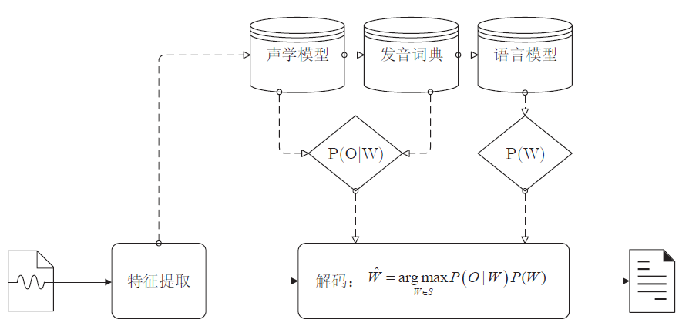
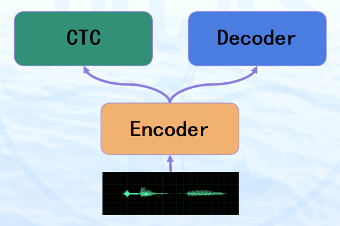
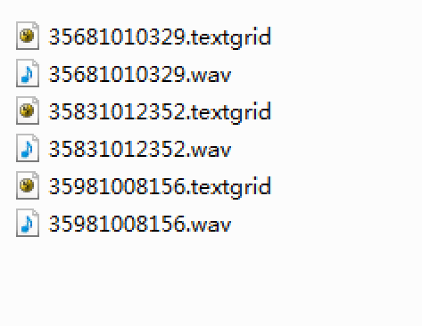
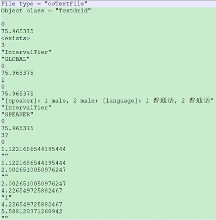
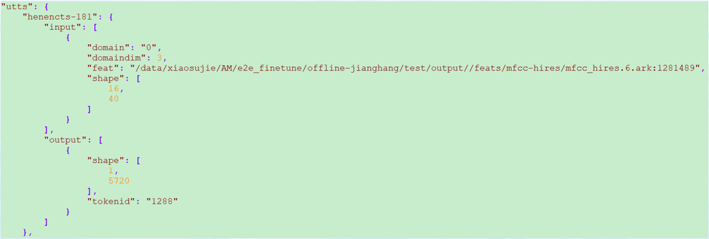
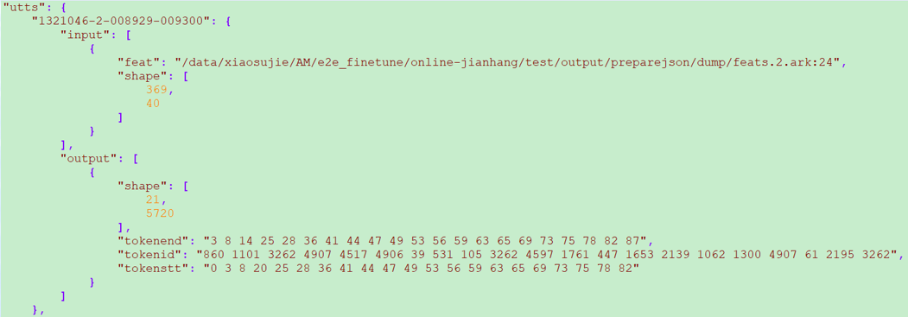

# 语音识别简介

## 介绍

语音识别是将语音转写成文字，给定语音特征序列，计算该特征对应文本序列，即P(W|O)

- 传统声学模型建模方法，采用DNN-HMM进行建模，包括声学模型、语言模型、发音字典

- 端到端建模，采用CTC-Transfomer联合建模，融合声学模型、语言模型、发音字典

## 对比

- hybrid系统对声学模型和语言模型单独进行建模，分模块进行优化，分标准化发音容忍度较低且扩展性较差，拟合能力一般
- e2e系统对声学模型和语言模型联合建模，显著提升了模型性能，非标准发音容忍度较好、扩展性较高，拟合能力较好

## 评价指标

N为答案字数，Mc为正确字数，S为替代错误字数，I为插入错误字数，D为删除错误字数

1. 字正确率：Mcr =(Mc／N)×100％
2. 替代错误率：Ser =(S／N)×100％
3. 插入错误率：Ier =(I／N)×100％
4. 删除错误率：Der =(D／N)×100％
5. 字错误率：WER = ((S+I+D)／N)×100％

# 模型训练数据处理

## 训练数据要求

1. 语音格式要求
    - 语音统一采用8k16bitpcm语音
    - 语音对应目录下有相应的textgrid标注

## 数据预处理

### 标注信息提取

解析textgrid文件，抽取文本内容

### 去除无用信息

去除无用标签，例如标点符号等

### 分词

### 语音、分段提特征

模型训练采用40维mfcc-hires特征

### 训练数据

rain目录下的文件

1. feats.scp
2. text
3. utt2spk
4. spk2utt

## JSON生成

### 离线

prepare-json目录，利用上一步生成的train目录的几个文件，整理成json训练格式

### 在线

1. 对训练数据进行ali，获取每个label对应的起始时间点
2. env_datajson目录，利用上一步生成的train目录的几个文件，整理成json训练格式

