
基于图计算的潮流计算

# 基础概念

## 节点类型

在潮流计算中，表征各节点运行状态的参数是该节点的电压向量及复功率，即$V$，$\theta$， $P$，$Q$，因此对于$N$个节点的电力系统共有$4N$个 运行参数，对于$N$个节点，可列写$N$个复数方程：
$$
\frac{P_i + jQ_i}{V_i} = \sum^{N}_{j=1}Y_{ij}V_j \quad (i = 1,2,...,N)  \tag{a}
$$
其中$Y_{ij}$为导纳矩阵元素。

- 当$i = j$ 时，$Y_{ii} = y_{i0} + \sum^{n}_{\substack{j=1  \\j \neq i}} y_{ij} $

- 当 $i \neq j $ 时，$Y_{ij}=-y_{ij}$
- $y_{i0}$为节点$i$的对地导纳，$y_{ij}$为节点$i$和节点$j$之间线路的导纳。

可将上述复数方程改写为$2N$个实数方程求解，因此对于共$4N$个变量，需要给定$2N$个变量的数据，求解其余$2N$个运行参数。因此在潮流计算中对每个节点往往给出两个运行参数作为已知条件，根据原始数据的方式，电力系统节点一般分为三种类型。

- **PQ节点：**该类节点给出该节点的有功功率$P$与无功功率$Q$，求解电压幅值$V$与相角$θ$，通常将变电站母线作为PQ节点，某些PQ出力给定的发电厂也作为PQ节点，大部分节点都属于PQ节点。
- **PV节点：**该类节点给出该节点的有功功率$P$与电压幅值$V$，求解无功功率$Q$与相角$θ$，该类节点一般有一定的无功调节能力以维持给定电压值，通常选择有一定无功功率储备的发电厂或有无功补偿设备的变电站。
- **平衡节点：**平衡节点一般只设定一个，给定该节点的电压幅值，相角设置为0，即将该节点电压方向作参考轴，也称为Vθ节点，代求量为有功无功PQ，即用于平衡系统的有功与无功。

## 节点导纳矩阵

### 各元件等值模型

#### 输电线路等值

输电线路一般采用$\pi$型等值电路。

对于长度小于100km的架空线路，线路的电导和电纳都可忽略。

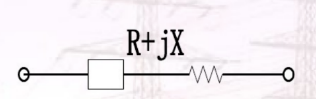

对于长度在100km~300km的架空线路，采用$\pi$型等值电路。

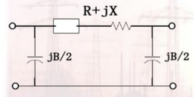

对于长度大于300km的架空线路，分段构建多个$\pi$型电路计算。

#### 变压器等值

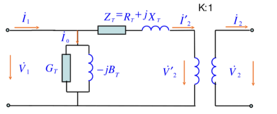

将变压器阻抗折算到低压侧，化成等值电路，阻抗的折算基于变压器的变比。

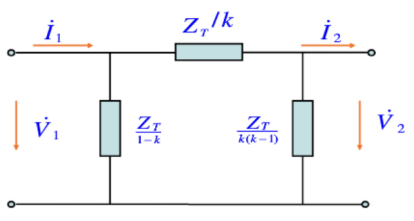

#### 发电机等值

发电机等值电路一般建模为一个理想电源与阻抗的串联电路。

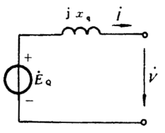

#### 电容器等值

电容器等值电路包含电阻与电感，可建模为串联或并联电路。

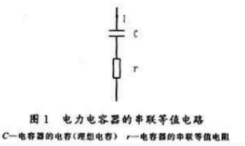

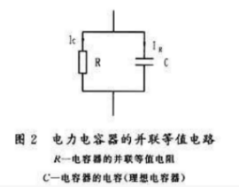

### 基于等值电路构建节点导纳矩阵

基于电力系统分析的矩阵形式，可列写基于节点导纳矩阵的网络方程：$I = YV$

节点导纳矩阵用于描述系统节点电压与注入电流的关系，源于节点电压法。例如对于下图所示具有两个电源（节点4，节点5）和一个负荷（节点1）的等值系统：

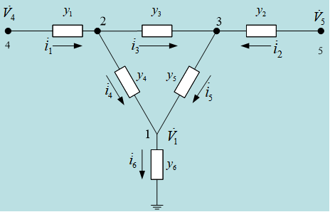

基于节点电压法可列写如下方程
$$
\begin{array}{c}
y_{4}\left(\dot{V}_{2}-\dot{V}_{1}\right)+y_{5}\left(\dot{V}_{3}-\dot{V}_{1}\right)-y_{6} \dot{V}_{1}&=0 \\
y_{1}\left(\dot{V}_{4}-\dot{V}_{2}\right)+y_{3}\left(\dot{V}_{3}-\dot{V}_{2}\right)+y_{4}\left(\dot{V}_{1}-\dot{V}_{2}\right)&=0 \\
y_{2}\left(\dot{V}_{5}-\dot{V}_{3}\right)+y_{3}\left(\dot{V}_{2}-\dot{V}_{3}\right)+y_{5}\left(\dot{V}_{1}-\dot{V}_{3}\right)&=0 \\
y_{1}\left(\dot{V}_{4}-\dot{V}_{2}\right)&=\dot{i}_{1} \\
y_{2}\left(\dot{V}_{5}-\dot{V}_{3}\right)&=\dot{i}_{2}
\end{array}
$$
按节点电压整理后可得
$$
\begin{array}{l}
\left(y_{4}+y_{5}+y_{6}\right) \dot{V}_{1}-y_{4} \dot{V}_{2}-y_{5} \dot{V}_{3}&=0 \\
-y_{4} \dot{V}_{1}+\left(y_{1}+y_{3}+y_{4}\right) \dot{V}_{2}-y_{3} \dot{V}_{3}-y_{1} \dot{V}_{4}&=0 \\
-y_{5} \dot{V}_{1}-y_{3} \dot{V}_{2}+\left(y_{2}+y_{3}+y_{5}\right) \dot{V}_{3}-y_{2} \dot{V}_{5}&=0 \\
-y_{1} \dot{V}_{2}+y_{1} \dot{V}_{4}&=\dot{I}_{1} \\
-y_{2} \dot{V}_{3}+y_{2} \dot{V}_{5}&=\dot{I}_{2}
\end{array}
$$
将左端整理为各节点流出电流，右端为向各节点注入的电流，表示为规范形式
$$
\begin{array}{l}
Y_{11} \dot{V}_{1}+Y_{12} \dot{V}_{2}+Y_{13} \dot{V}_{3}+Y_{14} \dot{V}_{4}+Y_{15} \dot{V}_{5}=\dot{I}_{1} \\
Y_{21} \dot{V}_{1}+Y_{22} \dot{V}_{2}+Y_{23} \dot{V}_{3}+Y_{24} \dot{V}_{4}+Y_{25} \dot{V}_{5}=\dot{I}_{2} \\
Y_{31} \dot{V}_{1}+Y_{32} \dot{V}_{2}+Y_{33} \dot{V}_{3}+Y_{34} \dot{V}_{4}+Y_{35} \dot{V}_{5}=\dot{I}_{3} \\
Y_{41} \dot{V}_{1}+Y_{42} \dot{V}_{2}+Y_{43} \dot{V}_{3}+Y_{44} \dot{V}_{4}+Y_{45} \dot{V}_{5}=\dot{I}_{4} \\
Y_{51} \dot{V}_{1}+Y_{52} \dot{V}_{2}+Y_{53} \dot{V}_{3}+Y_{54} \dot{V}_{4}+Y_{55} \dot{V}_{5}=\dot{I}_{5}
\end{array}
$$
比较可以看出，这些对角线元素称为节点的**自导纳**，即为与该节点相邻支路的导纳之和
$$
\begin{array}{l}
Y_{11}=y_{4}+y_{5}+y_{6} \\
Y_{22}=y_{1}+y_{3}+y_{4} \\
Y_{33}=y_{2}+y_{3}+y_{5} \\
Y_{44}=y_{1} \\
Y_{55}=y_{2}
\end{array}
$$
非对角元素称为节点间的**互导纳**，两节点间存在支路则为支路导纳的相反数，不存在支路则为0
$$
\begin{array}{l}
Y_{12}=Y_{21}=-y_{4} \\
Y_{13}=Y_{31}=-y_{5} \\
Y_{23}=Y_{32}=-y_{3} \\
Y_{24}=Y_{42}=-y_{1} \\
Y_{35}=Y_{53}=-y_{2}
\end{array}
$$
上述为理想化后的等值电路，对于实际运行系统而言，需要先对输电线路、变压器、发电机等分别构建等值模型，形成整个系统的等值电路后计算系统的**节点导纳矩阵$Y$**，记$Y_{ij}$为导纳矩阵元素：

> - $i = j$ 时，$Y_{i i}=y_{i 0}+\sum_{\substack{j=1 \\ j \neq i}}^{n} y_{i j}$
> - $i \ne j$ 时，$Y_{ij} = -y_{ij}$
>
> $y_{i0}$为节点$i$对地的导纳，$y_{ij}$为节点 $i$ 和 $j$ 之间线路的导纳。

# 图计算理论基础

## 图节点并行计算

图节点并行计算是指图中每个节点的计算相互独立、互不依赖，可以同时并行进行。由于电力网络的稀疏性，许多运算都只依赖少数电气节点（或线路）的信息，以图数据结构表达的电力系统可以充分利用图节点并行理念，将运算任务并行地分配到节点（或边）上，加快求解速度。

应用场景包括：

1. 依赖连接关系的大型矩阵生成类：导纳矩阵生成、状态估计增益生成；
2. 单节点（边）简单计算类：右端注入矢量的计算、支路功率计算、电压和功率越界检测；
3. 其他计算：迭代收敛性判断、不良数据检测；

节点或边上的这些计算与其他节点或边独立。这类并行计算统称为图的节点并行计算。

以最简单的导纳矩阵形成为例，其计算实现机制如图所示。在形成导纳矩阵时，导纳矩阵每行的自导纳和互导纳只跟该行对应的节点和与该节点邻接的节点有关，而与其他节点无关。尽管导纳矩阵的形成具有明显的并行性，现有的 EMS 在形成导纳矩阵时通常仍是通过遍历系统节点串行形成导纳矩阵。图数据结构表达的电力系统形成导纳矩阵时，矩阵每一行的形成与其他行相互独立，通过并发访问所有节点，导纳矩阵形成按节点并行完成。

## 图分层并行计算

图分层并行计算是指将图中的节点按计算相关性分层，排序较高的层的节点的计算依赖于排序较低的层的节点的计算，但同一层节点的计算相互独立，可以并行进行。图分层并行计算的应用主要是通过矩阵因子分解，前代和回代计算实现的方程组求解。

下图为一矩阵LU分解对应的消去树和分层。每层各个节点之间彼此独立，可以并行。

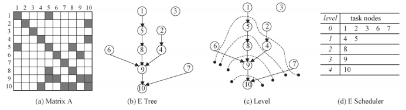

下图显示，如果分配两个线程对该矩阵进行计算，则在第0和1层分为两个线程并行，后续计算需要等待。

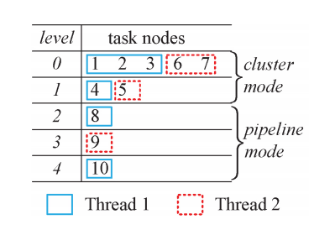

## 图分层并行理论总结

2013年，[1]针对并行电路仿真提出了一种稀疏矩阵求解方法，简称NICSLU求解器，基于LU分解中的消去树，可以将矩阵因子分解通过图分层并行的形式实现，提速效果比起主流稀疏矩阵求解器KLU高2.08到8.57倍。测试使用了35个矩阵，行稀疏度（非零元素个数/行数）在3~11之间，矩阵规模在2395到550万之间。

作者提出，并不是所有的矩阵分解适合使用节点并行。当相对注入元较少、以及计算的总FLOPS与非零元素个数比值较小时，用节点分层的同步时间、负载不均衡等问题会降低总体加速效果。例如最大规模矩阵circuit5M的相对注入元较少计算时间本身较低（使用KLU求解器4.346秒），使用了图分层并行后，随着可用核心数增加加速比反而呈现出了下降趋势，甚至比串行结果更差。经测试，使用NICSLU求解器1核心，计算时间为3.299秒，12核心为6.888秒。

远景实现的图分层并行直接调用了NICSLU求解器（C++）。研究短路电流和暂态稳定仿真如何用图计算实现，较容易的突破将主要集中图节点并行层面。

[1] Chen X , Wang Y , Yang H . NICSLU: An Adaptive Sparse Matrix Solver for Parallel Circuit Simulation[J]. IEEE Transactions on Computer-Aided Design of Integrated Circuits and Systems, 2013, 32(2):161-274.

## 与传统方法的对比

在某省域2433节点系统上对比了南瑞D5000与图计算状态估计的计算时间，具体分解如下图（单位：毫秒，线程数为8）。

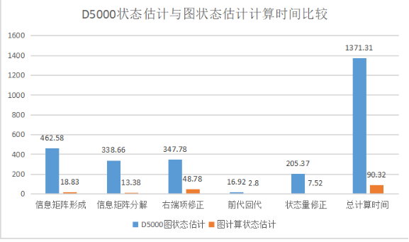

目前已知广东电网110kV到10kV出线系统状态估计时间约为分钟级（尚不清楚线程数等具体信息，需与自动化确认具体时间），待广东数据解析更新后与图计算进行对比。

