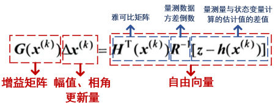
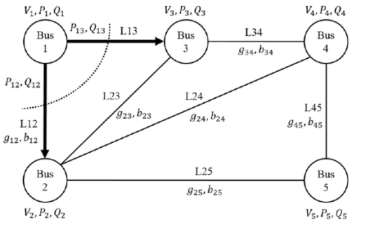
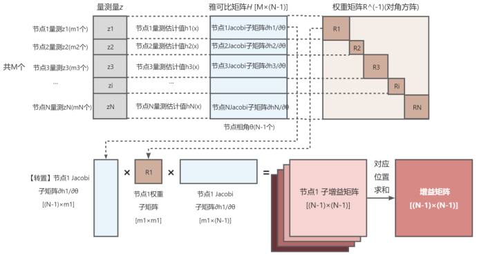
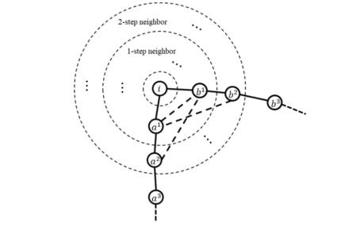
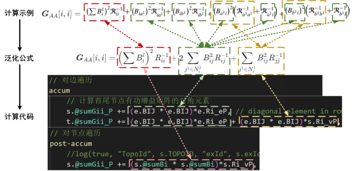
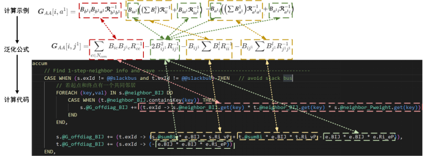
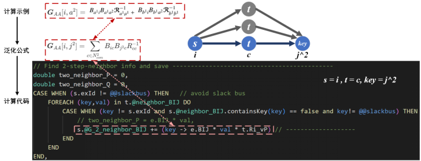
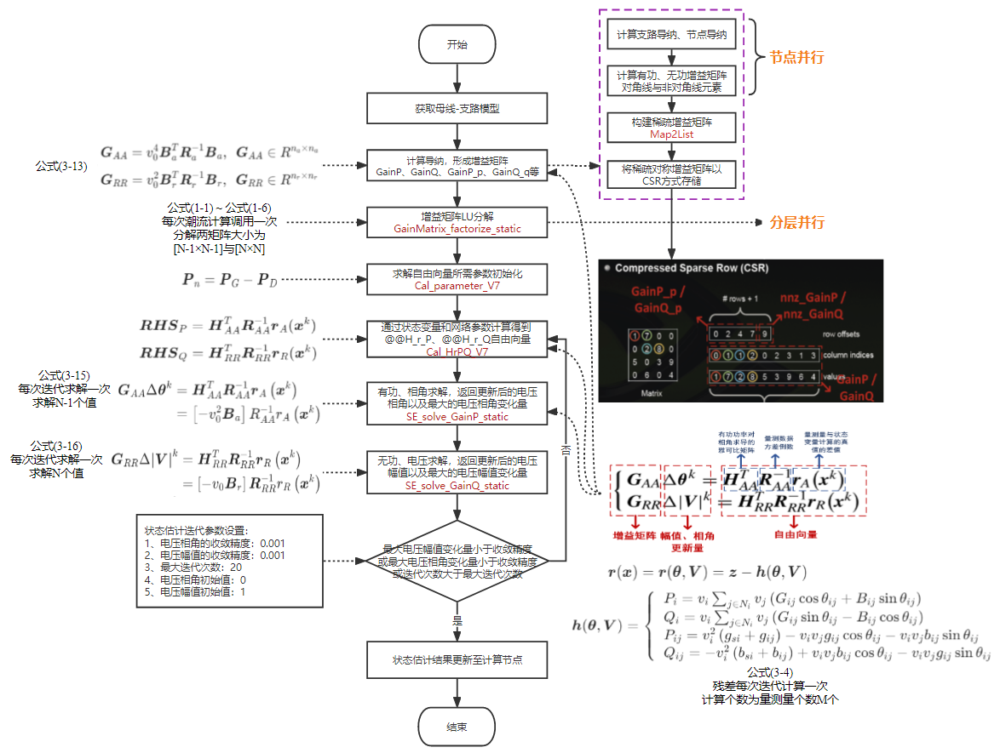
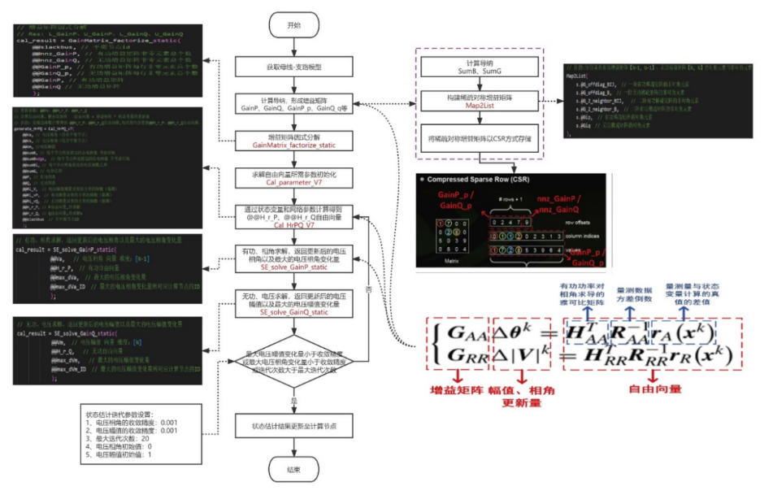
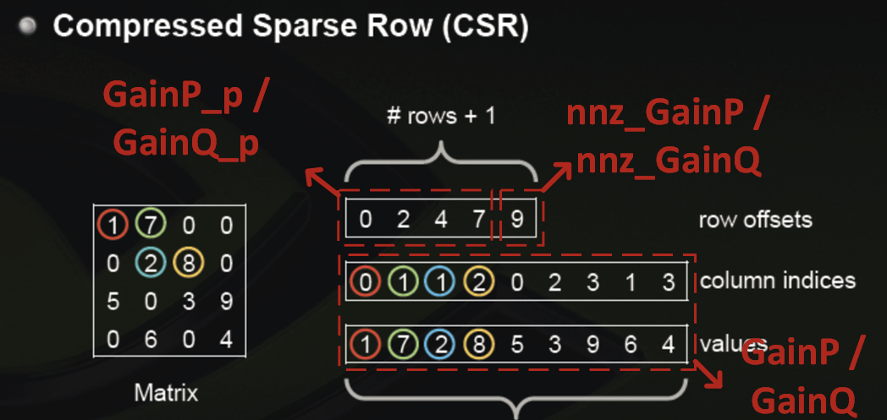

<center><font size=6 color=white>基于图计算的状态估计</font></center>

# 状态估计

## 状态估计理论

### 概述

#### 定义

状态估计（SE）将量测端得到的不全面、不可靠、不精确的生数据，经处理变成全面、可靠和精确的熟数据，以支撑经济调度、最优潮流、自动电压控制等EMS高级应用，起数据滤波器的作用。

> **三要素：**
>
> 1. **量测数据**：SCADA、WAMS、AMI采集的数据等（一般包括支路功率、节点注入功率、节点电压幅值）
> 2. **网络模型**：网络拓扑关系及电网参数
> 3. **准则函数**：优化目标

**状态变量：**

一组互相独立、数量最少的变量，这组变量确定后可确定整个网络的电气量。

常用为所有节点的电压复相量（极坐标下：电压幅值和相角；直角坐标下：电压实部和虚部。参考节点相角除外）。

此时状态估计与潮流问题的状态变量相同。例如对一个有N个节点的电网，状态变量有2N-1个【N个电压 + (N-1)个相角】。

确定系统的状态变量（电压、相角）后，系统的全网运行信息，包括量测信息，可基于以下**节点注入功率**和**支路潮流公式**计算确定：
$$
\begin{aligned}
P_i &=v_i \sum_{j \in N_i} v_j\left(G_{i j} \cos \theta_{i j}+B_{i j} \sin \theta_{i j}\right) \\
Q_i &=v_i \sum_{j \in N_i} v_j\left(G_{i j} \sin \theta_{i j}-B_{i j} \cos \theta_{i j}\right) \\
\end{aligned}  \notag
$$

$$
\begin{aligned}
P_{i j} &=v_i^2\left(g_{s i}+g_{i j}\right)-v_i v_j g_{i j} \cos \theta_{i j}-v_i v_j b_{i j} \sin \theta_{i j} \\
Q_{i j} &=-v_i^2\left(b_{s i}+b_{i j}\right)+v_i v_j b_{i j} \cos \theta_{i j}-v_i v_j g_{i j} \sin \theta_{i j}
\end{aligned}  \notag
$$

#### 功能

> 1. 为量测设备提供建议：对可观部分进行估计，对不可观部分配置建议，补充哪些量可以把不可观的网络变为可观。
> 2. 剔除不良数据：需要辨识、剔除与真实值偏差过大的不良数据。
> 3. 进行拓扑错误辨识：拓扑状态通过遥信获取，存在信息采集不全面，通信干扰错误的可能，导致拓扑连接与实际不符。
> 4. 进行参数估计：SE需要线路和变压器的稳态正序参数，而计算使用的参数可能与实际不符。
> 5. 获得全网状态感知：通过SE得到电网状态变量的估计值，在此基础上可得到所有支路的功率与所有结点的注入功率，实现对全网的状态感知。
>

### 状态估计数学模型

#### 牛顿迭代方程

**SE目标**：基于量测数据得到状态变量的最优估计值。

> $$
> z = h(x) + r
> $$
>
> $z$为**量测量向量**〔简称量测向量〕，$z=[z_1,z_2,...,z_m]^T$，其中，$z_i$为系统的第$i$个量测量，$i=1,2,....,m$；
>
> $x$为**状态变量向量**〔简称状态向量〕，$x=[x_1,x_2,...,x_m]^T$,其中，$x_i$为系统的第$i$个状态变量，$i=1,2,....n$
>
> $h(x)$为**非线性量测函数**，描述了量测向量$z$与状态向量$x$之间的关系；
>
> $r$为**量测误差向量**，$r=[r_1,r_2,...,r_m]^T$,其中，$r_i$为第$i$个量测的量测误差。

假设**量测量**各自服从正态分布
$$
z_i\sim N(\mu_i,\sigma_i)  \notag
$$
概率密度函数
$$
f(z_i) = \frac{1}{\sqrt{2\pi}\sigma_i}exp\left[-\frac{1}{2}\left(\frac{z_i - \mu_i}{\sigma _i} \right ) \right]  \notag
$$


则似然函数为
$$
f_m(z) = f(z_1)f(z_2) \dots f(z_m)  \notag
$$
对数似然函数
$$
L = lnf_m(z) = \sum_{i=1}^{m}lnf(z_i)  \notag
$$
最大化似然函数等价于求解最小化优化目标
$$
min \sum_{i=1}^{m} \left(\frac{z_i - \mu_i}{\sigma_i}\right)^2  \notag
$$
定义量测量$z_i$的残差为
$$
r_i = z_i - \mu_i = z_i - h_i(x)  \notag
$$
定义权重为$W_i = \sigma_i^{-2}$，则优化目标可表示为：

$$
min \sum_{i=1}^{m}W_{i}r_{i}^2   \notag
$$
即转化为加权最小二乘状态估计模型，将**优化目标**改写为：

$$
min \quad J(x) = [z-h(x)]^TR^{-1}[z-h(x)]   \notag
$$
其中$R^{-1}$为**对角阵**，对角元素为各量测量方差的倒数。为取得最优值，需要保证优化目标对状态变量的偏导数为0，即满足要求
$$
g(x) = \frac{1}{2}\frac{\partial J(x)}{\partial (x)} = -H^T(x)R^{-1}[z-h(x)]=0    \notag
$$
其中，$H(x) = \frac{\partial h(x)}{\partial (x)} \in R^{m \times n}$为**雅可比矩阵**，定义为量测量估计值对状态变量的偏导数为求解$g(x)$，一般采用牛顿法将$g(x)$泰勒展开并忽略二阶以上的高阶项，展开方程如下：
$$
\begin {aligned}
g(x) = g(x^{(k)}) + G(x^{(k)})(x-x^{(k)}) + \dots = 0   \notag
\end {aligned}
$$
$$
G(x^{(k)})\Delta x^{(k)} = -g(x^{(k)})
$$

其中，
$$
G(x^{(k)}) = \frac{\partial g(x)}{\partial (x)}\mid_{x=x^{(k)}}\approx H^T(x^{(k)})R^{-1}H(x^{(k)})  \notag
$$
称为**增益矩阵**。忽略高阶项后可得线性方程如下：
$$
\begin{aligned}
G(x^{(k)})\Delta x^{(k)} &= -g(x^{(k)}) \\
 &= H^T(x^{(k)})R^{-1}[z - h(x^{(k)})]
\end{aligned}  \notag
$$
方程各部分对应解释如下：



> `状态估计`就是给定状态变量$x$的初值后，通过求解**增益矩阵**与**自由向量**来求解状态变量的更新值，再更新状态变量，不断迭代直至状态变量变化量满足给定收敛精度，即$\left \| \Delta x^{(k)}   \right \| \le \varepsilon$的过程。

#### 基于**加权最小二乘估计**的状态估计流程

**（1）**对状态变量赋初值$x^{(0)}$（标幺值），电压幅值为1，电压相角为0，基于支路导纳计算**节点导纳矩阵$Y$**

**（2）**输入量测数据：进行量测采样并读入数据（**节点净注入有功、无功；支路传输有功、无功；电压幅值**）

**（3）**由状态变量$x^{(k)}$根据量测方程计算对应量测量的估计值$h(x^{(k)})$，量测方程为通过状态变量（电压幅值、相角）计算对应量测量的方程式，可基于以下方程计算，实际量测量类型根据实际可获得的种类，电流幅值通常在实际中不使用。
$$
\begin{gathered}
v_i=v_i \\
P_i=v_i \sum_{j \in N_i} v_j\left(G_{i j} \cos \theta_{i j}+B_{i j} \sin \theta_{i j}\right) \\
Q_i=v_i \sum_{j \in N_i} v_j\left(G_{i j} \sin \theta_{i j}-B_{i j} \cos \theta_{i j}\right) \\
I_{i j}=\sqrt{A_{i j} v_i^2+\Xi_{i j} v_j^2-2 v_i v_j\left(C_{i j} \cos \theta_{i j}-D_{i j} \sin \theta_{i j}\right)} \\
P_{i j}=v_i^2\left(g_{s i}+g_{i j}\right)-v_i v_j g_{i j} \cos \theta_{i j}-v_i v_j b_{i j} \sin \theta_{i j} \\
Q_{i j}=-v_i^2\left(b_{s i}+b_{i j}\right)+v_i v_j b_{i j} \cos \theta_{i j}-v_i v_j g_{i j} \sin \theta_{i j}
\end{gathered}   \notag
$$
**（4）**计算**雅可比矩阵**$H(x^{(k)})$，定义为量测量估计值对状态变量的偏导数矩阵，矩阵大小为量测值数$\times$状态变量数$[M×(2N-1)]$，每一行为同一量测值对所有状态变量的偏导数，每一列为所有量测量对同一状态变量的偏导数，具体计算方法如下所示：
$$
\boldsymbol{H}(\boldsymbol{x})=\left[\begin{array}{cc}
0 & \frac{\partial \boldsymbol{v}_{\mathrm{m}}}{\partial v} \\
\frac{\partial \boldsymbol{P}_{\text {inj }}}{\partial \boldsymbol{\theta}} & \frac{\partial \boldsymbol{P}_{\text {inj }}}{\partial v} \\
\frac{\partial \boldsymbol{Q}_{\text {inj }}}{\partial \boldsymbol{\theta}} & \frac{\partial \boldsymbol{Q}_{\text {inj }}}{\partial \boldsymbol{v}} \\
\frac{\partial \boldsymbol{P}_{\text {flow }}}{\partial \boldsymbol{\theta}} & \frac{\partial \boldsymbol{P}_{\text {flow }}}{\partial \boldsymbol{v}} \\
\frac{\partial \boldsymbol{Q}_{\text {flow }}}{\partial \boldsymbol{\theta}} & \frac{\partial \boldsymbol{Q}_{\text {flow }}}{\partial \boldsymbol{v}} \\
\frac{\partial \boldsymbol{I}_{\text {bran }}}{\partial \boldsymbol{\theta}} & \frac{\partial \boldsymbol{I}_{\text {bran }}}{\partial \boldsymbol{v}}
\end{array}\right]   \tag{ Eqn. 3-2)}
$$
雅可比矩阵中不同位置的元素计算公式如下

1. 节点电压幅值量测值对应雅可比矩阵元素：


$$
\frac{\partial v_i}{\partial \theta_i}=0, \frac{\partial v_i}{\partial v_i}=1 \\ 
\frac{\partial v_i}{\partial \theta_j}=0, \frac{\partial v_i}{\partial v_j}=0  \notag
$$

2. 节点注入有功功率、无功功率量测值对应雅可比矩阵元素：

$$
\begin{gathered}
\frac{\partial P_i}{\partial \theta_i}=v_i \sum_{j=i} v_j\left(-G_{i j} \sin \theta_{i j}+B_{i j} \cos \theta_{i j}\right)=v_i \sum_{j \in N_i} v_j\left(-G_{i j} \sin \theta_{i j}+B_{i j} \cos \theta_{i j}\right)-v_i^2 B_{i i} \\
\frac{\partial P_i}{\partial v_i}=\sum_{j=i} v_j\left(G_{i j} \cos \theta_{i j}+B_{i j} \sin \theta_{i j}\right)+2 v_j G_{i j}=\sum_{j \in N_i} v_j\left(G_{i j} \cos \theta_{i j}+B_{i j} \sin \theta_{i j}\right)+v_i G_{i i} \\
\frac{\partial P_i}{\partial \theta_j}=v_i v_j\left(G_{i j} \sin \theta_{i j}-B_{i j} \cos \theta_{i j}\right) \\
\frac{\partial P_i}{\partial v_j}=v_i\left(G_{i j} \cos \theta_{i j}+B_{i j} \sin \theta_{i j}\right) \\
\frac{\partial Q_i}{\partial \theta_i}=v_i \sum_{j \neq i} v_j\left(G_{i j} \cos \theta_{i j}+B_{i j} \sin \theta_{i j}\right)=v_i \sum_{j \in N_i} v_j\left(G_{i j} \cos \theta_{i j}+B_{i j} \sin \theta_{i j}\right)-v_i^2 G_{i i} \\
\frac{\partial Q_i}{\partial v_i}=\sum_{j=i} v_j\left(G_{i j} \sin \theta_{i j}-B_{i j} \cos \theta_{i j}\right)-2 v_i B_{i j}=\sum_{j \in N_i} v_j\left(G_{i j} \sin \theta_{i j}-B_{i j} \cos \theta_{i j}\right)-v_i B_{i j} \\
\frac{\partial Q_i}{\partial \theta_j}=v_i v_j\left(-G_{i j} \cos \theta_{i j}-B_{i j} \sin \theta_{i j}\right) \\
\frac{\partial Q_i}{\partial v_j}=v_i\left(G_{i j} \sin \theta_{i j}-B_{i j} \cos \theta_{i j}\right)
\end{gathered}  \notag
$$

3. 支路传输有功、无功功率量测值对应雅可比矩阵元素：

$$
\begin{gathered}
\frac{\partial P_{i j}}{\partial \theta_i}=v_i v_j g_{i j} \sin \theta_{i j}-v_i v_j b_{i j} \cos \theta_{i j} \\
\frac{\partial P_{i j}}{\partial v_i}=2 v_i\left(g_{s i}+g_{i j}\right)-v_j g_{i j} \cos \theta_{i j}-v_j b_{i j} \sin \theta_{i j} \\
\frac{\partial P_{i j}}{\partial \theta_j}=-v_i v_j g_{i j} \sin \theta_{i j}+v_i v_j b_{i j} \cos \theta_{i j} \\
\frac{\partial P_{i j}}{\partial v_j}=-v_i g_{i j} \cos \theta_{i j}-v_i b_{i j} \sin \theta_{i j} \\
\frac{\partial Q_{i j}}{\partial \theta_i}=-v_i v_j b_{i j} \sin \theta_{i j}-v_i v_j g_{i j} \cos \theta_{i j} \\
\frac{\partial Q_{ij}}{\partial v_i}=-2 v_i\left(b_{s i}+b_{i j}\right)+v_j b_{i j} \cos \theta_{i j}-v_j g_{i j} \sin \theta_{i j} \\
\frac{\partial Q_{i j}}{\partial \theta_j}=v_i v_j b_{i j} \sin \theta_{i j}+v_i v_j g_{i j} \cos \theta_{i j} \\
\frac{\partial Q_{i j}}{\partial v_i}=v_i b_{i j} \cos \theta_{i j}-v_i g_{i j} \sin \theta_{i j}
\end{gathered}   \notag
$$

4. 支路电流幅值量测值对应雅可比矩阵元素：

$$
\begin{gathered}
\frac{\partial I_{i j}}{\partial \theta_i}=\frac{2 v_i v_j\left(C_{i j} \sin \theta_{i j}+D_{i j} \cos \theta_{i j}\right)}{2 I_{i j}} \\
\frac{\partial I_{i j}}{\partial v_i}=\frac{2 A_{i j} v_i-2 v_j\left(C_{i j} \cos \theta_{i j}-D_{i j} \sin \theta_{i j}\right)}{2 I_{i j}} \\
\frac{\partial I_{i j}}{\partial \theta_j}=\frac{-2 v_j v_j\left(C_{i j} \sin \theta_{i j}+D_{i j} \cos \theta_{i j}\right)}{2 I_{i j}} \\
\frac{\partial I_{i j}}{\partial v_j}=\frac{2 \Xi_{i j} v_j-2 v_i\left(C_{i j} \cos \theta_{i j}-D_{i j} \sin \theta_{i j}\right)}{2 I_{i j}}
\end{gathered}   \notag
$$

式中，$I_{i j}=\sqrt{A_{i j} v_i^2+\Xi_{i j} v_j^2-2 v_i v_j\left(C_{i j} \cos \theta_{i j}-D_{i j} \sin \theta_{i j}\right)}$

**（5）**基于步骤**（4）**得到的雅可比矩阵计算**增益矩阵**$G(x^{(k)} =  H^T(x^{(k)})R^{-1}H(x^{(k)})$

**（6）**基于步骤**（3）**得到的量测估计值与步骤**（4）**得到的雅可比矩阵计算**自由向量**$H^T(x^{(k)})R^{-1}[z - h(x^{(k)})] $

**（7）**基于增益矩阵和自由向量求解状态变量修正量$\Delta x^{(k)}$，选择绝对值最大者$\mid\Delta x_i^{(k)}\mid_{max} $

**（8）**收敛性检查：达到收敛标准$\mid\Delta x_i^{(k)}\mid_{max} \le \varepsilon$则输出结果，否则转步骤**（9）**

**（9）**修正状态变量$x^{(k+1)} = x^{(k)} + \Delta x^{(k)}$，转步骤**（3）**

### **快速分解算法**

上述加权最小二乘（WLS）算法中包含节点功率、支路功率、电压和电流幅值，接下来介绍的快速分解法求解状态估计只考虑功率测量值。

#### 有功-无功分解

考虑到**有功功率主要与各节点电压相角有关，无功功率主要与节点电压幅值有关**，因此可忽略雅可比矩阵的非对角块，实现有功无功的解耦计算，有功型量测只用来修正相角，无功型量测只用来修正电压。$H_{AA}$，$H_{AR}$，$H_{RA}$，$H_{RR}$分别为**有功对相角、有功对幅值、无功对相角、无功对幅值**的偏导矩阵：
$$
\begin{aligned}
\boldsymbol{H}&=\left[\begin{array}{ll}
\boldsymbol{H}_{A A} & \boldsymbol{H}_{A R} \\
\boldsymbol{H}_{R A} & \boldsymbol{H}_{R R}
\end{array}\right]=\left[\begin{array}{cc}
\boldsymbol{H}_{A A} & \mathbf{0} \\
\mathbf{0} & \boldsymbol{H}_{R R}
\end{array}\right]
\end{aligned}   \notag
$$
化简结果与解耦后的**增益矩阵**计算公式如下：
$$
\begin{aligned}
\boldsymbol{G}&=\left[\begin{array}{ll}
\boldsymbol{G}_{A A} & \boldsymbol{G}_{A R} \\
\boldsymbol{G}_{R A} & \boldsymbol{G}_{R R}
\end{array}\right]=\left[\begin{array}{cc}
\boldsymbol{H}_{A A}^T \boldsymbol{R}_{A A}^{-1} \boldsymbol{H}_{A A} & \mathbf{0} \\
\mathbf{0} & \boldsymbol{H}_{R R}^T \boldsymbol{R}_{R R}^{-1} \boldsymbol{H}_{R R}
\end{array}\right]
\end{aligned}   \notag
$$

> 基于分解后的有功、无功雅可比矩阵与增益矩阵，可将功角与电压幅值修正的代数方程解耦，分别列写**有功-相角**与**无功-幅值**的**修正代数方程**如下：
> $$
> \begin{aligned}
> \left\{\begin{array}{l}
> \boldsymbol{G}_{A A} \Delta \boldsymbol{\theta}^k=\boldsymbol{H}_{A A}^T \boldsymbol{R}_{A A}^{-1} \boldsymbol{r}_A\left(\boldsymbol{x}^k\right) \\
> \boldsymbol{G}_{R R} \Delta|\boldsymbol{V}|^k=\boldsymbol{H}_{R R}^T \boldsymbol{R}_{R R}^{-1} \boldsymbol{r}_R\left(\boldsymbol{x}^k\right)
> \end{array}\right.
> \end{aligned}  \notag
> $$


#### 雅各比矩阵和增益矩阵的常数化

高压电网中一般认为支路两端的相角差不大，各节点的电压幅值接近于参考节点的电压$v_0$，因此近似认为：
$$
\sin \theta_{i j} \approx 0 \\
\cos \theta_{i j} \approx 1 \\
v_i \approx v_j=v_0  \notag
$$
带入可将**雅可比矩阵**化简为：
$$
\begin{aligned}
&\boldsymbol{H}_{A A}=-v_0^2 \boldsymbol{B}_a \\
&\boldsymbol{H}_{R R}=-v_0 \boldsymbol{B}_r
\end{aligned}  \notag
$$
其中，$\boldsymbol{B}_a \in R^{m_a \times n_a}$为$\boldsymbol{P}-\boldsymbol{\theta}$类常数雅可比矩阵，$\boldsymbol{B}_r \in R^{m_r \times n_r}$ 为 $\boldsymbol{Q}-\boldsymbol{v}$类常数雅可比矩阵，根据经验，$\boldsymbol{B}_a$直接取支路电抗的倒数，$\boldsymbol{B}_r$取节点导纳矩阵的虚部时，收敛速度最快。将常数雅可比矩阵带入增益矩阵计算公式可得：

> $$
> \begin{aligned}
> &\boldsymbol{G}_{A A}=v_0^4 \boldsymbol{B}_a^T \boldsymbol{R}_a^{-1} \boldsymbol{B}_a, \quad \boldsymbol{G}_{A A} \in R^{n_a \times n_a} \\
> &\boldsymbol{G}_{R R}=v_0^2 \boldsymbol{B}_r^T \boldsymbol{R}_r^{-1} \boldsymbol{B}_r, \quad \boldsymbol{G}_{R R} \in R^{n_r \times n_r}
> \end{aligned}  \notag
> $$

其中，$G_{A A}, G_{R R}$都是对称常实数矩阵，在网络结构和量测系统不变的情况下仅需形成一次并进行因子分解，无需在迭代中反复更新。

#### 状态估计公式解析

| 计算任务 |                  系数矩阵$A$                   |                   $x$                   |                         右端向量$b$                          |
| :------: | :--------------------------------------------: | :-------------------------------------: | :----------------------------------------------------------: |
| 矩阵含义 |            增益矩阵$G_{AA},G_{RR}$             | 电压相角，幅值$\Delta \theta ,\Delta V$ |                    自由向量$RHS_P, RHS_Q$                    |
| 实现方式 |                基于节点并行计算                |               调用C++求解               |                         调用C++计算                          |
| 矩阵大小 | $G_{AA}: [(N-1)×(N-1)]  $<br />$G_{RR}: [N×N]$ |   $Δθ$: $[(N-1)×1]$<br/>$ΔV$: $[N×1]$   | $RHS_P$: $[(N-1)×1]$<br/>$RHS_Q$: $[N×1]$<br/>$H_{AA}$: $[M_A×(N-1)]$<br/>$H_{RR}$: $[M_R×N]$<br/>$R_{AA}$: $[M_A×M_A]$<br/>$R_{RR}$: $[M_R×M_R]$<br/>$r_A$: $[M_A×1]$<br/>$r_R$: $[M_R×1]$ |
| 计算次数 |                   仅计算一次                   |           每次迭代时计算一次            |                      每次迭代时计算一次                      |

**变量定义**：

- N—系统节点个数；
- M—量测量个数；
- $M_A$—有功量测量个数；
- $M_R$—无功量测量个数。

#### 快速分解法计算流程

**（1）**对状态变量赋初值$\boldsymbol{x}^{(0)}$（标幺值），电压幅值为1，电压相角为0，基于支路导纳计算节点导纳矩阵$\mathbf{Y}$，基于下式计算解耦简化后的有功、无功**增益矩阵**，并进行因子分解；
$$
\begin{aligned}
&\boldsymbol{G}_{A A}=v_0^4 \boldsymbol{B}_a^T \boldsymbol{R}_a^{-1} \boldsymbol{B}_a, \quad \boldsymbol{G}_{A A} \in R^{n_a \times n_a} \\
&\boldsymbol{G}_{R R}=v_0^2 \boldsymbol{B}_r^T \boldsymbol{R}_r^{-1} \boldsymbol{B}_r, \quad \boldsymbol{G}_{R R} \in R^{n_r \times n_r}
\end{aligned}  \notag
$$
**（2）**输入量测数据：进行量测采样并读入数据（节点净注入有功、无功；支路传输有功、无功；电压幅值）；

**（3）**基于当前状态变量的值计算有功量测估计值，进而计算得到**有功自由向量**，结合步骤**（1）**得到的有功增益矩阵求解相角更新量，更新相角；
$$
\begin{aligned}
\boldsymbol{G}_{A A} \Delta \boldsymbol{\theta}^k &=\boldsymbol{H}_{A A}^T \boldsymbol{R}_{A A}^{-1} \boldsymbol{r}_A\left(\boldsymbol{x}^k\right) 
\end{aligned}  \notag
$$
**（4）**基于当前状态变量的值计算无功量测估计值，进而计算得到**无功自由向量**，结合步骤**（1）**得到的有功增益矩阵求解电压幅值更新量，更新电压幅值；
$$
\begin{aligned}
\boldsymbol{G}_{R R} \Delta|\boldsymbol{V}|^k &=\boldsymbol{H}_{R R}^T \boldsymbol{R}_{R R}^{-1} \boldsymbol{r}_R\left(\boldsymbol{x}^k\right) 
\end{aligned}  \notag
$$
**（5）**判断相角更新量与电压幅值更新量是否均满足给定精度，满足则输出电压幅值与相角，否则转步骤**（3）**。
$$
\begin{aligned}
\left|\Delta \boldsymbol{x}_i^{(k)}\right|_{\max } & \leq \epsilon  
\end{aligned}  \notag
$$

### 稀疏矩阵的CSR存储方法

> 考虑到增益矩阵是一个对称稀疏矩阵，当系统节点规模很大时，基于矩阵存储效率很低，因此状态分解时采用CSR方法记录稀疏矩阵。具体来说，可通过三个数组实现对稀疏矩阵的记录与恢复，如图所示：
>
> 1. **values**：非零元素值；
> 2. **column indices**：非零元素所在列的索引值；
> 3. **rows offsets**：矩阵总行数+1的数组，前rows个元素记录每行第一个非零元素在values中的偏移量rows offsets，最后一个元素为矩阵中非零元素的总个数。


<center>CSR存储矩阵示例图


## 基于图计算的WLS快速分解状态估计算法理论

图计算是一种基于节点级进行并行图遍历计算，通过把电力系统分析计算中的矩阵按节点对应拆分，并基于节点计算存储，来提升大规模电网的计算速度，因此，本节主要讨论如何将状态估计的关键矩阵，如雅可比矩阵、增益矩阵基于图计算的角度，以节点属性的形式计算与存储。

考虑在快速解耦算法中，电压幅值与相角的估计相互解耦，且计算方式类似，因此以有功-相角求解为例，介绍基于图计算方案的状态估计算法。记系统的有功量测量为$z_A$，根据每个量测量的所属节点，可将量测量划分为子向量。
$$
z_{A, i}=\boldsymbol{h}_{A, i}(\boldsymbol{x})+\boldsymbol{e}_{A, i} \\ 
z_{A, i}=\left[P_i \boldsymbol{P}_{i j}^T\right]^T, i=1, \ldots, n   \notag
$$

$z_{A, i}$表示量测量中与节点 $i$ 相关信息的子向量，因此可以将$m$维的量测量切分为 $n$ 个子向量（节点数）

### 雅可比矩阵的节点级计算与划分

#### 雅可比矩阵的节点级划分

基于节点归属划分量测量后可对应划分状态变量计算的真值，以及各节点的雅可比矩阵，如下所示
$$
\boldsymbol{h}_A(\boldsymbol{x})=\left[\boldsymbol{h}_{A, 1}(\boldsymbol{x})^T \boldsymbol{h}_{A, 2}(\boldsymbol{x})^T \cdots \boldsymbol{h}_{A, i}(\boldsymbol{x})^T \cdots \boldsymbol{h}_{A, n}(\boldsymbol{x})^T\right]^T  \\
\boldsymbol{H}_{A A, i}=\frac{\partial \boldsymbol{h}_{A, i}(\boldsymbol{x})}{\partial \boldsymbol{\theta}}, \boldsymbol{\theta}=\left[\begin{array}{llllll}\theta_1 & \theta_2 & \cdots & \theta_i & \cdots & \theta_{n-1}\end{array}\right]  \notag
$$
根据1.1.1节计算公式可知可知，若节点$j$不是节点$i$的一阶邻居，则$\frac{\partial \boldsymbol{h}_{A, i}(\boldsymbol{x})}{\partial \boldsymbol{\theta}}$为0向量。

因此$\boldsymbol{H}_{A A, i}$中非零量仅包含节点$i$的一阶邻居与连接支路信息，可基于节点$i$进行一步图遍历获取计算结果，每个节点有功雅可比矩阵的维度为 [该节点的有功量测量数量 × 待求功角数量]
$$
\begin{aligned}
\boldsymbol{H}_{A A} &=\frac{\partial \boldsymbol{h}_A(\boldsymbol{x})}{\partial \boldsymbol{\theta}} \\
&=\frac{\partial\left[\boldsymbol{h}_{A, 1}(\boldsymbol{x})^T \boldsymbol{h}_{A, 2}(\boldsymbol{x})^T \cdots \boldsymbol{h}_{A, i}(\boldsymbol{x})^T \cdots \boldsymbol{h}_{A, n}(\boldsymbol{x})^T\right]^T}{\partial \boldsymbol{\theta}} \\
&=\left[\left(\frac{\partial \boldsymbol{h}_{A, 1}(\boldsymbol{x})}{\partial \boldsymbol{\theta}}\right)^T\left(\frac{\partial \boldsymbol{h}_{A, 2}(\boldsymbol{x})}{\partial \boldsymbol{\theta}}\right)^T \cdots\right.
\left.\left(\frac{\partial \boldsymbol{h}_{A, i}(\boldsymbol{x})}{\partial \boldsymbol{\theta}}\right)^T \cdots\left(\frac{\partial \boldsymbol{h}_{A, n}(\boldsymbol{x})}{\partial \boldsymbol{\theta}}\right)^T\right]^T
\end{aligned}   \notag
$$


#### 雅可比矩阵的压缩

对于一个5-bus系统如图3.2所示



<center>图3.2 5-bus示例系统</center>

假定bus-1量测了有功注入功率$P1$，支路传输功率$P12$与$P13$，则可得到节点1的雅可比矩阵$\boldsymbol{H}_{A A, 1}$如下所示：
$$
\boldsymbol{H}_{A A, 1}=\left[\begin{array}{ccccc}
\frac{\partial P_1}{\partial \theta_1} & \frac{\partial P_1}{\partial \theta_2} & \frac{\partial P_1}{\partial \theta_3} & \frac{\partial P_1}{\partial \theta_4} & \frac{\partial P_1}{\partial \theta_5} \\
\frac{\partial P_{12}}{\partial \theta_1} & \frac{\partial P_{12}}{\partial \theta_2} & \frac{\partial P_{12}}{\partial \theta_3} & \frac{\partial P_{12}}{\partial \theta_3} & \frac{\partial P_{12}}{\partial \theta_3} \\
\frac{\partial P_{13}}{\partial \theta_1} & \frac{\partial P_{13}}{\partial \theta_2} & \frac{\partial P_{13}}{\partial \theta_3} & \frac{\partial P_{13}}{\partial \theta_3} & \frac{\partial P_{13}}{\partial \theta_3}
\end{array}\right] \in \mathcal{M}(3,5)  \notag
$$
然而考虑到bus-4，5不是节点1的1阶邻居节点，因此可对$\boldsymbol{H}_{A A, 1}$进行压缩得到$\boldsymbol{H}_{A A, i}^C$，如下所示：
$$
\boldsymbol{H}_{A A, 1}^C=\left[\begin{array}{lll}
\frac{\partial P_1}{\partial \theta_1} & \frac{\partial P_1}{\partial \theta_2} & \frac{\partial P_1}{\partial \theta_3} \\
\frac{\partial P_{12}}{\partial \theta_1} & \frac{\partial P_{12}}{\partial \theta_2} & \frac{\partial P_{12}}{\partial \theta_3} \\
\frac{\partial P_{13}}{\partial \theta_1} & \frac{\partial P_{13}}{\partial \theta_2} & \frac{\partial P_{13}}{\partial \theta_3}
\end{array}\right] \in \mathcal{M}(3,3)  \notag
$$
压缩后的雅可比矩阵相比压缩前明显减小，矩阵仅包含节点 $i$ 与其1阶邻居节点信息。

### 增益矩阵的节点级计算与划分

#### 增益矩阵的节点级划分

基于划分后的节点雅可比矩阵，可推得节点增益矩阵的计算方法：
$$
\begin{aligned}
\boldsymbol{G}_{A A}=& \boldsymbol{H}_{A A}{ }^T \boldsymbol{R}_{A A}{ }^{-1} \boldsymbol{H}_{A A} \\
=& {\left[\boldsymbol{H}_{A A, 1}^T \boldsymbol{H}_{A A, 2}^T \cdots \boldsymbol{H}_{A A, i}^T \cdots \boldsymbol{H}_{A A, n}^T\right] \cdot \boldsymbol{R}_{A A}^{-1} } \times\left[\boldsymbol{H}_{A A, 1}^T \boldsymbol{H}_{A A, 2}^T \cdots \boldsymbol{H}_{A A, i}^T \cdots \boldsymbol{H}_{A A, n}^T\right]^T \\
=& \sum_{i=1}^n \boldsymbol{H}_{A A, i}^T \cdot \boldsymbol{R}_{A A, i}^{-1} \cdot \boldsymbol{H}_{A A, i} \\
=& \sum_{i=1}^n \boldsymbol{G}_{A A, i} \\
\boldsymbol{R}_{A A}^{-1}=& \operatorname{diag}\left(\boldsymbol{R}_{A A, 1}^{-1}, \boldsymbol{R}_{A A, 2}^{-1}, \ldots, \boldsymbol{R}_{A A, i}^{-1}, \ldots, \boldsymbol{R}_{A A, n}^{-1}\right)
\end{aligned}  \notag
$$
可以看出，与节点雅可比矩阵拼接得到总雅可比矩阵的方式不同，节点增益矩阵需通过累加的方式得到总增益矩阵，虽然$\boldsymbol{G}_{A A, i}$的计算仅依靠1阶邻居节点，但每个节点增益矩阵的大小都是 [节点数 × 节点数]，这不符合图计算中节点仅保存其关联行的非零元素值的设定，因此后续讨论如何将节点增益矩阵从一层层叠加的形式改写为一行行拼接的形式，记为从$\boldsymbol{G}_{A A, i}$转化为$$\boldsymbol{G}_{AA}(i)$$，这将涉及到2阶邻居节点的参数计算。雅可比矩阵、增益矩阵按节点划分的计算流程可视化如图3.3所示。



<center>图3.3 节点雅可比矩阵、增益矩阵的计算流程</center>


为方便后续讨论，以节点i为中心，记为节点i与其1阶邻居节点索引值的集合，记为节点i与其2阶邻居节点索引值的集合。

#### 增益矩阵的压缩

基于压缩节点雅可比矩阵$\boldsymbol{H}_{A A, i}^C$，可得到压缩节点增益矩阵$\boldsymbol{G}_{A A, 1}^C$的计算公式如下：
$$
\begin{aligned}
&\boldsymbol{G}_{A A, 1}^C=\boldsymbol{H}_{A A, 1}^C \cdot \boldsymbol{R}_{A, 1}^{-1} \cdot \boldsymbol{H}_{A A, 1}^C \in \mathcal{M}(3,3) \\
&\boldsymbol{G}_{A A, 1}=\boldsymbol{H}_{A A, 1}^T \cdot \boldsymbol{R}_{A, 1}^{-1} \cdot \boldsymbol{H}_{A A, 1} \in \mathcal{M}(5,5)
\end{aligned}  \notag
$$


#### 行增益矩阵$G_{A A}(i)$的推导

基于1.2.2节的推导，可知$\boldsymbol{G}_{A A}$是所有节点增益矩阵$\boldsymbol{G}_{A A, i}$的和，令$\boldsymbol{G}_{A A, i}$表示$\boldsymbol{G}_{A A}$矩阵的第$\mathrm{i}$行，其非零元素的列索引属于$\beta_i$，即第$i$行增益矩阵与节点$\mathrm{a} 1, \mathrm{~b} 1, \mathrm{a} 2, \mathrm{~b} 2$均有关，如图3.4以节点$i$为中心的拓扑连接示意图所示：



<center>图3.4 节点i为中心的拓扑连接示意图

以节点$i$为中心，记1阶邻居集合为${a^1, b^1, \dots}$，2阶邻居集合为${a^2, b^2, \dots}$，记雅可比矩阵的简写形式如下：
$$
\begin{aligned}
\boldsymbol{H}_{A A, i}^{C} &=\left[\begin{array}{lll}
\boldsymbol{H}_{A A, i i} & \boldsymbol{H}_{A A, i a^{1}} & \boldsymbol{H}_{A A, i b^{1}}
\end{array}\right] \\
&=\left[\begin{array}{lll}
\mathcal{H}_{i i} & \mathcal{H}_{i a^{1}} & \mathcal{H}_{i b^{1}}
\end{array}\right]
\end{aligned}  \notag
$$
其中
$$
{\cal{H}}_{A A,i i}=\frac{\partial h_{A,i}(x)}{\partial\theta_{i}}\,,\,\,\,H_{A A,i a^{1}}=\frac{\partial h_{A,i}(x)}{\partial\theta_{a1}},\,\,\,H_{A A,i b^{1}}=\frac{\partial h_{A,i}(x)}{\partial\theta_{b1}}  \notag
$$
根据矩阵计算公式
$$
\begin{aligned}
\boldsymbol{G}_{A A}=& \boldsymbol{H}_{A A}{ }^{T} \boldsymbol{R}_{A A}{ }^{-1} \boldsymbol{H}_{A A} \\
=& {\left[\boldsymbol{H}_{A A, 1}^{T} \boldsymbol{H}_{A A, 2}^{T} \cdots \boldsymbol{H}_{A A, i}^{T} \cdots \boldsymbol{H}_{A A, n}^{T}\right] \cdot \boldsymbol{R}_{A A}^{-1} } \\
& \times\left[\boldsymbol{H}_{A A, 1}^{T} \boldsymbol{H}_{A A, 2}^{T} \cdots \boldsymbol{H}_{A A, i}^{T} \cdots \boldsymbol{H}_{A A, n}^{T}\right]^{T} \\
=& \sum_{i=1}^{n} \boldsymbol{H}_{A A, i}^{T} \cdot \boldsymbol{R}_{A A, i}^{-1} \cdot \boldsymbol{H}_{A A, i} \\
=& \sum_{i=1}^{n} \boldsymbol{G}_{A A, i}
\end{aligned}  \notag
$$
可知
$$
\boldsymbol{G}_{A A, i}^{C}=
\left[
\begin{array}{ccc}
\mathcal{H}_{i i}^{T} \mathcal{R}_{i}^{-1} \mathcal{H}_{i i} & \mathcal{H}_{i i}^{T} \mathcal{R}_{i}^{-1} \mathcal{H}_{i a^{1}} & \mathcal{H}_{i i}^{T} \mathcal{R}_{i}^{-1} \mathcal{H}_{i b^{1}} \\

\mathcal{H}_{i a^{1}}^{T} \mathcal{R}_{i}^{-1} \mathcal{H}_{i i} & \mathcal{H}_{i a^{1}}^{T} \mathcal{R}_{i}^{-1} \mathcal{H}_{i a^{1}} & \mathcal{H}_{i a^{1}}^{T} \mathcal{R}_{i}^{-1} \mathcal{H}_{i b^{1}} \\

\mathcal{H}_{i b^{1}}^{T} \mathcal{R}_{i}^{-1} \mathcal{H}_{i i} & \mathcal{H}_{i b^{1}}^{T} \mathcal{R}_{i}^{-1} \mathcal{H}_{i a^{1}} & \mathcal{H}_{i b^{1}}^{T} \mathcal{R}_{i}^{-1} \mathcal{H}_{i b^{1}}
\end{array}
\right]  \notag
$$
矩阵右侧和上侧的$i, a1, b1$为压缩增益矩阵在原矩阵中的行列索引值，可知压缩子矩阵仅与节点$i$和1阶邻居节点相关，但节点实际存储节点属性时需存储第 $i$ 行的压缩增益矩阵$\boldsymbol{G}_{A A}(i)$，而该矩阵不仅包含节点 $i$ 及其1阶邻居节点，还包含2阶邻居节点的非零元素。
$$
\boldsymbol{G}_{A A}(i)=\left[\begin{array}{c}
\mathcal{H}_{i i}^{T} \mathcal{R}_{i}^{-1} \mathcal{H}_{i i}+\mathcal{H}_{a^{1}}^{T} \mathcal{R}_{a^{1}}^{-1} \mathcal{H}_{a^{1} i}+\mathcal{H}_{b_{1}^{1}}^{T} \mathcal{R}_{b^{1}}^{-1} \mathcal{H}_{b^{1} i} \\
\mathcal{H}_{i i}^{T} \mathcal{R}_{i}^{-1} \mathcal{H}_{i a^{1}}+\mathcal{H}_{a^{1} i}^{T} \mathcal{R}_{a^{1}} \mathcal{H}_{a^{1} a^{1}}+\mathcal{H}_{b^{1} i}^{T} \mathcal{R}_{b^{1}} \mathcal{H}_{b^{1} a^{1}} \\
\mathcal{H}_{i i}^{T} \mathcal{R}_{i}^{-1} \mathcal{H}_{i b^{1}}+\mathcal{H}_{a^{1} i}^{T} \mathcal{R}_{a^{1}}^{-1} \mathcal{H}_{a^{1} b^{1}}+\mathcal{H}_{b_{1}^{1}}^{T} \mathcal{R}_{b^{1}}^{-1} \mathcal{H}_{b^{1} b^{1}} \\
\mathcal{H}_{a^{1} i}^{T} \mathcal{R}_{a^{1}}^{-1} \mathcal{H}_{a^{1} a^{2}}+\mathcal{H}_{b^{1} i}^{T} \mathcal{R}_{b^{1}}^{-1} \mathcal{H}_{b^{1} a^{2}}^{T} \\
\mathcal{H}_{a^{1} i}^{T} \mathcal{R}_{a^{1}}^{-1} \mathcal{H}_{a^{1} b^{2}}+\mathcal{H}_{b^{1} i}^{T} \mathcal{R}_{b^{1}}^{-1} \mathcal{H}_{b^{1} b^{2}}
\end{array}\right]^{T}  \notag
$$
行依次对应：$i,a^1,b^1,a^2,b^2$

因为对于节点$a1$而言，$a1,i$都是它的1阶邻居，而其增益矩阵$\boldsymbol{G}_{A A, a^1}^{C}$的子项$\mathcal{H}_{a^{1} i}^{T} \mathcal{R}_{a^{1}}^{-1} \mathcal{H}_{a^{1} a^{2}}$将位于增益矩阵$\boldsymbol{G}_{A A}$的第$i$行，第$a2$列，因此增益矩阵的非零值受2阶邻居的影响.

#### 引理

基于上述推导，可得到以下两项引理：

1. 对于节点$i$，仅其自身、1阶邻居，以及之间连接的边对系统雅可比矩阵$\boldsymbol{H}_{A A}$的第$i$列提供非零元素。
2. 对于节点$i$，其自身、1阶邻居、2阶邻居，以及之间连接的边对系统增益矩阵$\boldsymbol{G}_{A A}$的第$i$行提供非零元素。

### 行增益矩阵计算

将第$i$行的增益矩阵$\boldsymbol{G}_{A A}(i)$划分为3个集合，即对角线元素集合${\boldsymbol{G}_{A A}(i,i)}$，1阶邻居元素集合${\boldsymbol{G}_{A A}(i,a^1), \boldsymbol{G}_{A A}(i,b^1), \dots}$，2阶邻居元素集合${\boldsymbol{G}_{A A}(i,a^2), \boldsymbol{G}_{A A}(i,b^2), \dots}$

因此，基于图数据库计算，仅需两步图操作，就可将系统增益矩阵的每一行向量压缩存储为节点的属性值，通过从每个节点获取对应的行向量就可以并行地构建系统增益矩阵。

对${\boldsymbol{G}_{A A}(i)}$，即总增益矩阵的第$i$行，其非零元素分别位于节点$i$与节点$i$的一阶邻居与二阶邻居，基于公式
$$
\boldsymbol{G}_{A A}=\sum_{i=1}^{n} \boldsymbol{G}_{A A, i}   \notag
$$
第$i$行的非零元素可分解为$i,a^1,b^1$三个子节点增益矩阵的和
$$
\boldsymbol{G}_{A A}(i)=G_{A A, i}(i)+\sum_{j \in N_{i}} \boldsymbol{G}_{A A, j}(i)  \notag
$$
表示如下：
$$
\boldsymbol{G}_{A A, i}^{C}(i)=\left[\begin{array}{c}
\left(\sum B_{i}^{1}\right)^{2} \mathcal{R}_{i i}^{-1}+\left(B_{i a^{1}}\right)^{2} \mathcal{R}_{i a^{1}}^{-1}+\left(B_{i b^{1}}\right)^{2} \mathcal{R}_{i b^{1}}^{-1} \\
-B_{i a^{1}}\left(\left(\sum B_{i}^{1}\right) \mathcal{R}_{i i}^{-1}+B_{i a^{1}} \mathcal{R}_{i a^{1}}^{-1}\right) \\
-B_{i b^{1}}\left(\left(\sum B_{i}^{1}\right) \mathcal{R}_{i i}^{-1}+B_{i b^{1}} \mathcal{R}_{i b^{1}}^{-1}\right)
\end{array}\right]^{T}  \notag
$$


$$
G_{A A, a^{1}}^{C}(i)=\left[\begin{array}{c}
\left(B_{a^{1} i}\right)^{2}\left(\mathcal{R}_{a^{1} a^{1}}^{-1}+\mathcal{R}_{a^{1} i}^{-1}\right) \\
-B_{a^{1} i}\left(\left(\sum B_{a^{1}}^{1}\right) \mathcal{R}_{a^{1} a^{1}}^{-1}+B_{a^{1} i} \mathcal{R}_{a^{1} i}^{-1}\right) \\
B_{a^{1} i} B_{a^{1} b^{1}} \mathcal{R}_{a^{1} a^{1}}^{-1} \\
B_{a^{1} i} B_{a^{1} a^{2}} \mathcal{R}_{a^{1} a^{1}}^{-1} \\
B_{a^{1} i} B_{a^{1} b^{2}} \mathcal{R}_{a^{1} a^{1}}^{-1}
\end{array}\right]^{T}  \notag
$$

$$
\boldsymbol{G}_{A A, b^{1}}^{C}(i)=\left[\begin{array}{c}
\left(B_{b^{1} i}\right)^{2}\left(\mathcal{R}_{b^{1} b^{1}}^{-1}+\mathcal{R}_{b^{1} i}^{-1}\right) \\
B_{b^{1} i} B_{b^{1} a^{1}} \mathcal{R}_{b^{1} b^{1}}^{-1} \\
-B_{b^{1} i}\left(\left(\sum B_{b^{1}}^{1}\right) \mathcal{R}_{b^{1} b^{1}}^{-1}+B_{b^{1} i} \mathcal{R}_{b^{1} i}^{-1}\right) \\
B_{b^{1} i} B_{b^{1} a^{2}} \mathcal{R}_{b^{1} p^{1}}^{-1} \\
B_{b^{1} i} B_{b^{1} b^{2}} \mathcal{R}_{b^{1} b^{1}}^{-1}
\end{array}\right]^{T}  \notag
$$

其中$\sum B_{i}^{1}, \sum B_{a^{1}}^{1}, \sum B_{b^{1}}^{1}$分别表示节点$i, a^1, b^1$各自所连支路电纳的和，$B_{ij}$表示节点 $i,j$ 间的支路电纳值。

### 增益矩阵元素的节点级计算推导

#### 类别划分

基于3.2.3节可知增益矩阵的第 $i$ 行$\boldsymbol{G}_{A A}(i)$的非零元素位于节点 $i$ ，节点$i$的1阶邻居$j^1 \in N_i^1$，节点 $i$ 的2阶邻居$j^2 \in N_i^2$，因此将$\boldsymbol{G}_{A A}(i)$分为三类：

1. 对角线元素$\boldsymbol{G}_{A A}[i,i]$，数量为1；
2. 一阶邻居元素$\boldsymbol{G}_{A A}[i,j^1], \quad j^1 \in N_i^1$，数量为节点 $i$ 的一阶邻居元素个数；
3. 二阶邻居元素$\boldsymbol{G}_{A A}[i,j^2], \quad j^2 \in N_i^2$，数量为节点 $i$ 的二阶邻居元素个数。

对角线元素计算方式可基于下式三个子增益矩阵进行整合
$$
\boldsymbol{G}_{A A, i}^{C}(i)=\left[\begin{array}{c}
\left(\sum B_{i}^{1}\right)^{2} \mathcal{R}_{i i}^{-1}+\left(B_{i a^{1}}\right)^{2} \mathcal{R}_{i a^{1}}^{-1}+\left(B_{i b^{1}}\right)^{2} \mathcal{R}_{i b^{1}}^{-1} \\
-B_{i a^{1}}\left(\left(\sum B_{i}^{1}\right) \mathcal{R}_{i i}^{-1}+B_{i a^{1}} \mathcal{R}_{i a^{1}}^{-1}\right) \\
-B_{i b^{1}}\left(\left(\sum B_{i}^{1}\right) \mathcal{R}_{i i}^{-1}+B_{i b^{1}} \mathcal{R}_{i b^{1}}^{-1}\right)
\end{array}\right]^{T}  \notag
$$

$$
G_{A A, a^{1}}^{C}(i)=\left[\begin{array}{c}
\left(B_{a^{1} i}\right)^{2}\left(\mathcal{R}_{a^{1} a^{1}}^{-1}+\mathcal{R}_{a^{1} i}^{-1}\right) \\
-B_{a^{1} i}\left(\left(\sum B_{a^{1}}^{1}\right) \mathcal{R}_{a^{1} a^{1}}^{-1}+B_{a^{1} i} \mathcal{R}_{a^{1} i}^{-1}\right) \\
B_{a^{1} i} B_{a^{1} b^{1}} \mathcal{R}_{a^{1} a^{1}}^{-1} \\
B_{a^{1} i} B_{a^{1} a^{2}} \mathcal{R}_{a^{1} a^{1}}^{-1} \\
B_{a^{1} i} B_{a^{1} b^{2}} \mathcal{R}_{a^{1} a^{1}}^{-1}
\end{array}\right]^{T}  \notag
$$

$$
\boldsymbol{G}_{A A, b^{1}}^{C}(i)=\left[\begin{array}{c}
\left(B_{b^{1} i}\right)^{2}\left(\mathcal{R}_{b^{1} b^{1}}^{-1}+\mathcal{R}_{b^{1} i}^{-1}\right) \\
B_{b^{1} i} B_{b^{1} a^{1}} \mathcal{R}_{b^{1} b^{1}}^{-1} \\
-B_{b^{1} i}\left(\left(\sum B_{b^{1}}^{1}\right) \mathcal{R}_{b^{1} b^{1}}^{-1}+B_{b^{1} i} \mathcal{R}_{b^{1} i}^{-1}\right) \\
B_{b^{1} i} B_{b^{1} a^{2}} \mathcal{R}_{b^{1} b^{1}}^{-1} \\
B_{b^{1} i} B_{b^{1} b^{2}} \mathcal{R}_{b^{1} b^{1}}^{-1}
\end{array}\right]^{T}  \notag
$$


#### 对角线元素计算$\boldsymbol{G}_{A A}[i,i]$

将三个子矩阵 $[i, i]$ 位置的元素对应相加，可得
$$
G_{A A}[i, i]
= \left(\sum B_{i}^{1}\right)^{2} \mathcal{R}_{i i}^{-1} 
 + \left(B_{i a^{1}}\right)^{2} \mathcal{R}_{i a^{1}}^{-1} 
 + \left(B_{i b^{1}}\right)^{2} \mathcal{R}_{i b^{1}}^{-1}  +  \left(B_{a^{1} i}\right)^{2}\left(\mathcal{R}_{a^{1} a^{1}}^{-1} + \mathcal{R}_{a^{1} i}^{-1}\right)+\left(B_{b^{1}}\right)^{2}\left(\mathcal{R}_{b^{1} b^{1}}^{-1} +\mathcal{R}_{b^{1} i}^{-1}\right)  \notag
$$
其中，$a^1, b^1$均为$i$的一阶邻居，因此可用$j^1$表示，此外，考虑到$B_{i j}=B_{j i}, R_{i j}^{-1}=R_{j i}^{-1}$，上式可整合为
$$
\boldsymbol{G}_{A A}[i, i]=\left(\sum B_{i}^{l}\right)^{2} R_{i i}^{-1}+2 \sum_{j^{1} \in N_{i}^{1}} B_{i j}^{2} R_{i j}^{-1}+\sum_{j^{1} \in N_{i}^{1}} B_{i j}^{2} R_{j j}^{-1}  \notag
$$
公式与代码对应关系如图3.5所示



<center>图3.5 对角线元素公式与代码对应关系图

#### 一阶邻居位置元素计算$\boldsymbol{G}_{A A}[i,j^1]$

将三个子矩阵$[i,j^1]$位置的元素对应相加，可得下式
$$
\begin{array}{l}
G_{A A}\left[i, a^{1}\right]=B_{b^{1} i} B_{b^{1} a^{1}} \mathcal{R}_{b^{1} b^{1}}^{-1}-B_{i a^{1}}\left(\left(\sum B_{i}^{1}\right) \mathcal{R}_{i i}^{-1}+B_{i a^{1}} \mathcal{R}_{i a^{1}}^{-1}\right)-B_{a^{1} i}\left(\left(\sum B_{a^{1}}^{1}\right) \mathcal{R}_{a^{1} a^{1}}^{-1}+B_{a^{1} i} \mathcal{R}_{a^{1} i}^{-1}\right) \\
G_{A A}\left[i, b^{1}\right]=B_{a^{1} i} B_{a^{1} b^{1}} \mathcal{R}_{a^{1} a^{1}}^{-1}-B_{i b^{1}}\left(\left(\sum B_{i}^{1}\right) \mathcal{R}_{i i}^{-1}+B_{i b^{1}} \mathcal{R}_{i b^{1}}^{-1}\right)-B_{a^{1} i}\left(\left(\sum B_{a^{1}}^{1}\right) \mathcal{R}_{a^{1} a^{1}}^{-1}+B_{a^{1} i} \mathcal{R}_{a^{1} i}^{-1}\right)
\end{array}  \notag
$$
其中，$a^1, b^1$均为 $i$ 的一阶邻居，因此可用$j^1$表示，此外，考虑到$B_{i j}=B_{j i}, R_{i j}^{-1}=R_{j i}^{-1}$，设$N_{com}^1$为节点$i,j^1$的共同邻居集合，上式可整合为
$$
\boldsymbol{G}_{A A}\left[i, j^{1}\right]=\sum_{c \in N_{c o m^{1}}} B_{i c} B_{j^{1} c} R_{c c}^{-1}-2 B_{i j^{1}}^{2} R_{i j^{1}}^{-1}-B_{i j^{1}} \sum B_{i}^{l} R_{i i}^{-1}-B_{i j^{1}} \sum B_{j^{1}}^{l} R_{j^{1} j^{1}}^{-1}  \notag
$$
公式与代码对应关系如图3.6所示（以一阶邻居节点$a^1$为例）：



<center>图3.6 一阶邻居元素公式与代码对应关系图</center>


#### 二阶邻居位置元素计算$\boldsymbol{G}_{A A}[i,j^2]$

将三个子矩阵 $[i,j^2]$ 位置的元素对应相加，可得下式
$$
\begin{array}{l}
G_{A A}\left[i, a^{2}\right]=B_{a^{1} i} B_{a^{1} a^{2}} \mathcal{R}_{a^{1} a^{1}}^{-1}+B_{b^{1} i} B_{b^{1} a^{2}} \mathcal{R}_{b^{1} b^{1}}^{-1} \\
G_{A A}\left[i, b^{2}\right]=B_{a^{1} i} B_{a^{1} b^{2}} \mathcal{R}_{a^{1} a^{1}+}^{-1} B_{b^{1} i} B_{b^{1} b^{2}} \mathcal{R}_{b^{1} b^{1}}^{-1}
\end{array}  \notag
$$
其中，$a^2, b^2$均为$i$的二阶邻居，因此可用$j^2$表示，设$N_{com}^2$为节点$i,j^2$的共同邻居集合，上式可整合为
$$
\boldsymbol{G}_{A A}\left[i, j^{2}\right]=\sum_{c \in N_{c o m}^{2}} B_{i c} B_{j^{2} c} R_{c c}^{-1}  \notag
$$
公式与代码对应关系如图3.7所示（以二阶邻居节点$a^2$为例）：



<center>图3.7 二阶邻居元素公式与代码对应关系图


# 图模型构建

## 流程图






## 具体步骤

### 获取母线-支路模型

基于图的连通性分析方法，获取母线支路数据

```c++
T0 = SELECT s FROM T0:s  //-(topo_connect:e)->TopoND:t
     WHERE s.island == 1 //and t.island == 1
     post-accum
         @@nodeList += s.TOPOID;     // nodeList<list>记录互联的计算节点ID编号
```

### 计算增益矩阵

> 获取计算节点在其所有支路中的总电导值(G)与总电纳值(B)，分别计算有功的增益矩阵$G_{AA}$，记为$GainP$；与无功的增益矩阵$G_{RR}$，记为$GainQ$。
>
> 对每个节点分别计算其行增益矩阵$G_{AA}(i)$，考虑到行增益矩阵可分为对角线元素、1阶邻居、2阶邻居三个集合，因此先分别计算三个集合的非零值，再组合得到节点$i$的行增益矩阵。考虑到增益矩阵是稀疏矩阵，采用CSR方法利用三个数组进行存储。
>
> 记为：
>
> ```
> GainP: {@@GainP, @@nnz_GainP , @@GainP_p}
> GainQ: {@@GainQ, @@nnz_GainQ , @@GainQ_p}
> ```

gsql部分对应代码如下：

**（1）**创建@sumGii_P和@sumGii_Q分别存储有功功率-相角，无功功率-电压的行增益矩阵对角元素。

```c++
// 有功增益矩阵的对角元素
SumAccum<double> @sumGii_P = 0; // store for each diagonal element in Gain matrix
// 无功增益矩阵的对角元素
SumAccum<double> @sumGii_Q = 0; // store for each diagonal element in Gain matrix
```

**（2）**创建@G_offdiag_BIJ，@G_2_neighbor_BIJ存储有功功率-相角行增益矩阵的1阶、2阶邻居非零元素集合，创建@G_offdiag_B，@G_2_neighbor_B存储无功功率-电压行增益矩阵的1阶、2阶邻居非零元素集合。

```c++
MapAccum<int, double> @G_offdiag_B;  // store node_based gain matrix offdiag_B
MapAccum<int, double> @G_offdiag_BIJ;  // store node_based gain matrix offdiag_BIJ
MapAccum<int, double> @G_2_neighbor_B;  // store node_based gain matrix offdiag_B
MapAccum<int, double> @G_2_neighbor_BIJ;  // store node_based gain matrix offdiag_BIJ
```

**（3）**创建@@GainP和@@GainQ分别存储有功、无功增益矩阵的列索引和非零值。

```c++
// CSR: 稀疏矩阵存储方法 https://blog.csdn.net/weixin_52250664/article/details/124324856
// 通过CSR方法存储GainP, GainQ矩阵非零值的列索引与非零值
ArrayAccum<ListAccum<sort_id>> @@GainP[];  // store column index and value in GainP matrix, like CSR's ai and ax
ArrayAccum<ListAccum<sort_id>> @@GainQ[];  // store column index and value in GainQ matrix, like CSR's ai and ax
SumAccum<int> @@slackbus = 0;
```

**（4）**创建@@nnz_GainP和@@nnz_GainQ用于存储有功、无功增益矩阵非零值总数。

```c++
// store the number of non-zeros in GainP and GainQ
SumAccum<int> @@nnz_GainP = 0;
SumAccum<int> @@nnz_GainQ = 0;
```

**（5）**创建@@GainP_p和@@GainQ_p用于存储有功、无功增益矩阵每一行的非零元素数。

```c++
// store the number of non-zeros in each row of GainP and GainQ, like CSR's ap， 存放CSR的偏移
ArrayAccum<SumAccum<int>> @@GainP_p[];
ArrayAccum<SumAccum<int>> @@GainQ_p[];
```

**（6）**创建@Gip，@Giq用于记录行增益矩阵的非零值以及对应节点的ID。

```c++
// ArrayAccum<SumAccum<double>> @h[][]; // node-based H matrix
ListAccum<sort_id> @Gip;
ListAccum<sort_id> @Giq;
```

**（7）**创建上述数组后遍历计算节点，基于线路导纳参数计算分别有功增益矩阵和无功增益矩阵的对角线元素。

```c++
// 对节点遍历
post-accum
     //log(true, "TopoId", s.TOPOID, "exId", s.exId, "outdegree", s.@outdegree),
     // 完成节点的增益值的计算
     s.@sumGii_P += (s.@sumBi * s.@sumBi)*s.Ri_vP, // diagonal element in row i of system Gain matrix: Hii'*Hii + sum(Hji'*Hji), double check...
     s.@sumB += s.B + s.xk_hB, // xk_hB悬空线路
     s.@sumG += s.G,
     s.@sumGii_Q += (- 2 * s.@sumB - s.@sumBedge) * (- 2 * s.@sumB - s.@sumBedge) * s.Ri_vQ + 1 * s.Ri_V, // diagonal element in row i of system Gain matrix: Hii'*Hii + sum(Hji'*Hji), double check...
```

s.B:节点电导; s.xk_hB:对地电容;s.G:节点电纳;Ri_vP:节点注入有功功率量测的标准差的倒数; s.@sumBi:每个节点所连接边的电抗倒数总和; s.@sumB每个节点所连接边的电纳之和; s.@sumG:每个节点所连接边的电抗之和; s.@sumBedge:每个节点所连接的总电纳值。

**（8）**计算1阶邻居节点与2阶邻居的非对角增益矩阵值。

`1阶邻居`

```c++
// 非对角线的增益元素生成
s.@G_offdiag_BIJ += (t.exId -> (s.@sumBi * e.BIJ * s.Ri_vP + t.@sumBi * e.BIJ * t.Ri_vP - e.BIJ * e.BIJ * e.Ri_eP)),
t.@G_offdiag_BIJ += (s.exId -> (- e.BIJ * e.BIJ * e.Ri_eP))
```

> Ri_vP：节点注入有功功率量测的标准差的倒数；
>
> s.@sumBi：每个节点所连接边的电抗倒数总和；
>
> e.BIJ：支路电抗的倒数；
>
> Ri_eP：支路传输有功功率的标准差的倒数。

```c++
s.@G_offdiag_B += (t.exId ->  ((2 * s.@sumB + s.@sumBedge) * e.B * s.Ri_vQ + (2 * t.@sumB + t.@sumBedge) * e.B * t.Ri_vQ - (e.B - 2*e.hB + e.from_CP) * e.B * e.Ri_eQ)),
t.@G_offdiag_B += (s.exId ->  (-(e.B - 2*e.hB + e.from_CP) * e.B * e.Ri_eQ))
```

> e.B:支路电导;
>
> s.G:节点电纳;
>
> s.Ri_vQ:节点注入无功功率量测的标准差的倒数; 
>
> e.Ri_eQ:支路传输无功功率量测的标准差的倒数; 
>
> s.@sumB每个节点所连接边的电纳之和; 
>
> s.@sumBedge:每个节点所连接的总电纳值。

`2阶邻居`

```c++
s.@G_2_neighbor_BIJ += (key -> e.BIJ * val * t.Ri_vP)
```

```c++
s.@G_2_neighbor_B += (key -> e.B * val * t.Ri_vQ)
```

**（9）**@Gip和@Giq记录对应节点ID与增益矩阵计算值，平衡节点不记录有功增益矩阵的值（平衡节点功角为参考值，不计入矩阵）

```c++
// 除平衡节点外添加有功对角增益
if s.busType != 3 then
    s.@Gip += sort_id(s.exId, s.@sumGii_P)  // [(id, p的增益矩阵元素), (), ()]
end,

s.@Giq += sort_id (s.exId, s.@sumGii_Q),
```

**（10）**@@GainP和@@GainQ对应记录@Gip和@Giq中记录的ID和增益矩阵值，@@nnz_GainP更新非零元素数，注意有功矩阵需避开平衡节点，需要特判

```c++
// store all in the gain matrix array----------------------------------------
CASE WHEN (s.exId < @@slackbus) THEN
    //log(true,"exId check<slackbus", s.exId, @@slackbus),
    @@GainP[s.exId-1] += s.@Gip,
    @@GainP_p[s.exId-1] += s.@Gip.size(),
    @@nnz_GainP += s.@Gip.size()
WHEN (s.exId > @@slackbus) THEN
    // log(true,"exId check>slackbus", s.exId, @@slackbus),
    @@GainP[s.exId-2] += s.@Gip,
    @@GainP_p[s.exId-2] += s.@Gip.size(),
    @@nnz_GainP += s.@Gip.size()
END,

//log(true, "exId", s.exId, "ap", s.@Gip.size()),
//@@nnz_GainP += s.@Gip.size(),
@@GainQ[s.exId-1] += s.@Giq,
@@GainQ_p[s.exId-1] += s.@Giq.size(),   // get the number of each row's nonzero elements, like ap for CSR
@@nnz_GainQ += s.@Giq.size();
//log(false, s.exId, s.@Gip, s.@Giq);
```

最终得到经CSR存储的稀疏的有功、无功增益矩阵表示如下



### 增益矩阵因式分解

调用C++函数，输入得到的CSR存储数组，对有功、无功增益矩阵进行因式分解因子计算，获得LU分解后的上、下三角矩阵，用于后续计算。

```c++
// 增益矩阵因式分解
// Res: L_GainP、U_GainP、L_GainQ、U_GainQ
cal_result = GainMatrix_factorize_static(
        @@slackbus, // 平衡节点id
        @@nnz_GainP, // 有功增益矩阵非零元素总个数
        @@nnz_GainQ, // 无功增益矩阵非零元素总个数
        @@GainP_p, // 有功增益矩阵每行非零元素总个数
        @@GainQ_p, // 无功增益矩阵每行非零元素总个数
        @@GainP, // 有功增益矩阵
        @@GainQ // 无功增益矩阵
        );
```


### 迭代参数传入与初始化

迭代程序初始化设置，包括电压幅值与相角的初始值与收敛精度，以及程序的最大迭代次数。

```c++
tol_Va = s.se_MaxChange_Va,     // 电压相角的收敛精度
tol_Vm = s.se_MaxChange_Vm,     // 电压幅值的收敛精度
IterLim = s.se_MaxIter,         // 最大迭代次数
initial_Va = s.initial_Va,      // 电压相角初始值
initial_Vm = s.initial_Vm,      // 电压幅值初始值
```

调用C++函数Cal_Parameter_v7进行参数初始化

```c++
// 目的：求解自由向量所需参数初始化
generate_Parameter = Cal_Parameter_v7(
        @@Va, // 电压相角（没有平衡节点）
        @@Vs,   // 电压相角（包含平衡节点）
        @@Vm,  // 电压幅值
        @@sumB,  // 节点总电纳值
        @@sumBedge,  // 支路总电纳值
        @@sumBi,  // 每个节点所连接边的电抗倒数之和
        @@sumG,  // 每个节点所连接边的总电导值
        @@P,  // 有功功率列表
        @@Q,  // 无功功率列表
        @@SE_Vm,  // 电压幅值
        @@SE_Va,  // 电压相角
        @@slackbus, // 平衡节点
        initial_Va,  // 电压相角
        initial_Vm,  // 电压幅值
        flatstart  // 是否平启动
        );	
```

开始循环迭代，以电压幅值、相角的最大更新量是否小于设定阈值、是否到达最大迭代次数为循环判定条件

```c++
// 循环进行迭代计算直至满足收敛精度要求
while( @@max_dVm > tol_Vm or @@max_dVa > tol_Va) limit IterLim DO
        @@counter += 1;
        @@max_dVm = 0;          // 电压幅值最大修正量
        @@max_dVa = 0;          // 电压相角最大修正量
        @@max_dVm_ID = 0;       // 电压幅值最大修正量ID
        @@max_dVa_ID = 0;       // 电压相角最大修正量ID
        print @@counter;
```


### 计算自由向量

调用C++函数Cal_HrPQ_v7计算自由向量

```c++
// 调用C++函数构建参数矩阵-------------------------------------------------
// 更新参数：@@Vs、@@H_r_P、@@H_r_Q
// 计算自由向量、雅各比矩阵   自由向量 = 增益矩阵 * 状态变量的更新值
// 目的：是通过函数计算得到 @@H_r_P、@@H_r_Q自由向量,每次迭代会更新@@H_r_P、@@H_r_Q自由向量。
generate_HrPQ = Cal_HrPQ_v7(
            @@Va, // 电压相角（没有平衡节点）
            @@Vs, // 电压相角（包含平衡节点）
            @@Vm, //电压幅值
            @@sumB, // 每个节点所连接边的总电纳值 考虑对地
            @@sumBedge,  // 每个节点所连接边的总电纳值 不考虑对地
            @@sumBi, // 每个节点所连接边的电抗倒数之和
            @@sumG, // 电导总和
            @@P, // 有功列表
            @@Q, // 无功列表
            @@Ri_V,  // 电压幅值测量误差的方差的倒数（猜测）
            @@Ri_vP,  // 有功测量误差的方差的倒数（猜测）
            @@Ri_vQ,  // 无功测量误差的方差的倒数（猜测）
            @@H_r_P, // P自由向量,待求解
            @@H_r_Q, // Q自由向量,待求解s
            @@slackbus  // 不平衡节点ID
            );
```


### 电压相角更新量求解

调用C++函数SE_solve_GainP_static进行状态估计计算

有功、相角求解

```c++
// 有功、相角求解，返回更新后的电压相角以及最大的电压相角变化量
cal_result = SE_solve_GainP_static( 
                    @@Va,   // 电压相角 向量 维度：[N-1]
                    @@H_r_P,  // 有功自由向量
                    @@max_dVa,  // 最大的电压相角变化量
                    @@max_dVa_ID  // 最大的电压相角变化量所对应计算节点的ID
                    ); 	
```


### 电压幅值更新量求解

调用C++函数SE_solve_GainQ_static进行状态估计计算

无功、电压求解

```c++
// 无功、电压求解，返回更新后的电压幅值以及最大的电压幅值变化量
cal_result = SE_solve_GainQ_static(  
                    @@Vm,  // 电压幅值 向量 维度：[N]
                    @@H_r_Q,   // 无功自由向量
                    @@max_dVm,   // 最大的电压幅值变化量
                    @@max_dVm_ID  // 最大的电压幅值变化量所对应计算节点的ID
                    ); 
```


### 收敛条件判断

输出最大电压幅值、相角的修正量及其相关信息，并作为下次循环的判定条件

```c++
print @@max_dVa, "ID: ", @@max_dVa_ID;              // 输出最大相角修正量及其ID
TTT = Select s from T0:s
      WHERE s.exId == @@max_dVa_ID;
PRINT TTT[TTT.exId, TTT.bus_name, TTT.Sub];         // 输出最大相角修正量ID、母线名、变电站信息

print @@max_dVm, "ID: ", @@max_dVm_ID;              // 输出最大幅值修正量及其ID
TTT = Select s from T0:s
            WHERE s.exId == @@max_dVm_ID;
            PRINT TTT[TTT.exId, TTT.bus_name, TTT.Sub];     // 输出最大幅值修正量ID、母线名、变电站信息
```


### 状态结果更新至计算节点

调用C++函数AttrSave_SEVmVa将状态估计的电压幅值和电压相角保存至内存

```c++
//调用C++函数将状态估计的电压幅值和电压相角保存至内存------------------
// @@SEvertex：
// @@SEedge：
AttrSave_SEVmVa(
        @@SEvertex, // 
        @@SEedge // 
        );
```

将状态估计的参数更新至节点status

```c++
// 将状态估计的参数更新至节点status----------------------------------------------------
T1_status =  SELECT s FROM T_status:s
        POST-ACCUM
			s.se_iteration = @@counter,
			s.se_start_mode = flatstart,
			s.se_convergence_Va = tol_Vm,
			s.se_convergence_Vm = tol_Va,
			s.se_method = "加权最小二乘法";
```


### 基于状态估计结果计算系统潮流与功率注入值

基于公式计算得到支路潮流值并更新至支路中，根据变压器变比不同分情况计算
$$
\begin{array}{l}
P_{i j}=v_{i}^{2}\left(g_{s i}+g_{i j}\right)-v_{i} v_{j} g_{i j} \cos \theta_{i j}-v_{i} v_{j} b_{i j} \sin \theta_{i j} \\
Q_{i j}=-v_{i}^{2}\left(b_{s i}+b_{i j}\right)+v_{i} v_{j} b_{i j} \cos \theta_{i j}-v_{i} v_{j} g_{i j} \sin \theta_{i j}
\end{array}
$$

```c++
// 根据PQ节点的功率方程式, 将求得的P、Q更新至支路中, 其中, U、σ分别为状态估计的SE_Vm、SE_Va
T0 = select t from T0:s -(topo_connect:e)->TopoND:t
     WHERE s.island == 1 and t.island == 1
     accum
          double tap_ratio = abs(e.transformer_final_turns_ratio),
          double tap_ratio_square = abs((e.transformer_final_turns_ratio)*(e.transformer_final_turns_ratio)),
          // [Chen Yuan]
          case when (e.transformer_final_turns_ratio == 0) then
               e.P_TLPF = s.SE_Vm * s.SE_Vm * e.G - s.SE_Vm * t.SE_Vm * (e.G*cos(s.SE_Va - t.SE_Va) + (-e.B)*sin(s.SE_Va - t.SE_Va)),
               e.Q_TLPF = - s.SE_Vm * s.SE_Vm * (-e.B + e.hB) - s.SE_Vm * t.SE_Vm * (e.G*sin(s.SE_Va - t.SE_Va) - (-e.B)*cos(s.SE_Va -t.SE_Va)) + e.from_CP
           when (e.transformer_final_turns_ratio > 0) then
                  e.P_TLPF = s.SE_Vm * s.SE_Vm * e.G - s.SE_Vm * t.SE_Vm * ((e.G*tap_ratio)*cos(s.SE_Va - t.SE_Va) + (-e.B*tap_ratio)*sin(s.SE_Va - t.SE_Va)),
                  e.Q_TLPF = - s.SE_Vm * s.SE_Vm * (-e.B + e.hB) - s.SE_Vm * t.SE_Vm * ((e.G*tap_ratio)*sin(s.SE_Va - t.SE_Va) - (-e.B*tap_ratio)*cos(s.SE_Va - t.SE_Va))
           else
               e.P_TLPF = s.SE_Vm * s.SE_Vm * e.G * tap_ratio_square - s.SE_Vm * t.SE_Vm * ((e.G*tap_ratio)*cos(s.SE_Va - t.SE_Va) + (-e.B*tap_ratio)*sin(s.SE_Va - t.SE_Va)),
               e.Q_TLPF = - s.SE_Vm * s.SE_Vm * (-e.B * tap_ratio_square + e.hB) - s.SE_Vm * t.SE_Vm * ((e.G*tap_ratio)*sin(s.SE_Va - t.SE_Va) - (-e.B*tap_ratio)*cos(s.SE_Va - t.SE_Va))
           end;
```

1. 更新ACline和变压器的有功无功值

```c++
T1_topond = SELECT s
            FROM T0:s-(topo_connect:e)->TopoND:t
            where s.island == 1 and t.island == 1
            ACCUM
                FOREACH i in range [0, e.X.size()-1] DO
                    if (e.transformer_final_turns_ratio == 0) then
                        // --------
                        @@acline_P_est += (e.key_list.get(i) -> (s.SE_Vm * s.SE_Vm * e.G_list.get(i) - s.SE_Vm * t.SE_Vm * (e.G_list.get(i)*cos(s.SE_Va - t.SE_Va) + (-e.B_list.get(i)*sin(s.SE_Va - t.SE_Va))))*100),
                        @@acline_Q_est += (e.key_list.get(i) -> (- s.SE_Vm * s.SE_Vm * (-e.B_list.get(i)+e.hB_list.get(i)) - s.SE_Vm * t.SE_Vm * (e.G_list.get(i)*sin(s.SE_Va - t.SE_Va) - (-e.B_list.get(i))*cos(s.SE_Va - t.SE_Va)) + e.from_CP_list.get(i))*100)
                    else
                        // 变压器
                        @@acline_P_est += (e.key_list.get(i) -> e.P_TLPF/e.X.size()*100),
                        @@acline_Q_est += (e.key_list.get(i) -> e.Q_TLPF/e.X.size()*100)
                    end
                END;
```

2. 更新母线的电压和相角

```c++
// 更新母线的电压和相角---------------------------------------------
Vm_bus = SELECT t FROM T0: s-(topo_bus:e)->:t
            ACCUM
                t.@P_est = s.SE_Vm * t.volt, //@P_est for buses is Vm
                t.@Q_est = s.SE_Va
            POST-ACCUM
                t.V = t.@P_est,  // 电压
                t.Ang = t.@Q_est;  // 电压相角
```

3. 更新并联电容器无功，将标幺值变为有名值

```c++
//get estimated values for CP generator and load
T_CP = SELECT s FROM T_CP:s - (topo_compensatorP:e) - TopoND:t  // 并联电容器节点
            WHERE t.island == 1
            ACCUM
                s.@Q = t.SE_Vm * t.SE_Vm *s.Q_rate  // B_pu = (Q_rate/100)/(V_rate/V_rate)^2 = Q_rate/100, Q_est_real = SE_Vm^2*B_pu*100 = SE_Vm^2*Q_rate;
            POST-ACCUM
                s.Q = s.@Q; // 
```

4. 计算得到节点注入功率并更新至节点中，根据变压器变比不同分情况计算

$$
\begin{aligned}
P_{i} &=v_{i} \sum_{j \in N_{i}} v_{j}\left(G_{i j} \cos \theta_{i j}+B_{i j} \sin \theta_{i j}\right) \\
Q_{i} &=v_{i} \sum_{j \in N_{i}} v_{j}\left(G_{i j} \sin \theta_{i j}-B_{i j} \cos \theta_{i j}\right)
\end{aligned}
$$

```c++
// -计算@cal_P、@cal_Q-------------------------------------------------------------------------------
T1 = SELECT s from T0: s -(topo_connect:e)->TopoND:t
            where s.island == 1 and t.island == 1
            accum
                double newG = 0,
                double newB = 0,
                double tap_ratio = abs(e.transformer_final_turns_ratio),
                double tap_ratio_square = abs((e.transformer_final_turns_ratio)*(e.transformer_final_turns_ratio)),

                case when e.transformer_final_turns_ratio == 0 then
                    //compute contribution of each branch to the diagonal terms
                    s.@sumG += e.G,
                    s.@sumB += -1*e.B + e.hB,
                    // 计算---------------------------------------
                    s.@cal_P += s.SE_Vm*t.SE_Vm * (-1*e.G*cos(s.SE_Va-t.SE_Va) + e.B * sin((s.SE_Va-t.SE_Va))),
                    s.@cal_Q += s.SE_Vm*t.SE_Vm * (-1*e.G*sin(s.SE_Va-t.SE_Va) - e.B * cos(s.SE_Va-t.SE_Va))
                    //log(false, "e.B and e.G", s.exId, t.exId, e.G, e.B)

                when e.transformer_final_turns_ratio > 0 then
                    s.@sumG += e.G,
                    s.@sumB += -1*e.B + e.hB, // sqrt
                    //double tap_ratio = e.transformer_final_turns_ratio/e.kcount,
                    newG = e.G*abs(tap_ratio),
                    newB = e.B*abs(tap_ratio),
                    s.@cal_P += s.SE_Vm*t.SE_Vm * (-1*newG*cos(s.SE_Va-t.SE_Va) + newB * sin(s.SE_Va-t.SE_Va)),
                    s.@cal_Q += s.SE_Vm*t.SE_Vm * (-1*newG*sin(s.SE_Va-t.SE_Va) - newB * cos(s.SE_Va-t.SE_Va))
                else
                    //compute contribution of each branch to the diagonal terms
                    s.@sumG += e.G*tap_ratio_square,
                    s.@sumB += -1*e.B*tap_ratio_square + e.hB,
                    newG = e.G*abs(tap_ratio),
                    newB = e.B*abs(tap_ratio),
                    s.@cal_P += s.SE_Vm*t.SE_Vm * (-1*newG*cos(s.SE_Va-t.SE_Va) + newB * sin(s.SE_Va-t.SE_Va)),
                    s.@cal_Q += s.SE_Vm*t.SE_Vm * (-1*newG*sin(s.SE_Va-t.SE_Va) - newB * cos(s.SE_Va-t.SE_Va))
                end
            post-accum
                s.@cal_P += s.SE_Vm*s.SE_Vm*s.@sumG,
                s.@cal_Q += (-1) * s.SE_Vm*s.SE_Vm*s.@sumB;
                //log(true, s.@cal_P, s.@cal_Q);
```

5. 计算负荷节点有功、无功功率、功率因数并更新

```c++
T_load = SELECT s FROM T_load:s - (topo_load:e) - TopoND:t
            //where (s.Pimeas != 0 or s.Qimeas != 0) and t.island == 1 and s.off == 0
            where t.island == 1 and s.off == 0
            accum
                IF (t.@cal_P != 0) THEN
                    IF (t.@T_load_P == 0) THEN
                        s.@Pld = -1/(t.@total_load_P) * t.@cal_P * 100
                    ELSE
                        s.@Pld = -s.Pimeas/t.@T_load_P * t.@cal_P * 100
                    END
                END,

                IF (t.@cal_Q != 0) THEN
                    IF (t.@T_load_Q == 0) THEN
                        s.@Qld = -1/(t.@total_load_Q) * t.@cal_Q * 100
                    ELSE
                        s.@Qld = -s.Qimeas/t.@T_load_Q * t.@cal_Q * 100
                    END
                END
            post-accum
                IF (s.@Pld == 0 and s.@Qld == 0) THEN
                    s.@factor = 1
                ELSE
                    s.@factor = s.@Pld/(sqrt(s.@Pld*s.@Pld + s.@Qld*s.@Qld))
                END;
```


```c++
// 更新负荷的P、Q-------------------------------------------------
T_load = SELECT s FROM T_load:s
            post-accum
                s.P = s.@Pld,
                s.Q = s.@Qld;
```

6. 计算发电机的有功、无功功率、功率因数并更新

```c++
T_unit = SELECT s
      FROM T_unit:s - (topo_unit:e) - TopoND:t
      where t.island == 1 //and (s.Pimeas != 0 or s.Qimeas != 0)
            accum
                if (t.@total_gen_P != 0) then
                    s.@Pg = s.Pimeas/(t.@total_gen_P) * t.@cal_P * 100
                else
                    s.@Pg = t.@cal_P/(t.@total_number_gen) * 100
                end,

                if (t.@total_gen_Q != 0) then
                    s.@Qg = s.Qimeas/(t.@total_gen_Q) * t.@cal_Q * 100
                else
                    s.@Qg = t.@cal_Q/(t.@total_number_gen) * 100
                end,

                if (s.Substation == "113997366238904440") then
                    // s.@Pg = t.@cal_P/t.@total_number_gen*100,
                    // s.@Qg = 1/(t.@total_number_gen) * t.@cal_Q * 100,
                    log(true, "checkunit1", s.Substation, s.name, s.Pimeas, s.Qimeas, t.@total_gen_P, t.@total_number_gen, t.@cal_P, t.@cal_Q)
                end

                //s.@desired_volts = t.desired_volts,
                //s.@cal_Vm = t.SE_Vm*t.desired_volts,
                //s.@cal_Vm_pu = t.SE_Vm
            post-accum
                if (s.Substation == "113997366238904440") then
                    log(true, "checkunit2", s.name, s.@Pg, s.@Qg)
                end,

                case when (s.@Pg == 0 and s.@Qg == 0) then
                    s.@factor = 1
                else
                    s.@factor = s.@Pg/(sqrt(s.@Pg*s.@Pg + s.@Qg*s.@Qg))  // 更新发电机功率因数
                end;
```


```c++
// 更新发电机P、Q----------------------------------------
T_unit = SELECT s FROM T_unit:s
                post-accum
                    s.P = s.@Pg,
                    s.Q = s.@Qg;
```

7. 根据节点电压等级，分别计算有功、无功、电压的准确率，以及总准确率

```c++
Tbus = SELECT s FROM busSet:s - (topo_bus:e) -:t
            where t.island == 1
            POST-ACCUM
                IF (s.volt >= 500) THEN
                    IF (abs(s.Pimeas) > 100) THEN
                        s.@Verror = (s.V - s.Pimeas)/600,
                        @@VaccuracySum += s.@Verror*s.@Verror,
                        @@VNum += 1
                    END
                ELSE IF (s.volt >= 330 and s.volt < 500) THEN
                    IF (abs(s.Pimeas) > 100) THEN
                        s.@Verror = (s.V - s.Pimeas)/396,
                        @@VaccuracySum += s.@Verror*s.@Verror,
                        @@VNum += 1
                    END
                ELSE IF (s.volt >= 220 and s.volt < 330) THEN
                    IF (abs(s.Pimeas) > 100) THEN
                        s.@Verror = (s.V - s.Pimeas)/264,
                        @@VaccuracySum += s.@Verror*s.@Verror,
                        @@VNum += 1
                    END
                ELSE IF (s.volt >= 110 and s.volt < 220) THEN
                    IF (abs(s.Pimeas) > 100) THEN
                        s.@Verror = (s.V - s.Pimeas)/132,
                        @@VaccuracySum += s.@Verror*s.@Verror,
                        @@VNum += 1
                    END
                END;

    @@Paccuracy = sqrt(@@PaccuracySum/@@PNum);
    @@Qaccuracy = sqrt(@@QaccuracySum/@@QNum);
    @@Vaccuracy = sqrt(@@VaccuracySum/@@VNum);
    @@Totalaccuracy = sqrt((@@PaccuracySum + @@QaccuracySum + @@VaccuracySum)/(@@PNum + @@QNum + @@VNum));
```

8. 将状态估计的结果参数更新至status节点

```c++
Vstatus = select s from Vstatus:s
            POST-ACCUM
                @@se_converge_Num += s.se_converge_Num,
                @@se_noneconverge_Num += s.se_noneconverge_Num,
                IF (s.se_iteration > 20) THEN
                    @@se_noneconverge_Num += 1
                ELSE
                    @@se_converge_Num += 1
                END;
```

