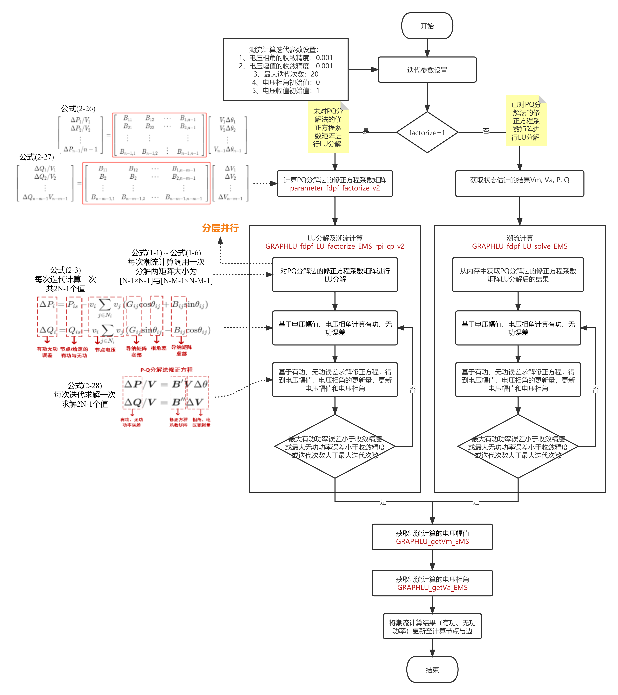
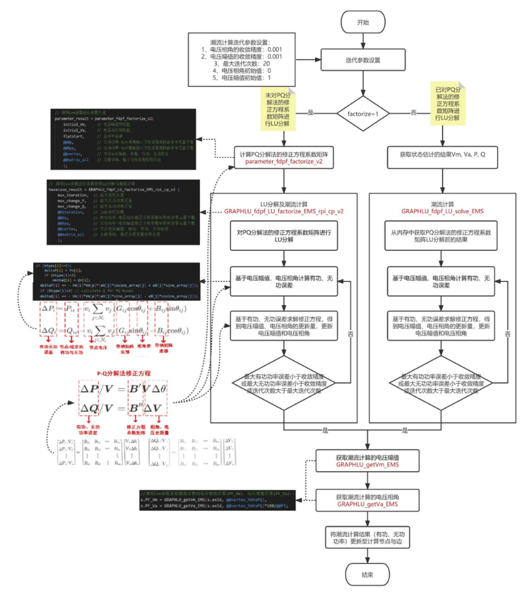

<center><font size=6 color=white>基于图计算的潮流计算</font></center>


# 潮流计算

## 牛顿-拉夫逊法

### 概述

牛顿－拉夫逊法是目前求解非线性方程最好的一种方法。这种方法的特点就是把对非线性方程的求解过程变成反复对相应的线性方程求解的过程，通常称为逐次线性化过程，就是牛顿－拉夫逊法的核心。

牛顿-拉夫逊法的基本原理是在解的某一邻域内的某一初始点出发，沿着该点的一阶偏导数——雅可比矩阵，朝减小方程的残差的方向前进一步，在新的点上再计算残差和雅可矩阵继续前进，重复这一过程直到残差达到收敛标准，即得到了非线性方程组的解。因为越靠近解，偏导数的方向越准，收敛速度也越快，所以牛顿法具有二阶收敛特性。而所谓“某一邻域”是指雅可比方向均指向解的范围，否则可能走向非线性函数的其它极值点，一般来说潮流由平电压即各母线电压（相角为0，幅值为1）启动即在此邻域内。

### 一般概念

对于非线性代数方程组，即：

$$
f_i\left(x_1, x_2, \cdots, x_n\right)=0 \quad(i=1,2, \cdots n)  \tag{1}
$$
在待求量$x$的某一个初始计算值$x^{(0)}$附近，将上式展开泰勒级数并略去二阶及以上的高阶项，得到如下的线性化的方程组

$$
f\left(x^{(0)}\right)+f^{\prime}\left(x^{(0)}\right) \Delta x^{(0)}=0  \tag{2}
$$
上式称之为**牛顿法的修正方程式**。由此可以求得第一次迭代的修正量

$$
\Delta x^{(0)}=-\left[f^{\prime}\left(x^{(0)}\right)\right]^{-1} f\left(x^{(0)}\right)  \tag{3}
$$
将$\Delta x^{(0)}$和$x^{(0)}$相加，得到变量的第一次改进值$x^{(1)}$。接着再从$x^{(1)}$出发，重复上述计算过程。因此从一定的初值$x^{(0)}$出发，应用牛顿法求解的迭代格式为

$$
f^{\prime}\left(x^{(k)}\right) \Delta x^{(k)}=-f\left(x^{(k)}\right)  \tag{4}
$$

$$
x^{(k+1)}=x^{(k)}+\Delta x^{(k)}  \tag{5}
$$

上两式中：$f^{\prime}(x)$是函$f(x)$对于变$x$的一阶偏导数矩阵，即**雅可比矩阵**$J$；$k$为**迭代次数**。

由式（4）和式子（5）可见，牛顿法的核心便是反复形成求解修正方程式。牛顿法当初始估计值$x^{(0)}$和方程的精确解足够接近时，收敛速度非常快，具有平方收敛特性。


### 潮流计算的修正方程

运用牛顿－拉夫逊法计算潮流分布时，首先要找出描述电力系统的非线性方程。这里仍从节点电压方程入手，设电力系统导纳矩阵已知，则系统中某节点（$i$节点）电压方程为：
$$
\sum_{j=1}^{n}Y_{ij} \dot{V}_j =  \frac{\dot{S_i}}{\dot{V_i}}  \notag
$$
从而得$\dot{S_i}=\dot{V}_i \sum_{j=1}^n Y_{i j}^* \dot{V}_j^*$  ，进而有

$$
\left(P_i+j Q_i\right)-\dot{V}_i \sum_{j=1}^n \dot{Y}_{i j} \dot{V}_j=0  \tag{6}
$$
式（6）中，左边第一项为给定的节点注入功率，第二项为由节点电压求得的节点注入功率。他们二者之差就是节点功率的**不平衡量**。现在有待解决的问题就是各节点功率的不平衡量都趋近于零时，各节点电压应具有的价值。

由此可见，如将式（6）作为牛顿－拉夫逊中的非线性函数$F(X)=0$，其中节点电压就相当于变量$X$。建立了这种对应关系，就可列出修正方程式，并迭代求解。但由于节点电压可有两种表示方式——以**直角坐标**或者**极坐标**表示，因而列出的迭代方程相应地也有两种，下面分别讨论。

#### 直角坐标表示的修正方程

节点电压以直角坐标表示时，令$\dot{V}_i=e_i+j f_i$、$\dot{V}_j=e_j+j f_j$，且将导纳矩阵中元素表示为$Y_{i j}=G_{i j}+j B_{i j}$，则式（1－7)改变为

$$
\left(P_i+j Q_i\right)-\left(e_i+j f_i\right) \sum_{j=1}^n\left(G_{i j}-j B_{i j}\right)\left(e_j-j f_j\right)=0  \tag{7}
$$
再将实部和虚部分开，可得

$$
\begin{aligned}
&P_i-\sum_{j=1}^n\left[e_i\left(G_{i j} e_j-B_{i j} f_j\right)+f_i\left(G_{i j} f_j+B_{i j} e_j\right)\right]=0 \\
&Q_i-\sum_{j=1}^n\left[f_i\left(G_{i j} e_j-B_{i j} f_j\right)-e_i\left(G_{i j} f_j+B_{i j} e_j\right)\right]=0
\end{aligned}  \tag{8}
$$
这就是直角坐标下的功率方程。可见，一个节点列出了有功和无功两个方程。

> 1. 对于**$PQ$节点**$(i=1,2,...,m-1)$，**给定量为节点注入功率**，记为$P_i^{\prime}$、$Q_i^{\prime}$，则由式（8)可得功率的不平衡量，作为非线性方程：
>
> $$
> \begin{aligned}
> &\Delta P_i=P_i^{\prime}-\sum_{j=1}^n\left[e_i\left(G_{i j} e_j-B_{i j} f_j\right)+f_i\left(G_{i j} f_j+B_{i j} e_j\right)\right] \\
> &\Delta Q_i=Q_i^{\prime}-\sum_{j=1}^n\left[f_i\left(G_{i j} e_j-B_{i j} f_j\right)-e_i\left(G_{i j} f_j+B_{i j} e_j\right)\right]
> \end{aligned}  \tag{9}
> $$
>
> 式中$\Delta P_i$、$\Delta Q_i$——分别表示第$i$节点的有功功率的不平衡量和无功功率的不平衡量。
>
> 2. 对于**$PV$节点**（$i=m+1,m+2,...,n$），**给定量为节点注入有功功率及电压数值**，记为$P_i^{\prime}$、$V_i^{\prime}$，因此，可以利用有功功率的不平衡量和电压的不平衡量表示出非线性方程，即有：
>
> $$
> \begin{aligned}
> &\Delta P_i=P_i^{\prime}-\sum_{j=1}^n\left[e_i\left(G_{i j} e_j-B_{i j} f_j\right)+f_i\left(G_{i j} f_j+B_{i j} e_j\right)\right] \\
> &\Delta V_i^2=V_i^{\prime 2}-\left(e_i^2+f_i^2\right)
> \end{aligned}  \tag{10}
> $$
>
> 式中$\Delta V_i$为电压的不平衡量。
>
> 3. 对于**平衡节点**（$i=m$），因为电压数值及相位角给定，所以$\dot{V}_s=e_s+j f_s$也确定，不需要参加迭代求节点电压。

因此，对于$n$个节点的系统只能列出$2(n+1)$个方程，其中：

- 有功功率方程$(n-1)$个

- 无功功率方程$(m-1)$个

- 电压方程$(n-m)$个

将式（9）、式（10） 非线性方程联立，称为$n$个节点系统的非线性方程组，且按泰勒级数在$f_{i}^{(0)}$、$e_{i}^{(0)}$（$i=1,2,...,n, i\neq m$)展开，并略去高次项，得到以矩阵形式表示的修正方程如下：
$$
\left[\begin{array}{c}
\Delta P_1 \\
\Delta Q_1 \\
\Delta P_2 \\
\Delta Q_2 \\
\vdots \\
\hdashline \Delta P_p \\
\Delta V_p^2 \\
\vdots \\
\Delta P_n \\
\Delta V_n^2
\end{array}\right]=\left[\begin{array}{cccc:cccc}
H_{11} & N_{11} & H_{12} & N_{12} & H_{1 p} & N_{1 p} & H_{1 n} & N_{1 n} \\
J_{11} & L_{11} & J_{12} & L_{12} & J_{1 p} & L_{1 p} & J_{1 n} & L_{1 n} \\
H_{21} & N_{21} & H_{22} & N_{22} & H_{2 p} & N_{2 p} & H_{2 n} & N_{2 n} \\
J_{21} & L_{21} & J_{22} & L_{22} & J_{2 p} & L_{2 p} & J_{2 n} & L_{2 n} \\
& & & & & & & \\
H_{p 1} & N_{p 1} & H_{p 2} & N_{p 2} & H_{p p} & N_{p p} & H_{p n} & N_{p n} \\
R_{p 1} & S_{p 1} & R_{p 2} & S_{p 2} & R_{p p} & S_{p p} & R_{p n} & S_{p n} \\
& & & & & & & \\
H_{n 1} & N_{n 1} & H_{n 2} & N_{n 2} & H_{n p} & N_{n p} & H_{n n} & N_{n n} \\
R_{n 1} & S_{n 1} & R_{n 2} & S_{n 2} & R_{n p} & S_{n p} & R_{n n} & S_{n n}
\end{array}\right]\left[\begin{array}{c}
\Delta f_1 \\
\Delta e_1 \\
\Delta f_2 \\
\Delta e_2 \\
\vdots \\
\Delta f_p \\
\Delta e_p \\
\vdots \\
\Delta f_n \\
\Delta e_n
\end{array}\right]  \tag{11}
$$
上式中雅可比矩阵的各个元素则分别为：
$$
\begin{aligned}
&H_{i j}=\frac{\partial \Delta P_i}{\partial f_j} \quad N_{i j}=\frac{\partial \Delta P_i}{\partial e_j} \quad \\ 
&J_{i j}=\frac{\partial \Delta Q_i}{\partial f_j} \quad L_{i j}=\frac{\partial \Delta Q_i}{\partial e_j}\\
&R_{i j}=\frac{\partial \Delta V_i^2}{\partial f_j} \quad S_{i j}=\frac{\partial \Delta V_i^2}{\partial e_j} 
\end{aligned}  \tag{12}
$$
将（11）写成缩写形式：

$$
\left[\begin{array}{l}
\Delta P \\
\Delta Q \\
\Delta V^2
\end{array}\right]=\left[\begin{array}{ll}
H & N \\
J & L \\
R & S
\end{array}\right]\left[\begin{array}{l}
\Delta f \\
\Delta e
\end{array}\right]=[J]\left[\begin{array}{l}
\Delta f \\
\Delta e
\end{array}\right]   \tag{13}
$$
对雅可比矩阵各元素可做如下讨论：

当$j \neq i$时，对于特定的$j$，只有该特定点的$f_i$和$e_i$是变量，于是雅可比矩阵中各非对角元素表示为：
$$
\begin{aligned}
&H_{i j}=\frac{\partial \Delta P_i}{\partial f_j}=B_{i j} e_i-G_{i j} f_i \quad \\
&N_{i j}=\frac{\partial \Delta P_i}{\partial e_j}=-G_{i j} e_i-B_{i j} f_i \quad \\
&J_{i j}=\frac{\partial \Delta Q_i}{\partial f_j}=B_{i j} f_i+G_{i j} e_i \\
&L_{i j}=\frac{\partial \Delta Q_i}{\partial e_j}=-G_{i j} f_i+B_{i j} e_i \quad \\
&R_{i j}=\frac{\partial \Delta V_i^2}{\partial f_j}=0 \quad \\
&S_{i j}=\frac{\partial \Delta V_i^2}{\partial e_j}=0 \quad
\end{aligned}  \tag{14}
$$
当$j = i$ 时，雅可比矩阵中各对角元素的表示式为：
$$
\begin{aligned}
&H_{i j}=\frac{\partial \Delta P_i}{\partial f_j}=-\sum_{j=1}^n\left(G_{i j} f_j+B_{i j} e_j\right)-G_{i i} f_i+B_{i i} e_i \\
&N_{i j}=\frac{\partial \Delta P_i}{\partial e_j}=-\sum_{j=1}^n\left(G_{i j} e_j-B_{i j} f_j\right)-G_{i i} e_i-B_{i i} f_i \\
&J_{i j}=\frac{\partial \Delta Q_i}{\partial f_j}=-\sum_{j=1}^n\left(G_{i j} e_j-B_{i j} f_j\right)+G_{i i} e_i+B_{i i} \\
&L_{i j}=\frac{\partial \Delta Q_i}{\partial e_j}=+\sum_{j=1}^n\left(G_{i j} f_j+B_{i j} e_j\right)-G_{i i} f_i+B_{i i} e_i \\
&R_{i j}=\frac{\partial \Delta V_i^2}{\partial f_j}=-2 f_i \\
&S_{i j}=\frac{\partial \Delta V_i^2}{\partial e_j}=-2 e_i 
\end{aligned}   \tag{15}
$$
> 由上述表达式可知，直角坐标的雅可比矩阵有以下特点：
>
> 1.  雅可比矩阵是$2(n-1)$阶方阵，由于$H_{i j} \neq H_{j i} 、 N_{i j} \neq N_{j i}$等等，所以它是一个不对称的方阵。
>
> 2.  雅可比矩阵中诸元素是节点电压的函数，在迭代过程中随电压的变化而不断地改变。
>
> 3.  雅可比矩阵的非对角元素与节点导纳矩阵$Y_B$中对应的非对角元素有关，当$Y_B$中的$Y_{ij}$为零时，雅可比矩阵中相应的$H_{ij}$、$N_{ij}$、$J_{ij}$、$L_{ij}$也都为零，因此，雅可比矩阵也是一个稀疏矩阵。

#### 极坐标表示的修正方程

在牛顿－拉夫逊计算中，选择功率方程 $P_i+j Q_i-\dot{V}_i \sum_{j=1}^n Y_{i j}^* V_j^*=0$ 作为非线性函数方程，把式中电压向量表示为极坐标形式
$$
\begin{gathered}
\dot{V}_i=V_i e^{j \delta_i}=V_i\left(\cos \delta_i+j \sin \delta_i\right) \\
\dot{V}_j=V_j e^{j \delta_j}=V_j\left(\cos \delta_j+j \sin \delta_j\right)
\end{gathered}   \tag{16}
$$
则**节点功率方程**变为
$$
P_i+j Q_i-V_i\left(\cos \delta_i+j \sin \delta_i\right) \sum_{j=1}^n\left(G_{i j}-j B_{i j}\right) V_j\left(\cos \delta_j-j \sin \delta_j\right)=0   \tag{17}
$$
将上式分解成实部和虚部
$$
\begin{aligned}
P_i-V_i \sum_{j=1}^n V_j\left(G_{i j} \cos \delta_{i j}+B_{i j} \sin \delta_{i j}\right)=0 \\
Q_i-V_i \sum_{j=1}^n V_j\left(G_{i j} \sin \delta_{i j}-B_{i j} \cos \delta_{i j}\right)=0
\end{aligned}   \tag{18}
$$
这就是功率方程的极坐标形式，由此可得到描述电力系统的非线性方程。

> 1. 对于**$PQ$节点**，给定了
>
> $$
> \left.\begin{array}{l}
> \Delta P_i=P_i^{\prime}-V_i \sum_{j=1}^n V_j\left(G_{i j} \cos \delta_{i j}+B_{i j} \sin \delta_{i j}\right) \\
> Q_i=Q_i^{\prime}-V_i \sum_{j=1}^n V_j\left(G_{i j} \sin \delta_{i j}-B_{i j} \cos \delta_{i j}\right)
> \end{array}  \right\} \quad(i=1,2 、 \cdots m-1)   \tag{19}
> $$
>
> 2. 对于**$PV$节点**，给定了$P_i^{\prime}$、$V_i^{\prime}$，而$Q_i^{\prime}$未知，式（19）中$\Delta Q_i$将失去作用，于是$PV$节点仅保留$\Delta P_i$方程，以求得电压的相位角。
>
> $$
> \Delta P_i=P_i^{\prime}-V_i \sum_{j=1}^n V_j\left(G_{i j} \cos \delta_{i j}+B_{i j} \sin \delta_{i j}\right)  \quad (i=m+1 、 m+2 、 \cdots n)  \tag{20}
> $$
>
> 3. 对于**平衡节点**，同样因为$U_s$、$\delta_s$已知，不参加迭代计算。

将式（19）、式（20）联立，且按泰勒级数展开，并略去高次项后，得出矩阵形式的修正方程

$$
\left[\begin{array}{c}
\Delta P_1 \\
\Delta Q_1 \\
\Delta P_2 \\
\Delta Q_2 \\
\vdots \\
\Delta P_p \\
\vdots \\
\Delta P_n
\end{array}\right]=\left[\begin{array}{cccccc}
H_{11} & N_{11} & H_{12} & N_{12} & H_{1 p} & H_{1 n} \\
J_{11} & L_{11} & J_{12} & L_{12} & J_{1 p} & L_{1 n} \\
H_{21} & N_{21} & H_{21} & N_{21} & H_{2 p} & N_{2 n} \\
J_{21} & L_{21} & J_{21} & L_{21} & J_{2 p} & L_{2 n} \\
H_{p 1} & N_{p 1} & H_{p 2} & N_{p 2} & H_{p p} & H_{p n} \\
& & & & & \\
H_{n 1} & N_{n 1} & H_{n 2} & N_{n 2} & H_{n p} & H_{n n}
\end{array}\right]\left[\begin{array}{c}
\Delta \delta_1 \\
\Delta V_1 / V_1 \\
\Delta \delta_2 \\
\Delta V_2 / V_2 \\
\vdots \\
\Delta \delta_p \\
\vdots \\
\Delta \delta_n
\end{array}\right]   \tag{21}
$$
雅可比矩阵终，对$PV$节点，仍可写出两个方程的形式，但其中的元素以零元素代替，从而显示了雅可比矩阵的高度稀疏性。式中电压幅值的修正量采用$\Delta U / U$的形式，并没有什么特殊意义，仅是为了雅可比矩阵中各元素具有相似的表达式。

雅可比矩阵的各元素如下：

$$
\begin{aligned}
&H_{i j}=\frac{\partial \Delta P_i}{\partial \delta_j}=-V_i V_j\left(G_{i j} \sin \delta_{i j}-B_{i j} \cos \delta_{j j}\right)\\
&H_{i i}=\frac{\partial \Delta P_i}{\partial \delta_i}=V_i \sum_{\substack{j=1 \\ j \neq i}}^n V_j\left(G_{i j} \sin \delta_{i j}-B_{i j} \cos \delta_{i j}\right)\\
&N_{i j}=\frac{\partial \Delta P_i}{\partial V_j} V_j=-V_i V_j\left(G_{i j} \cos \delta_{i j}+B_{i j} \sin \delta_j\right)\\
&N_{i i}=\frac{\partial \Delta P_i}{\partial V_i} V_i=-V_i \sum_{\substack{j=1 \\ j \neq 1}}^n V_j\left(G_{i j} \cos \delta_{i j}+B_{i j} \sin \delta_{i j}\right)-2 V_i^2 G_{i i}\\
&J_{i j}=\frac{\partial \Delta Q_i}{\partial \delta_j}=V_i V_j\left(G_{i j} \cos \delta_{i j}+B_{i j} \sin \delta_{i j}\right)\\
&J_{i i}=\frac{\partial \Delta Q_i}{\partial \delta_i}=-V_i \sum_{\substack{j=1 \\ j \neq i}}^n V_j\left(G_{i j} \cos \delta_{i j}+B_{i j} \sin \delta_{i j}\right)\\
&L_{i j}=\frac{\partial \Delta Q_i}{\partial \delta_j}=-V_i V_j\left(G_{i j} \cos \delta_{i j}-B_{i j} \sin \delta_{i j}\right)\\
&L_{i i}=\frac{\partial \Delta Q_1}{\partial \delta_i} V_j=-V_i \sum_{\substack{j=1 \\ j=i}}^n V_j\left(G_{i j} \sin \delta_{i j}-B_{i j} \cos \delta_{i j}\right)+2 V_i^2 B_{i i}
\end{aligned}  \tag{22}
$$
将式（21）写成缩写形式

$$
\left[\begin{array}{l}
\Delta P \\
\Delta Q
\end{array}\right]=\left[\begin{array}{ll}
H & N \\
J & L
\end{array}\right]\left[\begin{array}{l}
\Delta \delta \\
\Delta V / V
\end{array}\right]  \tag{23}
$$
以上得到了两种坐标系下的修正方程，这是牛顿－拉夫逊潮流计算中需要反复迭代求解的基本方程式。


## 快速分解法

### 概述

快速分解法的基本思想是：把节点功率表示为电压向量的极坐标方程式，抓主要矛盾，**以有功功率误差作为修正电压向量角度的依据，以无功功率误差作为修正电压幅值的依据**，把有功功率和无功功率的迭代分开来进行。快速分解法根据电力系统实际运行状态的物理特点，对牛顿-拉夫逊法潮流计算的数学模型进行合理的简化。

### 基本公式

在交流高压电网中，**输电线路的电抗要比电阻大得多，系统中母线有功功率的变化主要受电压相位的影响，无功功率的变化主要受母线电压幅值变化的影响**。在修正方程式的系数矩阵中，偏导$\frac{\partial \Delta Q}{\partial \delta}$和$\frac{\partial \Delta P}{\partial V}$的数值相对于偏导数$\frac{\partial \Delta Q}{\partial V}$和$\frac{\partial \Delta P}{\partial \delta}$是相当小的，作为简化的第一步，可以将方程式（24）中的子块$N$和$K$略去不计，即认为它们的元素都等于零。这样，$n-1+m$阶的方程式便分解为一个$n-1$阶和一个$m$阶的方程式，即将式（24）简化为式（25）和式（26)。

$$
{\left[\begin{array}{l}
\Delta \mathbf{P} \\
\Delta \mathbf{Q}
\end{array}\right]=-\left[\begin{array}{ll}
\mathbf{H} & \mathbf{N} \\
\mathbf{K} & \mathbf{L}
\end{array}\right]\left[\begin{array}{c}
\Delta \delta \\
\mathbf{V}_{\mathbf{D}}^{-1} \Delta \mathbf{V}
\end{array}\right]}  \tag{24}
$$

$$
\Delta \mathbf{P}=-\mathbf{H} \Delta \delta  \tag{25}
$$

$$
\Delta \mathbf{Q}=-\mathbf{L} \mathbf{V}_{\mathbf{D}}^{-1} \Delta \mathbf{V}  \tag{26}
$$

上述的简化大大地节省了计算机的内存和解题时间，但是矩阵$H$和$L$的元素都是节点电压幅值和相角差的函数，其数值在迭代过程中是不断变化的。因此，**快速分解法潮流计算的简化版**，也是最关键的一步简化就在于把系数矩阵$H$和$L$简化成在迭代过程中不变的常数对称矩阵。在一般情况下，线路两端电压的相角差是不大的（通常不超过10°~20°）因此可以认为：

$$
\cos \delta_{i j} \approx 1 \\
\quad G_{i j} \sin \delta_{i j}<< B_{ij}  \tag{27}
$$
此外，与系统各节点无功功率相适应的导纳$B_{L D i}$必远小于该节点自导纳的虚部，即$B_{L D i}=\frac{Q_i}{V_i^2}<<B_{i i}$ 或$\quad Q_i<<V_i^2 B_{i i}$

考虑到上面的关系，矩阵$H$和$L$的元素的表达式便被简化为：


$$
H_{i j}=V_i V_j B_{i j} \quad(\mathrm{i}, \mathrm{j}=1,2, \ldots, \mathrm{n}-1)  \tag{28}
$$

$$
L_{i j}=V_i V_j B_{i j} \quad(\mathrm{i}, \mathrm{j}=1,2, \ldots, \mathrm{m})  \tag{29}
$$

$$
\mathbf{H}=\left[\begin{array}{cccc}
V_1 B_{11} V_1 & V_1 B_{12} V_2 & \cdots & V_1 B_{1, n-1} V_{n-1} \\
V_2 B_{21} V_1 & V_2 B_{22} V_2 & \cdots & V_2 B_{2, n-1} V_{n-1} \\
\vdots & \vdots & & \vdots \\
V_{n-1} B_{n-1,1} V_1 & V_{n-1} B_{n-1,2} V_2 & \cdots & V_{n-1} B_{n-1, n-1} V_{n-1}
\end{array}\right]  \tag{30}
$$

$$
\mathbf{L}=\left[\begin{array}{cccc}
V_1 B_{11} V_1 & V_1 B_{12} V_2 & \cdots & V_1 B_{1 m} V_m \\
V_2 B_{21} V_1 & V_2 B_{22} V_2 & \cdots & V_2 B_{2 m} V_m \\
\vdots & \vdots & & \\
V_m B_{m 1} V_1 & V_m B_{m 2} V_2 & \cdots & V_m B_{m m} V_m
\end{array}\right]  \tag{31}
$$

将式（30）和式（31）分别代入式（25）和（26），便得到：
$$
\begin{aligned}
\Delta \mathbf{P} &=-\mathbf{V}_{\mathrm{D} 1} \mathbf{B}^{\prime} \mathbf{V}_{\mathrm{D} 1} \Delta \delta \\
\Delta \mathbf{Q} &=-\mathbf{V}_{\mathrm{D} 2} \mathbf{B}^{\prime \prime} \Delta \mathbf{V}
\end{aligned}  \tag{32}
$$
用$V_{D1}^{-1}$和$V_{D2}^{-1}$分别左乘以上两式便得简化了的修正方程式，可展开写成：

$$
{\left[\begin{array}{c}
\frac{\Delta P_1}{V_1} \\
\frac{\Delta P_2}{V_2} \\
\vdots \\
\frac{\Delta P_{n-1}}{V_{n=1}}
\end{array}\right]=-\left[\begin{array}{cccc}
B_{11} & B_{12} & \cdots & B_{1, n-1} \\
B_{21} & B_{22} & \cdots & B_{2, n-1} \\
\vdots & \vdots & & \vdots \\
B_{n-1,1} & B_{n-1,2} & \cdots & B_{n-1, n-1}
\end{array}\right]\left[\begin{array}{c}
V_1 \Delta \delta_1 \\
V_2 \Delta \delta_2 \\
\vdots \\
V_{n-1} \Delta \delta_{n-1}
\end{array}\right]}   \tag{33}
$$

$$
{\left[\begin{array}{c}
\frac{\Delta Q_1}{V_1} \\
\frac{\Delta Q_2}{V_2} \\
\vdots \\
\frac{\Delta Q_m}{V_m}
\end{array}\right]=-\left[\begin{array}{cccc}
B_{11} & B_{12} & \cdots & B_{1 m} \\
B_{21} & B_{22} & \cdots & B_{2 m} \\
\vdots & \vdots & & \vdots \\
B_{m 1} & B_{m 2} & \cdots & B_{m m}
\end{array}\right]\left[\begin{array}{c}
\Delta V_1 \\
\Delta V_2 \\
\vdots \\
\Delta V_m
\end{array}\right]}  \tag{34}
$$

式（33）和式（34）就是快速分解法潮流计算的**修正方程式**，其中系数矩阵都是由节点导纳矩阵的虚部构成，只是阶次不同，矩阵$B^{\prime}$为$n-1$阶，不含平衡节点对应的行和列，矩阵$B^{''}$为$m$阶，不含平衡节点和$PV$节点对应的行和列。

$$
\Delta P_i=P_{i s}-P_i=P_{i s}-V_i \sum_{j=1}^n V_j\left(G_{i j} \cos \delta_{i j}+B_{i j} \sin \delta_{i j}\right)  \tag{35}
$$

$$
\Delta Q_i=Q_{i s}-Q_i=Q_{i s}-V_i \sum_i^n V_j\left(G_{i j} \sin \delta_{i j}+B_{i j} \cos \delta_{i j}\right)  \tag{36}
$$

其中，$P_{i s}、Q_{i s}$为节点$i$给定的有功功率与无功功率，$P_i、Q_i$为功率方程，**修正方程式**（33）和（34）与**功率误差方程**式（35）和（36）构成了快速分解法迭代的基本计算公式。目的是寻找一组电压向量$V$、$\theta$ 是的计算的功率误差在容许范围之内。

### 迭代过程

1. 给定节点电压幅值和相角的初值。

2. 基于$\Delta P_i=P_{i s}-P_i=P_{i s}-V_i \sum_{j=1}^n V_j\left(G_{i j} \cos \delta_{i j}+B_{i j} \sin \delta_{i j}\right)  \tag{35}$计算有功功率误差$\Delta P_i$，并求出$\frac{\Delta P_i}{V_i}$。

3. 求解有功修正方程得到相角修正量$\Delta \delta$
    $$
    {\left[\begin{array}{c}
    \frac{\Delta P_1}{V_1} \\
    \frac{\Delta P_2}{V_2} \\
    \vdots \\
    \frac{\Delta P_{n-1}}{V_{n=1}}
    \end{array}\right]=-\left[\begin{array}{cccc}
    B_{11} & B_{12} & \cdots & B_{1, n-1} \\
    B_{21} & B_{22} & \cdots & B_{2, n-1} \\
    \vdots & \vdots & & \vdots \\
    B_{n-1,1} & B_{n-1,2} & \cdots & B_{n-1, n-1}
    \end{array}\right]\left[\begin{array}{c}
    V_1 \Delta \delta_1 \\
    V_2 \Delta \delta_2 \\
    \vdots \\
    V_{n-1} \Delta \delta_{n-1}
    \end{array}\right]}   \notag
    $$

4. 修正相角$\delta^{k+1}=\delta^{k}-\Delta \delta$

5. 基于$\Delta Q_i=Q_{i s}-Q_i=Q_{i s}-V_i \sum_i^n V_j\left(G_{i j} \sin \delta_{i j}+B_{i j} \cos \delta_{i j}\right)$计算无功功率误差$\Delta Q_i$，并求出$\frac{\Delta Q_i}{V_i}$

6. 求解无功修正方程得到电压修正量$\Delta V$
    $$
    {\left[\begin{array}{c}
    \frac{\Delta Q_1}{V_1} \\
    \frac{\Delta Q_2}{V_2} \\
    \vdots \\
    \frac{\Delta Q_m}{V_m}
    \end{array}\right]=-\left[\begin{array}{cccc}
    B_{11} & B_{12} & \cdots & B_{1 m} \\
    B_{21} & B_{22} & \cdots & B_{2 m} \\
    \vdots & \vdots & & \vdots \\
    B_{m 1} & B_{m 2} & \cdots & B_{m m}
    \end{array}\right]\left[\begin{array}{c}
    \Delta V_1 \\
    \Delta V_2 \\
    \vdots \\
    \Delta V_m
    \end{array}\right]}  \notag
    $$
    
7. 修正电压$V^{k+1}=V^{k}-\Delta V$

8. 迭代直至$\Delta P_i$，$\Delta Q_i$都满足收敛条件。


### 快速分解法的特点

快速分解法与牛顿法潮流计算的主要差别表现在它们的修正方程上。快速分解法通过对电力系统具体特点的分析，对牛顿法修正方程式的雅克比矩阵进行了有效的简化和改进，得到式（33）、式（34）所示的修正方程式。这两组方程式和牛顿法的修正方程相比主要有三个特点：

1. 快速分解法的修正方程式用两个$n$阶线性方程组代替了一个$2n$阶线方程组。
2. 快速分解法的修正方程式中系数矩阵的所有元素在迭代过程中维持常数不变。
3. 快速分解法的修正方程式中系数矩阵是对称矩阵。

> 这些特点在提高计算速度和减少内存方面的作用是很明显的：
>
> **首先**，因为修正方程式的系数矩阵是导纳矩阵的虚部，因此在迭代过程中不必像牛顿法那样每次都要重新计算雅克比矩阵，这样不仅减少了运算量，而且也大大简化了程序；
>
> **其次**，由于系数矩阵在迭代过程中维持不变，因此在求解修正方程式时，不必每次都对系数矩阵进行消去运算，只需要在进入迭代过程以前，将系数矩阵用三角分解形成因子表，然后反复利用因子表对不同的常数项$\Delta P / V$或$\Delta Q / V$进行消去和回代运算，就可以迅速求得修正量，从而显着提高了迭代速度；
>
> **第三**，由于对称矩阵三角分解后，其上三角矩阵和下三角矩阵有非常简单的关系，所以在计算机中可以只存储上三角矩阵或下三角矩阵，从而也进一步节约了内存。

快速分解法所采用的一系列简化假定只影响了修正方程的结构，也就是说只影响了迭代过程，但未影响最终结果。因为快速分解法和牛顿法都采用同样的数学模型，最后计算功率误差和判断收敛条件都是严格按照精确公式进行的，所以快速分解法和牛顿法一样都可以达到很高的精确度。

为了改善快速分解法的收敛特性，修正方程的系数矩阵$B^{\prime}$与$B^{''}$一般并不简单的是电力系统导纳矩阵的虚部，下面讨论一下$B^{\prime}$与$B^{''}$的构成。

$B^{\prime}$与$B^{''}$的阶数是不同的，$B^{\prime}$为 $n-1$阶，$B^{''}$低于$n-1$阶。因为式（34）不包含于$PV$节点有关的项，所以，如果系统有$r$个$PV$节点，则$B^{''}$应为$n-r-1$阶。式（33）以有功功率误差为依据修正电压向量的角度，式（34）以无功功率误差依据修正电压幅值。

为了加速收敛，使它们能够更有效地进行修正，可以考虑在$B^{\prime}$中尽量去掉那些与有功功率及电压向量角度无关或影响较小的因素，而在$B^{''}$中尽量去掉与无功功率及电压幅值影响较小的因素。

所以，我们以电力系统导纳矩阵的虚部作为$B^{\prime}$和$B^{''}$时，可以在去$B^{\prime}$掉充电电容和变压器变比的影响，在$B^{''}$中去掉输电线路电阻对$B^{''}$的影响。和$B^{\prime}$$B^{''}$的非对角元素和对角元素可分别按式（37）和（38)计算：
$$
B_{i j}^{\prime}=-\frac{x_{i j}}{r_{i j}^2+x_{i j}^2}     \\   B_{i i}^{\prime}=\sum_{j \in i} \frac{x_{i j}}{r_{i j}^2+x_{i j}^2}  \tag{37}
$$

$$
B^{\prime \prime}=-\frac{1}{x_{i j}}    \\    B^{\prime \prime}=\sum_{j \in i} \frac{1}{x_{i j}}-b_{i 0}  \tag{38}
$$

式（37）中$r_{ij}$和$x_{ij}$分别为支路$ij$的电阻和感抗，式（38）中$b_{i0}$为节点$i$接地支路的电纳。

快速分解法改变了牛顿法迭代公式的结构，因此就改变了迭代过程的收敛性。牛顿法在迭代开始时收敛得较慢，当收敛到一定程度后，它的收敛速度非常之快，而快速分解法几乎是按同一速度收敛的，快速分解法每次迭代的计算量很小，因此快速分解法的计算速度比牛顿法有明显的提高。

## 潮流计算的使用方法

### 初始方式准备

对任何潮流模拟操作计算，总是在某一个初始的运行方式上进行。这种初始方式可以是状态估计提供的实时运行方式，也可以是以往保存的历史运行方式。

### 调度操作模拟

在准备好的初始潮流断面上，可以继续修改方式，模拟预想的潮流运行方式，再进行详细的潮流分析。模拟操作包括：

1. 开关刀闸变位模拟

2. 发电机功率调整

3. 负荷功率设置

4. 发电机分接头设置

5. 线路停运、投入

6. 变压器停运、投入

7. 母线停运、投入

8. 厂站停运、投入

    

### 运行参数维护

潮流计算参数画面上可以设置算法、收敛判据、迭代次数、单/多平衡机等运行参数。

平衡发电机是电气岛内的电压相角参考点，当采用“单平衡机”模式时，电网的不平衡功率（包括发电、负荷和网损）都将由设定平衡机吸收。当采用“多平衡机”模式时，电网的不平衡功率将由多台发电机负责平衡，多台发电机之间的不平衡功率分配方式包括容量、系数和平均三种方式。选择容量时将根据发电机的可调容量分配，选择系数时根据人工设置的系数按比例分配，选择平均时则平均分配不平衡功率。在分配过程中，确保发电机的出力在最大出力和最小出力范围内。

发电机参数中可以设置发电机的调节特性，包括节点类型（平衡节点、PQ 节点、PV节点等），对于PV节点可以设定控制机端电压还是高压侧母线电压以及控制的目标电压值，对于按指定系数参与有功调节的机组可以设置比例系数。

### 计算结果分析

潮流计算结束后，计算结果分析包括：

1.  潮流计算状态

2.  电气岛、迭代信息

3.  潮流计算结果

4.  设备越限和重载监视

5.  运行信息&nbsp;

### 误差统计

在潮流模拟计算完成后，如果现场很快发生了模拟的动作，可以从统计每个测点模拟计算值和实际量测值相比的误差，并统计出全网平均误差，统计方法遵循实用化考核细则。在表格中全部列出所有测点的SCADA量测值、潮流模拟计算值、考核基准值以及测点误差等内容。

如果只关心部分厂站的误差情况，局部误差统计中选择好需要关心的厂站，局部误差统计程序会过滤掉没有选中的厂站，只列出选中厂站的所有设备的误差统计情况。

如果想要保存当前误差统计的运行断面，可以保存误差断面，将当前的断面以及误差统计结果一起保存起来。误差统计历史记录包含所有保存的误差断面，内容包括统计时间、平均误差、执行用户、值班主机、断面名称以及操作信息等内容。


# 图模型构建

## 流程图






## 具体实现

### 获取潮流计算迭代参数

gsql从参数节点获取潮流计算迭代所需的最大有功功率变化量、最大无功功率变化量、最大迭代次数、电压相角初始值、电压幅值初始值、是否平启动（Vm=1, Va=0）、输出文件路径

```c++
// 从节点parameters获取潮流计算参数---------------------
T_params = SELECT s FROM T_params:s 
            POST-ACCUM
                max_change_P = s.pf_MaxChange_P,    // 最大有功功率变化量，0.001
                max_change_Q = s.pf_MaxChange_Q,    // 最大无功功率变化量
                max_iteration = s.pf_MaxIter,       // 最大迭代次数
                initial_Va = s.initial_Va,          // 电压相角初始值
                initial_Vm = s.initial_Vm,          // 电压幅值初始值
                flatstart = s.pf_flatstart,         // 潮流计算平启动：Vm=1, Va=0
                outputfile = s.pf_outputfile;       // 输出文件路径
```


### 判断修正方程系数矩阵是否LU分解

#### 未进行LU分解

调用C++函数**parameter_fdpf_factorize_v2**计算修正方程的系数矩阵

```c++
// 调用C++函数进行参数生成
parameter_result = parameter_fdpf_factorize_v2(
            initial_Vm,     // 电压幅值初始值
            initial_Va,     // 电压相角初始值
            flatstart,      // 是否平启动
            @@Bp,           // 有功功率-电压相角修正方程系数矩阵的非零元素个数
            @@Bpp,          // 无功功率-电压幅值修正方程系数矩阵的非零元素个数
            @@vertex,       // 节点电压幅值、相角、有功、无功信息
            @@matrix_all    // 支路导纳、修正方程系数矩阵信息
            );
```

ExprFunctions.hpp调用GRAPHLU分别对有功、无功系数矩阵进行因子分解。

#### 已进行LU分解

基于状态估计得到的电压幅值、相角计算节点注入有功、无功功率

```sql
s.@cal_P += s.SE_Vm*t.SE_Vm * (-1*e.G*cos(s.SE_Va-t.SE_Va) + e.B * sin(s.SE_Va - t.SE_Va)),
s.@cal_Q += s.SE_Vm*t.SE_Vm * (-1*e.G*sin(s.SE_Va-t.SE_Va) - e.B * cos(s.SE_Va - t.SE_Va))
```

判断是否平启动，非平启动则将节点电压与相角的初值取状态估计结果

```c++
case when flatstart == 0 then  //not using flat start, set voltage manitude/angle based on input data files
                    case when s.busType == 1 or s.busType == 0 then   // PQ
                        s.@Va = s.SE_Va, 
                        s.@Vm = s.SE_Vm
                    when s.busType == 2 then   // PV
                        s.@Va = s.SE_Va, 
                        s.@Vm = s.SE_Vm
                    when s.busType == 3 then   // 平衡节点
                        s.@Va = s.SE_Va, 
                        s.@Vm = s.SE_Vm
                    when s.busType == 4 then   //异常
                        s.@Vm = 0, 
                        s.@Va = 0, 
                        s.@P =0 , 
                        s.@Q =0
                    end
```

若平启动，则根据节点类型对应处理：PQ节点电压幅值、相角均取初始设定值；PV节点电压幅值取状态估计结果，相角取初始设定值；平衡节点电压幅值、相角均取状态估计结果

```c++
                else   //flat start, set voltage magnitude/angle based on user input
                    case when s.busType == 1 or s.busType == 0 then   //PQ
                        s.@Vm = initial_Vm, 
                        s.@Va = initial_Va 
                    when s.busType == 2 then   // PV
                        s.@Vm = s.SE_Vm, 
                        s.@Va = initial_Va
                    when s.busType == 3 then 
                        s.@Vm = s.SE_Vm, 
                        s.@Va = s.SE_Va
                    when s.busType == 4 then 
                        s.@Vm = 0, 
                        s.@Va = 0, 
                        s.@P =0 , 
                        s.@Q =0
                    end
                end,
```

将系统运行的4N的运行参数$V ,\theta ,P ,Q$，以及节点ID和节点类型保存到@@vertex_VmVaPQ中

```c++
// 将节点数据保存到@@vertex_VmVaPQ-----------------------------------------------------------------
@@vertex_VmVaPQ += sort_id_vertex_VmVaPQ(s.exId, s.@Vm, s.@Va, s.@P, s.@Q, s.busType);
```


### 有功、无功误差计算

基于功率偏差计算公式分别计算有功功率和无功功率的误差
$$
\begin{array}{l}
\Delta P_{i}=P_{i s}-v_{i} \sum_{j \in N_{i}} v_{j}\left(G_{i j} \cos \theta_{i j}+B_{i j} \sin \theta_{i j}\right) \\
\Delta Q_{i}=Q_{i s}-v_{i} \sum_{j \in N_{i}} v_{j}\left(G_{i j} \sin \theta_{i j}-B_{i j} \cos \theta_{i j}\right)
\end{array}
$$

```c++
deltaP[i] = 0;
deltaQ[i] = 0;

if (btype[i] != 3)
{
    deltaP[i] = Pn[i];
    if (btype[i] < 2)
        deltaQ[i] = Qn[i];
}

// Calculate network injections
if (btype[i] != 3)
{
    for (j = ep[i]; j < ep[i + 1]; ++j)
    {
        p = ei[j];
        if (iter == 0)
        {
            // if this is the first iteraton, calculate the cosine and sine terms
            cosine_array[j] = cos(Va[i] - Va[p]);
            sine_array[j] = sin(Va[i] - Va[p]);
        }
        deltaP[i] += -Vm[i] * Vm[p] * (eG[j] * cosine_array[j] + eB[j] * sine_array[j]);
        if (btype[i] < 2) // calculate Q for PQ buses
            deltaQ[i] += -Vm[i] * Vm[p] * (eG[j] * sine_array[j] - eB[j] * cosine_array[j]);
    }
}
```

获取有功和无功的最大误差量

```c++
// Get max P and max Q
if (abs(deltaP[i]) > maxDeltaP)
    maxDeltaP = abs(deltaP[i]);
if (abs(deltaQ[i]) > maxDeltaQ)
    maxDeltaQ = abs(deltaQ[i]);
```

基于常数化修正方程如下所示，计算有功误差、无功误差除以电压幅值的商
$$
\left[\begin{array}{c}
\Delta P_{1} / V_{1} \\
\Delta P_{2} / V_{2} \\
\vdots \\
\Delta P_{n} / V_{n}
\end{array}\right]=\left[\begin{array}{cccc}
B_{11} & B_{12} & \cdots & B_{1 n} \\
B_{21} & B_{22} & \cdots & B_{2 n} \\
\vdots & \vdots & & \vdots \\
B_{n 1} & B_{n 2} & \vdots & B_{n n}
\end{array}\right]\left[\begin{array}{c}
V_{1} \Delta \theta_{1} \\
V_{2} \Delta \theta_{2} \\
\vdots \\
V_{n} \Delta \theta_{n}
\end{array}\right]
$$

$$
\left[\begin{array}{c}
\Delta Q_{1} / V_{1} \\
\Delta Q_{2} / V_{2} \\
\vdots \\
\Delta Q_{n} / V_{n}
\end{array}\right]=\left[\begin{array}{cccc}
B_{11} & B_{12} & \cdots & B_{1 n} \\
B_{21} & B_{22} & \cdots & B_{2 n} \\
\vdots & \vdots & & \vdots \\
B_{n 1} & B_{n 2} & \cdots & B_{n n}
\end{array}\right]\left[\begin{array}{c}
\Delta V_{1} \\
\Delta V_{2} \\
\vdots \\
\Delta V_{n}
\end{array}\right]
$$

```c++
deltaP[i] /= Vm[i];
deltaQ[i] /= Vm[i];
```


### 电压相角更新

更新电压相角

```c++
// Update V angle (Va)
for (i = 0; i < n; ++i)
{
    // Va[i] -= delta[i];
    Va[i] -= b[cpi[i]] * cols[cpi[i]];
}
```


### 有功、无功误差更新

基于更新后的电压相角，重新计算有功、无功误差

```c++
// Calculate network injections
if (btype[i] != 3)
{
    for (j = ep[i]; j < ep[i + 1]; ++j)
    {
        p = ei[j];
        // Va has been updated, update the cosine and sine terms
        cosine_array[j] = cos(Va[i] - Va[p]);
        sine_array[j] = sin(Va[i] - Va[p]);
        deltaP[i] += -Vm[i] * Vm[p] * (eG[j] * cosine_array[j] + eB[j] * sine_array[j]);
        if (btype[i] < 2) // calculate Q for PQ buses
        {
            deltaQ[i] += -Vm[i] * Vm[p] * (eG[j] * sine_array[j] - eB[j] * cosine_array[j]);
        }
    }
}
```

计算更新有功误差、无功误差除以电压幅值的商

```c++
deltaP[i] /= Vm[i];
deltaQ[i] /= Vm[i];
```


### 电压幅值更新

更新电压幅值

```c++
// Update V magnitude (Vm)
for (i = 0; i < n; ++i)
{
    // Vm[i] -= delta[i];
    Vm[i] -= b[cpi_pp[i]] * cols_pp[cpi_pp[i]];
}
```


### 收敛条件判断

若最大有功误差和最大无功误差小于给定精度，则判定程序收敛，输出结果

```c++
// Decide if the program converges
if (maxDeltaP < max_change_ex && maxDeltaQ < max_change_ex)
{
    result = "OK";
    break;
}
```


### 潮流计算结果更新至计算节点

调用C++函数GRAPHLU_getVm_EMS、GRAPHLU_getVa_EMS获取潮流计算的电压幅值、相角结果(PF_Vm，PF_Va)

```c++
T2 = select s from T0:s
            WHERE s.island == 1
            post-accum	 
                // 调用C++函数获取潮流计算的电压幅值结果(PF_Vm)----------------------------
                s.PF_Vm = GRAPHLU_getVm_EMS(s.exId, @@vertex),  //电压幅值
                s.PF_Va = GRAPHLU_getVa_EMS(s.exId, @@vertex)*180/@@PI;	 //电压相角
```

将潮流计算的参数更新至status节点

```c++
// 将潮流计算的参数更新至节点status---------------------------
T1_status =  SELECT s FROM T_status:s
                    POST-ACCUM
                        s.pf_iteration = @@iteration,
                        s.pf_start_mode = flatstart,
                        s.pf_convergence_P = max_change_P,
                        s.pf_convergence_Q = max_change_Q,
                        s.pf_method = "P-Q分解法";	
```

基于潮流计算得到的电压幅值(PF_Vm)与电压相角(PF_Va)更新支路的有功(P_TLPF)、无功(Q_TLPF)

```c++
// 1、基于潮流计算得到的电压幅值(PF_Vm)与电压相角(PF_Va)更新支路的有功(P_TLPF)、无功(Q_TLPF)。
T0 = SELECT s from T0: s -(topo_connect:e)->TopoND:t
            where s.island == 1 and t.island == 1 
            accum //IF e.R.size() != 0 THEN
                double tap_ratio = abs(e.transformer_final_turns_ratio),
                double tap_ratio_square = abs((e.transformer_final_turns_ratio)*(e.transformer_final_turns_ratio)),

                case when (e.transformer_final_turns_ratio == 0) then //and tap_ratio !=0 and tap_ratio_square != 0) then
                    e.P_TLPF = s.PF_Vm * t.PF_Vm * sin((s.PF_Va - t.PF_Va)*@@PI/180)* e.B + (s.PF_Vm*s.PF_Vm - s.PF_Vm*t.PF_Vm*cos((s.PF_Va - t.PF_Va)*@@PI/180)) * e.G,
                    e.Q_TLPF = - s.PF_Vm * s.PF_Vm * (-e.B + e.hB) - s.PF_Vm * t.PF_Vm * (e.G*sin((s.PF_Va - t.PF_Va)*@@PI/180) - (-e.B)*cos((s.PF_Va - t.PF_Va)*@@PI/180))
                when (e.transformer_final_turns_ratio > 0) then
                    //IF tap_ratio_square != 0 and tap_ratio != 0 THEN
                    e.P_TLPF = s.PF_Vm * s.PF_Vm * e.G - s.PF_Vm * t.PF_Vm * ((e.G*tap_ratio)*cos((s.PF_Va - t.PF_Va)*@@PI/180) + (-e.B*tap_ratio)*sin((s.PF_Va - t.PF_Va)*@@PI/180)),
                    e.Q_TLPF = - s.PF_Vm * s.PF_Vm * (-e.B + e.hB)  - s.PF_Vm * t.PF_Vm * ((e.G*tap_ratio)*sin((s.PF_Va - t.PF_Va)*@@PI/180) - (-e.B*tap_ratio)*cos((s.PF_Va - t.PF_Va)*@@PI/180))
                else
                    e.P_TLPF = s.PF_Vm * s.PF_Vm * e.G * tap_ratio_square - s.PF_Vm * t.PF_Vm * ((e.G*tap_ratio)*cos((s.PF_Va - t.PF_Va)*@@PI/180) + (-e.B*tap_ratio)*sin((s.PF_Va - t.PF_Va)*@@PI/180)),
                    e.Q_TLPF = - s.PF_Vm * s.PF_Vm * (-e.B * tap_ratio_square + e.hB) - s.PF_Vm * t.PF_Vm * ((e.G*tap_ratio)*sin((s.PF_Va - t.PF_Va)*@@PI/180) - (-e.B*tap_ratio)*cos((s.PF_Va - t.PF_Va)*@@PI/180))
                    //END;
                end;
```

将潮流计算得到的有功功率、无功功率、节点电压幅值、节点电压相角对应更新到设备节点和边的属性值中。

分别计算潮流计算有功功率、无功功率、电压幅值的准确率与总准确率

```c++
    TAClinedot = SELECT s FROM aclinedotSet:s - (topo_aclinedot:e) -:t
            where t.island == 1
            POST-ACCUM
                IF (abs(s.P) > 10 and abs(s.P_pf) > 1 and s.volt > 220) THEN
                    s.@Perror = (s.P_pf - s.P)/s.P,
                    @@PaccuracySum += s.@Perror*s.@Perror,
                    @@PNum += 1
                END,

                IF (abs(s.Q) > 10 and abs(s.Q_pf) > 1 and s.volt > 220) THEN
                    s.@Qerror = (s.Q_pf - s.Q)/s.Q,
                    @@QaccuracySum += s.@Qerror*s.@Qerror,
                    @@QNum += 1
                END;

    Tbus = SELECT s FROM busSet:s - (topo_bus:e) -:t
            where t.island == 1
            POST-ACCUM
                IF (abs(s.V) > 10 and abs(s.V - s.V_pf) < 0.1*s.volt) THEN
                    s.@Verror = (s.V_pf - s.V)/s.V,
                    @@VaccuracySum += s.@Verror*s.@Verror,
                    @@VNum += 1
                END;


    @@Paccuracy = sqrt(@@PaccuracySum/@@PNum);
    @@Qaccuracy = sqrt(@@QaccuracySum/@@QNum);
    @@Vaccuracy = sqrt(@@VaccuracySum/@@VNum);
    @@Totalaccuracy = sqrt((@@PaccuracySum + @@QaccuracySum + @@VaccuracySum)/(@@PNum + @@QNum + @@VNum));
```

