
Graph Computing-Based WLS Fast Decoupled State Estimation

Chen Yuan , Member, IEEE, Yuqi Zhou, Student Member, IEEE, Guangyi Liu , Senior Member, IEEE, Renchang Dai , Senior Member, IEEE, Yi Lu, and Zhiwei Wang, Senior Member, IEEE

# Abstract

Given the fast pace of grid modernization, system states are changing more frequently and rapidly with the high penetration of renewable energy, responsive loads and power electronics interface. To properly monitor the dynamic change of system states and to further improve system operation reliability and robustness, a fast state estimator is required. This paper presents a graph computing-based state estimation. The feasibility of power system graph modeling is first demonstrated. The power system is naturally represented by a graph, in which its nodes serve as both storage units and logic units. Second, a graph computing technique for power system state estimation is presented. The system-level $H$ matrix and gain matrix are decomposed into locally formulated node-based matrices, and these node-based matrices are compressed to improve computational complexity. In addition, with graph topology analysis, the efficiency of the system-level gain matrix formulation and storage are further improved. The testing results of IEEE 14-bus system, IEEE 118-bus system, two European systems from MATPOWER, a provincial system in China, an MP-10790 system and an extended IEEE 118-bus\*120 system demonstrate the high efficiency of the proposed approach without compromising the accuracy. Its advantages for high-performance computation are further illustrated by comparing it against a commercial EMS. 

Index Terms—Graph database, parallel computing, state estimation, weighted least square (WLS).

# NOMENCLATURE

|                           Variable                           |                                                              | 注释 |
| :----------------------------------------------------------: | ------------------------------------------------------------ | :--: |
|                          $a^1, b^1$                          | 1-step neighbors of node $i$                                 |      |
|                          $a^2, b^2$                          | 2-step neighbors of node i                                   |      |
|                            $d_i$                             | Degree of node $i$                                           |      |
|                          $d(i, j)$                           | Shortest distance between node $i$ and node $j$              |      |
|                             $e$                              | Vector of measurement errors                                 |      |
|                            $g(x)$                            | $∂J(x)/∂x = −H^T (x)R^{−1}r(x)$                              |      |
|                            $h(x)$                            | Vector of error-free measurements                            |      |
|                             $m$                              | Number of measurements                                       |      |
|                             $n$                              | Number of buses/nodes                                        |      |
|                          $n_{BFM}$                           | Number of branch flow measurements                           |      |
|                           $n_{IM}$                           | Number of bus power injection measurements                   |      |
|                        $nflop_{RHS}$                         | Number of floating-point operations to form RHS vector       |      |
|                        $nflop_{Gain}$                        | Number of floating-point operations to form gain matrix      |      |
|                            $nnz$                             | Number of non-zero elements                                  |      |
|                            $r(x)$                            | Vector of measurement residues                               |      |
|         $\overline{\boldsymbol{r}}(\boldsymbol{x})$          | Scaled residue vector                                        |      |
|                             $x$                              | Vector of system states                                      |      |
|                             $z$                              | Vector of measurements                                       |      |
|                       $\sum B_{i}^{1}$                       | Total susceptance of branches between node $i$ and its 1-step neighbors |      |
|                          $B_{ia^1}$                          | Susceptance of the branch between bus $i$ and bus $a^1$      |      |
|                          $G(x), G$                           | Gain matrix, $∂g(x)/∂x$                                      |      |
|                         $G_{AA}(i)$                          | $i$ th row vector of $G_{AA}$                                |      |
|                          $H(x), H$                           | Jacobian matrix, $∂h(x)/∂x$                                  |      |
|                           $\bar H$                           | Scaled $H$ matrix                                            |      |
|                      $\bar H_{AA}(i) $                       | $i$ th row vector of $H_{AA}$                                |      |
|                        $\cal H_{ii}$                         | Simplified notation of $H_{AA,ii}$                           |      |
|                           $J(x) $                            | Objective function of weighted least square state estimation |      |
|                            $P_i$                             | Active power injection measurement at bus $i$                |      |
|                           $P_{ij}$                           | Vector of branch active power flow measurements from bus $i$ to its neighbors, bus(es) $j$ |      |
|                            $RHS$                             | Right-hand-side vector                                       |      |
|                           $R^{-1}$                           | Weight matrix                                                |      |
| $\cal R_i^{-1}, \cal R_{a^1}^{-1}, \cal R_{ia^{1}}^{-1}, \cal R_{a^{1}i}^{-1}$ | Simplified notation of $R_{AA,i}^{-1}, \quad R_{AA,a^1}^{-1}, \quad R_{AA,ia^1}^{-1}, \quad R_{AA,a^1i}^{-1}$ |      |
|                            $|V|$                             | Vector of bus voltage magnitude                              |      |
|                           $Y_{ij}$                           | Admittance: (1) $i = j$ : self-admittance of bus $i$;   (2) $i = j$ : admittance of branch $i-j$ |      |
|                           $\theta$                           | Vector of bus voltage angle                                  |      |
|                           $\Delta$                           | Amount of change                                             |      |
|                         $\alpha _i$                          | Set of indices of node $i$ and its 1-step neighbors          |      |
|                          $\beta _i$                          | Set of indices of node $i$ and its 1-step neighbors $β_i$ Set of indices of node $i$, its 1-step neighbors and its 2-step neighbors |      |
|                           $\gamma$                           | Set of power injection measured buses                        |      |
|                                                              |                                                              |      |
|                       **Superscript**                        |                                                              |      |
|                             $k$                              | Iteration index                                              |      |
|                             $C$                              | Compressed matrix indicator                                  |      |
|                             $1$                              | 1-step neighbor                                              |      |
|                             $2$                              | 2-step neighbor.                                             |      |
|                                                              |                                                              |      |
|                        **Subscript**                         |                                                              |      |
|                             $A$                              | Representation of active components in a vector              |      |
|                             $R$                              | Representation of reactive components in a vector            |      |
|                             $AA$                             | Representation of the active diagonal block in a matrix      |      |
|                           $AR, RA$                           | Representation of non-diagonal blocks in a matrix            |      |
|                             $RR$                             | Representation the reactive diagonal block in a matrix       |      |
|                            $i, j$                            | Index of bus/node/partition.                                 |      |

# INTRODUCTION【I】

## Background and Motivation  

POWER system state estimation (SE) is a fundamental application in the energy management system (EMS) to estimate power system states via redundant measurements [1].A supervisory control and data acquisition (SCADA) system obtains data from remote terminal units (RTUs) and intelligent electronic devices (IEDs). The state estimator periodically collects data from the SCADA system and then estimates the system states. In current practice, SE runs every 1–5 minutes for large power systems, which leads to a 1–5 minutes delay between the current power system and the estimated one. If a severe event happens, there may be a large difference between the estimated system states and the true real-time system states. When this occurs, it is very difficult for system operators to identify the problem and secure the system in a timely manner. Moreover, with the increased complexity of power systems due to the penetration of renewable energy resources, electric vehicles, responsive loads, and even potential cyber-attacks [2]–[6], more frequent— and even rapid—changes in system states have been introduced. The U.S. Department of Energy (DOE) has presented the computational needs for next-generation electrical grids in [7]; the DOE states that the future direction for SE is to reduce the solution time from minutes to seconds—or even milliseconds—in order to keep up with the SCADA rate. This would allow operators to estimate the system states quickly and to take action, when needed, to appropriately secure the system’s operation in a timely manner. Furthermore, a fast SE could also help expedite other network analysis applications and speed up the EMS.  

## Literature Review  

In the last several decades, methods and algorithms have been proposed to accelerate the SE. The idea of multiprocessor SE was proposed in [8], [9]. In [8], distributed processors were employed for WLS SE, where local results were transmitted to a central processor once they were received by a substation processor. Reference [9] reordered the system nodes for parallel computing before forward/backward substitution (FBS). Additionally, previous work in [10], [11] discussed distributed SE. In both, the system network was  partitioned into several areas, and in each area, there was a local control center. Then the local SE results were obtained before they were coordinated to get the results. The measurements on the boundary were ignored due to the structure of the multi-area system. The results’ accuracy was sacrificed to improve the computation efficiency. In other work, a block Jacobi method was used in [12] to implement distributed SE. In [13], the approach of graph partition was employed to decompose a system into several distributed parts, and then each subsystem’s distributed state estimator could run in parallel. Parallel SE based on a fast decoupled method was illustrated in [14], [15]. The matrix inversion lemma was used for parallel SE in [16], and the block-partitioning algorithm was introduced here as well. The algorithm was able to find the correct solution, but the partitioning approach had a vital impact on the success of the parallel algorithm. The approach in [17] mainly used matrix factorization to carry out the computation in parallel. It employed high-performance parallel computing and an advanced solver to realize SCADA-rate, sub-second parallel SE. High-performance computing (HPC) with graphics processing units (GPUs) was used in [18], in which a parallel, relaxation-based, joint SE algorithm was proposed for dynamic SE. However, almost all of the previous work mainly focused on how to efficiently solve the SE problem, while few studies paid attention to data processing and updating, including gain matrix formulation, SE equation right-hand-side (RHS) vector updates, and system states update, which take up ∼50% of the time spent on the SE core computation in the commercial EMS.  

## Contributions  

In this paper, a graph computing-based high-performance parallel approach is proposed and applied to develop an advanced and fast power system state estimator by greatly improving computational efficiency without sacrificing the accuracy of the results. First, the graph database is introduced and the feasibility of its applications into power systems is discussed, including graph modeling and graph computing. Then, the proposed graph computing-based SE using the classical and centralized weighted least square fast decoupled method is elaborated on, $i.e.$, how to implement a node-based graph computation to efficiently and quickly formulate the systemlevel gain matrix, update RHS vector and estimate the system states. The formulation process of the SE problem is decomposed and assigned to each node. In this way, each node first works independently to develop its local portion of the system-level problem and then union all such node-based local portions together to formulate the whole problem in parallel. Besides, utilizing graph topology analysis, the efficiency of the compressed node-based $H$ matrices storage and the systemlevel gain matrix formulation is improved upon further. On the other hand, as an equivalent natural format of system topology, compressed sparse row (CSR) is employed to store the computation matrices in order to both further improve calculation efficiency and to relieve the storage burden introduced by sparse matrices. Following this, the gain matrix LU factorization and the SE problem-solving via FBS is conducted using a graph computing-based high-performance solver developed  in the previous work [19], [20]. Since the WLS fast decoupled SE is commonly used, the solution accuracy is guaranteed and verified with the testing results. The computation time of the proposed approach is largely reduced when compared with conventional implementation in a commercial EMS.

The remainder of this paper is organized as follows. In Section II, the uses of a graph database, graph modeling, and graph computing are introduced briefly. Their applications in power systems are discussed and investigated. In Section III, a detailed graph computing-based WLS SE algorithm is illustrated. The testing performance of the different systems is presented in Section IV. Lastly, concluding remarks are given in Section V.  

# GRAPH COMPUTING【II】

## Graph Database  

A graph is usually used to model relations between objects. A graph is a collection of nodes—representing the objects in a system—and edges—representing the relations between the objects. In mathematics, a graph is expressed as $G = (V, E)$, where $V$ represents a set of nodes in the graph, while the set of edges is denoted as $E$, indicating how these nodes relate to each other. Each edge is denoted by $e = (i, j) $ in $E$, where $i$ and $j$ are referred to as the head and tail of the edge, respectively.  

A graph database uses graph structures for semantic queries with nodes, edges, and attributes to represent and store data in the nodes and edges. Such a database allows the data to be linked together directly and to be retrieved with a graph operation, also called a 1-step graph traversal .

The definition of the neighboring distance in a graph is given below .

**Definition 1:** The distance $d(u, v)$ between nodes $u$ and $v$ in a graph is the shortest path between $u$ and $v$

**Definition 2:** Node $v$ is called the k-step neighbor of node $u$ if $d(u, v) = k$  

## Power System Graph Modelling  

Graphs are intuitive and useful for understanding and processing numerous, diverse data. They have already been applied to model relations and processes in a variety of physical, biological, social, and information systems. This paper proposes using a graph database to naturally represent power systems and apply graph computing to EMS. Comparing the structures of graph and power system network, it can be found that both of them are very similar, consisting of node/bus and edge/branch. Generally, a traditional power system is comprised of power generation, power delivery, power distribution, power conversion, and power consumption subsystems. These five components are categorized into two types: (1) busattached, and (2) branch-attached. For example, generators and loads are considered as being directly connected to buses in the bus-branch model. So, they contribute power injections at buses and, therefore, are seen as bus-attached components. Power delivery and power distribution subsystems are based on power transmission and distribution lines, acting as lineattached parts. For the power conversion part, because of its voltage conversion function between its terminals, it is assigned as a line-attached component.  

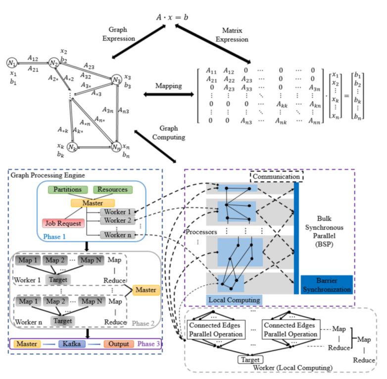

Fig. 1. Mapping between graph computation and matrix computation.  

## Node-Based Graph Computing and Its Applications in Power Systems  

In node-based graph computing, computation at each node is independent of any other, meaning that local computations can be performed simultaneously. `Fig. 1` depicts the mapping between graph computation and matrix computation, as well as the bulk synchronous parallel (BSP) based graph computing strategy. In the upper half of Fig. 1, it first shows that the edge connections correspond to non-zeros in matrix A's off-diagonal elements, and a diagonal element in matrix A denotes a node in the graph. Then, the matrix computation is mapped to graph computing. Taking `Fig. 1` as an example, since it is known that only non-zero elements in matrix A have counterparts in the graph and since zero components indicate no direct connection between corresponding nodes, the multiplication of each row vector of A and vector x is locally calculated at the corresponding node. Then, using node-based graph computing, the matrix multiplication is decomposed to multiplications of each row vector of A and vector x, having the potential of parallelism. The implementation of node-based graph computing is elaborated in the bottom half of `Fig. 1`. It shows the workflow of a graphprocessing engine, which is built based on BSP `[21]`. At first, the graph is stored in segments, each segment consists of a set of nodes and those nodes’ outgoing edges. Then, the master thread assigns segments to the worker thread per the CPU’s resources. Within each worker, the local computation is conducted using MapReduce `[22]`. After the local computation, the worker communicates and synchronizes with the others. Finally, the results are sent back to the master thread for final processing. In power systems, two examples of nodebased graph computing applications are matrix formulation and power flow calculation `[23], [24]`.  

# GRAPH COMPUTING-BASED WLS FAST DECOUPLED STATE ESTIMATION【III】

## WLS Fast Decoupled State Estimation  

For an $n$-bus power system with $m$ measurements, its nonlinear WLS SE problem is formulated as `[25]`:  
$$
\min J(x)=[z-\boldsymbol{h}(\boldsymbol{x})]^{T} \boldsymbol{R}^{-1}[z-\boldsymbol{h}(\boldsymbol{x})]  \tag{1}
$$
where $z$ is in the dimension of $m$; $x$ is in the dimension of $2n-1$; $h$ is the nonlinear function of $x$, which relates the system states to the error-free measurements; and $R^{-1}$ is a diagonal matrix, consisting of the weight, $\frac {1}{σj^2} $ , for each measurement $j$.   

To achieve the minimum of $J(x)$, the equation below is derived:  
$$
\boldsymbol{g}(\boldsymbol{x})=\frac{\partial J(\boldsymbol{x})}{\partial \boldsymbol{x}}=-\boldsymbol{H}^{T}(\boldsymbol{x}) \boldsymbol{R}^{-1} \boldsymbol{r}(\boldsymbol{x})=0  \tag{2}
$$
where $H(x) = \frac {∂h(x)}{∂x}$, and $r(x) = z - h(x)$.  

Substituting the first-order Taylor expansion of $g(x)$ in (2), the solution of the objective function can be found by iteratively solving (3)  .
$$
\boldsymbol{G}\left(\boldsymbol{x}^{k}\right) \Delta \boldsymbol{x}^{k}=\boldsymbol{H}^{T}\left(x^{k}\right) \boldsymbol{R}^{-1} r\left(x^{k}\right)  \tag{3}
$$
where $G(x^{k})=\frac{\partial g(x^{k})}{\partial x} = H^{T}(x^{k})R^{-1}H(x^{k})$,  $x^{k+1} = x^k + \Delta x^k$, and $x^k$ is a vector of system states at iteration $k$.

Assuming a high $R/X$ ratio in power transmission systems, the fast decoupled method is employed to convert the $H$ matrix and gain matrix in (3) to constant matrices, thus saving time on repetitive matrix formulation and factorization `[26]`. Besides, in (4) and (5), the numerical values corresponding to the offdiagonal blocks of matrix $H$, and consequently those of gain matrix, are significantly smaller than those of the diagonal blocks, so the non-diagonal blocks are neglected. The subscripts A and R denote the corresponding active and reactive components, respectively.
$$
\boldsymbol{H}=\left[\begin{array}{ll}
\boldsymbol{H}_{A A} & \boldsymbol{H}_{A R} \\
\boldsymbol{H}_{R A} & \boldsymbol{H}_{R R}
\end{array}\right]=\left[\begin{array}{cc}
\boldsymbol{H}_{A A} & \mathbf{0} \\
\mathbf{0} & \boldsymbol{H}_{R R}
\end{array}\right]  \tag{4}
$$

$$
\boldsymbol{G}=\left[\begin{array}{ll}
\boldsymbol{G}_{A A} & \boldsymbol{G}_{A R} \\
\boldsymbol{G}_{R A} & \boldsymbol{G}_{R R}
\end{array}\right]=\left[\begin{array}{cc}
\boldsymbol{H}_{A A}^{T} \boldsymbol{R}_{A A}^{-1} \boldsymbol{H}_{A A} & \mathbf{0} \\
\mathbf{0} & \boldsymbol{H}_{R R}^{T} \boldsymbol{R}_{R R}^{-1} \boldsymbol{H}_{R R}
\end{array}\right]  \tag{5}
$$

where, $R^{-1} = diag(R_{AA}^{-1}, R_{RR}^{-1})$. In (5), $G_{AA} ∈ \mathcal{M}(n-1, n - 1)$, while $G_{RR} ∈ \mathcal{M}(n, n)$. This is because the voltage angle at the swing bus is the reference, so the derivatives of the measurements to the swing bus angle are not included in (4).  

Then, equation (3) is rewritten as:  
$$
\begin{array}{l}
\boldsymbol{G}_{A A} \Delta \boldsymbol{\theta}^{k}=\boldsymbol{H}_{A A}^{T} \boldsymbol{R}_{A A}^{-1} r_{A}\left(\boldsymbol{x}^{k}\right) 
\end{array}  \tag{6-a}
$$

$$
\begin{array}{l}
\boldsymbol{G}_{R R} \Delta|\boldsymbol{V}|^{k}=\boldsymbol{H}_{R R}^{T} \boldsymbol{R}_{R R}^{-1} \boldsymbol{r}_{R}\left(\boldsymbol{x}^{k}\right)
\end{array}  \tag{6-b}
$$

In the fast decoupled SE, the estimations of the voltage angles and magnitudes are decoupled, and the approach for solving the two equations in (6) is the same, e.g., LU factorization plus FBS. Therefore, the remainder of this paper focuses on elaborating how to efficiently estimate voltage angles, in (6-a), using graph computing technology, including matrices formulation and equation solving. Then, the estimation of the voltage magnitudes can be implemented in the same way.  

## WLS Fast Decoupled State Estimation With Graph Computing

**(1) Node-Based Graph Computing—WLS Fast Decoupled State Estimation Problem Formulation**: To realize highperformance power system SE, the node-based graph computing technique is employed to efficiently formulate state estimation problem in the system graph model, including matrices and vectors. The system-level matrices and vectors of the weighted least square state estimation problem are decomposed into n node-based matrices and vectors if assuming the system has n buses. In this way, each node-based matrix/vector can be formulated independently and in parallel with others. Then the system-level state estimation problem could be efficiently built up by assembling these node-based matrices/vectors in parallel. Detailed derivations are elaborated as follows.  

At first, system measurements are collected and assigned into node-based, $i.e.$, bus-based, measurement parts, and measurements in the same part are directly related to the same bus. Thus, each node-based measurement part corresponds to a distinct bus in the power system, and the total number of node-based measurement parts is equal to the number of buses in the power system. For an $n$-bus system, the vector of active system measurements, $zA$, is first reordered by putting each bus’s directly related measurements together as a measurement sub-vector and sorting each sub-vector per bus index. Then $z_A$ is partitioned into $n$ parts, and each partition belongs to a distinct bus. Taking bus i as an example, its active power injection measurement, $P_i$, as well as the active power flow measurement(s) via branch(es) $i-j$ with bus $i$ being the starting end, $P_{ij}$, are gathered to form the $i$th measurement sub-vector, $z_{A,i}$, in $z_A$. The whole process is further presented in (7)-(9). Without loss of generality, it is assumed that the system has $n$ buses. In (7), the system measurement vector, $z_A$, consists of an error-free vector, $h_A(x)$, and an error vector, eA. $z_A$ is partitioned into n parts. $z_{A,i}$ indicates the bus $i’$s measurement sub-vector and, as presented in (8), it includes bus i’s active power injection measurement, $Pi$, and the vector of active branch power flow measurements at bus $i$, $Pij$. $h_{A,i}(x)$ and $e_{A,i}$ indicate the error-free sub-vector and error sub-vector of $z_{A,i}$. The error-free vector is accordingly divided into n parts in (9).  
$$
z_{A}=\boldsymbol{h}_{A}(\boldsymbol{x})+\boldsymbol{e}_{A} \quad \& \quad z_{A}=\left[\begin{array}{llllll}
z_{A, 1}^{T} & z_{A, 2}^{T} & \cdots & z_{A, i}^{T} & \cdots & z_{A, n}^{T}
\end{array}\right]^{T}  \tag{7}
$$

$$
\boldsymbol{z}_{A, i}=\boldsymbol{h}_{A, i}(\boldsymbol{x})+\boldsymbol{e}_{A, i}  \quad \& \quad z_{A,i}=\left[P_{i}\;P_{i j}^{T}\right]^{T},\;\;i=1,\dots,n  \tag{8}
$$

$$
h_{A}(x)=\left[h_{A,1}(x)^{T}h_{A,2}(x)^{T}\cdot\cdot\cdot h_{A,i}(x)^{T}\cdot\cdot\cdot h_{A,n}(x)^{T}\right]^{T} \tag{9}
$$

Based on the knowledge of $H(x) = \frac{∂h(x)}{∂(x)}$, $G_{AA} = H_{AA}^TR_{AA}^{-1}H_{AA}$, and equation (9), the H matrix and gain matrix of bus $i$ are:  
$$
H_{A A,i}=\frac{\partial h_{A,i}(x)}{\partial\theta},\;\;\theta=\left[\theta_{1}\ \theta_{2}\;\cdot\cdot\ \theta_{i}\;\cdot\cdot\ \theta_{n-1}\right] \tag{10}
$$

$$
G_{A A,i}=H_{A A,i}^{T}R_{A A,i}^{-1}H_{A A,i} \tag{11}
$$

where R-1 AA,i is the weight matrix for active power measurements directly related to node i. hA,i(x) only includes active  power measurements directly related to bus i and ∂h∂θ A,ij(x) is an all-zero vector when bus j is neither bus i nor bus i’s 1-step neighboring bus. Thus, in (10), HAA,i only contains information of bus i, bus i’s 1-step neighbor(s) and the branch(es) between them. Then, based on (11), GAA,i only contains information of bus i, bus i’s 1-step neighbor(s) and the branch(es) between them as well. Therefore, in the power system graph model, HAA,i and GAA,i can be locally calculated at bus i with at most one step graph traversal  

The system-level H matrix, HAA, is then formulated with the aggregation of all node-based H matrices, HAA,i, while the system-level gain matrix, GAA, is obtained by summing up the node-based gain matrices, GAA,i. The detailed derivations are presented in (12) and (13), where (12) is derived based on (9) and (10), and (13) is obtained based on (5), (11), and (12).  
$$
\begin{aligned}
H_{A A} &={\frac{\partial h_{A}(x)}{\partial\theta}} \\
&=\frac{\partial[h_{A,1}(x)^{T}h_{A,2}(x)^{T}\cdot\cdot\cdot h_{A,i}(x)^{T}\cdot\cdot\cdot h_{A,n}(x)^{T}]^{T}}{\partial\theta} \\
&= \left[\left(\frac{\partial h_{A,1}(x)}{\partial\theta}\right)^{T}\left(\frac{\partial h_{A,2}^{}(x)}{\partial\theta}\right)^{T} \cdot\cdot\cdot \left(\frac{\partial h_{A,i}(x)}{\partial\theta}\right)^{T}\cdot\cdot\cdot\left(\frac{\partial h_{A,n}(x)}{\partial\theta}\right)^{T} \right]^T \\
&=[H_{A A,1}^{T}H_{A A,2}^{T}\cdot\cdot\cdot H_{A A,i}^{T}\cdot\cdot\cdot H_{A A,n}^{T}]^{T}
\end{aligned} \tag{12}
$$

$$
\begin{aligned}
G_{AA}&=H_{AA}^{T}R_{AA}^{-1}H_{A A} \\
&=\left[H_{A A,1}^{T}H_{A A,2}^{T}\cdot\cdot\cdot H_{A A,i}^{T}\cdot\cdot\cdot H_{A A,n}^{T}\right]\cdot R_{A A}^{-1} \times\left[H_{A A,1}^{T}H_{A A,2}^{T}\cdot\cdot\cdot H_{A A,i}^{T}\cdot\cdot\cdot H_{A A,n}^{T}\right]^{T} \\
&=\sum_{i=1}^{n}H_{A A,i}^{T}\cdot R_{A A,i}^{-1}\cdot H_{A A,i} \\
&=\sum_{i=1}^{n}G_{A A,i}
\end{aligned}  \tag{13}
$$

where, R- AA1 = diag(R- AA1,1, R- AA1,2, . . . , R- AA1,i, . . . , R- AA1,n)  

The system-level RHS vector update in (6) can also be implemented by summing up the node-based RHS vectors, as shown in (14). The update of each node-based RHS vector is locally computed  
$$
\begin{aligned}
RHS&=H_{A A}^{T}R_{A A}^{-1}r_{A}\left(x^{k}\right) \\
&=\left[M_{A A,1}^{T}H_{A A,2}^{T}\cdot\cdot\cdot H_{A A,i}^{T}\cdot\cdot\cdot H_{A A,n}^{T}\right]\cdot R_{A A}^{-1} \times\left[r_{A,1}{\Big(}x^{k}{\Big)}r_{A,2}{\Big(}x^{k}{\Big)}\cdot\cdot\cdot r_{A,i}{\Big(}x^{k}{\Big)}\cdot\cdot\cdot r_{A,n}{\Big(}x^{k}{\Big)}\right] \\
&=\sum_{i=1}^{n}H_{A A,i}^{T}R_{A A,i}^{-1}r_{A,i}\Bigr(x^{k}\Bigr)
\end{aligned}  \tag{14}
$$
(2) Computation Efficiency: The proposed graph computing method divides the whole problem into n independent parts for the parallel implementation. In this subsection, the computation complexity and computation efficiency of the presented method is analyzed and further improved.  

For the convenience of the following topology analysis, the indices of node i and its 1-step neighbors are collected into  a set, αi. For HAA,i in (12), the column indices of its non-zero entries are the elements in the set of αi  
$$
\alpha_{i}:=\left\{j:Y_{i j}\ne 0\right\},\;j=1,2,\ldots,n \tag{15}
$$
βi is a set that includes indices of node i, its 1-step neighbors, and its 2-step neighbors.  
$$
\begin{aligned}
\beta_{i}:&= \left\{j:\,Y_{ij}\not=0\right\}\cup\left\{j:\,d(i,j)=2\right\} \\ 
&=\alpha_{i}\cup\left\{j:d(i,j)=2\right\}
\end{aligned} \tag{16}
$$
Denote the number of branch power flow measurements by nBFM and the number of power injection measurements by nIM. A row vector of HAA corresponding to a branch power flow measurement has 2 non-zero elements. Let di denote the number of degree(s) of node i. A row vector of HAA corresponding to a power injection measurement at node i has 1+di non-zero elements.  

The number of non-zero elements in HAA is therefore  
$$
n z_{H_{A A}}=2n_{B F M}+n_{I M}+\sum_{i\in\gamma}d_{i} \tag{17}
$$
where γ is the set of power injection measured buses.  

The scaled HAA matrix is defined as  
$$
\overline{{{H}}}_{A A}=R_{A A}^{-1/2}H_{A A}^{} \tag{18}
$$
and the scaled active residual vector at iteration k is  
$$
\bar{r}_{A}\Bigl(x^{k}\Bigr)=R_{A A}^{-1/2}r_{A}\Bigl(x^{k}\Bigr) \tag{19}
$$
Then, at iteration k, the RHS vector is given as  
$$
R H S=H_{A A}^{T}R_{A A}^{-1}r_{A}\left(x^{k}\right)=\overline{{{H}}}_{A A}^{T}\bar{r}_{A}\left(x^{k}\right) \tag{20}
$$
The number of floating-point operations (flops) required to form the system-level RHS vector, nflopRHS, is  
$$
nflop_{RHS}=nnz_{H_{AA}} \tag{21}
$$
where nnzHAA indicates the number of non-zero elements in HAA.  

In (14), the system-level RHS vector is the summation of each of node-based RHS vector. After matrix scaling, it becomes  
$$
R H S=\sum_{i=1}^{n}H_{A A,i}^{T}R_{A A,i}^{-1}r_{A,i}\Bigr(x^{k}\Bigr)=\sum_{i=1}^{n}\overline{{{H}}}_{A A,i}^{T}\overline{{{r}}}_{A,i}\Bigr(x^{k}\Bigr) \tag{22}
$$
The number of flops for each node-based RHS vector, nflopRHS,i, is  
$$
nflop_{R H S,i}=n n z H_{A s,i}=2n_{BFM,i}+1+d_{i} \tag{23}
$$
where nnzHAA,i indicates the number of non-zero elements in the bus i’s H matrix, HAA,i, nBFM,i is the number of branch power flow measurements starting from bus i, and di denotes the number of degree(s) of node i  

Different from the RHS vector, the formation of the gain matrix involves the multiplication of the scaled HAA matrix by its transpose:  
$$
G_{A A}=H_{A A}^{T}R_{A A}^{-1}H_{A A}=\overline{{{H}}}_{A A}^{T}\overline{{{H}}}_{A A} \tag{24}
$$
Similar to (12), HAA is written here in terms of its rows:  
$$
\bar{H}_{A A}=\left(
\begin{array}{c}
{{\bar{H}_{A A}(1)}}\\ 
{{\bar{H}_{A A}(2)}}\\ 
\ldots \\
{{\bar{H}_{A A}(m_{i})}}\\ 
\ldots \\
{{\bar{H}_{A A}(m_{A})}}
\end{array}
\right) \tag{25}
$$
where HAA(i) is the ith row vector of HAA in the dimension of (n - 1), and mA is the total number of active power measurements. The product of HT AAHAA can be expressed as a sum of the outer product of the row vectors of HAA.  
$$
\overline{{{H}}}_{A A}^{T}\overline{{{H}}}_{A A}=\sum_{i=1}^{m_{A}}\left(\overline{{{H}}}_{A A}(i)^{T}\overline{{{H}}}_{A A}(i)\right) \tag{26}
$$
For a transmission line power flow measurement, forming HAA(i)THAA(i) requires 4 flops. Also, forming HAA(i)THAA(i) for a power injection measurement at bus i with di connected branches requires (1 + di)2 flops.  

Suppose the active power measurement vector zA contains nBFM branch power flow measurements and nIM power injection measurements, the total number of flops required to form the system-level gain matrix, nflopGain, is  
$$
nflop_{Gain}=4n_{BFM}+\sum_{i\in\gamma}\left(1+d_{i}\right)^{2} \tag{27}
$$
Since the matrix is symmetric and only its upper (lower) triangular part needs to be computed and the number of flops is approximately half of nflopGain.  

In (13), the system-level gain matrix is decomposed into the summation of node-based gain matrices. After matrix scaling, it becomes  
$$
G_{A A}=\sum_{i=1}^{n}H_{A A,i}^{T}R_{A A,i}^{-1}H_{A A,i}=\sum_{i=1}^{n}\overline{{{H}}}_{A A,i}^{T}\overline{{{H}}}_{A A,i} \tag{28}
$$
For each node-based gain matrix, the number of flops, nflopGain,i, is  
$$
nflop_{G a i n.i}=4n_{B F M,i}+(1+d_{i})^{2} \tag{29}
$$
where, nBFM,i is the number of branch power flow measurements starting from bus i, and di denotes the number of degree(s) of node i.  

Since the formulation of each node-based RHS vector and node-based gain matrix, GAA,i, is independent and can be implemented in parallel, the computation efficiency of the node-based graph computing approach is significantly higher than the conventional method, much saving the execution time.  

On the other hand, as mentioned in the previous section, the sparsity of node-based H matrices and gain matrices are inevitably introduced because the derivatives of a node/edge measurement to its indirectly-connected nodes’ states are zero. Therefore, this paper first removes zero elements introduced by indirectly connected nodes in the node-based H matrices to compress the size of the node-based H matrices and gain matrices, and efficiently store them in the graph database. In  other words, each node-based H matrix only stores information from the node itself, its directly-connected nodes, and the edge between them, excluding zero elements introduced by indirectly-connected nodes. Compared with HAA,i, the size of the compressed node-based H matrix, HC AA,i, is reduced to mA,i × ni, eliminating the columns of the indirectly connected nodes. mA,i is the size of zA,i and n i=1 mA,i = mA, indicating mA,i is much smaller than mA. mA is the total number of active power measurements. ni is the size of αi. Then there is no allzero column ever existing in HC AA,i. Regarding the compressed node-based gain matrix, taking node i as an example, its size is reduced from (n - 1) × (n - 1) to ni × ni.  

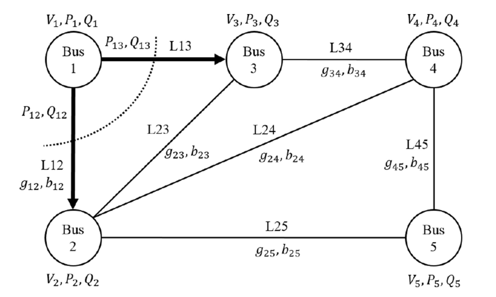

Fig. 2. Graph model of IEEE 5-bus system.  

To illustrate this concept, the IEEE standard 5-bus system in Fig. 2 is taken as an example. The compressed node-based H matrix for node 1 is HC AA,1, as presented in (30-a). It only has non-zero column vectors and its size is 3 × 3. If using the pre-compression node-based H matrix, HAA,1, the size is 3 × 5, as displayed in (30-b), with two all-zero columns highlighted in shading. Additionally, as displayed in (31-a) and (31-b), the size of node 1’s compressed gain matrix is 3 × 3, which is just 36% of the size of node 1’s pre-compression gain matrix whose dimension is 5 × 5. Since the graph model of the IEEE 5-bus system is small and close to a complete graph, its pre-compression node-based gain matrices and H matrices are much denser than those of a large system, whose graph model’s completeness is very low. For this reason, the advantages of compressed node-based matrices would be more evident in large systems.  
$$
{\cal H}_{A A,1}^{C}
=\left[
\begin{array}
{{\frac{\partial P_{1}}{\partial\theta_{1}}}} & {{\frac{\partial P_{1}}{\partial\theta_{2}}}} & {{\frac{\partial P_{1}}{\partial\theta_{3}}}} \\ 
{{\frac{\partial P_{12}}{\partial\theta_{1}}}}&{{\frac{\partial P_{12}}{\partial\theta_{2}}}}&{{\frac{\partial P_{12}}{\partial\theta_{3}}}} \\ 
{{\frac{\partial P_{13}}{\partial\theta_{1}}}}&{{\frac{\partial P_{13}}{\partial\theta_{2}}}}&{{\frac{\partial P_{13}}}}
\end{array}
\right]\in\mathcal{W}(3,3)
$$

$$
{\cal{H}}_{A A,1}=\left[\begin{array}{c c c c}{{{\frac{\partial P_{1}}{\partial\theta_{1}}}}}&{{{\frac{\partial P_{1}}{\partial\theta_{2}}}}}&{{{\frac{\partial P_{1}}{\partial\theta_{2}}}}}&{{{\frac{\partial P_{1}}{\partial\theta_{1}}}}}\\ {{{\frac{\partial P_{1}}{\partial\theta_{1}}}}}&{{{\frac{\partial P_{12}}{\partial\theta_{2}}}}}&{{{\frac{\partial P_{12}}{\partial\theta_{2}}}}}&{{{\frac{\partial P_{12}}{\partial\theta_{3}}}}}\\ {{{\frac{\partial P_{13}}{\partial\theta_{1}}}}}&{{{\frac{\partial P_{13}}{\partial\theta_{2}}}}}&{{{\frac{\partial P_{13}}{\partial\theta_{13}}}}}&{{{\frac{\partial P_{13}}{\partial\partial\partial\theta_{13}}}}}\end{array}\right]\in\-\right]\in\right]\
$$

$$
G_{A,1}^{C}=H_{A,1}^{C}\ ^{T}\cdot R_{A,1}^{-1}\cdot H_{A,1}^{C}\in\mathrm{M}(3,3) \tag{31-a}
$$

$$
G_{A A,1}=H_{A A,1}^{T}\cdot R_{A,1}^{-1}\cdot H_{A A,1}\in\operatorname{W}(5,5) \tag{31-b}
$$

With the size reduction of each node-based H matrix and gain matrix, memory space spent on system graph model storage is much reduced and then the computation efficiency is improved. This is because the created power system  graph model and the graph computing-based state estimation approach are mainly stored and operated in memory to achieve high performance, avoiding disk’s I/O cost. Both of them are sharing the memory. Equation (1) If memory is limited: with non-compressed matrices, a larger graph model would take a larger portion of the memory space during the stage of system graph modeling, even if it could fit into the memory. Then, the following graph computation performance would be limited by the inadequate memory, since the time cost on memory swap and disk I/O is huge. Equation (2) If memory is unlimited: Even though a larger memory space taken by the system graph model would not affect the memory space used for computation, a larger memory space leads to a larger search space and a higher time cost in searching, subsequently affecting the computation speed. Therefore, if we could save more memory space in graph model, then we could obtain a better computation performance. Particularly for the practical provincial, even state-wide, systems, the system level ranges from thousands buses to tens of thousands buses, much larger than the IEEE standard systems, and the node-based H matrices and gain matrices are much more sparse, meaning that, after compression, the percentage of the memory space-saving for each node-based matrix could be much higher. Taking an example of a 1000-bus system, assuming each bus has five directly connected neighboring buses on average, then the dimension of a compressed node-based H matrix is 6×6, while, before compression, the node-based H matrix’s dimension would be 6×1000. The memory space-saving could be as high as 99.4%. For node-based gain matrices, the spacesaving reaches 99.9964%. Therefore, for thousands and tens of thousands of buses, the total memory space-saving is very significant and then help improve computation efficiency  

However, it still has zero entries in HC AA,i. For example, ∂P12 ∂θ3 is 0. In this paper, with the use of a power system graph model, the storage efficiency of HC AA,i is further improved. This is because a graph model only represents objects and their relations, meaning that only non-zero entries in HC AA,i are stored as attributes of nodes/edges in the graph. Taking P12 as an example, since P12 is the active power flow from node 1 to node 2, its derivation to node 3’s state, i.e., ∂∂θ P12 3 , is 0, while its derivations to θ1 and θ2 are saved as H attributes in L12 in Fig. 2. Furthermore, the compressed node-based gain matrix is both full rank and symmetric, so only the upper (lower) triangular elements need to be calculated and stored  

However, although the size of the node-based gain matrix is much reduced after being compressed, the system-level gain matrix formation still has a high time complexity with the aggregation of all compressed node-based matrices, O(n i=1 n2 i ). In the following subsection, graph topology analysis and theoretical derivation are conducted to deeply investigate the locations and values of the non-zero entries in GAA and efficiently formulate the system-level gain matrix with a developed graph-based approach  

(3) Graph-Based Topology Analysis and Derivation: In this paper, the system-level gain matrix is divided into row vectors, and then each row vector is stored as an attribute of the corresponding node, as shown in (32). For example, GAA(i)  represents the ith row vector of the system-level gain matrix, GAA, and it is stored as an attribute of node i. The column indices of non-zero elements in GAA(i) belong to βi, indicating it only includes information of node i, node i’s 1-step neighbor(s) and node i’s 2-step neighbor(s). Additionally, each row vector is stored in the CSR format to efficiently squeeze the storage space [27]. In the following paragraphs, the locations and calculations of the non-zero elements in each row vector are demonstrated  
$$
G_{A A}=\left[G_{A A}(1)^{T}G_{A A}(2)^{T}\cdot\cdot\cdot G_{A A}(i)^{T}\cdot\cdot\cdot G_{A A}(n)^{T}\right]^{T} \tag{32}
$$
As shown in Fig. 3, node i is centered in the system graph model for the convenience of illustration. Its 1-step neighboring nodes are represented as {a1, b1, . . .}, and its 2-step neighboring nodes are signified as {a2, b2, . . .}. The superscripts indicate the shortest distance, i.e., the fewest steps, from the central node to the corresponding node  

According to the previous discussion, since node i is only directly connected to its 1-step neighboring nodes, its compressed H matrix is presented in (33), where HAA,ii = ∂h∂Aθ,ii(x), H AA,ia1 = ∂hA,i(x) ∂θ a1 , and HAA,ib1 = ∂h∂Aθ,i(x) b1 are the column vectors. To simplify the notation, HAA,ii, HAA,ia1, and HAA,ib1 are denoted as Hii, Hia1, and Hib1, respectively.  
$$
\begin{array}{c}
H_{A A,i}^{C}=\left[H_{A A,i i}\quad H_{A A,i a}!\quad H_{A A,i b}!\right]\\ 
=\left[\left.9\right[_{i i}\ \right.\left.9\right[_{i a}!\ \ \right.\right.\right.\Re_{i b}!\right]
\end{array}
$$
The corresponding compressed node-based gain matrix is:
$$
G_{A A,i}^{C}=\left[\begin{array}{l l l}{{\mathcal{N}}}&{{i}}&{{a^{1}}}\\ {{\Re_{i j}^{T}\mathcal{R}_{i}^{-1}\mathfrak{M}_{i i}}}&{{\mathcal{N}_{i i}^{T}\mathcal{R}_{i}^{-1}\mathcal{N}_{i a}!}}&{{\mathcal{N}_{i i}^{T}\mathcal{Q}_{i}^{-1}\mathcal{N}_{i b}!}}\\ {{\mathcal{N}_{i b}^{T}\mathcal{R}_{i}^{-1}\mathcal{N}_{i a}!}}&{{\mathcal{N}_{i b}^{T}\mathcal{R}_{i}^{-1}\mathcal{N}_{i a}!}}\\ {{\mathcal{N}_{i b}^{I}\mathcal{R}_{i}^{-1}\mathcal{N}_{i a}^{-1}\mathcal{N}_{i a}^{-1}\mathcal{N}_{i a}^{-1}\mathcal{N}_{i b}^{-1}\mathcal{1}\frac{N}\mathcal{N}_{i b}^{-1}\mathcal{N}_{M}^{M}\end{array}\right]\begin{array}
$$
In (34), R- i 1 is a simplified notation for R- AA1,i. The rightmost column outside the matrix indicates the row indices in the system-level gain matrix, and the row above the matrix denotes the column indices in the system-level gain matrix. For example, the first-row vector of GC AA,i is a part of the ith row vector in GAA, and it contributes to elements with column indices of i, a1, b1 in the ith row vector of GAA.  

However, in the system-level gain matrix, the ith row vector, GAA(i), not only includes non-zero entries in the columns of node i and its 1-step neighbors but also has non-zero elements contributed by node i’s 2-step neighbors, as displayed in (35).  
$$
\begin{array}{l}{{G_{A A}(i)}}\\ {{\qquad\left[\begin{array}{c}{{\Re_{i i}^{T}{\cal R}_{i}^{-1}{\bf y}\Gamma_{i i}+\mathcal{Y}_{i i}^{T}{\cal R}_{a}^{-1}{\bf y}\Gamma_{a}{\bf i}+\mathcal{Y}_{b i}^{T}{\cal R}_{b}^{-1}{\bf y}\Gamma_{b}{\bf k}_{b}{\bf l}_{i}}\right.}}\\ {{\qquad\left.\begin{array}{c}{{\mathfrak{J}\Gamma_{i i}^{T}{\cal R}_{i}^{-1}{\bf y}\Gamma_{a}{\bf l}^{-1}{\bf y}\Gamma_{a}{\bf q}^{1}+\mathcal{Y}_{b i}^{T}{\bf k}_{b}^{-1}{\bf y}_{b}^{-1}{\bf y}\Gamma_{b}^{-1}{\bf k}_{b}^{\bf l}^{1}}{\bf y}_{b}^{1}_{\bf}}\right]}}\\ {{\left.\frac{T}{i}{T}{\widetilde{a}^{i}^{-1}{T}^{\right.\right]}^{i}{a}\frac{T}{-1}{a}\widetilde{\frac{\frac{b}{\bf\mathcal{\bf J}^{\Gamma}_{\bf N}{\frac{a}}{a^{-\frac{\Gamma}}}\end{array}
$$
This is because node i and its 2-step neighbors are one step away from their mutual 1-step neighbors. For example, as shown in Fig. 3, a1 and a2 are node i’s 1-step and 2-step neighbors, and a1 is located between node i and a2. So, in node a1’s  

compressed H matrix, HAA C ,a1, ∂∂θ Pai1 exists in Ha1i, and ∂∂θ Paa21 is an element in H a1a2; both are non-zero. Then, when forming the system gain matrix, the element of HT a1iR- a11Ha1a2 sits in the ith row and a2th column, showing that node a2, as the 2-step neighboring node of node i, makes a contribution to the non-zero element at the crossing of ith row and a2th column. Similarly, node i also contributes a non-zero component to the element at the crossing of a2th row and ith column. Therefore, the following lemmas are derived:  

Lemma 1: For node i, only itself, its 1-step neighboring nodes, and the edges between them provide non-zero entries in column i of the system H matrix, HAA.  

Lemma 2: For node i, the node itself, its 1-step neighboring nodes, its 2-step neighboring nodes, and the edges between them contribute to the non-zero entries in row i of the system gain matrix, GAA.  

In (35), the non-zero entries in GAA(i) can be categorized into three sets: diagonal entry= {GAA(i, i)}, 1- step entry= {GAA(i, a1), GAA(i, b1), · · · }, and 2-step entry= {GAA(i, a2), GAA(i, b2), · · · }. The detailed illustrations using the graph model are presented in Fig. 4–Fig. 6. As displayed in (35), the value of the diagonal entry, e.g., GAA(i, i), is determined by the node itself, its 1-step neighbors, and the connections between the node and its 1-step neighbors. In Fig. 4, the diagram also shows that Hii, Ha1i, Hb1i and the corresponding weights at nodes i, a1, and b1 determine  GAA(i, i). In addition, it can be found that node i, its 1-step neighbors, and the paths having, at most, two steps between node i and its 1-step neighboring nodes make contributions to the corresponding elements in node i’s 1-step entry. For example, in Fig. 5, node a1 is node i’s 1-step neighbor. The highlighted lines are the 1-step and 2-step paths between node i and a1, and they make contributions to GAA(i, a1). This is also presented in the a1th element of (35). Similarly, elements in node i’s 2-step entry are determined by the 2-step paths between node i and its 2-step neighbors. In Fig. 6, a2 is a 2-step neighbor of node i. Node i can travel through the two highlighted lines to a2. So, GAA(i, a2) has information about these two paths, as shown in (35).  

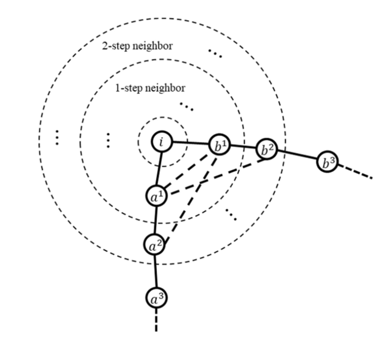

Fig. 3. A generalized structure of node-i-centered system graph.  

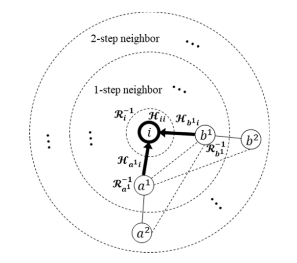

Fig. 4. Diagonal entry (taking node i as an example).  

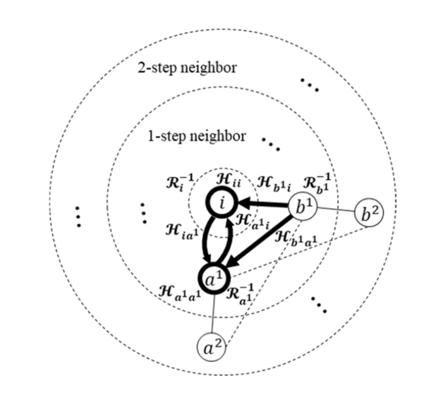

Fig. 5. 1-step entry (taking node a1 as an example)  

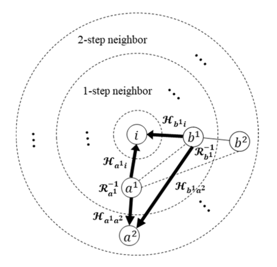

Fig. 6. 2-step entry (taking node a2 as an example).  

Based on the above derivations and illustrations, if a graph database is utilized for such a computation, only a 2-step graph operation is needed. Each row vector in the system-level gain matrix is locally developed, and it is stored as an attribute of each node. Then the system-level gain matrix is built in parallel by getting these row vectors directly from each node.  

Based on (35), the ith row of the system-level gain matrix are sourced from the ith rows of the compressed node-based gain matrices of i, a1, and b1, as presented in (36)-(38)  
$$
G_{A A,i}^{C}(i)=\left[\begin{array}{c}{{(\sum B_{i}^{1})^{2}\Re_{i i}^{-1}+(B_{i a}!)^{2}\Re_{i a}^{-1}+(B_{i b}!)^{2}\Re_{i b}^{-1}}}\\ {{-B_{i a}!\Big(\Big(\sum B_{i}^{1}\Big)\mathcal{R}_{i i}^{-1}+B_{i a}!\mathcal{R}_{i b}^{-1}\Big)}}\\ {{-B_{i b}!\Big((\sum B_{i}^{1})\Re_{i i}^{-1}+B_{i b}!\mathcal{R}_{i b}^{-1}\Big)}}\end{array}\right] \tag{36}
$$
TABLE I  TEST ENVIRONMENT  

|      |      |
| ---- | ---- |
|      |      |
|      |      |
|      |      |
|      |      |
|      |      |

**Procedure 1** Graph Computing-Based WLS Fast Decoupled State Estimation Procedure  

> \1. Start: set iteration index k = 0,and initialize the system
> state vector x0, including θ 0 and |V|0;
> \2. Formulate gain matrices, GAA and GRR, based on node-based
> graph computing;
> \3. LU Factorize GAA and GRR;
> \4. Update RHS vector with node-based graph computing;
> \5. Solve θ k, and update θ k+1 = θ k + θ k;
> \6. Check convergence: θ k∞ ≤ θ and |V|k-1∞ ≤ V?
> If yes, output θ k+1 and |V|k; If no, go to step 7;
> \7. Update RHS vector with node-based graph computing;
> \8. Solve |V|k, and update|V|k+1 = |V|k + |V|k;
> \9. Check convergence: θ k∞ ≤ θ and |V|k∞ ≤ V? If
> yes, output θ k+1 and |V|k+1; If no, k = k + 1, go to step 4.  

$$
G_{A A,a}^{C}(i)=\left[\begin{array}{c}{{{\displaystyle(B_{a}1i)}^{2}\left(\vartheta_{a}^{-1}+\vartheta_{a}^{-1}\right)}}\\ {{{\displaystyle B_{a}1\displaystyle(B_{a}^{1})}\vartheta_{a}^{-1}\displaystyle(1+B_{a}^{-1}\right)}}\\ {{{\displaystyle B_{a}1\displaystyle B_{a}1\displaystyle B_{a}^{1}\displaystyle B_{a}^{-1}\displaystyle A^{-1}}}\end{array}\right]^{T}
$$

$$
G_{A A,b^{1}}^{C}(i)=\left[\begin{array}{c}{{{}}}\\ {{{}}}\\ {{{}}}\\ {{{B_{b^{1}}i}{B_{b^{1}}}}}\\ {{{}}}\end{array}{B_{b^{1}}i}{B_{b^{1}}}\Pi^{-1}\partial_{b^{1}}^{-1}b^{1}i}\right)^{\left[\begin{array}{c}{{\strut}}\\ {{\strut}}\\ {{\strut}}\\ {{{}}}\\ {{{}}}\\ {{{}}}\\ {{{}}}\\ {{{}}}\\ {{{B_{b^{1}}}}}\end{array}\right]^{T}\qquad}
$$

where  B1 i ,  B1 a1,  B1 b1 is the total susceptance of

branches that are directly connected to node i, a1, b1, meaning the total susceptance between node i and its 1-step neigh bors(s), Bia1, Bib1, Ba1i, Bb1i, Ba1b1, Ba1a2, Ba1b2, Bb1a1, Bb1a2, B b1b2 are branch susceptances

(4) Problem-Solving: After advancing the problem formu lation with node-based graph computing, a developed graph computing-based high-performance solver is employed to effi ciently factorize the system-level gain matrix and iteratively update the system states via FBS. The solver was constructed in our previous work using the NICSLU package [20], [28], and is not the main contribution of this paper

To summarize the above-elaborated process, the procedure for the proposed graph computing-based WLS fast decoupled SE is presented in Procedure 1.

TABLE II STATE ESTIMATION PERFORMANCE AND ACCURACY IN DIFFERENT SYSTEMS  

|      |      |      |      |
| ---- | ---- | ---- | ---- |
|      |      |      |      |
|      |      |      |      |
|      |      |      |      |
|      |      |      |      |
|      |      |      |      |
|      |      |      |      |
|      |      |      |      |
|      |      |      |      |

# CASE STUDY【IV】

In this section, the feasibility and computational efficiency of the proposed method are verified and tested. The testing environment is detailed in Table I.  

In this section, seven cases, ranging from IEEE standard systems to practical systems and their extended systems, are used for algorithm verification and performance testing. IEEE standard systems include IEEE 14-bus system and IEEE 118-bus system. Practical systems are two Polish systems, case2383wp, and case2746wp, obtained from MATPOWER and a 2433-bus system, Sichuan-2433, in China. The case2383wp represents the Polish 400, 220 and 110 kV network during winter 1999-2000, case2746wp represents the Polish 400, 220 and 110 kV network during winter 2003- 2004 evening peak hours. The Polish 400, 220 and 110 kV network is a part of the 7500+ bus European UCTE system, and Sichuan-2433 system is a provincial grid including 500, 220, 110 kV and partial 35 kV network during summer 2018. One of the two extended systems, MP-10790 [29], is composed of two Polish systems, case2383wp and case3012wp, from MATPOWER, i.e., case2383wp × 2 + case3012wp × 2. The other one, IEEE 118-bus*120 system is created by interconnecting 120 IEEE 118-bus systems. Between every two 118-bus systems, there is a tie line connection between bus 69 in each system.  

At first, all seven cases are used for algorithm verification. The convergence tolerances for both the voltage magnitude and the phase angle (in radian) are 1.0E-4. The testing is based on flat-start, and the results, including the number of iterations and estimation accuracy, are displayed in Table II, showing good performance in convergence and accuracy. Regarding the true values of system states used in mean squared error calculation, all cases except Sichuan-2433 provide their true system states in the data files, which are calculated based on the conventional state estimation method. For Sichuan- 2433 system, it is a practical provincial system. Its true system states were obtained from the commercial EMS state estima tor in Sichuan Power Company’s control center. The system states are estimated based on the SCADA measurements.

The performance evaluations of the proposed method using case2383wp, Sichuan-2433, case2746wp, MP-10790, and IEEE 118-bus*120 systems are analyzed and presented as follows, including parallelism testing and the performance comparison with a commercial EMS – D5000.

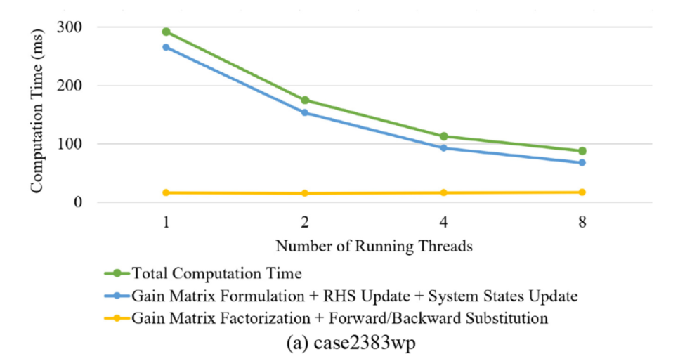

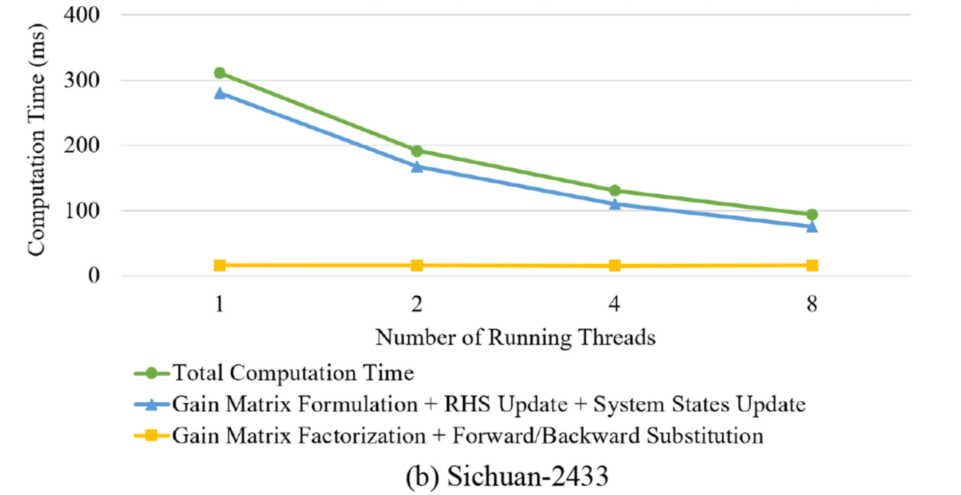

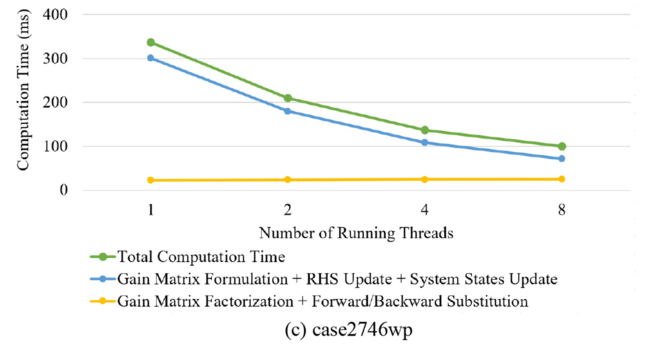

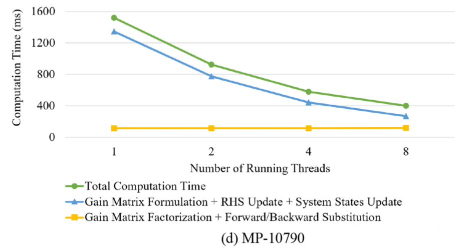

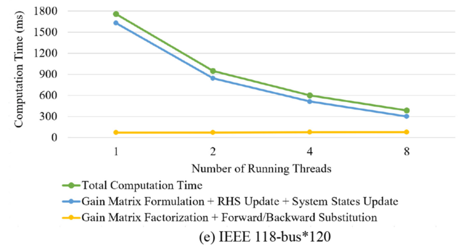

Fig. 7. Computation performance.  

For parallelism testing, Table III–VII, as well as Fig. 7, present these cases’ computation time in multiple threads. The total time is decomposed to display the individual time  consumption in gain matrix formulation, gain matrix factorization, RHS vector update, FBS, and system states update. It can be seen clearly that the time costs of gain matrix formulation, RHS vector update, and system states update, i.e., SE problem formulation and update part, are reduced with an increase of running threads, while the time consumption of both gain matrix factorization and FBS, i.e., SE equation solving part, are kept stable. The speedup from the usage of 1 thread to 8 threads is also calculated and given in Table III–VII to demonstrate the parallelism. Considering the time spent on communication, resource management, and data segmentation, it shows good performance and significant improvement [30]. To further exhibit the high computation performance of the proposed method, it was tested at the control center of the State Grid Sichuan Electric Power Corporation. The performance comparison with the state estimator in the Sichuan power grid EMS – D5000 system is illustrated in Fig. 8. The speedup of the total computation time is 13.96, and the speedup of  gain matrix formulation, gain matrix factorization, RHS vector update and FBS are 24.57, 25.31, 7.13 and 6.71, respectively.  

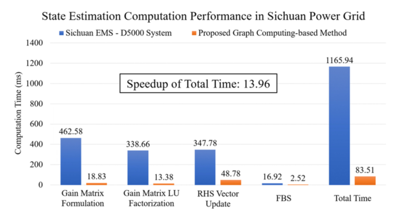

Fig. 8. State estimation computation performance comparison between the Sichuan EMS – D5000 system and the proposed graph computing-based method.  

TABLE III  PARALLELISM TESTING OF THE CASE2383WP CASE  

|      |      |      |      |      |      |
| ---- | ---- | ---- | ---- | ---- | ---- |
|      |      |      |      |      |      |
|      |      |      |      |      |      |
|      |      |      |      |      |      |
|      |      |      |      |      |      |
|      |      |      |      |      |      |
|      |      |      |      |      |      |

TABLE IV PARALLELISM TESTING OF THE SICHUAN-2433 CASE  

|      |      |      |      |      |      |
| ---- | ---- | ---- | ---- | ---- | ---- |
|      |      |      |      |      |      |
|      |      |      |      |      |      |
|      |      |      |      |      |      |
|      |      |      |      |      |      |
|      |      |      |      |      |      |
|      |      |      |      |      |      |

TABLE V PARALLELISM TESTING OF THE CASE2746WP CASE  

|      |      |      |      |      |      |
| ---- | ---- | ---- | ---- | ---- | ---- |
|      |      |      |      |      |      |
|      |      |      |      |      |      |
|      |      |      |      |      |      |
|      |      |      |      |      |      |
|      |      |      |      |      |      |
|      |      |      |      |      |      |

TABLE VI PARALLELISM TESTING OF THE MP-10790 CASE  

|      |      |      |      |      |      |
| ---- | ---- | ---- | ---- | ---- | ---- |
|      |      |      |      |      |      |
|      |      |      |      |      |      |
|      |      |      |      |      |      |
|      |      |      |      |      |      |
|      |      |      |      |      |      |
|      |      |      |      |      |      |

TABLE VII PARALLELISM TESTING OF THE IEEE 118-BUS*120 CASE  

|      |      |      |      |      |      |
| ---- | ---- | ---- | ---- | ---- | ---- |
|      |      |      |      |      |      |
|      |      |      |      |      |      |
|      |      |      |      |      |      |
|      |      |      |      |      |      |
|      |      |      |      |      |      |
|      |      |      |      |      |      |

# CONCLUSION【V】

In this paper, a graph computing-based high-performance WLS fast decoupled SE is presented. Using a graph database, the system measurements are first partitioned and stored in corresponding nodes. Then, the efficient node-based gain matrices, H matrices, and RHS vectors are derived and formulated using node-based graph computing. In addition, to further improve the computational complexity of the systemlevel gain matrix, graph topology analysis is conducted to demonstrate that each row vector of the system gain matrix can be acquired within a 2-step graph traversal and can be stored as an attribute of the corresponding node. Next, each row vector of the system-level gain matrix is obtained locally, and the whole system gain matrix is formulated by aggregating the row vectors in parallel. From the testing results, the proposed method’s accuracy is verified. The computation time of the SE problem formulation and update part is reduced with the increase of the running threads benefiting  from the node-based graph computing. Finally, a comparison with a commercial EMS further illustrates the proposed method’s high-performance  

# REFERENCES  

[1] F. C. Schweppe and J. Wildes, “Power system static-state estimation, part I: Exact model,” IEEE Trans. Power App. Syst., vol. PAS-89, no. 1,pp. 120–125, 1970.

[2] X. Zhang and S. Pekarek, “Multiobjective optimization of multiconductor DC power cables,” in Proc. IEEE Elect. Ship Technol. Symp. (ESTS), Washington, DC, USA, 2019, pp. 1–5.

[3] Y. Tang, C.-W. Ten, C. Wang, and G. Parker, “Extraction of energy information from analog meters using image processing,” IEEE Trans. Smart Grid, vol. 6, no. 4, pp. 2032–2040, Jul. 2015.

[4] C. Yuan and M. S. Illindala, “Economic sizing of distributed energy resources for reliable community microgrids,” in Proc. IEEE Power 
Energy Soc. Gen. Meeting, Chicago, IL, USA, 2017, pp. 1–5.

[5] L. Wei, A. I. Sarwat, W. Saad, and S. Biswas, “Stochastic games for power grid protection against coordinated cyber-physical attacks,” IEEE Trans. Smart Grid, vol. 9, no. 2, pp. 684–694, Mar. 2018.

[6] D. Mao, Z. Gao, and J. Wang, “An integrated algorithm for evaluating plug-in electric vehicle’s impact on the state of power grid assets,” Int. J. Elect. Power Energy Syst., vol. 105, pp. 793–802, Feb. 2019.

[7] J. H. Eto and R. J. Thomas, Computational Needs for the Next Generation Electric Grid, Dept. Energy, Washington, DC, USA, 2011.

[8] C. W. Brice and R. K. Cavin, “Multiprocessor static state estimation,” IEEE Trans. Power App. Syst., vol. PAS-101, no. 2, pp. 302–308,
Feb. 1982.

[9] A. Abur and P. Tapadiya, “Parallel state estimation using multiprocessors,” Elect. Power Syst. Res., vol. 18, no. 1, pp. 67–73, 1990.

[10] G. N. Korres, “A distributed multiarea state estimation,” IEEE Trans. Power Syst. , vol. 26, no. 1, pp. 73–84, Feb. 2011.

[11] L. Xie, D.-H. Choi, S. Kar, and H. V. Poor, “Fully distributed state estimation for wide-area monitoring systems,” IEEE Trans. Smart Grid, vol. 3, no. 3, pp. 1154–1169, Sep. 2012.

[12] S.-Y. Bin and C.-H. Lin, “An implementable distributed state estimator and distributed bad data processing schemes for electric power systems,” IEEE Trans. Power Syst., vol. 9, no. 3, pp. 1277–1284, Aug. 1994.

[13] Y. Liu, W. Jiang, S. Jin, M. Rick, and Y. Chen, “Distributing power grid state estimation on HPC Clusters—A system architecture prototype,” in Proc. 26th IEEE Int. Parallel Distrib. Process. Symp. Workshops Ph.D. Forum, 2012, pp. 1467–1476.

[14] J. B. Carvalho and F. M. Barbosa, “A parallel algorithm to power systems state estimation,” in Proc. Int. Conf. Power Syst. Technol., 1998, pp. 1213–1217.

[15] D. M. Falcao, F. F. Wu, and L. Murphy, “Parallel and distributed state estimation,” IEEE Trans. Power Syst., vol. 10, no. 2, pp. 724–730, 
May 1995.

[16] H. Sasaki, K. Aoki, and R. Yokoyama, “A parallel computation algorithm for static state estimation by means of matrix inversion lemma,” IEEE Power Eng. Rev., vol. PER-7, no. 8, pp. 40–41, Aug. 1987.

[17] Y. Chen, M. Rice, and Z. Huang, “SCADA-rate parallel state estimation assessed with utility data,” in Proc. IEEE Power Energy Soc. Gen. Meeting, 2014, pp. 1–5.

[18] H. Karimipour and V. Dinavahi, “Parallel relaxation-based joint dynamic state estimation of large-scale power systems,” IET Gener. Transm. Distrib., vol. 10, no. 2, pp. 452–459, Feb. 2016.

[19] G. Liu, C. Yuan, X. Chen, J. Wu, R. Dai, and Z. Wang, “A highperformance energy management system based on evolving graph,”
IEEE Trans. Circuits Syst. II, Exp. Briefs, to be published.

[20] J. Shi, G. Liu, R. Dai, J. Wu, C. Yuan, and Z. Wang, “Graph based power flow calculation for energy management system,” in Proc. IEEE Power Energy Soc. Gen. Meeting, Portland, OR, USA, 2018, pp. 1–5.

[21] L. G. Valiant, “A bridging model for parallel computation,” Commun. ACM, vol. 33, no. 8, pp. 103–111, 1990.

[22] J. Dean and S. Ghemawat, “MapReduce: Simplified data processing on large clusters,” Commun. ACM, vol. 51, no. 1, pp. 107–113, 2008.

[23] C. Yuan et al., “Exploration of graph computing in power system state estimation,” in Proc. IEEE Power Energy Soc. Gen. Meeting, Portland, OR, USA, 2018, pp. 1–5.

[24] W. Feng, C. Yuan, R. Dai, G. Liu, and F. Li, “Graph computation based power flow for large-scale AC/DC system,” in Proc. IEEE Int. Conf. Power Syst. Technol. (POWERCON), 2018, pp. 1–8.

[25] A. Abur and A. G. Exposito, Power System State Estimation: Theoryand Implementation. Boca Raton, FL, USA: CRC Press, 2004.   

[26] A. J. Gomez-Exposito, A. Conejo, and C. Canizares, Electric Energy Systems: Analysis and Operation. Boca Raton, FL, USA: CRC Press, 

[27] A. Buluç, J. T. Fineman, M. Frigo, J. R. Gilbert, and C. E. Leiserson, “Parallel sparse matrix-vector and matrix-transpose-vector multiplication using compressed sparse blocks,” in Proc. 21st Annu. Symp. Parallelism Algorithms Architect. ACM., 2009, pp. 233–244. 

[28] X. Chen, Y. Wang, and H. Yang, “NICSLU: An adaptive sparse matrix solver for parallel circuit simulation,” IEEE Trans. Comput.-Aided Design Integr. Circuits Syst., vol. 32, no. 2, pp. 261–274, Feb. 2013. 

[29] X. Li, F. Li, H. Yuan, H. Cui, and Q. Hu, “GPU-based fast decoupled power flow with preconditioned iterative solver and inexact Newton method,” IEEE Trans. Power Syst., vol. 32, no. 4, pp. 2695–2703, Jul. 2017.

[30] O. C. Maquelin, H. H. J. Hum, and G. R. Gao, “Costs and benefits of multithreading with off-the-shelf RISC processors,” in Proc. Eur. Conf. Parallel Process., Aug. 1995, pp. 117–128.  