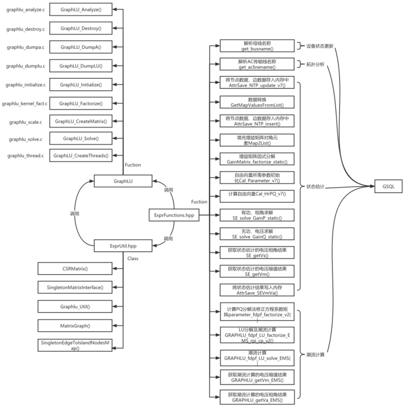

# 整体概览

基于图计算的潮流计算使用的C++文件包括开源的GraphLU以及自定义的ExprFuctions.hpp、ExprUtil.hpp文件，使用到的函数调用关系如下图所示：



其中，GraphLU文件主要是存放LU分解过程函数；

ExprFuctions.hpp用于直接在GSQL查询中调用的函数，如增益矩阵因式分解、状态估计求解、潮流计算求解等；

ExprUtil.hpp包含ExprFunctions.hpp中函数调用的结构或辅助函数，如CSR存储方式定义等。

# C++编译流程

##  环境准备

> 1、 Tigergraph版本：不小于3.1.6，当前使用版本3.1.6
>
> 2、 g++版本：4.8.5
>
> 3、 gcc版本：4.8.5

## GraphLU编译

1、代码目录：/home/tigergraph/ems-query/graphlu_code/graphlu_test

2、编译命令：make -f Makefile

3、输出编译后的文件：/home/tigergraph/ems-query/graphlu_code/graphlu_test/lib/libgraphlu.a

## Makefile

1、文件位置：/home/tigergraph/tigergraph/app/3.1.6/dev/gdk

2、编译命令：make -f MakeUdf

3、输出编译后的文件：/home/tigergraph/tigergraph/app/3.1.6/dev/gdk/bin/release/libudf.so

4、文件内容：

```makefile
#ifndef CFLAGS
#$(error CFLAGS is not set. Please run "make gpe" instead)
#endif

EXECUTABLE=bin/release/libudf.so
SOURCE_MAIN_DIR = src/customer/core_impl/gpe_impl
SOURCE_OTHER_DIR = src/customer/core_impl
SOURCES  = $(wildcard $(SOURCE_MAIN_DIR)/impl_lib.cpp)
SOURCES2 = $(wildcard $(SOURCE_OTHER_DIR)/*.cpp)

CC=g++
LIBB = gsdk/lib/release
LIBINCLUDE = -Isrc
LIBINCLUDE += -Igsdk/include
LIBINCLUDE += -Igsdk/include/thirdparty
LIBINCLUDE += -Igsdk/include/thirdparty/sparsehash
LIBINCLUDE += -Igsdk/include/thirdparty/glog
LIBINCLUDE += -Igsdk/include/thirdparty/jsoncpp
LIBINCLUDE += -Igsdk/include/thirdparty/cereal

# ============ This is for GRAPHLU  ============
LIBINCLUDE += -I/home/tigergraph/ems-query/graphlu_code/graphlu_test/include
LIBINCLUDE += -I/home/tigergraph/ems-query/graphlu_code/graphlu_test/util
## ========================================================================
CFLAGS += -c -Wall -fmessage-length=0
CFLAGS += -Wno-unused -fpermissive -fno-omit-frame-pointer
CFLAGS += -ldl
CFLAGS += -DRELEASE -O3 -DREMOVETESTASSERT
CFLAGS += -D__STDC_FORMAT_MACROS
CFLAGS += -fPIC
CFLAGS += -std=c++11
CFLAGS += $(LIBINCLUDE)
## ============ User modified CFLAGS  ============
CFLAGS += -O2 -Wextra -msse2 -DNO_ATOMIC -DSSE2
### ========================================================================
ifeq (exists, $(shell [ -d /home/tigergraph/tigergraph/app/3.1.6/.syspre ] && echo exists))
  CFLAGS += --sysroot=/home/tigergraph/tigergraph/app/3.1.6/.syspre
  LDFLAGS += --sysroot=/home/tigergraph/tigergraph/app/3.1.6/.syspre
endif
LDFLAGS += -L$(LIBB)
LDFLAGS += -ltigergraph
LDFLAGS += -lpthread -ldl
LDFLAGS += -lboost_chrono
LDFLAGS += -lrt
## ============ This for the library for NISCLU - added by Chen Yuan 03/12/2017 ============
LDFLAGS += -L/home/tigergraph/ems-query/graphlu_code/graphlu_test/lib/
LDFLAGS += -lgraphlu
LDFLAGS += -L/home/tigergraph/ems-query/graphlu_code/graphlu_test/util/
LDFLAGS += -lgraphlu_util -lm
## ========================================================================
ODIR = objs
OBJECTS1  = $(patsubst $(SOURCE_MAIN_DIR)/%.cpp,$(ODIR)/%.o,$(SOURCES))
OBJECTS2 = $(patsubst $(SOURCE_OTHER_DIR)/%.cpp,$(ODIR)/%.o,$(SOURCES2))
OBJECTS = $(OBJECTS1) $(OBJECTS2)
OBJECTS_EXEC = $(OBJECTS)
ifneq "$(wildcard $(ODIR)/querydispatcher.o)" ""
  OBJECTS_EXEC = $(ODIR)/querydispatcher.o  $(OBJECTS)
  CFLAGS += -DRUNQUERY
endif
GQ_OBJ =
ifneq "$(wildcard $(ODIR)/gq_*.o)" ""
  GQ_OBJ = $(ODIR)/gq_*.o
endif
$(ODIR)/%.o: $(SOURCE_MAIN_DIR)/%.cpp
        $(CC) -o $@ $< $(CFLAGS)
$(ODIR)/%.o: $(SOURCE_OTHER_DIR)/%.cpp
        $(CC) -o $@ $< $(CFLAGS)

all: $(SOURCES) $(EXECUTABLE)
$(EXECUTABLE): $(OBJECTS)
        $(CC) -shared -o $@  $(OBJECTS_EXEC) $(GQ_OBJ) $(LDFLAGS)
clean:
        @# querydispatcher.o is NOT compiled by Makefile
        @if ls objs/*.o >/dev/null 2>&1  ; then ls objs/*.o | grep -v querydispatcher.o | grep -v "gq_.*\.o" | xargs rm -f; fi
        @\rm -rf $(EXECUTABLE)
```

## MakeGPEOPT

1、文件位置：/home/tigergraph/tigergraph/app/3.1.6/dev/gdk

2、编译命令：make -f MakeGPEOPT，如果CFLAGS未设置，则执行命令：make gpe

3、输出编译后的文件：/home/tigergraph/tigergraph/app/3.1.6/dev/gdk/bin/release/tg_dbs_gped

4、文件内容：

```makefile
ifndef CFLAGS
$(error CFLAGS is not set. Please run "make gpe" instead)
endif

EXECUTABLE=bin/release/tg_dbs_gped
SOURCE_MAIN_DIR = src/customer/core_impl/gpe_impl
SOURCE_OTHER_DIR = src/customer/core_impl
SOURCES  = $(wildcard $(SOURCE_MAIN_DIR)/*.cpp)
SOURCES2 = $(wildcard $(SOURCE_OTHER_DIR)/*.cpp)

CC=g++
LIBB = gsdk/lib/release
LIBINCLUDE = -Isrc/
LIBINCLUDE += -Igsdk/include
LIBINCLUDE += -Igsdk/include/blue
LIBINCLUDE += -Igsdk/include/thirdparty
LIBINCLUDE += -Igsdk/include/thirdparty/sparsehash
LIBINCLUDE += -Igsdk/include/thirdparty/glog
LIBINCLUDE += -Igsdk/include/thirdparty/jsoncpp
LIBINCLUDE += -Igsdk/include/thirdparty/cereal
LIBINCLUDE += -Igsdk/include/thirdparty/rocksdb

## ============ This is for GRAPHLU =======================================
LIBINCLUDE += -I/home/tigergraph/ems-query/graphlu_code/graphlu_test/include
LIBINCLUDE += -I/home/tigergraph/ems-query/graphlu_code/graphlu_test/util
## ========================================================================

CFLAGS += -c -Wall -fmessage-length=0
CFLAGS += -Wno-unused -fpermissive -fno-omit-frame-pointer
CFLAGS += -ldl
CFLAGS += -DRELEASE -O3
CFLAGS += -D__STDC_FORMAT_MACROS
CFLAGS += -std=c++11
CFLAGS += $(LIBINCLUDE)

## ============ User modified CFLAGS - added by Chen Yuan 03/22/2016 ============
CFLAGS += -O2 -Wextra -msse2 -DNO_ATOMIC -DSSE2
## ========================================================================

ifeq (exists, $(shell [ -d /home/tigergraph/tigergraph/app/3.1.6/.syspre ] && echo exists))
  CFLAGS += --sysroot=/home/tigergraph/tigergraph/app/3.1.6/.syspre
  LDFLAGS += --sysroot=/home/tigergraph/tigergraph/app/3.1.6/.syspre
endif

LDFLAGS += -L$(LIBB)
LDFLAGS += -ltigergraph_static
LDFLAGS += -lgrpc++
LDFLAGS += -lgrpc
LDFLAGS += -lgpr
LDFLAGS += -lprotobuf
LDFLAGS += -lyaml-cpp
LDFLAGS += -lboost_filesystem
LDFLAGS += -lboost_system
LDFLAGS += -lboost_regex
LDFLAGS += -lboost_thread
LDFLAGS += -lboost_chrono
LDFLAGS += -lglog
LDFLAGS += -lzookeeper_mt
LDFLAGS += -lzmq
LDFLAGS += -lrdkafka
LDFLAGS += -lz
LDFLAGS += -lpthread -ldl
LDFLAGS += -lcryptopp
LDFLAGS += -lrt
LDFLAGS += -lrocksdb
# Link some secret symbols in the end if tigergraph_static doesn't have
# Shhhh... I can't tell you here
LDFLAGS += -ltigergraph
## ============ This for the library for NISCLU  ============
LDFLAGS += -L/home/tigergraph/ems-query/graphlu_code/graphlu_test/lib/
LDFLAGS += -lgraphlu
LDFLAGS += -L/home/tigergraph/ems-query/graphlu_code/graphlu_test/util/
LDFLAGS += -lgraphlu_util -lm
## ========================================================================

## ============ This is for the library of Matrix Inverse Function & Chi-Sqaure-Distribution Function  
#LDFLAGS += -linverse
#LDFLAGS += -lchi
##===========================================================================
ODIR = objs
OBJECTS1  = $(patsubst $(SOURCE_MAIN_DIR)/%.cpp,$(ODIR)/%.o,$(SOURCES))
OBJECTS2 = $(patsubst $(SOURCE_OTHER_DIR)/%.cpp,$(ODIR)/%.o,$(SOURCES2))
OBJECTS = $(OBJECTS1) $(OBJECTS2)
OBJECTS_EXEC = $(OBJECTS)
ifneq "$(wildcard $(ODIR)/querydispatcher.o)" ""
  OBJECTS_EXEC = $(ODIR)/querydispatcher.o  $(OBJECTS)
  CFLAGS += -DRUNQUERY
endif

GQ_OBJ =
ifneq "$(wildcard $(ODIR)/gq_*.o)" ""
  GQ_OBJ = $(ODIR)/gq_*.o
endif

$(ODIR)/%.o: $(SOURCE_MAIN_DIR)/%.cpp
        $(CC) -o $@ $< $(CFLAGS)

$(ODIR)/%.o: $(SOURCE_OTHER_DIR)/%.cpp
        $(CC) -o $@ $< $(CFLAGS)

all: $(SOURCES) $(EXECUTABLE)

$(EXECUTABLE): $(OBJECTS)
        $(CC)  -o $@  $(OBJECTS_EXEC) $(GQ_OBJ) $(LDFLAGS)

clean:
        @# querydispatcher.o is NOT compiled by Makefile
        @if ls objs/*.o >/dev/null 2>&1  ; then ls objs/*.o | grep -v querydispatcher.o | grep -v "gq_.*\.o" | xargs rm -f; fi
        @\rm -rf $(EXECUTABLE)
```


## 自定义函数编译

执行以下命令，将自定义C++函数更新到引擎。

1、文件位置：/home/tigergraph/tigergraph/app/3.1.6/dev/gdk/gsql/src/QueryUdf

2、编译命令：输入gsql，执行如下命令：

```shell
# 更新上去
GSQL > PUT ExprFunctions FROM "./ExprFunctions.hpp"
GSQL > PUT ExprUtil FROM "./ExprUtil.hpp"

# 下载下来
GSQL > GET ExprFunctions TO "./ExprFunctions.hpp"
GSQL > GET ExprUtil TO "./ExprUtil.hpp"
```

# C++函数功能

## 设备状态更新

| 序号 | 函数 | 说明                                        | 使用位置 |
| :------------: | :------------: | ------------------------------------------------------ | ------------------ |
| 1              | get_busname    | 拼接设备的所属变电站名称与设备名称，形成新的设备名称。 | CIME_initial.gsql  |

 

## 拓扑分析

| 序号 | 函数 | 说明                             | 使用位置 |
| :------------: | :------------: | ------------------------------------------ | ------------------ |
| 1              | get_aclinename | 解析AC传输线名称，形成新的AC传输线的名称。 | NTP_insert.gsql    |

 

## 状态估计

| 序号 | 函数              | 说明                                               | 使用位置                 |
| :------------: | :-------------------------: | ------------------------------------------------------------ | ---------------------------------- |
| 1              | AttrSave_NTP_update_v7      | 将数据(有功、无功、电压幅值、电压相角等)写入内存。           | NTP_update_init.gsql               |
| 2              | GetMapValuesFromList        | 数据转换，将索引在key_list中的map_accum数据取出来。          | NTP_update_init.gsql               |
| 3              | AttrSave_NTP_insert         | 将节点、支路参数写入内存。                                   | preprocessing.gsql                 |
| 4              | Map2List                    | 分别填充有功增益矩阵【N-1, N-1】、无功增益矩阵【N, N】的对角元素与非对角元素。 | state_estimation_weight_gain.gsql  |
| 5              | GainMatrix_factorize_static | 对有功、无功增益矩阵进行因式分解因子计算，获得LU分解后的上、下三角矩阵。 | state_estimation_weight_gain.gsql  |
| 6              | Cal_Parameter_v7            | 求解自由向量所需的参数初始化。                               | state_estimation_weight_solve.gsql |
| 7              | Cal_HrPQ_v7                 | 通过状态变量和网络参数计算自由向量。                         | state_estimation_weight_solve.gsql |
| 8              | SE_solve_GainP_static       | 有功、相角求解，返回更新后的电压相角以及最大的电压相角变化量。 | state_estimation_weight_solve.gsql |
| 9              | SE_solve_GainQ_static       | 无功、电压求解，返回更新后的电压幅值以及最大的电压幅值变化量。 | state_estimation_weight_solve.gsql |
| 10             | SE_getVs                    | 根据节点id获取状态估计的电压相角结果。                       | state_estimation_weight_solve.gsql |
| 11             | SE_getVm                    | 根据索引获取相应的值。                                       | state_estimation_weight_solve.gsql |
| 12             | AttrSave_SEVmVa             | 将状态估计的电压幅值和电压相角保存至内存。                   | state_estimation_weight_solve.gsql |

 

## 潮流计算

| 序号 | 函数                          | 说明                   | 使用位置 |
| :------------: | :-------------------------------------: | -------------------------------- | ------------------ |
| 1              | parameter_fdpf_factorize_v2             | 计算PQ分解法的修正方程系数矩阵。 | FDPF_EMS.gsql      |
| 2              | GRAPHLU_fdpf_LU_factorize_EMS_rpi_cp_v2 | 系数矩阵LU分解与潮流计算。       | FDPF_EMS.gsql      |
| 3              | GRAPHLU_getVm_EMS                       | 获取潮流计算的电压幅值结果。     | FDPF_EMS.gsql      |
| 4              | GRAPHLU_getVa_EMS                       | 获取潮流计算的电压相角结果。     | FDPF_EMS.gsql      |
| 5              | GRAPHLU_fdpf_LU_solve_EMS               | 潮流计算。                       | FDPF_EMS.gsql      |

 