# 位置类

## ControlArea【地市节点】

```sql
CREATE QUERY Ehe_node(/* Parameters here */) FOR GRAPH graph_guangxi { 
  ListAccum<EDGE>@@listedge;
  node = {ControlArea.*};

  data_sm = select t from node:s -(controlarea_sub:e) - Substation:t where s.name == "河池"
  ACCUM @@listedge += e;
  
  print(data_sm);
  print(@@listedge);
}
```

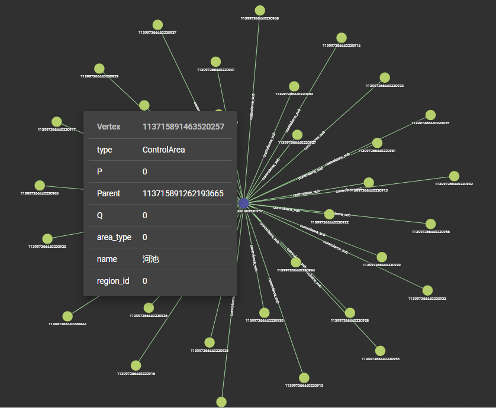

## Latitude【纬度节点】

未用到

## Longitude【经度节点】

未用到

# 电压类

```sql
CREATE QUERY Ehe_node(/* Parameters here */) FOR GRAPH graph_guangxi { 
  ListAccum<EDGE>@@edgeList;
  sub = {Substation.*};
  
  sub_all = select t from sub:s -((sub_stvl|cn_subid|topoid_subid|sub_cn|sub_generatingunit|connected_Sub_Compensator_S|connected_Sub_Aclinedot|connected_Sub_Breaker|connected_Sub_Bus|connected_Sub_Compensator_P|connected_Sub_Disconnector|connected_Sub_GroundDisconnector|connected_Sub_Load|connected_Sub_Trans_two|connected_Sub_Trans_three|connected_Sub_Unit):e) -:t 
  where s.name=="崇左.湖润站";
  
  data_sm = select t from sub_all -(:e)-(SubVL|VoltageLevel|BaseVoltage):t
  ACCUM @@edgeList +=e;
  
  print(data_sm);
  print(@@edgeList);
}
```

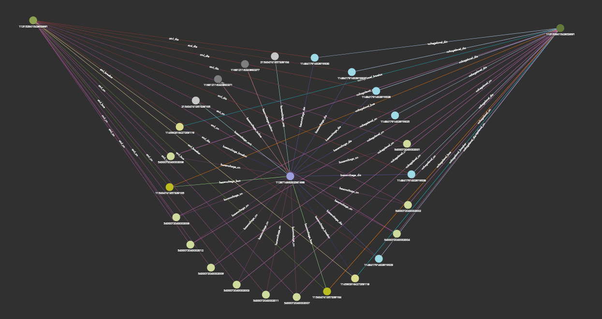

## BaseVoltage【基准电压等级节点】

```sql
CREATE QUERY Ehe_node(/* Parameters here */) FOR GRAPH graph_guangxi { 
  ListAccum<EDGE>@@listedge;
  node = {BaseVoltage.*};

  data_sm = select t from node:s -(:e) - :t where t.Substation == "崇左.湖润站" 
  ACCUM @@listedge += e;
  
  print(data_sm);
  print(@@listedge);
}
```

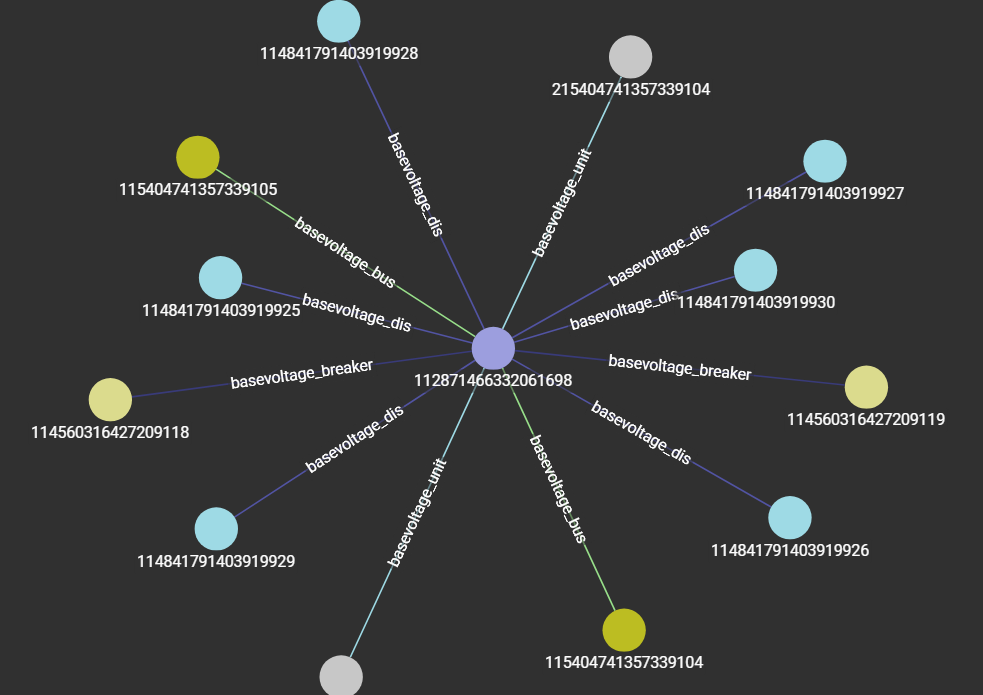

## VoltageLevel【电压等级节点】

```sql
CREATE QUERY Ehe_node(/* Parameters here */) FOR GRAPH graph_guangxi { 
  ListAccum<EDGE>@@listedge;
  node = {VoltageLevel.*};

  data_sm = select t from node:s -(:e) - :t where t.Substation == "崇左.湖润站" 
  ACCUM @@listedge += e;
  
  print(data_sm);
  print(@@listedge);
}
```

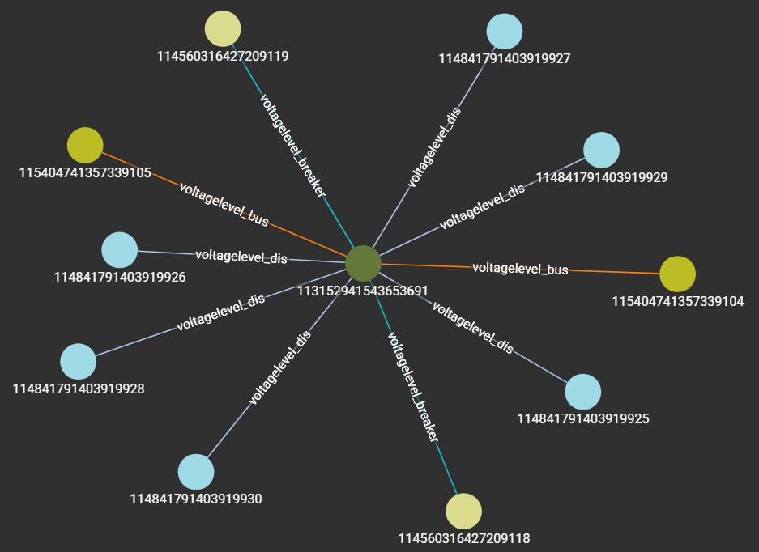

## SubVL【变电站电压等级节点】

```sql
CREATE QUERY Ehe_node(/* Parameters here */) FOR GRAPH graph_guangxi { 
  ListAccum<EDGE>@@listedge;
  node = {SubVL.*};

  data_sm = select t from node:s -(:e) - :t where t.Substation == "崇左.湖润站" 
  ACCUM @@listedge += e;
  
  print(data_sm);
  print(@@listedge);
}
```

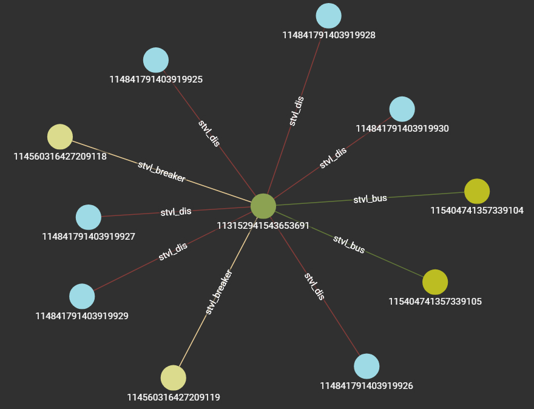

# 厂站类

## Substation【变电站节点】

```sql
CREATE QUERY Ehe_node(/* Parameters here */) FOR GRAPH graph_guangxi { 
  ListAccum<EDGE>@@edgeList;
  sub = {Substation.*};
  
  sub_all = select t from sub:s -((sub_stvl|cn_subid|topoid_subid|sub_cn|sub_generatingunit|connected_Sub_Compensator_S|connected_Sub_Aclinedot|connected_Sub_Breaker|connected_Sub_Bus|connected_Sub_Compensator_P|connected_Sub_Disconnector|connected_Sub_GroundDisconnector|connected_Sub_Load|connected_Sub_Trans_two|connected_Sub_Trans_three|connected_Sub_Unit):e) -:t 
  where s.name=="崇左.湖润站"
  ACCUM @@edgeList +=e;
  
  print(sub_all);
  print(@@edgeList);
}
```

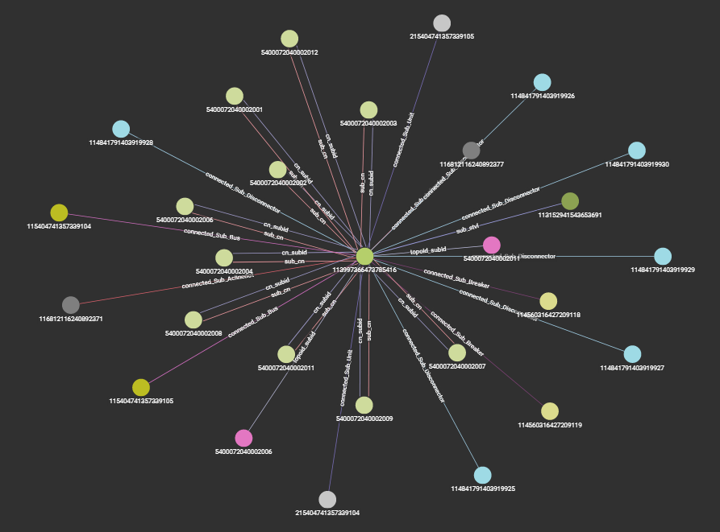

## Bay【间隔节点】

未用到

# 设备类

## unit【发电机节点】

```gsql
CREATE QUERY Ehe_node(/* Parameters here */) FOR GRAPH graph_guangxi { 
  ListAccum<EDGE>@@listedge;
  node = {unit.*};

  data_sm = select t from node:s -(:e) - :t where s.Substation == "崇左.湖润站"
  ACCUM @@listedge += e;
  
  print(data_sm);
  print(@@listedge);
}
```

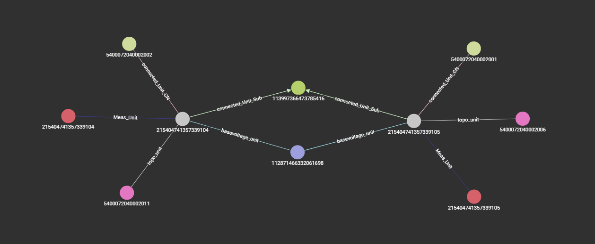

## unit_history【历史发电机节点】

未用到

## BUS【母线节点】

```sql
CREATE QUERY Ehe_node(/* Parameters here */) FOR GRAPH graph_guangxi { 
  ListAccum<EDGE>@@listedge;
  node = {BUS.*};

  data_sm = select t from node:s -(:e) - :t where s.Substation == "崇左.湖润站"
  ACCUM @@listedge += e;
  
  print(data_sm);
  print(@@listedge);
}
```

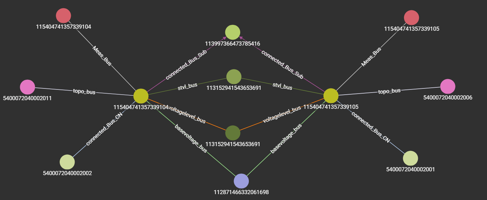

## two_port_transformer【双绕组变压器节点】

```sql
CREATE QUERY Ehe_node(/* Parameters here */) FOR GRAPH graph_guangxi { 
  ListAccum<EDGE>@@listedge;
  node = {two_port_transformer.*};

  data_sm = select t from node:s -(:e) -:t where s.Substation == "太华变电站"
  ACCUM @@listedge += e;
  
  print(data_sm);
  print(@@listedge);
}
```


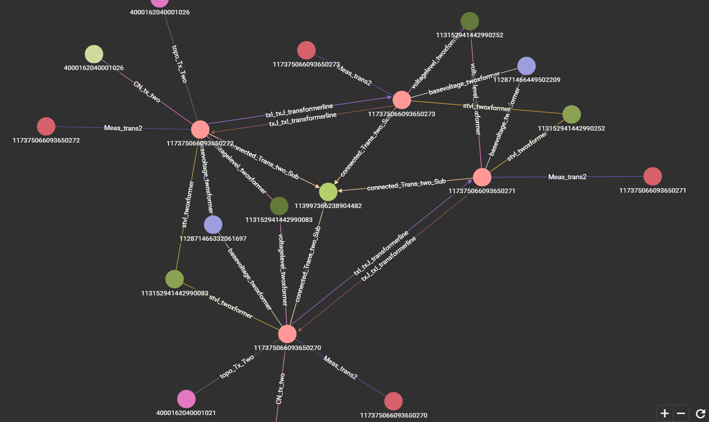


```sql
CREATE QUERY Ehe_node(/* Parameters here */) FOR GRAPH graph_guangxi { 
  ListAccum<EDGE>@@listedge;
  node = {two_port_transformer.*};

  data_sm = select t from node:s -(:e) -:t where s.Substation == "钦州.城郊-黄屋屯站"  
  ACCUM @@listedge += e;
  
  print(data_sm);
  print(@@listedge);
}
```

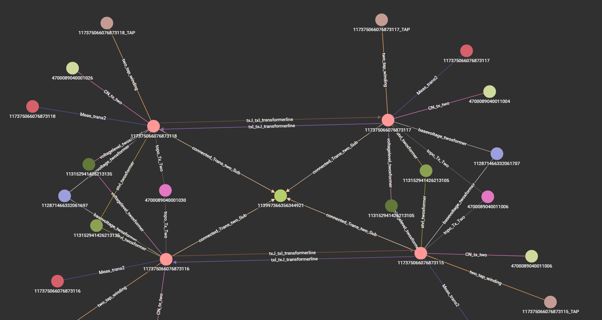

## two_tap_changer【双头分接开关节点】

```sql
CREATE QUERY Ehe_node(/* Parameters here */) FOR GRAPH graph_guangxi { 
  ListAccum<EDGE>@@listedge;
  node = {two_tap_changer.*};

  data_sm = select t from node:s -(:e) -:t where t.Substation == "钦州.城郊-黄屋屯站"  
  ACCUM @@listedge += e;
  
  print(data_sm);
  print(@@listedge);
}
```

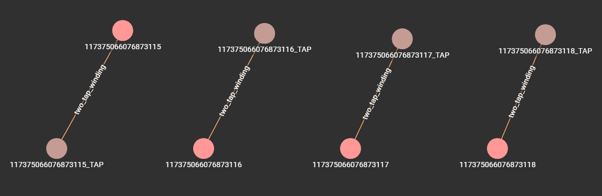

## three_port_transformer【三绕组变压器节点】

```sql
CREATE QUERY Ehe_node(/* Parameters here */) FOR GRAPH graph_guangxi { 
  ListAccum<EDGE>@@listedge;
  node = {three_port_transformer.*};

  data_sm = select s from node:s -(:e) -:t where s.Substation == "静兰变电站"  
  ACCUM @@listedge += e;
  
  print(data_sm);
  print(@@listedge);
}
```

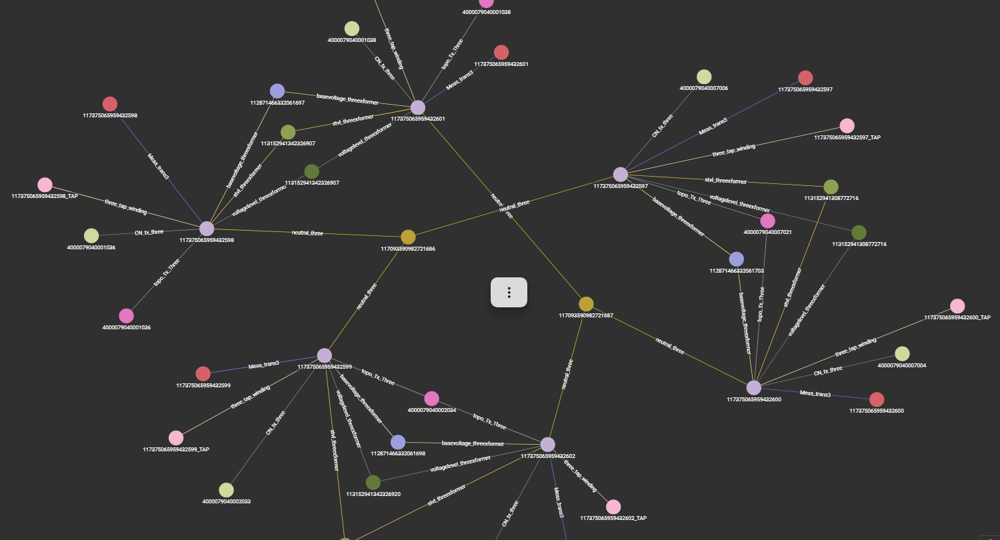

## three_tap_changer【三头分接开关节点】

```sql
CREATE QUERY Ehe_node(/* Parameters here */) FOR GRAPH graph_guangxi { 
  ListAccum<EDGE>@@listedge;
  node = {three_tap_changer.*};

  data_sm = select s from node:s -(:e) -:t where t.Substation == "静兰变电站"  
  ACCUM @@listedge += e;
  
  print(data_sm);
  print(@@listedge);
}
```

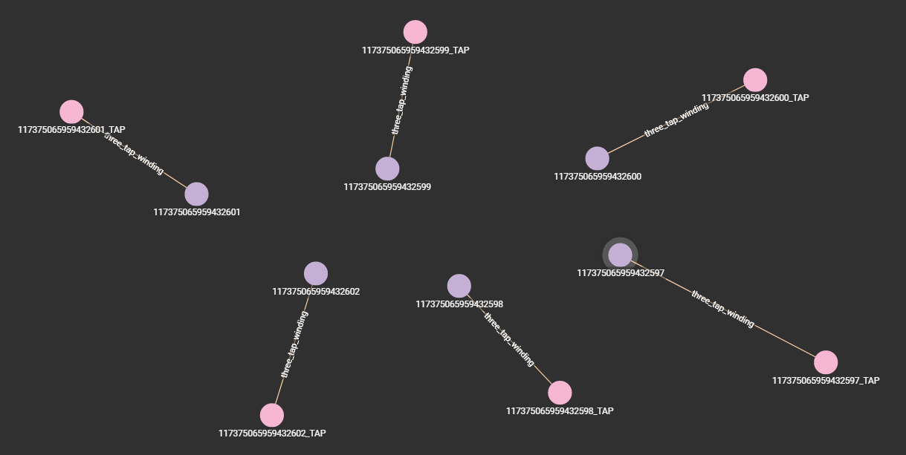

## neutral_point【中性点】

```sql
CREATE QUERY Ehe_node(/* Parameters here */) FOR GRAPH graph_guangxi { 
  ListAccum<EDGE>@@listedge;
  node = {neutral_point.*};

  data_sm = select s from node:s -(:e) -:t where t.Substation == "静兰变电站"  
  ACCUM @@listedge += e;
  
  print(data_sm);
  print(@@listedge);
}
```

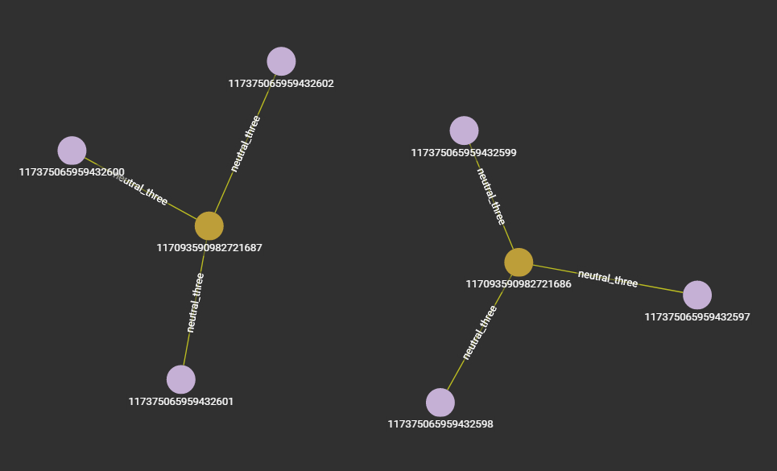

## Disconnector【刀闸节点】

```sql
CREATE QUERY Ehe_node(/* Parameters here */) FOR GRAPH graph_guangxi { 
  ListAccum<EDGE>@@listedge;
  node = {Disconnector.*};

  data_sm = select s from node:s -(:e) -:t where s.Substation == "静兰变电站"  
  ACCUM @@listedge += e;
  
  print(data_sm);
  print(@@listedge);
}
```

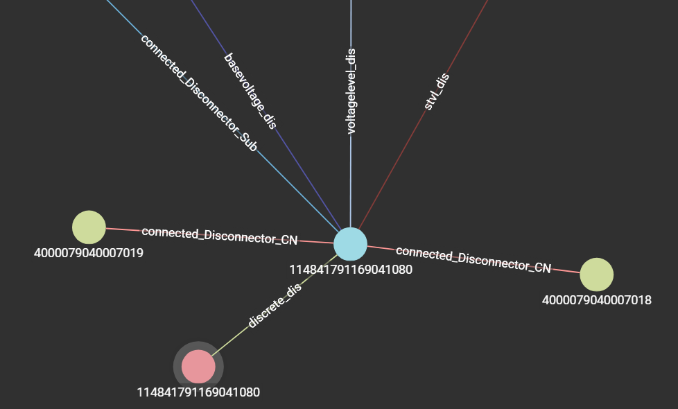

## Breaker【断路器节点】

```sql
CREATE QUERY Ehe_node(/* Parameters here */) FOR GRAPH graph_guangxi { 
  ListAccum<EDGE>@@listedge;
  node = {Breaker.*};

  data_sm = select s from node:s -(:e) -:t where s.Substation == "静兰变电站"  
  ACCUM @@listedge += e;
  
  print(data_sm);
  print(@@listedge);
}
```

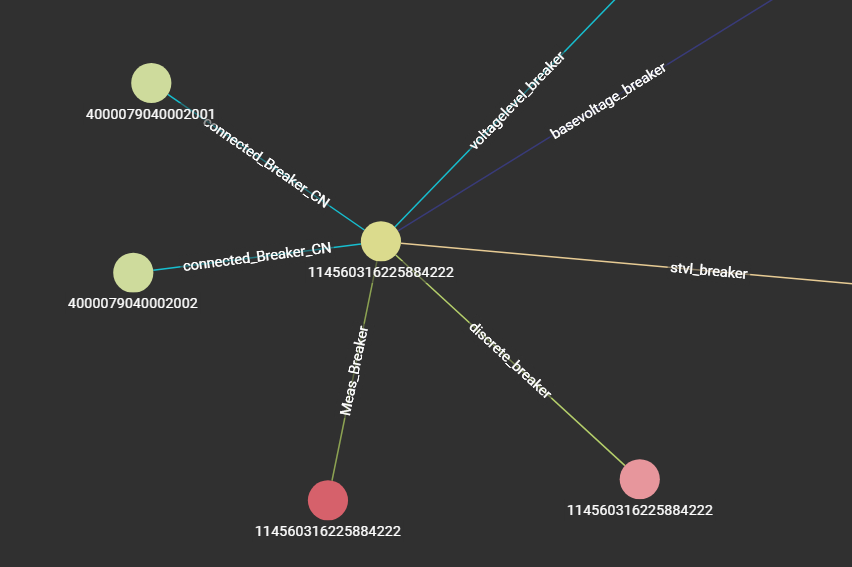

## GroundDisconnector【接地刀闸节点】

```sql
CREATE QUERY Ehe_node(/* Parameters here */) FOR GRAPH graph_guangxi { 
  ListAccum<EDGE>@@listedge;
  node = {GroundDisconnector.*};

  data_sm = select s from node:s -(:e) -:t where s.Substation == "113997366238904553"  
  ACCUM @@listedge += e;
  
  print(data_sm);
  print(@@listedge);
}
```

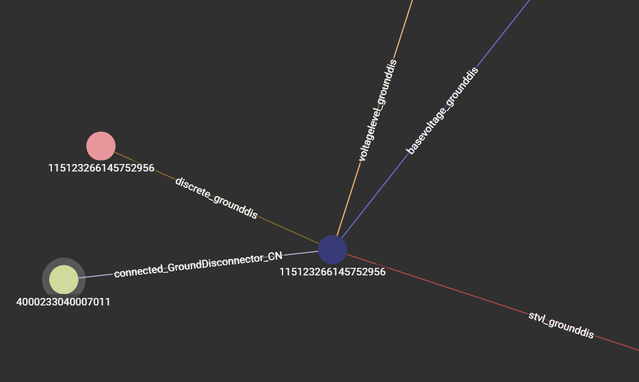

## Convertor【变流器节点】

未用到

## C_P【并联补偿器节点】

```sql
CREATE QUERY Ehe_node(/* Parameters here */) FOR GRAPH graph_guangxi { 
  ListAccum<EDGE>@@listedge;
  node = {C_P.*};

  data_sm = select s from node:s -(:e) -:t where s.Substation == "静兰变电站"  
  ACCUM @@listedge += e;
  
  print(data_sm);
  print(@@listedge);
}
```

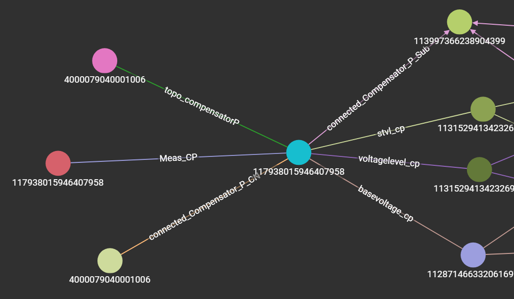

## C_S【串联补偿器节点】

```sql
CREATE QUERY Ehe_node(/* Parameters here */) FOR GRAPH graph_guangxi { 
  ListAccum<EDGE>@@listedge;
  node = {C_S.*};

  data_sm = select s from node:s -(:e) -:t where s.Substation == "百色变电站"  
  ACCUM @@listedge += e;
  
  print(data_sm);
  print(@@listedge);
}
```

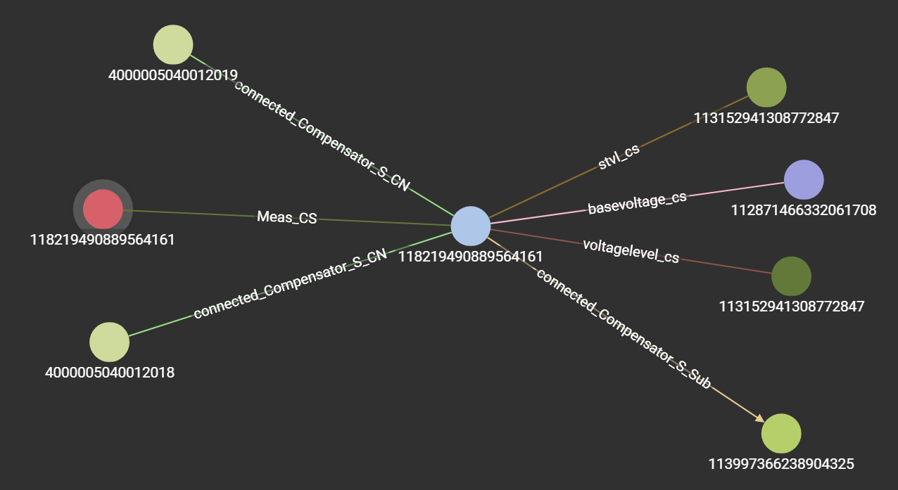

## ACline_dot【交流线路端点节点】

```sql
CREATE QUERY Ehe_node(/* Parameters here */) FOR GRAPH graph_guangxi { 
  ListAccum<EDGE>@@listedge;
  node = {ACline_dot.*};

  data_sm = select s from node:s -(:e) -:t where s.Substation == "113997366473785409"  
  ACCUM @@listedge += e;
  
  print(data_sm);
  print(@@listedge);
}
```

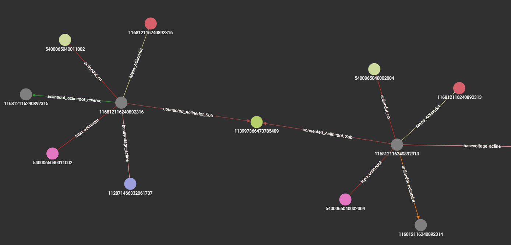

## CN【设备连接节点】

```sql
CREATE QUERY Ehe_node(/* Parameters here */) FOR GRAPH graph_guangxi { 
  ListAccum<EDGE>@@listedge;
  node = {CN.*};

  data_sm = select s from node:s -(:e) -:t where t.Substation == "百色变电站"  
  ACCUM @@listedge += e;
  
  print(data_sm);
  print(@@listedge);
}
```

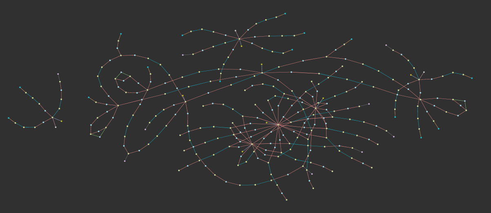

# 负荷类

## l_oad【负荷节点】

```sql
CREATE QUERY Ehe_node(/* Parameters here */) FOR GRAPH graph_guangxi { 
  ListAccum<EDGE>@@listedge;
  node = {l_oad.*};

  data_sm = select s from node:s -(:e) -:t where s.Substation == "崇左.35kV浦寨站"  
  ACCUM @@listedge += e;
  
  print(data_sm);
  print(@@listedge);
}
```

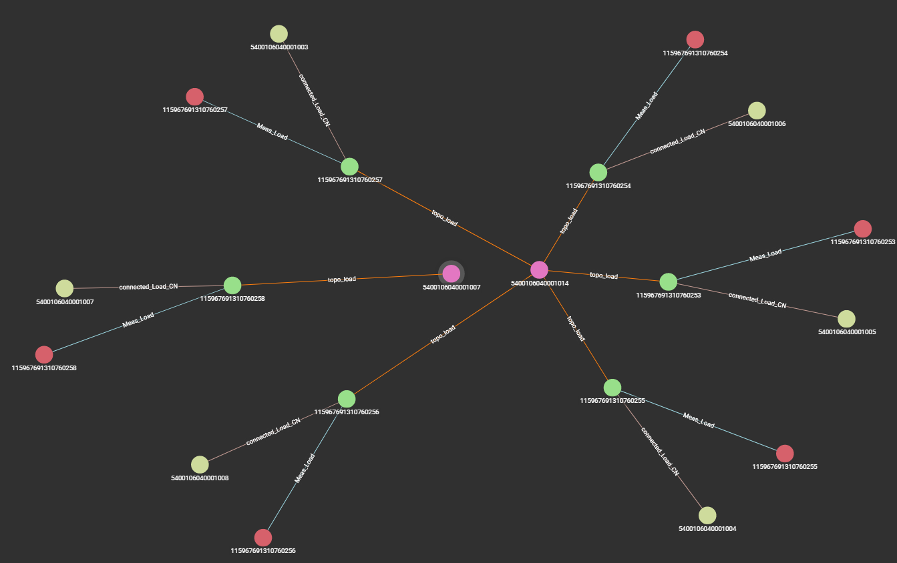

## load_history【历史负荷节点】

未用到

# 计算模型类

## TopoND【电气节点】

```sql
CREATE QUERY Ehe_node(/* Parameters here */) FOR GRAPH graph_guangxi { 
  ListAccum<EDGE>@@listedge;
  node = {TopoND.*};

  data_sm = select s from node:s -(:e) -:t where s.Sub == "百色变电站"  
  ACCUM @@listedge += e;
  
  print(data_sm);
  print(@@listedge);
}
```

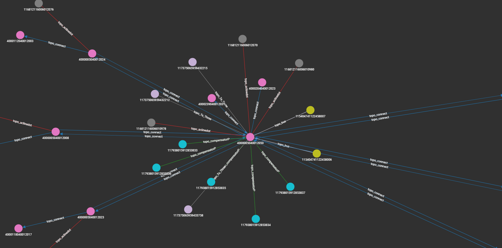

## GeneratingUnit【等值机节点】

```sql
CREATE QUERY Ehe_node(/* Parameters here */) FOR GRAPH graph_guangxi { 
  ListAccum<EDGE>@@listedge;
  node = {GeneratingUnit.*};

  data_sm = select s from node:s -(:e) -:t where t.name == "桂林.110kV虚厂站" 
  ACCUM @@listedge += e;
  
  print(data_sm);
  print(@@listedge);
}
```

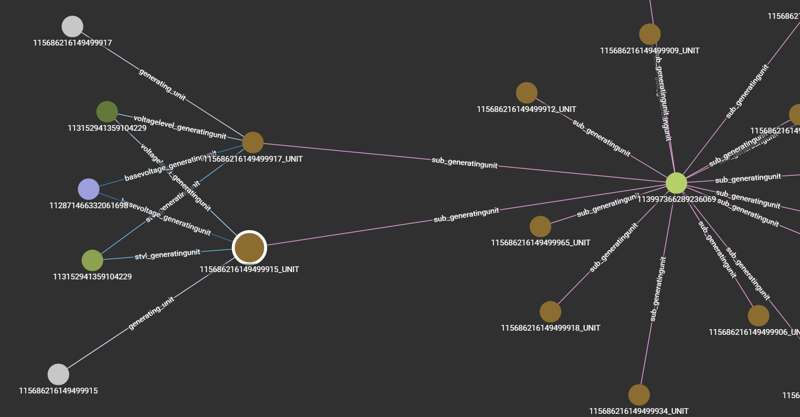

# 属性类

## parameters【参数节点】

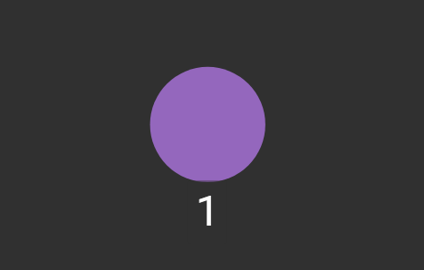

## status【状态节点】


# 量测类

## measure_type【量测类型节点】

```sql
CREATE QUERY Ehe_node(/* Parameters here */) FOR GRAPH graph_guangxi { 
  ListAccum<EDGE>@@listedge;
  node = {measure_type.*};
  data_tmp = select t from node:t limit 10;
  print(data_tmp);
}
```

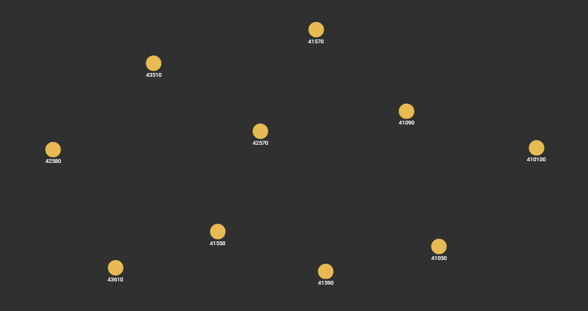

## measurement_point【量测节点】

```sql
CREATE QUERY Ehe_node(/* Parameters here */) FOR GRAPH graph_guangxi { 
  ListAccum<EDGE>@@listedge;
  node = {measurement_point.*};
  data_tmp = select t from node:t limit 10;
  print(data_tmp);
}
```

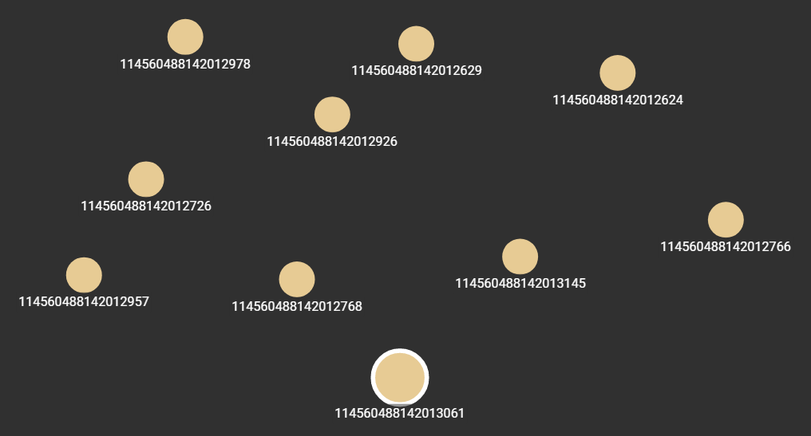

## analog_point【遥测节点】

```sql
CREATE QUERY Ehe_node(/* Parameters here */) FOR GRAPH graph_guangxi { 
  ListAccum<EDGE>@@listedge;
  node = { analog_point.*};
  data_tmp = select t from node:t limit 10;
  print(data_tmp);
}
```

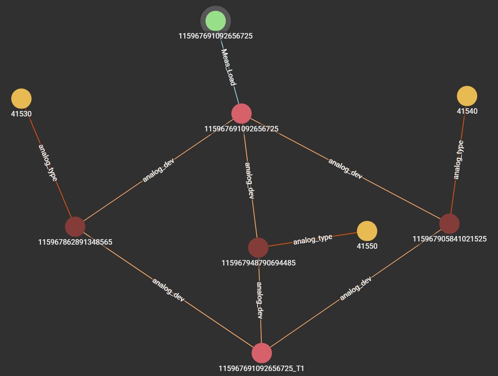

## meas【遥测节点】

同上

## discrete【遥信节点】

同下

## discrete_point【遥信节点】

```sql
CREATE QUERY Ehe_node(/* Parameters here */) FOR GRAPH graph_guangxi { 
  ListAccum<EDGE>@@listedge;
  node = {discrete_point.*};
  data_tmp = select t from node:t limit 10;
  print(data_tmp);
}
```

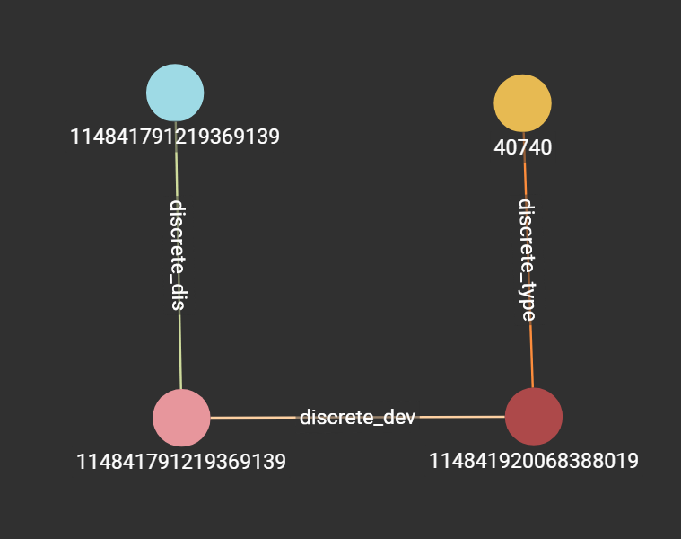

# 其他

## meas_history【历史量测节点】
## maintorg
## powergrid
## gridcom
## dcc
## carbon_history


# 场景

# 查看变电站链接图

