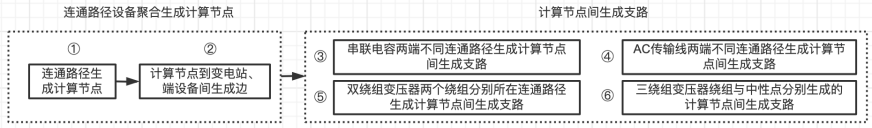
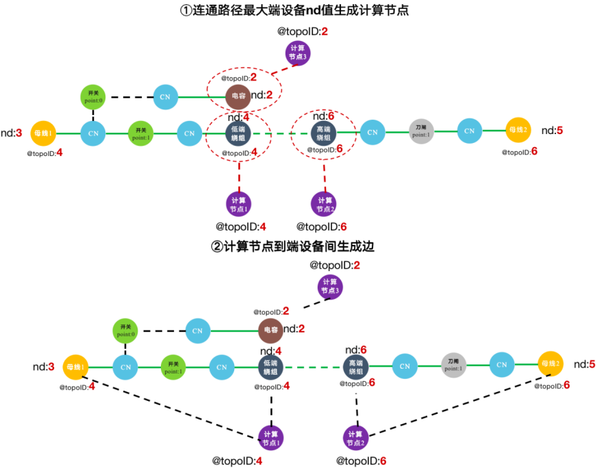
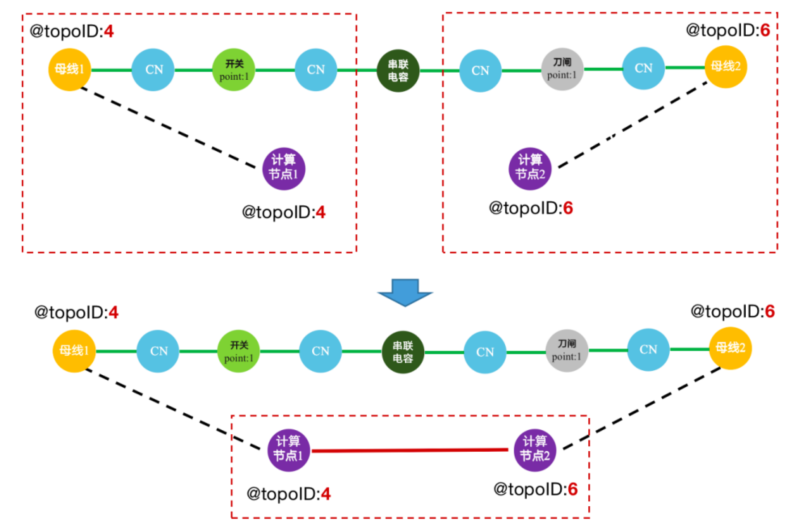
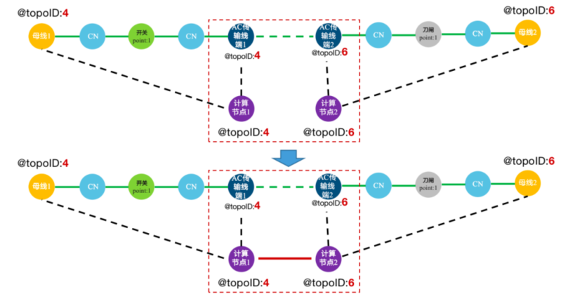
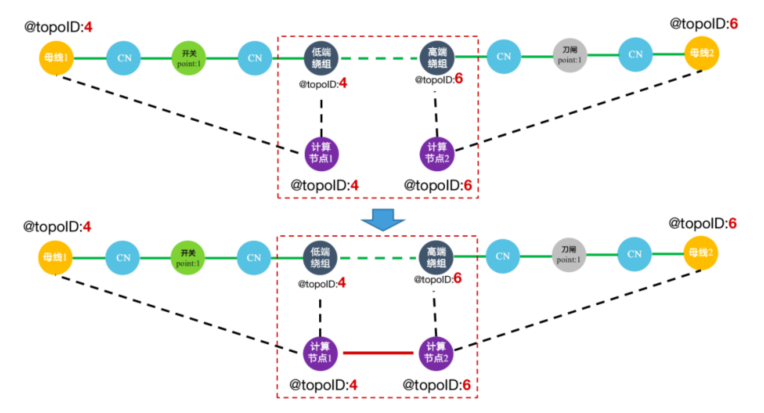
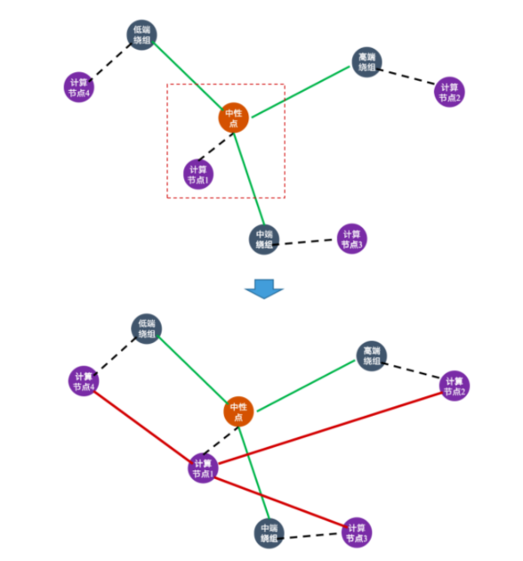

# 连通性分析

## 厂家方法

在每一次迭代中从CN点找与之相连的开关、刀闸时不做条件判断；从开关、刀闸找与之相连的CN点时进行开关、刀闸开合状态判断及开关、刀闸ID临时变量和与之相连的CN点ID临时变量大小判断。代码如下：

```c++
WHILE @@oldcounter != @@counter DO
    @@oldcounter = @@counter;
	// visit CN from circuit breaker and disconnector
	// 将串联在一起的开关、刀闸topoID设置成一样，后面连接到同一个TopoND
	BDset = SELECT t FROM CN_set:s-((connected_Breaker_CN|connected_Disconnector_CN):e)-:t 
    ACCUM 
    	t.@BDID += s.@topoID;  /

	CN_set = SELECT t FROM BDset:s-((connected_Breaker_CN|connected_Disconnector_CN):e)-:t 
    where s.@BDID > t.@topoID and s.point == 1   
    ACCUM
    	@@counter += 1, 
		t.@topoID += s.@BDID;
END;
```

## 厂家方法优化后

在每一次迭代中从CN点找与之相连的开关、刀闸时进行开关、刀闸开合状态判断及CN点ID临时变量和与之相连的开关、刀闸ID临时变量大小判断；从开关、刀闸找与之相连的CN点时只进行开关、刀闸ID临时变量和与之相连的CN点ID临时变量大小判断。代码如下：

```c++
WHILE @@oldcounter != @@counter DO
    @@oldcounter = @@counter;             
	BDset = SELECT t FROM CN_set:s-((connected_Breaker_CN|connected_Disconnector_CN):e)-:t 
    	where t.point == 1 and s.@topoID > t.@BDID 
    	ACCUM
    		t.@BDID += s.@topoID;

	CN_set = SELECT t FROM BDset:s-((connected_Breaker_CN|connected_Disconnector_CN):e)-:t 
    	where s.@BDID > t.@topoID
    	ACCUM 
    		@@counter += 1, 
			t.@topoID += s.@BDID;
END;
```


## 示例对比

| 序号  |                 步骤                 |                      厂家连通性分析方法                      |                    调整后的连通性分析方法                    |
| :---: | :----------------------------------: | :----------------------------------------------------------: | :----------------------------------------------------------: |
| 第1轮 | 第一步：从CN点找与之相连的开关、刀闸 | 没有判断条件，从满足条件的所有CN点出发找与之相连的开关、刀闸并赋值， | 添加开关、刀闸开合条件判断和ID变量大小判断，只有上述两个条件的CN点对开关、刀闸赋值 |
|       |  第二步：从开关刀闸到与之相连的CN点  | 添加开关、刀闸开合条件判断和ID变量大小判断，只有闭合开关给左边CN点赋值 |      添加了ID变量大小判断，只有闭合的开关给左边CN点赋值      |
| 第2轮 | 第一步：从CN点找与之相连的开关、刀闸 |    没有判断条件，从上一步得到的CN点给相邻的开关/刀闸赋值     |                           无需赋值                           |
|       |  第二步：从开关刀闸到与之相连的CN点  |                           无需赋值                           |                           无需赋值                           |


结果分析：调整后的连通性分析方法相较于现有方法性能提升25%以上，调整后的方法在从CN点找开关、刀闸时添加开合条件判断，避免了对断开的开关、刀闸无效计算；同时添加开关、刀闸ID变量和与之相连的CN点ID临时变量大小判断，减少了中间CN点的ID临时变量赋值之前的无效计算，大幅减少计算量，连通性分析性能有一定程度提升。

# 计算节点生成

完成设备连通性分析后，通过连通路径设备聚合生成计算节点、计算节点间生成支路两个步骤生成母线支路模型。




## 连通路径设备聚合生成计算节点

连通路径中的8类设备（母线、发电机、负荷、并联电容、AC传输线端、双绕组变压器绕组、三绕组变压器绕组、中性点）聚合生成计算节点，包括生成计算节点、计算节点到变电站和端设备间生成边两个步骤，示例如下：




## 生成计算节点

**（1）基于连通路径最大端设备（发电机、中性点除外）nd值生成计算节点。**

从CN点出发，找与之相连的端设备，若该CN点@topoID与所连端设备@topoID相等（只有在一条连通路径中nd值最大的端设备的@topoID会和与之相连CN点@topoID值相等），则以该@topoID为ID生成一个计算节点。

共对计算节点14个属性赋值，其中关键的6个属性赋值过程如下：

| 序号 |       计算节点属性       |               赋值过程                |
| :--: | :----------------------: | :-----------------------------------: |
|  1   |   Topoid（计算节点id）   | 连通路径nd最大端设备所连CN点的@topoID |
|  2   |   TOPOID（计算节点id）   | 连通路径nd最大端设备所连CN点的@topoID |
|  3   | bus_name（计算节点名称） |       连通路径nd最大端设备名称        |
|  4   |   base_kV（基准电压）    |     连通路径nd最大端设备基准电压      |
|  5   |     up_V（电压上限）     |                  1.1                  |
|  6   |     lo_V（电压下限）     |                  0.9                  |


**（2）基于发电机（该发电机的nd值为该连通路径中所有端设备的最大nd值或该发电机所在连通路径中的端设备只有该发电机）nd值生成计算节点。**

从CN点出发，找与之相连的发电机，若该CN点@topoID与所连发电机@topoID相等，则以该@topoID为ID生成一个计算节点。

共对计算节点16个属性赋值，其中关键的8个属性赋值过程如下：

| 序号 |       计算节点属性       |          赋值过程          |
| :--: | :----------------------: | :------------------------: |
|  1   |   Topoid（计算节点id）   |  发电机所连CN点的@topoID   |
|  2   |   TOPOID（计算节点id）   |  发电机所连CN点的@topoID   |
|  3   | bus_name（计算节点名称） |         发电机名称         |
|  4   |   base_kV（基准电压）    |       发电机基准电压       |
|  5   |     up_V（电压上限）     |            1.1             |
|  6   |     lo_V（电压下限）     |            0.9             |
|  7   |     qUp（无功上限）      | 发电机无功上限（Qmax/100） |
|  8   |    qLower（无功下限）    | 发电机无功下限（Qmin/100） |

**（3）基于三绕组变压器中性点ID值生成计算节点。**

以三绕组变压器中性的ID为计算节点的ID生成一个计算节点，并在该中性点到计算节点间生成边（计算节点-中性点：topo_neutral）。

共对计算节点14个属性赋值，其中关键的6个属性赋值过程如下：

| 序号 |       计算节点属性       |  赋值过程  |
| :--: | :----------------------: | :--------: |
|  1   |   Topoid（计算节点id）   | 中性点ID值 |
|  2   |   TOPOID（计算节点id）   | 中性点ID值 |
|  3   |   base_kV（基准电压）    |     1      |
|  4   | bus_name（计算节点名称） | 中性点名称 |
|  5   |     up_V（电压上限）     |    1.1     |
|  6   |     lo_V（电压下限）     |    0.9     |


## 计算节点到变电站、端设备间生成边

**（1）计算节点到所属变电站间生成边。**

从CN点出发，找其所属变电站，在以CN点@topoID生成的计算节点和该CN点所属变电站间生成边

- 计算节点-变电站：topoid_subid

**（2）计算节点到端设备间生成边。**

从CN点出发，找与之相连的端设备，在以CN点的@topoID生成的计算节点和其连接的端设备间生成边

- 计算节点-母线：topo_bus
- 计算节点-发电机：topo_uint
- 计算节点-负荷：topo_load
- 计算节点-并联电容：topo_Compensator_P
- 计算节点-AC传输线端：topo_aclinedot
- 计算节点-双绕组变压器绕组：topo_Tx_Two
- 计算节点-三绕组变压器绕组：topo_Tx_Three


# 计算节点间生成支路

查找四类设备连接边（串联电容、AC传输线端-AC传输线端、双绕组变压器高端绕组-双绕组变压器低端绕组、三绕组变压器绕组-中性点），分别在设备两端不同连通路径生成的计算节点间生成支路。

## 串联电容两端不同连通路径

**（1）串联电容两端不同连通路径生成计算节点间生成支路**

共对支路26个属性赋值，其中关键的8个属性赋值过程如下：

| 序号 |        支路属性         |            赋值过程             |
| :--: | :---------------------: | :-----------------------------: |
|  1   |    FROM（起始节点）     |  串联电容一端所连CN点的@topoID  |
|  2   |     TO（终止节点）      | 串联电容所连另一端CN点的@topoID |
|  3   |  edge_name（支路名称）  |          串联电容名称           |
|  4   |        R（电阻）        |                0                |
|  5   |        X（电抗）        |          串联电容电抗           |
|  6   |    Volt（基准电压）     |        串联电容基准电压         |
|  7   | device_type（支路类型） |            CS传输线             |
|  8   |        B（电纳）        |         1/串联电容电抗          |

示例如下：



## AC传输线两端不同连通路径

**（1）AC传输线两端计算节点间生成支路。**查找AC传输线连接的两个AC传输线端，在相连的两个AC传输线端分别生成的计算节点间生成支路。

共对支路43个属性赋值，其中关键的11个属性赋值过程如下：

| 序号 |        支路属性         |                           赋值过程                           |
| :--: | :---------------------: | :----------------------------------------------------------: |
|  1   |    FROM（起始节点）     |                AC传输线一端所连CN点的@topoID                 |
|  2   |     TO（终止节点）      |               AC传输线另一端所连CN点的@topoID                |
|  3   |  edge_name（支路名称）  |                         AC传输线名称                         |
|  4   |        R（电阻）        |                      AC传输线电阻标幺值                      |
|  5   |        X（电抗）        |                      AC传输线电抗标幺值                      |
|  6   |    Volt（基准电压）     |                       AC传输线基准电压                       |
|  7   | device_type（支路类型） |                           AC传输线                           |
|  8   |        G（电导）        | 由AC传输线电阻、电抗计算得到：line_R / (line_R * line_R + line_X * line_X) |
|  9   |        B（电纳）        | 由AC传输线电阻、电抗计算得到：line_X / (line_R * line_R + line_X * line_X) |
|  10  | M_P_TLPF（有功标幺值）  |                     AC传输线端有功标幺值                     |
|  11  | M_Q_TLPF（无功标幺值）  |                     AC传输线端无功标幺值                     |

示例如下：




## 双绕组变压器两个绕组

**（1）双绕组变压器两个绕组分别所在连通路径生成计算节点间生成支路。**查找相连的双绕组变压器的低端绕组、高端绕组，并在两个绕组分别生成的计算节点间生成支路。

共对支路44个属性赋值，其中关键的11个属性赋值过程如下：

| 序号 |        支路属性         |                           赋值过程                           |
| :--: | :---------------------: | :----------------------------------------------------------: |
|  1   |    FROM（起始节点）     |                     变压器绕组的@topoID                      |
|  2   |     TO（终止节点）      |                     变压器绕组的@topoID                      |
|  3   |  edge_name（支路名称）  |                         高端绕组名称                         |
|  4   |        R（电阻）        |                      高端绕组电阻标幺值                      |
|  5   |        X（电抗）        |                      高端绕组电抗标幺值                      |
|  6   |    Volt（基准电压）     |                      变压器绕组基准电压                      |
|  7   | device_type（支路类型） |                         双绕组变压器                         |
|  8   |        G（电导）        | 由高端绕组电阻/电抗计算得到：Rstar/(Rstar * Rstar + Xstar * Xstar) |
|  9   |        B（电纳）        | 由高端绕组电阻/电抗计算得到：Xstar/(Rstar * Rstar + Xstar * Xstar) |
|  10  | M_P_TLPF（有功标幺值）  |                    双绕组变压器有功标幺值                    |
|  11  | M_Q_TLPF（无功标幺值）  |                    双绕组变压器无功标幺值                    |

示例如下：



## 三绕组变压器绕组与中性点

**（1）三绕组变压器绕组与中性点分别生成的计算节点间生成支路。**查找三绕组变压器的三个绕组与中性点的连接边，分别在三个绕组和中性点分别生成的计算节点间生成支路。

共对支路44个属性赋值，其中关键的11个属性赋值过程如下：

| 序号 |        支路属性         |                           赋值过程                           |
| :--: | :---------------------: | :----------------------------------------------------------: |
|  1   |    FROM（起始节点）     |                         三绕组变压器                         |
|  2   |     TO（终止节点）      |                           中性点ID                           |
|  3   |  edge_name（支路名称）  |                     三绕组变压器绕组名称                     |
|  4   |        R（电阻）        |                     三绕组变压器绕组电阻                     |
|  5   |        X（电抗）        |                     三绕组变压器绕组电抗                     |
|  6   |    Volt（基准电压）     |                   三绕组变压器绕组基准电压                   |
|  7   | device_type（支路类型） |                         三绕组变压器                         |
|  8   |        G（电导）        | 由变压器绕组电阻/电抗计算得到：Rstar/(Rstar * Rstar + Xstar * Xstar) |
|  9   |        B（电纳）        | 由变压器绕组电阻/电抗计算得到：Xstar/(Rstar * Rstar + Xstar * Xstar) |
|  10  | M_P_TLPF（有功标幺值）  |                    三绕组变压器有功标幺值                    |
|  11  | M_Q_TLPF（无功标幺值）  |                    三绕组变压器无功标幺值                    |

示例如下：

