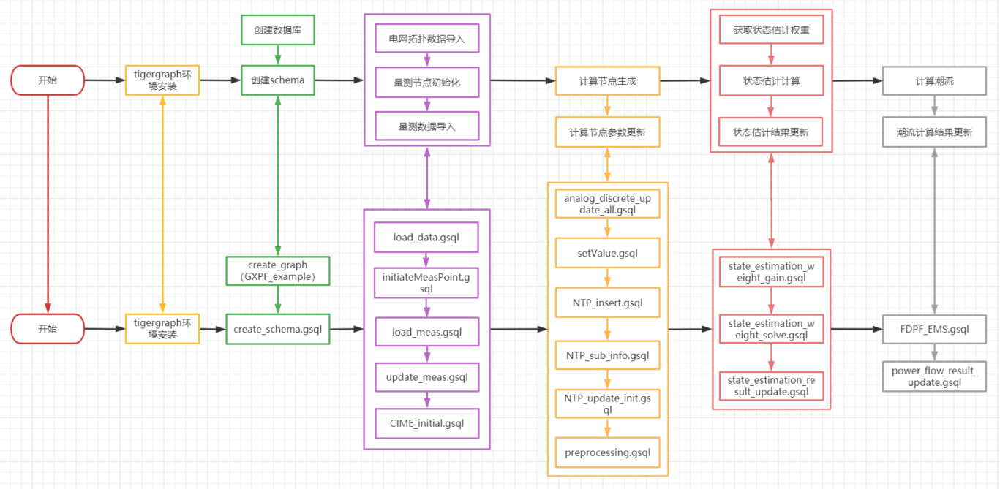
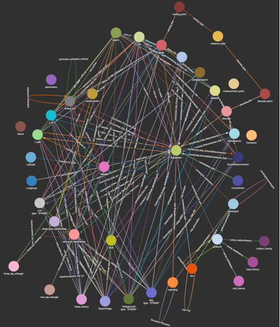

基于图计算的潮流计算全过程说明文档

# 概述

使用免费版的tigergraph数据库验证基于图计算的潮流计算功能，验证过程主要包括了系统运行环境搭建、Schema设计、自定义函数编译、数据导入与计算节点生成、状态估计、潮流计算等步骤。验证流程如下：

# 前期工作

## 环境准备

tigergraph图数据库，版本：3.1.6及以上。

## 创建图数据库

数据库名称：GXPF_example

创建数据库语句：create graph GXPF_example()

## 创建schema

**脚本名称**：create_GXPF_example_schema.gsql。创建schema，共42个节点类型、150个关系类型。

### 节点定义

| 序号 |  节点类型  |      节点英文名称      |    节点中文注释    | 动态/静态 |
| :--: | :--------: | :--------------------: | :----------------: | :-------: |
|  1   |   位置类   |      ControlArea       |      地市节点      |   静态    |
|  2   |   位置类   |        Latitude        |      纬度节点      |   静态    |
|  3   |   位置类   |       Longitude        |      经度节点      |   静态    |
|  4   |   电压类   |      BaseVoltage       |  基准电压等级节点  |   静态    |
|  5   |   电压类   |      VoltageLevel      |    电压等级节点    |   静态    |
|  6   |   电压类   |         SubVL          | 变电站电压等级节点 |   静态    |
|  7   |   厂站类   |       Substation       |     变电站节点     |   静态    |
|  8   |   厂站类   |          Bay           |      间隔节点      |   静态    |
|  9   |   设备类   |          unit          |     发电机节点     |   动态    |
|  10  |   设备类   |      unit_history      |   历史发电机节点   |   动态    |
|  11  |   设备类   |          BUS           |      母线节点      |   动态    |
|  12  |   设备类   |  two_port_transformer  |  双绕组变压器节点  |   动态    |
|  13  |   设备类   |    two_tap_changer     |  双头分接开关节点  |   动态    |
|  14  |   设备类   | three_port_transformer |  三绕组变压器节点  |   动态    |
|  15  |   设备类   |   three_tap_changer    |  三头分接开关节点  |   动态    |
|  16  |   设备类   |     neutral_point      |       中性点       |   动态    |
|  17  |   设备类   |      Disconnector      |      刀闸节点      |   动态    |
|  18  |   设备类   |        Breaker         |     断路器节点     |   动态    |
|  19  |   设备类   |   GroundDisconnector   |    接地刀闸节点    |   动态    |
|  20  |   设备类   |       Convertor        |     变流器节点     |   动态    |
|  21  |   设备类   |          C_P           |   并联补偿器节点   |   动态    |
|  22  |   设备类   |          C_S           |   串联补偿器节点   |   动态    |
|  23  |   设备类   |       ACline_dot       |  交流线路端点节点  |   动态    |
|  24  |   设备类   |           CN           |    设备连接节点    |   动态    |
|  25  |   负荷类   |         l_oad          |      负荷节点      |   动态    |
|  26  |   负荷类   |      load_history      |    历史负荷节点    |   动态    |
|  27  | 计算模型类 |         TopoND         |      电气节点      |   动态    |
|  28  | 计算模型类 |     GeneratingUnit     |     等值机节点     |   动态    |
|  29  |   属性类   |       parameters       |      参数节点      |   动态    |
|  30  |   属性类   |         status         |      状态节点      |   动态    |
|  31  |   量测类   |      measure_type      |    量测类型节点    |   静态    |
|  32  |   量测类   |   measurement_point    |      量测节点      |   动态    |
|  33  |   量测类   |      analog_point      |      遥测节点      |   动态    |
|  34  |   量测类   |          meas          |      遥测节点      |   动态    |
|  35  |   量测类   |        discrete        |      遥信节点      |   动态    |
|  36  |   量测类   |     discrete_point     |      遥信节点      |   动态    |
|  37  |   量测类   |      meas_history      |    历史量测节点    |   动态    |
|  38  |    其他    |        maintorg        |         /          |           |
|  39  |    其他    |       powergrid        |         /          |           |
|  40  |    其他    |        gridcom         |         /          |           |
|  41  |    其他    |          dcc           |         /          |           |
|  42  |    其他    |     carbon_history     |         /          |           |

###  关系定义

| 序号 | 英文名称                         | 起-英文名称            | 起-中文注释      | 止-英文名称            | 止-中文注释      |
| :--: | -------------------------------- | ---------------------- | ---------------- | ---------------------- | ---------------- |
|  1   | AClinedot_meas_history           | ACline_dot             | 交流线路节点     | meas_history           | 量测历史数据节点 |
|  2   | aclinedot_aclinedot              | ACline_dot             | 交流线路节点     | ACline_dot             | 交流线路节点     |
|  3   | aclinedot_aclinedot_reverse      | ACline_dot             | 交流线路节点     | ACline_dot             | 交流线路节点     |
|  4   | aclinedot_cn                     | ACline_dot             | 交流线路节点     | CN                     | 设备连接节点     |
|  5   | connected_Aclinedot_Sub          | ACline_dot             | 交流线路节点     | Substation             | 变电站节点       |
|  6   | analog_type                      | analog_point           | 遥测节点         | measure_type           | 量测类型节点     |
|  7   | analog_dev                       | analog_point           | 遥测节点         | meas                   | 量测节点         |
|  8   | basevoltage_bus                  | BaseVoltage            | 额定电压等级节点 | BUS                    | 母线节点         |
|  9   | basevoltage_acline               | BaseVoltage            | 额定电压等级节点 | ACline_dot             | 交流线路节点     |
|  10  | basevoltage_load                 | BaseVoltage            | 额定电压等级节点 | l_oad                  | 负荷节点         |
|  11  | basevoltage_cp                   | BaseVoltage            | 额定电压等级节点 | C_P                    | 并联电容器节点   |
|  12  | basevoltage_cs                   | BaseVoltage            | 额定电压等级节点 | C_S                    | 串联电容器节点   |
|  13  | basevoltage_twoxformer           | BaseVoltage            | 额定电压等级节点 | two_port_transformer   | 双绕组变压器节点 |
|  14  | basevoltage_threexformer         | BaseVoltage            | 额定电压等级节点 | three_port_transformer | 三绕组变压器节点 |
|  15  | basevoltage_unit                 | BaseVoltage            | 额定电压等级节点 | unit                   | 发电机节点       |
|  16  | basevoltage_breaker              | BaseVoltage            | 额定电压等级节点 | Breaker                | 断路器节点       |
|  17  | basevoltage_dis                  | BaseVoltage            | 额定电压等级节点 | Disconnector           | 刀闸节点         |
|  18  | basevoltage_grounddis            | BaseVoltage            | 额定电压等级节点 | GroundDisconnector     | 接地刀闸节点     |
|  19  | basevoltage_cn                   | BaseVoltage            | 额定电压等级节点 | CN                     | 设备连接节点     |
|  20  | basevoltage_generatingunit       | BaseVoltage            | 额定电压等级节点 | GeneratingUnit         | 等值机节点       |
|  21  | bay_bus                          | Bay                    | 间隔节点         | BUS                    | 母线节点         |
|  22  | bay_acline                       | Bay                    | 间隔节点         | ACline_dot             | 交流线路节点     |
|  23  | bay_load                         | Bay                    | 间隔节点         | l_oad                  | 负荷节点         |
|  24  | bay_cp                           | Bay                    | 间隔节点         | C_P                    | 并联电容器节点   |
|  25  | bay_cp                           | Bay                    | 间隔节点         | C_S                    | 串联电容器节点   |
|  26  | bay_breaker                      | Bay                    | 间隔节点         | Breaker                | 断路器节点       |
|  27  | bay_dis                          | Bay                    | 间隔节点         | Disconnector           | 刀闸节点         |
|  28  | bay_twoxformer                   | Bay                    | 间隔节点         | two_port_transformer   | 双绕组变压器节点 |
|  29  | bay_threexformer                 | Bay                    | 间隔节点         | three_port_transformer | 三绕组变压器节点 |
|  30  | bay_grounddis                    | Bay                    | 间隔节点         | GroundDisconnector     | 接地刀闸节点     |
|  31  | connected_Breaker_CN             | Breaker                | 断路器节点       | CN                     | 设备连接节点     |
|  32  | connected_Breaker_Sub            | Breaker                | 断路器节点       | Substation             | 变电站节点       |
|  33  | Bus_meas_history                 | BUS                    | 母线节点         | meas_history           | 量测历史数据节点 |
|  34  | connected_Bus_CN                 | BUS                    | 母线节点         | CN                     | 设备连接节点     |
|  35  | connected_Bus_Sub                | BUS                    | 母线节点         | Substation             | 变电站节点       |
|  36  | CP_meas_history                  | C_P                    | 并联电容器节点   | meas_history           | 量测历史数据节点 |
|  37  | connected_Compensator_P_CN       | C_P                    | 并联电容器节点   | CN                     | 设备连接节点     |
|  38  | connected_Compensator_P_Sub      | C_P                    | 并联电容器节点   | Substation             | 变电站节点       |
|  39  | CS_meas_history                  | C_S                    | 串联电容器节点   | meas_history           | 量测历史数据节点 |
|  40  | connected_Compensator_S_CN       | C_S                    | 串联电容器节点   | CN                     | 设备连接节点     |
|  41  | connected_Compensator_S_Sub      | C_S                    | 串联电容器节点   | Substation             | 变电站节点       |
|  42  | CN_tx_two                        | CN                     | 设备连接节点     | two_port_transformer   | 双绕组变压器节点 |
|  43  | CN_tx_three                      | CN                     | 设备连接节点     | three_port_transformer | 三绕组变压器节点 |
|  44  | cn_subid                         | CN                     | 设备连接节点     | Substation             | 变电站节点       |
|  45  | controlarea_sub                  | ControlArea            | 地市节点         | Substation             | 变电站节点       |
|  46  | connected_dcc_sub                | dcc                    | /                | Substation             | 变电站节点       |
|  47  | dcc_dcc                          | dcc                    | /                | dcc                    | /                |
|  48  | dcc_powergrid                    | dcc                    | /                | powergrid              | /                |
|  49  | connected_Disconnector_CN        | Disconnector           | 刀闸节点         | CN                     | 设备连接节点     |
|  50  | connected_Disconnector_Sub       | Disconnector           | 刀闸节点         | Substation             | 变电站节点       |
|  51  | discrete_breaker                 | discrete               | 遥信节点         | Breaker                | 断路器节点       |
|  52  | discrete_dis                     | discrete               | 遥信节点         | Disconnector           | 刀闸节点         |
|  53  | discrete_grounddis               | discrete               | 遥信节点         | GroundDisconnector     | 接地刀闸节点     |
|  54  | discrete_sub                     | discrete               | 遥信节点         | Substation             | 变电站节点       |
|  55  | discrete_type                    | discrete_point         | 遥信节点         | measure_type           | 量测类型节点     |
|  56  | discrete_dev                     | discrete_point         | 遥信节点         | discrete               | 遥信节点         |
|  57  | comp_carbonhistory               | gridcom                | /                | carbon_history         | /                |
|  58  | comp_loadhistory                 | gridcom                | /                | load_history           | /                |
|  59  | comp_unithistory                 | gridcom                | /                | unit_history           | /                |
|  60  | connected_grid_sub               | gridcom                | /                | Substation             | 变电站节点       |
|  61  | gridcom_gridcom                  | gridcom                | /                | gridcom                | /                |
|  62  | gridcom_powergrid                | gridcom                | /                | powergrid              | /                |
|  63  | connected_GroundDisconnector_CN  | GroundDisconnector     | 接地刀闸节点     | CN                     | 设备连接节点     |
|  64  | connected_GroundDisconnector_Sub | GroundDisconnector     | 接地刀闸节点     | Substation             | 变电站节点       |
|  65  | Load_meas_history                | l_oad                  | 负荷节点         | meas_history           | 量测历史数据节点 |
|  66  | connected_Load_CN                | l_oad                  | 负荷节点         | CN                     | 设备连接节点     |
|  67  | connected_Load_Sub               | l_oad                  | 负荷节点         | Substation             | 变电站节点       |
|  68  | connected_maintorg_sub           | maintorg               | /                | Substation             | 变电站节点       |
|  69  | maintorg_maintorg                | maintorg               | /                | maintorg               | /                |
|  70  | maintorg_powergrid               | maintorg               | /                | powergrid              | /                |
|  71  | meas_tap_two                     | meas                   | 量测节点         | two_tap_changer        | 双头分接开关节点 |
|  72  | meas_tap_three                   | meas                   | 量测节点         | three_tap_changer      | 三头分接开关节点 |
|  73  | meas_meas_history                | meas                   | 量测节点         | meas_history           | 量测历史数据节点 |
|  74  | Meas_Bus                         | meas                   | 量测节点         | BUS                    | 母线节点         |
|  75  | Meas_AClinedot                   | meas                   | 量测节点         | ACline_dot             | 交流线路节点     |
|  76  | Meas_Load                        | meas                   | 量测节点         | l_oad                  | 负荷节点         |
|  77  | Meas_Unit                        | meas                   | 量测节点         | unit                   | 发电机节点       |
|  78  | Meas_trans2                      | meas                   | 量测节点         | two_port_transformer   | 双绕组变压器节点 |
|  79  | Meas_trans3                      | meas                   | 量测节点         | three_port_transformer | 三绕组变压器节点 |
|  80  | Meas_CP                          | meas                   | 量测节点         | C_P                    | 并联电容器节点   |
|  81  | Meas_CS                          | meas                   | 量测节点         | C_S                    | 串联电容器节点   |
|  82  | Meas_Breaker                     | meas                   | 量测节点         | Breaker                | 断路器节点       |
|  83  | Meas_sub                         | meas                   | 量测节点         | Substation             | 变电站节点       |
|  84  | neutral_three                    | neutral_point          | 中性点           | three_port_transformer | 三绕组变压器节点 |
|  85  | powergrid_substation             | powergrid              | /                | Substation             | 变电站节点       |
|  86  | powergrid_powergrid              | powergrid              | /                | powergrid              | /                |
|  87  | sub_stvl                         | Substation             | 变电站节点       | SubVL                  | 电压等级节点     |
|  88  | sub_cn                           | Substation             | 变电站节点       | CN                     | 设备连接节点     |
|  89  | sub_generatingunit               | Substation             | 变电站节点       | GeneratingUnit         | 等值机节点       |
|  90  | connected_Sub_Compensator_S      | Substation             | 变电站节点       | C_S                    | 串联电容器节点   |
|  91  | connected_Sub_Aclinedot          | Substation             | 变电站节点       | ACline_dot             | 交流线路节点     |
|  92  | connected_Sub_Breaker            | Substation             | 变电站节点       | Breaker                | 断路器节点       |
|  93  | connected_Sub_Bus                | Substation             | 变电站节点       | BUS                    | 母线节点         |
|  94  | connected_Sub_Compensator_P      | Substation             | 变电站节点       | C_P                    | 并联电容器节点   |
|  95  | connected_Sub_Disconnector       | Substation             | 变电站节点       | Disconnector           | 刀闸节点         |
|  96  | connected_Sub_GroundDisconnector | Substation             | 变电站节点       | GroundDisconnector     | 接地刀闸节点     |
|  97  | connected_Sub_Load               | Substation             | 变电站节点       | l_oad                  | 负荷节点         |
|  98  | connected_Sub_Trans_two          | Substation             | 变电站节点       | two_port_transformer   | 双绕组变压器节点 |
|  99  | connected_Sub_Trans_three        | Substation             | 变电站节点       | three_port_transformer | 三绕组变压器节点 |
| 100  | connected_Sub_Unit               | Substation             | 变电站节点       | unit                   | 发电机节点       |
| 101  | stvl_bus                         | SubVL                  | 电压等级节点     | BUS                    | 母线节点         |
| 102  | stvl_acline                      | SubVL                  | 电压等级节点     | ACline_dot             | 交流线路节点     |
| 103  | stvl_load                        | SubVL                  | 电压等级节点     | l_oad                  | 负荷节点         |
| 104  | stvl_cp                          | SubVL                  | 电压等级节点     | C_P                    | 并联电容器节点   |
| 105  | stvl_cs                          | SubVL                  | 电压等级节点     | C_S                    | 串联电容器节点   |
| 106  | stvl_twoxformer                  | SubVL                  | 电压等级节点     | two_port_transformer   | 双绕组变压器节点 |
| 107  | stvl_threexformer                | SubVL                  | 电压等级节点     | three_port_transformer | 三绕组变压器节点 |
| 108  | stvl_breaker                     | SubVL                  | 电压等级节点     | Breaker                | 断路器节点       |
| 109  | stvl_dis                         | SubVL                  | 电压等级节点     | Disconnector           | 刀闸节点         |
| 110  | stvl_grounddis                   | SubVL                  | 电压等级节点     | GroundDisconnector     | 接地刀闸节点     |
| 111  | stvl_unit                        | SubVL                  | 电压等级节点     | unit                   | 发电机节点       |
| 112  | stvl_cn                          | SubVL                  | 电压等级节点     | CN                     | 设备连接节点     |
| 113  | stvl_generatingunit              | SubVL                  | 电压等级节点     | GeneratingUnit         | 等值机节点       |
| 114  | trans3_meas_history              | three_port_transformer | 三绕组变压器节点 | meas_history           | 量测历史数据节点 |
| 115  | connected_Trans_three_Sub        | three_port_transformer | 三绕组变压器节点 | Substation             | 变电站节点       |
| 116  | three_tap_winding                | three_tap_changer      | 三头分接开关节点 | three_port_transformer | 三绕组变压器节点 |
| 117  | topo_connect                     | TopoND                 | 电气节点         | TopoND                 | 电气节点         |
| 118  | topoid_subid                     | TopoND                 | 电气节点         | Substation             | 变电站节点       |
| 119  | topo_bus                         | TopoND                 | 电气节点         | BUS                    | 母线节点         |
| 120  | topo_Tx_Two                      | TopoND                 | 电气节点         | two_port_transformer   | 双绕组变压器节点 |
| 121  | topo_Tx_Three                    | TopoND                 | 电气节点         | three_port_transformer | 三绕组变压器节点 |
| 122  | topo_unit                        | TopoND                 | 电气节点         | unit                   | 发电机节点       |
| 123  | Topond_longitude                 | TopoND                 | 电气节点         | Longitude              | /                |
| 124  | Topond_latitude                  | TopoND                 | 电气节点         | Latitude               | /                |
| 125  | topo_load                        | TopoND                 | 电气节点         | l_oad                  | 负荷节点         |
| 126  | topo_compensatorP                | TopoND                 | 电气节点         | C_P                    | 并联电容器节点   |
| 127  | topo_aclinedot                   | TopoND                 | 电气节点         | ACline_dot             | 交流线路节点     |
| 128  | topo_neutral                     | TopoND                 | 电气节点         | neutral_point          | 中性点           |
| 129  | trans2_meas_history              | two_port_transformer   | 双绕组变压器节点 | meas_history           | /                |
| 130  | txI_txJ_transformerline          | two_port_transformer   | 双绕组变压器节点 | two_port_transformer   | 双绕组变压器节点 |
| 131  | txJ_txI_transformerline          | two_port_transformer   | 双绕组变压器节点 | two_port_transformer   | 双绕组变压器节点 |
| 132  | connected_Trans_two_Sub          | two_port_transformer   | 双绕组变压器节点 | Substation             | 变电站节点       |
| 133  | two_tap_winding                  | two_tap_changer        | 双头分接开关节点 | two_port_transformer   | 双绕组变压器节点 |
| 134  | generating_unit                  | unit                   | 发电机节点       | GeneratingUnit         | 等值机节点       |
| 135  | Unit_meas_history                | unit                   | 发电机节点       | meas_history           | /                |
| 136  | connected_Unit_CN                | unit                   | 发电机节点       | CN                     | 设备连接节点     |
| 137  | connected_Unit_Sub               | unit                   | 发电机节点       | Substation             | 变电站节点       |
| 138  | voltagelevel_bus                 | VoltageLevel           | 电压等级节点     | BUS                    | 母线节点         |
| 139  | voltagelevel_acline              | VoltageLevel           | 电压等级节点     | ACline_dot             | 交流线路节点     |
| 140  | voltagelevel_load                | VoltageLevel           | 电压等级节点     | l_oad                  | 负荷节点         |
| 141  | voltagelevel_cp                  | VoltageLevel           | 电压等级节点     | C_P                    | 并联电容器节点   |
| 142  | voltagelevel_cs                  | VoltageLevel           | 电压等级节点     | C_S                    | 串联电容器节点   |
| 143  | voltagelevel_twoxformer          | VoltageLevel           | 电压等级节点     | two_port_transformer   | 双绕组变压器节点 |
| 144  | voltagelevel_threexformer        | VoltageLevel           | 电压等级节点     | three_port_transformer | 三绕组变压器节点 |
| 145  | voltagelevel_unit                | VoltageLevel           | 电压等级节点     | unit                   | 发电机节点       |
| 146  | voltagelevel_breaker             | VoltageLevel           | 电压等级节点     | Breaker                | 断路器节点       |
| 147  | voltagelevel_dis                 | VoltageLevel           | 电压等级节点     | Disconnector           | 刀闸节点         |
| 148  | voltagelevel_grounddis           | VoltageLevel           | 电压等级节点     | GroundDisconnector     | 接地刀闸节点     |
| 149  | voltagelevel_cn                  | VoltageLevel           | 电压等级节点     | CN                     | 设备连接节点     |
| 150  | voltagelevel_generatingunit      | VoltageLevel           | 电压等级节点     | GeneratingUnit         | 等值机节点       |

## gsql脚本执行过程

# 节点数据处理

## 位置类

### 区域【ControlArea】

### 纬度节点【Latitude】

### 经度节点【Longitude】

## 电压类

### 基准电压等级【BaseVoltage】

### 电压等级【VoltageLevel】

### 变压器电压等级【SubVL】

## 厂站类

### 变电站【Substation】

> 1、从Substation_vl.csv文件中读取变电站基本数据，详见属性列表。
>
> 2、写入变电站与meas的关联关系Meas_sub，关联id为（ACline_dot的id、@subid），可参考ACline_dot节点数据逻辑。
>
> 3、构建topoND到变电站【substation】的连接关系【topoid_subid】
>
> 4、将变电站的经纬度更新至计算节点, 设置计算节点的Ri_vP与Ri_vQ属性值, 更新变电站结算节点的总P、Q

### 间隔节点【Bay】

## 设备类

### 发电机【unit】

> 1、从SynchronousMachine.csv文件中读取基本数据，详见属性列表。
>
> 2、使用【BaseVoltage】的【nomkV】更新【unit】的额定电压【base_value】
>
> 3、更新发电机【unit】的属性【Substation、name】
>
> 4、将设备名称【name】赋值给对应的遥测节点【meas】属性【devName】
>
> 5、将遥测数据【meas】的有功【PManual、P】、无功【QManual、Q】更新到设备的属性【Pimeas、Qimeas】
>
> 6、设置发电机【unit】的【off】属性
>
> - ü 将不平衡变电站【Substation】的发电机【unit】的@off设置成0(闭合)
> - ü 将所有发电机【unit】的变量@off设置为1(断开)  （覆盖1）
> - ü 将虚拟站【Substation】的发电机【unit】变量@off设置成0(闭合)
> - ü 将没有连接节点的ACline所在变电站【Substation】的发电机【unit】变量@off设置为0(闭合)
> - ü 将发电机【unit】的@off变量更新到属性【off】
>
> 7、选择属性off为0的设备及对应CN，使用设备的连接点ID【nd】更新设备、对应CN节点的计算节点变量【@topoID】
>
> 8、生成计算节点【TopoND】
>
> 9、构建与计算节点【TopoND】的关联关系。
>
> 10、将【发电机】的有功、无功、电压等级、额定电压、更新至与之相连的发电机【非孤岛计算节点】。
>
> 11、将发电机的计算节点的母线类型设置为PV节点。
>
> 12、将【发电机】的计算节点的ZJP(猜测为互阻抗)的属性值设置为0
>
> 13、将【发电机】的计算节点的ZJQ的属性值设置为0
>
> 14、计算设备【Unit】对应meas的@Pflag、@Qflag变量，@Pflag = PFlag + P_ManualFlag, @Qflag = QFlag + Q_ManualFlag

### 历史发电机节点【unit_history】

### 母线【BUS】

> 1、从BusbarSection.csv文件中读取母线基本数据，详见属性列表。
>
> 2、从analog_point节点中读取母线电压数据（value、quality）更新到节点meas中(P, PFlag)
>
> 3、使用【BaseVoltage】的【nomkV】更新【BUS】的额定电压【base_value】
>
> 4、更新母线【BUS】的属性【Substation、name】
>
> 5、将设备名称【name】赋值给对应的遥测节点【meas】属性【devName】
>
> 6、将遥测数据【meas】的有功【PManual、P】、无功【QManual、Q】更新到设备的属性【Pimeas、Qimeas】
>
> 7、选择属性off为0的设备及对应CN，使用设备的连接点ID【nd】更新设备、对应CN节点的计算节点变量【@topoID】
>
> 8、生成计算节点【TopoND】
>
> 9、构建与计算节点【TopoND】的关联关系。
>
> 10、将电容【C_P】的无功功率量测【Qimeas】更新至与之相连的母线【@Qimeas】中
>
> 11、更新母线电压>400的TopoND的变量【@bus_Q_meas】
>
> 12、所有变压器电压等级为525的变压器母线【bus】的设置为连接状态(start_pt设置为1)
>
> 13、将【母线】的电压幅值(V)、电压相角(Ang)、有功(Pimeas)、电压相角的量测(Ang_meas)、电压等级(volt)、母线名称(name)、额定电压(base_value)更新至与之相连的母线【非孤岛计算节点】
>
> 14、计算设备【Bus】对应meas的@Pflag、@Qflag变量，@Pflag = PFlag + P_ManualFlag, @Qflag = QFlag + Q_ManualFlag

### 双绕组变压器【two_port_transformer】

> 1、从two_port_winding.csv文件中读取双绕组变压器基本数据，详见属性列表。
>
> 2、修改双绕组变压器的额定功率【S】, 没有值的赋值为0.001
>
> 3、电阻标幺值(Rstar)、电抗标幺值(Xstar), 并将变压器的变比(t)设置为1
>
> 4、更新双绕组变压器two_port_transformer的属性【Substation、name】
>
> 5、计算双绕组变压器two_port_transformerde 变比【t】
>
> 6、将设备名称【name】赋值给对应的遥测节点【meas】属性【devName】
>
> 7、将遥测数据【meas】的有功【PManual、P】、无功【QManual、Q】更新到设备的属性【Pimeas、Qimeas】
>
> 8、更新双绕组变压器【two_port_transformer】的off值。
>
> - ü 将35KV到10KV双绕组变压器two_port_transformer的@off设置为1(断开)
> - ü 将双绕组变压器two_port_transformer两端存在Pimeas、Pimeas大于0.01的@off值设为0, 即: 闭合-
> - ü 将【35KV、10KV】到【0.4KV、0.1KV】双绕组变压器two_port_transformer的@off设置为1(断开)
> - ü 将两边电压【35KV、10KV、6.3KV】一样的双绕组变压器two_port_transformer的@off设置为1(断开)
> - ü 将任意一边电压小于【1KV】的双绕组变压器two_port_transformer的@off设置为1(断开)
>
> 9、选择属性off为0的设备及对应CN，使用设备的连接点ID【nd】更新设备、对应CN节点的计算节点变量【@topoID】
>
> 10、生成计算节点【TopoND】
>
> 11、构建与计算节点【TopoND】的关联关系。
>
> 12、构建双绕组变压器支路。
>
> 13、将【变压器】的额定电压更新至【非孤岛计算节点】，将变压器的名字更新至计算节点。
>
> 14、将双绕组变压器的Pimeas以（id->Pimeas）的形式保存到@@two_port_p_MapAccum变量中，将Qimeas保存到@@two_port_q_MapAccum变量中。
>
> 15、将保存在@@two_port_p_MapAccum、@@two_port_q_MapAccum更新到topo_connect的（M_P_TLPF_list，M_Q_TLPF_list）和（M_P_TLPF，M_Q_TLPF）中。
>
> 16、计算设备【trans2】对应meas的@Pflag、@Qflag变量，@Pflag = PFlag + P_ManualFlag, @Qflag = QFlag + Q_ManualFlag
>
> 17、更新双绕组变压器支路topo_connect的Ri_eP、Ri_eQ属性值

### 双头分接开关【two_tap_changer】

> 1、从two_tap_changer.csv文件中读取基本数据，详见属性列表。
>
> 2、从analog_point节点中读取分接头位置数据（value、quality）数据更新到节点meas中（tap、tapFlag）
>
> 3、将meas的分接头位置数据【tap】赋值给 two_tap_changer 节点的【tap_meas】属性

### 三绕组变压器【three_port_transformer】

> 1、从three_tap_changer.csv文件中读取三绕组变压器基本数据，详见属性列表。
>
> 2、从analog_point节点中读取有功功率（value、quality）、无功功率（value、quality）数据更新到节点meas中（P，PFlag）、（Q，QFlag）
>
> 3、修改三绕组变压器的额定功率（S）, 没有值的赋值为0.001
>
> 4、计算三绕组变压器【three_port_transformer】的属性【Substation、name】及变量【@Trans_voltlevel、@SubstationID】
>
> 5、计算三相绕组变压器【three_port_transformer】电阻标幺值(Rstar)、电抗标幺值(Xstar), 变比【t】设初始值1
>
> 6、计算三绕组变压器【three_port_transformer】变比【t】
>
> 7、将设备名称【name】赋值给对应的遥测节点【meas】属性【devName】
>
> 8、将遥测数据【meas】的有功【PManual、P】、无功【QManual、Q】更新到设备的属性【Pimeas、Qimeas】
>
> 9、更新三绕组变压器【three_port_transformer】的off值，将Pimeas或Qimeas的绝对值大于0.01的设备的off设置为0(闭合)
>
> 10、选择属性off为0的设备及对应CN，使用设备的连接点ID【nd】更新设备、对应CN节点的计算节点变量【@topoID】
>
> 11、生成计算节点【TopoND】
>
> 12、构建与计算节点【TopoND】的关联关系。
>
> 13、构建三相绕组变压器支路。
>
> 14、将【变压器】的额定电压更新至【非孤岛计算节点】，将变压器的名字更新至计算节点。
>
> 15、将双绕组变压器的Pimeas以（id->Pimeas）的形式保存到@@three_port_p_MapAccum变量中，将Qimeas保存到@@three_port_q_MapAccum变量中。
>
> 16、将保存在@@three_port_p_MapAccum、@@three_port_q_MapAccum更新到topo_connect的（M_P_TLPF_list，M_Q_TLPF_list）和（M_P_TLPF，M_Q_TLPF）中。
>
> 17、计算设备【trans3】对应meas的@Pflag、@Qflag变量，@Pflag = PFlag + P_ManualFlag, @Qflag = QFlag + Q_ManualFlag
>
> 18、将@Pflag以(id -> @Pflag)的形式存入@@three_port_Pflag变量中，将@Qflag以(id -> @Qflag)的形式存入@@three_port_Qflag变量中。
>
> 19、更新三绕组变压器支路topo_connect的Ri_eP、Ri_eQ属性值。

### 三头分接开关【three_tap_changer】

> 1、从three_tap_changer.csv文件中读取基本数据，详见属性列表。
>
> 2、从analog_point节点中读取分接头位置数据（value、quality）数据更新到节点meas中（tap、tapFlag）
>
> 3、将meas的分接头位置数据【tap】赋值给 three_tap_changer 节点的【tap_meas】属性

### 中性点【neutral_point】

> 1、从three_port_trans.csv文件中读取基本数据，详见属性列表。
>
> 2、生成计算节点【TopoND】及之间的关联关系【topo_neutral】
>
> 3、设置中性点【Ri_vP、Ri_vQ】的初始值。

### 开关【Breaker】

> 1、从Breaker.csv文件中读取基本数据，详见属性列表。
>
> 2、从discrete_point节点中读取开关状态数据（value、quality）数据更新到节点discrete中（status、flag）
>
> 3、设置断路器【Breaker】状态【point】初始值为1, 即：闭合
>
> 4、更新断路器【Breaker】的属性【Substation、name】
>
> 5、将设备名称【name】赋值给对应的遥信节点【discrete】属性【devName】
>
> 6、将遥信数据【discrete】的状态【statusM、status】更新到断路器【Breaker】的状态【point】
>
> 7、将遥信节点【discrete】数据更新到断路器【Breaker】属性【point】  （重复）

### 刀闸【Disconnector】

> 1、从Disconnector.csv文件中读取基本数据，详见属性列表。
>
> 2、从discrete_point节点中读取刀闸状态数据（value、quality）数据更新到节点discrete中（status、flag）
>
> 3、设置刀闸【Disconnector】状态【point】初始值为1, 即：闭合
>
> 4、更新刀闸【Disconnector】的属性【Substation、name】
>
> 5、将设备名称【name】赋值给对应的遥信节点【discrete】属性【devName】
>
> 6、将遥信数据【discrete】的状态【statusM、status】更新到刀闸【Disconnector】的状态【point】
>
> 7、将遥信节点【discrete】数据更新到刀闸【Disconnector】属性【point】  （重复）

### 接地刀闸【GroundDisconnector】

> 1、从GroundDisconnector.csv文件中读取基本数据，详见属性列表。
>
> 2、从discrete_point节点中读取接地刀闸状态数据（value、quality）数据更新到节点discrete中（status、flag）

### 变流器节点【Convertor】

### 串联补偿器【C_S】

> 1、从Compensator_S.csv文件中读取基本数据，详见属性列表。
>
> 2、计算串联电容器【C_S】的属性【cs_ZK】及变量【@Qrate、@Zk】
>
> 3、更新串联电容器【C_S】的属性【Substation、name】
>
> 4、将设备名称【name】赋值给对应的遥测节点【meas】属性【devName】
>
> 5、选择属性off为0的设备及对应CN，使用设备的连接点ID【nd】更新设备、对应CN节点的计算节点变量【@topoID】
>
> 6、构建CS传输线支路模型。
>
> 7、更新C_S支路topo_connect的Ri_eP、Ri_eQ属性值，都设为0.01

### 并联补充器【C_P】

> 1、从Compensator_P.csv文件中读取基本数据，详见属性列表。
>
> 2、使用【BaseVoltage】的【nomkV】更新【C_P】的额定电压【base_value】
>
> 3、更新并联电容器【C_P】的属性【Substation、name】
>
> 4、将设备名称【name】赋值给对应的遥测节点【meas】属性【devName】
>
> 5、将遥测数据【meas】的有功【PManual、P】、无功【QManual、Q】更新到设备的属性【Pimeas、Qimeas】
>
> 6、选择属性off为0的设备及对应CN，使用设备的连接点ID【nd】更新设备、对应CN节点的计算节点变量【@topoID】
>
> 7、生成计算节点【TopoND】
>
> 8、构建与计算节点【TopoND】的关联关系。
>
> 9、识别与ACline连接的CP(电容)，将相连电容的列表更新至支路的from_CP_list、to_CP_list属性中
>
> 10、更新支路的from_CP、to_CP属性。
>
> 11、将【电容器】的有功【P】、无功【Qmeas】、额定电压【base_value】、导纳参数更新至【非孤岛计算节点】
>
> 12、将【并联电容器】的计算节点的ZJQ的属性值设置为0
>
> 13、计算设备【CP】对应meas的@Pflag、@Qflag变量，@Pflag = PFlag + P_ManualFlag, @Qflag = QFlag + Q_ManualFlag

### 设备连接点【CN】

### 交流线路端点【ACline_dot】

> 1、从aclinedot.csv文件中读取交流线路端点基本数据，详见属性列表。
>
> 2、从BaseVoltage节点中读取nomKV更新ACline_dot节点的电压【volt】和额定电压【base_value】
>
> 3、将ACline_dot连接的变电站id赋值给相连的ACline_dot、ACline_dot对应的CN的变量@subid
>
> 4、根据ACline_dot的电阻(R)、电抗(X)、电纳(B)计算关系aclinedot_aclinedot的line_R、line_X、line_B
>
> 5、写入ACline_dot与substation的双向关联关系connected_Aclinedot_Sub、connected_Sub_Aclinedot，关联id分别为（id，@subid）、（@subid，id）
>
> 6、给ACline_dot的Subname、name赋值，name格式为：subname + "." + name
>
> 7、给两个相连ACline_dot的name分别赋值给关系aclinedot_aclinedot的I_node与J_node。
>
> 8、将设备名称【name】赋值给对应的遥测节点【meas】属性【devName】
>
> 9、将遥测数据【meas】的有功【PManual、P】、无功【QManual、Q】更新到设备的属性【Pimeas、Qimeas】
>
> 10、设置【ACline_dot】的off值：将电压等级大于500kV, 并且Pimeas与Qimeas的值都为0的AC传输线的@off设置为1(断开)、指定某些ACline_dot设置off设为1(断开)，其余默认为0。
>
> 11、选择属性off为0的设备及对应CN，使用设备的连接点ID【nd】更新设备、对应CN节点的计算节点变量【@topoID】
>
> 12、生成计算节点【TopoND】
>
> 13、构建与计算节点【TopoND】的关联关系。
>
> 14、构建AC传输线支路。
>
> 15、将电容【C_P】的无功功率量测【Qimeas】更新至与之相连的ACline_dot【@Qimeas】中
>
> 16、将ACline_dot的Pimeas以（id->Pimeas）的形式保存到@@acline_p_MapAccum变量中，将Qimeas保存到@@acline_q_MapAccum变量中。
>
> 17、将保存在@@acline_p_MapAccum、@@acline_q_MapAccum更新到topo_connect的（M_P_TLPF_list，M_Q_TLPF_list）和（M_P_TLPF，M_Q_TLPF）中。
>
> 18、将ACline_dot的【电压等级、额定电压】到计算节点的base_kV、desired_volts中。
>
> 19、计算设备【AClinedot】对应meas的@Pflag、@Qflag变量，@Pflag = PFlag + P_ManualFlag, @Qflag = QFlag + Q_ManualFlag
>
> 20、将@Pflag以(id -> @Pflag)的形式存入@@acline_Pflag变量中，将@Qflag以(id -> @Qflag)的形式存入@@acline_Qflag变量中。
>
> 21、更新AC传输线支路topo_connect的Ri_eP、Ri_eQ属性值

## 负荷类

### 负荷【l_oad】

> 1、从EnergyConsumer.csv文件中读取基本数据，详见属性列表。
>
> 2、使用【BaseVoltage】的【nomkV】更新【l_oad】的额定电压【base_value】
>
> 3、更新负荷【l_oad】的属性【Substation、name】
>
> 4、将遥测数据【meas】的有功【PManual、P】、无功【QManual、Q】更新到设备的属性【Pimeas、Qimeas】
>
> 5、设置负荷【l_oad】的off值：将"马窝换流站.1站用变" 、"马窝换流站.2站用变"负荷的off设置为1(断开)，其余默认为0
>
> 6、选择属性off为0的设备及对应CN，使用设备的连接点ID【nd】更新设备、对应CN节点的计算节点变量【@topoID】
>
> 7、生成计算节点【TopoND】
>
> 8、构建与计算节点【TopoND】的关联关系。
>
> 9、将【负荷】的有功、无功、额定电压更新至【非孤岛计算节点】，将负荷的名称更新至非孤岛计算节点。
>
> 10、将【负荷】的计算节点的ZJP(猜测为互阻抗)的属性值设置为0
>
> 11、将【负荷】的计算节点的ZJQ的属性值设置为0
>
> 12、计算设备【Load】对应meas的@Pflag、@Qflag变量，@Pflag = PFlag + P_ManualFlag, @Qflag = QFlag + Q_ManualFlag

### 历史负荷节点【load_history】

## 计算模型类

### 等值机【GeneratingUnit】

### 计算节点【TopoND】

> 1、生成设备对应的TopoND，详解具体设备内容。
>
> 2、筛选非孤岛计算节点和孤岛计算节点。
>
> 3、设置计算节点的exId属性值，该属性值为递增的值，用来对计算节点进行排序。
>
> 4、设置非孤岛计算节点的变电站名称【sub】。
>
> 5、更新电气节点Ri_V的属性值。
>
> 6、将所有TopoND之间关系数据保存到@@edge中，形式：sort_edge_NTPUpdate(s.exId*100000 + t.exId, e.M_P_TLPF, e.M_Q_TLPF, e.Ri_eP, e.Ri_eQ, e.from_CP, e.to_CP, t.exId)
>
> 7、将所有TopoND之间节点数据保存到@@vertex中，形式：sort_vertex_NTPUpdate(s.exId, s.@alldgr, s.@M_Vm, s.@M_Va, s.@GenP, s.@GenQ, s.@LdP, s.@LdQ, s.@M_C_P)
>
> 8、调用C++函数AttrSave_NTP_update_v7将(@@vertex, @@edge)保存到对应矩阵当中。
>
> 9、设置支路导纳的实部(B)、虚部(G)、line_Q1、BIJ、变压器变比(transformer_final_turns_ratio)、hB
>
> 10、将TopoND之间关系数据保存到@@edge中，形式：sort_edge(s.exId*100000 + t.exId, e.G, e.B, e.hB, e.BIJ, e.transformer_final_turns_ratio, e.line_Q1, t.exId)
>
> 11、将所有TopoND之间节点数据保存到@@vertex中，形式：sort_vertex(s.exId, s.@alldgr, s.@xk_hB, s.G, s.B, s.busType)
>
> 12、调用C++函数AttrSave_NTP_insert将(@@vertex, @@edge)保存到对应矩阵当中。

## 属性类

### 参数【parameters】

### 参数【status】

## 量测类

### 量测节点【measurement_point】

> 1、来源于Measurement.csv文件，包含了所有量测设备的ID和类型等属性。【load_gx_data.gsql】

### 量测类型【measure_type】

> 1、来源于MeasurementType.csv文件，包含了量测类型ID和量测类型名称等属性。【load_gx_data.gsql】

### 遥信节点【discrete_point】

> 1、量测节点数据中，meas_type == "40740" 的部分。
>
> 2、建立与measure_type的关联关系discrete_type【discrete_point - measure_type】，关联ID分别为id、meas_type。
>
> 3、建立与discrete的关联关系discrete_dev【discrete_point - discrete】，关联ID分别为id、devid。
>
> 4、给value、quality赋值，数据来源于meas_discrete.csv。

### 遥测节点【analog_point】

> 1、量测节点数据中，meas_type != "40740" 的部分。
>
> 2、建立与measure_type的关联关系analog_type【analog_point - measure_type】，关联ID分别为id、meas_type。
>
> 3、建立与meas的关联关系analog_dev【analog_point - meas】，关联ID分别为【id、devid】、【id，terminal】。
>
> 4、给value、quality赋值，数据来源于meas_analog.csv。

### 遥信节点【discrete】

> 1、将设备的值从discrete_point更新到设备对应的discrete，详解具体设备。

### 遥测节点【meas】

> 1、将设备的值从analog_point更新到设备对应的meas，详解具体设备。
>
> 2、将所有的遥测节点【meas】的属性【meas_A】设置为1, 属性【meas_B】设置为0

### 历史量测节点【meas_history】

## 其他

### Maintorg

### Powergrid

### Gridcom

### Dcc

### carbon_history

# 拓扑分析

# 状态估计

# 潮流计算

# 附录

## 名词解释

|    名词    | 解释                                                         |
| :--------: | ------------------------------------------------------------ |
|   标幺值   | 电力系统分析和工程计算时常用的数值记法，其值等于实际值（有名值）与某一选定的基准值的比值。（标幺值=实际值/基准值） |
|  电阻(R)   | 欧姆定律定义的参数，电压与电流之比，单位欧姆。               |
|  电抗(X)   | 交流电流通过电感或者电容压降时，电压与电流之比，虚数表示，单位欧姆。 |
|  阻抗(Z)   | 电阻与电抗的复合参数，用复数表示，实部为电阻，虚部为电抗，单位欧姆。(Z=R+jX) |
|  电导(G)   | 电阻的倒数，单位西门子。                                     |
|  电纳(B)   | 电抗的倒数，单位西门子。                                     |
|  导纳(Y)   | 阻抗的倒数，单位是西门子。(Y=G+jB)                           |
| 变压器变比 | 变比指电压比或电流比，是变换电压或电流的设备，一次绕组与二次绕组之间的电压或电流比。 |
|  等效电路  | 电机工程及科学领域的名词，是指可以表示一个电路所有（或大部分）特性的理论电路。通常等效电路的目的是为了简化计算，而且为了帮助分析，常会将越复杂的电路设法以最简单的型式表示。 |
| 雅克比矩阵 | 雅克比矩阵是一阶偏导数以一定方式排列成的矩阵。雅可比矩阵的重要性在于它体现了一个可微方程与给出点的最优线性逼近。因此，雅可比矩阵类似于多元函数的导数。 |
|            |                                                              |
|            |                                                              |
|            |                                                              |

