<center><font size=6 color=blue>在线语音识别系统安装手册

# 系统介绍

## 系统功能

本系统对语音进行识别服务。系统将待识别语音进行识别处理，得到的一系列的文字结果可供客户进行数据分析，支持导航的后续工作。

## 系统配置环境

**硬件环境**：

1. **内存**： 建议 64G 及以上；

2. **CPU**：建议 E5 2640 及以上，核心数少，则并发少；

3. **硬盘**： 推荐安装目录所在磁盘可用空间为 500GB 以上， 如果安装目录可用空间 小于 200GB，建议在线合成系统配置中设置不保存语音， 或者对合成语音定期清理；

4. **操作系统**：64 位， 建议系统版本 centos-server 7.0 以上，建议不要安装最小系统。

    

**软件环境**：

1)  **gcc/g++**：部署机器需要 4.8 及以上版本。

2)  **软件版本**：


| 序号 | 软件安装包名/版本           | 软件类型（基础/系统/引擎） |
| :--: | --------------------------- | -------------------------- |
|  1   | jdk-8u171-linux-x64.tar.gz  | 基础                       |
|  2   | nginx 1.14.0                | 基础                       |
|  3   | apache-tomcat-9.0.35.tar.gz | 基础                       |
|  4   | redis-3.2.0.tar.gz          | 基础                       |
|  5   | Decoder                     | 引擎                       |

# 模块安装

所有模块需要在非 **root** 下安装, 当前服务单独创建 asr 用户， 本服务的所有模块都在asr 用户下操作， 不可与“语音合成系统”、“离线系统”共用asr 用户， 防止软件安装冲突。

模块间关系图如下：

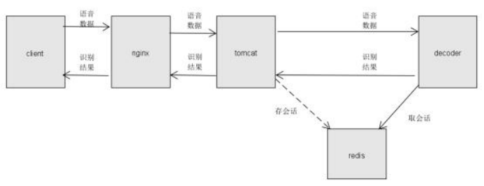

## 前提

系统目录结构，防止造成文件混乱，建议安装包都放在/home/asr/online 目录下，解压后文件夹内有两个文件目录 Decoder 和 tools。 目录机构如下：

`rel_onlineasr`

```
├── Decoder
│ ├── bin //Decoder 二进制执行文件目录
│ │ ├── decoder.sh //服务端口、线程配置
│ │ ├── shutdown.sh //Decoder 关闭脚本
│ │ ├── start.sh //Decoder 启动脚本
│ ├── conf //配置文件目录
│ ├── lib //工程依赖库目录
│ ├── model //引擎库、模型目录
│ ├── log //日志目录
├── doc //安装文档目录

└── tools
├── apache-tomcat-9.0.35.tar.gz //tomcat
├── getinfo //申请授权脚本
├── jdk-8u171-linux-x64.tar.gz //jdk
├── jmeter.zip //服务验证文件
├── nginx //负载均衡
├── redis-3.2.0.tar.gz //redis 任务分发
├── tools_install //工具安装脚本目录
├── keepalived //高可用文件
└── tools_install //安装脚本目录
```


## jdk 安装

进入 tools/tools\_install 目录， 执行脚本`install_All.sh`，解压 tomcat、redis、jdk、nginx 到~/local 目录下， 完成后执行：

```shell
source ~/.bash_profile
source ~/.bashrc
```


## nginx 应用安装

1. 进入~/local/nginx/nginx 目录，修改 server\_conf\_asr.txt 文件中的 tomcat 集群； 如下图所示：

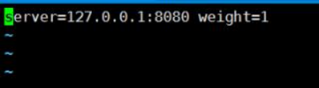

**注意**：图中的 server=127.0.0.1:8080 修改为部署的 tomcat 对应的 ip 和端口号。 完成后执行：

```shell
source ~/.bash_profil
source ~/.bashrc
```

进入目录~/local/nginx/nginx 执行 `./sbin`。

# redis 单机形式识别服务安装

识别服务对应 redis 有两种部署方式， redis 单机和 redis 集群， 选择其中一种方式即可。如果部署 redis 单机形式， 可跳过 4.1、4.2、4.3 步骤； 如果选择 redis 集群部署， 跳 过 3.1 、3.2 、3.3 步骤；

## **redis** 单机安装

1.  进入~/local/redis/redis-3.2.0 目录；
1.  修改 redis.conf 文件中的 IP 和port，如下图。127.0.0.1 修改为机器实际分配 ip，port 如果没有冲突，可默认不修改。

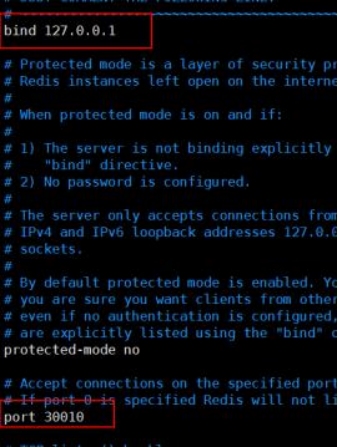


3. 执行 `nohup ./redis-server redis.conf >/dev/null 2>&1 &` 启动 redis。
4. 检查 redis 是否启动：执行 `ps -ef | grep redis` ，出现如下图形式，表示启动成功。

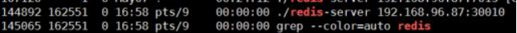

## **tomcat** 安装

1. 进入~/local/tomcat/apache-tomcat-9.0.35/webapps/asrability/WEB-INF/classes 目录， 修改 redis.properties 文件中的 redis 的地址和端口号。

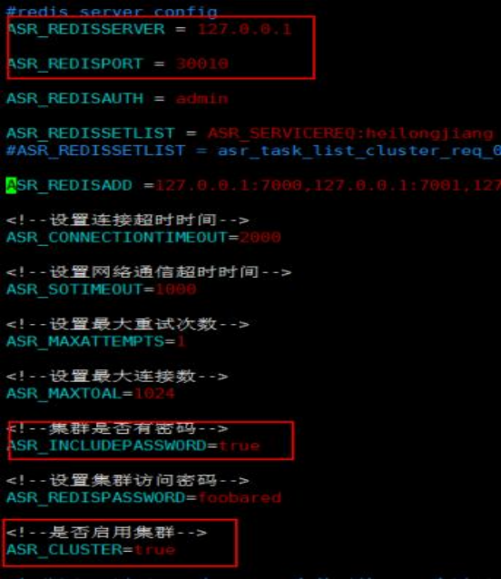

设置如下参数：

- ASR\_CLUSTER=false，连接单节点 redis；
- ASR\_INCLUDEPASSWORD=false，redis 无密码；
- ASR\_REDISSERVER=ip，redis ip;
- ASR\_REDISPORT=port，redis 端口；
- ASR\_REDISSETLIST 为 redis 队列的 key 值（默认即可）；

2. 进入目录 ~/local/tomcat/apache-tomcat-9.0.35/bin 下，`sh shutdown.sh` 关闭 tomcat 服 务，然后 `sh startup.sh` 启动 tomcat 服务。

3. 查看 tomcat 是启动状态：`ps -ef | grep tomcat`

如果有如下内容形式， 表示 tomcat 启动成功。

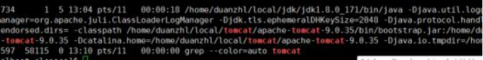

## **Decoder** 安装

### 配置 Decoder

1. 进入目录 Decoder/bin 修改启动线程数可编辑脚本 decoder.sh；

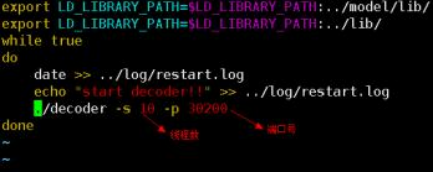

2. 进入目录 Decoder/conf，修改是否保存语音文件和识别结果：


修改 redis 服务地址端口：

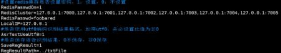

- RedisCluster 配置 redis 地址，形式为 ip:端口;

- RedisPasswdOn=0，redis 无密码;

- RedisKey 值与 tomat 中 webapps/asrability/WEB-INF/classes/ redis.properties 配置 文件里的 ASR\_REDISSETLIST 参数值保持一致；

3. 申请 licesn 授权

进入 tools 目录，在部署机器上执行 `chmod +x getinfo` 添加执行权限， 然后执 行`./getinfo`，生成的文件 localhost.localdomain\_machine.info，提供给我们，我们会根据机器信息文件申请授权， 将授权文件提供给你们。授权文件放在目录Decoder/bin 下，重命名为 license\_120.dat。

### 启动 Decoder

1、进入目录 Decoder/bin 中， 执行 `./start.sh` 启动Decoder；如需要重启 Decoder 先执行 `./shutdown.sh`，再执行`./start.sh`；

2、查看服务是否启动成功； 执行 `ps -ef | grep decoder`；出现下面界面形式， 表示启 动成功：

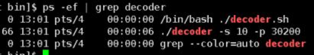

# **redis** 集群形式识别服务安装

## **redis** 集群安装

安装包里提供的安装脚本仅限于redis 集群安装在一台机器上，如果要安装在不同的机器上，需要按照 **4.1.2** 操作安装。 （4.1.1 和 4.1.2 二者选一部署）

### redis 集群安装在一台机器上

1. 进入~/locllal/redis/redis-3.2.0 目录；

修改脚本 cluster\_install\_ms.sh 里参数 master="127.0.0.1"为本机实际 ip ，保证 7000-7005 这个区间内的端口可用；如果端口不可用，修改 cluster\_ms 目录下每个文件 的端口号，然后执行 `sh cluster_install_ms.sh` 安装 redis 集群。

2. 查看 redis 集群是否安装成功

`./redis-cli -h xx.xx.xx.xx(ip) -p 7000(port) -c -a foobared(redis 密码)` 进入 redis，如下形式：

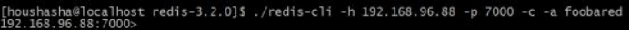

输入 `cluster info`，查看 cluster 状态，为 OK，如下形式：

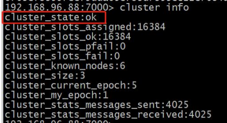

3. 查看 redis 是否启动：`ps -ef | grep redis`，如有以下内容， 说明启动成功。

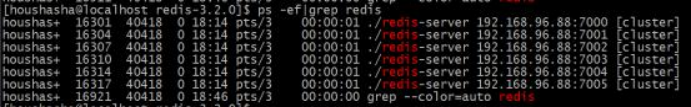

至此，redis 集群在一台机器上安装成功， 可跳过步骤 **4.1.2**。

### redis 集群安装在多台机器上

1. 进入~/local/redis/redis-3.2.0 目录；

2. 修改 cluster\_ms/7000.conf 等文件中的 IP 和 port，如下图：

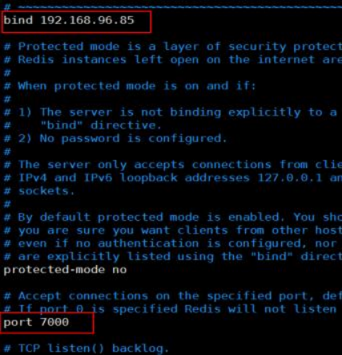

将上图中的 ip 修改为 redis 所在机器 ip。

3. 后 台 启 动redis， 执 行 `./redis-server cluster_ms/7000.conf & ./redis-server cluster_ms/7001.conf&`等等。

4. 使用 cluster meet ip port 与各节点握手：

    - 使用 `./redis-cli -h 192.168.96.88(ip) -p 7000(port) -c -a foobared(redis 密码)` 进入 redis，如下：

        

    - 输入 `cluster meet ip port`，如： cluster meet 192.168.96.88 7001; cluster meet 192.168.96.88 7002 等等，如下图：

        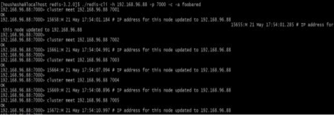

    - 查看节点信息， 输入 `clusternodes`，如下图，说明握手成功。

        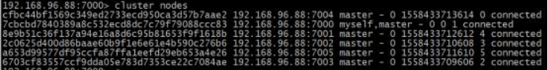

5. 给 redis 主节点分配槽值，如下图：

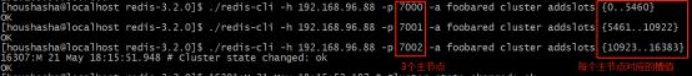

分别给 3 个主节点分配槽值。然后，进入 redis 查看节点信息：

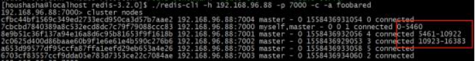

每个主节点后面会有对应的槽值。输入 `cluster info`，查看 cluster 状态，为 OK，如下图：

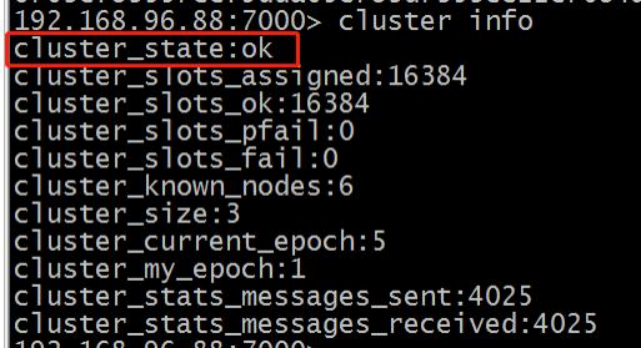

6. 使用 cluster replicate 进行集群映射

    - 使用 ./redis-cli -h 192.168.96.88(ip) -p 7000(port) -c -a foobared(redis 密码) 进入 redis，如下：

        

    - 输入 cluster nodes 查看节点信息：

        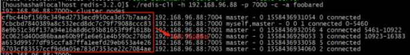

    - 分别进入 3 个从节点的redis，然后使用命令： `cluster replicate` 主节点 id。

    - 如进入7003节点，然后cluster replicate 7cbcbd7840389a8c532ecd8dc7c79f79088ccc83，则 7003 节点就是 7000 节点的从节点。如下图：

        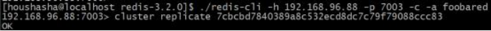

    - 查看节点信息：

        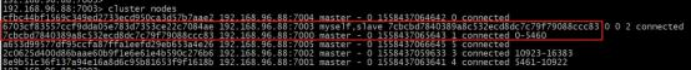

        7003 节点是 7000 的从节点。然后进入 7004，设置为 7001 的从节点，进入 7005，设置为 7002 的从节点，如下 图：

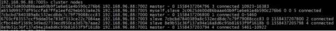

7. 查看 redis 是否启动：ps -ef | grep redis 如有以下内容，说明启动成功。


## **tomcat** 安装

1. 进入~/local/tomcat/apache-tomcat-9.0.35/webapps/asrability/WEB-INF/classes 目录， 修改 redis.properties 文件中的 redis的地址和端口号。

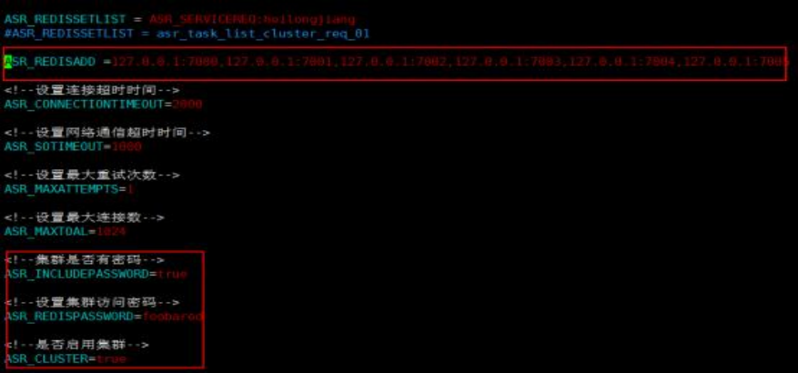

设置如下参数：

- ASR\_CLUSTER=true，连接 redis 集群；
- ASR\_INCLUDEPASSWORD=true ，redis 有密码；
- ASR\_REDISADD=ip ，redis 集群 ip 和端口;
- ASR\_REDISSETLIST 为 redis 队列的 key 值（默认即可）。

2. 进入目录 ~/local/tomcat/apache-tomcat-9.0.35/bin 下，`sh shutdown.sh` 关闭tomcat服务，然后 `sh startup.sh` 启动tomcat服务。

3. 查看 tomcat 是启动状态：`ps -ef | grep tomcat`

如果有如下内容形式， 表示 tomcat 启动成功。


## **Decoder** 安装

###  配置 Decoder

1. 进入目录 Decoder/bin 修改启动线程数可编辑脚本 `decoder.sh`；


2. 进入目录 Decoder/conf，修改是否保存语音文件和识别结果：


修改 redis 服务地址端口：

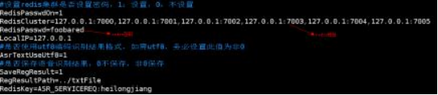

- RedisCluster 配置 redis 地址，形式为 ip:端口；

- RedisPasswdOn=1,redis 有密码;

- RedisKey 值与tomat 中webapps/asrability/WEB-INF/classes/ redis.properties 配置文件里的 ASR\_REDISSETLIST 参数值保持一致; ASR\_SERVICEREQ:test01

3. 申请 licesn 授权

进入 tools 目录,在部署机器上执行 `chmod +x getinfo` 添加执行权限， 然后执 行`./getinfo`，生成的文件 localhost.localdomain\_machine.info，提供给我们，我们会根据需要申请授权，识别授权编号：120。将授权文件提供给你们。授权文件放在目录。Decoder/bin下， 编号120授权重命名为 license\_120.dat。

###  启动 Decoder

1. 进入目录 Decoder/bin 中执行 `./start.sh` 启动 Decoder；如需要重启 Decoder 先执行 `./shutdown.sh`，再执行`./start.sh`；

2. 查看服务是否启动成功， 执行 `ps -ef | grep decoder`；出现下面界面， 表示启动成功：

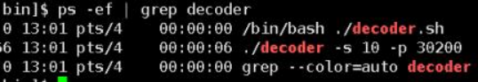

# 服务验证

1. 解压验证包 `unzip jmeter.zip` ，进入目录 jmeter/apachejmeter31/bin，修改文件 online-asr-readfile.jmx，修改 ip、端口号和 url；


下图中的 ip、端口、 url 配置有两种方式：

- **方式一：**前面步骤安装过 nginx ，ip 为 nginx 所在机器 ip，端口为 nginx 监听端口号， url 配 置为/onlineasr。

- **方式二：**前面步骤没有安装 nginx，ip 为 tomcat 机器 ip，端口为 tomcat 配置的端口号， url 配置为/asrability/onlineasr。

jmeter 脚本配置参数如下图所示：

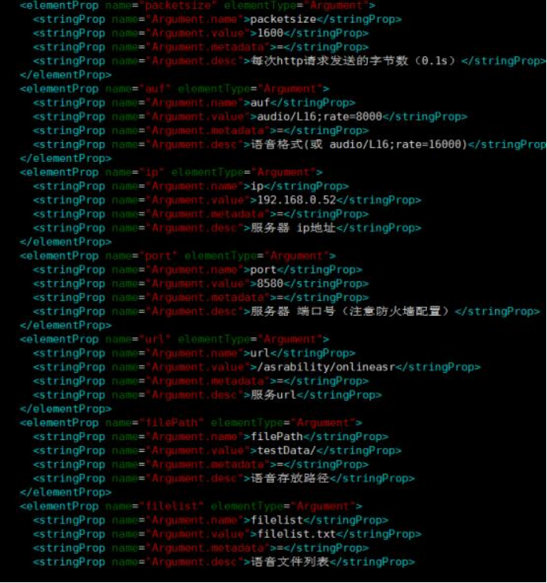

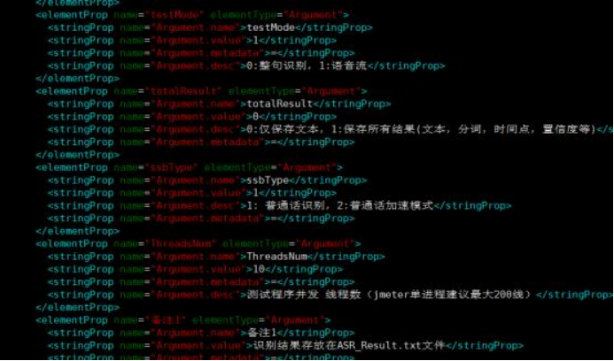

- 服务 ip：识别服务所在机器 ip；

- 服务端口：识别服务暴露的端口号；

- 服务 url；识别服务的 url；

- packetsize:每次发送的语音包大小；

- auf：发送语音的格式（audio/L16;rate=8000 表示 8k16bit）（audio/L16;rate=16000 表示 16k16bit）；

- filelist:语音文件列表；

- filePath：语音存放路径；

- testMode：是否是整句识别（0；整句，1：流式） ；

- totalResult：保存识别结果形式，0:仅保存文本，1:保存所有结果(文本，分词，时间点，置信度等)；

- ssbType: 1: 普通话识别， 2:普通话加速模式;

- ThreadsNum：线程数；

    

2. 在目录jmeter/apachejmeter31/bin 中执行下面命令

```shell
sh jmeter.sh -n -t online-asr-readfile.jmx
```

如果服务端 Decoder 的 log 有刷新，表示服务部署成功。

# 高可用 **keepalive** 配置

客户根据自己的需要配置 keepalive，如果不需要部署，可跳过当前步骤； 如果需要，参照文档 doc/keepalive 配置文档.doc。


# WebSocket部署

1. 解压tools目录下的websocket.202xxxxx.tar.gz至~/local目录下；

2. 修改WebSocket/config/application.yml


|      Key       | Value | 说明                        |
| :------------: | :---: | --------------------------- |
|      port      |       | 服务端启动端口              |
|  redisSetList  |       | 与decoder交互的redis队列名  |
| redisIsCluster |       | 是否使用集群                |
| tScoketTimeOut |       | 与decoder之间超时时间       |
|  retAuwResult  |       | 是否返回auw中间结果         |
|     nodes      |       | redis集群地址               |
|      host      |       | redis单节点地址             |
|    password    |       | redis集群密码，无密码置为空 |

3. 进入WebSocket/bin/目录执行`startup.sh`启动websocket
