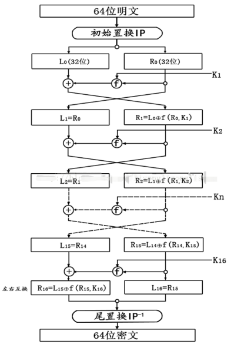
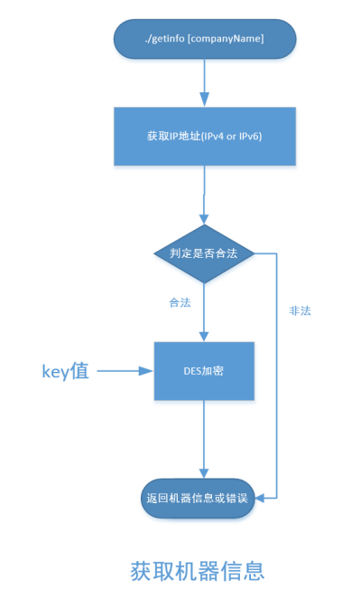
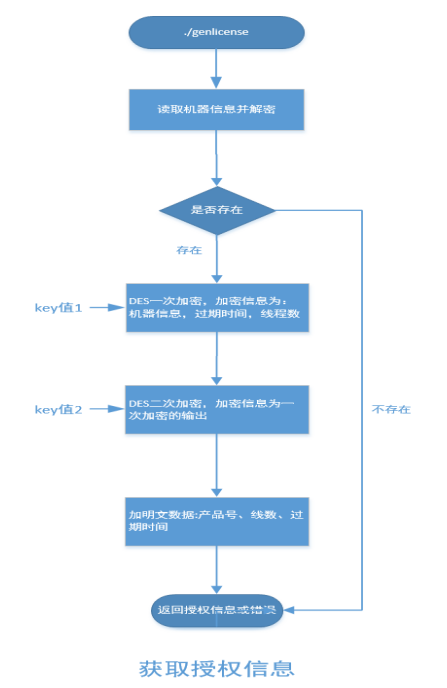
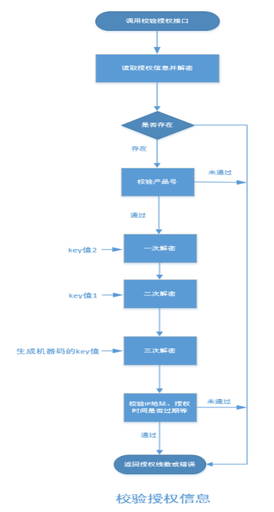

# 在线识别可执行文件及授权申请说明

1. **替换可执行文件：**

      - 将decoder文件更新到Decoder/bin目录


      - 添加执行权限，`chmod +x decoder`


2. **获取机器信息文件：**

      - getinfo文件放在目录Decoder/bin下


      - 添加执行权限，`chmod +x getinfo`


      - `./getinfo` 生成机器信息文件


3. **申请授权：**

      - 用getinfo生成机器信息文件，申请120号授权


      - 授权申请好后，授权文件重命名为license\_120.dat


      - 放在Decoder/bin目录下


# 在线识别增加授权说明

替换文件：erver.cpp，server.h，Makefile，liblicense.a，license.hpp。

将对应目录下的修改文件替换到编译环境对应目录下。

  - **src：**erver.cpp、server.h、Makefile

  - **Lib：**liblicense.a

  - **Include：**license.hpp

重新编译，生成decoder文件，替换到Decoder，**也可以直接用编译好的decoder**。

# 授权工具设计说明

## 概述

`简介`：授权工具主要功能：生成机器信息、生成授权信息、校验授权信息等。

`读者对象`：本文档是对授权工具的内部代码流程和相关技术点的整体说明，因此读者最好有一定的C和C++语言基础。

`术语定义`：DES(Des symmetric encryption)：DES对称加密。

## 总体设计

授权工具分为三个部分：**生成机器信息**、**生成授权信息**、**校验授权信息**等，其中生成机器信息、生成授权信息两个部分提供可执行文件；校验授权信息提供静态库和头文件。

### DES对称加密说明

DES(Des symmetric encryption)算法是一种最通用的对称密钥算法，对称秘钥算法的加解密秘钥都是保密的。流程图如下：



如图可知，DES加密主要由四个部分完成:

1. 初始置换IP(initial permutation);
2. 子秘钥Ki的获取;
3. 密码函数f;
4. 尾置换 IP<sup>-1</sup>

**注意：**DES 解密算法与加密算法完全相同，只需要将子密钥的使用顺序反过来即可。

### 获取机器信息流程

`./getinfo` \[companyName\] 用来获取加密后的机器信息，用来加密的信息有公司标识、IP地址(IPv4 or IPv6)等。流程如下：



### 生成授权信息流程

`./genlicense YYYYMMDD threadNum productID machinePath` 用来生成授权信息。流程如下：



### 校验授权信息流程

校验授权信息接口用来校验授权信息，流程如下：



## 数据结构设计

授权工具主要会使用到的数据结构主要有以下几个：

```c++
typedef unsigned char uchar8;
typedef char char8;
#define KEYMAXLEN (8)
#define LICENSEFINALEN (256+8\*5) 
```


## 接口设计

### 获取机器信息

**可执行文件执行说明：** `./getinfo` \[companyName\]

**注：**companyName参数可选，默认值为THINKIT

|          |                                                              |
| :------: | ------------------------------------------------------------ |
| 函数原型 | **int getMachineInfo(uchar8 *machInfEncry, uchar8 *companyName);** |
|   功能   | 获取机器信息                                                 |
| 参数说明 | machInfEncry[out]: 加密的机器信息，调用方分配空间，长度MACHINFOLEN <br />companyName[in]:  公司名称，长度KEYMAXLEN |
|  返回值  | -1: 加密机器信息失败;<br />0: 加密机器信息成功;              |
|   说明   |                                                              |


### 生成授权信息

**可执行文件执行说明：** `./genlicense YYYYMMDD threadNum productID machinePath`

**注：**

- YYYYMMDD：为授权到期日期；
- threadNum ：为线程数；
- productID：为产品号；
- machinePath：为机器信息路径。

|          |                                                              |
| :------: | ------------------------------------------------------------ |
| 函数原型 | **int genLicense(char8  *machinePath, int  productID, uchar8 *expiresTime, uchar8 *threadNum, uchar8 *licenseEncry);** |
|   功能   | 生成授权信息                                                 |
| 参数说明 | machinePath[in]:   加密后的机器信息路径,最大长度为<br />LICENSEFINALEN productID[in]:   产品号 <br />expiresTime[in]:   过期时间，长度为KEYMAXLEN，不足补0 <br />threadNum[in]:    申请线程数，长度为KEYMAXLEN，不足补0 <br />licenseEncry[out]:  生成的授权信息，长度为LICENSEFINALEN |
|  返回值  | -1代表生成授权信息失败； 0代表生成授权信息成功；             |
|   说明   |                                                              |


### 校验授权信息

|          |                                                              |
| :------: | ------------------------------------------------------------ |
| 函数原型 | **int checkLicense(char8 *licPath,  int productID);**        |
|   功能   | 校验授权信息                                                 |
| 参数说明 | licPath[in]: 授权信息路径，最大长度为LICENSEFINALEN <br />productID[in]: 产品号 |
|  返回值  | -1代表检测授权失败；其他:  授权的线程数；                    |
|   说明   |                                                              |


