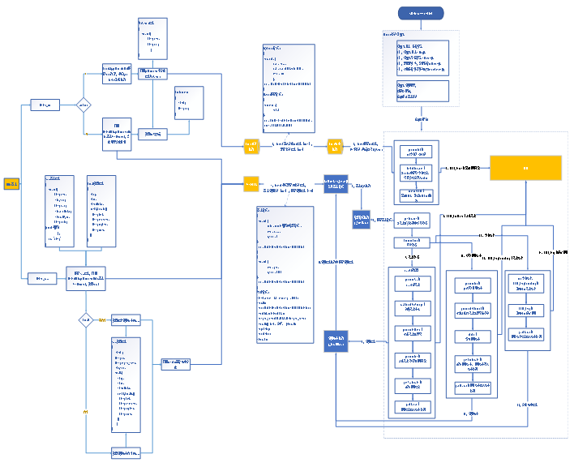
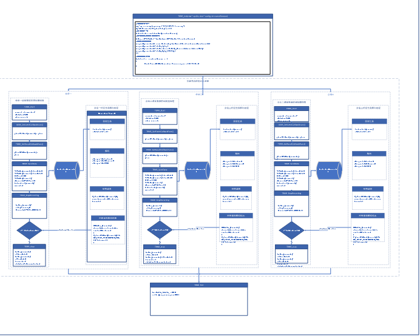

在线语音识别系统（Automatic Speech Recognition）是以语音为处理对象，通过语音信号处理技术，让机器把语音转换为相应的文本的系统。实现系统具备识别率高、性能稳定、接入方便等特点；支持一句话识别和实时识别两种服务，能够满足不同业务类型需求。实时识别是对音频流进行识别，适用于实时性要求的场景。

在线识别系统服务系统主要分为：**分布式转发服务、能力接口服务、会话缓存服务、识别引擎服务四个子系统**；

在线识别系统流程图见图1所示。

图1.在线识别系统整体流程图

1、识别引擎服务通过TBNR结果调用实现，首先TBNR\_Init接口通过调用解码器完成识别模型资源的加载构建解码网络；

2、TBNR\_Start接口开启一路语音任务处理会话；

3、TBNR\_SetEventCallBack接口设置事件回调函数，通过事件回调函数获取引擎的工作状态，TBNR\_SetResultCallBack接口设置结果回调函数，通过结果回调函数获取识别结果；

4、TBNR\_SendData接口接受语音数据并对语音数据进行端点检测，特征提取；

5、将提取的特征数据压入特征任务队列中；

6、TBNR\_StopRecording接口通知引擎送任务结束；

7、解码线程从特征任务池中获取任务送入解码器进行解码并获取识别结果并返回；

8、所有结果返回后返回TBNR\_EVENT\_RECOGNITION\_COMPLETE事件，告知当前会话识别完成；

9、可以结束当前会话TBNR\_Stop。

在线识别引擎TBNR内部流程如图2所示：

图2.识别引擎内部流程图

解码器通过读取配置文件结果获取识别资源文件信息，对识别资源文件进行加载；通过DoFeature接口获取特征任务并进行解码，在线解码器内部工作流程图如下图所示：
