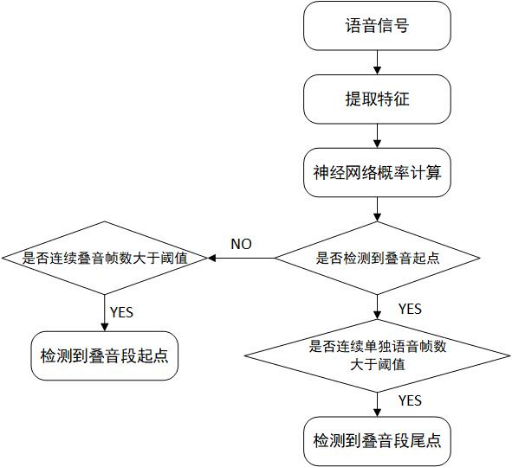
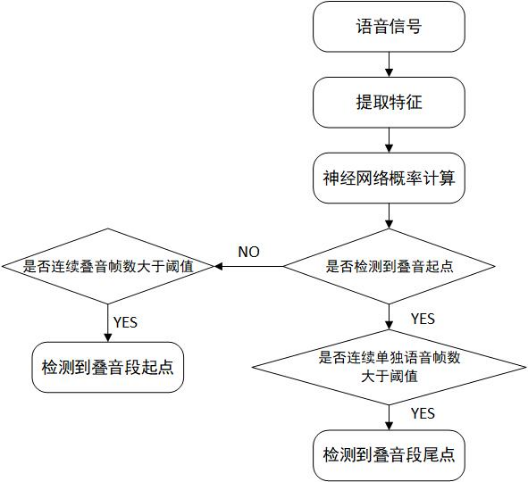
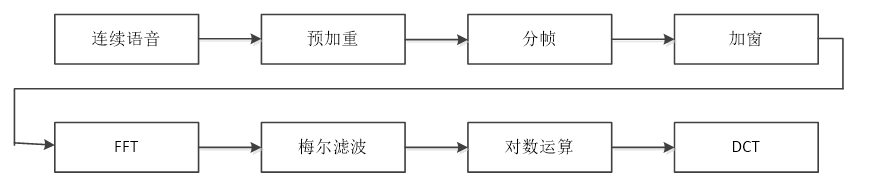
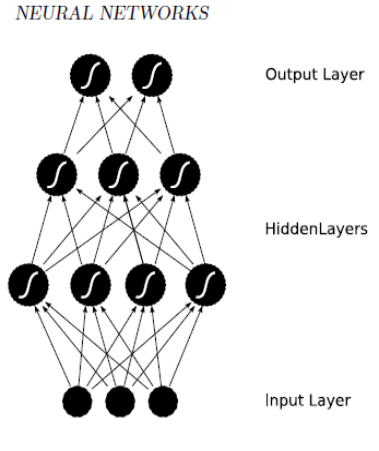
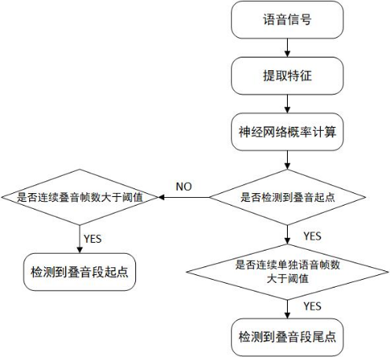
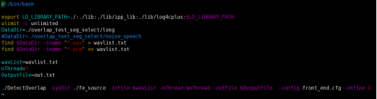
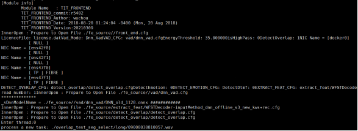
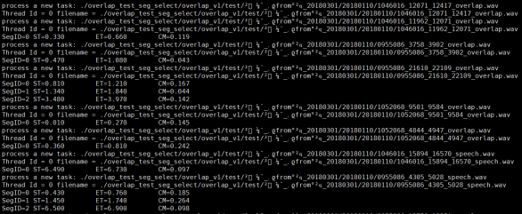

# 叠音检测源码-离线

## 叠音检测引擎工程使用说明

### 概述

叠音自动检测在语音技术领域中具有十分重要的地位。该技术是指从声音信号中寻找出多个说话人语音的重叠部分。进行有效的叠音自动检测能够对声音信号中多个说话人互相打断对话的情况进行检测。

### 编译环境

1. 编译器要求：安装4.7以上版本的gcc和g++
2. 机器环境配置： 要求64位linux系统，Centos或Redhat 6.3以上企业开发版
3. 编译步骤：make 即可生成叠音动态库：libFrontEnd.so
4. 第三方依赖库： 依赖intel 加速库，对应的so位于TBNR\_API/RelyOn/ipp\_lib/linux下，包括：

	- libiomp5.so： Intel公司发布的通用IPP函数库，用于加速计算，我们没有源码。
	- libippcoreem64t.so：Intel公司发布的通用IPP函数库，用于加速计算，我们没有源码。
	- libippcoreem64t.so.6.0：Intel公司发布的通用IPP函数库，用于加速计算，我们没有源码。
	- libippscem64t.so.6.0： Intel公司发布的通用IPP函数库，用于加速计算，我们没有源码。
	- libippsem64t.so：Intel公司发布的通用IPP函数库，用于加速计算，我们没有源码。
	- libippsem64t.so.6.0： Intel公司发布的通用IPP函数库，用于加速计算，我们没有源码。
	- libippsmx.so.6.0：Intel公司发布的通用IPP函数库，用于加速计算，我们没有源码。
	- libippsrem64t.so： Intel公司发布的通用IPP函数库，用于加速计算，我们没有源码。
	- libippsrem64t.so.6.0：Intel公司发布的通用IPP函数库，用于加速计算，我们没有源码。
	- libippsry8.so.6.0：Intel公司发布的通用IPP函数库，用于加速计算，我们没有源码。

### 整体框架

叠音检测引擎是基于深度神经网络建模的方法对录入连续的语音数据进行有效的叠音自动检测并告知叠音片段语音数据的起始位置和结束位置，从而可以利用检测出有效的叠音数据为某些特定场景应用提供信息，总体流程图如下：



语音数据送入引擎后，经过“特征提取-\>DNN概率计算 -\>结果判决”，最终得到叠音的起尾时间点。

特征提取：输入的语音数据分别经过预加重、分帧、加窗、FFT、梅尔滤波、对数运算、DCT后形成每帧40维的MFCC语音特征，语音特征数据将被送入DNN概率计算模块；

DNN概率计算：在引擎初始化阶段加载DNN模型，构建神经网络；将特征送入神经网络中，计算出后验概率，送入结果判决模块；

结果判决：根据连续的语音帧或者叠音帧是否超过阈值，来判断叠音的开始以及结束。

### 主要源代码介绍

```c++
├──extract_plp目录：特征提取
├──extractplp_api.cpp : 特征提取对外接口API。
├──handleFile.cpp： 文件句柄操作。
├──wavfile.cpp： 语音文件读取操作。
├──CreateFeature目录， 该目录实现主要功能是提取特征
├──CreateFeature.cpp:实现提取语音特征；
├──onlinecms.cpp: 进行倒谱均值减
├──PLP_NCC.cpp：提取PLP及基频残差。
├──rsrfft.cpp：实现分裂基fft算法
├──plp.cpp：提取plp特征（FBank方法）
├──PitchTracker.cpp：提取基频模块，利用频域算法提取基频
├──mfcc_hires.cpp：提取MFCC模块，实现提取MFCC特征
├──onnx_prob目录：该目录实现神经网络前向概率计算
├──onnx_vad.cpp:实现神经网络前向概率计算；
├──detect_overlap：该目录实现叠音检测功能
├──DetectOverlap.cpp：实现叠音检测功能结果输出以及外部接口
├──DSpSingle_overlap.cpp：实现叠音检测功能相关算法
```


### 函数调用流程

#### 叠音检测引擎调用流程

引擎的流程如下:

1)  初始化引擎

2)  读入语音数据，并进行DNN判别，以链表的形式返回叠音的起尾点；

#### 初始化引擎

| 函数原型 | **bool InitDetectOverlap(const char *systemDir, const char *cfg);** |
| :------: | :----------------------------------------------------------- |
|   功能   | 读取配置并初始化引擎                                         |
| 参数说明 | const char \*systemDir：系统目录地址                         |
|          | const char \*cfg: 配置文件名                                 |
|  返回值  | 成功返回true，失败返回false                                  |
|   说明   |                                                              |

#### 叠音检测

|      |                                                                                                 |
| ---- | ----------------------------------------------------------------------------------------------- |
| 函数原型 | **bool Process(float \*newSet, int nFrameNum, int startFrm, int nDuration, short nFrameSize);** |
| 功能   | 接收数据并进行DNN判别                                                                                    |
| 参数说明 | **float \*newSet：语音特征**                                                                         |
|      | **int nFrameNum：语音特征帧数**                                                                        |
|      | **int startFrm：输入语音起点绝对时间（在整通语音中）**                                                             |
|      | **int nDuration, short nFrameSize：特征系数**                                                        |
|      |                                                                                                 |
| 返回值  | 成功返回true，失败返回false                                                                              |
| 说明   |                                                                                                 |

#### 结果返回

| 函数原型 | textResult *GetResult();                                     |
| :------: | ------------------------------------------------------------ |
|   功能   | 返回结果链表                                                 |
| 参数说明 |                                                              |
|  返回值  | textResult链表头                                             |
|   说明   | typedef struct textResult\_{<br/>char pText[128]; //存储输出结果<br/>struct textResult_ *next;<br/>}textResult; |


## 叠音检测引擎概要设计说明

### 概述

#### 简介

叠音自动检测在语音技术领域中具有十分重要的地位。该技术是指从声音信号中寻找出多个说话人语音的重叠部分。进行有效的叠音自动检测能够对声音信号中多个说话人互相打断对话的情况进行检测。

#### 读者对象

本文档是对叠音检测引擎的内部代码流程和相关技术点的整体说明，因此读者最好满足如下几点条件后再读此文档：

  - 有一定的C和C++语言基础

  - 有基本的音频信号处理常识

#### 术语定义

DNN(Deep Neural Networks）：深度神经网络

### 总体设计

叠音检测引擎是基于深度神经网络建模的方法对录入连续的语音数据进行有效的叠音自动检测并告知叠音片段语音数据的起始位置和结束位置，从而可以利用检测出有效的叠音数据为某些特定场景应用提供信息，总体流程图如下：



语音数据送入引擎后，经过“特征提取-\>DNN概率计算 -\>结果判决”，最终得到叠音的起尾时间点。

  - 特征提取：输入的语音数据分别经过预加重、分帧、加窗、FFT、梅尔滤波、对数运算、DCT后形成每帧40维的MFCC语音特征，语音特征数据将被送入DNN概率计算模块；

  - DNN概率计算：在引擎初始化阶段加载DNN模型，构建神经网络；将特征送入神经网络中，计算出后验概率，送入结果判决模块；

  - 结果判决：根据连续的语音帧或者叠音帧是否超过阈值，来判断叠音的开始以及结束。

### 模块设计

#### 特征提取模块 

引擎使用梅尔频率倒谱系数（MFCC）作为声学特征，梅尔刻度是一种基于人耳对等距音高变化的感官判断而定的非线性频率刻度，与人耳听觉相符，是语音识别中常用的声学特征。MFCC特征提取模块主要流程图如下，语音输入后分别经过预加重、分帧、加窗、FFT、梅尔滤波、对数运算、DCT后形成每帧40维的MFCC语音特征，特征提取流程图如下：



#### DNN模型概率计算

提取特征之后，输入DNN模型中的，模块中的DNN模型执行了一个二分类的任务，即输出某一原始语音帧为有效音帧概率和为噪音帧的概率。我们目前采用全连接的深度神经网络（之后会考虑替换其他结构的神经网络）来得到每帧的概率输出。下图是一个典型的神经网络结构示意图，语音特征先后通过输入层、隐含层、输出层，与有效音帧概率与叠音帧之间建立复杂的映射关系。在实际运行中，将每一帧语音特征联合其前后数帧的特征作为输入矢量，检测该帧的所属的类别，之后将每帧的输出概率做为一个二维向量存储下来。



#### 起尾点判断

利用DNN输出概率之后，原始输入语音变为了一个单人语音与叠音的一维序列。之后根据起尾点寻找算法来判断该序列中叠音的起点与尾点，其中步骤主要有：

起点寻找算法：当某一有叠音帧之后连续的叠音帧超过阈值后，则认为该帧为叠音段的起点；

尾点寻找算法：当某一非叠音帧之后连续的非叠音帧超过阈值后，则认为该帧为叠音段的尾点；

### 接口设计

#### 叠音检测引擎调用流程

引擎的流程如下:

1)  初始化引擎

2)  读入语音数据，并进行DNN判别，以链表的形式返回叠音的起尾点；

#### 初始化引擎

|      |                                                                       |
| ---- | --------------------------------------------------------------------- |
| 函数原型 | **bool InitDetectOverlap(const char \*systemDir, const char \*cfg);** |
| 功能   | 读取配置并初始化引擎                                                            |
| 参数说明 | const char \*systemDir：系统目录地址                                         |
|      | const char \*cfg: 配置文件名                                               |
| 返回值  | 成功返回true，失败返回false                                                    |
| 说明   |                                                                       |

#### 叠音检测

|      |                                                                                                 |
| ---- | ----------------------------------------------------------------------------------------------- |
| 函数原型 | **bool Process(float \*newSet, int nFrameNum, int startFrm, int nDuration, short nFrameSize);** |
| 功能   | 接收数据并进行DNN判别                                                                                    |
| 参数说明 | **float \*newSet：语音特征**                                                                         |
|      | **int nFrameNum：语音特征帧数**                                                                        |
|      | **int startFrm：输入语音起点绝对时间（在整通语音中）**                                                             |
|      | **int nDuration, short nFrameSize：特征系数**                                                        |
|      |                                                                                                 |
| 返回值  | 成功返回true，失败返回false                                                                              |
| 说明   |                                                                                                 |

#### 结果返回

<table>
<tbody>
<tr class="odd">
<td>函数原型</td>
<td><strong>textResult *GetResult();</strong></td>
</tr>
<tr class="even">
<td>功能</td>
<td>返回结果链表</td>
</tr>
<tr class="odd">
<td>参数说明</td>
<td></td>
</tr>
<tr class="even">
<td>返回值</td>
<td><strong>textResult链表头</strong></td>
</tr>
<tr class="odd">
<td>说明</td>
<td><p>typedef struct textResult_{</p>
<p>char pText[128]; //存储输出结果</p>
<p>struct textResult_ *next;</p>
<p>}textResult;</p></td>
</tr>
</tbody>
</table>

### 可靠性设计

叠音检测引擎设计考虑了应用场景的复杂性和输入的多样性的情况，内部加入了大部分实际情况中会出现的异常情况的处理方案，例如超长静音、超长连续语音等异常事件的处理；并且引擎测试按照严格的7\*24小时压力测试标准进行测试，同时也针对所有异常数据进行异常情况测试，保证引擎的稳定性和可靠性。

### 扩展性设计

叠音检测引擎支持多路并发，保证了不同cpu数和内存大小的机器拓展需求；同时支持多种配置参数，以适应不同的应用场景；引擎本身遵循模块化设计，可以随时添加定制化功能，满足不同应用场景的需要。

### 维护性设计

叠音检测引擎为了方便后期的引擎维护，采用标准c/c++函数同时在较低编译器上进行编译。叠音检测引擎开放了一些内部参数，保证了引擎的可配性和可维护性。常见参数如下：

  - MSBias ：叠音帧概率加权

  - SSBias ：单人语音帧概率加权

  - MSpeechMiniLen：单人语音帧最小长度阈值

  - MNoneSpeechMiniLen：叠音帧最小长度阈值

  - MOverLapSpeechLen：叠音片段最大长度

### 易用性设计

叠音检测引擎采用c/c++接口，接口方便灵活，支持c/c++，java，python等变成语言调用，只需掌握基础的语言学习知识，即可自主设计功能模块和功能的实现。

## 叠音检测引擎代码模块接口设计说明

### 概述

#### 简介

叠音自动检测在语音技术领域中具有十分重要的地位。该技术是指从声音信号中寻找出多个说话人语音的重叠部分。进行有效的叠音自动检测能够对声音信号中多个说话人互相打断对话的情况进行检测。

#### 读者对象

本文档是对识别引擎的内部代码流程和相关技术点的整体说明，因此读者最好满足如下几点条件后再读此文档：

  - 有一定的C和C++语言基础。

  - 了解语音识别过程和原理。

  - 了解声学所识别引擎实现原理。

#### 术语定义

DNN(Deep Neural Networks）：深度神经网络

### 总体设计

叠音检测引擎是基于深度神经网络建模的方法对录入连续的语音数据进行有效的叠音自动检测并告知叠音片段语音数据的起始位置和结束位置，从而可以利用检测出有效的叠音数据为某些特定场景应用提供信息，总体流程图如下：



语音数据送入引擎后，经过“特征提取-\>DNN概率计算 -\>结果判决”，最终得到叠音的起尾时间点。

  - 特征提取：输入的语音数据分别经过预加重、分帧、加窗、FFT、梅尔滤波、对数运算、DCT后形成每帧40维的MFCC语音特征，语音特征数据将被送入DNN概率计算模块；

  - DNN概率计算：在引擎初始化阶段加载DNN模型，构建神经网络；将特征送入神经网络中，计算出后验概率，送入结果判决模块；

  - 结果判决：根据连续的语音帧或者叠音帧是否超过阈值，来判断叠音的开始以及结束。

### 接口设计

#### 引擎接口设计

##### 叠音检测引擎调用流程

引擎的流程如下:

1)  初始化引擎

2)  读入语音数据，并进行DNN判别，以链表的形式返回叠音的起尾点；

##### 初始化引擎

|      |                                                                       |
| ---- | --------------------------------------------------------------------- |
| 函数原型 | **bool InitDetectOverlap(const char \*systemDir, const char \*cfg);** |
| 功能   | 读取配置并初始化引擎                                                            |
| 参数说明 | const char \*systemDir：系统目录地址                                         |
|      | const char \*cfg: 配置文件名                                               |
| 返回值  | 成功返回true，失败返回false                                                    |
| 说明   |                                                                       |

##### 叠音检测

|      |                                                                                                 |
| ---- | ----------------------------------------------------------------------------------------------- |
| 函数原型 | **bool Process(float \*newSet, int nFrameNum, int startFrm, int nDuration, short nFrameSize);** |
| 功能   | 接收数据并进行DNN判别                                                                                    |
| 参数说明 | **float \*newSet：语音特征**                                                                         |
|      | **int nFrameNum：语音特征帧数**                                                                        |
|      | **int startFrm：输入语音起点绝对时间（在整通语音中）**                                                             |
|      | **int nDuration, short nFrameSize：特征系数**                                                        |
|      |                                                                                                 |
| 返回值  | 成功返回true，失败返回false                                                                              |
| 说明   |                                                                                                 |

##### 结果返回

| 函数原型 | textResult *GetResult();                                     |
| :------: | ------------------------------------------------------------ |
|   功能   | 返回结果链表                                                 |
| 参数说明 |                                                              |
|  返回值  | textResult链表头                                             |
|   说明   | typedef struct textResult\_{<br/>char pText[128]; //存储输出结果<br/>struct textResult_ *next;<br/>}textResult; |


## 中科院声学所叠音检测引擎数据结构设计

### 概述

#### 简介

叠音自动检测在语音技术领域中具有十分重要的地位。该技术是指从声音信号中寻找出多个说话人语音的重叠部分。进行有效的叠音自动检测能够对声音信号中多个说话人互相打断对话的情况进行检测。

#### 读者对象

本文档是对识别引擎的内部代码流程和相关技术点的整体说明，因此读者最好满足如下几点条件后再读此文档：

  - 有一定的C和C++语言基础

  - 了解语音信号处理过程和原理

#### 术语定义

DNN(Deep Neural Networks）：深度神经网络

### 数据结构设计

本节主要讲解叠音检测类主要内容，叠音检测主要的工作就是检测出原始语音中的叠音部分的起尾时间点。

  - 实现源文件：DetectOverlap.h DetectOverlap.cpp

  - 类名：cDetectOverlap

  - 模块接口函数说明：

1. cDetectOverlap();

	- 功能：构造函数，初始化引擎
	- 形参：
	- 返回值：

2. bool InitDetectOverlap(const char *systemDir, const char *cfg);

	- 功能：初始化函数
	- 形参：
		- const char *systemDir：系统目录地址
		- const char *cfg: 配置文件名
	- 返回值：成功返回true，失败返回false

3. bool Process(float *newSet, int nFrameNum, int startFrm, int nDuration, short nFrameSize);

	- 功能：叠音检测接口函数
	- 形参：
		- float *newSet：输入语音特征
		- int nFrameNum：输入语音帧数
		- int startFrm：输入语音起点绝对时间（在整通语音中）
		- int nDuration, short nFrameSize：特征系数
	- 返回值：成功返回true，失败返回false

4. bool WriteOutSmoth(int *curSegId, int beginTime, int iFrameNum, int *Dnnstate, float Ftime, float *postp);

	- 功能：叠音段输出函数，判断连续的叠音帧是否大于阈值
	- 形参：
		- int *curSegId：叠音ID
		- int beginTime：输入语音起点绝对时间（在整通语音中）
		- int iFrameNum：输入语音帧数
		- int *Dnnstate：DNN判断出的每帧状态数组
		- float Ftime：帧长
		- float *postp：每帧叠音概率数组
	- 返回值：成功返回true，失败返回false


## 中科院声学所叠音检测引擎开发测试

### 概述

#### 简介

叠音自动检测在语音技术领域中具有十分重要的地位。该技术是指从声音信号中寻找出多个说话人语音的重叠部分。进行有效的叠音自动检测能够对声音信号中多个说话人互相打断对话的情况进行检测。

#### 读者对象

本文档是对识别引擎的内部代码流程和相关技术点的整体说明，因此读者最好满足如下几点条件后再读此文档：

  - 有一定的C和C++语言基础

  - 了解语音信号处理过程和原理

#### 术语定义

DNN(Deep Neural Networks）：深度神经网络

### 测试工程

#### 测试工程 

测试工程组要完成对叠音检测引擎接口的集成，实现识别引擎对录音的转写功能。提供给用户对如何集成识别引擎，引擎具体工作流程和测试一个参考实例。

##### 测试工程目录结构说明

参考提供测试环境testproj测试工程用例。

testproj目录结构说明

  - \- main.cpp 叠音检测引擎调用

  - \- usage.cpp 读取文件相关函数实现

  - \- Makefile\_Overlap 叠音检测引擎测试工程的makefile文件

##### 测试工程编译说明

直接在编译环境中编译Makefile\_Overlap文件即可

### 测试环境

#### 测试工程 

测试环境为识别引擎完成转写等功能所依赖的运行环境。

##### 测试环境目录结构说明

```
|- NewTest_Overlap 引擎的工作目录
|-- fe_source引擎相关配置文件目录
|--- detect_overlap 叠音检测引擎配置文件及模型目录
|--- extract_feat 特征提取配置文件目录
|--- vad 有效音检测配置文件及模型目录
|-- front_end.cfg 测试用例配置文件
```


##### 测试环境使用说明

打开引擎脚本run.sh修改相应参数：

  - 修改wavList语音列表

  - 修改nThread开启线程数

  - 修改OutputFile输出文件名

  - 启动引擎启动脚本run.sh;

##### 测试环境结果查看

配置好detect\_overlap.cfg、run.sh中的相关参数，直接运行run.sh即可。

1)  “cd Overlap \_Test/bin”进入bin目录下；

2)  根据具体需求，配置detect\_overlap.cfg文件中的相应参数；

3)  根据具体需求，配置run.sh文件中的相应参数；



<center>图 3：run.sh文件配置图

4)  ./run.sh启动软件；

5)  运行过程；

软件启动后，首先进行初始化，



然后进行叠音段的起始点和尾点检测



##### 测试环境配置文件

**设置配置文件detect\_overlap.cfg**

  - WAVFORMAT---输入语音格式，目前支持8k16bit pcm

  - ANNMODEL ---叠音模型名称

  - FRMDIM---语音特征维数

  - LEFTCONT---神经网络模型左拼帧数

  - RIGHTCONT---神经网络模型左拼帧数

  - Online---缓存帧数

  - MSBias---叠音概率增益

  - SSBias---单人语音概率增益

  - MSpeechMiniLen---连续语音帧数阈值

  - MNoneSpeechMiniLen---连续叠音帧数阈值

  - MOverLapSpeechLen---叠音片段最大长度
