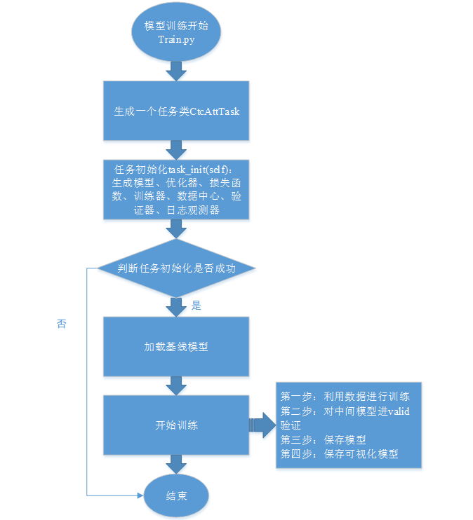
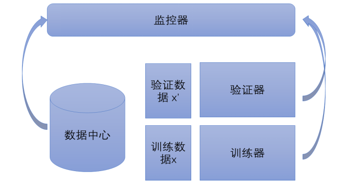
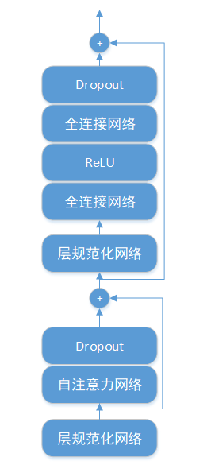
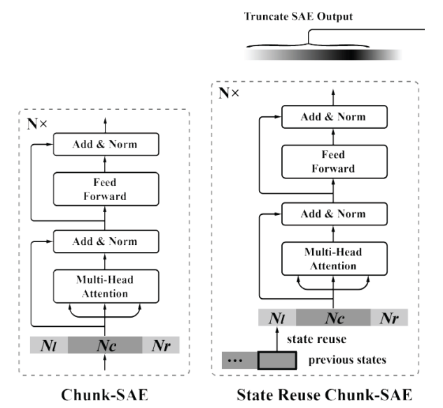
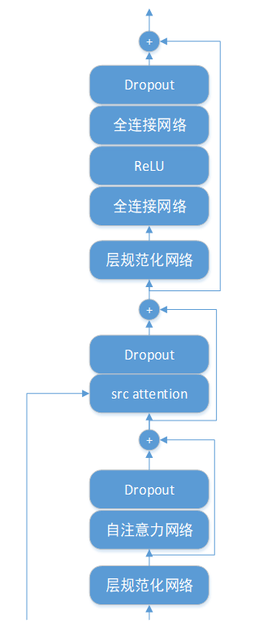
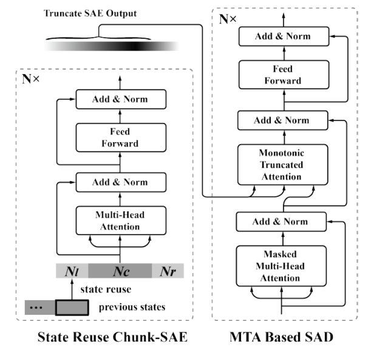
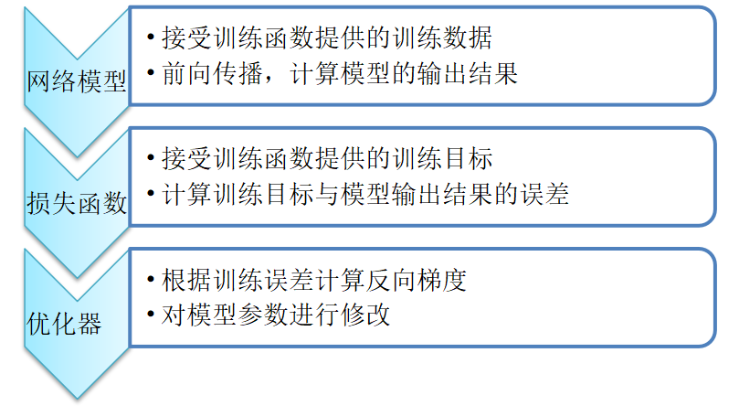
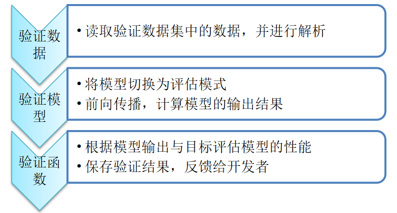

# 在线e2e模型训练源代码概要设计说明

## 概述

### 简介

训练引擎为通用的语音识别任务提供了目前性能最佳的模型训练环境，可以满足项目中大多数任务的需求。针对这些任务的训练，开发者只需要准备好相应的训练数据，便可实现对任务模型的训练。

**针对离线语音转录任务**，平台提供了基于注意力机制神经网络Transformer的混合CTC/Attention端到端语音识别模型。CTC/Attention模型采用的是编码器-解码器的序列到序列模型，基本思想就是利用两个Transformer网络分别作为编码器和解码器。编码器负责将输入语音特征压缩成指定长度的向量，这个向量就可以看成是这个序列的语义。解码器则负责根据语义向量以及注意力机制的得分生成指定的序列，这个过程也称为解码。此外，混合CTC/Attention模型还在编码器端增加了CTC分支，一方面可以利用CTC损失辅助Attention模型的训练，加速模型的收敛；另一方面，可以通过计算CTC前缀得分，提升模型的识别性能。

**针对在线语音转录任务**，平台提供了在线版本的Transformer CTC/Attention模型。相比离线模式的Transformer CTC/Attention模型，在线模型采用单调注意力计算的方式以及分段编码的方式，解决了Attention模型对全局信息依赖的问题，极大的压缩了模型的时延且对识别性能的损失极小。与其他在线模型相比，在线Transformer CTC/Attention模型的识别正确率更高，训练速度与解码更快。

### 读者对象

本文档是针对具有一定python开发的算法人员，了解深度学习的相关算法。本文档可以帮助读者快速了解语音识别模型训练流程，对语音识别形成初步认识。

### 术语定义

设正确文本字数为N，识别结果文本字数为M，按照识别结果文本与正确文本根据“最小代价匹配”原则运用动态规划算法，得到正确识别字数Mc、删除错误字数D、插入错误字数I，和替换错误字数S，则有：

- N=Mc+S+D

- M=Mc+S+I

定义以下性能指标：

- 字正确率： Mcr =(Mc／N)×100％

- 替代错误率： Ser =(S／N)×100％

- 插入错误率： Ier =(I／N)×100％

- 删除错误率： Der =(D／N)×100％

- 字错误率：WER = ((S+I+D)／N)×100％

### 参考资料

Joint CTC-Attention based End-to-End Speech Recognition using Multi-task Learning，arXiv:1609.06773

Transformer-Based Online CTC/Attention End-To-End Speech Recognition Architecture，DOI: 10.1109/ICASSP40776.2020.9053165

Joint CTC/attention decoding for end-to-end speech recognition，DOI: 10.18653/v1/P17-1048

https://github.com/espnet/espnet

## **总体设计**

训练引擎包括语音识别模型、训练任务构建等模块，其基本训练流程如下图所示：



<center>图2.1 模型训练流程图

### 语音识别模型

引擎采用的模型为Seq2Seq架构的端到端语音识别模型，包含编码器Encoder和解码器Decoder两部分。主要由卷积神经网络和注意力机制神经网络Transformer两种神经网络结构组成。

卷积神经网络主要由卷积操作和池化操作两部分组成，卷积操作通常是使用一组数量较小的参数权值卷积核，其与输入空间局部相连，并通过滑动对整个输入空间进行分析。由于卷积操作的局部链接的特性，适合于抽取更为精细的特征，可以对原始数据进行分析。池化操作等效于某种形式的下采样过程，以最大池化最为常见。它是将输入的数据划分为若干个矩形区域，对每个子区域输出最大值。该过程会不断地减小数据的空间大小，因此参数的数量和计算量也会下降，这在一定程度上也控制了过拟合。

Transformer是谷歌公司提出的解决序列转换问题的模型，使用全注意力机制的结构代替了长短时记忆神经网络中的递归结构，并在机器翻译任务中取得了巨大的进展。目前，Transformer模型在语音识别领域也有了广泛的应用。首先，使用注意力机制对信号的时序关系进行建模，避免了循环神经网络中存在的遗忘现象。其次，Transformer使用的是非递归结构，可以在GPU上实现高速的并行计算。最后，Transformer使用多个注意力头，使得Transformer可以关注到语音信号中不同维度的信息。

### 训练任务的构建

训练引擎将训练过程中每一项需求抽象为一个任务（Task）。对于每一个Task，包含**数据中心**（DataCenter），**训练器**（Trainer），**监控器**（Observer）以及**验证器**（Valider）四部分，对于一个训练任务，各部分的功能与关系如下图所示。



<center>图2.2 训练任务的构建

通过对任务类的管理，实现训练数据的读取、训练、验证等功能。

## 可靠性设计

模型训练平台考虑了输入数据的复杂性与多样性，为了确保输入训练数据的有效性，在数据加载部分对数据进行过滤，过滤太短、太长的对模型训练无任何帮助的数据，同时能够确保模型训练正常运行，防止显存占用过高导致崩溃问题出现。

模型训练平台增加了异常判断功能及相关的日志输出，可以迅速定位问题，并对模型训练进程和性能进行评估，在多个任务上进行了测试验证，保证模型训练的稳定性和可靠性。

## 扩展性设计

模型训练平台提供了标准的语音识别模板任务，同时对底层接口和数据类型进行封装，提高平台的可扩展性，方便开发者使用。

模型训练平台采用模块化设计，方便用户对模型结构、损失函数等进行扩展。

模型训练平台支持多卡进行训练，充分利用GPU资源，提高模型训练速度。

## 安全性设计

模型训练平台采用自研平台，在运行平台上实现自主可控。

对模型训练框架进行了整体设计，并搭建多元化底层框架，可以实现大规模语音识别模型的训练，并优化训练策略和训练方法，以实现安全可控的智能声学信息处理平台。

## 易用性设计

模型训练平台采用简单易用的接口设计，方便开发人员使用。模型训练提供了训练、评估、测试的脚本，用户可以直接调用上述三个脚本对模型进行训练、评估和测试，方便用户评估训练模型性能。

模型训练平台支持tensorboard日志输出功能，通过可视化的方式，对模型训练过程中的loss、acc进行监督，及时调整模型训练策略。

模型训练平台通过外部配置文件控制模型训练参数，并提供详细的配置参数说明，方便用户修改模型训练参数。

# **在线e2e模型训练代码模块接口设计说明**

模型训练平台提供了训练、预测、评估的接口，可以方便模型训练人员快速熟悉训练流程，对模型训练结果进行评估。

下面将对模型训练接口进行详细说明。

## 训练接口

模型训练主要由**bin/train.py**作为模型训练入口，下面将对主要参数进行说明：

- \-train\_config ${train\_config}   模型训练配置

- \-data\_config ${data\_conf}   模型训练数据，conf/data.yaml

- \-train\_name HKUST   模型训练名字，可以根据任务指定，该参数不重要

- \-task\_file bin.taskegs.pytorch\_backend.task\_ctc\_att\_online   核心任务类，无需修改

- \-num\_gpu 1   所使用的GPU个数

- \-task\_name CtcAttOnlineTask   任务名称，无需修改

- \-exp\_dir ${exp\_dir}   模型输出路径

- \-num\_epochs ${epochs}   epochs个数

- \-seed 100   随机数种子

- \-checkpoint $checkpoint   要加载的基线模型

- \--resume\_progress   加载基线模型的训练进程

- \--split   对数据进行split训练，以json文件个数为准

## 预测接口

模型预测主要是对模型进行预测，由**bin/predictor.py**作为入口，下面对主要参数进行说明：

- \-train\_config ${train\_config} 模型训练配置

- \-data\_config ${data\_conf} 测试数据的data.yaml文件

- \-char\_list ${char\_list} 字典

- \-gpu 1 测试使用的GPU个数

- \-model ${checkpoint} 需要测试的模型

- \-exp\_dir ${exp\_dir} 测试结果文件输出路径

## 评估接口

评估接口主要是通过sclite进行打分，由bin/evaluate.py作为入口，主要参数包括：

- \-rec ${rec} 识别结果文件

- \-ref ${ref} 参考答案文件

# **在线e2e模型训练数据结构设计**

本文档主要对模型训练平台所使用的类函数进行详细说明。

## 语音识别模型

语音识别模型采用基于注意力机制的transfomer+ctc联合训练，下面将对模型各个模块进行详细介绍。

语音识别模型对应代码模块为：

1. eteh.models.pytorch\_backend.model.e2e: **E2E\_Transformer\_CTC\_Online**
2. eteh.models.pytorch\_backend.net.transfomer

### 前端神经网络

前端神经网络主要由卷积层和位置编码层组成，将提取的声学特征输入到前端神经网络层，由前端神经网络对声学特征进行非线性变换和四分之一的降采样，输出高维特征序列。**声学特征一般采用MFCC 40维特征**。

前端神经网络由**两层二维卷积、一层线性网络和一层位置编码网络构成**，其中卷积网络和线性层主要实现代码为：

- eteh.models.pytorch\_backend.net.transfomer.subsampling: **Conv2dSubsampling**

卷积网络卷积核大小为3、步长为2，卷积核数量第一层卷积为64，第二层卷积为128，经过两层卷积后，特征序列的长度变为原来长度的四分之一，线性层将卷积层输出投影到320维，计算过程如下：
$$
Y = Linear(ReLU(Conv(ReLU(Conv(X))))
$$
位置编码层采用正余弦函数作为位置编码层，其计算公式如下：
$$
\begin{aligned}
&p_{i, 2 k+1}=\sin \left(i / 10000^{2 k / d_{-} \text {model }}\right) \\
&p_{i, 2 k+2}=\cos \left(i / 10000^{2 k / d_{-} \text {model }}\right)
\end{aligned}
$$
主要实现代码为：

- eteh.models.pytorch\_backend.net.transfomer.embedding: **PositionalEncoding**

**注**：实际代码中用到了一个数学变换：
$$
1 / 10000^{2 i / d_{\text {model }}}=e^{\log 10000^{-2 i} / d_{\text {model }}}=e^{-2 i / d_{\text {model }} * \log 10000}=e^{2 i *\left(-\log 1^{10000} / d_{\text {model }}\right)}
$$
其中，$i$ 代表时间位置，$k$ 代表特征维度数，$d\_model$为特征维度，这里值为320。

前端神经网络的输出为：$z_i = y_i + p_i$


### encoder层

相关代码：

1. eteh.models.pytorch\_backend.net.transfomer.encoder: **Encoder**
2. eteh.models.pytorch\_backend.net.transfomer.encoder\_layer: **EncoderLayer**

编码层由**14个相同的Transfomer模块堆叠而成**，每个transfomer模块依次为**一层层规范化网络、一层自注意力网络（SAN）、一层残差网络、一层层规范化网络、一层全连接网络和一层残差网络**。



<center>图1-1 transformer编码器网络

encoder编码层**输入特征维度320维**，采用多头自注意力机制，这里注意力采用**8头注意力机制**，将特征进行分块，每块特征维度为40维，最后再将分块特征进行拼接，最终输出维度仍为320维，计算公式如下：

$$
\text{Attention}\left( Q,K,V \right) = softmax(\frac{\text{QK}^{T}}{\sqrt{d_{k}}})V
$$
这里$d_{k}$代表特征块维度，主要对注意力分数进行缩放，防止分子数值过大在过softmax之后值过大或者过小。

将注意力网络的输入和输出特征相加作为残差网络的输出特征，并将残差网络的输出输入的层规范化网络，计算公式如下：

$$
\begin{aligned}
&\mu=\frac{1}{d_{\text {model }}} \sum_{i=1}^{d_{\text {model }}} h_{i}, \text { var }=\frac{1}{d_{\text {model }}} \sum_{i=1}^{d_{\text {model }}}\left(h_{i}-\mu\right)^{2}\\
&\widetilde{h_{i}}=\frac{h_{i}-\mu}{\sqrt{\text { var }+10^{-12}}} \cdot w_{i}+b_{i}
\end{aligned}
$$
其中对每一帧输入特征$h$计算均值$\mu$和方差$var$，通过模型参数$w_{i}$和$b_{i}$对$h$的每个维度数值进行规整和线性变换，输出新的特征序列$\widetilde{h}$。之后将层规范化网络的输出特征输入全连接网络，该网络的计算公式为：

$$
F\left( x \right) = \operatorname{Dropout(max}\left( 0,xW_{1} + b_{1} \right)W_{2} + b_{2})
$$
最后将层规范网络的输入和全连接网络的输出特征相加，得到得到encoder模块的输出。

对于流式语音识别，需要在离线的基础上对encoder层进行改进，这里我们提出了采用chunk-SAE，即将语音切分成独立的不交叠的$N_{c}$大小的chunk，同时为了获取上下文信息，对左右进行拼帧，左边历史帧长$N_{l}$，右边未来信息帧长$N_{r}$，这里拼帧只是为了获取当前chunk的上下文，并不作为实际chunk输出。这里chunk大小以及左右拼接长度都是通过模型训练配置conf文件进行控制的。

同时，为了减少计算复杂度，我们提出了**状态复用算法**（State reuse chunk-SAE），保留上一个chunk计算的隐层状态，作为下一个chunk的历史信息，提高运算效率。

其计算公式如下：

$$
Q_{\tau}^{l},K_{\tau}^{l},V_{\tau}^{l} = \ h_{\tau}^{l - 1},{\widetilde{h}}_{\tau}^{l - 1},{\widetilde{h}}_{\tau}^{l - 1}  \\

\text{where\ }{\widetilde{h}}_{\tau}^{l - 1} = Concat(SG\left( s_{\tau}^{l - 1} \right),\ h_{\tau}^{l - 1})
$$
公式中，SG(•)函数代表不进行梯度更新，Concat(•)代表将历史状态和当前状态拼接。$\tau$代表当前chunk，$l$代表层数。

通过使用状态复用算法，计算复杂度降低了$\frac{N_{l}}{N_{l} + N_{c} + N_{r}}$。并且，这种方法可以捕获更长范围的依赖信息。



<center>图1-2 chunk-SAE and state reuse chunk-SAE

#### ChunkEncoder类

该类位于：eteh.models.pytorch\_backend.net.transfomer.encoder: **ChunkEncoder**

**函数说明**：

`初始化函数：__init__`

**参数说明**：

- idim：输入特征维度

- attention\_dim：注意力特征维度
- attention\_heads：注意力头个数
- linear\_units：线性单元维度
- num\_blocks：block个数
- dropout\_rate：PositionalEncoding层的dropout概率
- positional\_dropout\_rate：PositionalEncoding层的dropout概率
- attention\_dropout\_rate：注意力层之后的dropout概率
- input\_layer：encoder的输入层
- pos\_enc：位置编码
- normalize\_before：控制是否做normalize
- left\_len：chunk的历史信息长度
- cur\_len：当前chunk长度
- right\_len：chunk的未来信息长度
- use\_mem：是否使用状态复用
- use\_grad：是否进行梯度更新


`forward(self, xs, masks, tags=None)`

**函数功能**：实现chunk-Encoder的前向计算，抵用chunk\_iter对特征进行分块，然后利用\_forward函数进行chunk大小的前向计算

**输入参数**：

- xs：声学特征

- mask：mask信息


`_forward(self, xs, masks, tags, pos)`

**函数功能**：chunk大小的前向计算

**输入参数**：

- xs：chunk大小的特征

- mask：chunk大小的mask信息

- pos：位置信息


`chunk_iter(self, xs, masks)`

**函数功能**：对输入数据进行切分，分成chunk大小的数据块

**输入**：

- xs：输入的特征数据

- masks：输入的mask

**返回值**：以iter的形式返回chunk大小的数据块


#### StreamEncoderLayer类

该类位于：eteh.models.pytorch\_backend.net.transfomer.**encoder\_layer**，chunk-Encoder的每一层的信息

函数说明：

`init_mems(self):`

**函数功能**：初始化历史状态信息


`update_mems(self, x)`

**输入参数**：更新状态复用特征

- x：输入特征

#### CashedEncoderLayer类

该类继承了StreamEncoderLayer类，主要实现流式EncoderLayer层的前向计算。

`forward(self, x, mask, tags):`

**函数功能**：流式EncoderLayer前向计算

**输入函数**：

- x：embeding之后的声学特征

- mask：mask信息

#### decoder层

相关代码：

1. eteh.models.pytorch\_backend.net.transfomer.decoder: **Decoder**
2. eteh.models.pytorch\_backend.net.transfomer.decoder\_layer: **DecoderLayer**

解码层**由7个相同的Transfomer模块堆叠而成**，每个transfomer模块依次为**一层层规范化网络、一层自注意力网络（SAN）、一层残差网络、一层src注意力网络、一层层规范化网络、一层全连接网络和一层残差网络**。



<center>图1-3 transformer解码器网络

解码器相当于自回归的语言模型，它将编码器计算得到的第二特征序列送入解码器，输出多组汉字序列并对输出多组汉字序列进行打分。除了src 注意力网络之外，其他网络模块与编码器网络计算方法一致，这里我们主要介绍src attention网络。

计算公式如下：

$$
\text{Attention}\left( Q,K,V \right) = softmax(\frac{\text{QK}^{T}}{\sqrt{d_{k}}})V
$$
这里的K和V采用的是encoder编码层输出的特征，Q采用的是decoder第一层残差网络的输出。

### 单调截断注意力机制（MTA）

相关代码：

- eteh.models.pytorch\_backend.net.transfomer.attention: **MTMultiHeadedAttention**

对于流式语音识别，我们提出了采用基于自注意力机制的单调截断注意力机制（MTA），以从左到右的单调方式截断，并对截断后的SAE输出计算注意力结果。在decoder层，MTA机制被应用的decoder的每一层，如图所示：



<center>图1-4 截断注意力机制

设特征维度为\(d_{m}\)，MTA在训练截断并行执行如下操作：

$$
\text{MTA}(\mathbf{Q},\mathbf{K},\mathbf{V}) = (\mathbf{P} \odot \text{cumprod}(\mathbf{1} - \mathbf{P}))\mathbf{V}\mathbf{W}_{v}  \\

\mathbf{P} = \text{sigmoid}\left( \frac{\mathbf{Q}\mathbf{W}_{q}\mathbf{W}_{k}^{\top}\mathbf{K}^{\top}}{\sqrt{d_{m}}} + r + \varepsilon \right)
$$
其中$r$为可训练的参数，$\varepsilon$为高斯噪声，定义$\mathbf{P =}\{ p_{i,j}\}$为截断概率矩阵，其中$p_{i,j}$代表预测第$i$个输出label时，截断第$j$个SAE输出的概率。

主要函数：`forward_attention(self, value, scores, mask, tags=None)`

函数功能：单调截断注意力前向计算

#### MTMultiHeadedAttention类

`forward(self, query, key, value, mask, tags=None, ep=None)`

**函数功能**：实现Q、K、V的计算以及注意力scores的计算，并调用forward\_attention函数

**输入参数**：

- query：decoder语言层的query，shape=\[batch\_size, y\_len, attention\_dim\]

- key：encoder的输出，同value，shape=\[batch\_size, t\_len, attention\_dim\]

- mask：mask信息，shape=\[batch\_size, 1, t\_len\]


`forward_attention(self, value, scores, mask, tags=None)`

**函数功能**：实现注意力信息的计算

**输入参数**：

- value：注意力机制中的V，shape=\[batch\_size, 1 , t\_len, attention\_dim\]

- scores：计算出的注意力得分， shape=\[batch\_size, 1, y\_len, t\_len\]

- mask：mask信息，shape=\[batch\_size, 1, t\_len\]


`safe_cumprod(x, *args, **kwargs)`

**函数功能**：重写了cumprob函数，实现求累积乘积，结果中含有每一步计算的结果

**输入参数**：

- x：1-sigmoid(scores)

**返回值**：概率累积，最后元素值为1，shape=\[batch\_size, 1, y\_len, t\_len\]


### 损失函数

端到端模型训练的损失函数采用ctc loss和attention loss以及align对齐损失，采用三者之后作为最终的损失值进行梯度更新，其计算公式如下：

$$
L_{\text{sum}} = \left( 1 - rate \right) \ast L_{\text{att}} + rate \ast L_{\text{ctc}} + \ ali_{\text{rate}} \ast L_{\text{ali}}
$$
相关代码：

1. eteh.models.pytorch\_backend.criterion.**loss:E2E\_Loss**   端到端损失函数
2. eteh.models.pytorch\_backend.criterion.loss:**CTC\_CE\_Online\_Loss**   在线端到端损失，该类继承E2E\_Loss类
3. eteh.models.pytorch\_backend.criterion.customize\_loss: **Align\_Loss**   对齐损失
4. eteh.models.pytorch\_backend.criterion.cross\_entropy:**CTC\_Loss**   ctc损失
5. eteh.models.pytorch\_backend.criterion.cross\_entropy: **LabelSmoothingLoss**   标签平滑损失

#### CTC\_CE\_Online\_Loss

该类继承了E2E\_Loss类，在ctc损失和标签平滑损失的基础上，添加了align对齐损失函数。

**初始化方法：\_\_init\_\_**

**函数功能**：初始化Align\_Loss类


`forward(self, att_out, ctc_out, ali_out, att_label, ctc_label, ctc_len, label_beg, label_end)`

**函数功能**：实现在线损失函数的计算

**参数说明**：

- att\_out：decoder的概率输出

- ctc\_out：ctc的概率输出

- ali\_out：align对齐的输出

- att\_label：输出标签y

- ctc\_label：ctc输出标签

- ctc\_len：ctc时间长度

- label\_beg：对应label的起始时间

- label\_end：对应label的结束时间


**返回值**：总的损失函数值，按照比例加权求和

- att\_loss：注意力损失

- ctc\_loss：ctc损失

- ali\_loss：对齐损失


#### Align\_Loss

**初始化方法：\_\_init\_\_**

**功能**：实现端到端训练align损失函数的初始化

**参数说明**：

- ali\_type: align损失的类型，这里值为“mid”


`forward(self, ali_out, ali_beg, ali_end, hlen)`

**函数功能**：align loss的前向计算

**参数说明**：

- ali\_out：每一层encoder输出的对齐信息

- ali\_beg：align对齐的开始时间点

- ali\_end：align对齐的结束时间点

**返回值**：计算出的对齐损失

#### E2E\_Loss类：

**初始化方法：\_\_init\_\_**

**功能**：实现端到端训练总的损失函数的初始化，分别为ctc损失和attention损失

**参数说明**：

- rate: ctc损失函数的占比，一般设置为0.3


前向计算方法：`forward(self, att_out, ctc_out, data_len, att_label, ctc_label, ctc_len)`

`参数说明：`

- att\_out：attention的输出，维度为\[batchsize, length, 5720\]
- att\_label: label对应的id，为标准答案

上述两个参数为计算attention损失用到的

- ctc\_out: ctc输出，维度为\[batchsize, max(timeLen), 5720\]
- data\_len: 原始特征数据时间长度，维度为\[batchsize\]，value值为每个utt对应的时长（帧）
- ctc\_label: ctc对应的输出label，答案，维度为\[batchsize, max(input\_len)\]
- ctc\_len: ctc输出的时间长度，经过四倍将采样，维度为\[batchsize, 1\]

**返回值**：最终的损失函数计算的损失值

#### CTC\_Loss类：

`初始化方法：__init__`

**功能**：初始化ctc损失函数，这里使用torch.nn.CTCLoss(reduction=reduction\_type)，这里reduction\_type=”sum”，这里指对output losses求和处理，“mean”是指取均值，none是不做任何处理。


`前向计算方法：forward(self, out_pad, out_len, label_pad)`

**函数功能**：实现ctc损失函数的计算

输入参数说明详见E2E\_Loss类。


`损失函数计算方法：loss_fn(self, th_pred, th_target, th_ilen, th_olen)`

**函数功能**：这里ctc\_type值为“builtin”,计算出来的损失除以batch\_size大小，返回batch平均的损失。

**参数说明**：

- th\_pred: ctc输出，维度为\[max(timeLen), batchsize,5720\]
- th\_target: 目标label
- th\_ilen: ctc 四倍将采样输出长度
- th\_olen: ctc label对应的长度


#### LabelSmoothingLoss类：

`初始化方法：__init__`

**参数说明**：

- size: 字典大小，这里值为5720
- padding\_idx: padding值-1
- smoothing: 标签平滑用的平滑值
- normalize\_length: 长度归一化，false
- criterion: 损失函数，这里采用torch.nn.KLDivLoss(reduce=False)


`前向计算方法：forward(self, x, target)`

**函数功能**：对标签进行平滑，计算KL散度，实现attention损失的计算

**输入参数**：

- x: attention的输出

- target: 目标标签对应的索引序列

## 训练任务的构建 

训练任务的构建主要包括数据中心、训练器、监控器、验证器四个部分，下面我们将分别进行介绍。

###  数据中心

数据中心负责管理训练数据，包括对训练数据的筛选、排序、切分、打包等预处理工作。数据中心对数据进行统一的管理，根据服务器的负载能力以及任务的训练方式规划数据的读写速度、缓存大小以及训练batch的规模，使得开发者不必在训练过程中关心数据格式、物理位置以及数据大小，避免出现训练结果发散、机器资源不足、GPU显存不足等问题。主要相关代码为：

1. eteh.data.data:Data
2. eteh.data.data:Label
3. eteh.data.datacenter: DataCenter
4. eteh.data.dataloader: StandDataLoader
5. eteh.data.dataset: BaseDataSet
6. eteh.data.dataset: JsonDataPacker

### DataCenter类：

数据管理中心，数据处理的入口。

`初始化函数：__init__`

`参数说明`：data\_config: data.yaml文件

`属性说明`：

- self.source\_paths: 训练数据路径

- self.valid\_paths: 验证集路径

- self.data\_num: 训练数据中json文件个数

- self.seq: list列表，json文件索引序列

- self.epoch: 当前epoch值

	

`refresh(self, epoch=0)：`

**函数功能**：每迭代完一个epoch，进行刷新，重新初始化随机数种子，对json文件索引序列进行随机排序，保证每个epoch数据读入json数据的顺序不同。

**输入参数**：

- epoch: 当前epoch值


`get_dataset(self,data_type, *args, **kwargs)`

`函数功能`：获取训练的数据的DataSet

`参数说明`：

- data\_type: 数据类型，这里我们使用的是“json”格式的训练数据

`返回值`：

- data\_set：返回生成的DataSet训练数据

	

`write_thread(self, data_type, *args, **kwargs)`

`函数功能`：线程调用的函数，实现数据读取，这里采用多线程的信号量控制数据的读取。


`GetDataLoaderIter(self, data_type, *args, b_size=1, data_loader_threads=1, shuffle=True, **kwargs)`

`函数功能`：训练每个epoch的时候读取数据，split为true的时候调用，一个文件一个文件的处理(json文件)


`GetUnDistributedDataLoader(self,data_type, b_size, data_loader_threads, *args, source="train", shuffle=False, **kwargs)`

`函数功能`：初始化valid的时候读取验证数据集


#### dataset.py

##### JsonDataPacker类

`packData(self, json_item)：`

**函数功能**：对json数据进行封装，这里调用了该类的read\_input和read\_output，这里不再单独介绍

**输入参数**：

- json\_item: 训练数据中一个json样本

**返回值**：

- input\_x：Data类型的输入数据
- output\_y：Label类型的输出数据
- other\_z：未用到


**unpackData(self, batch)**

**函数功能**：对batch数据进行unpack操作，这里调用了unpack\_input和unpack\_output函数，这里不再详述

**输入参数**：

- batch：batch数据

**返回值**：

- data：字典，包含训练数据的各字段，形式如下：

```python
data = {
    "utt_ids": utt_ids,
    "x": x,
    "y": y,
    "x_len": x_len,
    "y_len": y_len,
    "other": z,
}
```


##### TimeAliJsonPacker类

该类继承了JsonDataPacker类，主要是因为在线比离线多了一些信息，即label对应的起始时间。

`初始化函数：__init__`

**主要功能**：初始化json文件中对应的开始和结束时间的字段名称


`read_other(self, json_item):`

**函数功能**：读取每个utt文本对应的起始时间和结束时间

**返回值**：

- y\_beg：起始时间

- y\_end：结束时间

	

`unpack_other(self, pz):`

**函数功能**：unpack时间信息

##### JsonDataSet类

该类继承BaseDataSet，BaseDataSet继承torch.utils.data.DataSet类

`load_ark_file(self, source_paths, data_path="")：`

**函数功能**：读取json训练数据，打batch，生成train\_set 列表

**输入参数**：

- source\_paths：训练数据路径，例如/home/thinkit/data.1.json

	

`JsonItem2Data(self, jbanchs, load=False)：`

**函数功能**：打完batch以后，解析json格式数据，封装成Data和Label格式类型数据

**输入参数**：

- jbanchs：batch数据

**返回值**：

- data\_list：数据列表


`MergeBatch(self, batch, ignore_id = -1)：`

`函数功能`：对batch进行unpack操作

##### AlignJsonDataSet类

该类继承了JsonDataSet类，在线模型训练时，需要读入align信息，重写了JsonItem2Data、MergeBatch函数，这里不再详述。

#### dataloader.py

##### StandDataLoader类：

该类继承了torch.utils.data的DataLoader类，实现训练数据加载。

#### data.py

##### Data类：

`初始化函数：__init__`

**参数说明**：

- name：utt的名字

- shape：特征数据的维度

- source：特征数据的路径，kaldi格式：eg. /data/deltafalse/feats.1.ark:48

- value：特征值

- load：如果是true，在创建Data类型对象的时候对特征数据进行读取，如果false，通过getvalue函数读取特征数据

- file\_type：特征数据类型，这里我们使用kaldi数据类型

	

`获取特征数据函数：getvalue`

**函数功能**：调用tryread函数读取特征数据

**返回值**：

- value：特征数据值


`读取特征数据函数：tryread(self, source)`

**函数功能**：读取特征数据

**输入参数**：

- source：特征数据路径

**返回值**：

- value：特征数据值

- shape：特征维度


`函数：MergeData(data_list, pad_value=0)`

**函数功能**： 对输入特征进行padding，这里主要是对batch大小数据的处理

**输入参数**：

- data\_list：数据列表

- pad\_value：padding值

**返回值**：返回三个list列表

- utt\_id：utt列表

- input\_mat：特征矩阵（B, T，D），B代表有多少条数据，即batch\_size大小，T代表一个batch里长度最长的数据，D代表特征维度

- num\_frs：数据帧数列表，每个utt对应的帧数

##### Label类：

`初始化函数：__init__`

**参数说明**：

- name：utt的名字

- label\_type：\['idx', 'one hot', 'value'\]，这里我们采用idx参数，a tensor with shape \[1\]

- label：label值

- dim：label的维度，默认1，label\_type为'idx'的时候无意义


**MergeLabel(label\_list, ignore=-1)**

**函数功能**：对输出标签进行padding

**输入参数**：

- label\_list：label数据列表

**返回值**：

- input\_mat：padding之后label标签\[B, T, 1\]

- num\_frs：每个utt的label输出长度的list

##### JsonDataPacker类

`packData(self, json_item)：`

**函数功能**：对json数据进行封装

**输入参数**：

- json\_item: 训练数据中一个json样本

#### 数据处理工具类

主要代码：

- eteh.utils.json\_utils
- CleanData: 对输入输出数据长度进行限制，以免造成显存溢出
- make\_batchset: 对训练数据进行分割，生成batch\_size大小的数据
- batchfy\_by\_seq: 分割batch使用的方法，这里采用“seq”方式，即按照utt个数进行

### 训练器

训练器包括**训练模型**、**损失函数**以及**优化器**三部分，训练器按照步数，将数据中心提供的数据送入模型进行前向计算，再根据模型的计算结果与实际的标签数据利用损失函数计算误差，之后，训练器通过优化器进行反向传播，对训练模型的参数进行更新。

其训练流程图如下：



<center>图2-1 训练器流程图

主要代码：

`eteh.tools.trainer:Trainer`

**初始化方法：：\_\_init\_\_(self, model, criterion, optimizer, acc\_grad=1)：**

**函数功能**：模型训练器，需要定义三个组件，分别为模型、损失函数（torch.nn.Module）和优化器（torch.nn.optimizer）

**参数说明**：

- model：定义的模型

- criterion: 损失函数

- optimizer: 优化器

- acc\_grad：定义是否进行梯度累积，acc\_grad个batch更新参数


**train\_batch(self, data, label, \*arg, max\_grad\_norm=5, \*\*args)**

**函数功能**：对每个batch数据进行训练


`eteh.tools.interface.pytorch\_backend.th\_trainer: TH\_Trainer`

训练器的接口类。

### 监控器

**监控器主要实现tensorboard日志和其他日志的输出**，供开发者了解模型训练进度以及loss和lr等各项指标，监测模型训练是否异常，方便开发者及时介入修正。监控器按照观察者模式（Observer Pattern）进行设计，当训练任务的状态发生变化时，则会自动通知监控器，监控器对训练状态进行记录，从而降低了监控器对服务器资源的占用。监控器与训练过程保持独立，监控器的运行状态不会对训练流程造成干扰，从而保障了训练的可靠性。

主要代码：

1. eteh.tools.reporter:Reporter
2. eteh.tools.observer:ReporterObserver
3. eteh.tools.observer: TensorBoardObserver
4. bin.taskegs.pytorch\_backend.task\_ctc\_att: E2E\_Observer
5. bin.taskegs.pytorch\_backend.task\_ctc\_att: E2E\_Observer\_tensorboard

E2E\_Observer继承了ReporterObserver，主要输出其他类型日志，E2E\_Observer\_tensorboard继承了TensorBoardObserver，输出tensorboard日志。

输出日志项包括：

- Time：耗时
- Lr：学习率
- Loss：总的损失
- Corr：字正确率
- Att-Loss：attention损失
- Ctc-Loss：ctc损失

### 验证器

验证器负责对训练模型进行交叉验证，交叉验证的基本思想是在某种意义下将原始数据进行分组，一部分作为训练集，另一部分作为验证集，训练集与验证集的划分由数据中心负责。验证器负责利用验证集来测试模型性能，以此来作为评价分类器的性能指标，以检验模型训练过程中的状态，避免出现过拟合、欠拟合现象的发生。

验证器包括验证数据集、验证函数以及验证模型三部分。其中验证集由数据中心提供，验证模型由由训练器提供，验证函数是验证器的核心，需要由开发者指定。验证器在验证时，会依次将数据中心的验证数据送给验证模型进行计算，再通过验证函数对模型的性能进行评估，最终通过监控器将验证集的准确率输出到log日志。

其流程如下：



<center>图2-2 验证器流程图

主要代码：

- eteh.tools.valider: Valider
- bin.taskegs.pytorch\_backend.task\_ctc\_att: E2E\_Valid

#### E2E\_Valid类

该类位于**bin.taskegs.pytorch\_backend.task\_ctc\_att**脚本，主要实现对验证集进行性能验证。

`初始化函数：__init__`

**参数说明**：

- dataloader：数据加载器
- model：模型
- criterion：损失函数


`valid_function(self, data, model)`

**函数功能**：利用训练好的模型对valid验证集进行验证

**参数说明**：

- data：验证数据

- model：模型

**返回值**：

- att\_corr：attention的正确率
- ctc\_corr：ctc的字错误率
- loss.item()：损失函数值
- torch.sum(ylen).item(): 答案标签长度

### 任务管理器

任务类实现对训练任务的管理，管理模型、训练、验证以及数据的获取和传送，是本平台的训练任务的核心模块。

相关代码：

1. bin.taskegs.pytorch\_backend.task\_ctc\_att:CtcAttTask
2. eteh.tools.interface.pytorch\_backend.th\_task: TH\_Task
3. eteh.tools.task: EtehTask 核心类

---

`eteh.tools.task: EtehTask`

用到的主要方法：

`初始化方法：__init__`

**参数说明**：

- name：任务名称
- cuda\_id：指定任务所占用的GPU设备号
- exp\_path：指定保存训练过程中产生的模型和日志文件路径
- model\_config：训练模型参数配置
- data\_config：指定训练数据的yaml文件的位置
- set\_config：指定batch的处理方式、SpecAugment参数等信息的字典
- opitm\_config：指定模型训练的优化器及其参数字典
- train\_config：模型训练参数字典
- valid\_config：指定验证时配置参数的字典
- other\_config：暂未使用
- random\_seed：初始化随机数种子


`task_init(self)`

**函数功能**：根据构造时传入的参数初始化模型、优化器、损失函数、训练器、数据中心、验证器、检测器等组件。


`is_finish(self):`

**函数功能**：简称所有组件是否初始化成功


`train_epoch(self, epoch=0, split=False, multistream=False)`

**函数功能**：开始对训练数据进行迭代训练

**参数说明**：

- epoch：epoch id
- split：数据是否分包，这里设置为true
- multistream：暂未使用


`do_valid(self)：`

**主要功能**：计算valid并通过监控器输出log

**返回值**：

Log日志信息如下：

s = 'Valid\_Loss %.4e' % (v\_loss) + '\\tValid\_Att\_Acc %.4e' % (v\_acc\_att) + '\\tValid\_CTC\_Cer %.4e' % (v\_acc\_ctc)

- v\_loss：损失函数值
- v\_acc\_att：attention的字正确率
- v\_acc\_ctc：ctc的字错误率


---

 `eteh.tools.interface.pytorch_backend.th_task: TH_Task`

该类继承EtehTask类，实现模型加载和保存等功能。

主要函数说明：

`save_checkpoint(self, ck_name="")`

**函数功能**：每训练完成一个epoch，保存一个模型

**参数说明**：

- ck\_name：要保存的模型的名字


`load_checkpoint(self, ck_name="", resume_optimizer=False, resume_progress=False)`

**函数功能**：加载模型

**参数说明**：

- ck\_name：模型名字
- resume\_optimizer：是否加载模型里的优化参数
- resume\_progress：是否加载模型里的训练进程，如step和epoch


---

`bin.taskegs.pytorch_backend.task_ctc_att:CtcAttTask`

该类继承TH\_Task类，是训练任务的入口，首先初始化该对象，开启训练任务。


### 其他

`eteh.utils.data_utils`

用到的主要方法：

`calcurate_cer(xs_pre, label, ignore_id = -1)：`

**主要功能**：计算valid的attention的字正确率

**输入函数**：

- xs\_pre：attention的输出概率
- label：答案标签

**返回值**：attention字正确率


`calculate_cer_ctc(xs_pre, ys_pad, idx_blank=0, idx_space=-1, idx_append=-1):`

**主要功能**：计算valid的ctc的字错误率，这里用到了编辑距离

**输入函数**：

- xs\_pre：ctc输出概率

- ys\_pad：padding之后的答案标签

**返回值**：ctc的字错误率

# 在线e2e模型训练开发测试环境

## 硬件要求

服务器建议使用V100（P100也可以），内存128G，存储1T。

## 软件要求

操作系统建议安装CentOS 7.x，gcc/g++ 4.8及以上；

安装docker/nvidia-docker，版本建议20.10.1；

Nvidia驱动在410以上。

## 测试运行

模型训练所依赖的环境统一使用docker镜像部署，训练代码采用挂载方式，这里不再详述，下面将对模型训练环境使用说明进行介绍。

在线模型训练环境的目录结构如下所示：

```
eteh-v2-release-JXJK2021\_orig\_online\_v2\_release

|--bin 模型训练入口函数
|--eteh 模型训练核心代码模块
|--example 示例
|--hkust\_egs
|--baseModel 基线模型
|--conf 相关配置
|--output 存放输入输出数据
|--run\_train.sh 训练脚本
|--run\_predictor.sh 预测脚本
> |--run\_evaluate.sh 评估脚本
|--utils 工具类
```


### 模型训练

模型训练脚本位于**example/hkust\_egs/run\_train.sh**

**参数说明**：

- exp\_dir=output/exp 模型输出路径

- train\_config=conf/ce\_espnet\_baseline\_fintune.yaml 模型训练配置

- data\_conf=conf/data.yaml 训练数据yaml文件

- checkpoint=baseModel/checkpoint.29 基线模型

**运行方法**：

```shell
./run\_train.sh
```


### 模型预测

模型预测脚本位于**example/hkust\_egs/run\_predictor.sh**

**参数说明**：

- exp\_dir=output/exp 模型输出路径
- train\_config=conf/ce\_espnet\_baseline\_fintune.yaml 模型训练配置
- data\_conf=conf/data.yaml 训练数据yaml文件
- char\_list=baseModel/vocab.kefu\_cts.txt 字典文件
- checkpoint=baseModel/checkpoint.29 基线模型

**运行方法**：

```shell
./run\_ predictor.sh
```


### 模型评估

模型评估脚本位于**example/hkust\_egs/run\_evaluate.sh**

**参数说明**：

- rec=your result file 结果文件

- ref=your ref file 答案文件

**运行方法**：

```shell
./run\_evaluate.sh
```

执行完成后，会在结果所在路径生成.sys文件，为识别率测试结果，如下：

```
SPKR | \# Snt \# Chr | Corr Sub Del Ins Err S.Err
Sum/Avg | 213 6108 | **86.5** 10.5 3.0 2.6 **16.0** 69.0
```

由上述结果可知，字正确率为86.5%，字错误率为16%。

## 配置参数说明

### 训练参数配置

#### 训练数据配置

**set\_config:**

- data\_type: time\_json 训练数据类型，在线采用time\_json

- load: False

- jconfig:
	- batch\_size: 16 batch\_size大小
	- max\_length\_in: 512
	- max\_length\_out: 150
	- num\_batches: 0
	- min\_batch\_size: 1 最小的batch\_size大小
	- shortest\_first: True 按最短优先对数据进行排序
	- batch\_sort\_key: "input" 按input数据长度对数据进行排序
	- swap\_io: False
	- count: "seq" 采用seq方式进行batch打包，上方参数起作用，下面参数只为“bin”时起作用
	- batch\_bins: 100000
	- batch\_frames\_in: 0
	- batch\_frames\_out: 0
	- batch\_frames\_inout: 0
	- clean\_data: True 是否对数据进行清洗
	- ilen\_max: 5000 最大输入长度，单位为帧
	- ilen\_min: 7 最小输入长度，单位为帧
	- olen\_max: 256 最大输出长度
	- olen\_min：1 最小输出长度

#### 优化器相关配置

**opti_config:**

- name: 'eteh.models.pytorch\_backend.optimizer.optimizer:Noam' 优化器类型
- factor: 2 学习率影响因子，调到，学习率会放大
- warm\_step: 12500
- model\_size: 320

#### 损失函数相关配置

- criterion\_config:
	- name: 'eteh.models.pytorch\_backend.criterion.loss: CTC\_CE\_Online\_Loss' 定义要用的损失函数
	- size: 5720 字典大小
	- padding\_idx: -1 padding值
	- smoothing: 0.1 标签平滑参数

- rate: 0.3 ctc损失函数占比
- ali\_rate: 1.0 align损失函数占比
- ali\_type: "mid" align取每个字中间时间位置计算损失

#### 模型配置相关

**model\_config:**

- name: 'eteh.models.pytorch\_backend.model.e2e: E2E\_Transformer\_CTC\_Online' 模型
- idim: 40 输入数据特征维度
- odim: 5720 输出维度，字典大小
- encoder\_attention\_dim: 320 编码器注意力维度
- encoder\_attention\_heads: 8 编码器注意力头个数
- encoder\_linear\_units: 2048 编码器线性层维度
- encoder\_num\_blocks: 14 编码器block个数
- encoder\_input\_layer: conv2d 编码器的输入
- encoder\_dropout\_rate: 0.1 编码器的dropout概率
- encoder\_attention\_dropout\_rate: 0 编码器attention的dropout概率
- encoder\_left\_chunk: 96 编码器历史信息chunk大小
- encoder\_center\_chunk: 64 编码器当前chunk大小
- encoder\_right\_chunk: 32 编码器未来信息chunk大小
- decoder\_attention\_dim: 320 解码器注意力维度
- decoder\_attention\_heads: 4 解码器注意力头个数
- decoder\_src\_attention\_heads: 1 解码器src attention注意力头个数
- decoder\_linear\_units: 2048 解码器线性层维度
- decoder\_input\_layer: embed 解码器输入
- decoder\_num\_block: 7 解码器block个数
- decoder\_dropout\_rate: 0.1 解码器dropout概率
- decoder\_src\_attention\_dropout\_rate: 0
- decoder\_self\_attention\_dropout\_rate: 0
- decoder\_src\_attention\_bias\_init: 0.0
- decoder\_src\_attention\_sigmoid\_noise: 1.0
- ctc\_dropout: 0.1 ctc dropout概率
- domain\_dim: 0

#### 训练参数配置

**train\_config:**

- char\_num: 5720 字典大小
- accum\_grad: 1 \#must be 1 when amp is used 梯度累积
- amp: False

#### 验证集数据配置

这里痛set\_config，这里不再详述

**valid\_config:**

- data\_type: time\_json
- jconfig:
- batch\_size: 16
- max\_length\_in: 512
- max\_length\_out: 150
- num\_batches: 0
- min\_batch\_size: 1
- shortest\_first: True
- batch\_sort\_key: "input"
- swap\_io: False
- count: "seq"
- batch\_bins: 100000
- batch\_frames\_in: 0
- batch\_frames\_out: 0
- batch\_frames\_inout: 0
- clean\_data: True
- ilen\_max: 5000
- ilen\_min: 7
- olen\_max: 256
- olen\_min：1

#### 解码配置

**decode\_config:**

- beam: 10 总的解码beam值
- ctc\_beam: 10 ctc解码beam值
- lm\_rate: 0 语言模型概率占比
- ctc\_weight: 0.3 ctc概率占比
- char\_num: 5720 字典大小

### 训练数据配置

#### 数据说明

TODO

#### 训练数据

位置：eteh-v2-release-JXJK2021_orig_online_v2_release/example/hkust_egs/conf/data.yaml

```text
clean_source:

1:
type: HKUST\_TRAIN
path: /data/test/output/preparejson/train\_dev\_json/data.1.json

2:
type: HKUST\_TRAIN
path: /data/test/output/preparejson/train\_dev\_json/data.2.json

3:
type: HKUST\_TRAIN
path: /data/test/output/preparejson/train\_dev\_json/data.3.json
```


#### 验证数据

```text
valid_source:

1:
type: HKUST\_DEV
path: /data/test/output/preparejson/train\_dev\_json/data.dev.json
```
