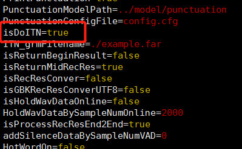

# 在线引擎声学模型替换:

1.  查找相关容器

```shell
docker ps -a | grep online
```

2.  进入到对应容器

```shell
docker exec -it online_xxx bash
```

3.  进入到声学模型目录

```shell
cd /root/rel_onlineasr/Decoder/model/cts_src/
```

4.  备份旧的声学模型文件

```shell
mv model.online.cnn_64_128.enc_96_64_32.no_md.chinese_20210102.ep55_59.bin
model.online.cnn_64_128.enc_96_64_32.no_md.chinese_20210102.ep55_59.bin_$(date +%Y%m%d_%H%M%S)
```

5.  将新的模型文件拷贝到当前目录并命名为:

```shell
model.online.cnn_64_128.enc_96_64_32.no_md.chinese_20210102.ep55_59.bin
```

6.  重启服务

# example.far文件替换

1.  查找相关容器

```shell
docker ps -a | grep online
```

2.  进入到对应容器

```shell
docker exec -it online_xxx bash
```

3.  进入到example.far文件目录

```shell
/root/rel_onlineasr/Decoder/bin
```

4.  备份旧的example.far文件

```shell
mv example.far example.far_$(date +%Y%m%d_%H%M%S)\\
```

5.  将新的模型文件拷贝到当前目录并命名为: example.far

6.  修改配置文件 启用itn

```shell
vi /root/rel_onlineasr/Decoder/model/scripts/WFSTDecoder_onlyrec.cfg
```

将isDoITN改为true



7. 重启服务

# 离线引擎声学模型替换:

1.  查找相关容器

```shell
docker ps -a | grep offline
```

2.  进入到对应容器

```shell
docker exec -it offline_xxx bash
```

3.  进入到声学模型目录

```shell
cd /root/thinkit_offline_systeme/Thinkit_Offline_SystemE/System_Offline_Server/TBNR_release_time/model/cts_src
```

4.  备份旧的声学模型文件

```shell
mv model.offline.cnn_64_128.no_md.chinese_20210102.bin
model.offline.cnn_64_128.no_md.chinese_20210102.bin_$(date +%Y%m%d_%H%M%S)
```

5.  将新的模型文件拷贝到当前目录并命名为

```shell
model.offline.cnn_64_128.no_md.chinese_20210102.bin
```

6.  重启服务
