<center><font size=6 color=blue>在线语音识别引擎部署文档

# 部署包

  - Rel\_OnlineASR-e2e\_v3.10.9\_20210708\_20210916\_withlic\_nanwang.tar.gz

  - Thinkit\_Env\_base.tar

需要mrcp的情况下

- Release\_MRCP-v2.7.1\_20210820\_20210916\_nolic\_nanwang.tar.gz

# 解压压缩包

```shell
tar -zxvf Rel_OnlineASR-e2e_v3.10.9_20210708_20210916_withlic_nanwang.tar.gz
tar -zxvf Rel_OnlineASR-e2e_v3.10.9_20210708_20220526_withlic_nanwang.tar.gz
```

# 加载镜像

```shell
docker load -i Thinkit_Env_base.tar
```

# 运行容器

根据刚才的解压文件会有一个rel\_onlineasr文件夹。

容器内部映射端口，20200是http服务，8066是websocket服务。

- 需要websocket服务

```shell
docker run -itd --name online_e2e --restart=unless-stopped -p 27528:20200 -p 27530:8066 -v /wp/aster/ws/online_asr_e2e/rel_onlineasr:/root/rel_onlineaser offline_base:v1.1
```

- 不需要websocket服务

```shell
docker run -itd --name online_e2e --restart=unless-stopped -p 27528:20200 -v /wp/aster/ws/online_asr_e2e/rel_onlineasr:/root/rel_onlineaser offline_base:v1.1
```


# 进入容器安装其他软件

```shell
docker exec -it online_e2e bash
```

清除变量痕迹

```shell
vi ~/.bashrc
```

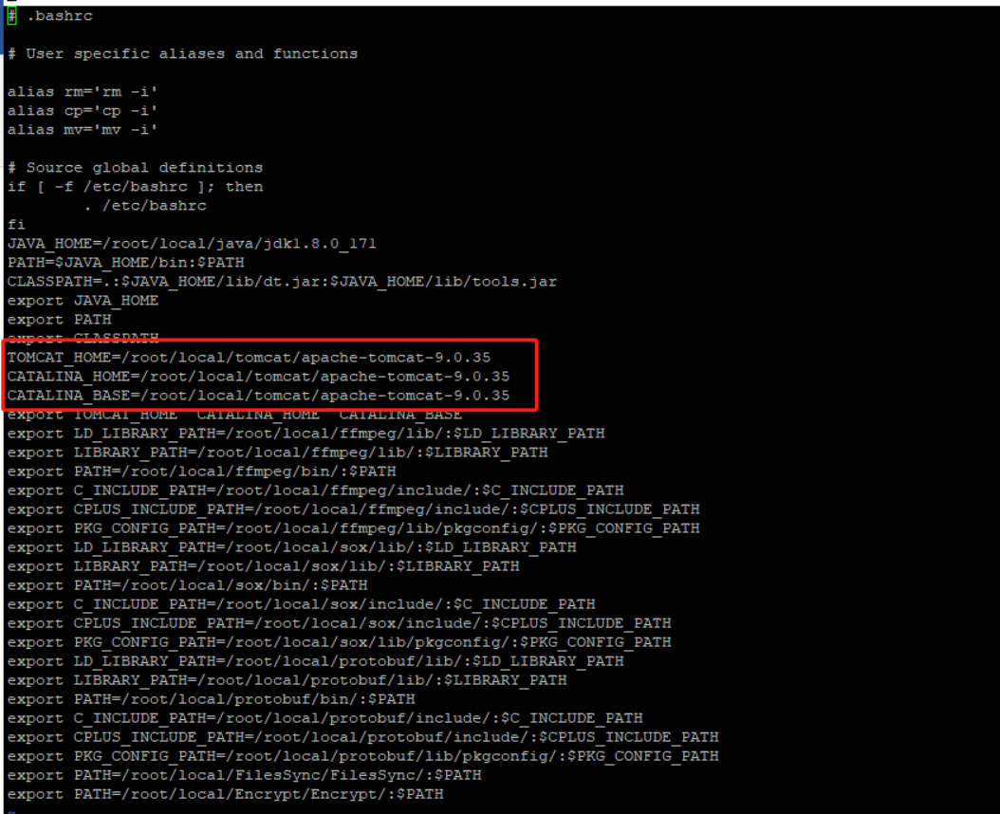

把apache-tomcat-9.0.35改成apache-tomcat-9.0.62

```shell
vi ~/.bash\_profile
```

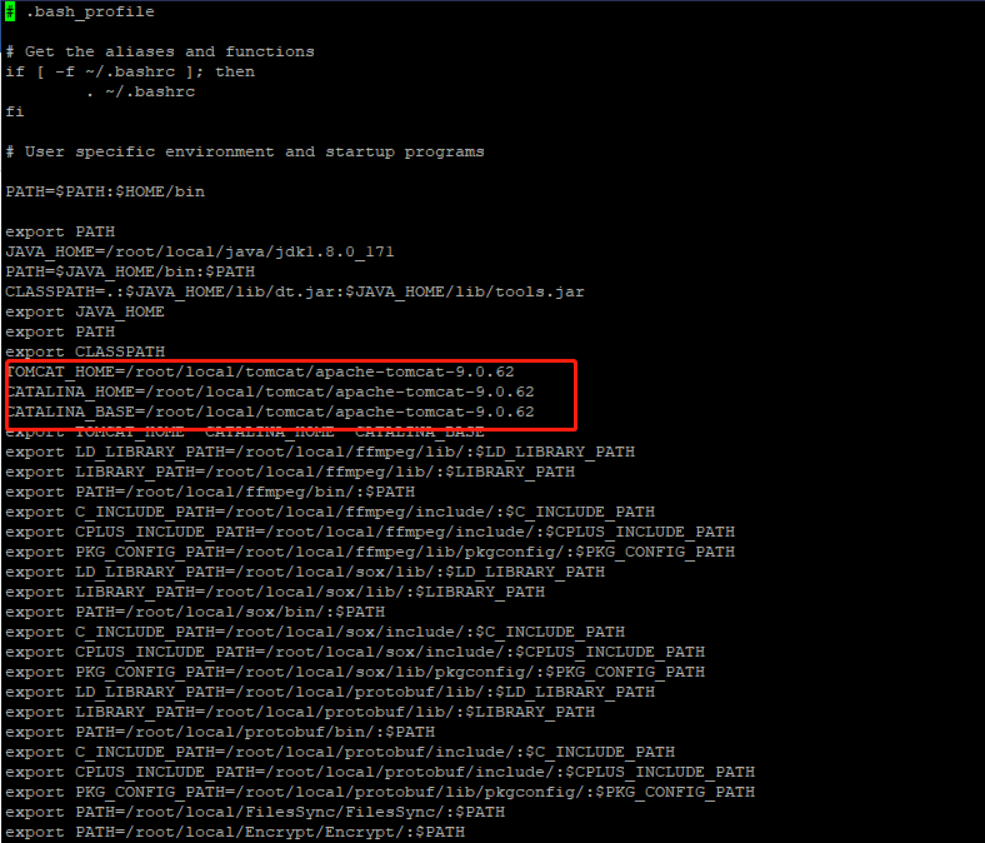

把apache-tomcat-9.0.35改成apache-tomcat-9.0.62

删除旧的tomcat

```shell
cd /root/local/tomcat
rm -rf apache-tomcat-9.0.35
cd /root/rel\_onlineaser/tools/tools\_install
```

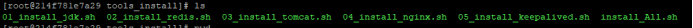

- 安装jdk

```shell
bash 01_install_jdk.sh
```

- 安装redis

```shell
bash 02_install_redis.sh
```

- 安装tomcat

```shell
bash 03_install_tomcat.sh
```


# 机器注册

```shell
cd /root/rel\_onlineaser/tools/Lic
./getinfo
```

把.info文件发给算法同事进行路数的注册

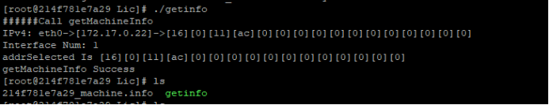

# 更新注册文件

把对应license文件复制到容器中/root/rel\_onlineaser/Decoder/bin下面，并命名为license\_120.dat

```shell
docker cp license120_10threads.dat online_e2e:/root/rel_onlineaser/Decoder/bin/license_120.dat
```

修改/root/rel\_onlineaser/Decoder/bin/decoder.sh


把这个数字修改为对应的路数

# 测试服务

- 启动redis

```shell
cd /root/local/redis/redis-3.2.0
sh cluster_install_ms.sh
```

测试解码器服务，验证机器注册是否成功

```shell
cd /root/rel_onlineaser/Decoder/bin
./decoder.sh
```

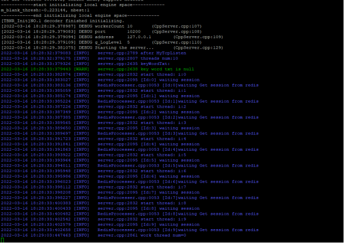

验证成功后，kill掉脚本对应的程序

- 执行start.sh

```shell
./start.sh
```

- 启动tomcat

```shell
cd /root/local/tomcat/apache-tomcat-9.0.35/bin
sh startup.sh
```

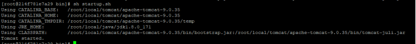

# 测试程序

位置：/root/rel\_onlineaser/tools/SDK/Linux\_Cpp/C++\_demo

修改config.ini

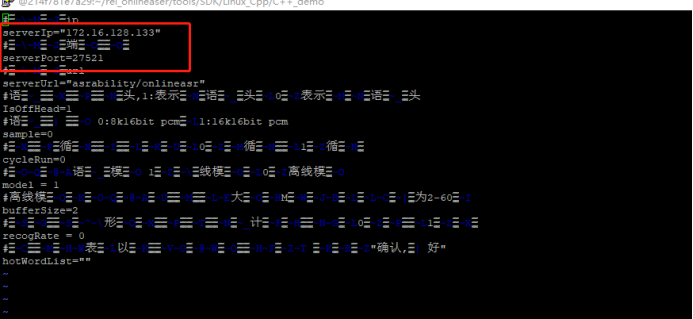

把这个改为对应ip和端口

然后执行run.sh

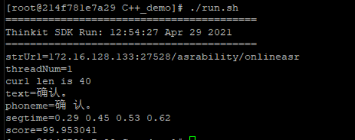

这里如果显示404，试试重启一下tomcat

如果重启tomcat的时候出现下面的问题，执行

```shell
source ~/.bashrc
source ~/.bash_profile
```

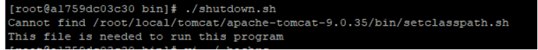

正常应该是这样的

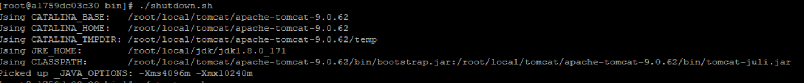

# websocket服务安装

在前面的服务按照无误后，开始安装websocket

```shell
cd /root/rel\_onlineaser/tools
tar -zxvf WebSocket.20210222.tar.gz

cd WebSocket
tar -zxvf WebSocket.20210202.tar.gz -C /root/local/

cd /root/local/WebSocket/
```

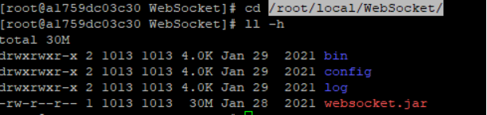

修改WebSocket/config/application.yml

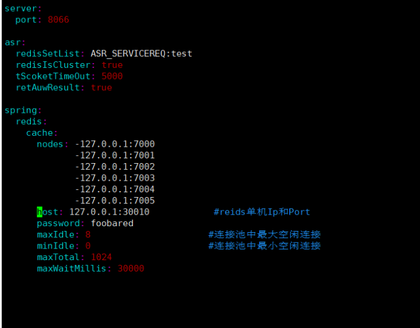

- port：服务端启动端口
- redisSetList：与decoder交互的redis队列名
- redisIsCluster：是否使用集群
- tScoketTimeOut：与decoder之间超时时间
- retAuwResult：是否返回auw中间结果
- nodes：redis集群地址
- host：redis单节点地址
- password：redis集群密码，无密码置为空

以上可以在/root/rel\_onlineaser/Decoder/conf/decode.conf里面确认

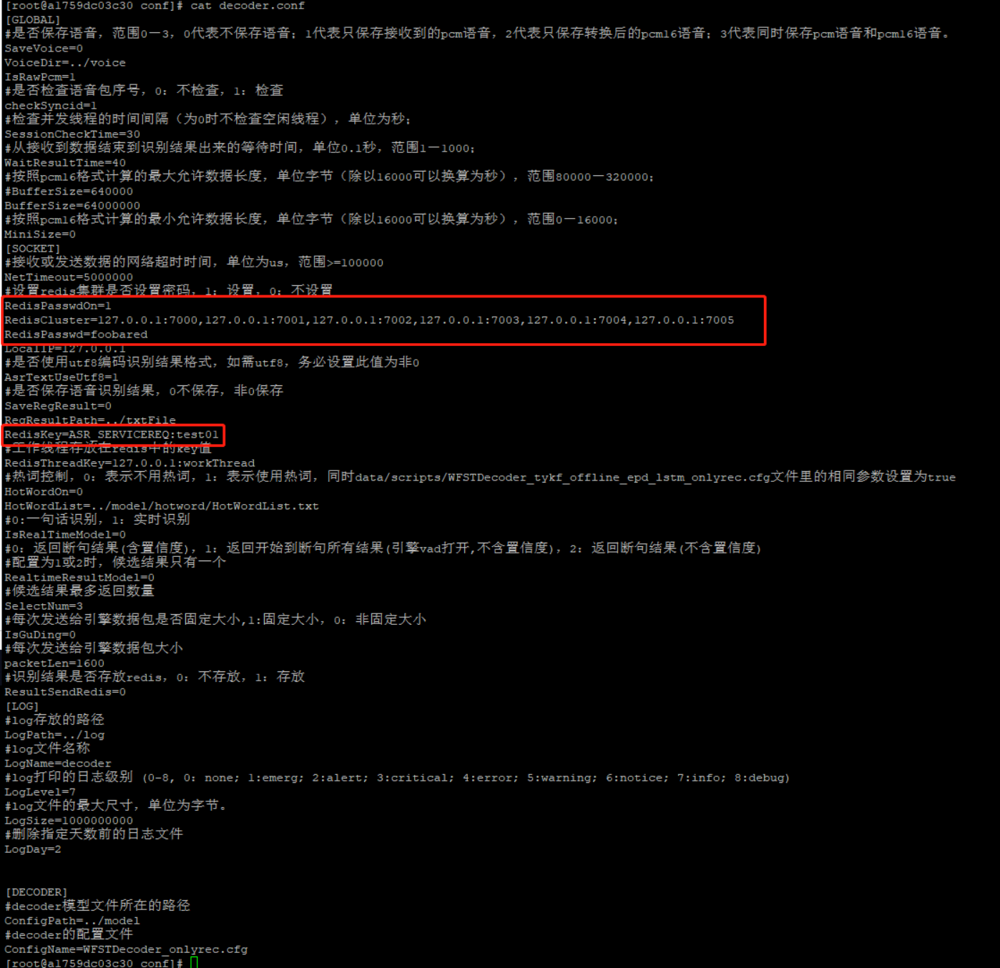

如果跟application.yml跟decode.conf里面的内容不一致修改，application.yml的内容

进入WebSocket/bin/目录执行startup.sh启动websocket

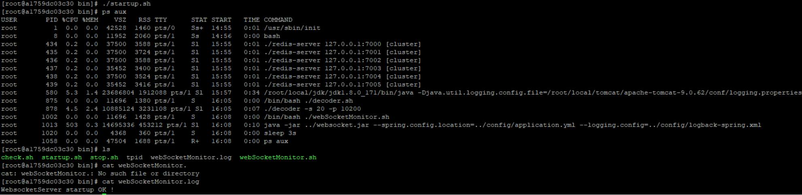

测试websocket

```shell
cd /root/rel_onlineaser/tools/SDK/JAVA
tar -zxvf WebSocketDemo.20210222.tar.gz

cd WebSocketDemo
tar -zxvf websocketASR_demo.20210205.tar.gz

cd websocketASR_demo
```

修改config/application.properties

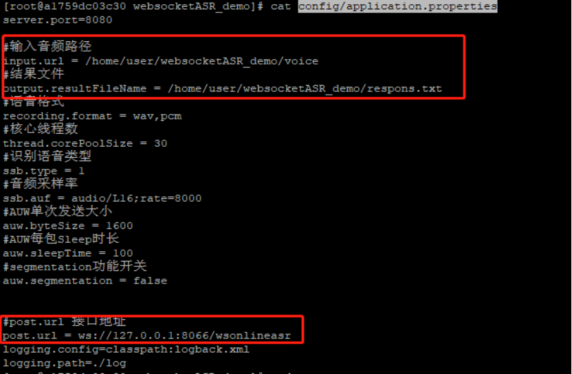

例如可以改成这样，要确保输入音频下面有录音和结果文件的路径是正确存在的

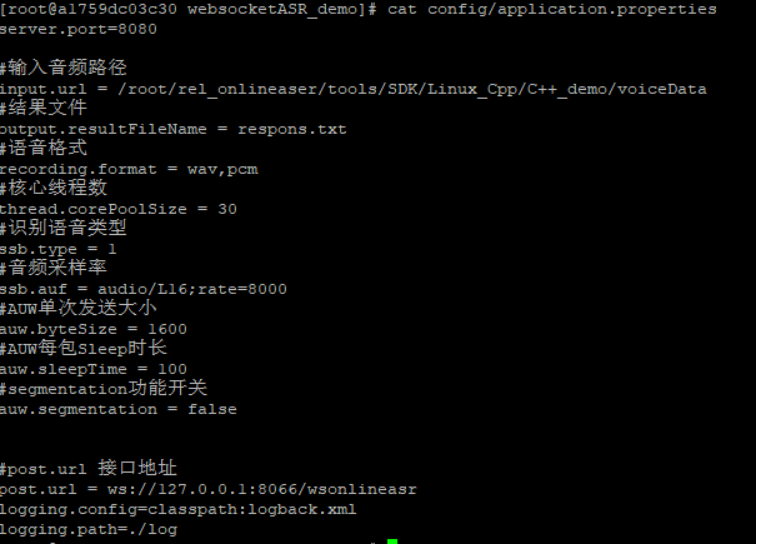

执行startup.sh

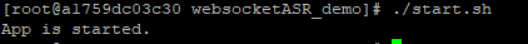

查看结果和日志

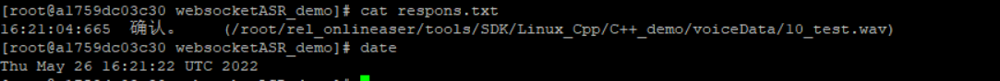

```shell
cat log/info.log
```

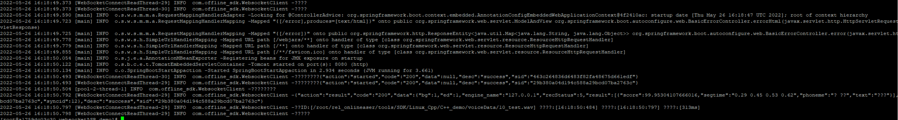

如果出现报错就会在log/error.log下面。

# 安装mrcp服务

另外附安装文档

# 附录

- 133：/wp/dockersave/asr\_model/asr\_model/model/shenzhen\_asr/online
